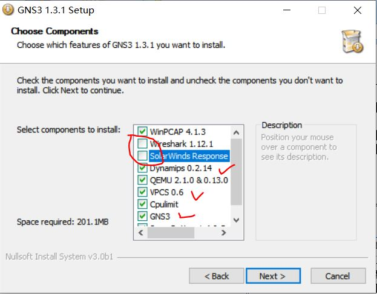
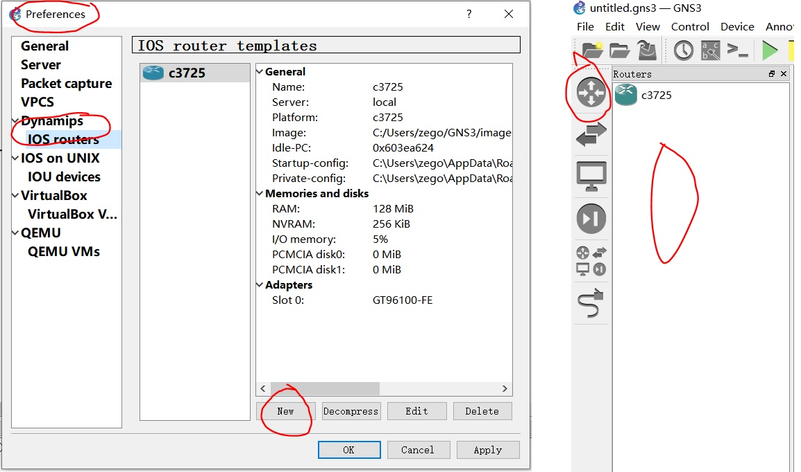
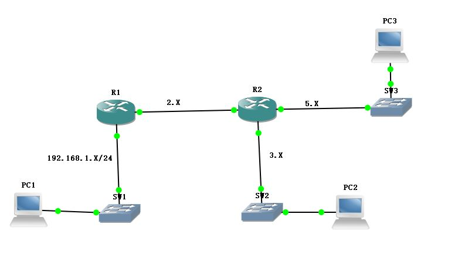
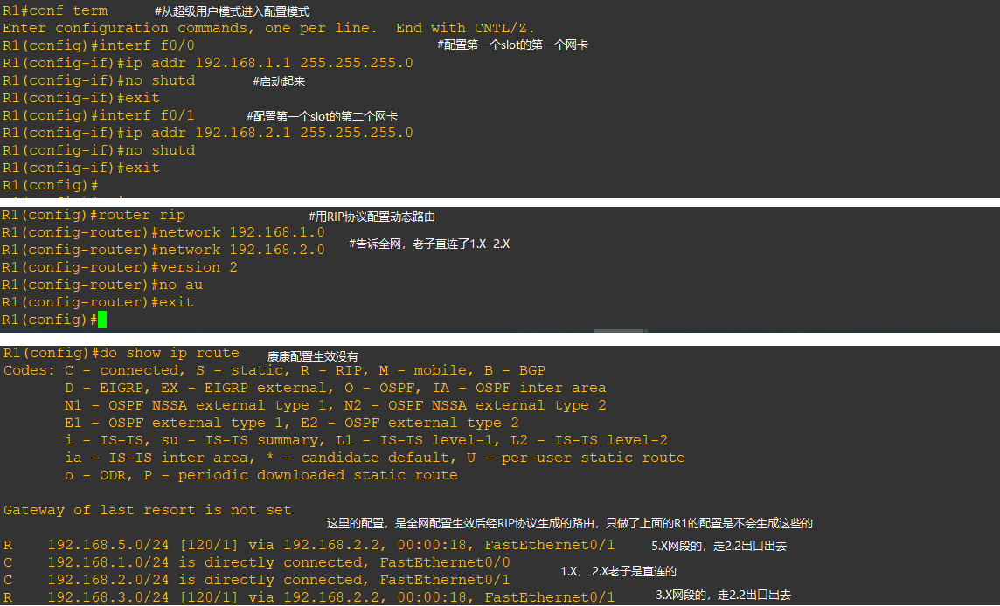
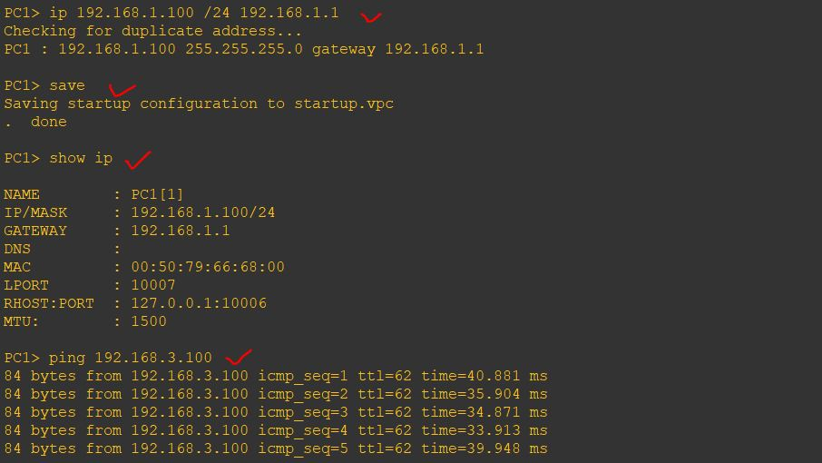
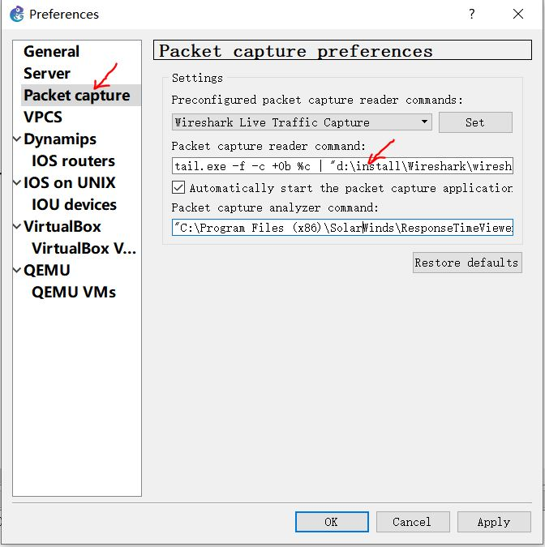
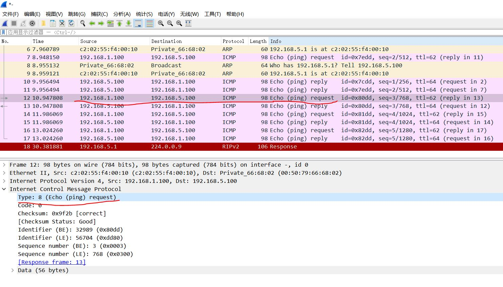

## GNS3其实很简单

GNS3是一个免费的网络工程的模拟器，利用它可以设计网络工程（例如一个办公室的局域网设计）并进行模拟。功能很强大，支持各种cisco和其他品牌的路由器的模拟、支持使用virtualbox/VMWare虚拟机在网络中加入主机节点、支持使用wireshark进行抓包。

有了GNS3，学习网络协议就不用去买昂贵的路由器/交换机了；

有了GNS3，可以在模拟环境下调试我们的c/s主机程序的一些特殊场景了；

有了GNS3，搭建网络前可以进行设计验证了。

### 1 安装与配置

我下载的是1.3版本，现在（202010）最新版本是2.2，但试用一下后发现1.3版本界面清爽简洁，所以就不改了。

安装过程比较简单，wireshark/solarwin两个组件可能自动下载不下来，去掉勾选，手动安装wireshark即可。



真正必须的是Dynamips（路由器的模拟器）、VPCS（pc终端的简单模拟器）、GNS3（主程序）。

安装成功后，很重要的一步是使用路由器镜像文件来配置路由器的模拟器，让Dynamips模拟各种品牌的模拟器。据说买了思科的硬件，是可以从硬件上方便的拷贝到一个镜像文件的。我从网上找了一个思科的路由器镜像文件。

从Edit->Preferrence菜单进去，添加一个路由器，ok后主界面的路由器组件面板里就有了一个路由器组件了：



### 2 一个简单的工程

#### 2.1 搭建网络拓扑

用一个就简单的工程来演示GNS3的使用。



如上图所示，该工程由2个路由器、3个交换机、3个终端组成，设置了1.X、2.X、3.X、5.X这4个子网段。

启动路由器和终端后（交换机不需要手动启动），点击console登录到路由器进行配置:



终端的配置比较简单：



千辛万苦配置好2个路由器、3个终端后，**千万不要stop路由器**，因为有个坑爹的事情：上述配置都是存在路由器的RAM里，重启就丢失了！

**GNS3的工程不会保存这些配置！snapshot manage菜单不会保存这些配置！import/export设备配置菜单也不会保存这些配置！这些坑都一路踩过来，心力憔悴！**

#### 2.2 保存与恢复配置

查了网上n多文章后，发现都不凑效，例如write命令会导致路由器干脆启动不了了！最后自己琢磨出一招，直观又有效：

- step1：简单修改一下路由器的配置，以便触发配置存文件
- step2：菜单：File -> export/import device configs，把配置存一个目录
- step3：会发现目录下有路由器的private和 startup配置文件，但是里面都他妈的没有你刚才修改的配置信息！
- step4：手动修改startup配置文件，把你想要的配置命令写进去
- step5：关闭设备，重新打开工程，发现只有网络拓扑，没有ip等设备配置信息。菜单：File -> export/import device configs，从刚才的目录里import配置，然后启动设备，你就看到想要的配置了。

以R1，R2两个路由器的startup配置为例：

```shell
# R1 startup配置的末尾：
!
int f0/0
ip add 192.168.1.1 255.255.255.0
no sh
!
int f0/1
ip add 192.168.2.1 255.255.255.0
no sh
!
router rip
network 192.168.1.0
network 192.168.2.0
version 2
no au
!
!
end

# R2 startup配置的末尾：
!
int f0/0
ip add 192.168.2.2 255.255.255.0
no sh
!
int f0/1
ip add 192.168.3.1 255.255.255.0
no sh
!
int f1/0
ip add 192.168.5.1 255.255.255.0
no sh
!
router rip
network 192.168.2.0
network 192.168.3.0
network 192.168.5.0
version 2
no au
!
!
end
```

VPCS还挺好的，save命令有作用。

#### 2.3 用wireshark抓线路/设备上的包

首先要确保GNS3里关于wireshark的配置是正确的，主要就是安装路径：



然后在GNS3主界面上右键点击一条线路或者设备，选择start capture，就会启动wireshark抓包了。

如下所示，对交换机SW3的连接PC3的口子进行抓包，可以看到pc1 ping pc3的ICMP请求包和应答包，偶尔也会出现RIP的包：

