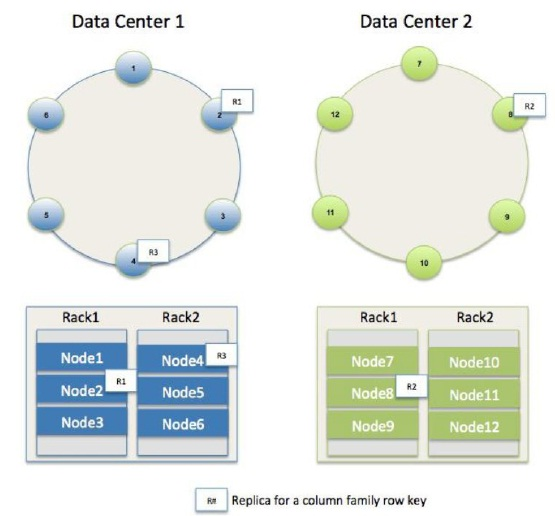
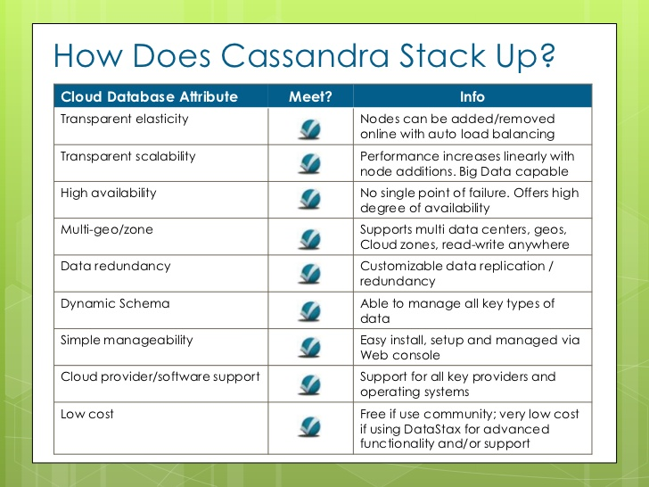

## cassandra其实挺简单

### 7句话说清楚cassandra

1. cassandra是一个开源的、去中心化的、节点间同等地位的P2P的一个数据库。
2. 支持的数据结构类似HBase，行key、column family、column、timestamp、value等概念也是类似的。适合于巨大的稀疏矩阵型的宽表：十亿行 X 百万的列的场景。提供sql语句的友好方式进行数据访问
3. cassandra使用gossip协议在不同节点（机器）间按row key同步数据，使用一致性hash在不同的节点（机器）间进行sharding。
4. cassandra的部署可以根据机架、IDC的配置信息，进行跨IDC的副本复制
5. 可以指定数据的副本的个数，包括在每个机房的副本个数
6. 每次读写数据，可以指定一致性要求，例如是读到2个副本才算成功读，写一半以上的副本数才算成功写
7. 使用commitlog+内存+磁盘的方式平衡读写性能与可靠性

借用网友的两张图：





根据网上的资料，黑石基金的技术部门、饿了么的技术部门据说都在大规模的使用cassandra。

https://cloud.tencent.com/developer/article/1084113

https://www.youtube.com/watch?v=vJVHfqE2mPM

这里简单的实验，演示cassandra跨IDC的数据库分布。

### 实验演示

我这里用香港和硅谷的两台机器，通过docker跑两个节点，演示跨IDC的数据库同步和访问。

两个机器都部署cassandra，并启动一个容器，从容器里拷贝出配置文件：

```shell
docker pull daocloud.io/cassandra
docker run --name cpy -it daocloud.io/cassandra /bin/bash
groupadd cassandra
useradd -g cassandra cassandra
mkdir /opt/cassandra; cd /opt/cassandra
docker cp cpy:/opt/cassandra/conf/cassandra.yaml ./
chown -R cassandra:cassandra /opt/cassandra; chmod -R 777  /opt/cassandra
docker stop cpy;docker rm cpy
```

编辑/opt/cassandra/cassandra.yaml文件，修改配置如下：

```
cluster_name: 'bison'
authenticator: PasswordAuthenticator
```

创建数据存放目录，并启动容器：

```shell
mkdir /var/lib/cassandra
chown -R cassandra:cassandra /var/lib/cassandra
chmod -R 777 /var/lib/cassandra

#注意修改IP为节点间通信暴露的IP
docker run -d --name cass_node1 -e CASSANDRA_BROADCAST_ADDRESS=119.28.XX.XX  \  
-e  CASSANDRA_DC=DC1 -e CASSANDRA_RACK=RAC1  \
-e  CASSANDRA_ENDPOINT_SNITCH=GossipingPropertyFileSnitch  \
-v /etc/localtime:/etc/localtime:ro \
-v /opt/cassandra/cassandra.yaml:/opt/cassandra/conf/cassandra.yaml:rw \
-v /var/lib/cassandra:/var/lib/cassandra:rw \
-u  cassandra \
-p 7000:7000 -p 9042:9042 -p 7199:7199 daocloud.io/cassandra
```

在另外一台机器上也做上述安装和启动，区别就是机器IP、容器名字和机架/IDC要改一下：

```shell
#注意修改IP为节点间通信暴露的IP
docker run -d --name cass_node2 -e CASSANDRA_BROADCAST_ADDRESS=49.51.XX.XX  \  
-e  CASSANDRA_DC=DC2 -e CASSANDRA_RACK=RAC1  \
-e  CASSANDRA_ENDPOINT_SNITCH=GossipingPropertyFileSnitch  \
-e  CASSANDRA_SEEDS=119.28.XXX.XXX \  #香港的那个机器作为种子，这样集群的成员节点就相互知道了
-v /etc/localtime:/etc/localtime:ro \
-v /opt/cassandra/cassandra.yaml:/opt/cassandra/conf/cassandra.yaml:rw \
-v /var/lib/cassandra:/var/lib/cassandra:rw \
-u  cassandra \
-p 7000:7000 -p 9042:9042 -p 7199:7199 daocloud.io/cassandra
```

如果不出意外，集群就部署起来了，可以使用nodetool查看集群状态：

```shell
docker exec -it cass_node2 /bin/bash
nodetool  status #在容器里面执行
```

显示结果如下：

```shell
cassandra@0ae069411888:/$ nodetool  status
Datacenter: DC1
===============
Status=Up/Down
|/ State=Normal/Leaving/Joining/Moving
--  Address        Load       Tokens       Owns    Host ID                               Rack
UN  119.28.xxx.xxx  6.27 MiB   256          ?       56680a4f-18e9-404c-929e-787ecb6aab63  RAC1
Datacenter: DC2
===============
Status=Up/Down
|/ State=Normal/Leaving/Joining/Moving
--  Address        Load       Tokens       Owns    Host ID                               Rack
UN  49.51.xxx.xxx  564.84 KiB  256          ?       f6fb4fdf-b99c-4ffb-a9bd-c71db8be13e2  RAC1

Note: Non-system keyspaces don't have the same replication settings, effective ownership information is meaningless


```

继续在容器内使用cqlsh工具访问数据：

```sql
cqlsh -ucassandra -pcassandra

> CREATE KEYSPACE testdb WITH replication = {'class': 'NetworkTopologyStrategy', 'DC1': '1', 'DC2': '1'} ;
> CREATE TABLE testdb.user (id int PRIMARY KEY, name text);
> insert into testdb.user(id, name) values(1, 'bison');
> select * from testdb.user;
```

### 编程访问cassandra

以python为例，拉取必要的驱动/sdk：

```
pip3 install cassandra-driver
```

```python
# -*- encoding: utf-8 -*-
# 引入Cluster模块
from cassandra.cluster import Cluster
from cassandra.auth import PlainTextAuthProvider
from cassandra import ConsistencyLevel
from cassandra.query import SimpleStatement


auth_provider = PlainTextAuthProvider(username='cassandra', password='cassandra')
cluster = Cluster(["119.28.XXX.XXX"],auth_provider= auth_provider)
# 连接并创建一个会话
session = cluster.connect("testdb")
session.execute("CREATE TABLE testdb.user (    id int PRIMARY KEY,    name text);")
rows = session.execute('select * from user limit 10;')
for row in rows:
    print(row)

for i in range(1000000):
    sql="insert into user(id, name)values(%d,'bison %s')"%(i, i)
    simple_statement = SimpleStatement(sql, consistency_level=ConsistencyLevel.LOCAL_ONE)
    session.execute(simple_statement)
    if (i%10001) == 0:
        print("i=",i)
cluster.shutdown()
# 查看是否关闭连接
print(cluster.is_shutdown)
```

在本机运行，避免远程网络访问的话，测得每秒插入1176行记录(只写香港本地datacenter)。

一致性级别如果改为ALL，那就意味着美国的DC和香港DC的副本需要都写成功才成功返回，每秒插入6.25次，每次时延160ms，而香港ping美国的时延是144ms，符合预期。

### 验证设想

#### 设想一：一个IDC故障/宕机，另外一个IDC还可以读写

将香港机器上的docker容器停止，或者使用安全规则使得两个机器不能相互访问，继续在美国的机器上读写数据，实验符合预期。

```sql
cqlsh -ucassandra -pcassandra

> consistency LOCAL_ONE
> insert into testdb.user(id, name) values(2, 'liao');
> select * from testdb.user; #不会报错
> consistency TWO
> select * from testdb.user;  #会报错
```

把香港机器上的docker容器启动起来，很短的时间后，在香港的机器上应该也可以拉取到新插入的数据。并且这是用用TWO/ALL/QUORUM等一致性级别来读写数据都是ok的。符合预期

#### 设想二：远距离的datacenter之间是否可以及时的同步

验证方法：

1. 使用经过ntpd校准时间的腾讯云服务器
2. 在香港的服务器用python脚本插入数据，数据中记录了当前插入的时间，抽样将插入的某些记录tcp报文发送到美国的服务器，通知美国服务器查一下本地是否收到了该数据，并比对时间差/时延
3. 在美国用python监听一个tcp服务端口，如果收到一个id，就去testdb.user里查询本地IDC里存储的对应的记录，看看该记录的插入时间与当前时间的差异

结论：

实验发现，简单的两三个节点组成的集群，负载比较低的情况下（每秒几百上千QPS插入），远距离的datacenter之间的同步是及时的，显示时延100ms左右。（美国香港间ping的rtt为144ms，看起来ntpd没有把时间校准到足够精确, 交换两个脚本的角色可以抵消）

```
#香港插入，美国检查时间差
1605948260176 113
1605948260492 85
1605948260881 114
1605948261195 84
1605948261553 84
1605948261899 83
1605948262243 87

#美国插入，香港检查时间差
1606048730912 171
1606048730914 93
1606048731064 163
1606048731072 93
1606048731216 154
1606048731365 224
1606048731367 144
1606048731518 216

```
美国服务器上运行的脚本：

```python
from cassandra.cluster import Cluster
from cassandra.auth import PlainTextAuthProvider
from cassandra import ConsistencyLevel
from cassandra.query import SimpleStatement

import datetime
import time
import socket
import sys
def start_cassandra():
    auth_provider = PlainTextAuthProvider(username='cassandra', password='cassandra')
    #cluster = Cluster(["119.28.214.71"],auth_provider= auth_provider)
    cluster = Cluster(["127.0.0.1"],auth_provider= auth_provider)
    # 连接并创建一个会话
    session = cluster.connect("testdb")
    return cluster, session

def do_tcp_server(ip, port):
  cluster,session = start_cassandra()
  #create socket
  sock = socket.socket(socket.AF_INET, socket.SOCK_STREAM)
  server_address = (ip, port)
  #bind port
  print('starting listen on ip %s, port %s'%server_address)
  sock.bind(server_address)
  #starting listening, allow only one connection
  try:
    sock.listen(1)
  except socket.error as e:
    print("fail to listen on port %s"%e)
    sys.exit(1)
  while True:
    print("waiting for connection")
    client,addr = sock.accept()
    print('having a connection')
    while True:
        leftlen = 13
        req=""
        while leftlen > 0:
            data = client.recv(leftlen)
            if not data:
                break
            #print(type(data))
            leftlen -= len(data)
            req = req+data.decode("utf-8") #这里不是很严谨，收到的部分数据不一定保证完整的utf8
        if len(req) != 13:
            print("req=[%s]"%req)
            break

        found = False
        while not found: #一次两次可能还查不到，因为还没有从香港同步到美国
            sql="select * from  user where id=%s"%(req)
            simple_statement = SimpleStatement(sql, consistency_level=ConsistencyLevel.LOCAL_ONE)
            rows = session.execute(simple_statement)
            current = time.time()
            current = int(round(current * 1000))
            for row in rows:
                print(current, current-int(row[1]))
                found = True

    client.close()

if __name__ == '__main__':
    do_tcp_server("0.0.0.0", 4951)
```

香港服务器运行的脚本

```python
# -*- encoding: utf-8 -*-
from cassandra.cluster import Cluster
from cassandra.auth import PlainTextAuthProvider
from cassandra import ConsistencyLevel
from cassandra.query import SimpleStatement

import datetime
import time
import socket
import sys
def start_cassandra():
    auth_provider = PlainTextAuthProvider(username='cassandra', password='cassandra')
    #cluster = Cluster(["119.28.214.71"],auth_provider= auth_provider)
    cluster = Cluster(["127.0.0.1"],auth_provider= auth_provider)
    # 连接并创建一个会话
    session = cluster.connect("testdb")
    return cluster, session

def start_tcp_client(ip, port):
  #server port and ip
  server_ip = ip
  server_port = port
  tcp_client = socket.socket(socket.AF_INET, socket.SOCK_STREAM)
  try:
    tcp_client.connect((server_ip, server_port))
  except socket.error:
    print('fail to setup socket connection')
  return tcp_client
  
if __name__ == '__main__'
        tcp_client = start_tcp_client("49.51.xx.xx", 4951)
        cluster, session = start_cassandra()
        session.execute("DROP TABLE testdb.user ;")
        session.execute("CREATE TABLE testdb.user (    id int PRIMARY KEY,    name text);")

        for i in range(1000000):
            current = time.time()
            current = int(round(current * 1000))
            sql="insert into user(id, name)values(%d,'%d')"%(i, current)
            simple_statement = SimpleStatement(sql, consistency_level=ConsistencyLevel.ONE)
            session.execute(simple_statement)
            if ((i+1)%97 ) == 7:
                req = "%13d"%(i)
                print(req)
                tcp_client.send(req.encode('utf-8'))
        cluster.shutdown()
```


### 参考文档

一致性级别的参考文档：

https://docs.datastax.com/en/archived/cassandra/2.0/cassandra/dml/dml_config_consistency_c.html

一个机器宕机后，cqlsh也无法连接另一个机器的问题解答：

https://stackoverflow.com/questions/44883940/cassandra-cannot-achieve-consistency-level-quorum

如何在一个服务器上利用docker部署多个cassandra节点，但我没有搞定，后来又买了一台机器组成三个机房/节点：

https://www.cnblogs.com/stoneFang/p/6715298.html

各种数据库的特性对比：

https://kkovacs.eu/cassandra-vs-mongodb-vs-couchdb-vs-redis