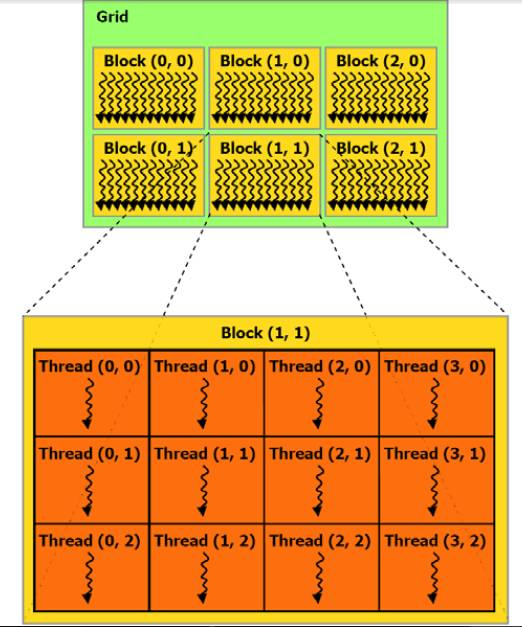

# CUDA初体验 #

## CUDA的线程组织架构 ##

一个grid包含若干个block，一个block包含若干个thread。

1、  一维的方式：假设已知一对明文-密文对和加密算法，要对9百万个可能的密钥进行尝试（暴力破解一个密钥）。 我们准备启用9百万个线程，每个线程负责一个密钥可能值的尝试。我们定义一个grid包含1000个block，每个block包含9000个线程：
dim3 dimBlock(9000);
dim3 dimGrid(1000);

调用尝试密钥的函数testKey:

testKey<<<dimBlock, dimGrid>>>(A, B, C);

 

testKey的函数体内部怎么知道当前线程的ID呢？ 这样：

int threadId = blockDim.x * blockIdx.x + threadIdx.x;

 

上面调用那里也可以直接是两个整数：

int threadNumPerBlock = 9000;

int blockNumPerGrid = 1000

testKey<<<blockNumPerGrid, threadNumPerBlock>>>(A, B, C);

而testkey函数提内部还是用上面的方式获得当前线程的ID

2、  二维的方式：假设我们要对20000*10000的一个矩阵的每个元素进行并行的修改。准备启动1w*1w个线程，每个线程负责对一个元素进行修改。我们定义一个20*10大小的Grid，即这个Grid包含20*10个block，每个Block尺寸为1000*1000，即每个block包含1000*1000个thread。

dim3 dimGrid(10, 10);
dim3 dimBlock(1000, 1000);

vectorModify<<<dimGrid, dimBlock>>>(A,B,C);

vectorModify函数体内这样获得当前thread的ID（两位的下标）：

int  threadId_x = blockIdx.x * dimBlock.x + threadIdx.x;

int  threadId_y = blockIdx.y * dimBlock.y + threadIdx.y;

这样就用threadId_x和threadId_y直接作为下标去访问vector了：

Vector[ threadId_x][threadId_y] = ….

3、  三维方式，理论上也是支持的，但一方面用得比较少，一方面不直观，就不扯了

4、  块之间不能有执行上的依赖，不同的块可能被随意调度，可能串行执行也可能并行，时间先后也不确定。

5、  块内的线程的执行，可以使用共享内存进行数据共享，可以使用__syncthreads()等函数做时序的同步

6、  主机内存和设备内存是分开的，设备内存情况：

a)         每个线程有自己的私有内存和寄存器；

b)         块内的线程有共享内存(shared memory)，对块内线程可见，生命周期同该block；

c)         所有线程共享全局内存（global memory）;

d)         另外还有全局的常量内存区和纹理内存；

e)         全局内存、常量内存、纹理内存的生命周期同应用程序的进程

7、  当主机 CPU 上的 CUDA 程序调用内核网格时，grid里的block将被枚举并分发到具有可用执行容量的多处理器上。一个block里的线程在一个多处理器上并发执行。在线程块终止时，将在空闲多处理器上启动新块。

 

## CUDA编程与普通C的不同之处 ##

 

1、  在GPU上运行的函数，体内不能定义static变量

2、  在GPU运行的代码，不能用函数指针。

3、  在GPU上运行的函数，无法进行“external call”，例如A.cu（相当于普通编程下的A.cpp）里定义函数funcA，B.cu无法#include “A.h”并调用funcA， 只能是直接在B.cu里直接#include “A.cu”，也就是把函数定义直接在B.cu里展开一份。当然更别提调用A.o里的funcA了

4、  可用的库非常少,CUDA提供了一些傅立叶变换库、数学计算库、thrust库（类似stl）等有限的几个库， strlen等常见函数都得自己写。我是直接从libc里拷贝代码到自定义文件libc_4_cuda.cu里。用到这些函数的cu文件都在开头#include一下libc_4_cuda.cu。这个限制有点大。希望NVIDIA能提供更丰富的库。不过malloc free memcpy几个函数又提供了，设备内存也有堆的概念。

5、  在GPU上运行的函数，不是像误解的那样只支持简单的浮点加减，可以有循环、分支等各种语句，也可以声明整数、字符串、结构体等等数据类型。这一方面的限制其实很少。不过文档说循环、分支语句对执行性能有很大的影响。

6、  CUDA扩展C语言之一：函数修饰符

a) __device__ 该函数在设备上运行，从设备上call起

b) __global__ 该函数在设备上运行，从主机上call起

c) __host__ 该函数在主机上运行和call起

7、  从主机上call起kernel函数（__global__修饰）后，CPU立即从该函数返回了，因为设备和主机是异步执行的。但是cudaMemcpy这个函数是同步函数，当cpu执行到这里，会等待GPU完成所有的工作后开始内存拷贝。

8、  CUDA扩展c语言之二：变量修饰符

a) 设备上运行的函数内的自动变量，不需要特别修饰，

b)  __device__独立用的时候

i.  在全局内存区

ii.和应用程序进程相同的生命周期

iii. 所有线程可访问，主机也可以通过cudaGetSymbolAddress（）等函数访问该变量

c)  __constant__修饰变量的时候

i. 变量在常量区

ii. 和应用程序进程相同的生命周期

iii.  所有线程可访问，主机也可以通过cudaGetSymbolAddress（）等函数访问该变量

d)         __shared__ 修饰变量的时候

i. 位于块的共享内存区

ii.  和块的生命周期一致

iii. 块内线程可访问

e)经常犯的错误是，使用全局变量的时候，没有意识到GPU下是大量线程并行的。例如分配一个全局变量用于记录线程执行的错误信息。正确的做法是为每个线程分配上下文，包括输入参数、输出参数、执行结果和错误信息等等。

9、  CUDA扩展C语言之三：内置变量

a) gridDim

b) blockIdx

c)blockDim

d)threadIdx

e)  warpSize

## 常见问题 ##

**1、  黑屏**

当kernel函数比较复杂的时候，过几秒就黑屏，程序结束，屏幕恢复。我一开始以为是kernel函数太复杂，把线程的内存资源用光导致，后来一查网上信息，据说是显卡上运行时间的限制。当网上众说纷纭：

a) Windows对显卡驱动bug防御性编程，发现显卡长时间没有反应，就会重启显卡驱动程序

b) Linux如果不用图形界面，就没有限制

c) 多块显卡，不接显示器的且没有扩展桌面的没有限制

d)  修改注册表，可以解决限制

e) GPU的属性里有一项内核运行时间限制，修改为NO就可以解决

我尽量做各种尝试，发现不凑效。后来重启了电脑，就可以了。我猜想应该是因为我修改了注册表。

在[HKEY_LOCAL_MACHINE\SYSTEM\CurrentControlSet\Control\GraphicsDrivers]这个位置增加一个二进制项"TdrLevel"=dword:00000000并重新启动电脑，接不接显示器的GPU都没有时间限制了

**2、  cudaMemcpy、cudaMemcpyFromSymbol诡异的表现**

例如当__global__函数修改全局变量，直接对全局变量赋值，或者通过指向全局变量的该函数的参数赋值，居然会影响__global__函数执行后在主机上cudaMemcpyFromSymbol的成败。原因尚不清楚，cuda的官方文档也是一坨屎。