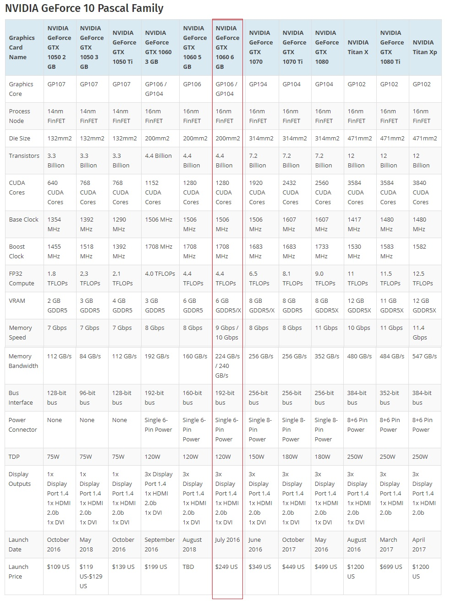

# CUDA初体验 #

这篇文章有点老了，写于2012年的左右。

## CUDA的线程组织架构 ##

一个grid包含若干个block，一个block包含若干个thread。

1、  一维的方式：假设已知一对明文-密文对和加密算法，要对9百万个可能的密钥进行尝试（暴力破解一个密钥）。 我们准备启用9百万个线程，每个线程负责一个密钥可能值的尝试。我们定义一个grid包含1000个block，每个block包含9000个线程：
dim3 dimBlock(9000);
dim3 dimGrid(1000);

调用尝试密钥的函数testKey:

testKey<<<dimBlock, dimGrid>>>(A, B, C);

 

testKey的函数体内部怎么知道当前线程的ID呢？ 这样：

int threadId = blockDim.x * blockIdx.x + threadIdx.x;

 

上面调用那里也可以直接是两个整数：

int threadNumPerBlock = 9000;

int blockNumPerGrid = 1000

testKey<<<blockNumPerGrid, threadNumPerBlock>>>(A, B, C);

而testkey函数提内部还是用上面的方式获得当前线程的ID

2、  二维的方式：假设我们要对20000*10000的一个矩阵的每个元素进行并行的修改。准备启动1w*1w个线程，每个线程负责对一个元素进行修改。我们定义一个20*10大小的Grid，即这个Grid包含20*10个block，每个Block尺寸为1000*1000，即每个block包含1000*1000个thread。

dim3 dimGrid(10, 10);
dim3 dimBlock(1000, 1000);

vectorModify<<<dimGrid, dimBlock>>>(A,B,C);

vectorModify函数体内这样获得当前thread的ID（两位的下标）：

int  threadId_x = blockIdx.x * dimBlock.x + threadIdx.x;

int  threadId_y = blockIdx.y * dimBlock.y + threadIdx.y;

这样就用threadId_x和threadId_y直接作为下标去访问vector了：

Vector[ threadId_x][threadId_y] = ….


3、  三维方式，理论上也是支持的，但一方面用得比较少，一方面不直观，就不扯了

4、  块之间不能有执行上的依赖，不同的块可能被随意调度，可能串行执行也可能并行，时间先后也不确定。

5、  块内的线程的执行，可以使用共享内存进行数据共享，可以使用__syncthreads()等函数做时序的同步

6、  主机内存和设备内存是分开的，设备内存情况：

a)         每个线程有自己的私有内存和寄存器；

b)         块内的线程有共享内存(shared memory)，对块内线程可见，生命周期同该block；

c)         所有线程共享全局内存（global memory）;

d)         另外还有全局的常量内存区和纹理内存；

e)         全局内存、常量内存、纹理内存的生命周期同应用程序的进程

7、  当主机 CPU 上的 CUDA 程序调用内核网格时，grid里的block将被枚举并分发到具有可用执行容量的多处理器上。一个block里的线程在一个多处理器上并发执行。在线程块终止时，将在空闲多处理器上启动新块。

 

## CUDA编程与普通C的不同之处 ##

 

1、  在GPU上运行的函数，体内不能定义static变量

2、  在GPU运行的代码，不能用函数指针。

3、  在GPU上运行的函数，无法进行“external call”，例如A.cu（相当于普通编程下的A.cpp）里定义函数funcA，B.cu无法#include “A.h”并调用funcA， 只能是直接在B.cu里直接#include “A.cu”，也就是把函数定义直接在B.cu里展开一份。当然更别提调用A.o里的funcA了

4、  可用的库非常少,CUDA提供了一些傅立叶变换库、数学计算库、thrust库（类似stl）等有限的几个库， strlen等常见函数都得自己写。我是直接从libc里拷贝代码到自定义文件libc_4_cuda.cu里。用到这些函数的cu文件都在开头#include一下libc_4_cuda.cu。这个限制有点大。希望NVIDIA能提供更丰富的库。不过malloc free memcpy几个函数又提供了，设备内存也有堆的概念。

5、  在GPU上运行的函数，不是像误解的那样只支持简单的浮点加减，可以有循环、分支等各种语句，也可以声明整数、字符串、结构体等等数据类型。这一方面的限制其实很少。不过文档说循环、分支语句对执行性能有很大的影响。

6、  CUDA扩展C语言之一：函数修饰符

a) __device__ 该函数在设备上运行，从设备上call起

b) __global__ 该函数在设备上运行，从主机上call起

c) __host__ 该函数在主机上运行和call起

7、  从主机上call起kernel函数（__global__修饰）后，CPU立即从该函数返回了，因为设备和主机是异步执行的。但是cudaMemcpy这个函数是同步函数，当cpu执行到这里，会等待GPU完成所有的工作后开始内存拷贝。

8、  CUDA扩展c语言之二：变量修饰符

a) 设备上运行的函数内的自动变量，不需要特别修饰，

b)  __device__独立用的时候

i.  在全局内存区

ii.和应用程序进程相同的生命周期

iii. 所有线程可访问，主机也可以通过cudaGetSymbolAddress（）等函数访问该变量

c)  __constant__修饰变量的时候

i. 变量在常量区

ii. 和应用程序进程相同的生命周期

iii.  所有线程可访问，主机也可以通过cudaGetSymbolAddress（）等函数访问该变量

d)         __shared__ 修饰变量的时候

i. 位于块的共享内存区

ii.  和块的生命周期一致

iii. 块内线程可访问

e)经常犯的错误是，使用全局变量的时候，没有意识到GPU下是大量线程并行的。例如分配一个全局变量用于记录线程执行的错误信息。正确的做法是为每个线程分配上下文，包括输入参数、输出参数、执行结果和错误信息等等。

9、  CUDA扩展C语言之三：内置变量

a) gridDim

b) blockIdx

c)blockDim

d)threadIdx

e)  warpSize

## GPU的指标

2019.5.28：

以我笔记本电脑上的GTX1060为例：



可以看到：

1. 1280个cuda核
2. 集成电路里晶体管数目44亿，16nm技术
3. 每秒浮点运算次数4.4万亿次
4. 显存6G大小
5. 显存带宽224GB/s
6. 功耗120w
7. 发售时间和发售价格：2016年，当时价格为249美金

有两个指标不好区分：memory speed和 memory bandwidth。

查了网上的资料，了解到：

1. memory speed是内存的数据排线单个引脚的传输速度，GTX1060是9-10Gbps。更底层的一个指标
2.  memory bandwidth是更上层的宏观指标 。
3. 两者换算关系：GTX1060有192个引脚，所以带宽是 192 * 10Gbps / 8b/B = 240GB/s

## 常见问题 ##

### 1、  黑屏 ###

当kernel函数比较复杂的时候，过几秒就黑屏，程序结束，屏幕恢复。我一开始以为是kernel函数太复杂，把线程的内存资源用光导致，后来一查网上信息，据说是显卡上运行时间的限制。当网上众说纷纭：

a) Windows对显卡驱动bug防御性编程，发现显卡长时间没有反应，就会重启显卡驱动程序

b) Linux如果不用图形界面，就没有限制

c) 多块显卡，不接显示器的且没有扩展桌面的没有限制

d)  修改注册表，可以解决限制

e) GPU的属性里有一项内核运行时间限制，修改为NO就可以解决

我尽量做各种尝试，发现不凑效。后来重启了电脑，就可以了。我猜想应该是因为我修改了注册表。

在[HKEY_LOCAL_MACHINE\SYSTEM\CurrentControlSet\Control\GraphicsDrivers]这个位置增加一个二进制项"TdrLevel"=dword:00000000并重新启动电脑，接不接显示器的GPU都没有时间限制了

### 2、  cudaMemcpy、cudaMemcpyFromSymbol诡异的表现 ###

例如当__global__函数修改全局变量，直接对全局变量赋值，或者通过指向全局变量的该函数的参数赋值，居然会影响__global__函数执行后在主机上cudaMemcpyFromSymbol的成败。原因尚不清楚，cuda的官方文档也是一坨屎。

### 3、核函数复杂度大导致运行失败 ###

2019.2.10：最近在音频编码中需要对大量的数据做DCT变换，所以在windows+GPU环境下写了一个核函数对大块的数据做DCT。发现当核函数本身运算量比较大，或者并发的block/thread比较多的时候，就会运行失败。

具体体现是启动核函数异步执行后 再同步执行的cudaMemcpy拷贝运算结果时候失败，错误信息也比较费解:unspecific launch failure。后来把参数改小、降低运算复杂度，就能正确执行了。

而且更加好玩的是：某个复杂度的核函数，当笔记本电脑外接电源情况下运行ok，使用电池的情况下运行失败。

CUDA官网的FAQ里有回答这个问题：

**Q: What is the maximum kernel execution time? **

On Windows, individual GPU program launches have a maximum run time of around 5 seconds. Exceeding this time limit usually will cause a launch failure reported through the CUDA driver or the CUDA runtime, but in some cases can hang the entire machine, requiring a hard reset.

This is caused by the Windows "watchdog" timer that causes programs using the primary graphics adapter to time out if they run longer than the maximum allowed time.

For this reason it is recommended that CUDA is run on a GPU that is NOT attached to a display and does not have the Windows desktop extended onto it. In this case, the system must contain at least one NVIDIA GPU that serves as the primary graphics adapter.

因此，在实际应用中，如果有大运算量本来一个核函数可以搞定的，需要拆分为细粒度的多次调用核函数。

一开始我还担心在linux下可以使用GPU/CUDA的caffe在windows下不能正常使用GPU/CUDA，实验验证没有问题。

这里是[dct的代码](code/cuda/dct.cu)

### 4、在python里使用CUDA加速通用计算

在安装好cuda后，检查cuda的版本：

```shell
>nvidia-smi
Sat Aug 26 21:21:32 2023
+---------------------------------------------------------------------------------------+
| NVIDIA-SMI 531.14                 Driver Version: 531.14       CUDA Version: 12.1     |
|-----------------------------------------+----------------------+----------------------+
| GPU  Name                      TCC/WDDM | Bus-Id        Disp.A | Volatile Uncorr. ECC |
| Fan  Temp  Perf            Pwr:Usage/Cap|         Memory-Usage | GPU-Util  Compute M. |
|                                         |                      |               MIG M. |
|=========================================+======================+======================|
|   0  NVIDIA GeForce GTX 1060       WDDM | 00000000:01:00.0 Off |                  N/A |
| N/A   39C    P0               23W /  N/A|      0MiB /  6144MiB |      1%      Default |
|                                         |                      |                  N/A |
+-----------------------------------------+----------------------+----------------------+

+---------------------------------------------------------------------------------------+
| Processes:                                                                            |
|  GPU   GI   CI        PID   Type   Process name                            GPU Memory |
|        ID   ID                                                             Usage      |
|=======================================================================================|
|  No running processes found                                                           |
+---------------------------------------------------------------------------------------+
```

用pip命令安装对应版本的cupy：

```shell
>pip3 install cupy-cuda12x
#我一开始pip3 install cupy怎么都编译不通过
```

写一个简单的示例代码，关于20万个1536维的向量的余弦相似度：

```python
import numpy as np
import cupy as cp
import datetime
import time
import torch

ROW=200000
COL=1536

unix_timestamp = (datetime.datetime.now() - datetime.datetime(1970, 1, 1)).total_seconds()
np.random.seed(int(unix_timestamp))

def genData()->np.ndarray:
    return np.random.randint(-65535, 65535, (ROW, COL), np.int32) / 65537

multiply = cp.ElementwiseKernel(
   'float32 x, float32 y',
   'float32 z',
   'z = x * y',
   'multiply')
similar = cp.ElementwiseKernel(
   'float32 x, float32 y, float32 z',
   'float32 result',
   'result = x / (sqrt(y) * sqrt(z))',
   'similar')

a = genData()# type:np.ndarray
a = a.astype(np.float32)
a = cp.asarray(a)

'''b = genData() #type:np.ndarray
b = b.astype(np.float32)
b = cp.asarray(b)'''
# 假设要搜索的元素的embedding等于a[1]，把它broadcast为同a的形状，a和b可以逐行求余弦相似性
b = cp.broadcast_to(a[1], (ROW,COL))


print("begin calclulate cos similarity...")

ab = multiply(a, b) #type:cp.ndarray
aa = multiply(a, a) #type:cp.ndarray
bb = multiply(b, b) #type:cp.ndarray

ab = ab.sum(axis=1)
aa = aa.sum(axis=1)
bb = bb.sum(axis=1)
#time.sleep(10)
cc = similar(ab, aa, bb) #type:cp.ndarray
cc = cc.get() # copy to host memory as an np.ndarray
cc = torch.from_numpy(cc)
topk = torch.topk(cc, k= 4)
print(topk)
```

