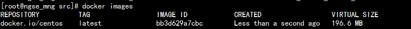
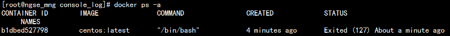
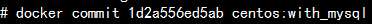
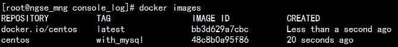
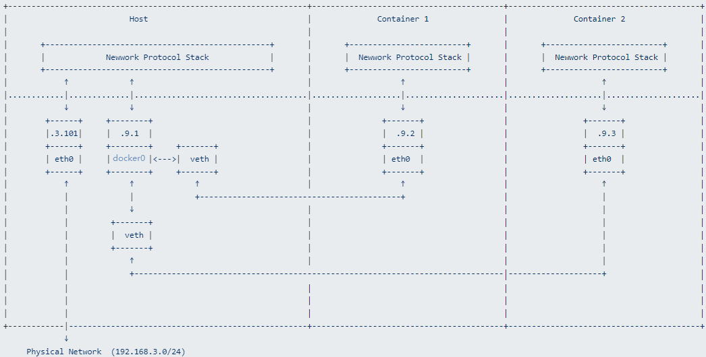
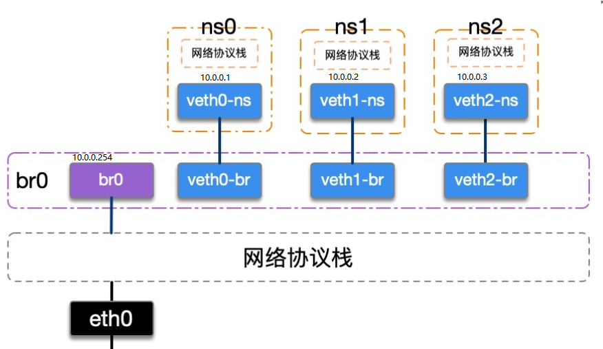
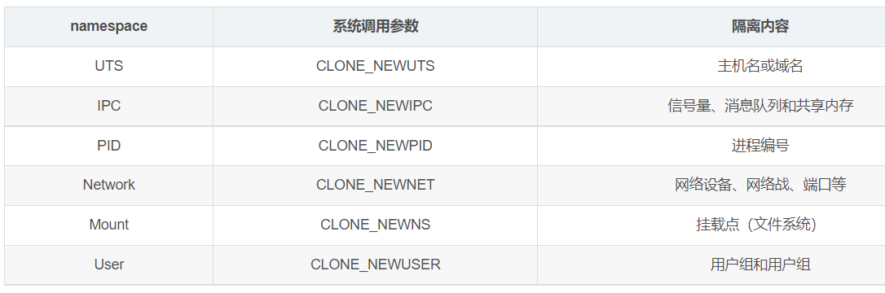

# Docker入门好简单

# 1、安装docker

## 1.1 先在母机上安装docker，以centos为例：

```bash
yum install docker
```

一般情况会直接成功，显示Complete!

但是腾讯云的centos7版本下会报错，需要更新一下lvm2，所以先执行：

```bash
yum install lvm2**
```

## 1.2 启动docker服务程序

```bash
docker daemon &
```

或者

```bash
service docker start
```

Docker初始化会需要一段时间（10min？），并且机器响应会很慢，要耐心等。过一会，就可以用`docker ps`看看是不是正常返回了：

```bash
docker ps
```


# 2、以centos为例来使用docker

## 2.1 获取一个镜像

从仓库拉一个centos 的镜像（很重要的概念，类似一个可执行文件）下来：

```bash
docker pull centos
```

有时候会失败，据说是因为防火墙的原因。多试几次。因为文件比较大， 时间会长一点。

也可以考虑从国内的仓库拉取：

```bash
docker pull daocloud.io/centos
```

成功拉下来后，用images命令可以查看到：



## 2.2 启动一个容器

用run命令执行它：

```bash
docker run –it centos:latest /bin/bash
```

执行后，你的终端就是连接的docker里的centos虚拟机！在里面可以如操作普通centos一般。 -it表示采取交互式tty，如果不需要交互，则使用-d选项，并把/bin/bash改成你希望运行的程序。

另外起一个securecrt连接到母机，可以用ps命令查看docker容器（容器是很重要的概念，可以认为是一个执行中的虚拟机实例，类似进程，另一个概念是镜像，类似可执行文件）


如果在刚才启动的centos虚拟机里执行exit命令，那么docker ps命令就看不到这个容器了，因为它停止执行了，用`docker ps -a`才能看到：



用**docker rm**可以删除这些已经停止了的容器，可以类比为僵尸进程吧


如果不希望exit退出但是又想解脱那个终端怎么办呢？在终端里按`CTRL-p CTRL-q`

如果我又想让当前终端“连接”到这个容器怎么办呢，用`docker attach`命令


## 2.3 “登录”一个容器

对于已经在“后台”执行的容器，可以通过exec命令“登录”它，就相当于进入到一个os系统中。即使该容器创建时候的COMMAND不是shell，也可以登录这镜像，这是相比attach不一样的地方：

```
docker exec -it 50b71b1b4408 /bin/bash
```

上面的50b71b1b4408是具体的容器ID，-it表示采取交互式tty，/bin/bash表示启动一个bash命令用于交互。

## 2.4 保存容器中的修改

如果我想在虚拟机里面装个自己的应用程序或者装个mysql，并且希望下次启动虚拟机这些程序还在，怎么弄呢，那就装好这些程序后，用`docker commit`命令提交为一个新的镜像


例如



你看，多了一个我自己的镜像，用run命令启动它，里面会有mysql



如果希望这个镜像在其他母机上执行起来，可以使用export命令导出为.tar文件，在其他机器上用import命令导入镜像，然后执行。Docker的思想本来就是制作-移动-运行


## 2.5 关于网络

docker对网络的使用，有bridge、host等几种方式。默认是bridge方式。

bridge使得各个容器之间的网络是隔离的，各容器有各自的虚拟网络和ip，通过NAT的方式访问宿主机器和外部网络， docker run -p可以指定端口映射关系。

bridge方式下，容器内会看到自己各自的网络：

```
root@c9b5a4fd2eb8:~# netstat -ien
Kernel Interface table
eth0: flags=4163<UP,BROADCAST,RUNNING,MULTICAST>  mtu 1500
        inet 172.17.0.3  netmask 255.255.0.0  broadcast 0.0.0.0
        inet6 fe80::42:acff:fe11:3  prefixlen 64  scopeid 0x20<link>
        ether 02:42:ac:11:00:03  txqueuelen 0  (Ethernet)
        RX packets 6  bytes 468 (468.0 B)
        RX errors 0  dropped 0  overruns 0  frame 0
        TX packets 6  bytes 468 (468.0 B)
        TX errors 0  dropped 0 overruns 0  carrier 0  collisions 0

lo: flags=73<UP,LOOPBACK,RUNNING>  mtu 65536
        inet 127.0.0.1  netmask 255.0.0.0
        inet6 ::1  prefixlen 128  scopeid 0x10<host>
        loop  txqueuelen 0  (Local Loopback)
        RX packets 0  bytes 0 (0.0 B)
        RX errors 0  dropped 0  overruns 0  frame 0
        TX packets 0  bytes 0 (0.0 B)
        TX errors 0  dropped 0 overruns 0  carrier 0  collisions 0
```

典型的网络拓扑如下：



对外通信过程是一个nat转发的过程：

1. 容器内部，default路由（网关）设置为docker0，对外通信都经过网关
2. 宿主机设置为转发状态，且iptables修改nat表，实现nat路由器，将网卡docker0的包，都转发给eth0，且修改源IP地址为eth0

同一个网桥下挂载的容器之间的通信，是内部局域网之间的通信


host模式是直接使用宿主机的ip和网络栈，各容器之间没有网络隔离。容器内看到的直接就是主机的网络。

container模式，可以让同一个主机下的多个容器共用同一个协议栈和网络空间，k8s里的一个pod下的多个容器，其实就是这样的。

特别值得一提的是，k8s下跨node的多个pod之间的网络看起来是互通且是“平”的，且每个pod都有唯一ip，从里从外看这个pod的IP都是这样。这里用到了vxlan和tun/tap技术，不能简单的从docker的网络表现来推导。

详细情况请见相关文档。

这边文章写的不错，引用一下：

```shell
https://www.sharpcode.cn/devops/docker-bridge-network/
https://zhuanlan.zhihu.com/p/293667316
https://segmentfault.com/a/1190000038171918
https://cloud.tencent.com/developer/article/1936120
```


## 2.6 Dockerfile

Dockerfile类似makefile，指导docker如何构建一个定制化的镜像。例如下面这个Dockerfile，就是基于仓库里的centos，安装python，并拷贝start.sh文件到镜像里：

```
FROM centos
RUN ["/usr/bin/yum", "install", "-y", "python3"]
COPY start.sh /start.sh
RUN /usr/bin/chmod a+x /start.sh
CMD /start.sh
```

用下面的命令build，并把镜像在本地保存为centos:bobo

```
docker build -t centos:bobo .
```

```
[root@master ~/dockerfile]# docker build -t centos:bobo .
Sending build context to Docker daemon 3.072 kB
Step 1/5 : FROM centos
 ---> 0f3e07c0138f
Step 2/5 : RUN /usr/bin/yum install -y python3
 ---> Running in b19e3cc7be5b
#这里省略yum的大量输出...
Step 3/5 : COPY start.sh /start.sh
 ---> 0f87537c65ac
Removing intermediate container aa4712ad9563
Step 4/5 : RUN /usr/bin/chmod a+x /start.sh
 ---> Running in 275692de7c66
 ---> 6e7f3a93de23
Removing intermediate container 275692de7c66
Step 5/5 : CMD /start.sh
 ---> Running in 45bbb2b7b8c6
 ---> 1dc6c360ff07
Removing intermediate container 45bbb2b7b8c6
Successfully built 1dc6c360ff07
```

从输出可以看到，docker build的过程和我们手工操作原理是类似的：run一个容器，修改，commit为镜像。

## 2.7 授之以渔

`docker --help`可以查看有哪些子命令

`docker 子命令 --help`可以查看该子命令有哪些选项

最为重要的就是run子命令了

**容器里的用户数据如何落地到磁盘**

容器执行后，里面的系统是一个动态运营的系统，会不断的产生用户数据、日志、增删mysql记录....， 那么这个怎么保存起来防止掉电丢失呢？
未必不断的commit到镜像里去吗？

当然不是，这就要用到数据卷。**执行子命令run的时候，用-v参数指定：将母机上的一个目录挂载到容器的某个目录上，那么在容器里发生的所有修改，都体现在母机的磁盘(目录)里了**。这样就将静态的镜像文件和动态的用户数据分离开来了，好处显而易见。

例如：


# 3、搭建私有仓库

docker至少有registry、harbor两种私有仓库搭建。

这里简单的演示registry私有残酷的搭建。

## 3.1 启动仓库服务

```
#拉取仓库服务的镜像
docker pull registry:2
#启动该容器，物理机器上的/data/registry目录用于存放数据，服务端口为5000
docker run -d -v /data/registry:/var/lib/registry -p 5000:5000 --name myregistry registry:2
```

## 3.2 修改docker client的配置

```
#修改/etc/hosts文件，加入仓库服务器的hostname，假设叫master
172.19.16.11 master

#修改/etc/docker/daemon.json文件，告知这是一个http仓库而不是https仓库
{
"insecure-registries": [
        "master:5000",
        "second_house:6000"  #如果有个多个，逗号分隔插入多行。这是用于示例的第二个仓库
    ]
}
```

## 3.3 推送和拉取镜像

对本地的一个镜像打tag，然后推送到仓库里

```
docker tag centos:bison master:5000/centos:bison
docker push master:5000/centos:bison
```

需要的时候，从私有仓库中拉取该镜像

```
docker push master:5000/centos:bison
```

# 4、 网桥和net namespace

docker使用了虚拟网桥、虚拟网卡、net namespace技术。下面的脚本可以创建三个net namespace，并在每个namespace里有一个网卡与网桥连接，有自己的协议栈和iptables等等。 

每个namespace里的网络都可以和宿主机外面的网络互通，且宿主机真实网卡所在网段的其他机器也能主动访问namespace里的网卡！，前提是其他机器都要加一条路由，假设宿主机的真实网卡ip是192.168.0.8。（但实验发现docker的bridge不能由外而内的ping通，因为加了复杂的iptables规则）：

```shell
ip route add 10.0.0.0/24 via 192.168.0.8
```


```shell
#!/usr/bin/bash
# 添加网桥
brctl addbr br0
# 启动网桥
ip link set br0 up
ifconfig br0 10.0.0.254  #作为ns0 1 2的网关


# 新增三个netns
ip netns add ns0
ip netns add ns1
ip netns add ns2

# 新增两对veth
ip link add veth0-ns type veth peer name veth0-br
ip link add veth1-ns type veth peer name veth1-br
ip link add veth2-ns type veth peer name veth2-br

# 将veth的一端移动到netns中
ip link set veth0-ns netns ns0
ip link set veth1-ns netns ns1
ip link set veth2-ns netns ns2

# 将netns中的本地环回和veth启动并配置IP
ip netns exec ns0 ip link set lo up
ip netns exec ns0 ip link set veth0-ns up
ip netns exec ns0 ip addr add 10.0.0.1/24 dev veth0-ns
ip netns exec ns0 ip route add default via 10.0.0.254 dev veth0-ns

ip netns exec ns1 ip link set lo up
ip netns exec ns1 ip link set veth1-ns up
ip netns exec ns1 ip addr add 10.0.0.2/24 dev veth1-ns
ip netns exec ns1 ip route add default via 10.0.0.254 dev veth1-ns

ip netns exec ns2 ip link set lo up
ip netns exec ns2 ip link set veth2-ns up
ip netns exec ns2 ip addr add 10.0.0.3/24 dev veth2-ns
ip netns exec ns2 ip route add default via 10.0.0.254 dev veth2-ns

# 将veth的另一端启动并挂载到网桥上
ip link set veth0-br up
ip link set veth1-br up
ip link set veth2-br up
brctl addif br0 veth0-br
brctl addif br0 veth1-br
brctl addif br0 veth2-br

#宿主机要支持转发
echo 1 >/proc/sys/net/ipv4/ip_forward

#不需要把宿主机改为路由器模式
#iptables -t nat -A POSTROUTING -o eth0 -j MASQUERADE
#iptables -A FORWARD -i br0 -o eth0 -m state --state RELATED,ESTABLISHED -j ACCEPT
#iptables -A FORWARD -i eth0 -o br0 -j ACCEPT
```

拓扑图如下：



# 5、docker与namespace

docker的本质是namespace和cgroup。（我自己瞎总结的）

## 5.1 linux下的namespace

linux下网络、PID、IPC等都可以按namespace隔离，详细见：



linux下用于操作namespace的系统调用有：

1. clone，flags参数可以是上表中的参数的二进制或，指明克隆的新进程要使用独立的某类namespace
2. setns，将调用该函数的进程加入到fd参数指定的namespace里，namespace的类型由nstype参数指定
3. unshare，讲调用该函数的进程进入到全新的namespace里

linux下查看/操作namespace的方法：

1. ls -l  /proc/[pid]/ns
2. unshare命令，没错，unshare是一个系统调用，也有一个封装好的unshare命令
3. nsenter，进入到指定进程的某些命名空间

## 5.2 docker容器和namespace的关系

docker的容器本质上还是在宿主机上一个普通的进程，通过docker top命令可以查看在宿主机上的普通进程。例如：

下面两个容器：

```
docker run -itd --privileged --rm --network=bridge --name=bison1 -v /etc/localtime:/etc/localtime:ro bison/net-tools:apt_ok bash

docker run -itd --privileged --rm --network=container:bison1 --name=bison2 -v /etc/localtime:/etc/localtime:ro bison/net-tools:apt_ok bash
```

使用docker top命令可以看到在宿主机上实际存在的进程：

```shell
# docker top bison1
UID         PID          PPID          C       STIME               TTY                 TIME                CMD
root        2773        吧2751         0       08:51               pts/0               00:00:00            bash

 # ls -l /proc/2773/ns
total 0
lrwxrwxrwx 1 root root 0 Aug 20 08:53 cgroup -> 'cgroup:[4026531835]'
lrwxrwxrwx 1 root root 0 Aug 20 08:53 ipc -> 'ipc:[4026532334]'
lrwxrwxrwx 1 root root 0 Aug 20 08:53 mnt -> 'mnt:[4026532332]'
lrwxrwxrwx 1 root root 0 Aug 20 08:51 net -> 'net:[4026532337]'  #bison1 bison2两个容器的netns是一致的
lrwxrwxrwx 1 root root 0 Aug 20 08:53 pid -> 'pid:[4026532335]'
lrwxrwxrwx 1 root root 0 Aug 20 08:53 pid_for_children -> 'pid:[4026532335]'
lrwxrwxrwx 1 root root 0 Aug 20 08:53 user -> 'user:[4026531837]'
lrwxrwxrwx 1 root root 0 Aug 20 08:53 uts -> 'uts:[4026532333]'

# 如果在容器里再运行一个进程，例如top，那么在宿主机上也能看到对应的进程
 # docker top bison2
UID       PID      PPID        C          STIME               TTY                 TIME                CMD
root      2870     2850       0           08:51               pts/0               00:00:00            bash
root      2955     2850       0           08:52               pts/1               00:00:00            bash
root      3050     2955       0           08:54               pts/1               00:00:00            top
```

但我没有找到docker命令中修改ipc namespace等名空间的方法

# 6、 k8s中的应用demo

这是一个简单的web服务程序，计算整数加法乘法

```python
#!/usr/bin/python3
#   curl http://addservice/add?a=3,b=4

import http.server
import requests

class RequestHandler(http.server.CGIHTTPRequestHandler):
    def __init__(self,  *args, **kwargs) :
        self.params = dict()
        self.shortpath = ""
        super().__init__(*args, **kwargs)
        

    def translate(self):  
        self.shortpath = self.path.split('?')[0]
        args = self.path.split('?')[1].split(',')
        for arg in args:
            k = arg.split('=')[0]
            v = arg.split('=')[1]
            self.params[k] = v
    
    
    def do_GET(self):
        
        self.translate()
       
       
        if self.shortpath == "/add":
            if len(self.params) != 2 or None == self.params.get('a', None) or None ==  self.params.get('b', None):
                self.send_response(406, "invalid input parameters")
                return

            self.send_response(200, "")
            self.end_headers()
            v = int(self.params['a']) + int(self.params['b'])
            result = '{"result":' + '{}'.format(v)+'}'
            self.wfile.write(bytes(result, 'utf-8'))

        if self.shortpath == "/multiply":
            if len(self.params) != 2 or None == self.params.get('a', None) or None ==  self.params.get('b', None):
                self.send_response(406, "invalid input parameters")
                return

            self.send_response(200, "")
            self.end_headers()
            v = int(self.params['a']) * int(self.params['b'])
            result = '{"result":' + '{}'.format(v)+'}'
            self.wfile.write(bytes(result, 'utf-8'))

        if self.shortpath == "/complex":
            if len(self.params) != 2 or None == self.params.get('a', None) or None ==  self.params.get('b', None):
                self.send_response(406, "invalid input parameters")
                return

            resp = requests.get("http://addservice:80/add?a={},b={}".format(self.params['a'], self.params['b'])) #type:requests.Response
            if resp.status_code != 200:
                self.send_response(503, "addservice unavailable")
                return
            
            self.send_response(200, "")
            self.end_headers() 
            self.wfile.write(resp.content)
           
    def do_POST(self):
        return super().do_POST()

PORT = 8000

Handler = RequestHandler

with http.server.ThreadingHTTPServer(("", PORT), Handler) as httpd:
    print("serving at port", PORT)
    httpd.serve_forever()

```

使用下面的dockerfile可以构建镜像：

```python
FROM ubuntu:20.04

RUN apt-get update && \
    apt-get install -y python && \
    apt-get install -y pip && \
    apt-get install -y net-tools && \
    apt-get install -y curl

COPY ./calc.py /

RUN pip3 install requests
ENTRYPOINT /calc.py

```

# 7、K8S中的ipvs和dummy网卡

K8S中kube-proxy有iptables和ipvs等工作模式。当集群规模比较大的时候，iptables模式会导致iptables表里的规则极具膨胀，性能和可维护性变差，而且endpoint故障情况下，负载均衡不能做自动容错。ipvs对比有优势。

ipvs工作在内核态处理四层协议，使用ipvsadm命令可以方便配置ipvs的负载均衡转发规则。和iptables类似，也有ipvsadm-save, ipvsadm-restore等。

ipvs模式下，K8S会在node上创建dummy类型的网卡（一种虚拟网卡，用于本机的进程间通信，有点类似loopback网卡，可以添加多个），并且在dummy网卡上把service的cluster ip都绑定上去。

所以我们会发现：iptables模式下，clusterip不能ping通，但ipvs模式下能ping通。

肯定不是这样：kube-proxy监听dummy网卡上，业务pod发往service cluster ip的报文都会被kube-proxy截获，然后按一定的规则进行负载均衡请求背后的endpoint。因为ipvs直接工作在内核态，并不在应用态监听端口。

## 7.1 dummy网卡

dummy网卡上也可以绑定外网实际的IP，用于截获相关流量。例如实际生产中，有遇到把CLB的外网IP也绑定到node的dummy网卡上的使用方式。

```shell
 ip link add dummy0 type dummy
 ip address add 36.51.254.91 dev dummy0  #www.sina.com.cn的一个ip
 ip address add 220.181.38.149 dev dummy0  #www.baidu.com的一个ip
```

然后把上面6的web服务器绑定在其中一个ip上，启动服务，可以访问通

```shell
ubuntu@VM-16-7-ubuntu:~/practice/ServiceOnK8S$ netstat -anpl|grep 8000
(Not all processes could be identified, non-owned process info
 will not be shown, you would have to be root to see it all.)
tcp        0      0 220.181.38.149:8000     0.0.0.0:*               LISTEN      3783913/python3
ubuntu@VM-16-7-ubuntu:~/practice/ServiceOnK8S$ telnet 220.181.38.149 8000
Trying 220.181.38.149...
Connected to 220.181.38.149.
Escape character is '^]'.
GET /add?a=1,b=4 HTTP/1.1

220.181.38.149 - - [14/Oct/2022 10:44:24] "GET /add?a=1,b=4 HTTP/1.1" 200 -
HTTP/1.0 200
Server: SimpleHTTP/0.6 Python/3.8.10
Date: Fri, 14 Oct 2022 02:44:24 GMT

{"result":5}Connection closed by foreign host.
```


## 7.2 ipvs原理

有几篇文章讲得挺好：

```
https://zhuanlan.zhihu.com/p/94418251

https://mp.weixin.qq.com/s/RziLRPYqNoQEQuncm47rHg?st=D896F912CC2088E103138BC2268FB78CC9981C7651EB0B27459F4B5DCA70A20D9E862FB35F95C95E79DF70B4AC7008EC685EEAEC79A6460F7CE8D2763E1A2B04E9F13F942AD3333A92985956476D4FED1FFCB7211739E78678BC3413F6B6C824D201A49BD1FAD6D93866A6F65B520130D1DC9989012D29E87586E77D3664A1BD96561E34FC2546BC9841B3CBC62F0829943B8853068C8570555D4672A5AA19BAE1C984F2E7F8EEFA56121707A3D07C04A218401DF419C1830C17E3A2B592DD01085815B2645937D7D441893A2653AD9922DA8C9225F14E66B7371E6238153D3136B8CF4E2F75FFE7810AAE60E2B75AE3&vid=1688853961816128&cst=016F2C179E41C0655EE7707151104A144B23C2A8D90985511A1258F481C2F7F8F24A6146EBECB7224B59353E4B267B30&deviceid=0174367f-9c84-4c36-b953-944d9de76afe&version=4.0.16.6007&platform=win
```

