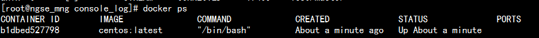
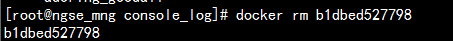

# Docker入门好简单

# 1、安装docker

## 1.1 先在母机上安装docker，以centos为例：

```bash
yum install docker
```

一般情况会直接成功，显示Complete!

但是腾讯云的centos7版本下会报错，需要更新一下lvm2，所以先执行：

```bash
yum install lvm2**
```

## 1.2 启动docker服务程序

```bash
docker daemon &
```

或者

```bash
service docker start
```

Docker初始化会需要一段时间（10min？），并且机器响应会很慢，要耐心等。过一会，就可以用`docker ps`看看是不是正常返回了：

```bash
docker ps
```


# 2、以centos为例来使用docker

## 2.1 获取一个镜像

从仓库拉一个centos 的镜像（很重要的概念，类似一个可执行文件）下来：

```bash
docker pull centos
```

有时候会失败，据说是因为防火墙的原因。多试几次。因为文件比较大， 时间会长一点。

也可以考虑从国内的仓库拉取：

```bash
docker pull daocloud.io/centos
```

成功拉下来后，用images命令可以查看到：


## 2.2 启动一个容器

用run命令执行它：

```bash
docker run –it centos:latest /bin/bash
```

执行后，你的终端就是连接的docker里的centos虚拟机！在里面可以如操作普通centos一般。 -it表示采取交互式tty，如果不需要交互，则使用-d选项，并把/bin/bash改成你希望运行的程序。

另外起一个securecrt连接到母机，可以用ps命令查看docker容器（容器是很重要的概念，可以认为是一个执行中的虚拟机实例，类似进程，另一个概念是镜像，类似可执行文件）



如果在刚才启动的centos虚拟机里执行exit命令，那么docker ps命令就看不到这个容器了，因为它停止执行了，用`docker ps -a`才能看到：


用**docker rm**可以删除这些已经停止了的容器，可以类比为僵尸进程吧



如果不希望exit退出但是又想解脱那个终端怎么办呢？在终端里按`CTRL-p CTRL-q`

如果我又想让当前终端“连接”到这个容器怎么办呢，用`docker attach`命令


## 2.3 “登录”一个容器

对于已经在“后台”执行的容器，可以通过exec命令“登录”它，就相当于进入到一个os系统中。即使该容器创建时候的COMMAND不是shell，也可以登录这镜像，这是相比attach不一样的地方：

```
docker exec -it 50b71b1b4408 /bin/bash
```

上面的50b71b1b4408是具体的容器ID，-it表示采取交互式tty，/bin/bash表示启动一个bash命令用于交互。

## 2.4 保存容器中的修改

如果我想在虚拟机里面装个自己的应用程序或者装个mysql，并且希望下次启动虚拟机这些程序还在，怎么弄呢，那就装好这些程序后，用`docker commit`命令提交为一个新的镜像


例如


你看，多了一个我自己的镜像，用run命令启动它，里面会有mysql


如果希望这个镜像在其他母机上执行起来，可以使用export命令导出为.tar文件，在其他机器上用import命令导入镜像，然后执行。Docker的思想本来就是制作-移动-运行


## 2.5 关于网络

docker对网络的使用，有bridge、host等几种方式。默认是bridge方式。

bridge使得各个容器之间的网络是隔离的，各容器有各自的虚拟网络和ip，通过NAT的方式访问宿主机器和外部网络， docker run -p可以指定端口映射关系。

bridge方式下，容器内会看到自己各自的网络：

```
root@c9b5a4fd2eb8:~# netstat -ien
Kernel Interface table
eth0: flags=4163<UP,BROADCAST,RUNNING,MULTICAST>  mtu 1500
        inet 172.17.0.3  netmask 255.255.0.0  broadcast 0.0.0.0
        inet6 fe80::42:acff:fe11:3  prefixlen 64  scopeid 0x20<link>
        ether 02:42:ac:11:00:03  txqueuelen 0  (Ethernet)
        RX packets 6  bytes 468 (468.0 B)
        RX errors 0  dropped 0  overruns 0  frame 0
        TX packets 6  bytes 468 (468.0 B)
        TX errors 0  dropped 0 overruns 0  carrier 0  collisions 0

lo: flags=73<UP,LOOPBACK,RUNNING>  mtu 65536
        inet 127.0.0.1  netmask 255.0.0.0
        inet6 ::1  prefixlen 128  scopeid 0x10<host>
        loop  txqueuelen 0  (Local Loopback)
        RX packets 0  bytes 0 (0.0 B)
        RX errors 0  dropped 0  overruns 0  frame 0
        TX packets 0  bytes 0 (0.0 B)
        TX errors 0  dropped 0 overruns 0  carrier 0  collisions 0
```

host是直接使用宿主机的ip和网络栈，各容器之间没有网络隔离。容器内看到的直接就是主机的网络。

详细情况请见相关文档。

## 2.6 Dockerfile

Dockerfile类似makefile，指导docker如何构建一个定制化的镜像。例如下面这个Dockerfile，就是基于仓库里的centos，安装python，并拷贝start.sh文件到镜像里：

```
FROM centos
RUN ["/usr/bin/yum", "install", "-y", "python3"]
COPY start.sh /start.sh
RUN /usr/bin/chmod a+x /start.sh
CMD /start.sh
```

用下面的命令build，并把镜像在本地保存为centos:bobo

```
docker build -t centos:bobo .
```

```
[root@master ~/dockerfile]# docker build -t centos:bobo .
Sending build context to Docker daemon 3.072 kB
Step 1/5 : FROM centos
 ---> 0f3e07c0138f
Step 2/5 : RUN /usr/bin/yum install -y python3
 ---> Running in b19e3cc7be5b
#这里省略yum的大量输出...
Step 3/5 : COPY start.sh /start.sh
 ---> 0f87537c65ac
Removing intermediate container aa4712ad9563
Step 4/5 : RUN /usr/bin/chmod a+x /start.sh
 ---> Running in 275692de7c66
 ---> 6e7f3a93de23
Removing intermediate container 275692de7c66
Step 5/5 : CMD /start.sh
 ---> Running in 45bbb2b7b8c6
 ---> 1dc6c360ff07
Removing intermediate container 45bbb2b7b8c6
Successfully built 1dc6c360ff07
```

从输出可以看到，docker build的过程和我们手工操作原理是类似的：run一个容器，修改，commit为镜像。

## 2.7 授之以渔

`docker --help`可以查看有哪些子命令

`docker 子命令 --help`可以查看该子命令有哪些选项

最为重要的就是run子命令了

**容器里的用户数据如何落地到磁盘**

容器执行后，里面的系统是一个动态运营的系统，会不断的产生用户数据、日志、增删mysql记录....， 那么这个怎么保存起来防止掉电丢失呢？
未必不断的commit到镜像里去吗？

当然不是，这就要用到数据卷。**执行子命令run的时候，用-v参数指定：将母机上的一个目录挂载到容器的某个目录上，那么在容器里发生的所有修改，都体现在母机的磁盘(目录)里了**。这样就将静态的镜像文件和动态的用户数据分离开来了，好处显而易见。

例如：


# 3、搭建私有仓库

docker至少有registry、harbor两种私有仓库搭建。

这里简单的演示registry私有残酷的搭建。

## 3.1 启动仓库服务

```
#拉取仓库服务的镜像
docker pull registry:2
#启动该容器，物理机器上的/data/registry目录用于存放数据，服务端口为5000
docker run -d -v /data/registry:/var/lib/registry -p 5000:5000 --name myregistry registry:2
```

## 3.2 修改docker client的配置

```
#修改/etc/hosts文件，加入仓库服务器的hostname，假设叫master
172.19.16.11 master

#修改/etc/docker/daemon.json文件，告知这是一个http仓库而不是https仓库
{
"insecure-registries": [
        "master:5000",
        "second_house:6000"  #如果有个多个，逗号分隔插入多行。这是用于示例的第二个仓库
    ]
}
```

## 3.3 推送和拉取镜像

对本地的一个镜像打tag，然后推送到仓库里

```
docker tag centos:bison master:5000/centos:bison
docker push master:5000/centos:bison
```

需要的时候，从私有仓库中拉取该镜像

```
docker push master:5000/centos:bison
```

