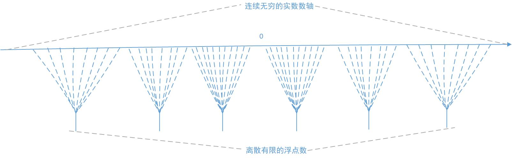
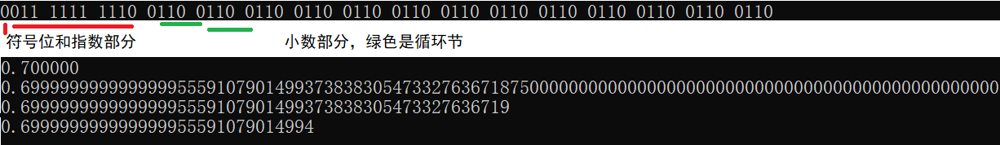
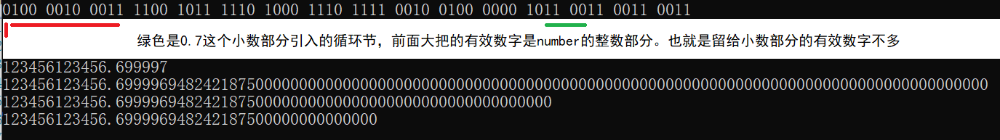

# double和BigDecimal数据类型

bisonliao, 2020年4月25日


Java码农做金融，就不得不说double与BigDecimal数据类型。本小文通过简单的例子直观的介绍double数据类型引入的误差和BigDecimal解决方案。

双精度浮点数，即double precision floating-point format，是计算机中普遍使用的64 bit的数字格式，也普遍的出现在C/C++、Fortran、Java、JavaScript等程序语言中，后文中会简称double类型。对应的还有32 bit的单精度浮点数。他们遵从IEEE 754标准系列。

## 1 double类型的内存格式

详尽的文档，可以参考IEEE 754文档或者double数据类型的wikipedia词条。这里用一个小例子展示一下double类型的内存格式。

### 1.1 先说数学上的进制转换

以十进制小数 13.3125为例，转化为二进制表示就是1101.0101。

十进制小数，小数点左边依次表示1、10、100、...，小数点右边依次表示1/10、1/100、1/1000，...。类比之下，二进制小数的小数点的左边的依次是1、2、4、8、...，小数点右边依次表示1/2、1/4、1/8、...。

所以1101.0101的小数部分就是1个1/4加上1个1/16，即5/16=0.3125；而整数部分就是1个1+1个4+1个8，即13。

将十进制小数转二进制小数的手工计算方法，需要对整数部分和小数部分分开处理：

小数部分，不断的将十进制小数的小数部分乘以2，得到的积的整数部分就依次是二进制小数的小数部分的bit位，不断远离小数点的方向：

```java
0.3125 X 2 = 0.6250 ------ 0
0.6250 X 2 = 1.25   ------ 1
0.25   X 2 = 0.5    ------ 0
0.5    X 2 = 1.0    ------ 1

所以0.3125的二进制表示是 0.0101
```

整数部分，就是不断的除以2，得到的余数就是二进制表示的bit位，不断远离小数点的方向：

```
13 / 2 = 6 余 1 ----- 1
6  / 2 = 3 余 0 ----- 0
3  / 2 = 1 余 1 ----- 1
1  / 2 = 0 余 1 ----- 1
所以13的二进制表示是 1101
```

### 1.2 再说double类型的内存格式

先看一张来自wikipedia上该词条的图片：


还是以十进制小数 13.3125为例，转化为二进制表示就是1101.0101。

第一步，通过小数点移位，使得整数部分为1，并明确正负号：

$$
1101.0101 =  +1.1010101 * 2^3
$$
第二步，指数部分（也就是十进制3）加上1023，

```java
指数部分：3+1023 = 1026，即二进制 100 0000 0010
```

指数部分为什么要这样处理呢，因为double类型用11bit整数存储指数，取值范围为 [0, 2017]，而指数可正可负，所以有个偏移1023， [0, 2017]  依次映射到 [-1023, 1024]。

第三步，依次填入1位符号位、11位指数、52位小数部分：

```java
0，100 0000 0010， 1010 1010 0...0
```

如果是-13.3125，则：

```java
1，100 0000 0010， 1010 1010 0...0
```

写段代码验证一下：

```c
int main()
{
    double number = -13.3125;
    unsigned char* p = (unsigned char*)&number;
    int len = sizeof(double);
    //先高字节，再低字节
    for (int i = len-1; i >= 0; --i)
    {
        //先高bit再低bit
        for (int j = 7; j >=0; --j)
        {
            printf("%d", (p[i] >> j)&1);
            if (4 == j)
            {
                printf(" ");
            }
        }
        printf(" ");
    }
    return 0;
}

//输出为：
1100 0000 0010 1010 1010 0000 0000 0000 0000 0000 0000 0000 0000 0000 0000 0000
```

IEEE 754标准没有对字节序做明确规定，所以在不同的cpu上面，浮点数的表示可能会有差异。详细可以参考一下/usr/include/ieee754.h文件。

## 2 double类型的误差

由于实数是连续且无穷多的，任意两个不相等的实数之间都有无穷多个实数。而double使用64 bit 有限个数的状态（虽然这个状态个数也是巨大的）来表示实数，庄子说：“以有涯随无涯，殆已！”，所以使用double一定会引入误差。

任意两个连续的double内存状态之间有无穷多个实数，如果运算结果落在其中的某个实数，double就只能用附近的这两个状态中的一个来表示，误差由此产生了。而且越靠近实数轴的两侧，误差越大。



根据前面的例子可以看出，只有小数部分能拆解为1/2、1/4、1/8、...、这些有理数的和的实数才可以被double准确的表示，例如：

```c
0.015625‬ = 1/64
0.876953125 = 1/2 + 1/4 + 1/8 + 1/512 
```

如果不能分解为1/(2^n)的和的形式，即使看起来特别“正常”的一个小数，也不能被double准确的表示，0.1 到 0.9 的 9 个小数中，只有 0.5 可以用浮点数准确表示！例如：

```
0.7（十进制） = 0.10 1100 1100 ...（二进制）  //不断的1100循环出现
```

一小段代码验证一下：

```c
int main()
{
    double number = 0.7;
    unsigned char* p = (unsigned char*)&number;
    int len = sizeof(double);
    //先高字节，再低字节
    for (int i = len-1; i >= 0; --i)
    {
        //先高bit再低bit
        for (int j = 7; j >=0; --j)
        {
            printf("%d", (p[i] >> j)&1);
            if (4 == j)
            {
                printf(" ");
            }
        }
        printf(" ");
    }
    printf("\n");
    printf("%f\n", number);
    printf("%.100f\n", number);
    printf("%.50f\n", number);
    printf("%.30f\n", number);
    return 0;
}
```



可以看到，具体到0.7这个数，double引入的误差的绝对值相当的小。但如果一个数的整数部分就占用了很多有效数字，那么小数部分的误差绝对值可能就会比较大。也就是说，表示的原值的绝对值越大，double越不精确！

例如，把上面代码里的number值改为123456123456.7，就会得到这样的输出：



可以看到，double的有效数字的位数是（很）有限的（52 bit），如果原值的整数部分很大，那么留给小数部分的有效数字就很少了，误差的绝对值（0.000003）比前面0.7的例子大了很多。

进一步的，当原值的绝对值进一步加大的时候，连整数部分也不准确了。

例如，把上面代码里的number改为123456123456123456123.7， 输出为：

```
123456123456123453440.0000000
```

在实际工作中，如果使用double类型表示金额和利率（例如利率0.7），虽然单次的误差可能不太大，但随着运算复杂度的增加，引入的误差可能会叠加，而且随着原值的绝对值增大，误差也会增大，不能确保小数点后2位一定是精确的（金额里的通常单位“分”所在的位置）。

不过可以明确的一点是，在Java或者C/C++语言中，int类型的数据转化为double的时候，是不会有精度损失的，因为int类型的数的绝对值相对double来说不大，double有足够的有效数字位数来保证它的精度。

## 3 BigDecimal

这个问题通常的解决方案，是使用其他更精确的数据类型替代double。

例如在 Java中，可以使用BigDecimal类。BigDecimal的实现原理，可以简单理解为：其内部使用如下方式来表示一个实数：
$$
A * 10^B
$$
其中A是BigInteger，一个任意精度的大整数，B是一个int类型。

例如实数 13.3125， BigDecimal内部就表示为 
$$
133125 * 10^-4
$$
当然，在实际实现的时候，BigDecimal有一些优化，例如A可以用一个long保存的话就保存为long。

加减乘除四则运算，就按算术直观的算法进行，例如加法，两个数先对齐B，然后A相加。

在初始化BigDecimal实例的时候，通常传入字符串方式的精确原值，避免编译器对常量实数先转化为double而损失了精度。

BigDecimal是一个常量类，例如加法 x.add(y) 不会改变x本身，而是返回一个新的BigDecimal实例作为结果。

详细可见BigDecimal的源码：

```
https://github.com/frohoff/jdk8u-dev-jdk/blob/master/src/share/classes/java/math/BigDecimal.java
```

类似的高精度的数学库还很多，例如支持任意精度的数学库GMP，官网：

```
https://gmplib.org/
```

