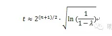

Hash函数是密码学的基础之一，hash函数的安全性，直接关乎密码协议的安全，在设计过程中选择合适的hash函数是非常关键的。

目前md5和sha1在用于消息摘要、消息校验码、证书等需要抗冲突性的场景下已经不够安全，推荐使用sha2。但是单向性场景（例如密码md5加盐存储场景）下是安全的。

## 【一个小品】 ##
先以一个戏弄咱们程序员的小品入手：

假设一份合同，内容为

x=’编程12个月，每个月月薪10万，每月结清’，

恶意者偷偷另外准备一个合同内容

y=’编程120个月，每个月月薪10块，10年一结’

恶意者在不改变上面消息语义的情况下，通过对x和y插入空格/制表符来改变消息。如果攻击者找出一对消息x和y, 满足摘要计算结果相同，例如md5(x)=md5(y), 那么就悲剧就可能发生了。

恶意者找到程序员小廖，给他看了x， 小廖欣然接受，并签名。因为数字化时代了，大家用数字签名，小廖毫不犹豫的在合同上用自己的私钥加上了他的数字签名RSA(md5（x))，形成了合同x+ RSA(md5(x))交回公司

到了工作一个月后，恶意者不给发工资，小廖将恶意者告上法庭。法庭上恶意者出具了另外一份合同y+ RSA(md5(y))， 因为法庭验证签名确实为小廖对的签名(因为md5(x)=md5(y)，所以文件末尾RSA签名算法的结果两份合同是一样的)，所以小廖败诉，还得按照y履行合同。

## 【hash函数的基本属性】 ##

首先，Hash函数的要求：

a) 任意消息大小都适用

b) 输出固定的长度

c) 计算相对简单

d) 抗第一原相性（单向性）：给出一个输出z，找到满足h(x)=z的输入x是不可能的

e) 抗第二原相性：给定x1和h(x1)，找到满足h(x1)=h(x2)的x2在计算上是不可能的

f) 抗冲突性：找到满足h(x1)=h(x2)的一对x1 x2是不可行的

注意上面的e)和f)，都是在计算上不可能。实际情况，根据鸽笼原理或者说抽屉原理，这样的x1 x2肯定是存在的。

上面的e)和f)，看似难度一样，其实不然。破解e)比f)要难得多。试想一下：一种情况是小廖是10月8号生日，要找一个和我同一天生日的人；还有一种情况是，找出两个人，是同一天生日，具体是哪天，无所谓。 前者比后者难很多。

## 【冲突概率】 ##
针对抗第二原相性的攻击，恶意者可以随机的选择x2，计算h(x2)是否等于h(x1)，这与对称密钥算法中的穷尽密钥攻击类似。考虑到当前的计算机技术， n=80位的输出长度已经足够。

针对抗冲突性的攻击，下面说的这种生日攻击就凑效得多，导致输出长度必须进一步加大。

生日攻击，原型是至少多少人聚会，才能使至少两个人在一年中同一天生日（叫做冲突）的概率足够高？

可以发现，引起至少一个冲突需要的人数，比我们想象的要少很多。只需要(t=23) 23个人，就能使得出现冲突的概率达到50%！

搜索hash函数h()的冲突与生日冲突的问题完全相同。Hash函数中，每个元素对应的值的个数不是365个，而是2^n个，n是h()输出的宽度。例如md5就是128位的。
经过数学变换，对于hash函数冲突，我们有：

其中表示至少存在一个冲突的概率。

以md5为例，n=128，假设我们冲突概率为90%，那么t等于2^65。

这里的计算复杂度，可以简单的对应于密钥暴力破解的复杂度。而密钥的暴力破解需要的时间通过下表读者有一个感性的认知：

使用蛮力攻击成功破解不同长度密钥的对称算法预计需要的时间

|密钥长度|安全评估性|
|-|-|
|56-64位  |短期：只需要几个小时或几天破解|
|112-128位| 长期：在量子计算机出现前，需要几十年破解|
|256位    |长期：即使使用量子计算机，也需要几十年|

可见只从生日攻击的角度分析，MD5在抗冲突性方面已经不安全了。

## 【抗冲突性实际情况更严重】 ##
在抗冲突性攻击方面，王小云等一些科学家发现了一些更高效的算法，相比生日攻击需要的步骤少很多。针对sha1，只需要2^52步。针对md5，只需2^42个步骤。针对SHA2，还没有构成实质性威胁。

对于md5，2^42个步骤，假设用最直接的计算-存储-比较的方法：

1. 时间复杂度：单机每秒假设完成100万次md5，那么需要400万秒，即50天，50台机器就只用1天

2. 空间复杂度：假设每个条目大小为32字节（16B的文档编号，16B的md5），那么需要存储空间128G*1K，一两千台机器就放到内存里了。

详细可见论文：
http://merlot.usc.edu/csac-f06/papers/Wang05a.pdf

和小廖程序员一样惨，某机构使用MD5签名的证书也被伪造了：
http://www.win.tue.nl/~bdeweger/CollidingCertificates/

google官方也宣布：chrome浏览器将逐步不支持sha1算法的证书，详细见：
http://blog.chromium.org/2014/09/gradually-sunsetting-sha-1.html

随着时间的推移，MD5安全性显得越来越脆弱了：(引自http://course.ccert.edu.cn/blog/chenfengjuan/)

1993: 找到两个不同初始向量IV可产生相同的散列值

1996: 找到压缩函数（MD5中的主要函数）的碰撞

2004: 利用生日攻击原理采用分布式系统成功破译MD5

2004-8: 用IBM P690大型机在1个小时内找到MD5碰撞

2005-3: 用笔记本在几个小时内找到MD5碰撞

2006-3: 用笔记本在1分钟内找到MD5碰撞

2007-12: 用Chosen-Prefix Collision构造出可用的X.509证书

2008: 荷兰的科学家实现了2个可执行文件的MD5碰撞

2008-12：利用MD5碰撞，创造了一个假的来自可信CA的数字证书

需要强调的是：很多时候，hash函数的应用只需要抗第一原像性，即单向性，例如密码的存储。

因此md5这种较短的摘要算法也是安全的。因为在这种情况下，冲突攻击没有造成威胁。

如果需要加强抗冲突性攻击，可以选择SHA256

