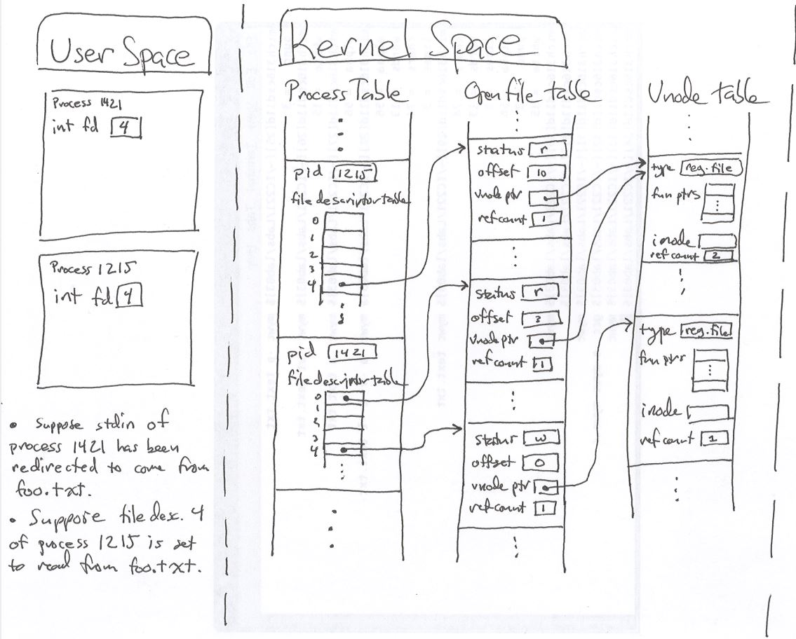

## 平滑升级 / 优雅重启的办法

通常我们的服务进程和前端或者后端保持了长连接，持续的传输数据，例如正在进行实时音视频。

如果这时候简单粗暴的重启和发布，会导致用户体验受损。这也是为什么我们经常在业务低峰的三更半夜发布的原因。所以探讨这个问题对我们工作有实际的意义。

有没有办法做到重启和更新进程，同时不断开长连接呢？ 至少有三个方案：

方案1、fork + exec启动新版本进程，在此之前在老进程里对需要保持的长连接的fd 清除 FD_CLOEXEC标记

方案2、新老版本进程之间，通过sendmsg/recvmsg来传递需要保持的长连接的fd，还保持连接不断

方案3、用一个专门的独立进程gw来处理长连接，通常gw不需要升级和重启，gw和业务逻辑处理进程中间通过某种IPC机制传递业务报文。

[demo1.c](code/gracefully/demo1.c)

[demo2.c](code/gracefully/demo2.c)

从demo1.c的代码可以看出：发送USR1信号给老进程，老进程会把需要传递的fd保存在环境变量里，然后执行fork+execl，新启动的进程从环境变量里获得需要保持的fd。fd如果从环境变量里恢复了，就不要做额外的open和accept等创建操作。

demo2.c演示了方案2，有个地方要注意：关闭连接的时候要调用shutdown，只调用close有问题，我没有想清楚，应该是进程间传递fd的时候，计数器有问题。扯开一点的话，我们做后台的，应该要透彻理解这个图的：

来自：https://www.usna.edu/Users/cs/wcbrown/courses/IC221/classes/L09/Class.html 

