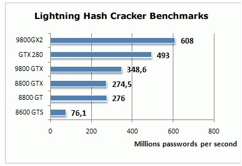
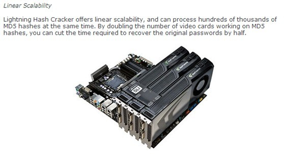

# key stretching #

(2013年)

对抗暴力破解密码、字典攻击、彩虹表，除了密码存储加盐外，key stretching也是很重要的方法。

key stretching(或者叫key strengthening)，就翻译为密钥加强吧。     基本思路就是让每次鉴权的时间复杂度大到刚刚好，使得正常用户的体验能够接受，但是黑客暴力破解或者构建彩虹表的成本大幅度提高。

  
例如，后台密码存储是   A=md5( md5(….md5( md5(passwd)+salt)))…)  (n次md5计算)，当下普通的计算机进行上述运算假设需要1秒的处理时间。      验证过程中，要求客户端提交A作为key加密（用户ID、B、时间戳等等），而B= md5( md5(….md5( md5(passwd)+salt)))…)  (n-1次md5计算)。 
     
服务端收到客户端提交后，尝试用A解密，如果成功，并校验用户ID、时间戳等等字段，并且校验md5(B)=A，这样保证密码存储被宝库后不能伪造登录。因为黑客只获得了A，没有B，且A不能推导B，所以不能伪造登录  
    
服务端验证通过，视情况可能保持存储的A不变，也可能将A再做一次md5运算的到AA=md5(A)， 删除A，存储AA。这样的目的是为了对冲计算机硬件增强导致的黑客门槛降低。    
     
如果服务端需要对现有的简单密码存储方案（例如存储的密码一次md5）进行全面升级，那么必须进行一次高密度的计算。假设有10亿用户，投入1000台服务器，每台服务器每秒钟可以计算一个加强后的存储。那么需要300小时，即13天。另外，服务器端可能需要为用户改密投入较多的机器，假设改密请求峰值每秒1000次，那么需要投入1000台机器用于改密的处理。如果发生突发事件，需要大规模的用户突击改密，这个时候建议降低计算复杂度，先把密码存起来再说，等请求高峰过后，对这些用户的复杂度进行提升。    
     
密钥加强的标准算法有PBKDF2、bcrypt、scrypt。他们在常见的语言和算法库都有提供，例如openssl、perl等等。    
     
对于黑客构建彩虹表或者暴力破解门槛的提升，假设原来进行一次验证只需要十万分之一秒，而现在需要1s，那么门槛提升了10万倍。更关键的是，这个库随着时间推移，能够对冲硬件能力提升给黑客带来的便利。
 
## 新的硬件技术 ##

很明显，更强大的硬件技术，有利于暴力破解和字典/彩虹表的构建。

FPGA 现场可编程逻辑阵列(FPGA)是用于数字电路设计与逻辑验证的大规模集成电路芯片，常用于专用集成电路(ASIC)的原型设计与算法的开发验证。使用FPGA,可以迅速地将算法实现成数字电路并进行功能验证。MD5和sha-2在FPGA中已经早有实现，相当于将软件直接用硬件实现，一般速度会提升许多。利用FPGA构建多块摘要运算电路，插入到电脑的pci接口，每个FPGA电路相当于一个电脑。这样大大的提升了运算能力。

根据网上的资料：NSA@home is a fast FPGA-based SHA-1 and MD5 bruteforce cracker. It is capable of searching the full 8-character keyspace (from a 64-character set) in about a day in the current configuration for 800 hashes concurrently, using about 240W of power. This performance is equivalent to over 1500 Athlon FX-60 CPUs, which would take about 250kW.

从上面的数据可以算到：大概相当于一台pc电脑的功耗，每秒钟可进行30亿次的8位密码尝试，而我的台式机（2013年）每秒可进行大约400万次。确实相当于近千倍的提升。

GPU GPU的计算能力比CPU每个核大约快一个数量级，且核数众多，通常还能在主板上平行扩展多个GPU。同时nVIdia推出的CUDA编程框架，使得GPU编程学习掌握门槛大大降低。根据网上的资料显示一个32核的GPU的运算能力每秒可进行420M次密码md5计算，比我的台式机快100倍。针对8位每位64个字符的密码，大概10天即可完全遍历该密码空间。

我自己测试，sha256的计算过程相比md5，没有慢一倍。我的机器同样进行10M次摘要， MD5用了2.4s， sha256用了4.1s。

