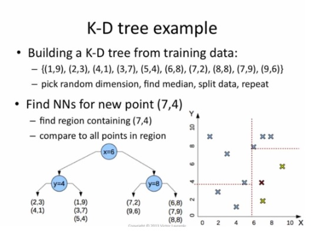
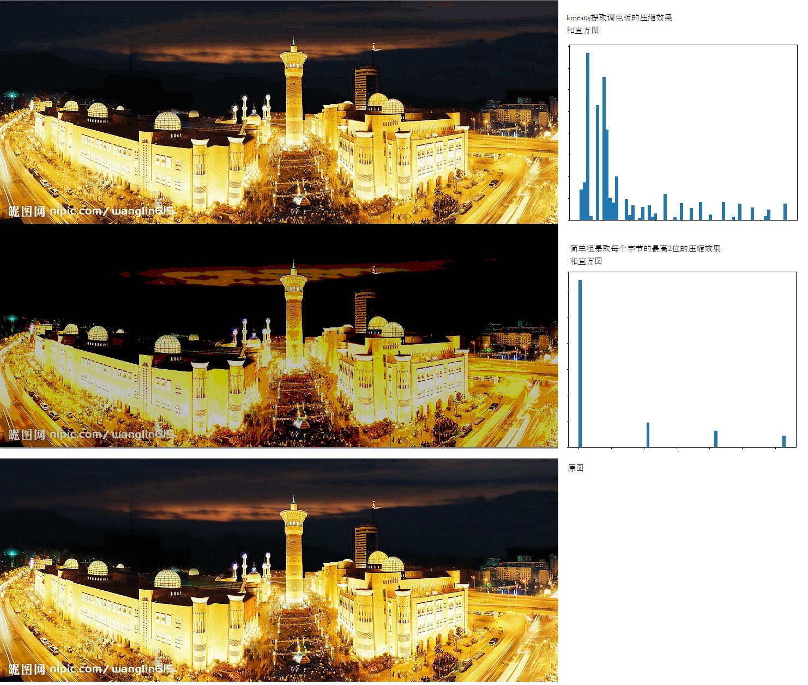

# kmeans聚类算法的应用

之前接触kmeans算法，是在学习machine Learning相关算法的时候，kmeans作为经典的聚类算法出现的。

最近在两个场景下接触到kmeans，写个小文记录一下。

## 场景一、在海量向量中查找相似向量

### 问题的提出

在使用fastText库的词向量功能的时候，有的情况下我们只有训练好的词向量文本文件（即.vec文件，每个词对应一个向量，向量之间的余弦相似度对应了词在语法上的相似度），而没有fastText模型导出的二进制文件。可能词向量文本文件是GloVe或者gensim等其他库训练后输出的。那如何查找相似词呢？

在人脸识别的时候， 库里的每张人脸已经提取一个特征码。现在输入一张人脸，如何在海量的库里快速找寻与之相似的人脸呢？以图搜图也是类似的问题。

### 解决

其中一个算法是使用KDTree或者BallTree。

KDTree比较好理解，通过根据某个维度的值对向量空间进行二分，将库里的向量划分为若干小格子，这些小格子用二叉树的方式组织起来，查找某个向量的近似向量的时候，比对它所在格子里的其他向量，或者二叉树往上一层扩大比对的范围，所以KDTree是一种近似的搜索算法：



还有一种更适合分布式环境的方法是：

对这些向量进行聚类（可以使用KMeans算法），每个向量归属为其中一类。查找某个向量的相似向量的时候，与该向量所属聚类内的所有向量进行逐一比对，或者根据该向量与各个簇中心的距离，把比对范围扩展到距离比较近的几个簇内的所有向量。同样的，这也是一种近似的搜索算法。

[这里的代码演示了上面的思路，效果还可以](https://github.com/bisonliao/daydayup/blob/master/mxnet/fastText_LoadVecFileOnly.py)

## 场景二、调色板与量化颜色

在对图片进行压缩的时候，其中一个方法是使用调色板，减少颜色的数量，每个像素记录的是颜色在调色板中最近似颜色的序号，而不是颜色本身。

找到合适的调色板颜色构成，是这个问题的关键。

容易想到的一个粗暴的办法是：每个像素的颜色原始值假设是24bit，理论上有1600多万中颜色，要压缩为64中颜色，只需要取每个像素的最重要的6bit即可。试验显示，这样做的效果很差！也许通过μ律还可以适当优化一下，让绝对值小的数据有更细致的量化，但总体提升效果不会特别大。

一种更好的办法是，对图片中的所有颜色向量进行聚类，形成64个簇。这64个簇的中心点的颜色作为调色板上的64中颜色。压缩过程中，每个像素的颜色，聚类到某一个簇，用该簇中心点的颜色替代即可。据说GIF压缩就是这样来获取调色板的。

下面是一段试验代码：

```python
import cv2
import numpy as np
from sklearn.cluster import KMeans
import matplotlib.pyplot as plt


def compressImg(path:str):
    img = cv2.imread(path) # type:np.ndarray
    # img shape: (h, w, c) BGR
    print(type(img), img.shape, img.dtype)
    resizedImg = cv2.resize(img, (img.shape[1]//5, img.shape[0]//5)) #缩小图片，用它的像素来训练kmeans会快些
    print(type(resizedImg), resizedImg.shape)
    pixels = resizedImg.reshape((-1,3))
    km = KMeans(n_clusters=64)
    km.fit(pixels)
    print("kmeans fitting finished!")

    #用kmeans聚类出来的簇中心点的值作为调色板颜色，图片结果保存在img2
    img2 = np.zeros(img.shape, dtype=img.dtype)
    pix2 = np.zeros(img.shape[:2], dtype="uint32").reshape(-1)
    cnt = 0
    for h in range(img.shape[0]):
        for w in range(img.shape[1]):
            pallete = km.predict([img[h,w]])
            center = km.cluster_centers_[pallete[0]]
            img2[h,w] = center
            pix2[cnt] = center[0]*65536+center[1]*256+center[2]
            cnt += 1


    #简单粗暴的对像素进行量化，结果保存在img3
    img3 = np.zeros(img.shape, dtype=img.dtype)
    pix3 = np.zeros(img.shape[:2], dtype="uint32").reshape(-1)
    cnt = 0
    for h in range(img.shape[0]):
        for w in range(img.shape[1]):
            for c in range(img.shape[2]):
                img3[h,w,c] = img[h,w,c]//64 * 64
            pix3[cnt] = img3[h,w,0]*65536+img3[h,w,1]*256+img3[h,w,2]
            cnt += 1

    toshow=np.vstack((img2,img3))
    cv2.namedWindow("kmeans")
    cv2.imshow("kmeans", toshow)
    cv2.waitKey(0)

    #显示他们的直方图
    plt.figure()
    plt.subplot(1,2,1)
    plt.hist(pix2, bins=64,)
    plt.subplot(1,2,2)
    plt.hist(pix3, bins=64)
    plt.show()


compressImg("e:\\bazha.jpg")
```

效果图如下，可能需要下载下来放大才看的清楚对比效果：



sklearn官网上也有类似的一个试验：

```
https://scikit-learn.org/stable/auto_examples/cluster/plot_color_quantization.html#sphx-glr-auto-examples-cluster-plot-color-quantization-py
```

