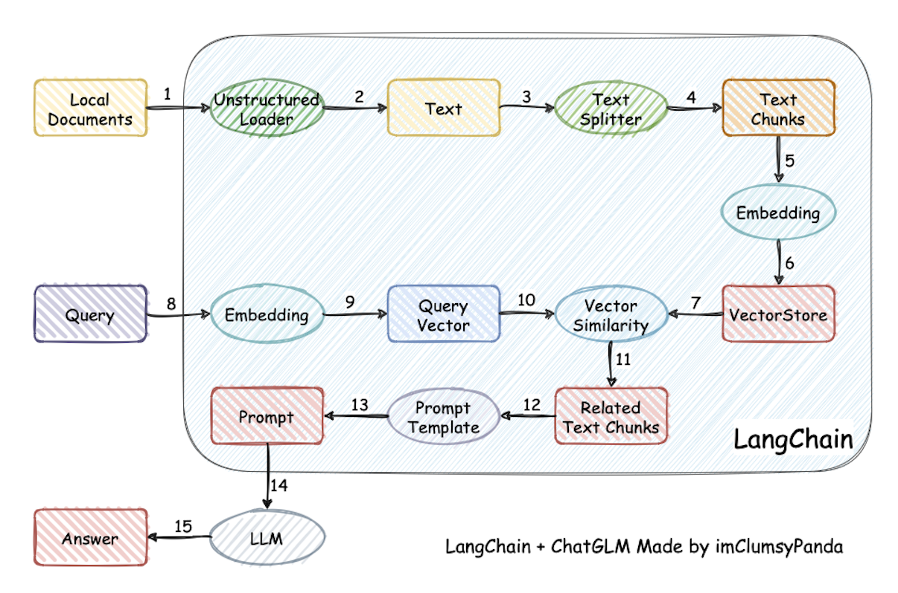

### 问题提出

我有一组内部文档，包含大量的内部知识，如何利用chatGPT这样的大语言模型进行知识检索。

用embedding和KNN是一个方案，这里还有另外一个方案：

### 解决方案

把私有文档分割为chunk，分别embedding后存储到向量数据库。

输入一个查询，embedding后与文档的向量数据库做相似性比较，将相似性较高的chunk提取用作prompt优化，查询大语言模型。

引用网友的一个图：



### 参考资料

```shell
https://github.com/imClumsyPanda/langchain-ChatGLM
https://zhuanlan.zhihu.com/p/613155165
https://github.com/jerryjliu/llama_index
```

