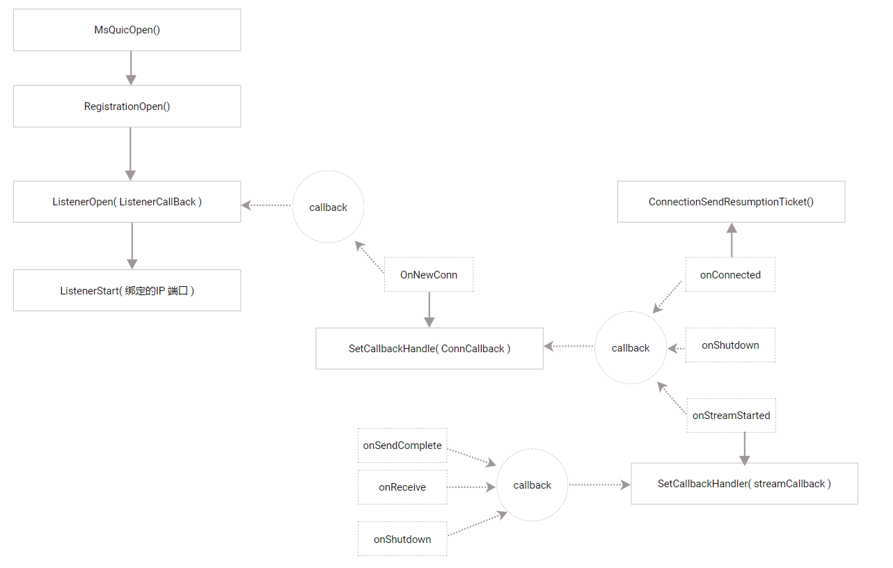

### msquic使用一瞥


msquic是微软开源的quic协议栈，满足IETE标准。

支持：

1. TLS 1.3
2. 0 RTT
3. 可靠传输和不可靠用户报文
4. 流并发和避免队头阻塞
5. 客户端IP端口改变后的快速恢复会话

详细见：

```
https://github.com/microsoft/msquic
```

#### 一、客户端开发的流程


#### 二、服务端开发流程



#### 三、关于安装

我尝试从源代码编译，但cmake没有成功。官方也说cmake没有很好的保障。

但可以从ubuntu的包管理直接安装：

```
sudo apt install libmsquic
```

从官方github 克隆到源代码后，/src/tools/sample/目录下有个浅显易懂的sample.c，可以自己写makefile把它编译好，就可以执行cs通信了。