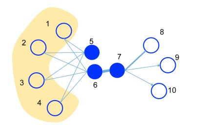
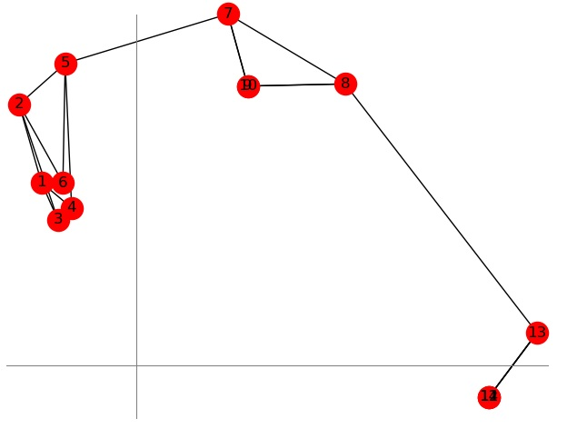
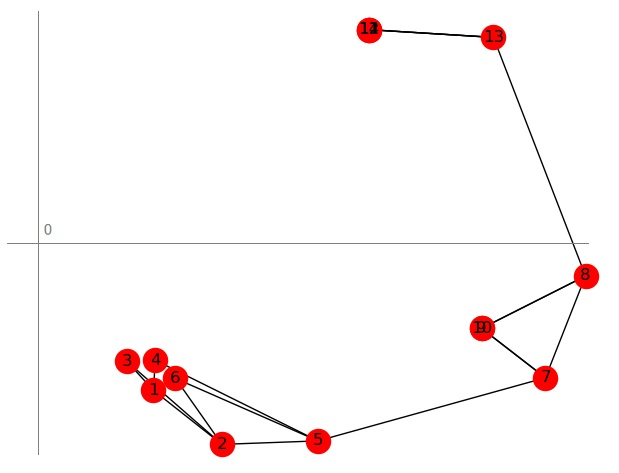
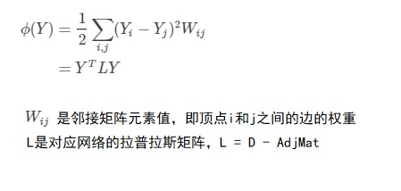
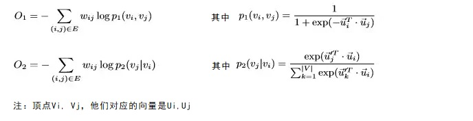
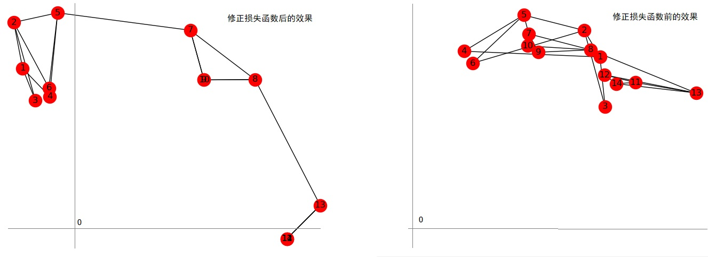

# network embedding学习笔记

network，是指例如社交应用中用户之间的好友关系形成的一张网，或者博客应用中用户、博客之间的关注、订阅关系，或者web网页相互之间的link诸如此类的等等网络形态

network embedding，类似nlp中的词向量，就是要对network中的实体（节点或者边）用向量表示，向量之间的距离表示实体之间的相似度。是网络中分类、聚类、推荐等应用的基础设施。

网友有一张图很好的展现了他们之间的关系：


该图引用自下面的文章，该文章也是ne方面很全面的信息索引。

```
https://github.com/chihming/awesome-network-embedding #论文与实现的索引
http://networkx.github.io/  # 网络操作python库
http://socialcomputing.asu.edu/pages/datasets # 公开的数据集
```

两个顶点之间的相似度包括两方面：

1. 一阶相似度：即顶点之间连接的边的权重，没有边连接，一阶相似度为0。例如下图中的顶点6和7是一阶相似的。
2. 二阶相似度：两个顶点他们邻近网络结构之间的相似度，他们分别与所有其他顶点之间一阶相似度决定了二阶相似度。例如下面图中，顶点5和6有相同的邻接顶点（1,2,3,4），他们的二阶相似性很强。如果两个顶点没有共同的邻接顶点，那么他们的二阶相似性为0



## 1、DeepWalk算法

DeepWalk算法思想比较简单直观：在网络中随机游走，将路径记录下来，每条路径看做一个句子，经过的节点看做是句子中的词，然后使用skip gram算法训练词向量。

论文地址：

```
https://arxiv.org/abs/1403.6652
```

[python示例代码在这里](https://github.com/bisonliao/daydayup/blob/master/mxnet/networkEmbedding_DeepWalk.py)

由于公开数据集普遍较大，训练出来的NE不容易看到直观的效果，我自己定义一个小小的网络，通过聚类和图形展示来验证其效果。

网络结构如下：


训练维度为2的embedding节点向量，使用kmeans聚类（需要指定簇的个数，3），输出的各节点的标签为：

```
[1 1 1 1 1 1 2 2 2 2 0 0 0 0]
```

可以看出，聚类为3个，前6个节点为一个簇，中间四个节点为一个簇，后4个节点为一个簇，符合预期。

使用DBScan算法聚类，可以不指定簇的个数，需要微调最大距离等参数，也可以做到符合预期的聚类：

```python
cl = DBSCAN(min_samples=3, metric='cosine', eps=0.05)
print(cl.fit_predict(m))
```

可视化显示出来如下：


节点2的最近5个点是3、1、4、6、5，前面的小数是余弦相似度：

```
[
 (0.9994833469390869, 'u3'), 
 (0.9992480874061584, 'u1'), 
 (0.9983071684837341, 'u4'), 
 (0.9981566071510315, 'u6'), 
 (0.9899411797523499, 'u5')
 ]
```

## 2、node2vec算法

node2vec算法类似DeepWalk算法，通过两个参数p、q来控制游走过程中的策略：


论文地址：

```
https://cs.stanford.edu/people/jure/pubs/node2vec-kdd16.pdf
```

没有太能理解p、q对相似性的影响的理解。下面是P、Q两种典型情况：


[我自己的python示例代码在这里](https://github.com/bisonliao/daydayup/blob/master/mxnet/networkEmbedding_Node2Vec.py)

pip3可以安装一个叫做node2vec的包，它使用gensim.models.word2vec.Word2Vec来训练词向量。官网在：

```
https://github.com/eliorc/node2vec
```

对比效果如下：


我自己的代码对1万多个节点的BlogCatalog实际网络进行embedding（P和Q等于1），抽查聚类后的簇内的边的密度和簇间的边的密度，符合预期：

```
avg edges dense in cluster:0.05517
avg edges dense between cluster:0.00279
```

node2vec包的embedding后的聚类效果：

```
avg edges dense in cluster:0.11051
avg edges dense between cluster:0.01579
```

节点2的相似节点，两者给出的答案不一致：

```
the similar node of #2: 3400 2241 1739 4123 4007 2090 1509 4209 407 8061
the similar node of #2: 7389 3017 3050 3400 3345 7578 4372 7589 7113 4780 
```

[pip3 node2vec包调用的代码在这里](https://github.com/bisonliao/daydayup/blob/master/mxnet/networkEmbedding_Node2Vec_official.py)

## 3、矩阵因子分解的算法

这一类算法是把网络表示为矩阵，对矩阵进行分解来得到各个顶点的向量。这类算法有很多。例如：

### 3.1 图分解

两个顶点向量的点积结果，等价于他们的之间的边。

基本思想是：将邻接矩阵 Y 分解为 U 点乘 U的转置的形式。U的每一行就是一个节点的embedding。适合无向图网络。

假设网络中有N个节点，那么Y的shape是(N, N)， network embedding的维度假设是r，那么U的shape是    （N，r），U的转置的shape是（r，N）。

已知Y，采用梯度下降的方法可以求得U。损失函数是：
$$
1/2*|| Y - U.Transpose(U)||^2 + λ/2 * ||Y||^2
$$
后面这项是正则化部分。

理解起来还是比较直观的：

1. 如果两个顶点之间有边直接连接（邻接矩阵对应元素为1），学习到的他们embedding向量点乘的结果趋近1， 那么这两个向量的cosin相似度趋近1，距离很近
2. 如果两个顶点连个节点之间没有边直接连接，学习到的他们embedding向量点乘的结果趋近0， 那么这两个向量的cosin相似度趋近0，这两个向量正交，距离较远
3. 相互间边密度较大的一组顶点，他们的embedding向量将距离较近。这样也就考虑到了二阶相似性。

一般而言，邻接矩阵 对角线上的元素可能为0，但U和U的转置的点积结果的对角线元素会大于0，这里需要特殊处理一下。可以有两种方式：

1. 对角线元素改为1，使得embedding的向量模为1。对于图的边上有不一样权重的情况，这样做不一定合适
2. 对这些元素不计算损失，解除他们的约束。（代码中的flags矩阵就是起这个作用的）

另外需要注意的是，r不能太小，否则无法比较彻底的收敛，因为自由度不够。从方程组求解的角度也比较好理解，U里面有 r x N个未知数，而Y中每个元素都对应一个方程，即有N x N个约束。对于无权重的无向图，邻接矩阵是对称矩阵，即 Y = Transpose(Y)，有N(N-1)/2 个约束，所以 r 不能小于(N-1)/2

上面的14个节点的小网络的例子，r 取8的时候，损失函数可以比较好的收敛，点乘的结果非常接近Y，embedding结果符合预期：

```
ep:9900, loss:0.0106
聚类标签：[0 0 0 0 0 0 2 2 2 2 1 1 1 1]
节点#2的相似节点：[ 3, 6, 1, 5, 4, 7]
```

因为我们的目的不是要求的U完全满足点乘后的结果等于Y，而是求得对节点的embedding，所以不要求彻底的收敛。而且当节点数很多的时候，r 也会很大，不切实际。 我们看一下把 r 设置为2的embedding效果怎么样。

可以看到，损失函数收敛程度不怎么好，但embedding效果符合预期：

```
ep:9900, loss:0.1072
聚类的簇标签：[0 0 0 0 0 0 2 2 2 2 1 1 1 1]
节点#2的相似节点：[4, 6, 1, 3, 5, 7]
```



对1万多个节点的实际网络进行测试，对embedding进行聚类，对比簇内和簇间的边的密度、簇内和簇间的cosin距离。聚类效果不明显：

```
avg edges dense in cluster:0.12388
avg edges dense between cluster:0.11402
```

[python示例代码在这里](https://github.com/bisonliao/daydayup/blob/master/mxnet/networkEmbedding_GraphFactor.py)

### 3.2 局部线性嵌入（Locally Linear Embedding）

思想是：各顶点的向量，等于其他所有顶点向量的线性组合，而这个线性组合的系数，就是邻接矩阵对应的行。即满足：
$$
U = AdjMat . U
$$
要使用梯度下降的方法学习得到U，还需要一个损失函数，损失函数就是上式等号两边的矩阵差值的模：
$$
L = || U - AdjMat.U||^2
$$
为了避免U逐步退化为0矩阵，加一些约束，例如1/U的模不能太大。

我使用梯度下降方法最后没有成功，embedding效果不好。

仔细观察，可以看出U的每一列就是邻接矩阵的一个特征向量。所以采取求特征值特征向量的方法可以完成embedding，小规模网络应用效果不错：



[python示例代码](https://github.com/bisonliao/daydayup/blob/master/mxnet/networkEmbedding_localLinearEmb.py)

还是求特征向量的方法，对1万个节点的实际网络进行测试，抽查聚类后簇中的边密度和簇间的边密度，聚类效果较明显：

```
avg edges dense in cluster:0.19932
avg edges dense between cluster:0.07237
```

求巨型矩阵的特征向量，不是一件容易的事情。查了一下wiki，没有发现比较简单的算法。

### 3.3 拉普拉斯特征映射（Laplacian Eigenmaps ）

思想是：如果两个结点它们之间的连边对应的权重越大，则表明这两个节点越相近，因此在embedding之后对应的值应该越相近。 因此可以得到一下最优化目标：



## 4、LINE算法

LINE是large-scale Information Network Embedding的首字母缩写，可用于有向图、无向图、有权图、无权图。

论文：

```
http://www.www2015.it/documents/proceedings/proceedings/p1067.pdf
```

LINE的损失函数分两部分，其中O1描述一阶相似度损失，O2描述二阶相似度损失：



所以，LINE算法又分为LINE-1st 和LINE-2nd，分别对应一阶相似度和二阶相似度。如果要同时考虑两部分相似度，先分开训练，然后把学习到的两种向量concat起来（居然不是加起来）。

可以看出上面的计算量很大，对于大的网络无法简单适配到单机内存。论文里提出了优化方案，还没有看懂...

LINE-1st对上面15个顶点的小网络进行embedding，发现聚类效果不好，修改损失函数，增加一项：没有边连接的顶点之间，他们的点积的绝对值尽量的小，聚类效果就很好了，如下图：



跟前面的图分解算法的结果很接近。

损失函数：

```python
def my_loss(adj:nd.NDArray, U:nd.NDArray):
    # 有边相连的两个顶点向量的点积要尽量的大，也就是cos相似度尽量的大
    diff = nd.dot(U,U.transpose())*(-1) #type:nd.NDArray
    diff = 1/(1+diff.exp())#type:nd.NDArray
    diff = diff.log()
    diff = adj * diff * (-1)
    # LINE-1st是没有这一项的，发现聚类效果不好。我修正一下：
    # 没有边相连的两个顶点向量的点积的绝对值要尽量的小，也就是cos相似度为0
    diff2 = (nd.ones_like(adj, ctx=context) - adj)*nd.dot(U,U.transpose())
    return  diff.sum()+nd.norm(diff2, ord=2)
```

对1万个节点的实际网络进行测试，符合预期：

```
avg edges dense in cluster:0.09559
avg edges dense between cluster:0.02555
```

[python示例代码LINE-1st](https://github.com/bisonliao/daydayup/blob/master/mxnet/networkEmbedding_LINE1.py)

我对LINE-2nd的试验失败了，还没有找到原因

[python示例代码LINE-2nd](https://github.com/bisonliao/daydayup/blob/master/mxnet/networkEmbedding_LINE2.py)