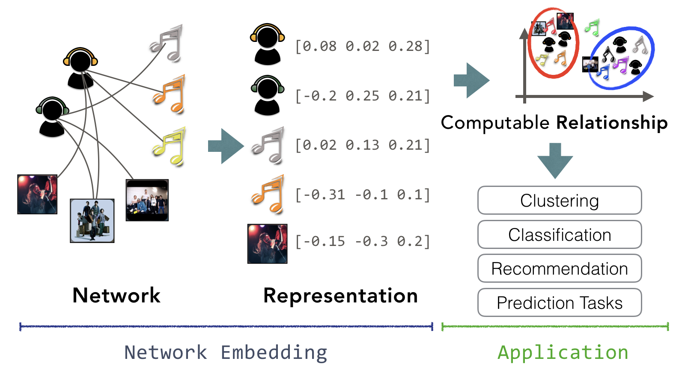
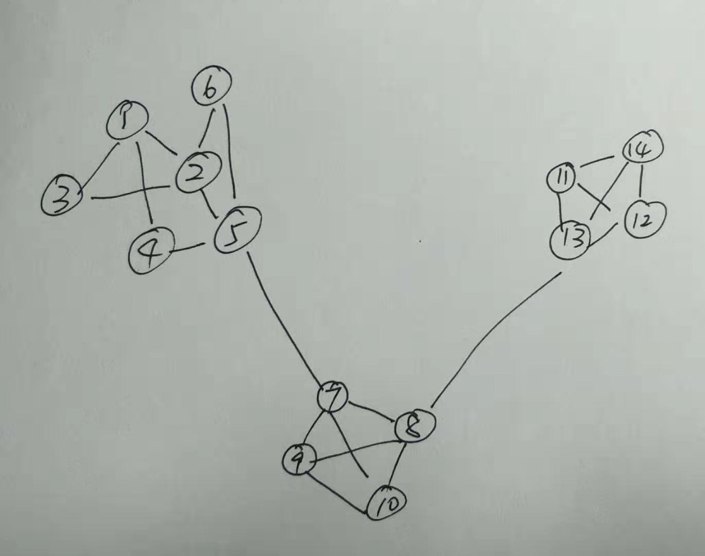
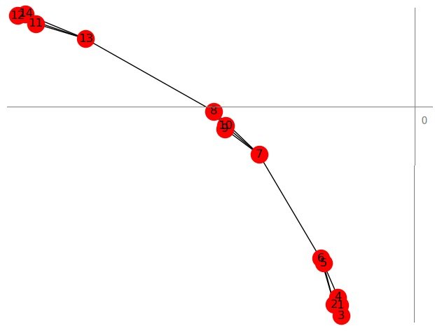
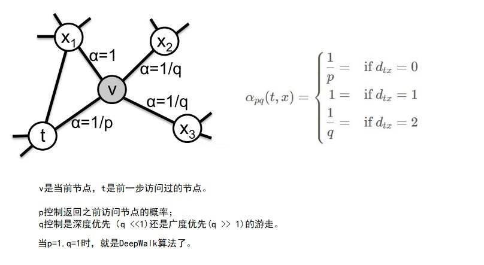
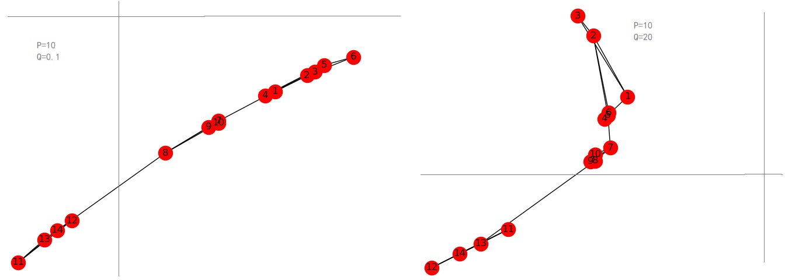
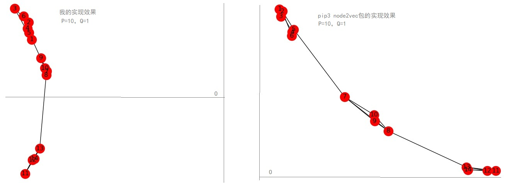

# network embedding学习笔记

network，是指例如社交应用中用户之间的好友关系形成的一张网，或者博客应用中用户、博客之间的关注、订阅关系，或者web网页相互之间的link诸如此类的等等网络形态

network embedding，类似nlp中的词向量，就是要对network中的实体（节点或者边）用向量表示，向量之间的距离表示实体之间的相似度。是网络中分类、聚类、推荐等应用的基础设施。

网友有一张图很好的展现了他们之间的关系：



该图引用自下面的文章，该文章也是ne方面很全面的信息索引。

```
https://github.com/chihming/awesome-network-embedding #论文与实现的索引
http://networkx.github.io/  # 网络操作python库
http://socialcomputing.asu.edu/pages/datasets # 公开的数据集
```

## 1、DeepWalk算法

DeepWalk算法思想比较简单直观：在网络中随机游走，将路径记录下来，每条路径看做一个句子，经过的节点看做是句子中的词，然后使用skip gram算法训练词向量。

[python示例代码在这里](https://github.com/bisonliao/daydayup/blob/master/mxnet/networkEmbedding_DeepWalk.py)

由于公开数据集普遍较大，训练出来的NE不容易看到直观的效果，我自己定义一个小小的网络，通过聚类和图形展示来验证其效果。

网络结构如下：



训练维度为2的embedding节点向量，使用kmeans聚类（需要指定簇的个数，3），输出的各节点的标签为：

```
[1 1 1 1 1 1 2 2 2 2 0 0 0 0]
```

可以看出，聚类为3个，前6个节点为一个簇，中间四个节点为一个簇，后4个节点为一个簇，符合预期。

使用DBScan算法聚类，可以不指定簇的个数，需要微调最大距离等参数，也可以做到符合预期的聚类：

```python
cl = DBSCAN(min_samples=3, metric='cosine', eps=0.05)
print(cl.fit_predict(m))
```

可视化显示出来如下：



节点2的最近5个点是3、1、4、6、5，前面的小数是余弦相似度：

```
[
 (0.9994833469390869, 'u3'), 
 (0.9992480874061584, 'u1'), 
 (0.9983071684837341, 'u4'), 
 (0.9981566071510315, 'u6'), 
 (0.9899411797523499, 'u5')
 ]
```

对1万多个节点的BlogCatalog进行embedding，与官方的embedding结果对比，同一个节点（#58）的top5相似节点集合不一致，交集为0。与类似节点的相邻节点集合比较jaccard相似度，两个实现的jaccard相似度接近。

## 2、node2vec算法

node2vec算法类似DeepWalk算法，通过两个参数p、q来控制游走过程中的策略：



没有太能理解p、q对相似性的影响的理解。下面是P、Q两种典型情况：



[python示例代码在这里](https://github.com/bisonliao/daydayup/blob/master/mxnet/networkEmbedding_Node2Vec.py)

pip3可以安装一个叫做node2vec的包，它使用gensim.models.word2vec.Word2Vec来训练词向量。官网在：

```
https://github.com/eliorc/node2vec
```

对比效果如下：



对1万多个节点的网络进行简单对比，发现节点2的相似节点，两者给出的答案不一致：

```
the similar node of #2: 3400 2241 1739 4123 4007 2090 1509 4209 407 8061
the similar node of #2: 7389 3017 3050 3400 3345 7578 4372 7589 7113 4780 
```

