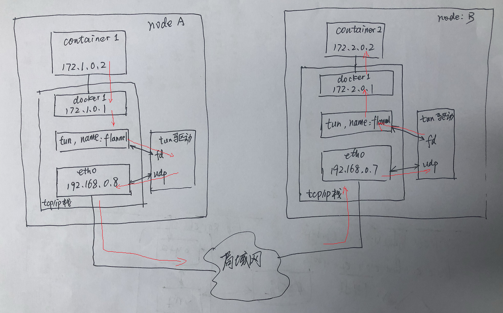

### tun和tap虚拟网卡


tun设备工作在三层，tap设备工作在二层。


借用网友的一个图：


如图所示，两个应用程序 A 和 B，都处于用户层，其他的设备都处于内核层，数据的流向可以顺着数字方向来查看。

TUN0 是一个虚拟网卡设备，可以看到它与物理网卡相同的地方在于它们的一端都连接内核协议栈，不同的地方在于物理网卡另一端连接的是外面的交换机或者路由器等硬件设备，TUN0 连接的是处于用户层的应用程序，协议栈发送给虚拟网卡的数据都被发送到了应用程序中，通过加密，转换，校验等方式后通过物理网卡发送出去。

用户层的应用程序 A 发送了一个普通的数据包，socket 将数据包发送给内核协议栈，内核协议栈根据目的地址进行路由，查询路由表，发现数据包的下一跳地址应该为 TUN0 网卡，所以内核协议栈将数据包发送给虚拟网卡设备 TUN0，TUN0 接收到数据之后通过某种方式从内核空间将数据发送给运行在用户空间的应用程序 B，B 收到数据包后进行一些处理，然后构造一个新的数据包，通过 socket 发送给内核协议栈，这个新的数据包的目的地址变成了一个外部地址，源地址变成了 eth0 的地址，内核协议栈通过查找路由表之后发现目的地址找不到，就会将数据包通过 eth0 网卡发送给网关，eth0 接收到数据之后将数据包发送到和 eth0 网卡物理相连的外部设备。

用户层应用程序B如果往tun0里写入一个IP包，这个IP包会从tun0网卡收到，然后向上走协议栈层层解析，到达应用程序。

#### 一、tun设备


```shell
#确认内核安装了tun/tap
modinfo tun  #不需要额外modinfo tap，也不需要/dev/net/tap的存在，有/dev/net/tun就可以

ip tuntap add dev tun0 mode tun
ip addr add 192.168.1.10/24 dev tun0
ip link set tun0 up
ip route  #确认一下路由表是否ok
```


```c
//简单的驱动程序，读虚拟网卡的包
#include <stdlib.h>
#include <stdio.h>
#include <string.h>
#include <netinet/in.h>
#include <linux/if_tun.h>
#include <linux/if.h>
#include <sys/types.h>
#include <sys/stat.h>
#include <fcntl.h>
#include <sys/ioctl.h>
#include <sys/socket.h>
#include <netinet/in.h>
#include <arpa/inet.h>

int tun_alloc(char *dev, int flags) {

  struct ifreq ifr;
  int fd, err;
  char *clonedev = "/dev/net/tun";
   if( (fd = open(clonedev, O_RDWR)) < 0 ) { /* 使用读写方式打开 */
     return fd;
   }

   memset(&ifr, 0, sizeof(ifr));

   ifr.ifr_flags = flags;   /* IFF_TUN or IFF_TAP, plus maybe IFF_NO_PI */

   if (*dev) {
     strncpy(ifr.ifr_name, dev, IFNAMSIZ); /* 设置设备名称 */
   }

   if( (err = ioctl(fd, TUNSETIFF, (void *) &ifr)) < 0 ) {
     close(fd);
     return err;
   }

  strcpy(dev, ifr.ifr_name);

  return fd;
}

int analyze_iphdr(const char * buf, char * src, char *dest, uint8_t * proto)
{
    uint8_t c = buf[0];
    uint8_t version = c & 0x0f;
    uint8_t hdrlen = c >> 4;
    *proto = *(uint8_t*)(buf+9);
    uint16_t totalLen = *(uint16_t*)(buf+2);
    totalLen = ntohs(totalLen);

    struct in_addr srcIP, destIP;
    srcIP.s_addr = *(uint32_t*)(buf+12);
    destIP.s_addr = *(uint32_t*)(buf+16);

    strcpy(src, inet_ntoa(srcIP));
    strcpy(dest, inet_ntoa(destIP));

    printf("ipv%d, hdrlen:%d, totalLen:%d, svc:%u, [%s]->[%s]\n", version, hdrlen, totalLen, *proto, src, dest);

    return 0;

}

int main()
{
        #define IFRAME_SZ 5000
        char tun_name[IFRAME_SZ];

        strcpy(tun_name, "tun0");
        int tun_fd = tun_alloc(tun_name, IFF_TUN | IFF_NO_PI);  /* tun interface */

        if(tun_fd < 0){
                perror("Allocating interface");
                exit(1);
        }

        while(1) {
                char buffer[5000];
                int nread = read(tun_fd,buffer,sizeof(buffer));
                if(nread < 0) {
                        perror("Reading from interface");
                        close(tun_fd);
                        exit(1);
                }

                printf("Read %d bytes from device %s\n", nread, tun_name);
                uint8_t proto;
                char src[100];
                char dest[100];
                analyze_iphdr(buffer, src, dest, &proto);
        }
        return 0;
}

```

```shell
gcc -o ttx a.c
./ttx 

#在本级的另外一个终端，可以看到ttx有输出
ping 192.168.1.12

#同时可抓包
tshark -i tun0
```

#### 二、tap设备

tap设备工作在二层，链路层。

```shell
ip tuntap add dev tap0 mode tap
ip addr add 192.168.2.10/24 dev tap0
ip link set tap0 up
ip route  #确认一下路由表是否ok
```

一个简单的驱动：

```c
#include <stdlib.h>
#include <stdio.h>
#include <string.h>
#include <netinet/in.h>
#include <linux/if_tun.h>
#include <linux/if.h>
#include <sys/types.h>
#include <sys/stat.h>
#include <fcntl.h>
#include <sys/ioctl.h>
#include <sys/socket.h>
#include <netinet/in.h>
#include <arpa/inet.h>

int tun_alloc(char *dev, int flags) {

  struct ifreq ifr;
  int fd, err;
  char *clonedev = "/dev/net/tun";

   if( (fd = open(clonedev, O_RDWR)) < 0 ) {
     printf("%d\n", __LINE__);
     return fd;
   }

   memset(&ifr, 0, sizeof(ifr));

   ifr.ifr_flags = flags;   /* IFF_TUN or IFF_TAP, plus maybe IFF_NO_PI */

   if (*dev) {
     strncpy(ifr.ifr_name, dev, IFNAMSIZ);
   }

   if( (err = ioctl(fd, TUNSETIFF, (void *) &ifr)) < 0 ) {
     close(fd);
     printf("%d\n", __LINE__);
     return err;
   }

  strcpy(dev, ifr.ifr_name);

  return fd;
}

int analyze_machdr(const char * buf)
{
    int i;
    printf("dst mac");
    for (i = 0; i < 6; i++)
    {
        printf(":%02x", *(uint8_t*)(buf+i));
    }
    printf("\t");
    printf("src mac");
    for (i = 0; i < 6; i++)
    {
        printf(":%02x", *(uint8_t*)(buf+i+6));
    }
    printf("\t");
    uint16_t type = *(uint16_t*)(buf+12);
    type = ntohs(type);
    printf("type:%04x\n", type);

    return 0;

}

int main()
{
        #define IFRAME_SZ 5000
        char tun_name[IFRAME_SZ];

        strcpy(tun_name, "tap0");
        int tun_fd = tun_alloc(tun_name, IFF_TAP | IFF_NO_PI);  /* tun interface */

        if(tun_fd < 0){
                perror("Allocating interface");
                exit(1);
        }

        while(1) {
                char buffer[5000];
                int nread = read(tun_fd,buffer,sizeof(buffer));
                if(nread < 0) {
                        perror("Reading from interface");
                        close(tun_fd);
                        exit(1);
                }

                printf("Read %d bytes from device %s\n", nread, tun_name);
                analyze_machdr(buffer);
        }
        return 0;
}
```

简单测试：

```shell
gcc -o ttx b.c
./ttx 

#在本级的另外一个终端，可以看到ttx有输出
ping 192.168.2.12

#同时可抓包
tshark -i tap0
```

参考文档：

```
https://backreference.org/2010/03/26/tuntap-interface-tutorial/
https://zhuanlan.zhihu.com/p/260405786
```

#### 三、用tun打通不同node上的容器（模拟k8s的flannel组件）

k8s中的pod都有一个独立的ip，集群内pod之间都可以通过pod ip相互通信，且pod自己看到的ip和别的pod看它的ip都是一样的。也就是说K8S集群内pod有一致的平面的pod IP。

如果是从docker过来的小胸弟，有点困惑。毕竟不同node上的docker容器之间是无法通过容器内的IP相互通信的，哪怕同node的不同bridge上挂载的容器之间也不同相互通信。

K8S实现上述平面一致的pod ip有诸多方法，例如某云商把所有的跨node的pod通信的IP包路由到所在node机器的gateway，这个gateway了解K8S集群内所有pod的IP的规划和位置，负责把IP用GRE封装重新路由到合适的位置。

还有一种实现就是用tun/tap设备中转，早期K8S就是这么做的。为了练手，我这两天模拟实现了这种方式，把位于两个node上的两个容器打通了。

先上架构图：

 


几个关键点：

1. node要打开路由转发模式，变成一台路由

2. docker默认会把node开启nat功能，我们要关闭它

3. 规划好pod ip，假设都使用172开头，在不同的node上的pod ip第二个字节不同

4. 在每个node上加一条路由：172开头的ip包转发到tun设备

   

工作原理就是：

1. node A上的pod1给node B上的pod2发IP包，根据pod1的默认路由，发送到docker1这个虚拟网桥
2. 每个node有三个设备：docker1、tun、eth0，对于docker1收到的ip包，协议栈进行路由转发，因为是172开头（且不是172.1开头，否则就要发给docker1），发给tun
3. tun的驱动程序读取到这个ip包，发现目的地址是172.2.x.x，用udp的方式发给相应的node B，也就是192.168.0.7这个地址
4. node B上的tun驱动收到了udp包，就写本地的tun，（当然，生产环境下应该要校验一下合法性有效性），相当于tun这个网卡收到包了
5. 由于地址不是本机设备的地址，node B的协议栈对于tun收到的包进行路由转发，查路由表172.2开头，应该转给docker1这个虚拟网桥
6. docker1根据路由把包发给了pod2


配置的脚本：

```shell
#修改/etc/docker/daemon.json文件，添加下面三行，不让docker修改iptables，避免node开启NAT功能
{
    "iptables": false
}
# 我发现docker 20版本很听话，18版本就贼他妈的不听话，哪怕启动的时候加上 --iptables=false的参数都不行，
# 用iptables -L检查一下发现还是被动了，那就iptables --flush清理吧

#在node A上创建网桥、tun、并修改为路由转发，并增加一条路由，使得相关IP报文走tun设备过
docker network create -d bridge --subnet 172.1.0.1/16 docker1
docker run -itd --privileged --rm --network=docker1 --name=pod1  nettools bash

ip tuntap add dev flannel mode tun
ip link set flannel up

echo 1 >/proc/sys/net/ipv4/ip_forward
ip route add 172.0.0.0/8 dev flannel

#在node B上如法炮制
docker network create -d bridge --subnet 172.2.0.1/16 docker1
docker run -itd --privileged --rm --network=docker1 --name=pod2  nettools bash

ip tuntap add dev flannel mode tun
ip link set flannel up

echo 1 >/proc/sys/net/ipv4/ip_forward
ip route add 172.0.0.0/8 dev flannel
```

如此配置后，各个部分的路由表如下：

```shell
#pod 1的路由
Destination     Gateway         Genmask         Flags Metric Ref    Use Iface
default         172.1.0.1       0.0.0.0         UG    0      0        0 eth0
172.1.0.0       0.0.0.0         255.255.0.0     U     0      0        0 eth0

#nodeA的路由
Destination     Gateway         Genmask         Flags Metric Ref    Use Iface
172.0.0.0       0.0.0.0         255.0.0.0       U     0      0        0 flannel
172.1.0.0       0.0.0.0         255.255.0.0     U     0      0        0 br-e7eb8e782a36 #docker1
192.168.0.0     0.0.0.0         255.255.255.0   U     202    0        0 eth0

# pod2的路由
Destination     Gateway         Genmask         Flags Metric Ref    Use Iface
default         172.2.0.1       0.0.0.0         UG    0      0        0 eth0
172.2.0.0       0.0.0.0         255.255.0.0     U     0      0        0 eth0

#nodeB的路由
Destination     Gateway         Genmask         Flags Metric Ref    Use Iface
172.0.0.0       0.0.0.0         255.0.0.0       U     0      0        0 flannel
172.2.0.0       0.0.0.0         255.255.0.0     U     0      0        0 br-9ea04d2636e6 #docker1
192.168.0.0     0.0.0.0         255.255.255.0   U     202    0        0 eth0

```

驱动程序的代码：

```c
#include <stdlib.h>
#include <stdio.h>
#include <string.h>
#include <netinet/in.h>
#include <linux/if_tun.h>
#include <linux/if.h>
#include <sys/types.h>
#include <sys/stat.h>
#include <fcntl.h>
#include <sys/ioctl.h>
#include <sys/socket.h>
#include <netinet/in.h>
#include <arpa/inet.h>
#include <unistd.h>

#define UDP_PORT (3009)

//打开tun
int tun_alloc(char *dev, int flags)
{

    struct ifreq ifr;
    int fd, err;
    char *clonedev = "/dev/net/tun";
    if ((fd = open(clonedev, O_RDWR)) < 0)
    { /* 使用读写方式打开 */
        return fd;
    }

    memset(&ifr, 0, sizeof(ifr));

    ifr.ifr_flags = flags; /* IFF_TUN or IFF_TAP, plus maybe IFF_NO_PI */

    if (*dev)
    {
        strncpy(ifr.ifr_name, dev, IFNAMSIZ); /* 设置设备名称 */
    }

    if ((err = ioctl(fd, TUNSETIFF, (void *)&ifr)) < 0)
    {
        close(fd);
        return err;
    }

    strcpy(dev, ifr.ifr_name);

    return fd;
}
//打开udp
int udp_alloc(int port, const char *ip)
{
    int sockfd;
    struct sockaddr_in server;
    socklen_t len;

    /* Creating UDP socket */
    if ((sockfd = socket(AF_INET, SOCK_DGRAM, 0)) == -1)
    {
        perror("Creating socket failed.");
        exit(1);
    }
    bzero(&server, sizeof(server));
    server.sin_family = AF_INET;
    server.sin_port = htons(port);
    server.sin_addr.s_addr = inet_addr(ip);
    if (bind(sockfd, (struct sockaddr *)&server, sizeof(server)) == -1)
    {
        perror("Bind() error.");
        exit(1);
    }
    return sockfd;
}
//显示ip头部信息
int analyze_iphdr(const char *buf, char *src, char *dest, uint8_t *proto)
{
    uint8_t c = buf[0];
    uint8_t version = c & 0x0f;
    uint8_t hdrlen = (c >> 4)*4;
    *proto = *(uint8_t *)(buf + 9);
    uint16_t totalLen = *(uint16_t *)(buf + 2);
    totalLen = ntohs(totalLen);

    struct in_addr srcIP, destIP;
    srcIP.s_addr = *(uint32_t *)(buf + 12);
    destIP.s_addr = *(uint32_t *)(buf + 16);

    strcpy(src, inet_ntoa(srcIP));
    strcpy(dest, inet_ntoa(destIP));

    printf("ipv%d, hdrlen:%d, totalLen:%d, svc:%u, [%s]->[%s]\n", version, hdrlen, totalLen, *proto, src, dest);

    return 0;
}

void printUsage(int argc, char **argv)
{
    printf("%s eth_ip\n", argv[0]);
    if (argc < 2)
    {
        exit(0);
    }
}
//according to pod ip, find the node ip.
// argument ip is in/out
int k8sRoute(char * ip) 
{
    if (strncmp(ip, "172.1", 5) == 0)
    {
        strcpy(ip, "192.168.0.8");
    }
    else if (strncmp(ip, "172.2", 5) == 0 )
    {
        strcpy(ip, "192.168.0.7");
    }
    else 
    {
        strcpy(ip, "192.168.0.7");
    }
    return 0;
}
int sendToOtherNode(const char *buf, size_t len,  int udp_fd, const char * ip)
{
    struct sockaddr_in server;
    

    bzero(&server, sizeof(server));
    server.sin_family = AF_INET;
    server.sin_port = htons(UDP_PORT);
    server.sin_addr.s_addr = inet_addr(ip);

    return sendto(udp_fd, buf, len, 0, (const struct sockaddr*)&server, (socklen_t)sizeof(server));
}

int main(int argc, char **argv)
{
#define IFRAME_SZ 5000
    char tun_name[IFRAME_SZ];
    char eth_ip[100];

    printUsage(argc, argv);
    strcpy(eth_ip, argv[1]);

    strcpy(tun_name, "flannel");
    int tun_fd = tun_alloc(tun_name, IFF_TUN | IFF_NO_PI); /* tun interface */

    if (tun_fd < 0)
    {
        perror("Allocating interface");
        exit(1);
    }
    int udp_fd = udp_alloc(UDP_PORT, eth_ip);
    if (udp_fd < 0)
    {
        exit(1);
    }
//从两个设备不断的收发包，倒腾咯
    while (1)
    {
        fd_set rdset;
        int maxfd = 0;
        FD_ZERO(&rdset);
        FD_SET(udp_fd, &rdset); if (udp_fd > maxfd) { maxfd = udp_fd;}
        FD_SET(tun_fd, &rdset); if (tun_fd > maxfd) { maxfd = tun_fd;}

        int fdnum = select(maxfd+1, &rdset, NULL, NULL, 0);
        if (fdnum < 1)
        {
            continue;
        }
        if (FD_ISSET(udp_fd, &rdset))
        {
            char buffer[5000];
            int nread = read(udp_fd, buffer, sizeof(buffer));
            if (nread >= 20)
            {
                printf("Read %d bytes from device %s， udp, content:", nread, eth_ip);
                uint8_t proto;
                char src[100];
                char dest[100];
                analyze_iphdr(buffer, src, dest, &proto);

                write(tun_fd, buffer, nread);
            }
            else
            {
                fprintf(stderr, "invalid IP packet overlay, len=%d\n", nread);
            }
        }
        if (FD_ISSET(tun_fd, &rdset))
        {
            char buffer[5000];
            int nread = read(tun_fd, buffer, sizeof(buffer));
            if (nread < 0)
            {
                perror("Reading from interface");
                close(tun_fd);
                exit(1);
            }

            printf("Read %d bytes from device %s, ", nread, tun_name);
            uint8_t proto;
            char src[100];
            char dest[100];
            analyze_iphdr(buffer, src, dest, &proto);
            
            k8sRoute(dest);
            printf("transfer to %s\n", dest);
            sendToOtherNode(buffer, nread, udp_fd, dest);

        }
  
    }
    return 0;
}

```

跑起来后，两个pod能够相互ping通，在各个关键节点用tcpdump抓包也都符合预期，整个系统乖乖的。