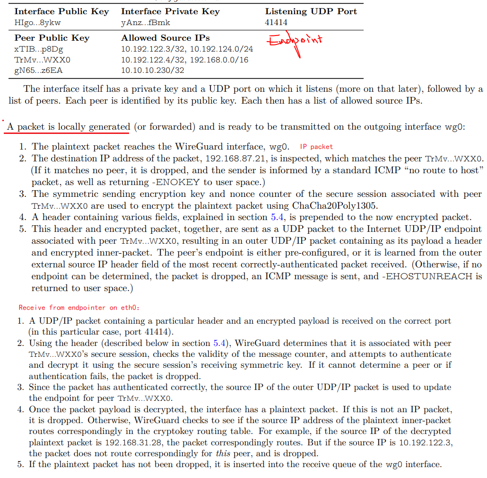

# VPN其实挺简单

## 一、实验目的

有两个局域网，每个局域网都有一台可以访问外网的机器，这两台机器相互间通过外网可以通讯。

希望使用vpn软件wireguard，把这两个局域网打通。


网络拓扑如上，绿底和黄底是两台用来部署vpn的机器，因为是云主机，他们是通过nat连接外网。外网IP是119开头的。各自的内网IP是172和10开头的，vpn的虚拟网卡IP是10.0.0.0/24。

## 二、步骤

在左边这个绿底的机器上执行：

```shell
#安装必要的软件
apt update
apt install wireguard
apt install openresolv

# 配置为转发
echo "1" > /proc/sys/net/ipv4/ip_forward

#生成公私钥，最后会贴到配置文件里
cd /etc
umask 777
wg genkey >wgpriv.key
wg pubkey <wgpriv.key >wgpub.key

cd /etc/wireguard/
#edit wg0.conf as follow:
# wg0.conf start ============================
[Interface]
#我方的私钥
PrivateKey = OIs5R69frJcqN+AAF8rYKh/qOwPAsPIbW******  
ListenPort = 10086
# VPN的虚拟IP，不是本机的eth0，是wg0这个虚拟网卡的ip
Address = 10.0.0.1
DNS = 114.114.114.114,8.8.8.8
#启动后执行iptables命令，让本机变成一个双向的nat服务器
PostUp = iptables -A FORWARD -i wg0 -j ACCEPT; iptables -t nat -A POSTROUTING -o eth0 -j MASQUERADE;iptables -A FORWARD -i eth0 -j ACCEPT; iptables -t nat -A POSTROUTING -o wg0 -j MASQUERADE
# 停止前清理iptables规则
PreDown = iptables -D FORWARD -i wg0 -j ACCEPT; iptables -t nat -D POSTROUTING -o eth0 -j MASQUERADE;iptables -D FORWARD -i eth0 -j ACCEPT; iptables -t nat -D POSTROUTING -o wg0 -j MASQUERADE

[Peer]
#对端的公钥
PublicKey = 4zoLpBxMlcD4frS5II/HWo07lN1k6PIMqpv5eEV1LUM=
#对端的IP地址和端口，用于真正的udp通信
Endpoint = 119.28.214.71:10086
# 允许对端请求过来的网段，也是允许发送到对端的目的IP，可以配置为0.0.0.0/0不限制（小心，会影响默认路由）
AllowedIPs = 10.0.0.2,172.19.16.0/20
PersistentKeepalive = 30
# wg0.conf end ============================

systemctl restart wg-quick@wg0
#用下面的命令可以看到端口起来了。wireguard实际上工作在内核态
netstat -anpl|grep 10086


```

特别说明：AllowedIPs = 10.0.0.2,172.19.16.0/20这项配置，wireguard会据此修改路由表，把目的地为这些IP段的请求都经wg0这个虚拟网卡发送出去。

同样的在右边这个黄底的机器上执行：

```shell
#安装必要的软件
apt update
apt install wireguard
apt install openresolv

# 配置为转发
echo "1" > /proc/sys/net/ipv4/ip_forward

#生成公私钥，最后会贴到配置文件里
cd /etc
umask 777
wg genkey >wgpriv.key
wg pubkey <wgpriv.key >wgpub.key

cd /etc/wireguard/
#edit wg0.conf as follow:
# wg0.conf start ============================
[Interface]
PrivateKey = mFm8HwmZ8F3LWOLxHN7gfL689HszT2+c*******
ListenPort = 10086
Address = 10.0.0.2
DNS = 114.114.114.114,8.8.8.8
PostUp = iptables -A FORWARD -i wg0 -j ACCEPT; iptables -t nat -A POSTROUTING -o eth0 -j MASQUERADE;iptables -A FORWARD -i eth0 -j ACCEPT; iptables -t nat -A POSTROUTING -o wg0 -j MASQUERADE
PreDown = iptables -D FORWARD -i wg0 -j ACCEPT; iptables -t nat -D POSTROUTING -o eth0 -j MASQUERADE;iptables -D FORWARD -i eth0 -j ACCEPT; iptables -t nat -D POSTROUTING -o wg0 -j MASQUERADE

[Peer]
PublicKey = wuq5qGADajzJfhfkcovdQ/mpnPafPxy1q8Y2S+m8TmU=
Endpoint = 119.91.159.198:10086
AllowedIPs = 10.0.0.1,10.11.7.0/24
PersistentKeepalive = 30
# wg0.conf end ============================

systemctl restart wg-quick@wg0
#用下面的命令可以看到端口起来了。wireguard实际上工作在内核态
netstat -anpl|grep 10086

```

在绿底的机器上可以ping通黄底的eth0：

```shell
# ping 172.19.16.7
PING 172.19.16.7 (172.19.16.7) 56(84) bytes of data.
64 bytes from 172.19.16.7: icmp_seq=1 ttl=64 time=9.91 ms
64 bytes from 172.19.16.7: icmp_seq=2 ttl=64 time=9.89 ms
```

在黄底机器上可以ping通左边的某个主机：

```shell
# ping 10.11.7.199
PING 10.11.7.199 (10.11.7.199) 56(84) bytes of data.
64 bytes from 10.11.7.199: icmp_seq=1 ttl=63 time=10.1 ms

```

要让两边的主机互相能通，需要修改主机的route，让两台vpn机器作为网关中转目标网段的报文。

例如在右边的每个主机上设置一个路由：

```shell
ip route add 10.11.7.0/24 via 172.19.16.7 dev eth0
```

在云主机的vpc里上面这样做行不通，因为腾讯云的vpc是用Gre实现的虚拟网络，不是用vxlan实现的。每个主机不知道同vpc下其他主机的mac地址，做不到二层转发。只能做三层转发，必须通过云控制台设置路由。

## 三、wireguard的工作原理


wireguard的原理可以[阅读这边文章]([WireGuard: Next Generation Kernel Network Tunnel](https://www.wireguard.com/papers/wireguard.pdf))。它本质上还是一种 IP over UDP的overlay网络。

摘抄一段：



其实还有个看起来不错的vpn软件叫strongswan也不错，但是我折腾了2个小时没有建立起连接，就放弃了。

## 四、用wireguard联通两台机器上的docker容器

同样的，我们可以用wireguard在两台机器间建立vpn，把两台机器上的docker容器打通。亲测有效。

需要注意的是：

1. 每台机器上docker容器的ip段要错开，例如一台是172.17.0.0/16，一台上的容器是172.18.0.0/16
2. 类似上面的iptables的命令还是需要的，实现双向nat。我一开始以为这种情况下可以不需要，但不行。
3. docker创建自定义的网桥，建议使用docker network命令，不要用brctl这些命令，我发现后者会导致本机都ping不通容器。

下面是在一台机器的一个容器里，ping另外一台机器上的某容器的记录：

```shell
# docker exec -it busybox sh
/ # ifconfig
eth0      Link encap:Ethernet  HWaddr 02:42:AC:11:00:02
          inet addr:172.17.0.2  Bcast:172.17.255.255  Mask:255.255.0.0
          UP BROADCAST RUNNING MULTICAST  MTU:1500  Metric:1
          RX packets:48 errors:0 dropped:0 overruns:0 frame:0
          TX packets:35 errors:0 dropped:0 overruns:0 carrier:0
          collisions:0 txqueuelen:0
          RX bytes:3800 (3.7 KiB)  TX bytes:2814 (2.7 KiB)

lo        Link encap:Local Loopback
          inet addr:127.0.0.1  Mask:255.0.0.0
          UP LOOPBACK RUNNING  MTU:65536  Metric:1
          RX packets:0 errors:0 dropped:0 overruns:0 frame:0
          TX packets:0 errors:0 dropped:0 overruns:0 carrier:0
          collisions:0 txqueuelen:1000
          RX bytes:0 (0.0 B)  TX bytes:0 (0.0 B)

/ # ping 172.18.0.2
PING 172.18.0.2 (172.18.0.2): 56 data bytes
64 bytes from 172.18.0.2: seq=0 ttl=62 time=10.066 ms
64 bytes from 172.18.0.2: seq=1 ttl=62 time=10.034 ms
64 bytes from 172.18.0.2: seq=2 ttl=62 time=10.080 ms
^C
--- 172.18.0.2 ping statistics ---
3 packets transmitted, 3 packets received, 0% packet loss
round-trip min/avg/max = 10.034/10.060/10.080 ms

```

