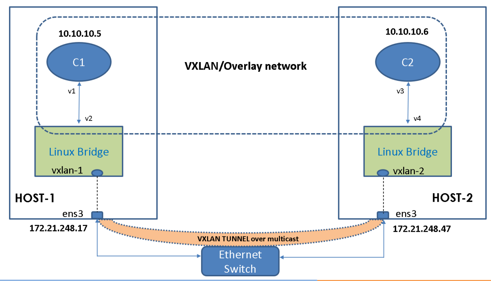
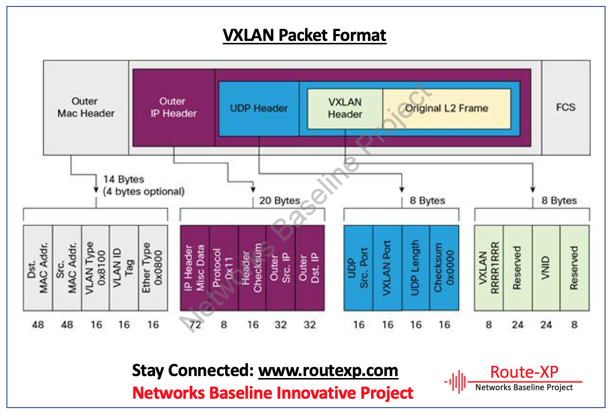

### vxlan其实很简单


VXLAN 全称是 `Virtual eXtensible Local Area Network`，虚拟可扩展的局域网。它是一种 overlay 技术，通过三层的网络来搭建虚拟的二层网络。

它解决的问题是：越来越多的数据中心（尤其是公有云服务）需要提供多租户的功能，不同用户之间需要独立地分配 ip 和 MAC 地址，而传统的 VLAN 技术只能支持 4096 个网络上限。另外公有云服务的虚拟机需要在整个机房的不同设备间灵活迁移和部署，保持网络可用，需要一个大二层。

借用两张网友的图来说明原理：





#### 在linux上搭建vxlan的实验

假设有两台linux服务器，他们内网可通，IP分别是10.11.7.199和10.11.7.84。

在10.11.7.84机器上运行

```shell
 #创建一个网桥，用于把本机上多个容器还有vtep连接在一起，接入虚拟lan
 ip link add br0 type bridge
 ip addr add 172.16.1.100/24 dev br0
 ip link set br0 up

 #本机上虚拟的第一容器，连接到网桥上
 ip link add veth0 type veth peer name veth1
 ip netns add container1
 ip link set dev veth0 master br0
 ip link set dev veth0 up
 ip link set dev veth1 netns container1
 ip netns exec container1 ip link set lo up
 ip netns exec container1 ip link set veth1 name eth0
 ip netns exec container1 ip addr add 172.16.1.4/24 dev eth0
 ip netns exec container1 ip link set eth0 up

 #本机上虚拟的第二容器，连接到网桥上
 ip link add veth2 type veth peer name veth3
 ip netns add container2
 ip link set dev veth2 master br0
 ip link set dev veth2 up
 ip link set dev veth3 netns container2
 ip netns exec container2 ip link set lo up
 ip netns exec container2 ip link set veth3 name eth0
 ip netns exec container2 ip addr add 172.16.1.8/24 dev eth0
 ip netns exec container2 ip link set eth0 up
 
 #本机上创建一个vxlan的vtep，也连接到网桥上。它与其他vtep交换数据
 ip link add vxlan100 type vxlan id 100 dstport 0 remote 10.11.7.199 local 10.11.7.84 dev eth0
 ip link set vxlan100 master  br0
 ip link set vxlan100 up
```

在10.11.7.199这个机器上运行：

```shell
 #创建一个网桥，用于把本机上多个容器还有vtep连接在一起，接入虚拟lan
 ip link add br0 type bridge
 ip addr add 172.16.1.101/24 dev br0
 ip link set br0 up

 #本机上虚拟的第一容器，连接到网桥上
 ip link add veth0 type veth peer name veth1
 ip netns add container1
 ip link set dev veth0 master br0
 ip link set dev veth0 up
 ip link set dev veth1 netns container1
 ip netns exec container1 ip link set lo up
 ip netns exec container1 ip link set veth1 name eth0
 ip netns exec container1 ip addr add 172.16.1.5/24 dev eth0
 ip netns exec container1 ip link set eth0 up

 #本机上虚拟的第二容器，连接到网桥上
 ip link add veth2 type veth peer name veth3
 ip netns add container2
 ip link set dev veth2 master br0
 ip link set dev veth2 up
 ip link set dev veth3 netns container2
 ip netns exec container2 ip link set lo up
 ip netns exec container2 ip link set veth3 name eth0
 ip netns exec container2 ip addr add 172.16.1.6/24 dev eth0
 ip netns exec container2 ip link set eth0 up
 
 #本机上创建一个vxlan的vtep，也连接到网桥上。它与其他vtep交换数据
 ip link add vxlan100 type vxlan id 100 dstport 0 remote  10.11.7.84 local 10.11.7.199  dev eth0
 ip link set vxlan100 master  br0
 ip link set vxlan100 up
```

连通性测试：

```shell
# 在199这台机器上的一个容器里ping另外一台机器上的容器内的IP
ip netns exec container1 ping 172.16.1.5

# 在199这台机器上的一个容器里ping同机器上的另一个容器内的IP
ip netns exec container1 ping 172.16.1.8

# 在链路的各种位置抓包
 tcpdump -i eth0 udp -n -vv
13:16:01.532552 IP (tos 0x0, ttl 64, id 45368, offset 0, flags [none], proto UDP (17), length 134)
    10.11.7.199.48941 > 10.11.7.84.8472: [udp sum ok] OTV, flags [I] (0x08), overlay 0, instance 100
IP (tos 0x0, ttl 64, id 18487, offset 0, flags [DF], proto ICMP (1), length 84)
    172.16.1.4 > 172.16.1.5: ICMP echo request, id 57172, seq 122, length 64
13:16:01.532590 IP (tos 0x0, ttl 64, id 63878, offset 0, flags [none], proto UDP (17), length 134)
    10.11.7.84.46421 > 10.11.7.199.8472: [udp sum ok] OTV, flags [I] (0x08), overlay 0, instance 100
IP (tos 0x0, ttl 64, id 41388, offset 0, flags [none], proto ICMP (1), length 84)
    172.16.1.5 > 172.16.1.4: ICMP echo reply, id 57172, seq 122, length 64

# 在链路的各种位置抓包
 tcpdump -i br0 udp -n -vv
 ip netns exec container1 tcpdump -i eth0 icmp  -n
```

还有一些有用的命令

```shell
arp
arp -s 
bridge link
bridge fdb
ip route
```


### 参考资料

```shell
https://cizixs.com/2017/09/25/vxlan-protocol-introduction/
https://cizixs.com/2017/09/28/linux-vxlan/
```

