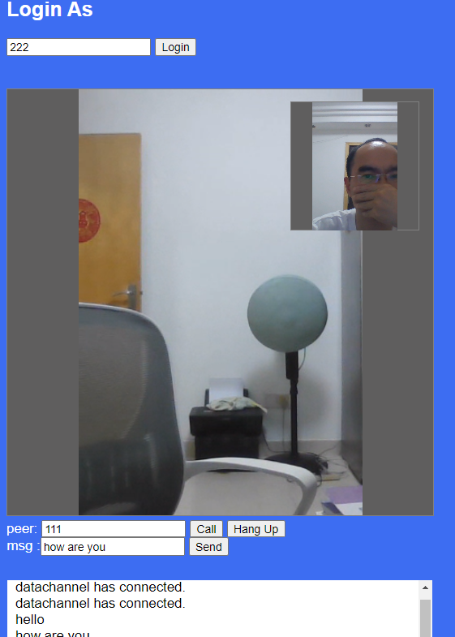

### 1、基本概念

RTCPeerConnection：代表与远端的webrtc连接。

信令服务器：作为中间人，帮助两个peer进行相互发现和信令间的交互。

ICE：Interactive connectivity Establishment。不知道具体指什么

STUN：帮助位于NAT局域网内的Peer发现自己的外网地址，从而穿越NAT进行P2P通信

NAT：就是NAT咯，有多种类型的NAT，不展开

TURN：中转服务器，如果不能直连，就要通过TURN中转。 （不确定） 

SDP：会话描述协议，表示参与通信的Peer的能力，例如分辨率、编解码格式、加解密算法等

candidate：不知道是什么

### 2、交互时序

分两部分：

1. 通过STUN发现自己的外网IP和端口，打洞。似乎candidate这个会通过信令服务器转发给对方，不是外网地址发现的应答
2. 通过信令服务器进行相互发现和握手，又包括：
   1. 登录信令服务器，以注册身份
   2. 发送offer，对方会应答以answer，offer和answer两个报文的主要内容就是SDP
   3. 相互发送candidate，但里面似乎没有外网地址信息呀


### 3、实操整起

#### 3.1 先整一个页面，带有js

代码如下：

```javascript
// filename: rtc.js
  var connectedUser; 
  var myName; //我方用户名
  var yourConnection; 

  // 与信令服务器的websocket连接
  var connection = new WebSocket("ws://119.28.214.71:8090/");
  connection.onopen = function () {
    console.log("Connected");
  };

// 与信令服务器交互的消息回调
  connection.onmessage = function (message) {
    console.log("Got message", message.data);
    var data = JSON.parse(message.data);
    switch (data.type) {
      case "login":
        onLogin(data.success);
        break;
      case "offer":
        onOffer(data.offer, data.name);
        break;
      case "answer":
        onAnswer(data.answer);
        break;
      case "candidate":
        onCandidate(data.candidate);
        break;
      case "leave":
        onLeave();
        break;
      default:
        console.log("default message");
        console.log(data);
        break;
    }
  };

  connection.onerror = function (err) {
    console.log("Got error", err);
  };

// 向信令服务器发送消息
  function send(message) {
    if (connectedUser) {
      //message.name = connectedUser;
      //message.myName = name;
      message.name = theirUsernameInput.value;
      message.myName = usernameInput.value;
    }

    connection.send(JSON.stringify(message));
  };

  // 绑定HTML上的一些标签
  var loginPage = document.querySelector('#login-page'),
      usernameInput = document.querySelector('#username'),
      loginButton = document.querySelector('#login'),
      callPage = document.querySelector('#call-page'),
      theirUsernameInput = document.querySelector('#their-username'),
      callButton = document.querySelector('#call'),
      hangUpButton = document.querySelector('#hang-up'),
      messageInput = document.querySelector('#message'),
      sendButton = document.querySelector('#send'),
      received = document.querySelector('#received');

 // callPage.style.display = "none";

//  登录按钮click事件响应
// Login when the user clicks the button
//  记录登录名，向信令服务器发送登录信息
  loginButton.addEventListener("click", function (event) {
  
    myName = usernameInput.value;

    if (myName.length > 0) {
      send({
        type: "login",
        name: myName
      });
    }
  });

  // 响应信令服务器反馈的登录信息
  function onLogin(success) {
    if (success === false) {
      alert("Login unsuccessful, please try a different name.");
    } else {
      //loginPage.style.display = "none";
      //callPage.style.display = "block";

      // Get the plumbing ready for a call
      //  准备开始一个连接
      startConnection();
    }
  };


  var yourVideo = document.querySelector('#yours'),
      theirVideo = document.querySelector('#theirs'),
      // yourConnection, connectedUser, stream, dataChannel;
      connectedUser, stream, dataChannel;

  // 打开自己的摄像头
  // 准备开始一次peer to peer 连接
  function startConnection() {

    // 想要获取一个最接近 1280x720 的相机分辨率
    var constraints = {audio: false, video: {width: 320, height: 480}};
    navigator.mediaDevices.getUserMedia(constraints)
        .then(function (mediaStream) {
          // var video = document.querySelector('video');

          yourVideo.srcObject = mediaStream;

          if (hasRTCPeerConnection()) {
            console.log("setupPeerConnection .. ")
            setupPeerConnection(mediaStream);
          } else {
            alert("Sorry, your browser does not support WebRTC.");
          }

          yourVideo.onloadedmetadata = function (e) {
            yourVideo.play();
          };


        })
        .catch(function (err) {
          console.log(err.name + " -- : " + err.message);
        });

  }

  // 创建RTCPeerConnection对象 ，绑定ICE服务器，绑定多媒体数据流
  function setupPeerConnection(stream) {
    if (yourConnection == null) {
      var configuration = {
        // "iceServers": [{ "url": "stun:127.0.0.1:9876" }]
        "iceServers": [{"url": "stun:119.28.214.71:3478"}, {
          "url": "turn:119.28.214.71:3478",
          "username": "bison",
          "credential": "liao"
        }]
      };
      yourConnection = new RTCPeerConnection(configuration, {optional: [{RtpDataChannels: true}]});
    }


    if (yourConnection == null) {
      console.log("yourConneion is null");
    } else {
      console.log("yourConnection is a object")
    }

    console.log("========================= setupPeerConnection stream ====================================")
    // console.log(stream);

    // Setup stream listening
    yourConnection.addStream(stream);
    yourConnection.onaddstream = function (e) {

      console.log(e);
      // theirVideo.src = window.URL.createObjectURL(e.stream);
      theirVideo.srcObject = e.stream;
      theirVideo.play();
    };

    // Setup ice handling
    yourConnection.onicecandidate = function (event) {
      if (event.candidate) {
        send({
          type: "candidate",
          candidate: event.candidate
        });
      }
    };

    // 打开数据通道 （这个是用于 文字交流用）
    openDataChannel();
  }

  function openDataChannel() {
    var dataChannelOptions = {
      reliable: true
    };
    dataChannel = yourConnection.createDataChannel("myLabel", dataChannelOptions);

    dataChannel.onerror = function (error) {
      console.log("Data Channel Error:", error);
    };

    dataChannel.onmessage = function (event) {
      console.log("Got Data Channel Message:", event.data);

      received.innerHTML += event.data + "<br />";
      received.scrollTop = received.scrollHeight;
    };

    dataChannel.onopen = function () {
      dataChannel.send(name + " has connected.");
    };

    dataChannel.onclose = function () {
      console.log("The Data Channel is Closed");
    };
  }

// Bind our text input and received area
  sendButton.addEventListener("click", function (event) {
    var val = messageInput.value;
    received.innerHTML += val + "<br />";
    received.scrollTop = received.scrollHeight;
    dataChannel.send(val);
  });

/*  function hasUserMedia() {
    navigator.getUserMedia = navigator.getUserMedia || navigator.webkitGetUserMedia || navigator.mozGetUserMedia || navigator.msGetUserMedia;
    return !!navigator.getUserMedia;
  }*/

  function hasRTCPeerConnection() {
    window.RTCPeerConnection = window.RTCPeerConnection || window.webkitRTCPeerConnection || window.mozRTCPeerConnection;
    window.RTCSessionDescription = window.RTCSessionDescription || window.webkitRTCSessionDescription || window.mozRTCSessionDescription;
    window.RTCIceCandidate = window.RTCIceCandidate || window.webkitRTCIceCandidate || window.mozRTCIceCandidate;
    return !!window.RTCPeerConnection;
  }

  callButton.addEventListener("click", function () {
    var theirUsername = theirUsernameInput.value;
    console.log("call " + theirUsername)
    if (theirUsername.length > 0) {
      startPeerConnection(theirUsername);
    }
  });

  // 开始peer to peer 连接
  function startPeerConnection(theiruser) {
        connectedUser = theiruser;

        // yourConnection
        // Begin the offer

        // 发送通话请求 1
        yourConnection.createOffer(function (offer) {
          console.log("    yourConnection.createOffer");
          send({
            type: "offer",
            offer: offer
          });

          console.log("     yourConnection.setLocalDescription(offer);");
          yourConnection.setLocalDescription(offer);
        }, function (error) {
          alert("An error has occurred.");
        });
  };

  // 接受通话者 响应 通话请求 2
  function onOffer(offer, name) {
    connectedUser = name;

    console.log("============================================================");
    console.log("===============    onOffer       (===================");
    console.log("connector user name is "+connectedUser);
    console.log("============================================================");


    var offerJson = JSON.parse(offer);
    var sdp = offerJson.sdp;

    //   设置对方的会话描述
    try {
      console.log("                   yourConnection.setRemoteDescription                   ");
      yourConnection.setRemoteDescription(new window.RTCSessionDescription(offerJson), function () {
            console.log("success");
          }
          ,
          function () {
            console.log("fail")
          });

    } catch (e) {
      alert(e)
    }

    // 向通话请求者 发送回复消息 3
    yourConnection.createAnswer(function (answer) {
      yourConnection.setLocalDescription(answer);
      console.log("               yourConnection.createAnswer                  ");
      send({
        type: "answer",
        answer: answer
      });
    }, function (error) {
      alert("An error has occurred");
    });

    console.log("onOffer is success");

  };

  // 通话请求者 处理 回复 4
  function onAnswer(answer) {
    if (yourConnection == null) {
      alert("yourconnection is null in onAnswer");
    }

    console.log("============================================================");
    console.log("================ OnAnswer ============================");
    console.log("============================================================");
    console.log(answer);
    if (answer != null) {
      console.log(typeof answer);
    }

    var answerJson = JSON.parse(answer);
    console.log(answerJson);

    try {

      //  设置本次会话的描述
      yourConnection.setRemoteDescription(new RTCSessionDescription(answerJson));
    } catch (e) {
      alert(e);
    }

    console.log("onAnswer is success");

  };

  // 对ICE候选连接的事情响应
  function onCandidate(candidate) {
    console.log("============================================================");
    console.log("================ OnCandidate ============================");
    console.log("============================================================");
    console.log(candidate);
    if (candidate != null) {
      console.log(typeof candidate);
    }

    var iceCandidate;

    // try {

    var candidateJson = JSON.parse(candidate);
    console.log(candidateJson);

    iceCandidate = new RTCIceCandidate(candidateJson);
    // }catch(e){
    //   console.log("exception is ")
    //   console.log(e);
    // }

    if (yourConnection == null) {
      alert("yourconnection is null in onCandidate");
    }
    // yourConnection.addIceCandidate(new RTCIceCandidate(candidate));
    yourConnection.addIceCandidate(iceCandidate);
  };

  hangUpButton.addEventListener("click", function () {
    send({
      type: "leave"
    });

    onLeave();
  });

  function onLeave() {
    connectedUser = null;
    theirVideo.src = null;
    yourConnection.close();
    yourConnection.onicecandidate = null;
    yourConnection.onaddstream = null;
    setupPeerConnection(stream);
  };

```

```html
<!--
filename:index.html
-->

<!DOCTYPE html>
<html lang="en">
  <head>
    <meta charset="utf-8" />

    <title>WebRTC</title>
   
    
    <style>
      body {
        background-color: #3D6DF2;
        margin-top: 15px;
        font-family: sans-serif;
        color: white;
      }

      video {
        background: rgb(95, 94, 94);
        border: 1px solid gray;
      }

      .page {
        position: relative;
        display: block;
        margin: 0 auto;
        width: 500px;
        
      }


      #yours {
        width: 150px;
        height: 150px;
        position: absolute;
        top: 15px;
        right: 15px;
      }

      #theirs {
        width: 500px;
        height: 500px;
     
      }

      #received {
        display: block;
        width: 480px;
        height: 100px;
        background: white;
        padding: 10px;
        margin-top: 10px;
        color: black;
        overflow: scroll;
      }
    </style>
   
  </head>
  <body>
    <div id="login-page" class="page">
      <h2>Login As</h2>
      <input type="text" id="username" />
      <button id="login">Login</button>
    </div>
    <br><br>
    <div id="call-page" class="page">
      <video id="yours" muted="muted" autoplay ></video>
      <video id="theirs" muted="muted" autoplay></video>
      peer: <input type="text" id="their-username" />
      <button id="call">Call</button>
      <button id="hang-up">Hang Up</button>
        <br>
      msg :<input type="text" id="message"></input>
      <button id="send">Send</button>
      <br><br>
      <div id="received"></div>
    </div>

   
    <script src=".\rtc.js"></script>
  </body>
</html>

```

html页面很简单，js代码有点复杂，尤其是对于不做前端开发的我。但关键的就这几个函数和步骤：

1. 建立与信令服务器的链接，注册各种回调函数，最重要的就是消息处理函数了
2. 双方都点击login按钮会触发login请求，应答会在上述回调函数的onLogin中处理，onLogin会调用startConnection为P2P连接做准备，重要的两个准备：
   1. navigator.mediaDevices.getUserMedia() 从本地媒体设备获取媒体数据
   2. 请求STUN服务器，生成RTCPeerConnection
3. 一方点击call按钮，会触发startPeerConnection，就会创建和发送offer，设置本地的SDP。
4. 对方收到后会在消息回调函数onOffer中处理，会据此设置对端的SDP。并进一步触发创建和发送answer，并设置本地的SDP
5. 发起会话的一方，收到对方的answer后，会据此设置远端的SDP信息。
6. 双方相互发送candidate，可能会发送多次



#### 3.2 搞一个信令服务器

用java的websocket库比较容易搞定：

```java
package io.bison;

import com.alibaba.fastjson.JSONObject;
import java.net.InetSocketAddress;
import java.util.HashMap;
import java.util.Iterator;
import jdk.nashorn.api.scripting.JSObject;
import org.java_websocket.WebSocket;
import org.java_websocket.handshake.ClientHandshake;
import org.java_websocket.server.WebSocketServer;


/**
 * websocket服务器
 */
public class SignalServer extends WebSocketServer{
    
    private static final java.util.logging.Logger log = java.util.logging.Logger.getLogger(SignalServer.class.getName());
    private static java.util.Map sessionMap = new java.util.HashMap<String, WebSocket>();
    private static java.util.Map sessionProduce = new HashMap<String, JSObject>();


    public SignalServer(int port) {
        super(new InetSocketAddress(port));
    }
    /**
     * WebSocket连接关闭时调用
     */
    @Override
    public void onClose(WebSocket ws, int arg1, String arg2, boolean arg3) {
        System.out.println("------------------onClose-------------------");
    }

    /**
     * 错误发生时调用。
     */
    @Override
    public void onError(WebSocket ws, Exception e) {
        System.out.println("------------------onError-------------------");
        if(ws != null) {
        }
        e.printStackTrace();
    }

    /**
     * 接收到的消息
     */
    @Override
    public void onMessage(WebSocket ws, String msg) {
        System.out.println("收到消息："+msg);

        
        JSONObject msgJSON = null;
        try
        {
           msgJSON  = JSONObject.parseObject(msg);
        } 
        catch (com.alibaba.fastjson.JSONException e)
        {
            msgJSON = null;
        }

        if (msgJSON == null)
        {
            ws.send("send:"+msg);
        }
        else
        {
            String type = msgJSON.getString("type");
            if (type == null) { type = "";}
            switch (type) {
                case "login": {
       
                    log.info("user login in as " + msgJSON.getString("name")+"\n");
                    if (sessionMap.containsKey(msgJSON.getString("name"))) {
                        sessionMap.put(msgJSON.getString("name"), ws);
                        JSONObject login = new JSONObject();
                        login.put("type", "login");
                        login.put("success", true);
                        ws.send(login.toJSONString());

                    } else {
                        sessionMap.put(msgJSON.getString("name"), ws);
                        JSONObject login = new JSONObject();
                        login.put("type", "login");
                        login.put("success", true);
                        login.put("myName", msgJSON.getString("name"));
                        ws.send(login.toJSONString());
                    }

                }
                break;
                case "offer": {
                    /**
                     * 处理offer消息 offer是一个peer to peer 连接中的 第一步 这个是响应通话发起者的消息
                     * 这里主要是找到 通话发起者要通话的对方的会话
                     */
//                    onOffer(data.offer, data.name);\
                    log.info("Sending offer to " + msgJSON.getString("name") + " from " + msgJSON.getString("myName")+"\n");

                    WebSocket conn = (WebSocket) sessionMap.get(msgJSON.getString("name"));

                    if (conn != null) {
                        JSONObject offer = new JSONObject();
                        offer.put("type", "offer");
                        offer.put("offer", msgJSON.getString("offer"));
                        offer.put("name", msgJSON.getString("name"));
                        conn.send(offer.toJSONString());

                        /**
                         * 保存会话状态
                         */
                        JSONObject offerAnswer = new JSONObject();
                        offerAnswer.put("offerName", msgJSON.getString("myName")); // 222 
                        offerAnswer.put("answerName", msgJSON.getString("name")); // 111
                        sessionProduce.put(msgJSON.getString("name"), offerAnswer); // 111
                    }

                }
                break;
                case "answer": {

                    log.info("answer from " + msgJSON.getString("myName")); //111

                    

                    JSONObject offerAnswer = (JSONObject) sessionProduce.get(msgJSON.getString("myName"));
                    String offerName = offerAnswer.getString("offerName"); // 222
                    WebSocket conn = (WebSocket) sessionMap.get(offerName);
                    if (conn != null) {
                        sessionProduce.remove(msgJSON.getString("myName"));
                        JSONObject answer = new JSONObject();
                        answer.put("type", "answer");
                        answer.put("answer", msgJSON.getString("answer"));
                        conn.send(answer.toJSONString());

                        log.info("send answer to "+offerName+"\n");
                    }
                    else
                    {
                        log.info("faile to find conn for "+offerName+"\n");
                    }

                }
                break;
                case "candidate": {
                    log.info("Sending candidate to " + msgJSON.getString("name"));
                    WebSocket conn = (WebSocket) sessionMap.get(msgJSON.getString("name"));
                    if (conn != null) {
                        JSONObject candidate = new JSONObject();
                        candidate.put("type", "candidate");
                        candidate.put("candidate", msgJSON.getString("candidate"));
                        conn.send(candidate.toJSONString());
                    }
                    else
                    {
                        log.info("failed to find conn for "+msgJSON.getString("name"));
                    }
                }
                break;
                case "leave": {
                    log.info("Disconnectiong user from " + msgJSON.getString("name"));
                    WebSocket conn = (WebSocket) sessionMap.get(msgJSON.getString("name"));

                    if (conn != null) {
                        JSONObject leave = new JSONObject();
                        leave.put("type", "leave");

                        conn.send(leave.toJSONString());
                    }
                }

                break;
                default:
                    JSONObject defaultMsg = new JSONObject();
                    defaultMsg.put("type", "error");
                    defaultMsg.put("message", "Unreconfized command : " + msgJSON.getString("type"));
                    ws.send(defaultMsg.toJSONString());
                    break;
            }
        }

        
        if(ws.isClosed()) {

        } 
        else if (ws.isClosing()) {
            
        } 
        else if(ws.isOpen()) {
            
        }
    }

    /**
     * websocket进行握手之后调用，并且给WebSocket写做准备
     * 通过握手可以获取请求头信息
     */
    @Override
    public void onOpen(WebSocket ws, ClientHandshake shake) {
        System.out.println("-----------------onOpen--------------------"+ws.isOpen()+"--"+ws.getReadyState()+"--"+ws.getAttachment());
        for(Iterator<String> it=shake.iterateHttpFields();it.hasNext();) {
            String key = it.next();
            System.out.println(key+":"+shake.getFieldValue(key));
        }
        JSONObject open = new JSONObject();
        open.put("status", "success");
        ws.send(open.toJSONString());
    }
    /**
     * 当服务器成功启动时调用
     */
    @Override
    public void onStart() {
        System.out.println("------------------onStart-------------------");
    }
}
```

```java
package io.bison;

/**
 * Hello world!
 *
 */
public class App 
{
    public static void main( String[] args )
    {
        new SignalServer(8090).start();
        System.out.println( "Hello World!" );
    }
}
```

我用的是maven，具体怎么创建一个工程，可以参考java grpc那一篇

这里有个插曲，因为要操作香港的信令服务器，所以用了vpn，本地的浏览器访问香港信令服务器ws协议走不通，关闭vpn就好了。

到这一步的时候，同局域网的两个浏览器已经可以视频了，不需要STUN服务器。

#### 3.3 搞一个STUN服务器

```shell
sudo apt install coturn

# 修改一下/etc/turnserver.conf里面的用户密码：user=bison:liao
sudo service coturn start
```

### 4、看看通信的报文

#### 4.1 websocket握手

```http
Accept-Encoding:gzip, deflate
Accept-Language:en-US,en;q=0.9,zh-CN;q=0.8,zh;q=0.7
Cache-Control:no-cache
Connection:Upgrade
Host:119.28.214.71:8090
Origin:null
Pragma:no-cache
Sec-WebSocket-Extensions:permessage-deflate; client_max_window_bits
Sec-WebSocket-Key:I3vjXv/JgSrTqesfM5QG9Q==
Sec-WebSocket-Version:13
Upgrade:websocket
User-Agent:Mozilla/5.0 (Windows NT 10.0; Win64; x64) AppleWebKit/537.36 (KHTML, like Gecko) Chrome/107.0.0.0 Safari/537.36 Edg/107.0.1418.42
```

#### 4.2 两方login

```
收到消息：{"type":"login","name":"111"}
收到消息：{"type":"login","name":"222"}
```

#### 4.3 一方进行call，刷的就视频接通了

```json
收到消息：{
    "type":"offer",
    "offer":{
        "sdp":"v=0\r\no=- 7177867662088728243 2 IN IP4 127.0.0.1\r\ns=-\r\nt=0 0\r\na=group:BUNDLE 0 1\r\na=extmap-allow-mixed\r\na=msid-semantic: WMS VIaqbdDm2xi6VPFfOrhC43TlEjxaOTcmQd34\r\nm=video 9 UDP/TLS/RTP/SAVPF 96 97 102 122 127 121 125 107 108 109 124 120 39 40 98 99 100 101 123 119 114 115 116\r\nc=IN IP4 0.0.0.0\r\na=rtcp:9 IN IP4 0.0.0.0\r\na=ice-ufrag:YsIK\r\na=ice-pwd:NUhfqDWhV6ipLG3G2eOE6Fd0\r\na=ice-options:trickle\r\na=fingerprint:sha-256 06:73:9A:61:F6:D9:26:99:F0:21:4B:12:E6:E7:27:65:15:63:2C:30:76:3B:21:8F:FE:40:CC:08:C9:C4:E2:94\r\na=setup:actpass\r\na=mid:0\r\na=extmap:1 urn:ietf:params:rtp-hdrext:toffset\r\na=extmap:2 http://www.webrtc.org/experiments/rtp-hdrext/abs-send-time\r\na=extmap:3 urn:3gpp:video-orientation\r\na=extmap:4 http://www.ietf.org/id/draft-holmer-rmcat-transport-wide-cc-extensions-01\r\na=extmap:5 http://www.webrtc.org/experiments/rtp-hdrext/playout-delay\r\na=extmap:6 http://www.webrtc.org/experiments/rtp-hdrext/video-content-type\r\na=extmap:7 http://www.webrtc.org/experiments/rtp-hdrext/video-timing\r\na=extmap:8 http://www.webrtc.org/experiments/rtp-hdrext/color-space\r\na=extmap:9 urn:ietf:params:rtp-hdrext:sdes:mid\r\na=extmap:10 urn:ietf:params:rtp-hdrext:sdes:rtp-stream-id\r\na=extmap:11 urn:ietf:params:rtp-hdrext:sdes:repaired-rtp-stream-id\r\na=sendrecv\r\na=msid:VIaqbdDm2xi6VPFfOrhC43TlEjxaOTcmQd34 c3da2fcd-1e4b-4258-90a0-9ed99c6e5c57\r\na=rtcp-mux\r\na=rtcp-rsize\r\na=rtpmap:96 VP8/90000\r\na=rtcp-fb:96 goog-remb\r\na=rtcp-fb:96 transport-cc\r\na=rtcp-fb:96 ccm fir\r\na=rtcp-fb:96 nack\r\na=rtcp-fb:96 nack pli\r\na=rtpmap:97 rtx/90000\r\na=fmtp:97 apt=96\r\na=rtpmap:102 H264/90000\r\na=rtcp-fb:102 goog-remb\r\na=rtcp-fb:102 transport-cc\r\na=rtcp-fb:102 ccm fir\r\na=rtcp-fb:102 nack\r\na=rtcp-fb:102 nack pli\r\na=fmtp:102 level-asymmetry-allowed=1;packetization-mode=1;profile-level-id=42001f\r\na=rtpmap:122 rtx/90000\r\na=fmtp:122 apt=102\r\na=rtpmap:127 H264/90000\r\na=rtcp-fb:127 goog-remb\r\na=rtcp-fb:127 transport-cc\r\na=rtcp-fb:127 ccm fir\r\na=rtcp-fb:127 nack\r\na=rtcp-fb:127 nack pli\r\na=fmtp:127 level-asymmetry-allowed=1;packetization-mode=0;profile-level-id=42001f\r\na=rtpmap:121 rtx/90000\r\na=fmtp:121 apt=127\r\na=rtpmap:125 H264/90000\r\na=rtcp-fb:125 goog-remb\r\na=rtcp-fb:125 transport-cc\r\na=rtcp-fb:125 ccm fir\r\na=rtcp-fb:125 nack\r\na=rtcp-fb:125 nack pli\r\na=fmtp:125 level-asymmetry-allowed=1;packetization-mode=1;profile-level-id=42e01f\r\na=rtpmap:107 rtx/90000\r\na=fmtp:107 apt=125\r\na=rtpmap:108 H264/90000\r\na=rtcp-fb:108 goog-remb\r\na=rtcp-fb:108 transport-cc\r\na=rtcp-fb:108 ccm fir\r\na=rtcp-fb:108 nack\r\na=rtcp-fb:108 nack pli\r\na=fmtp:108 level-asymmetry-allowed=1;packetization-mode=0;profile-level-id=42e01f\r\na=rtpmap:109 rtx/90000\r\na=fmtp:109 apt=108\r\na=rtpmap:124 H264/90000\r\na=rtcp-fb:124 goog-remb\r\na=rtcp-fb:124 transport-cc\r\na=rtcp-fb:124 ccm fir\r\na=rtcp-fb:124 nack\r\na=rtcp-fb:124 nack pli\r\na=fmtp:124 level-asymmetry-allowed=1;packetization-mode=1;profile-level-id=4d001f\r\na=rtpmap:120 rtx/90000\r\na=fmtp:120 apt=124\r\na=rtpmap:39 H264/90000\r\na=rtcp-fb:39 goog-remb\r\na=rtcp-fb:39 transport-cc\r\na=rtcp-fb:39 ccm fir\r\na=rtcp-fb:39 nack\r\na=rtcp-fb:39 nack pli\r\na=fmtp:39 level-asymmetry-allowed=1;packetization-mode=0;profile-level-id=4d001f\r\na=rtpmap:40 rtx/90000\r\na=fmtp:40 apt=39\r\na=rtpmap:98 VP9/90000\r\na=rtcp-fb:98 goog-remb\r\na=rtcp-fb:98 transport-cc\r\na=rtcp-fb:98 ccm fir\r\na=rtcp-fb:98 nack\r\na=rtcp-fb:98 nack pli\r\na=fmtp:98 profile-id=0\r\na=rtpmap:99 rtx/90000\r\na=fmtp:99 apt=98\r\na=rtpmap:100 VP9/90000\r\na=rtcp-fb:100 goog-remb\r\na=rtcp-fb:100 transport-cc\r\na=rtcp-fb:100 ccm fir\r\na=rtcp-fb:100 nack\r\na=rtcp-fb:100 nack pli\r\na=fmtp:100 profile-id=2\r\na=rtpmap:101 rtx/90000\r\na=fmtp:101 apt=100\r\na=rtpmap:123 H264/90000\r\na=rtcp-fb:123 goog-remb\r\na=rtcp-fb:123 transport-cc\r\na=rtcp-fb:123 ccm fir\r\na=rtcp-fb:123 nack\r\na=rtcp-fb:123 nack pli\r\na=fmtp:123 level-asymmetry-allowed=1;packetization-mode=1;profile-level-id=64001f\r\na=rtpmap:119 rtx/90000\r\na=fmtp:119 apt=123\r\na=rtpmap:114 red/90000\r\na=rtpmap:115 rtx/90000\r\na=fmtp:115 apt=114\r\na=rtpmap:116 ulpfec/90000\r\na=ssrc-group:FID 115665231 873595510\r\na=ssrc:115665231 cname:sljZmBCjr97gkqu5\r\na=ssrc:115665231 msid:VIaqbdDm2xi6VPFfOrhC43TlEjxaOTcmQd34 c3da2fcd-1e4b-4258-90a0-9ed99c6e5c57\r\na=ssrc:873595510 cname:sljZmBCjr97gkqu5\r\na=ssrc:873595510 msid:VIaqbdDm2xi6VPFfOrhC43TlEjxaOTcmQd34 c3da2fcd-1e4b-4258-90a0-9ed99c6e5c57\r\nm=application 9 UDP/DTLS/SCTP webrtc-datachannel\r\nc=IN IP4 0.0.0.0\r\na=ice-ufrag:YsIK\r\na=ice-pwd:NUhfqDWhV6ipLG3G2eOE6Fd0\r\na=ice-options:trickle\r\na=fingerprint:sha-256 06:73:9A:61:F6:D9:26:99:F0:21:4B:12:E6:E7:27:65:15:63:2C:30:76:3B:21:8F:FE:40:CC:08:C9:C4:E2:94\r\na=setup:actpass\r\na=mid:1\r\na=sctp-port:5000\r\na=max-message-size:262144\r\n",
        "type":"offer"
    },
    "name":"222",
    "myName":"111"
}
Nov 12, 2022 6:49:18 PM io.bison.SignalServer onMessage
INFO: Sending offer to 222 from 111

收到消息：{
    "type":"candidate",
    "candidate":{
        "candidate":"candidate:2642016979 1 udp 2113937151 f240a8cc-d207-4bce-b1fd-fee16d04e154.local 60366 typ host generation 0 ufrag YsIK network-cost 999",
        "sdpMid":"0",
        "sdpMLineIndex":0
    },
    "name":"222",
    "myName":"111"
}
Nov 12, 2022 6:49:18 PM io.bison.SignalServer onMessage
INFO: Sending candidate to 222
收到消息：{"type":"candidate","candidate":{"candidate":"candidate:2152488294 1 udp 2113939711 f5ce8262-b8d9-4244-8fda-7ddb3778918c.local 60367 typ host generation 0 ufrag YsIK network-cost 999","sdpMid":"0","sdpMLineIndex":0},"name":"222","myName":"111"}
Nov 12, 2022 6:49:18 PM io.bison.SignalServer onMessage
INFO: Sending candidate to 222
收到消息：{"type":"candidate","candidate":{"candidate":"candidate:2642016979 1 udp 2113937151 f240a8cc-d207-4bce-b1fd-fee16d04e154.local 60368 typ host generation 0 ufrag YsIK network-cost 999","sdpMid":"1","sdpMLineIndex":1},"name":"222","myName":"111"}
Nov 12, 2022 6:49:18 PM io.bison.SignalServer onMessage
INFO: Sending candidate to 222
收到消息：{"type":"candidate","candidate":{"candidate":"candidate:2152488294 1 udp 2113939711 f5ce8262-b8d9-4244-8fda-7ddb3778918c.local 60369 typ host generation 0 ufrag YsIK network-cost 999","sdpMid":"1","sdpMLineIndex":1},"name":"222","myName":"111"}
Nov 12, 2022 6:49:18 PM io.bison.SignalServer onMessage
INFO: Sending candidate to 222
收到消息：{"type":"candidate","candidate":{"candidate":"candidate:1845560544 1 udp 1677729535 223.73.185.58 2130 typ srflx raddr 0.0.0.0 rport 0 generation 0 ufrag YsIK network-cost 999","sdpMid":"0","sdpMLineIndex":0},"name":"222","myName":"111"}
Nov 12, 2022 6:49:18 PM io.bison.SignalServer onMessage
INFO: Sending candidate to 222
收到消息：{"type":"candidate","candidate":{"candidate":"candidate:1845560544 1 udp 1677729535 223.73.185.58 2131 typ srflx raddr 0.0.0.0 rport 0 generation 0 ufrag YsIK network-cost 999","sdpMid":"1","sdpMLineIndex":1},"name":"222","myName":"111"}
Nov 12, 2022 6:49:18 PM io.bison.SignalServer onMessage
INFO: Sending candidate to 222
收到消息：{
    "type":"answer",
    "answer":{
        "sdp":"v=0\r\no=- 478619766029632258 2 IN IP4 127.0.0.1\r\ns=-\r\nt=0 0\r\na=group:BUNDLE 0 1\r\na=extmap-allow-mixed\r\na=msid-semantic: WMS vhyLlO7kbwDh2lbsSbMb1vdMEGhl9rBSMNQo\r\nm=video 9 UDP/TLS/RTP/SAVPF 96 97 102 122 127 121 125 107 108 109 124 120 39 40 98 99 100 101 123 119 114 115 116\r\nc=IN IP4 0.0.0.0\r\na=rtcp:9 IN IP4 0.0.0.0\r\na=ice-ufrag:UTCv\r\na=ice-pwd:CHIXVYSuOit5L8G8UimXA/oj\r\na=ice-options:trickle\r\na=fingerprint:sha-256 D1:B1:49:80:5D:97:9F:C7:71:CD:DC:9F:1D:F2:34:4E:11:3F:92:7D:82:95:16:5E:F6:58:2B:CF:A9:9D:55:EF\r\na=setup:active\r\na=mid:0\r\na=extmap:1 urn:ietf:params:rtp-hdrext:toffset\r\na=extmap:2 http://www.webrtc.org/experiments/rtp-hdrext/abs-send-time\r\na=extmap:3 urn:3gpp:video-orientation\r\na=extmap:4 http://www.ietf.org/id/draft-holmer-rmcat-transport-wide-cc-extensions-01\r\na=extmap:5 http://www.webrtc.org/experiments/rtp-hdrext/playout-delay\r\na=extmap:6 http://www.webrtc.org/experiments/rtp-hdrext/video-content-type\r\na=extmap:7 http://www.webrtc.org/experiments/rtp-hdrext/video-timing\r\na=extmap:8 http://www.webrtc.org/experiments/rtp-hdrext/color-space\r\na=extmap:9 urn:ietf:params:rtp-hdrext:sdes:mid\r\na=extmap:10 urn:ietf:params:rtp-hdrext:sdes:rtp-stream-id\r\na=extmap:11 urn:ietf:params:rtp-hdrext:sdes:repaired-rtp-stream-id\r\na=sendrecv\r\na=msid:vhyLlO7kbwDh2lbsSbMb1vdMEGhl9rBSMNQo b0463589-1363-45da-86a7-49a77e573b0f\r\na=rtcp-mux\r\na=rtcp-rsize\r\na=rtpmap:96 VP8/90000\r\na=rtcp-fb:96 goog-remb\r\na=rtcp-fb:96 transport-cc\r\na=rtcp-fb:96 ccm fir\r\na=rtcp-fb:96 nack\r\na=rtcp-fb:96 nack pli\r\na=rtpmap:97 rtx/90000\r\na=fmtp:97 apt=96\r\na=rtpmap:102 H264/90000\r\na=rtcp-fb:102 goog-remb\r\na=rtcp-fb:102 transport-cc\r\na=rtcp-fb:102 ccm fir\r\na=rtcp-fb:102 nack\r\na=rtcp-fb:102 nack pli\r\na=fmtp:102 level-asymmetry-allowed=1;packetization-mode=1;profile-level-id=42001f\r\na=rtpmap:122 rtx/90000\r\na=fmtp:122 apt=102\r\na=rtpmap:127 H264/90000\r\na=rtcp-fb:127 goog-remb\r\na=rtcp-fb:127 transport-cc\r\na=rtcp-fb:127 ccm fir\r\na=rtcp-fb:127 nack\r\na=rtcp-fb:127 nack pli\r\na=fmtp:127 level-asymmetry-allowed=1;packetization-mode=0;profile-level-id=42001f\r\na=rtpmap:121 rtx/90000\r\na=fmtp:121 apt=127\r\na=rtpmap:125 H264/90000\r\na=rtcp-fb:125 goog-remb\r\na=rtcp-fb:125 transport-cc\r\na=rtcp-fb:125 ccm fir\r\na=rtcp-fb:125 nack\r\na=rtcp-fb:125 nack pli\r\na=fmtp:125 level-asymmetry-allowed=1;packetization-mode=1;profile-level-id=42e01f\r\na=rtpmap:107 rtx/90000\r\na=fmtp:107 apt=125\r\na=rtpmap:108 H264/90000\r\na=rtcp-fb:108 goog-remb\r\na=rtcp-fb:108 transport-cc\r\na=rtcp-fb:108 ccm fir\r\na=rtcp-fb:108 nack\r\na=rtcp-fb:108 nack pli\r\na=fmtp:108 level-asymmetry-allowed=1;packetization-mode=0;profile-level-id=42e01f\r\na=rtpmap:109 rtx/90000\r\na=fmtp:109 apt=108\r\na=rtpmap:124 H264/90000\r\na=rtcp-fb:124 goog-remb\r\na=rtcp-fb:124 transport-cc\r\na=rtcp-fb:124 ccm fir\r\na=rtcp-fb:124 nack\r\na=rtcp-fb:124 nack pli\r\na=fmtp:124 level-asymmetry-allowed=1;packetization-mode=1;profile-level-id=4d001f\r\na=rtpmap:120 rtx/90000\r\na=fmtp:120 apt=124\r\na=rtpmap:39 H264/90000\r\na=rtcp-fb:39 goog-remb\r\na=rtcp-fb:39 transport-cc\r\na=rtcp-fb:39 ccm fir\r\na=rtcp-fb:39 nack\r\na=rtcp-fb:39 nack pli\r\na=fmtp:39 level-asymmetry-allowed=1;packetization-mode=0;profile-level-id=4d001f\r\na=rtpmap:40 rtx/90000\r\na=fmtp:40 apt=39\r\na=rtpmap:98 VP9/90000\r\na=rtcp-fb:98 goog-remb\r\na=rtcp-fb:98 transport-cc\r\na=rtcp-fb:98 ccm fir\r\na=rtcp-fb:98 nack\r\na=rtcp-fb:98 nack pli\r\na=fmtp:98 profile-id=0\r\na=rtpmap:99 rtx/90000\r\na=fmtp:99 apt=98\r\na=rtpmap:100 VP9/90000\r\na=rtcp-fb:100 goog-remb\r\na=rtcp-fb:100 transport-cc\r\na=rtcp-fb:100 ccm fir\r\na=rtcp-fb:100 nack\r\na=rtcp-fb:100 nack pli\r\na=fmtp:100 profile-id=2\r\na=rtpmap:101 rtx/90000\r\na=fmtp:101 apt=100\r\na=rtpmap:123 H264/90000\r\na=rtcp-fb:123 goog-remb\r\na=rtcp-fb:123 transport-cc\r\na=rtcp-fb:123 ccm fir\r\na=rtcp-fb:123 nack\r\na=rtcp-fb:123 nack pli\r\na=fmtp:123 level-asymmetry-allowed=1;packetization-mode=1;profile-level-id=64001f\r\na=rtpmap:119 rtx/90000\r\na=fmtp:119 apt=123\r\na=rtpmap:114 red/90000\r\na=rtpmap:115 rtx/90000\r\na=fmtp:115 apt=114\r\na=rtpmap:116 ulpfec/90000\r\na=ssrc-group:FID 3259078472 3714637087\r\na=ssrc:3259078472 cname:lvpbVaT/zWLmLBHL\r\na=ssrc:3714637087 cname:lvpbVaT/zWLmLBHL\r\nm=application 9 UDP/DTLS/SCTP webrtc-datachannel\r\nc=IN IP4 0.0.0.0\r\na=ice-ufrag:UTCv\r\na=ice-pwd:CHIXVYSuOit5L8G8UimXA/oj\r\na=ice-options:trickle\r\na=fingerprint:sha-256 D1:B1:49:80:5D:97:9F:C7:71:CD:DC:9F:1D:F2:34:4E:11:3F:92:7D:82:95:16:5E:F6:58:2B:CF:A9:9D:55:EF\r\na=setup:active\r\na=mid:1\r\na=sctp-port:5000\r\na=max-message-size:262144\r\n",
        "type":"answer"
    },
    "name":"111",
    "myName":"222"
}
Nov 12, 2022 6:49:18 PM io.bison.SignalServer onMessage
INFO: answer from 222
Nov 12, 2022 6:49:18 PM io.bison.SignalServer onMessage
INFO: send answer to 111

收到消息：{"type":"candidate","candidate":{"candidate":"candidate:117699864 1 udp 2113937151 c1d34526-3021-4ead-b105-581feac348bb.local 60370 typ host generation 0 ufrag UTCv network-cost 999","sdpMid":"0","sdpMLineIndex":0},"name":"111","myName":"222"}
Nov 12, 2022 6:49:18 PM io.bison.SignalServer onMessage
INFO: Sending candidate to 111
收到消息：{"type":"candidate","candidate":{"candidate":"candidate:439767725 1 udp 2113939711 88c3bf2f-f048-49ca-a9e7-1ec797d70979.local 60371 typ host generation 0 ufrag UTCv network-cost 999","sdpMid":"0","sdpMLineIndex":0},"name":"111","myName":"222"}
Nov 12, 2022 6:49:18 PM io.bison.SignalServer onMessage
INFO: Sending candidate to 111

```

### 5、 参考资料

```
https://blog.csdn.net/lym594887256/article/details/124081420
https://blog.csdn.net/wangxudongx/article/details/105414629
https://blog.csdn.net/wangxudongx/article/details/105447416

```

