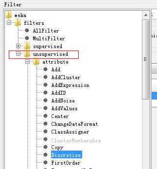

# weka使用心得 #

Weka是一款比较适合机器学习入门的开源软件，java开发的，支持java语言。

它提供了方便的图形界面的工具、命令行的工具、代码开发的库函数和屎一样的文档

## 安装 ##

从官网http://www.cs.waikato.ac.nz/ml/weka/下载windows下的weka-3-6-11jre.exe安装就可以了。它顺便帮助你安装需要的JRE

官网上也有pdf手册文档和一个快速的入门介绍。有必要用30分钟快速看一下，了解基本概念。

## 启动 ##

Weka提供了图形界面工具、命令行界面工具和库函数。对于入门者，图形界面既容易入门又基本能满足日常需要。

启动weka后，有两个主要的按钮，分别启动图形界面工具和命令行界面工具：

启动图形界面工具后，有好几个tab，比较好理解，分别对应：

1、             预处理：对数据进行预处理，例如加载数据到内存、缺失值填写、归一化、数值化、离散化

2、             分类：对内存里的数据进行分类。例如lr、朴素贝叶斯、决策树等等

3、             可视化：每两个属性形成横纵坐标，分类的结果作为坐标上的点

4、             聚类、关联等数据挖掘，最著名例子应该的就是超市里尿布和啤酒的关联了

## 预处理 ##

预处理tab提供了多种数据来源：从本地磁盘的文件、网络url、数据库、临时随机的产生等等。用的最多的是从本地磁盘文件了。文件格式主要是arff格式，也支持其他的格式。

数据加载到内存后，可以看到一些描述信息，例如有多少行实例，多少属性特征，每个特征的统计信息等等：

属性angle_x的统计信息：

属性angle_x与分类列的分布图形：

预处理里面有几个很重要的工具（java类），通过按钮filter可以选择

1、             weka.filters.unsupervised.attribute.NominalToBinary：将枚举型属性转化为数值型。例如某个属性“是否有房子”有三个枚举型值：有房子、没房子、与别人共有房子，那么经过这个工具的转换，该属性会变成三个属性，分别用1/0/0   0/1/0这样的“位图”来表示原来的枚举值。这种处理对于数值处理模型很有必要，例如lr、knn、感知机都是数值处理模型，要求先将枚举型转化为数值型

2、             weka.filters.unsupervised.attribute.Discretize：将连续性数值转化为离散（可枚举）。这种处理对于类似朴素贝叶斯这样的概率型模型很有必要。

3、             weka.filters.unsupervised.attribute.ReplaceMissingValues：填写缺失值，对于数值属性，用平均值代替缺失值，对于枚举型属性，用它的众数来代替缺失值

4、             weka.filters.unsupervised.attribute.Standardize：将数值型属性标准化处理为标准正态分布（均值为0，标准差为1）。不好理解对吧，我猜大概的方法是将原始值当作正态分布，然后拟合出均值和方差，然后用原始值减去均值并除以标准差就得到标准正态分布。

5、             weka.filters.unsupervised.attribute.Normalize：归一化。将数值型属性标准化为[0,1]或者[-1, 1]之间的值。例如knn就需要做这样的预处理。（lr、感知机等数值模型都需要吧，避免某一个属性的影响过大，掩盖了其他属性）

有两点要特别强调一下：

1、              可以看到，我们选择的预处理工具，都是非监督学习类型的（unsupervised），监督学习类型里也有对应的算法，但是不符合预期。我也搞不清楚是怎么回事。
 

2、              在分类tab里使用lr等分类器的时候，其实不需要对原始数据做上述复杂的预处理，分类器会隐式的自动先做预处理然后构建分类器。稍微有点例外的是，如果用朴素贝叶斯处理连续性数值属性，能够构建正确的分类器，但是输出的模型描述不可读。这个时候先做一下离散化，输出的模型描述就很好懂了

## 分类 ##

分类比较简单，就选择分类器，搞就行了。有几个主要的分类器：

1、  weka.classifiers.functions.Logistic 逻辑斯蒂回归

2、  weka.classifiers.bayes.NaiveBayes 朴素贝叶斯

3、  weka.classifiers.lazy.IBk k邻近算法

4、  weka.classifiers.trees.J48 决策树

5、  weka.classifiers.functions.LibSVM：台湾大学的支持向量机（要额外安装包，我没有搞定）

6、  weka.classifiers.functions.VotedPerceptron ：感知机

以lr为例，可以看到模型的输出描述如下：

即模型的各项权值w和b就是上面的那列实数

而模型的测试效果通常以混淆矩阵的方式描述，比较直观：

=== Confusion Matrix ===

   a   b   <-- classified as

 143 191 |   a = sameUser

  87 580 |   b = diffuser

以决策树为例，输出的模型也非常直观：

使用上的tips：

1、  点击下面的白框框，可以设置模型的命令行参数

2、  点击more option可以设置输出的信息和模型的一些选项

## 命令行界面工具 ##

将图形界面里的filter或者classifer拷贝粘贴的方式写到命令行界面里，运行效果是一样的。命令行界面很重要的一个功能是，从图形界面选择分类器，贴到命令行界面里，加上-h，用于查看该分类器的手册信息：

java weka.filters.unsupervised.attribute.Discretize –h

## 编程与大规模部署 ##

当在weka explorer下学习到了一个好的模型，就可以大规模部署到生产系统上了。生产系统通常是分布式的集群。

一种方式是直接获得模型的参数或者规则，然后用我们熟知的编程语言（例如c）来应用学习到的模型。例如lr、决策树，weka explorer都直观的给出了参数/规则，直接编程实现即可应用学习到的模型。但是有的机器学习算法，weka explorer没有给出比较直观的参数/规则，例如K邻近，不知道如何用c语言编码来应用学习到的模型。

另一种方式是，将模型另存为model文件，部署到生产系统上；然后使用java+weka api开发，加载model文件，即可应用学习到的模型。

Step1:在weka explorer里右键一个结果，点击菜单”save model”即可保存学习到的模型

Step2:开发java代码，装载该model，对实例进行分类。然后把调试好的java代码部署到生产环境。

我用的java IDE环境是intelliJ IDEA，安装上手很容易。

注意，要在工程里加入weka.jar这个weka api lib。

 

当然直接使用weka api编写java代码，而不使用weka explorer，也是可以完成模型的训练学习的。例子如下：

 

