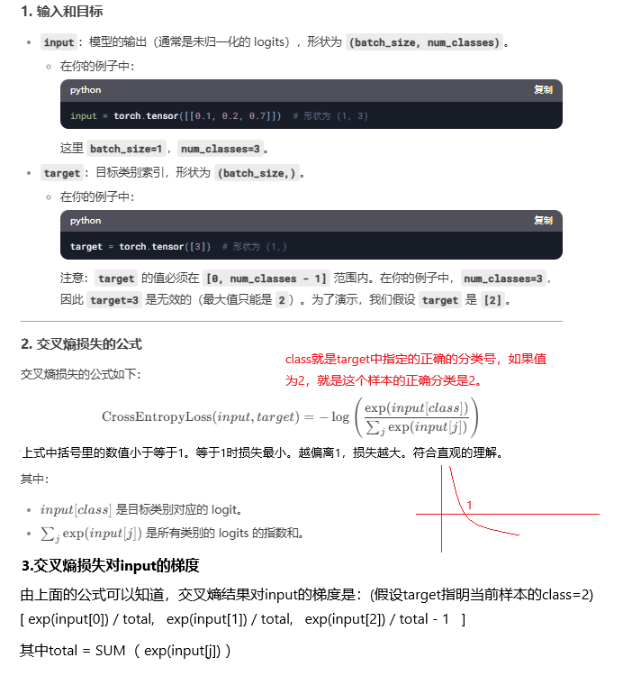
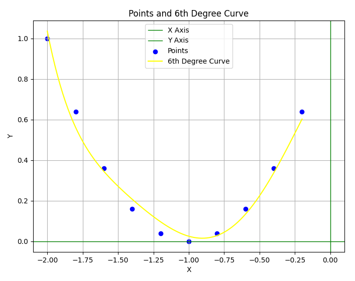
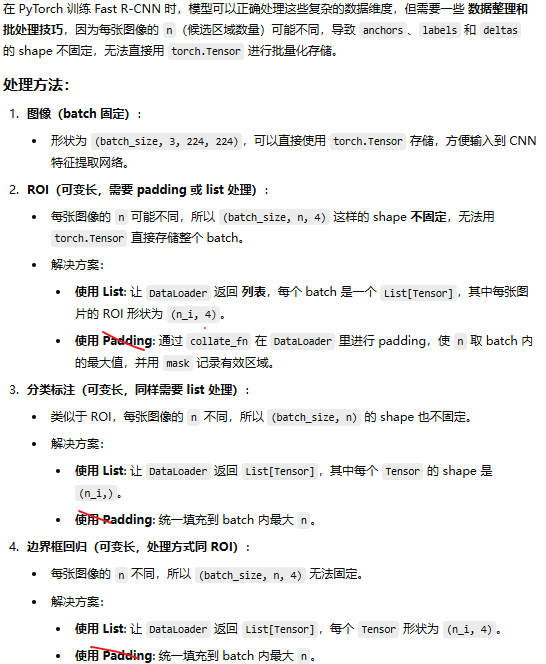
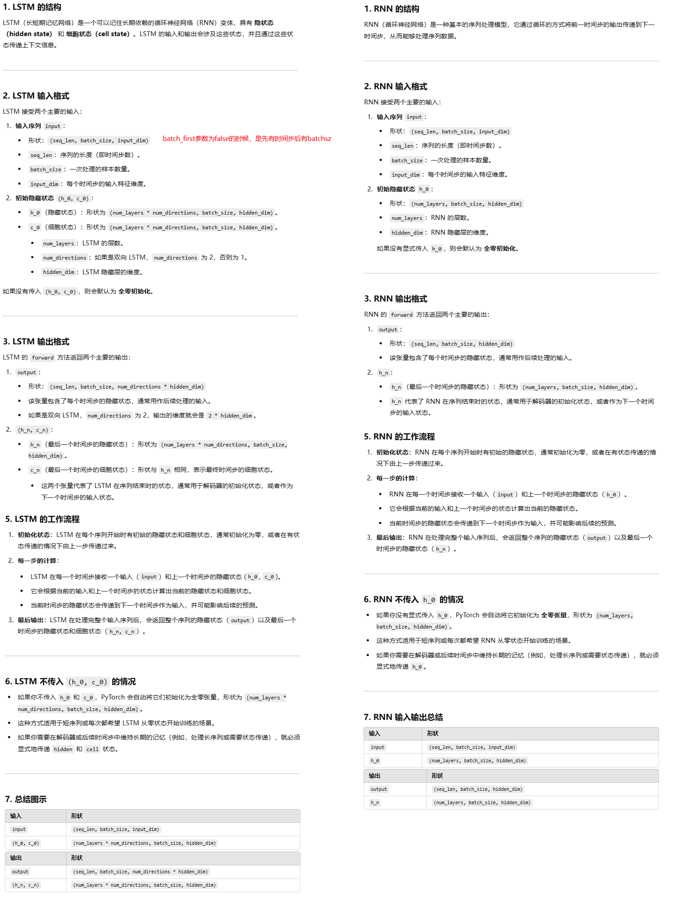
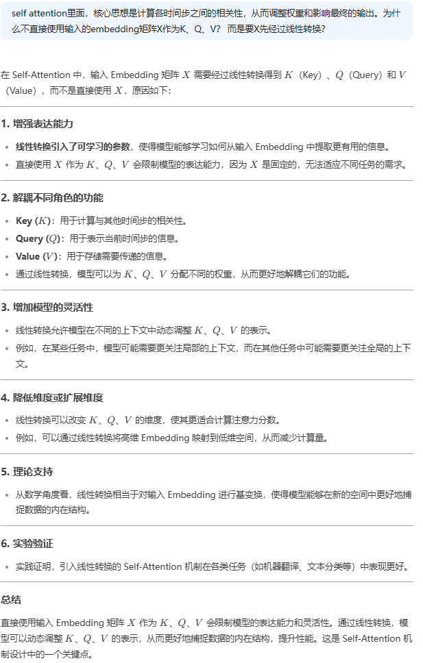
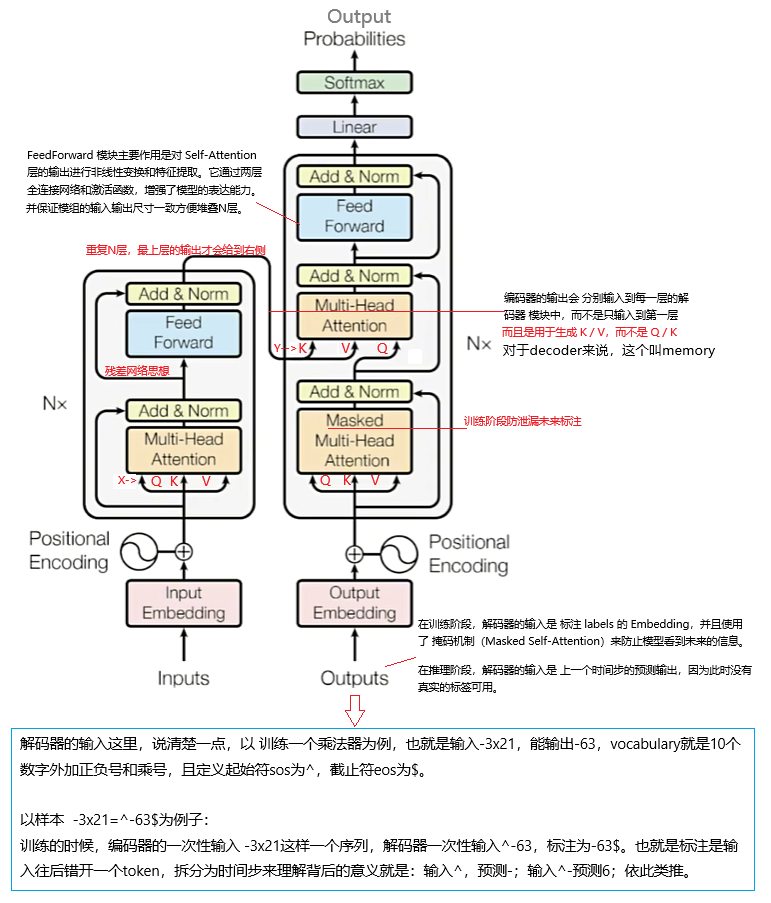
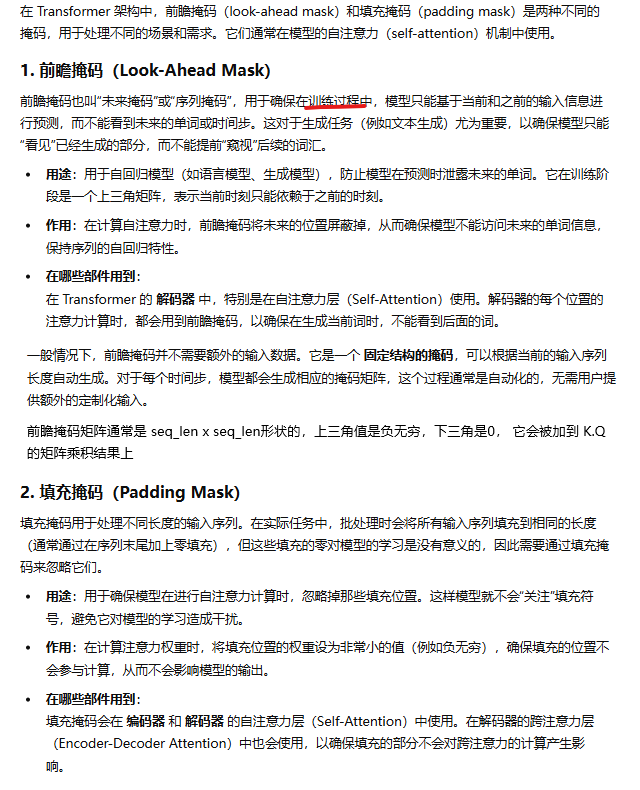
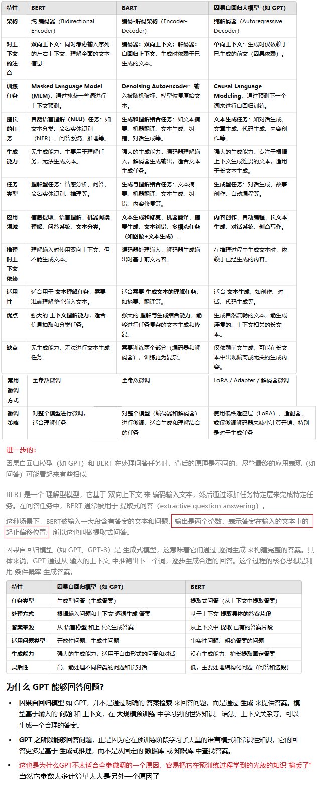

# 15、二刷深度学习

## 15.0 梯度理解的反复练习

### 15.0.1 全连接层为例，理解后向传播的梯度计算


2.4上面这个图过上几年再去看，我看不懂了，然后我自己尝试推导了一下全连接层的梯度计算（暂未考虑激活函数）：


辅助代码以验证我的理解：

```mathematica
ClearAll["Global`*"];

initParam[] := Module[{w1, w2, w3, input, b1},
   (*随机生成参数和input*)
   w1 = Array[RandomReal[{-1.414, 1.414}] &, {2, 3}];
   b1 = Array[RandomReal[{-1.414, 1.414}] &, {2, 1}];
   w2 = Array[RandomReal[{-1.414, 1.414}] &, {4, 2}];
   w3 = Array[RandomReal[{-1.414, 1.414}] &, {1, 4}];
   input = {{1}, {2}, {3}};
   {w1, w2, w3, input, b1}
   ];

forward[] := Module[{},
   (*一次前向传播*)
   w3.w2.(w1.input + b1) 
   ];

{w1, w2, w3, input, b1} = initParam[];

(*验证最终输出对各层输入的梯度 = 各层w参数的矩阵乘*)
out1 = forward[];
inputDiff = Transpose[{{0.01, 0.02, 0.03}}]; (*输入的微小的变化*)

input = input +  inputDiff;
out2 = forward[];
outDiff = out2 - out1; (*输入变化前后，最终结果的变化值*)
Print["out diff:", outDiff];
Print["gradient * inputDiff:", w3.w2.w1.inputDiff]; (*直接用梯度乘以输入变化量，应该等于结果的变化值*)
Print["===================================="];
(*验证最终输出对各层参数w的梯度 = 对该层输出的梯度相关分量乘以该层输入的相关分量*)
dB = w3.w2;

dw12 = dB[[1, 1]] * input[[2, 1]]; (*w12的梯度*)

paramDiff = 0.001;(*参数的微小的变化*)
w1[[1, 2]] = w1[[1, 2]] + paramDiff;
out3 = forward[];
outDiff = out3 - out2;(*参数变化前后，最终结果的变化值*)
Print["out diff:", outDiff];
Print["dw12*paramDiff:", dw12*paramDiff];(*直接用梯度乘以参数变化量，应该等于结果的变化值*)

Print["===================================="];
(*验证最终输出对各层参数b的梯度 = 对该层输出的梯度*)
db1 = (w3.w2)[[1, 1]];(*b1的梯度*)
paramDiff = 0.001;(*参数的微小的变化*)
b1[[1, 1]] = b1[[1, 1]] + paramDiff;
out4 = forward[];
outDiff = out4 - out3;(*参数变化前后，最终结果的变化值*)
Print["out diff:", outDiff];
Print["db1*paramDiff:", db1*paramDiff];(*直接用梯度乘以参数变化量，应该等于结果的变化值*)

```

用pytorch也是可以验证的：

```python
import torch.nn as nn
import torch.jit

# 定义输入

input = torch.randn(1, 3,  requires_grad=True) #type:torch.Tensor
fc1 = nn.Linear(3, 2);
fc2 = nn.Linear(2, 4);
fc3 = nn.Linear(4, 1);

# 前向传播
B = fc1(input)#type:torch.Tensor
C = fc2(B)#type:torch.Tensor
D = fc3(C)
loss = D.sum()

B.retain_grad()
C.retain_grad()
D.retain_grad()

loss.backward()

print("verify the answer to first questions:")
# B层的梯度，就等于w3.w2
print(B.grad)
print(torch.mm(fc3.weight, fc2.weight)) # w3.w2

# A层的梯度，就等于w3.w2.w1
print(input.grad)
print(torch.mm(torch.mm(fc3.weight, fc2.weight), fc1.weight)) # w3.w2


print("\nverify the answer to second questions:")
print(fc1.weight.grad[1,2])
print(B.grad[0,1]*input[0, 2]) #下标0是batchsz中的第一个样本


```


再加上激活函数：


辅助以代码验证，执行结果输出的变化数据相同：

```mathematica
ClearAll["Global`*"];
BbeforeSig = {};
CbeforeSig = {};
DbeforeSig = {};
input = {};
w1 = {};
w2 = {};
w3 = {};
b1 = {};

initParam[] := Module[{},
   (*随机生成参数和input*)
   w1 = Array[RandomReal[{-1.414, 1.414}] &, {2, 3}];
   b1 = Array[RandomReal[{-1.414, 1.414}] &, {2, 1}];
   w2 = Array[RandomReal[{-1.414, 1.414}] &, {4, 2}];
   w3 = Array[RandomReal[{-1.414, 1.414}] &, {1, 4}];
   input = {{1}, {2}, {3}};
   
   ];

sigmoid[z_] := Module[{ret},
   ret = Table[1/(1 + Exp[-z[[i]]]), {i, 1, Length[z]}];
   Return[ret];
   ];

(*sigmoid函数的输出对输入z的导数 由高数的基础知识求导即可知道，很巧，导数=sigmoid x (1-sigmoid) \
输入输出都是 1行m列的矩阵*)
dsigmoid[z_] := Module[{f},
   f = sigmoid[z];
   f*(Array[1 &, Dimensions[z]] - f)
   ];

forward[] := Module[{BB, CC, DD},
   (*一次前向传播*)
   BbeforeSig = (w1.input + b1) ;
   BB = sigmoid[BbeforeSig];
   
   CbeforeSig = w2.BB;
   CC = sigmoid[CbeforeSig];
   
   DbeforeSig = w3.CC;
   DD = sigmoid[DbeforeSig];
   
   Return[DD];
   
   ];

gradientOfA[] := Module[{w11, w22, w33, columns},
  (*图中第一个中括号*)
   w11 = dsigmoid[BbeforeSig];
   columns = Length[w1[[1]]];
   w11 = KroneckerProduct[w11, ConstantArray[1, columns]];
   w11 = w11*w1;
   
    (*图中第二个中括号*)
   w22 = dsigmoid[CbeforeSig];
   columns = Length[w2[[1]]];
   w22 = KroneckerProduct[w22, ConstantArray[1, columns]];
   w22 = w22*w2;
   
    (*图中第三个中括号*)
   w33 = dsigmoid[DbeforeSig];
   columns = Length[w3[[1]]];
   w33 = KroneckerProduct[w33, ConstantArray[1, columns]];
   w33 = w33*w3;
   
   Return[w33.w22.w11];
   
   ];

initParam[];
out1 = forward[];

inputDiff = Transpose[{{0.001, 0.002, 0.003}}];
input = input +  inputDiff;

out2 = forward[];
outDiff = out2 - out1;
(*下面两者的值应该相等*)
Print["out diff:", outDiff];
Print["gradient * inputDiff:", gradientOfA[].inputDiff];
```

通常收敛后模型的参数的值什么样子，可以专门看一下：

```python
import torch
import torchvision.models as models
from transformers import BertModel
import matplotlib.pyplot as plt

# 加载 ResNet50
resnet50 = models.resnet50(pretrained=True)

# 加载 BERT
bert = BertModel.from_pretrained("bert-base-uncased")

# 定义参数分布分析函数
def analyze_parameter_distribution(model):
    for name, param in model.named_parameters():
        if param.requires_grad:  # 只分析可训练参数
            print(f"Layer: {name}")
            print(f"  Shape: {param.shape}")
            print(f"  Mean: {param.mean().item():.6f}")
            print(f"  Std: {param.std().item():.6f}")
            print(f"  Median: {param.median().item():.6f}")
            print(f"  Min: {param.min().item():.6f}")
            print(f"  Max: {param.max().item():.6f}")
            print("-" * 50)

# 定义参数分布可视化函数
def plot_parameter_distribution(param, layer_name):
    plt.figure(figsize=(10, 6))
    plt.hist(param.flatten().detach().numpy(), bins=100, color='blue', alpha=0.7)
    plt.title(f"Parameter Distribution: {layer_name}")
    plt.xlabel("Value")
    plt.ylabel("Frequency")
    plt.show()

# 分析 ResNet50 的参数分布
print("Analyzing ResNet50 parameter distribution...")
analyze_parameter_distribution(resnet50)

# 分析 BERT 的参数分布
print("Analyzing BERT parameter distribution...")
analyze_parameter_distribution(bert)

# 可视化 ResNet50 第一层卷积核的分布
plot_parameter_distribution(resnet50.conv1.weight, "ResNet50 Conv1 Weight")

# 可视化 BERT 词嵌入层的分布
plot_parameter_distribution(bert.embeddings.word_embeddings.weight, "BERT Word Embeddings Weight")
```

运行上面的代码，可以看到embedding层、卷积层、全连接层、self-attention层的参数通常都是中心点在0绝对值不超过1的近似正态分布。bn层则是偏右的。


### 15.0.2 卷积层的梯度计算

我的理解：

pytorch中假设在第1层有一个 尺寸为5X5的单通道的二位卷积核，核的中间参数 kernel[2,2] 的梯度怎么计算？  假设在前向传播过程中 kernel[2,2]与 该层输入值的若干像素点进行了乘，这些像素点分别为 p1, p2, p3...p10，与每个像素点乘积会参与加和后得到该层输出的某些点， 假设得到 o1, o2,o3...o10，

那么kernel[2，2]这个参数的梯度就等于 o1,o2,o3...o10的梯度（在前向传播到第一层的时候还不知道实际值）与p1,p2,p3...p10像素值的成绩的和。

即 gradient of kernel[2,2] = o1的梯度 * p1像素值 +o2的梯度 * p3像素值 +...+o10的梯度 * p10像素值

当反向传播的时候，o1,o2...o10的梯度会逐步已知，所以kernel[2,2]的梯度也能算出来。


AI的详细解释：


代码验证：

```python
import torch.nn as nn
import torch.jit

# 定义输入和卷积核
input = torch.randn(1, 1, 7, 7, requires_grad=True)  # 单通道输入，尺寸为 7x7，batchsz和通道数为1
conv = nn.Conv2d(1, 1, kernel_size=5, stride=1, padding=0, bias=False)  # 5x5 卷积核，输入通道和输出通道数都为1

# 前向传播
output = conv(input)

# 假设损失函数是输出的总和
loss = output.sum()

# 反向传播
loss.backward()

# 查看卷积核的梯度
#input中左上角3x3的区域，刚好是与conv[0,0]这个参数进行计算的input，
# output的梯度为1（因为就是损失函数本身）.
print('the two numbers are equal as expected:')
print(input[:, :, 0:3, 0:3].sum().item() )
print(conv.weight.grad[0,0, 0, 0].item())
print(input)
print(conv.weight.grad)
```


### 15.0.3 亚导数


### 15.0.4 线性回归 

手搓线性回归的代码：

```python
import random
import torch.nn as nn
import torch.jit

true_w = [[1.3], [2.9]]
true_b = 0.7
epoch = 100
lr = 0.1

sample_num=10

def generate_samples():
    x = torch.randn(sample_num,2)
    y = torch.mm(x, torch.Tensor(true_w))
    y = y + ( true_b + random.random() / 1000.0)
    return x, y

x, y = generate_samples()

w = torch.randn(2, 1, requires_grad=True)
b = torch.randn(1, 1, requires_grad=True)

for i in range(epoch):
    diff =  y - (torch.mm(x, w) + b) #  shape is : sample_num x 1
    loss = torch.mm( diff.T, diff).sum() / sample_num
    print("loss=", loss)
    loss.backward()
    
    with torch.no_grad(): #下面的代码不需要pytorch追踪计算图、自动更新记录梯度
        w.data = w.data - lr * w.grad  #这里写成 w = w-lr*w.grad就会有问题，会生成新的w变量，里面没有梯度信息，然后报错
        b.data = b.data - lr * b.grad
        w.grad.zero_()
        b.grad.zero_()
        
print("w:", w, " b:", b)
```

### 15.0.5 交叉熵损失函数对输入的梯度



代码验证如下：

```python
import math
import random
import torch.nn as nn
import torch.jit

BATCHSZ=1
LEN = 3

#按照我自己的理解求解梯度
def my_cross_entropy_d(v:torch.Tensor, target:torch.Tensor):
    result=[]
    for sample_id in range(len(v)):
        tmp = v[sample_id]
        c = target[sample_id]

        total = 0;
        for i in range(len(tmp)):
            total += math.exp(tmp[i].item())

        grad = []
        for i in range(len(tmp)):
            d = math.exp(tmp[i].item()) / total
            if i == c:
               d = d - 1
            grad.append(d)
        result.append(grad)
    return result
#上面的实现不利于利用GPU并行计算，可以改造如下：
def my_cross_entropy_d2(v:torch.Tensor, target:torch.Tensor):
    sample_num = len(v)
    v = torch.exp(v) #不能用math.exp，它只能处理标量不能处理张量，更不能自动并行计算
    total = v.sum(1, keepdims=True)
    v = v / total #total会发生广播
    row_index = torch.arange(sample_num)
    col_index = target.squeeze()
    v[ row_index, col_index ] -= 1
    return v


yy = torch.randn(1, LEN, requires_grad=True) # batchsz为1，类的个数为LEN,yy是未经softmax处理的预测结果
y = torch.tensor([1], dtype=torch.long) #样本的标注，该样本应该分类为1

loss = nn.functional.cross_entropy(yy, y).sum() #交叉熵本身会对yy计算softmax
loss.backward()

#下面的两次print输出的值应该是相等的
print(yy.grad)
yy.detach()

with torch.no_grad():
    grad = my_cross_entropy_d(yy,y)

print(grad)
```

### 15.0.6 batch size的考虑

一般每个batch一次前向传播，然后一次后向传播，并更新一次参数（即完成一次梯度下降）

批量梯度是该批中单个样本梯度的均值，这是因为损失函数是 batchsize 个样本损失函数的均值。


### 15.0.7 model.eval()与with torch.no_grad()的理解


实际实验也证明了上述信息：推理的时候，加上no_grad后，显存占用几乎减半。

### 15.0.8 损失函数一定是凸函数/凹函数吗？

深度学习里的损失函数不一定是下凸函数，例如下面的代码可以验证，损失函数和w参数的关系，像一个瀑布，上端是平的

```python
import torch
import torch.nn as nn
import torch.optim as optim
import numpy as np
import matplotlib.pyplot as plt
from mpl_toolkits.mplot3d import Axes3D


# 1️⃣ 构建一个更复杂的神经网络
class ComplexNN(nn.Module):
    def __init__(self):
        super(ComplexNN, self).__init__()
        self.fc1 = nn.Linear(2, 8)  # 第一层全连接层
        self.activation1 = nn.ReLU()  # 第一层激活函数
        self.fc2 = nn.Linear(8, 4)  # 第二层全连接层
        self.activation2 = nn.Tanh()  # 第二层激活函数
        self.fc3 = nn.Linear(4, 1)  # 输出层

    def forward(self, x):
        x = self.fc1(x)
        x = self.activation1(x)
        x = self.fc2(x)
        x = self.activation2(x)
        x = self.fc3(x)
        return x


# 2️⃣ 定义损失函数（均方误差）
loss_fn = nn.MSELoss()

# 3️⃣ 生成一个固定的训练样本
x_sample = torch.tensor([[1.0, -1.0]], dtype=torch.float32)  # 输入样本
y_target = torch.tensor([[0.5]], dtype=torch.float32)  # 目标输出

# 4️⃣ 遍历 w1, w2 计算损失
w1_range = np.linspace(-2, 2, 50)  # w1 在 -2 到 2 之间取值
w2_range = np.linspace(-2, 2, 50)  # w2 在 -2 到 2 之间取值
loss_values = np.zeros((50, 50))  # 存储损失值

net = ComplexNN()
with torch.no_grad():  # 遍历 w1, w2
    for i, w1 in enumerate(w1_range):
        for j, w2 in enumerate(w2_range):
            net.fc1.weight.data = torch.tensor([[w1, w2], [w1, w2], [w1, w2], [w1, w2],
                                                [w1, w2], [w1, w2], [w1, w2], [w1, w2]], dtype=torch.float32)  # 设置权重
            net.fc1.bias.data = torch.zeros(8, dtype=torch.float32)  # 偏置设为 0
            y_pred = net(x_sample)  # 前向传播
            loss_values[i, j] = loss_fn(y_pred, y_target).item()  # 计算损失

# 5️⃣ 绘制损失函数的 3D 图像
w1_mesh, w2_mesh = np.meshgrid(w1_range, w2_range)
fig = plt.figure(figsize=(10, 7))
ax = fig.add_subplot(111, projection='3d')
ax.plot_surface(w1_mesh, w2_mesh, loss_values, cmap='viridis')
ax.set_xlabel("w1")
ax.set_ylabel("w2")
ax.set_zlabel("Loss")
ax.set_title("Loss Landscape of ComplexNN")
plt.show()

```

## 15.1 多层感知机

手写多层感知机，实现异或，背景信息：


代码如下：

```python
import math
import random
import torch.nn as nn
import torch.jit

SAMPLENUM=100000
LEN = 2
lr = 0.1
SLPNUM = 9 #这里相当于有9个单层感知机，改成2个也是可以的，需要调整一下lr和epoch数才能收敛

#生成训练数据，x是特征，有两个分量，y是标签，1表示x的两个分量同号，-1表示异号
def generate_data():
    x = torch.randn(SAMPLENUM, LEN)
    xx = x[:, [1, 0]]
    y = ((x*xx)[:, 0]>0).long()
    y = (y - 0.5)*2
    return x, y

x, y = generate_data()
print(torch.cat( (x, y.reshape(SAMPLENUM, -1)), dim=1)[1:10,])
x = x.to('cuda:0')
y = y.to('cuda:0')


w1 = torch.randn(2, SLPNUM, requires_grad=True, device='cuda:0')
b1 = torch.zeros(1, SLPNUM, requires_grad=True, device='cuda:0')

w2 = torch.randn(SLPNUM, 1, requires_grad=True, device='cuda:0')
b2 = torch.zeros(1, 1, requires_grad=True, device='cuda:0')

for e in range(40000):
    out1 = torch.sigmoid(torch.mm(x, w1) + b1)
    out2 = (torch.mm(out1, w2) + b2).reshape(-1)

    loss = nn.functional.mse_loss(out2, y)
    if e > 0 and e % 1999 == 0:
        print(e, " ", loss)

    loss.backward()

    w1.data -= w1.grad * lr
    w2.data -= w2.grad * lr
    b1.data -= b1.grad * lr
    b2.data -= b2.grad * lr

    w1.grad.zero_();
    w2.grad.zero_();
    b1.grad.zero_();
    b2.grad.zero_();

#经过长时间训练，output不能完美输出为1和-1来判断x的分量符号的异同，但可以通过output的正负来反映
out1 = torch.sigmoid(torch.mm(x, w1) + b1)
out2 = torch.mm(out1, w2) + b2

print(torch.cat( (x, out2), dim=1)[1:30,])

#下面是誊抄的部分输出：
[ 2.2386, -0.0695, -0.5467],
[ 1.0103,  1.5109,  1.0111],
[-0.3283,  0.8194, -1.1447],
[ 1.1656,  0.6084,  1.2475],
[ 2.1616,  0.4590,  1.2685],
[ 0.1752, -0.0795, -0.2118],
```

当增加一层全连接层后，可以训练出很完美的数据：

```python
import math
import random
import torch.nn as nn
import torch.jit


SAMPLENUM=100000
LEN = 2
lr = 0.1

def generate_data():
    x = torch.randn(SAMPLENUM, LEN)
    xx = x[:, [1, 0]]
    y = ((x*xx)[:, 0]>0).long()
    y = (y - 0.5)*2
    return x, y

x, y = generate_data()
print(torch.cat( (x, y.reshape(SAMPLENUM, -1)), dim=1)[1:10,])
x = x.to('cuda:0')
y = y.to('cuda:0')

w1 = torch.randn(2, 9, requires_grad=True, device='cuda:0')
b1 = torch.zeros(1, 9, requires_grad=True, device='cuda:0')

w2 = torch.randn(9, 5, requires_grad=True, device='cuda:0')
b2 = torch.zeros(1, 5, requires_grad=True, device='cuda:0')

w3 = torch.randn(5, 1, requires_grad=True, device='cuda:0')
b3 = torch.zeros(1, 1, requires_grad=True, device='cuda:0')


for e in range(50000):
    out1 = torch.sigmoid(torch.mm(x, w1) + b1)
    out2 = torch.sigmoid(torch.mm(out1, w2) + b2)
    out3 = (torch.mm(out2, w3) + b3).reshape(-1)

    loss = nn.functional.mse_loss(out3, y)
    if  e % 1997 == 0:
        print(e, " ", loss)


    loss.backward()

    w1.data -= w1.grad * lr
    w2.data -= w2.grad * lr
    w3.data -= w3.grad * lr

    b1.data -= b1.grad * lr
    b2.data -= b2.grad * lr
    b3.data -= b3.grad * lr

    w1.grad.zero_();
    w2.grad.zero_();
    w3.grad.zero_();
    b1.grad.zero_();
    b2.grad.zero_();
    b3.grad.zero_();


#重新生成一批数据用于测试
x, y = generate_data()
x = x.to('cuda:0')
y = y.to('cuda:0')

with torch.no_grad():
    out1 = torch.sigmoid(torch.mm(x, w1) + b1)
    out2 = torch.sigmoid(torch.mm(out1, w2) + b2)
    out3 = torch.mm(out2, w3) + b3

    print(torch.cat( (x, out3), dim=1)[1:30,])
    #与1,-1标签的差距小于15%的都认为是正确的
    acc = (torch.abs(out3 - y.reshape(-1, 1)) < 0.15).long().sum()/SAMPLENUM
    #发生了一个有意思的事情，y没有做rashape的时候，GPU内存直接爆掉了，因为y自动做了广播，变成10w x 10w的矩阵
    print("acc:", acc)
    
#下面是输出的节选：
        [-0.5096, -1.5277,  1.0208],
        [-0.1322,  0.3503, -1.1379],
        [-1.5099, -0.3947,  1.0153],
        [ 0.2465,  0.6612,  1.0724],
        [ 1.5386, -1.1360, -1.0011],
        [-1.3683, -0.2560,  1.0916]], device='cuda:0')
#迭代5万次可以得到94%的准确率           
acc: tensor(0.9027, device='cuda:0')
#迭代10万次可以得到94%的准确率  ，提升明显
acc: tensor(0.9409, device='cuda:0')
#迭代20万次可以得到94.92%的准确率 ,提升不明显    
acc: tensor(0.9492, device='cuda:0')

```

## 15.2 过拟合与正则化

避免过拟合主要有前面两个方法：

- 损失函数里加上正则化，对参数的模进行惩罚，避免参数太大

- dropout层，随机丢弃一些训练过程中的中间输出，后者可以理解为随机的选择一个子网络进行迭代
- 数据增强，增加数据的多样性

- pooling层也有间接的防止过拟合。Pooling层的主要目的并不是直接减少过拟合，而是为了降维和特征提取。因此，不能将Pooling层视为与正则化和Dropout相同的过拟合防止手段。

### 15.2.1 单层网络拟合6次曲线

一个例子：

待拟合的实际函数关系是：y=(x+1)^2，是一条二次曲线。样本数有限，只有10个点（图中的蓝点）。

由于样本数有限，不容易看出来是二次曲线，且为了有更强的表现力，所以我们错误的决定要训练一条6次曲线来拟合这些点，即有7个参数需要学习，w: 6x1, 一次为x的一次方、二次方...六次方的系数，b为x的零次方的系数。

经过几百万次epoch的训练后（没错，必须要有耐心），得到w和b，并在图中画出了学习到的6次曲线（图中的黄线）。

```shell
w: tensor([ 1.1498, -1.0844, -1.6255,  0.4539,  0.9585,  0.2689], device='cuda:0', grad_fn=<ReshapeAliasBackward0>) 
b: tensor([[0.8680]], device='cuda:0', requires_grad=True)
```

这就是一种过拟合，在有限训练样本和训练样本值范围下表现很好，但实际上没有学习到背后真正的函数，超出这个范围例如x=-3处，可能就有很大的验证误差。如下面所示的两种损失值：

```shell
95856  train loss: 0.0015028914203867316  validation loss: 60.506587982177734
97853  train loss: 0.001499874982982874  validation loss: 60.46442413330078
99850  train loss: 0.001496916520409286  validation loss: 60.422645568847656
```




```python
import math
import random
import torch.nn as nn
import torch.jit
import matplotlib.pyplot as plt
import numpy as np


SAMPLE_NUM = 10 #通常样本数较少的时候容易出现过拟合
lr = 0.00001


#把训练样本和学习到的函数曲线在坐标轴上画出来
#points是训练样本，w b是学习到的6次曲线的参数
def plot_points_with_curve(points, w, b, title="Points and 6th Degree Curve", xlabel="X", ylabel="Y"):
    """
    将点绘制在直角坐标系中，并添加一条 6 次曲线。

    参数:
        points (torch.Tensor): 形状为 (N, 2) 的 Tensor，表示 N 个点的 (x, y) 坐标。
        w (torch.Tensor): 形状为 (6, 1) 的 Tensor，表示 6 次曲线中 x 的 1 次到 6 次方的系数。
        b (torch.Tensor): 形状为 (1, 1) 的 Tensor，表示 6 次曲线中 x 的 0 次项系数。
        title (str): 图的标题。
        xlabel (str): X 轴的标签。
        ylabel (str): Y 轴的标签。
    """
    # 将 Tensor 转换为 NumPy 数组
    points_np = points.numpy()
    w_np = w.detach().numpy().flatten()  # 将 w 转换为 1D 数组
    b_np = b.item()  # 提取标量值

    # 提取 x 和 y 坐标
    x_points = points_np[:, 0]
    y_points = points_np[:, 1]

    # 生成曲线的 x 值
    x_curve = np.linspace(min(x_points), max(x_points), 100)

    # 计算曲线的 y 值
    y_curve = b_np  # 0 次项
    for i in range(6):
        y_curve += w_np[i] * (x_curve ** (i + 1))  # 1 次到 6 次项

    # 创建图形
    plt.figure(figsize=(8, 6))

    # 1. 绘制 X 轴和 Y 轴（绿色）
    plt.axhline(0, color='green', linewidth=1, label='X Axis')  # X 轴
    plt.axvline(0, color='green', linewidth=1, label='Y Axis')  # Y 轴

    # 2. 绘制点（蓝色）
    plt.scatter(x_points, y_points, color='blue', label='Points')

    # 3. 绘制 6 次曲线（黄色）
    plt.plot(x_curve, y_curve, color='yellow', label='6th Degree Curve')

    # 设置标题和标签
    plt.title(title)
    plt.xlabel(xlabel)
    plt.ylabel(ylabel)

    # 显示网格和图例
    plt.grid(True)
    plt.legend()
    plt.show()

# 生成数据，背后的待拟合函数实际上是： y = (x+1)^2，在噪声的干扰下，不那么符合了。
def generate_data(is_train:bool, num:int):
    if is_train:
        x = torch.Tensor([-2+i*(2/num) for i in range(num)]).reshape(-1,1)
    else:
        #验证集的取值范围不太一样，由于学习到的是6次曲线而不是背后真正的二次曲线，所以在训练集以外的取值范围会有较大的误差
        x = torch.rand(num, 1)*4-3  
    xx = x*x

    true_w = torch.Tensor([2, 1]).reshape(2,1)
    true_b = torch.Tensor([[1]])
    y = torch.mm(torch.cat((x, xx), dim=1), true_w) + true_b
    #if is_train:
        #y = y + torch.normal(0, 0.3, y.shape) #引入噪声
    return torch.cat((x, x**2, x**3, x**4, x**5, x**6), dim=1), y

def validate(x, y, w, b):
    with torch.no_grad():
        out = torch.mm(x, w) + b
        loss = nn.functional.mse_loss(out, y).sum()
        return loss.item()

#训练用数据集，有一些噪声
x,y = generate_data(True, SAMPLE_NUM)
x = x.to('cuda:0')
y = y.to('cuda:0')
print(torch.cat( (x,y), dim=1)[:5,:])

#验证用数据集，假设没有噪声
v_x, v_y = generate_data(False, SAMPLE_NUM)
v_x = v_x.to('cuda:0')
v_y = v_y.to('cuda:0')


w = torch.randn(6, 1, requires_grad=True, device='cuda:0')
w.data = torch.Tensor([ 1.1491, -1.0725, -1.6255,  0.4526,  0.9644,  0.2716]).reshape(-1, 1).to('cuda:0').data #这些值是训练过程中学习到的快照，手工贴上来的
#w.data = torch.Tensor([ 2, 1, 0, 0, 0, 0]).reshape(-1, 1).to('cuda:0').data #这是背后的真值，代入进去损失立马为0
b = torch.randn(1, 1, requires_grad=True, device='cuda:0')
b.data = torch.Tensor([0.8620]).reshape(-1, 1).to('cuda:0').data
#b.data = torch.Tensor([1]).reshape(-1, 1).to('cuda:0').data  #这是背后的真值，代入进去损失立马为0

for e in range(100000):
    out = torch.mm(x, w) + b
    loss = nn.functional.mse_loss(out, y).sum() 
    if e % 1997 == 0:
        vloss = validate(v_x, v_y, w, b)
        print(e, " train loss:", loss.item(), " validation loss:", vloss)

    loss.backward()

    w.data = w.data - lr * w.grad
    b.data = b.data - lr * b.grad

    w.grad.zero_()
    b.grad.zero_()

print("w:", w.reshape(-1), "\nb:", b)
print("w norm:", w.norm())

#画图
ww = w.to("cpu")
ww.detach()
bb = b.to("cpu")
bb.detach()
plot_points_with_curve( torch.cat( (x[:,0].reshape(len(x), 1), y), dim=1).to("cpu"),
                        ww,
                        bb)
```

### 15.2.2 双层网络拟合6次曲线

另外，把网络加深后，拟合能力更强了，网络拟合的函数（黄线）可以近乎完美的穿过蓝色的点（训练样本），哪怕在噪音的干扰下蓝点有随机跳跃也能拟合：


当然这个时候网络的参数已经不是6次函数的系数了，是两层感知机（上图的标题没有相应的修改）：

```python
import math
import random
import torch.nn as nn
import torch.jit
import matplotlib.pyplot as plt
import numpy as np


SAMPLE_NUM = 10 #通常样本数较少的时候容易出现过拟合
lr = 0.004


#把训练样本和学习到的函数曲线在坐标轴上画出来
#points是训练样本，w b是学习到的6次曲线的参数
def plot_points_with_curve(points, w1,b1, w2, b2, title="Points and 6th Degree Curve", xlabel="X", ylabel="Y"):
    """
    将点绘制在直角坐标系中，并添加一条 6 次曲线。

    参数:
        points (torch.Tensor): 形状为 (N, 2) 的 Tensor，表示 N 个点的 (x, y) 坐标。
        w (torch.Tensor): 形状为 (6, 1) 的 Tensor，表示 6 次曲线中 x 的 1 次到 6 次方的系数。
        b (torch.Tensor): 形状为 (1, 1) 的 Tensor，表示 6 次曲线中 x 的 0 次项系数。
        title (str): 图的标题。
        xlabel (str): X 轴的标签。
        ylabel (str): Y 轴的标签。
    """
    # 将 Tensor 转换为 NumPy 数组
    points_np = points.numpy()

    # 提取 x 和 y 坐标
    x_points = points_np[:, 0]
    y_points = points_np[:, 1]

    # 生成曲线的 x 和y 值

    x_curve = np.linspace(min(x_points), max(x_points), 100)
    x = torch.Tensor(x_curve).reshape(-1, 1);
    x = torch.cat((x, x**2, x**3, x**4, x**5, x**6), dim=1)
    out1 = torch.sigmoid(torch.mm(x, w1) + b1)
    out2 = torch.mm(out1, w2) + b2
    y_curve = out2.detach().numpy().flatten()


    # 创建图形
    plt.figure(figsize=(8, 6))

    # 1. 绘制 X 轴和 Y 轴（绿色）
    plt.axhline(0, color='green', linewidth=1, label='X Axis')  # X 轴
    plt.axvline(0, color='green', linewidth=1, label='Y Axis')  # Y 轴

    # 2. 绘制点（蓝色）
    plt.scatter(x_points, y_points, color='blue', label='Points')

    # 3. 绘制 6 次曲线（黄色）
    plt.plot(x_curve, y_curve, color='yellow', label='6th Degree Curve')

    # 设置标题和标签
    plt.title(title)
    plt.xlabel(xlabel)
    plt.ylabel(ylabel)

    # 显示网格和图例
    plt.grid(True)
    plt.legend()
    plt.show()

# 生成数据，背后的待拟合函数实际上是： y = (x+1)^2，在噪声的干扰下，不那么符合了。
def generate_data(is_train:bool, num:int):
    if is_train:
        x = torch.Tensor([-2+i*(2/num) for i in range(num)]).reshape(-1,1)

        true_w = torch.Tensor([2, 1,0, 0, 0, 0]).reshape(6,1) #背后确实是用6次曲线构造的，只是说高次幂的系数很小影响有限，当作噪声
        true_b = torch.Tensor([[1]])
        y = torch.mm(torch.cat((x, x**2, x**3, x**4, x**5, x**6), dim=1), true_w) + true_b
        y = y + torch.normal(0, 0.05, y.shape)  # 引入噪声
        return torch.cat((x, x**2, x**3, x**4, x**5, x**6), dim=1), y
    else:
        x = torch.rand(num, 1)*4-3
        true_w = torch.Tensor([2, 1, 0, 0, 0, 0]).reshape(6, 1)
        true_b = torch.Tensor([[1]])
        y = torch.mm(torch.cat((x, x ** 2, x ** 3, x ** 4, x ** 5, x ** 6), dim=1), true_w) + true_b
        #y = y + torch.normal(0, 0.3, y.shape)  # 引入噪声
        return torch.cat((x, x ** 2, x ** 3, x ** 4, x ** 5, x ** 6), dim=1), y

def validate(x, y, w, b, w2, b2):
    with torch.no_grad():
        out1 = torch.sigmoid(torch.mm(x, w) + b)
        out2 = torch.mm(out1, w2) + b2
        loss = nn.functional.mse_loss(out2, y).sum()
    return loss.item()

#训练用数据集，有一些噪声
x,y = generate_data(True, SAMPLE_NUM)
x = x.to('cuda:0')
y = y.to('cuda:0')
print(torch.cat( (x,y), dim=1)[:5,:])

#验证用数据集，假设没有噪声，这样会看到过拟合更明显
v_x, v_y = generate_data(False, 100)
v_x = v_x.to('cuda:0')
v_y = v_y.to('cuda:0')

#两层“深度”网络
w1 = torch.randn(6, 11, requires_grad=True, device='cuda:0')
b1 = torch.randn(1, 11, requires_grad=True, device='cuda:0')

w2 = torch.randn(11, 1, requires_grad=True, device='cuda:0')
b2 = torch.randn(1, 1, requires_grad=True, device='cuda:0')


for e in range(100000):
    out1 = torch.sigmoid(torch.mm(x, w1) + b1)
    out2 = torch.mm(out1, w2) + b2
    loss = nn.functional.mse_loss(out2, y).sum()
    if e % 1997 == 0:
        vloss = validate(v_x, v_y, w1, b1, w2, b2)
        print(e, " train loss:", loss.item(), " validation loss:", vloss)

    loss.backward()

    w1.data = w1.data - lr * w1.grad
    b1.data = b1.data - lr * b1.grad

    w1.grad.zero_()
    b1.grad.zero_()

    w2.data = w2.data - lr * w2.grad
    b2.data = b2.data - lr * b2.grad

    w2.grad.zero_()
    b2.grad.zero_()

ww1 = w1.to("cpu")
ww1.detach()
bb1 = b1.to("cpu")
bb1.detach()

ww2 = w2.to("cpu")
ww2.detach()
bb2 = b2.to("cpu")
bb2.detach()

plot_points_with_curve( torch.cat( (x[:,0].reshape(len(x), 1), y), dim=1).to("cpu"), ww1, bb1, ww2, bb2)
```

这时候确实过拟合，因为验证集的损失比训练集要大5千倍：

```shell
93859  train loss: 0.0005313342553563416  validation loss: 2.602410316467285
95856  train loss: 0.0005129185738041997  validation loss: 2.601701021194458
97853  train loss: 0.0004951244336552918  validation loss: 2.600627899169922
99850  train loss: 0.0004779642622452229  validation loss: 2.599240779876709
```

### 15.2.3 单层网络拟合2次曲线

如果网络只有一层全连接，且明确就是要拟合二次曲线（w只有两个元素），那么是可以很好的拟合的：


学习到的w与b，几乎等于真值：

```
w: tensor([1.9974, 0.9989], device='cuda:0', grad_fn=<ReshapeAliasBackward0>) 
b: tensor([[0.9989]], device='cuda:0', requires_grad=True)
```

### 15.2.4 使用dropout避免过拟合

使用dropout提升fashion mnist分类准确性的例子：

(我给加上dropout层后，对测试集的准确率没有明显提升， 一直都在88%左右，准确率不高也和没有使用卷积层有关)

```python
import torch
import torch.nn as nn
import torch.optim as optim
import torchvision
import torchvision.transforms as transforms
from torch.utils.data import DataLoader
import matplotlib.pyplot as plt
import numpy as np
import os

# 1. 检查GPU可用性
device = torch.device("cuda" if torch.cuda.is_available() else "cpu")
print(f"Using device: {device}")

# 2. 加载和预处理数据
transform = transforms.Compose([
    transforms.ToTensor(),  # 将图像转换为Tensor
    # 归一化，mnist图片值是0-1的单通道，第一个括号里是要减去mean的列表，每个通道一个；第二个括号里是要除以的标准差的列表，每个通道一个
    transforms.Normalize((0.5,), (0.5,)) 
])

# 下载并加载训练集
train_dataset = torchvision.datasets.FashionMNIST(root='./data', train=True, download=True, transform=transform)
train_loader = DataLoader(train_dataset, batch_size=512, shuffle=True)

# 下载并加载测试集
test_dataset = torchvision.datasets.FashionMNIST(root='./data', train=False, download=True, transform=transform)
test_loader = DataLoader(test_dataset, batch_size=64, shuffle=False)


# 3. 定义网络模型
class SimpleFCN(nn.Module):
    def __init__(self):
        super(SimpleFCN, self).__init__()
        self.fc1 = nn.Linear(28 * 28, 256)
        self.fc2 = nn.Linear(256, 128)
        self.fc3 = nn.Linear(128, 64)
        self.fc4 = nn.Linear(64, 10)
        self.relu = nn.ReLU()

        # 添加 Dropout 层
        self.dropout1 = nn.Dropout(0.5)  # 丢弃概率为 0.5
        self.dropout2 = nn.Dropout(0.5)  # 丢弃概率为 0.5
        self.dropout3 = nn.Dropout(0.5)  # 丢弃概率为 0.5

        # 初始化权重
        self._initialize_weights()

    def _initialize_weights(self):
        for m in self.modules():
            if isinstance(m, nn.Linear):
                nn.init.xavier_uniform_(m.weight)
                if m.bias is not None:
                    nn.init.constant_(m.bias, 0)

    def forward(self, x):
        x = x.view(-1, 28 * 28)  # 展平图像
        x = self.relu(self.fc1(x))
        x = self.dropout1(x)  # 在 fc1 后添加 Dropout
        x = self.relu(self.fc2(x))
        x = self.dropout2(x)  # 在 fc1 后添加 Dropout
        x = self.relu(self.fc3(x))
        x = self.dropout3(x)  # 在 fc1 后添加 Dropout
        x = self.fc4(x)
        return x


# 实例化模型并移动到GPU
model = SimpleFCN().to(device)

# 4. 定义损失函数和优化器
criterion = nn.CrossEntropyLoss()
optimizer = optim.Adam(model.parameters(), lr=0.001)

# 5. 检查是否有保存的模型，如果有就加载，避免从0开始训练
model_path = 'fashion_mnist_model_params.pth'
if os.path.exists(model_path):
    print("Loading model from disk...")
    model.load_state_dict(torch.load(model_path))
    model.to(device)
    print("Model loaded successfully.")


# 6. 训练模型
num_epochs = 20
model.train(True)
for epoch in range(num_epochs):
    running_loss = 0.0
    for i, (inputs, labels) in enumerate(train_loader):
        # 将数据移动到GPU
        inputs, labels = inputs.to(device), labels.to(device)

        # 清零梯度
        optimizer.zero_grad()

        # 前向传播
        outputs = model(inputs)
        loss = criterion(outputs, labels)

        # 反向传播和优化
        loss.backward()
        optimizer.step()

        # 打印统计信息
        running_loss += loss.item()
        if i % 100 == 99:  # 每100个batch打印一次
            print(
                f'Epoch [{epoch + 1}/{num_epochs}], Step [{i + 1}/{len(train_loader)}], Loss: {running_loss / 100:.4f}')
            running_loss = 0.0

print('Finished Training')

# 7. 保存模型
# 保存整个模型
torch.save(model, 'fashion_mnist_model.pth')

# 仅保存模型参数
torch.save(model.state_dict(), 'fashion_mnist_model_params.pth')

print("Model saved to disk")

#使用测试集验证模型准确率
correct = 0
total = 0
# 在训练模式下，Dropout 层会随机丢弃神经元，Batch Normalization 层会使用当前 batch 的统计量（均值和方差）进行归一化
# eval模式下，Dropout BN层不会工作
model.eval()  # 设置模型为评估模式
with torch.no_grad():
    for inputs, labels in test_loader:
        # 将数据移动到GPU
        inputs, labels = inputs.to(device), labels.to(device)

        # 前向传播
        outputs = model(inputs)
        _, predicted = torch.max(outputs.data, 1)

        # 统计正确预测的数量
        total += labels.size(0)
        correct += (predicted == labels).sum().item()

print(f'Accuracy of the model on the test images: {100 * correct / total:.2f}%')

# 8. 从测试集中随机抽取20张图片并进行分类和可视化
# 获取测试集的标签名称
class_names = ['T-shirt/top', 'Trouser', 'Pullover', 'Dress', 'Coat',
               'Sandal', 'Shirt', 'Sneaker', 'Bag', 'Ankle boot']

# 随机选择20个索引
indices = np.random.choice(len(test_dataset), 20, replace=False)

# 创建一个子图
fig, axes = plt.subplots(4, 5, figsize=(15, 12))
fig.subplots_adjust(hspace=0.5)

for i, idx in enumerate(indices):
    # 获取图像和标签
    image, label = test_dataset[idx]

    # 将图像移动到GPU并进行预测
    image = image.to(device)
    output = model(image.unsqueeze(0))
    _, predicted = torch.max(output.data, 1)

    # 将图像转换回CPU并显示
    image = image.cpu().numpy().squeeze()
    axes[i // 5, i % 5].imshow(image, cmap='gray')
    axes[i // 5, i % 5].set_title(f'True: {class_names[label]}\nPred: {class_names[predicted.item()]}')
    axes[i // 5, i % 5].axis('off')

plt.show()
```

## 15.3 围绕fashion mnist分类的学习

### 15.3.0 数值稳定性（避免梯度爆炸和消失）


### 15.3.1 用全连接层网络对fashion mnist分类

示例代码：使用卷积网络对 fashion mnist进行分类，使用Xavier初始、使用relu激活函数：

60个epoch后，准确率：91%，比前面的全连接层网络高3个百分点。

```python
import torch
import torch.nn as nn
import torch.optim as optim
import torchvision
import torchvision.transforms as transforms
from torch.utils.data import DataLoader
import matplotlib.pyplot as plt
import numpy as np
import os

# 1. 检查GPU可用性
device = torch.device("cuda" if torch.cuda.is_available() else "cpu")
print(f"Using device: {device}")

# 2. 加载和预处理数据
transform = transforms.Compose([
    transforms.ToTensor(),  # 将图像转换为Tensor
# 归一化，mnist图片值是0-1的单通道，第一个括号里是要减去mean的列表，每个通道一个；第二个括号里是要除以的标准差的列表，每个通道一个
    transforms.Normalize((0.5,), (0.5,))
])

# 下载并加载训练集
train_dataset = torchvision.datasets.FashionMNIST(root='./data', train=True, download=True, transform=transform)
train_loader = DataLoader(train_dataset, batch_size=512, shuffle=True)

# 下载并加载测试集
test_dataset = torchvision.datasets.FashionMNIST(root='./data', train=False, download=True, transform=transform)
test_loader = DataLoader(test_dataset, batch_size=64, shuffle=False)


# 3. 定义网络模型
class SimpleCNN(nn.Module):
    def __init__(self):
        super(SimpleCNN, self).__init__()
        self.conv1 = nn.Conv2d(1, 32, kernel_size=3, stride=1, padding=1)  # 输入通道1，输出通道32
        self.pool1 = nn.MaxPool2d(kernel_size=2, stride=2)  # 最大池化
        self.conv2 = nn.Conv2d(32, 64, kernel_size=3, stride=1, padding=1)  # 输入通道32，输出通道64
        self.pool2 = nn.MaxPool2d(kernel_size=2, stride=2)  # 最大池化
        self.fc1 = nn.Linear(64 * 7 * 7, 128)  # 全连接层
        self.fc2 = nn.Linear(128, 10)  # 输出层
        self.relu = nn.ReLU()
        # 初始化权重
        self._initialize_weights()

    def _initialize_weights(self):
        for m in self.modules():
            if isinstance(m, nn.Conv2d):
                nn.init.kaiming_normal_(m.weight, mode='fan_out', nonlinearity='relu')  # Kaiming 初始化
                if m.bias is not None:
                    nn.init.constant_(m.bias, 0)  # 偏置初始化为0
            elif isinstance(m, nn.Linear):
                nn.init.xavier_normal_(m.weight)  # Xavier 初始化
                if m.bias is not None:
                    nn.init.constant_(m.bias, 0)  # 偏置初始化为0

    def forward(self, x):
        x = self.relu(self.conv1(x))  # 卷积层1 + ReLU
        x = self.pool1(x)  # 池化层1
        x = self.relu(self.conv2(x))  # 卷积层2 + ReLU
        x = self.pool2(x)  # 池化层2
        x = x.view(-1, 64 * 7 * 7)  # 展平
        x = self.relu(self.fc1(x))  # 全连接层1 + ReLU
        x = self.fc2(x)  # 输出层
        return x


# 实例化模型并移动到GPU
model = SimpleCNN().to(device)

# 4. 定义损失函数和优化器
criterion = nn.CrossEntropyLoss()
optimizer = optim.Adam(model.parameters(), lr=0.001)

# 5. 检查是否有保存的模型
model_path = 'fashion_mnist_cnn_model_params.pth'
if os.path.exists(model_path):
    print("Loading model from disk...")
    model.load_state_dict(torch.load(model_path))
    model.to(device)
    print("Model loaded successfully.")


# 6. 训练模型
num_epochs = 20
model.train(True)
for epoch in range(num_epochs):
    running_loss = 0.0
    for i, (inputs, labels) in enumerate(train_loader):
        # 将数据移动到GPU
        inputs, labels = inputs.to(device), labels.to(device)

        # 清零梯度
        optimizer.zero_grad()

        # 前向传播
        outputs = model(inputs)
        loss = criterion(outputs, labels)

        # 反向传播和优化
        loss.backward()
        optimizer.step()

        # 打印统计信息
        running_loss += loss.item()
        if i % 100 == 99:  # 每100个batch打印一次
            print(
                f'Epoch [{epoch + 1}/{num_epochs}], Step [{i + 1}/{len(train_loader)}], Loss: {running_loss / 100:.8f}')
            running_loss = 0.0

print('Finished Training')

# 7. 保存模型
# 保存整个模型
torch.save(model, 'fashion_mnist_cnn_model.pth')

# 仅保存模型参数
torch.save(model.state_dict(), model_path)

print("Model saved to disk")

#使用测试集验证模型准确率
correct = 0
total = 0
# 在训练模式下，Dropout 层会随机丢弃神经元，Batch Normalization 层会使用当前 batch 的统计量（均值和方差）进行归一化
# eval模式下，Dropout BN层不会工作
model.eval()  # 设置模型为评估模式
with torch.no_grad():
    for inputs, labels in test_loader:
        # 将数据移动到GPU
        inputs, labels = inputs.to(device), labels.to(device)

        # 前向传播
        outputs = model(inputs)
        _, predicted = torch.max(outputs.data, 1)

        # 统计正确预测的数量
        total += labels.size(0)
        correct += (predicted == labels).sum().item()

print(f'Accuracy of the model on the test images: {100 * correct / total:.2f}%')

# 8. 从测试集中随机抽取20张图片并进行分类和可视化
# 获取测试集的标签名称
class_names = ['T-shirt/top', 'Trouser', 'Pullover', 'Dress', 'Coat',
               'Sandal', 'Shirt', 'Sneaker', 'Bag', 'Ankle boot']

# 随机选择20个索引
indices = np.random.choice(len(test_dataset), 20, replace=False)

# 创建一个子图，调整 figsize 和子图间距
fig, axes = plt.subplots(4, 5, figsize=(10, 8))  # 调整 figsize 使图片更小
fig.subplots_adjust(wspace=0.5, hspace=0.5)  # 调整子图之间的间距

for i, idx in enumerate(indices):
    # 获取图像和标签
    image, label = test_dataset[idx]

    # 将图像移动到GPU并进行预测
    image = image.to(device)
    output = model(image.unsqueeze(0))
    _, predicted = torch.max(output.data, 1)

    # 将图像转换回CPU并显示
    image = image.cpu().numpy().squeeze()
    axes[i // 5, i % 5].imshow(image, cmap='gray', interpolation='nearest')  # 使用插值方法使图片更平滑
    axes[i // 5, i % 5].set_title(f'True: {class_names[label]}\nPred: {class_names[predicted.item()]}',
                                  fontsize=8)  # 调整标题字体大小
    axes[i // 5, i % 5].axis('off')

plt.show()
```

### 15.3.2 把数据加载到显存加速训练

如果数据量不算很大，GPU显存能够放的下，可以一次性的把数据加载到gpu显存里，加快训练过程。例如上面的代码运行的时候，GPU-Z显示GPU负载只有30%，因为很多时间都耗费在磁盘IO+内存到显存的数据复制上（主要是前者），GPU的运算能力得不到发挥。如果把训练数据一次性全部加载到显存，可以让GPU负载跑到98%，训练时间也明显缩短（我没有精确度量）。

四趟epoch后，验证集的准确率可以达到88%， 40趟epoch后可以到90%， 100趟后可以到92%。但与从磁盘加载数据不同的是，我发现损失函数的值会有摇摆，不是纯单向递减函数。我以为是没有shuffle导致的，手工shuffle后也没有改善。

并使用batch normalization层替代 transform里的归一化。

下面是代码：

```python
import torch
import torch.nn as nn
import torch.optim as optim
import torchvision
import torchvision.transforms as transforms
from torch.utils.data import DataLoader
import matplotlib.pyplot as plt
import numpy as np
import os

batchsz = 1000
learn_rate = 0.001
num_epochs = 100

# 1. 检查GPU可用性
device = torch.device("cuda" if torch.cuda.is_available() else "cpu")

print(f"Using device: {device}")

# 2. 加载和预处理数据
transform = transforms.Compose([
    transforms.ToTensor(),  # 将图像转换为Tensor
# 归一化，mnist图片值是0-1的单通道，第一个括号里是要减去mean的列表，每个通道一个；第二个括号里是要除以的标准差的列表，每个通道一个
    #transforms.Normalize((0.5,), (0.5,)) #改为在网络里加入一个BN层
])

# 下载并加载训练集
train_dataset = torchvision.datasets.FashionMNIST(root='./data', train=True, download=True, transform=transform)
train_loader = DataLoader(train_dataset, batch_size=1000, shuffle=True)

# 下载并加载测试集
test_dataset = torchvision.datasets.FashionMNIST(root='./data', train=False, download=True, transform=transform)
test_loader = DataLoader(test_dataset, batch_size=100, shuffle=False)

print(f"train size {len(train_dataset)}, test size {len(test_dataset)}")


# 将整个数据集加载到 GPU 显存
train_data = torch.stack([data[0] for data in train_dataset]).to(device)
train_labels = torch.tensor([data[1] for data in train_dataset]).to(device)

print(train_data.shape, " ", train_labels.shape)

# 手动打乱数据, 感觉必要性不大
'''indices = torch.randperm(len(train_data))  # 生成随机索引
train_data = train_data[indices]
train_labels = train_labels[indices]'''


# 3. 定义网络模型
class SimpleCNN(nn.Module):
    def __init__(self):
        super(SimpleCNN, self).__init__()
        self.conv1 = nn.Conv2d(1, 32, kernel_size=3, stride=1, padding=1)  # 输入通道1，输出通道32
        self.bn1 = nn.BatchNorm2d(32)  # Batch Normalization 层
        self.pool1 = nn.MaxPool2d(kernel_size=2, stride=2)  # 最大池化
        self.conv2 = nn.Conv2d(32, 64, kernel_size=3, stride=1, padding=1)  # 输入通道32，输出通道64
        self.bn2 = nn.BatchNorm2d(64)  # Batch Normalization 层
        self.pool2 = nn.MaxPool2d(kernel_size=2, stride=2)  # 最大池化
        self.fc1 = nn.Linear(64 * 7 * 7, 128)  # 全连接层
        self.fc2 = nn.Linear(128, 10)  # 输出层
        self.relu = nn.ReLU()
        # 初始化权重
        self._initialize_weights()

    def _initialize_weights(self):
        for m in self.modules():
            if isinstance(m, nn.Conv2d):
                nn.init.kaiming_normal_(m.weight, mode='fan_out', nonlinearity='relu')  # Kaiming 初始化
                if m.bias is not None:
                    nn.init.constant_(m.bias, 0)  # 偏置初始化为0
            elif isinstance(m, nn.Linear):
                nn.init.xavier_normal_(m.weight)  # Xavier 初始化
                if m.bias is not None:
                    nn.init.constant_(m.bias, 0)  # 偏置初始化为0

    def forward(self, x):
        x = self.relu(self.bn1(self.conv1(x)))  # 卷积层1 + BN + ReLU
        x = self.pool1(x)  # 池化层1
        x = self.relu(self.bn2(self.conv2(x)))  # 卷积层2 + BN + ReLU
        x = self.pool2(x)  # 池化层2
        x = x.view(-1, 64 * 7 * 7)  # 展平
        x = self.relu(self.fc1(x))  # 全连接层1 + ReLU
        x = self.fc2(x)  # 输出层
        return x


# 实例化模型并移动到GPU
model = SimpleCNN().to(device)

# 4. 定义损失函数和优化器
criterion = nn.CrossEntropyLoss()
optimizer = optim.Adam(model.parameters(), lr=learn_rate)

# 5. 检查是否有保存的模型
model_path = 'fashion_mnist_cnn_model_params.pth'
'''if os.path.exists(model_path):
    print("Loading model from disk...")
    model.load_state_dict(torch.load(model_path), strict=False)
    model.to(device)
    print("Model loaded successfully.")'''


# 6. 训练模型
model.train(True)
batchcnt = 0
for epoch in range(num_epochs):
    running_loss = 0.0
    for i in range(0, len(train_data), batchsz):
        batchcnt += 1
        # 获取当前 batch 的数据
        inputs = train_data[i:i + batchsz]
        labels = train_labels[i:i + batchsz]

        # 清零梯度
        optimizer.zero_grad()

        # 前向传播
        outputs = model(inputs)
        loss = criterion(outputs, labels)

        # 反向传播和优化
        loss.backward()
        optimizer.step()

        # 打印统计信息
        running_loss += loss.item()
        if batchcnt % 60 == 59: #因为是6万个训练样本，60次batch刚好就是一个epoch，打印一下损失函数值
            print(f'Epoch [{epoch + 1}/{num_epochs}], batch count:{batchcnt}, Loss: {running_loss / 60:.8f}')
            running_loss = 0


print('Finished Training')

# 7. 保存模型
# 保存整个模型
#torch.save(model, 'fashion_mnist_cnn_model.pth')

# 仅保存模型参数
#torch.save(model.state_dict(), model_path)

print("Model saved to disk")

#使用测试集验证模型准确率
correct = 0
total = 0
# 在训练模式下，Dropout 层会随机丢弃神经元，Batch Normalization 层会使用当前 batch 的统计量（均值和方差）进行归一化
# eval模式下，Dropout 层不会工作，BN 层不再计算当前 batch 的均值和方差，而是使用训练过程中累积的运行均值和运行方差
model.eval()  # 设置模型为评估模式
with torch.no_grad():
    for inputs, labels in test_loader:
        # 将数据移动到GPU
        inputs, labels = inputs.to(device), labels.to(device)

        # 前向传播
        outputs = model(inputs)
        _, predicted = torch.max(outputs.data, 1)

        # 统计正确预测的数量
        total += labels.size(0)
        correct += (predicted == labels).sum().item()

print(f'Accuracy of the model on the test images: {100 * correct / total:.2f}%')

# 8. 从测试集中随机抽取20张图片并进行分类和可视化
# 获取测试集的标签名称
class_names = ['T-shirt/top', 'Trouser', 'Pullover', 'Dress', 'Coat',
               'Sandal', 'Shirt', 'Sneaker', 'Bag', 'Ankle boot']

# 随机选择20个索引
indices = np.random.choice(len(test_dataset), 20, replace=False)

# 创建一个子图，调整 figsize 和子图间距
fig, axes = plt.subplots(4, 5, figsize=(10, 8))  # 调整 figsize 使图片更小
fig.subplots_adjust(wspace=0.5, hspace=0.5)  # 调整子图之间的间距

for i, idx in enumerate(indices):
    # 获取图像和标签
    image, label = test_dataset[idx]

    # 将图像移动到GPU并进行预测
    image = image.to(device)
    output = model(image.unsqueeze(0))
    _, predicted = torch.max(output.data, 1)

    # 将图像转换回CPU并显示
    image = image.cpu().numpy().squeeze()
    axes[i // 5, i % 5].imshow(image, cmap='gray', interpolation='nearest')  # 使用插值方法使图片更平滑
    axes[i // 5, i % 5].set_title(f'True: {class_names[label]}\nPred: {class_names[predicted.item()]}',
                                  fontsize=8)  # 调整标题字体大小
    axes[i // 5, i % 5].axis('off')

plt.show()
```

### 15.3.3 用更复杂的网络尝试提升准确率

准确率一直在92%得不到提升，我以为是网络拟合能力不行，让deepseek帮我参考alexnet设计一个更深的网络，但40次epoch后还是只能到91.19%。下面是更新后的网络结构：

```python
# 3. 定义网络模型
class SimpleCNN(nn.Module):
    def __init__(self, num_classes=10):
        super(SimpleCNN, self).__init__()
        self.features = nn.Sequential(
            # 第一层卷积 + BatchNorm
            nn.Conv2d(1, 32, kernel_size=3, stride=1, padding=1),  # 输入通道1，输出通道32
            nn.BatchNorm2d(32),  # BatchNorm
            nn.ReLU(inplace=True),
            nn.MaxPool2d(kernel_size=2, stride=2),  # 最大池化

            # 第二层卷积 + BatchNorm
            nn.Conv2d(32, 64, kernel_size=3, padding=1),  # 输入通道32，输出通道64
            nn.BatchNorm2d(64),  # BatchNorm
            nn.ReLU(inplace=True),
            nn.MaxPool2d(kernel_size=2, stride=2),  # 最大池化

            # 第三层卷积 + BatchNorm
            nn.Conv2d(64, 128, kernel_size=3, padding=1),  # 输入通道64，输出通道128
            nn.BatchNorm2d(128),  # BatchNorm
            nn.ReLU(inplace=True),

            # 第四层卷积 + BatchNorm
            nn.Conv2d(128, 256, kernel_size=3, padding=1),  # 输入通道128，输出通道256
            nn.BatchNorm2d(256),  # BatchNorm
            nn.ReLU(inplace=True),

            # 第五层卷积 + BatchNorm
            nn.Conv2d(256, 256, kernel_size=3, padding=1),  # 输入通道256，输出通道256
            nn.BatchNorm2d(256),  # BatchNorm
            nn.ReLU(inplace=True),
            nn.MaxPool2d(kernel_size=2, stride=2),  # 最大池化
        )
        self.avgpool = nn.AdaptiveAvgPool2d((1, 1))  # 自适应平均池化，输出大小为 1x1
        self.classifier = nn.Sequential(
            nn.Dropout(),  # Dropout 层
            nn.Linear(256 * 1 * 1, 1024),  # 全连接层
            nn.ReLU(inplace=True),
            nn.Dropout(),  # Dropout 层
            nn.Linear(1024, 512),  # 全连接层
            nn.ReLU(inplace=True),
            nn.Linear(512, num_classes),  # 输出层
        )

    def forward(self, x):
        x = self.features(x)
        x = self.avgpool(x)
        x = torch.flatten(x, 1)  # 展平
        x = self.classifier(x)
        return x
```

### 15.3.4 尝试对数据增强以提升准确率

把所有的6万个样本做数据增强、补充为30万个样本，在ResNet上训练了26次epoch也只有94.69%的准确率。数据增强有一定的效果，未增强前只能达到91%的准确率。

按概率水平翻转和旋转的函数，直接在每个batch获取到inputs labels之后对inputs做增强：

```python
def random_horizontal_flip(inputs, p=0.2):
    """
    对输入张量应用随机水平翻转。
    :param inputs: 输入张量，形状为 (batch_size, channels, height, width)
    :param p: 翻转概率
    :return: 翻转后的张量
    """
    batch_size = inputs.size(0)
    # 生成随机掩码，决定哪些样本需要翻转
    mask = torch.rand(batch_size) < p
    # 对需要翻转的样本进行水平翻转
    inputs[mask] = torch.flip(inputs[mask], dims=[-1])  # 沿宽度维度翻转
    return inputs

def random_rotation(inputs, degrees=10, p=0.2):
    """
    对输入张量应用随机旋转。
    :param inputs: 输入张量，形状为 (batch_size, channels, height, width)
    :param degrees: 旋转角度范围，例如 10 表示 [-10°, 10°]
    :param p: 每个样本发生是否发生旋转的概率
    :return: 旋转后的张量
    """
    batch_size = inputs.size(0)
    # 为每个样本生成随机旋转角度
    angles = (torch.rand(batch_size) - 0.5) * 2 * degrees  # 在 [-degrees, degrees] 范围内随机
    mask = torch.rand(batch_size) < p
    # 对每个样本应用旋转
    for i in range(batch_size):
        if mask[i] > 0:
            inputs[i] = rotate(inputs[i], angle=angles[i].item())
    return inputs

def display_augmented_images(images, num_images=40):
    """
    显示增强后的图片。
    :param images: 增强后的张量，形状为 (batch_size, channels, height, width)
    :param num_images: 需要显示的图片数量，默认为 40
    """
    # 确保输入的张量是 4D 的
    if images.dim() != 4:
        raise ValueError("输入张量的形状必须是 (batch_size, channels, height, width)")

    batch_size = images.size(0)
    if batch_size < num_images:
        raise ValueError(f"输入的 batch_size ({batch_size}) 小于需要显示的图片数量 ({num_images})")

    # 随机选择 40 张图片
    indices = torch.randperm(batch_size)[:num_images]
    selected_images = images[indices]

    # 将张量从 GPU 移到 CPU（如果需要在 CPU 上显示）
    selected_images = selected_images.cpu()

    # 将张量转换为 numpy 数组，并调整通道顺序为 (height, width, channels)
    selected_images = selected_images.numpy().transpose(0, 2, 3, 1)

    # 如果图片是单通道的（灰度图），去掉通道维度
    if selected_images.shape[-1] == 1:
        selected_images = selected_images.squeeze(axis=-1)

    # 创建一个子图网格来显示图片
    fig, axes = plt.subplots(5, 8, figsize=(16, 10))  # 5 行 8 列
    axes = axes.ravel()  # 将二维的 axes 数组展平为一维

    # 显示每张图片
    for i, img in enumerate(selected_images):
        axes[i].imshow(img, cmap='gray' if img.ndim == 2 else None)
        axes[i].axis('off')  # 关闭坐标轴

    plt.tight_layout()
    plt.show()

```

直接把所有的6万个样本做数据增强、补充为30万个样本，在ResNet上训练了20次epoch也只有94.44%的准确率。数据增强有一定的效果，未增强前只能达到91%的准确率。

```python
# 将整个数据集加载到 GPU 显存
org_train_data = torch.stack([data[0] for data in train_dataset ]).to(device)
org_train_labels = torch.tensor([data[1] for data in train_dataset  ]).to(device)
print(org_train_data.shape, " ", org_train_labels.shape)
################################################################
#数据增强-水平翻转

flipped_data = torch.flip(org_train_data, dims=[-1])  # 沿宽度维度翻转
train_data = torch.cat([org_train_data, flipped_data], dim=0)
train_labels = torch.cat([org_train_labels, org_train_labels], dim=0)
print(train_data.shape, " ", train_labels.shape)

################################################################
#数据增强-随机平移（例如 ±2 像素）
translations = torch.randint(-2, 3, (org_train_data.size(0), 2)).to(device)
translated_data = torch.stack([
    affine(img.unsqueeze(0), angle=0, translate=translation.tolist(), scale=1.0, shear=0).squeeze(0)
    for img, translation in zip(org_train_data, translations)
])

train_data = torch.cat([train_data, translated_data], dim=0)
train_labels = torch.cat([train_labels, org_train_labels], dim=0)
print(train_data.shape, " ", train_labels.shape)
################################################################
#数据增强- 随机缩放比例（0.9 到 1.1）
scales = torch.rand(org_train_data.size(0), device=device) * 0.2 + 0.9  # 缩放比例范围
scaled_data = torch.stack([
    resize(img.unsqueeze(0), size=(28, 28)).squeeze(0)
    for img in org_train_data
])

train_data = torch.cat([train_data, scaled_data], dim=0)
train_labels = torch.cat([train_labels, org_train_labels], dim=0)
print(train_data.shape, " ", train_labels.shape)
################################################################
#数据增强-随机调整对比度（例如 0.6 到 1.0）
contrast_factors = torch.rand(org_train_data.size(0), device=device)*0.2+0.9  # 对比度范围
print(contrast_factors)
contrast_data = torch.stack([
    adjust_contrast(img.unsqueeze(0), contrast_factor.item()).squeeze(0)
    for img, contrast_factor in zip(org_train_data, contrast_factors)
])

train_data = torch.cat([train_data, contrast_data], dim=0)
train_labels = torch.cat([train_labels, org_train_labels], dim=0)

print(train_data.shape, " ", train_labels.shape)

'''
#############################
# 人肉查看 增强的效果是否符合预期，需要在前面把 org_train_data 改为4张图片：
org_train_data = torch.stack([data[0] for data in Subset(train_dataset, range(4))  ]).to(device)
org_train_labels = torch.tensor([data[1] for data in Subset(train_dataset, range(4))  ]).to(device)
# 获取测试集的标签名称
class_names = ['T-shirt/top', 'Trouser', 'Pullover', 'Dress', 'Coat',
               'Sandal', 'Shirt', 'Sneaker', 'Bag', 'Ankle boot']


# 随机选择20个索引
indices = range(20)

# 创建一个子图，调整 figsize 和子图间距
fig, axes = plt.subplots(4, 5, figsize=(10, 8))  # 调整 figsize 使图片更小
fig.subplots_adjust(wspace=0.5, hspace=0.5)  # 调整子图之间的间距

for i, idx in enumerate(indices):
    # 获取图像和标签
    image, label = train_data[idx], train_labels[idx]

    # 将图像移动到GPU并进行预测
    image = image.to(device)
    predicted = torch.Tensor([1]).int().to(device)

    # 将图像转换回CPU并显示
    image = image.cpu().numpy().squeeze()
    axes[i // 5, i % 5].imshow(image, cmap='gray', interpolation='nearest')  # 使用插值方法使图片更平滑
    axes[i // 5, i % 5].set_title(f'True: {class_names[label]}\nPred: {class_names[predicted.item()]}',
                                  fontsize=8)  # 调整标题字体大小
    axes[i // 5, i % 5].axis('off')

plt.show()
exit(0)
'''
```

## 15.4 normalization


## 15.5 fine tuning

场景：

我准备用在ImageNet上预训练好的resnet-18，然后在cifar-10数据集上fine tuning出一个模型，用来对cifar-10的测试集进行准确率测试。 我的疑问有这么几个： 

1. 预先训练的模型，输入是3x224x224尺寸的图片，而cifar-10的图片是3x32x32尺寸的。那我fine-tuning的模型应该处理比较好？ 是不是要把cifar的图片都放大到224x224？还是直接修改网络结构，把第一层卷积层的输入大小改为3x32x32，并且随机初始化它的参数并基于cifar进行训练？ 但如果后面第二层还是卷积层，也需要继续调整尺寸....
2. 分类标号的数量不一样，那最后一个输出层肯定是要修改的，并且随机初始化它的参数并基于cifar进行训练，cifar数据集的标号需要重新打标吗？假设在imagenet里飞机标号是100，火车是101，在cifar里飞机标号是1，火车是2，这里该怎么处理？

AI跟我说：


代码：

```python
import torch
import torch.nn as nn
import torch.optim as optim
import torchvision
import torchvision.transforms as transforms
import torch.nn.functional as F
import matplotlib.pyplot as plt
import numpy as np
import os

# 检查 GPU 是否可用
device = torch.device('cuda' if torch.cuda.is_available() else 'cpu')
print(f"Using device: {device}")

# 数据预处理（不再放大图片）
transform = transforms.Compose([
    transforms.ToTensor(),  # 转换为张量
    transforms.Normalize(mean=[0.4914, 0.4822, 0.4465], std=[0.2470, 0.2435, 0.2616])  # 归一化
])

# 加载 CIFAR-10 数据集
train_dataset = torchvision.datasets.CIFAR10(root='./data', train=True, download=True, transform=transform)
test_dataset = torchvision.datasets.CIFAR10(root='./data', train=False, download=True, transform=transform)

# 将整个数据集加载到 GPU 显存
def to_device(data, device):
    if isinstance(data, (list, tuple)):
        return [to_device(x, device) for x in data]
    return data.to(device, non_blocking=True)

train_data = torch.stack([to_device(data[0], device) for data in train_dataset])
train_labels = to_device(torch.tensor([data[1] for data in train_dataset]), device)

test_data = torch.stack([to_device(data[0], device) for data in test_dataset])
test_labels = to_device(torch.tensor([data[1] for data in test_dataset]), device)

# 创建 DataLoader
train_loader = torch.utils.data.DataLoader(
    torch.utils.data.TensorDataset(train_data, train_labels), batch_size=32, shuffle=True
)
test_loader = torch.utils.data.DataLoader(
    torch.utils.data.TensorDataset(test_data, test_labels), batch_size=32, shuffle=False
)

# 加载 ResNet-18 模型（不加载预训练权重）
model = torchvision.models.resnet18(pretrained=True)

# 修改最后一层全连接层，使其输出 10 个类别
model.fc = nn.Linear(model.fc.in_features, 10)
nn.init.xavier_normal_(model.fc.weight)

# 将模型移动到 GPU
model = model.to(device)

# 定义损失函数和优化器
criterion = nn.CrossEntropyLoss()
optimizer = optim.SGD(model.parameters(), lr=0.001, momentum=0.9)

# 测试模型的函数
def test_model(model, test_loader):
    model.eval()
    correct = 0
    total = 0
    with torch.no_grad():
        for inputs, labels in test_loader:
            inputs = F.interpolate(inputs, size=(224, 224), mode='bilinear', align_corners=False)  # 动态插值到 224x224
            inputs, labels = inputs.to(device), labels.to(device)
            outputs = model(inputs)
            _, predicted = torch.max(outputs.data, 1)
            total += labels.size(0)
            correct += (predicted == labels).sum().item()
    accuracy = 100 * correct / total
    print(f"Test Accuracy: {accuracy:.2f}%")
    return accuracy

# 保存模型参数
def save_model(model, path):
    torch.save(model.state_dict(), path)
    print(f"Model saved to {path}")

# 加载模型参数
def load_model(model, path):
    if torch.cuda.is_available():
        model.load_state_dict(torch.load(path))
    else:
        model.load_state_dict(torch.load(path, map_location=torch.device('cpu')))
    print(f"Model loaded from {path}")

# 尝试加载模型参数
model_path = 'resnet18_cifar10_dynamic_resize.pth'
if os.path.exists(model_path):
    load_model(model, model_path)
else:
    print("No saved model found, training from scratch.")

# 训练模型
num_epochs = 10
for epoch in range(num_epochs):
    model.train()
    running_loss = 0.0
    for i, (inputs, labels) in enumerate(train_loader):
        inputs = F.interpolate(inputs, size=(224, 224), mode='bilinear', align_corners=False)  # 动态插值到 224x224
        inputs, labels = inputs.to(device), labels.to(device)

        # 前向传播
        outputs = model(inputs)
        loss = criterion(outputs, labels)

        # 反向传播和优化
        optimizer.zero_grad()
        loss.backward()
        optimizer.step()

        running_loss += loss.item()
        if i % 100 == 99:  # 每 100 个 batch 打印一次损失
            print(f"Epoch [{epoch+1}/{num_epochs}], Step [{i+1}/{len(train_loader)}], Loss: {running_loss/100:.4f}")
            running_loss = 0.0

    # 每 3 个 epoch 测试一次准确率
    if (epoch + 1) % 3 == 0:
        print(f"Testing model at epoch {epoch+1}...")
        test_model(model, test_loader)

# 保存模型参数
save_model(model, model_path)

# 抽样 20 张测试集图片并显示结果
def show_sample_predictions(model, test_data, test_labels, num_samples=20):
    model.eval()
    indices = np.random.choice(len(test_data), num_samples, replace=False)
    images = test_data[indices]
    labels = test_labels[indices]

    with torch.no_grad():
        images = F.interpolate(images, size=(224, 224), mode='bilinear', align_corners=False)  # 动态插值到 224x224
        images = images.to(device)
        outputs = model(images)
        _, predicted = torch.max(outputs, 1)

    # 将图像从 GPU 移回 CPU 并反归一化
    images = images.cpu()
    images = images * torch.tensor([0.2470, 0.2435, 0.2616]).view(3, 1, 1) + torch.tensor([0.4914, 0.4822, 0.4465]).view(3, 1, 1)
    images = images.numpy().transpose(0, 2, 3, 1)  # 转换为 (H, W, C) 格式

    # 显示图片和结果
    class_names = ['airplane', 'automobile', 'bird', 'cat', 'deer', 'dog', 'frog', 'horse', 'ship', 'truck']
    plt.figure(figsize=(10, 10))
    for i in range(num_samples):
        plt.subplot(4, 5, i + 1)
        plt.imshow(images[i])
        plt.title(f"Pred: {class_names[predicted[i]]}\nTrue: {class_names[labels[i]]}")
        plt.axis('off')
    plt.tight_layout()
    plt.show()

# 显示抽样结果
show_sample_predictions(model, test_data, test_labels)
```

直接上来三个epoch就可以达到94%的测试准确率

```shell
Epoch [3/10], Step [1400/1563], Loss: 0.0731
Epoch [3/10], Step [1500/1563], Loss: 0.0705
Testing model at epoch 3...
Test Accuracy: 94.94%

Epoch [6/10], Step [1500/1563], Loss: 0.0135
Testing model at epoch 6...
Test Accuracy: 95.13%
```

相比之下，从0开始训练resnet18：经过6个epoch才能达到74.75%。可以想象要到94%应该需要十来个小时的训练，而且还可能就是达不到。

```shell
Epoch [6/10], Step [1500/1563], Loss: 0.4830
Testing model at epoch 6...
Test Accuracy: 74.75%
```

## 15.6 基于锚框的目标检测(Object Detection)

基于锚框的目标检测算法的大体思路如下：


相当于把目标检测的问题转化为了物体分类问题了。

但分类模型不同在于，训练它的大量负样本（标注为背景）里面的内容可能是包含了不完整目标物体的图片，模型面对这种图片也要能分类输出为背景。

以kaggle上水果的目标检测为例：

### 15.6.1读取样本

```python
# Download latest version
'''
import kagglehub
path = kagglehub.dataset_download("mbkinaci/fruit-images-for-object-detection")

print("Path to dataset files:", path)'''

import os
import xml.etree.ElementTree as ET
from PIL import Image, ImageDraw
import torch
from torch.utils.data import Dataset
from torchvision import transforms
import matplotlib.pyplot as plt

class FruitDataset(Dataset):
    def __init__(self, path, mode="train"):
        """
        Args:
            path (str): The base path containing 'train' and 'test' directories.
            mode (str): Either 'train' or 'test', specifying which dataset to load.
        """
        self.path = os.path.join(path, mode)
        self.image_files = [f for f in os.listdir(self.path) if f.endswith('.jpg')]
        self.transform = transforms.Compose([
            transforms.Resize((224, 224)),
            transforms.ToTensor()
        ])

    def __len__(self):
        return len(self.image_files)

    def __getitem__(self, idx):
        # Load image
        img_name = self.image_files[idx]
        img_path = os.path.join(self.path, img_name)
        image = Image.open(img_path)
        if image.mode != 'RGB':
            image = image.convert('RGB')

        original_width, original_height = image.size

        # Load corresponding XML
        xml_name = os.path.splitext(img_name)[0] + '.xml'
        xml_path = os.path.join(self.path, xml_name)
        bndboxes = self._parse_xml(xml_path, original_width, original_height)

        # Transform image
        image = self.transform(image)

        return image, bndboxes

    def _parse_xml(self, xml_path, img_width, img_height):
        """
        Parse XML file to extract bounding boxes and normalize them.

        Args:
            xml_path (str): Path to the XML file.
            img_width (int): Original image width.
            img_height (int): Original image height.

        Returns:
            torch.Tensor: Bounding boxes with normalized coordinates and class labels.
        """
        tree = ET.parse(xml_path)
        root = tree.getroot()
        bndboxes = []

        class_mapping = {"apple": 1, "orange": 2, "banana": 3}

        for obj in root.findall("object"):
            name = obj.find("name").text
            cls = class_mapping.get(name, 0)  # Default to 0 if class is unknown
            bndbox = obj.find("bndbox")
            xmin = float(bndbox.find("xmin").text) / img_width
            ymin = float(bndbox.find("ymin").text) / img_height
            xmax = float(bndbox.find("xmax").text) / img_width
            ymax = float(bndbox.find("ymax").text) / img_height
            bndboxes.append([cls, xmin, ymin, xmax, ymax])

        return torch.tensor(bndboxes, dtype=torch.float32)

def visualize_random_samples(dataset, num_samples=20):
    """
    Visualize random samples from the dataset.

    Args:
        dataset (Dataset): The dataset to sample from.
        num_samples (int): Number of samples to visualize.
    """
    import random

    indices = random.sample(range(len(dataset)), num_samples)
    images_with_boxes = []

    for idx in indices:
        image, bndboxes = dataset[idx]
        # Convert tensor image to PIL image for drawing
        image = transforms.ToPILImage()(image)
        draw = ImageDraw.Draw(image)

        # Draw bounding boxes
        width, height = image.size
        for box in bndboxes:
            cls, xmin, ymin, xmax, ymax = box
            draw.rectangle([xmin * width, ymin * height, xmax * width, ymax * height], outline="red", width=2)
            draw.text((xmin * width, ymin * height - 10), str(int(cls)), fill="red")

        images_with_boxes.append(image)

    # Display images in a grid
    cols = 5
    rows = (num_samples + cols - 1) // cols
    fig, axes = plt.subplots(rows, cols, figsize=(15, 3 * rows))
    for i in range(rows * cols):
        ax = axes[i // cols, i % cols] if rows > 1 else axes[i % cols]
        if i < len(images_with_boxes):
            ax.imshow(images_with_boxes[i])
            ax.axis("off")
        else:
            ax.axis("off")
    plt.tight_layout()
    plt.show()

# Example usage
if __name__ == "__main__":
    path = "C:\\Users\\11228\\.cache\\kagglehub\\datasets\\mbkinaci\\fruit-images-for-object-detection\\versions\\1\\train_zip"
    dataset = FruitDataset(path, mode="train")
    print(f"Dataset size: {len(dataset)}")

    # Visualize random samples
    visualize_random_samples(dataset, num_samples=20)
```

### 15.6.2 生成正负样本

关于按照锚框截取子图后如何统一尺寸，AI这样说：


```python
import os
import xml.etree.ElementTree as ET
from PIL import Image, ImageDraw
import torch
from torch.utils.data import Dataset
from torchvision import transforms
import matplotlib.pyplot as plt
import matplotlib.patches as patches
from torchvision.transforms.functional import to_pil_image
from torchvision.ops import box_iou
import torch.nn.functional as F
import random

def get_anchor_box_list(h:int, w:int, step:int):
    y = h // step
    x = w // step
    assert x != 0 and y != 0
    result=list()
    for i in range(1, x+1):
        for j in range(1, y+1):
            #生成一种规格的 anchor box,宽高为width height
            width = i * step
            height = j * step
            #对于每一种可能的位置,左上角坐标为 (k*step, l*step)
            for k in range(x):
                if k * step + width > w:
                    break
                for l in range(y):
                    if l * step + height > h:
                        break;
                    result.append([k*step, l*step, k*step+width-1, l*step+height-1])
    return torch.Tensor(result)

def draw_pic_with_box(image: torch.Tensor, boxes: torch.Tensor):
    """
    显示一张图片，并在图片上用绿色线条画出矩形框。

    Args:
        image (torch.Tensor): 3xWxH 的张量表示的图片。
        boxes (torch.Tensor): nx4 的张量，每行表示一个矩形框 [x1, y1, x2, y2]。
    """
    if image.ndim != 3 or image.size(0) != 3:
        raise ValueError("Image tensor must have shape [3, W, H]")

    if boxes.ndim != 2 or boxes.size(1) < 4:
        raise ValueError("Boxes tensor must have shape [n, 4]")

    # 转换图像为 PIL 格式以便于显示
    pil_image = to_pil_image(image)

    # 创建图形和轴
    fig, ax = plt.subplots(1, figsize=(8, 8))
    ax.imshow(pil_image)

    # 绘制每个矩形框
    for box in boxes:
        cls = -1 #分类标签
        conf = -1 #置信度
        if boxes.size(1) == 4:
            minx, miny, maxx, maxy = box.tolist()
        elif boxes.size(1) == 5:
            minx, miny, maxx, maxy, cls = box.tolist()
        elif boxes.size(1) == 6:
            minx, miny, maxx, maxy, cls, conf = box.tolist()
        width = maxx - minx
        height = maxy - miny

        if cls != -1:
            cls = f"{cls}"
        else:
            cls = ""

        if conf != -1:
            conf = f",{conf:0.4f}"
        else:
            conf = ""
        cls_conf = f"{cls}{conf}"

        rect = patches.Rectangle(
            (minx, miny), width, height, linewidth=2, edgecolor='green', facecolor='none'
        )
        ax.add_patch(rect)

        # 如果 cls 不为 -1，在 (minx, miny) 位置显示 cls 数字
        if len(cls_conf) > 0:
            ax.text(
                minx, miny, cls_conf,  # 在 (minx, miny) 位置显示 cls 数字
                fontsize=12,  # 字体大小
                color='red',  # 字体颜色
                bbox=dict(facecolor='white', alpha=0.8, edgecolor='none')  # 背景框
            )


    # 显示结果
    plt.axis('off')
    plt.show()


def draw_a_sample(pic: torch.Tensor, cls: int):
    """
    显示一张RGB图片，并在图片上方显示一个整数数字。

    Args:
        pic (torch.Tensor): 图片张量，形状为 (3, m, n)，RGB 通道。
        cls (int): 需要显示的整数。
    """
    # 检查输入图片的形状
    if pic.dim() != 3 or pic.size(0) != 3:
        raise ValueError("pic 应为形状为 (3, m, n) 的 RGB 张量")

    # 将 Tensor 转换为 numpy 数组，并调整通道顺序为 (m, n, 3)
    img = pic.permute(1, 2, 0).cpu().numpy()

    # 绘制图片
    plt.figure(figsize=(6, 6))
    plt.imshow(img)
    plt.axis('off')  # 关闭坐标轴

    # 在图片上方显示整数
    plt.title(f"Class: {cls}", fontsize=20, color='red')
    plt.show()


def resize_with_padding(cropped: torch.Tensor, target_size: int = 224):
    """
    将锚框区域调整大小并保持宽高比，填充黑色背景到 target_size。

    Returns:
        torch.Tensor: 调整大小并填充的图片区域，形状为 (3, target_size, target_size)。
    """


    # 原始宽高
    c, h, w = cropped.shape
    scale = target_size / max(h, w)

    # 缩放
    new_h, new_w = int(h * scale), int(w * scale)
    resized = F.interpolate(cropped.unsqueeze(0), size=(new_h, new_w), mode='bilinear', align_corners=False).squeeze(0)

    # 创建目标张量并填充
    padded = torch.zeros((c, target_size, target_size))
    start_h = (target_size - new_h) // 2
    start_w = (target_size - new_w) // 2
    padded[:, start_h:start_h + new_h, start_w:start_w + new_w] = resized
    return padded


def generate_classify_dataset(dataset:FruitDataset, anchor_step:int, filename:str):
    pic_num = len(dataset)
    image, _ = dataset[0]
    chn, w, h = image.shape
    anchor_boxes = get_anchor_box_list(h, w, anchor_step)
    anchor_boxes_num = len(anchor_boxes)
    print(anchor_boxes.shape)
    features = list()
    labels = list()
    for i in range(pic_num): #对每张图片
        image, bndboxes = dataset[i] #type:torch.Tensor
        bndboxes = bndboxes * torch.Tensor([ [1, w, h, w, h] ])
        #draw_pic_with_box(image, bndboxes[:, 1:])

        for j in range(len(bndboxes)): #对每一个binding box
            cls, xmin, ymin, xmax, ymax = bndboxes[j] #对每个bndbox


            #当前的bndbox与每一个anchorbox求 IOU
            iou = box_iou(anchor_boxes, torch.Tensor([[xmin, ymin, xmax, ymax]]))
            maxIOU_index = iou.argmax().item()
            x1, y1, x2, y2 = anchor_boxes[maxIOU_index]
            x1 = x1.int().item()
            y1 = y1.int().item()
            x2 = x2.int().item()
            y2 = y2.int().item()
            #print(f"max iou box:[{x1,y1, x2, y2}], [{xmin, ymin, xmax, ymax}]")
            #正样本
            crop_image = image[:, y1:y2, x1:x2]
            crop_image = resize_with_padding(crop_image)
            #draw_a_sample(crop_image, cls)
            features.append(crop_image)
            labels.append(cls)

            #左右反转和上下反转，数据增强
            features.append(torch.flip(crop_image, dims=[1]))
            labels.append(cls)
            features.append(torch.flip(crop_image, dims=[2]))
            labels.append(cls)


            #负样本

            negative = [random.randint(0, anchor_boxes_num-1) for _ in range(3)]
            for k in negative:
                if k == maxIOU_index:
                    continue
                x1, y1, x2, y2 = anchor_boxes[k]
                x1 = x1.int().item()
                y1 = y1.int().item()
                x2 = x2.int().item()
                y2 = y2.int().item()
                crop_image = image[:, y1:y2, x1:x2]
                crop_image = resize_with_padding(crop_image)
                features.append(crop_image)
                labels.append(0)

                #draw_a_sample(crop_image, 0)


    features = torch.stack(features, dim=0)
    labels = torch.Tensor(labels)

    print(features.shape)
    print(labels.shape)

    torch.save(features, f"{filename}.images")
    torch.save(labels, f"{filename}.labels")

    # 计算每个通道的均值
    mean_per_channel = torch.mean(features, dim=[0, 2, 3])  # 沿着批次、高度、宽度维度求均值

    # 计算每个通道的方差
    var_per_channel = torch.var(features, dim=[0, 2, 3])  # 沿着批次、高度、宽度维度求方差

    print(f"mean:{mean_per_channel}, var:{var_per_channel}")

    return features, labels


# Example usage
if __name__ == "__main__":
    path = "C:\\Users\\11228\\.cache\\kagglehub\\datasets\\mbkinaci\\fruit-images-for-object-detection\\versions\\1\\train_zip"
    dataset = FruitDataset(path, mode="train")
    print(f"Dataset size: {len(dataset)}")

    # Visualize random samples
    #visualize_random_samples(dataset, num_samples=20)

    generate_classify_dataset(dataset, 22, "./fruit_od_train")

    path = "C:\\Users\\11228\\.cache\\kagglehub\\datasets\\mbkinaci\\fruit-images-for-object-detection\\versions\\1\\test_zip"
    dataset = FruitDataset(path, mode="test")
    print(f"Dataset size: {len(dataset)}")


    # Visualize random samples
    # visualize_random_samples(dataset, num_samples=20)

    generate_classify_dataset(dataset, 22, "./fruit_od_test")
```

从而得到2790个训练样本，正负样本比例1：1。400多个测试样本。

### 15.6.3 fine tune一个分类模型

基于imagenet resnet18进行fine tune，测试集上准确率只能到86%

```python
import torch
import torch.nn as nn
import torch.optim as optim
import torchvision
import torchvision.transforms as transforms
import torch.nn.functional as F
import matplotlib.pyplot as plt
import numpy as np
import os
import datetime

# 检查 GPU 是否可用
device = torch.device('cuda' if torch.cuda.is_available() else 'cpu')
print(f"Using device: {device}")

mean_per_chn = [0.4576, 0.3524, 0.2293]
std_per_chn = [0.1926**0.5, 0.1464**0.5, 0.1155**0.5]

# 数据预处理（不再放大图片），没有使用
'''transform = transforms.Compose([
    transforms.ToTensor(),  # 转换为张量
    transforms.Normalize(mean=mean_per_chn, std=std_per_chn)  # 归一化
])'''

# 加载 数据集
train_features = torch.load("./fruit_od_train.images")
train_labels = torch.load("./fruit_od_train.labels")

test_features = torch.load("./fruit_od_test.images")
test_labels = torch.load("./fruit_od_test.labels")

# 将整个数据集加载到 GPU 显存
def to_device(data, device):
    if isinstance(data, (list, tuple)):
        return [to_device(x, device) for x in data]
    return data.to(device, non_blocking=True)

train_data = to_device(train_features, device)
train_labels = to_device(train_labels, device).long()

test_data = to_device(test_features, device)
test_labels = to_device(test_labels, device).long()


# 创建 DataLoader
train_loader = torch.utils.data.DataLoader(
    torch.utils.data.TensorDataset(train_data, train_labels), batch_size=50, shuffle=True,
)
test_loader = torch.utils.data.DataLoader(
    torch.utils.data.TensorDataset(test_data, test_labels), batch_size=50, shuffle=False
)

# 加载 ResNet-18 模型（不加载预训练权重）
model = torchvision.models.resnet18(pretrained=True)

# 修改最后一层全连接层，使其输出 4 个类别
model.fc = nn.Linear(model.fc.in_features, 4)
nn.init.xavier_normal_(model.fc.weight)

# 将模型移动到 GPU
model = model.to(device)

# 定义损失函数和优化器
criterion = nn.CrossEntropyLoss()
optimizer = optim.SGD(model.parameters(), lr=0.001, momentum=0.9)

# 测试模型的函数
def test_model(model, test_loader):
    model.eval()
    correct = 0
    total = 0
    with torch.no_grad():
        for inputs, labels in test_loader:
            inputs, labels = inputs.to(device), labels.to(device)
            outputs = model(inputs)
            _, predicted = torch.max(outputs.data, 1)
            total += labels.size(0)
            correct += (predicted == labels).sum().item()
    accuracy = 100 * correct / total
    print(f"Test Accuracy: {accuracy:.2f}%")
    return accuracy

# 保存模型参数
def save_model(model, path):
    torch.save(model.state_dict(), path)
    print(f"Model saved to {path}")

# 加载模型参数
def load_model(model, path):
    if torch.cuda.is_available():
        model.load_state_dict(torch.load(path))
    else:
        model.load_state_dict(torch.load(path, map_location=torch.device('cpu')))
    print(f"Model loaded from {path}")

# 尝试加载模型参数
model_path = 'resnet18_fruit_classify.pth'
if os.path.exists(model_path):
    load_model(model, model_path)
else:
    print("No saved model found, training from scratch.")

# 训练模型
num_epochs = 10
for epoch in range(num_epochs):
    model.train()
    running_loss = 0.0
    for i, (inputs, labels) in enumerate(train_loader):
        inputs, labels = inputs.to(device), labels.to(device)

        # 前向传播
        outputs = model(inputs)
        loss = criterion(outputs, labels)

        # 反向传播和优化
        optimizer.zero_grad()
        loss.backward()
        optimizer.step()


        running_loss += loss.item()
        if i == 53:
            print(f"{datetime.datetime.now().strftime('%H:%M:%S')} Epoch [{epoch+1}/{num_epochs}], Step [{i+1}/{len(train_loader)}], Loss: {running_loss/53:.4f}")
            running_loss = 0.0

    # 每 3 个 epoch 测试一次准确率
    if (epoch + 1) % 3 == 0:
        print(f"Testing model at epoch {epoch+1}...")
        test_model(model, test_loader)

# 保存模型参数
save_model(model, model_path)

# 抽样 20 张测试集图片并显示结果
def show_sample_predictions(model, test_data, test_labels, num_samples=20):
    model.eval()
    indices = np.random.choice(len(test_data), num_samples, replace=False)
    images = test_data[indices]
    labels = test_labels[indices]

    with torch.no_grad():
        images = images.to(device)
        outputs = model(images)
        _, predicted = torch.max(outputs, 1)

    # 将图像从 GPU 移回 CPU 并反归一化
    images = images.cpu()
    #images = images * torch.tensor(std_per_chn).view(3, 1, 1) + torch.tensor(mean_per_chn).view(3, 1, 1)
    images = images.numpy().transpose(0, 2, 3, 1)  # 转换为 (H, W, C) 格式

    # 显示图片和结果
    class_names = ['background', 'apple', 'orange', 'banana']
    plt.figure(figsize=(10, 10))
    for i in range(num_samples):
        plt.subplot(4, 5, i + 1)
        plt.imshow(images[i])
        plt.title(f"Pred: {class_names[predicted[i]]}\nTrue: {class_names[labels[i]]}")
        plt.axis('off')
    plt.tight_layout()
    plt.show()

# 显示抽样结果
show_sample_predictions(model, test_data, test_labels)
```

训练的时候，忘了提前做归一化，后来才发现。又加上归一化尝试训练了一下，测试集上的准确率没有明显提升。也就作罢。

后面进行目标检测的时候，用训练得到的模型做推理，输入的图片也不需要提前做归一化，保持一致。否则识别准确率会很大很大的影响（浪费了2个小时，搞半天就是分类准确率极低，都识别为背景。深坑！）

### 15.6.4 进行目标检测


```python
from numpy.ma.core import negative
from torch.ao.nn.quantized.functional import threshold
from torchvision.transforms.v2.functional import crop_image


import os
import xml.etree.ElementTree as ET
from PIL import Image, ImageDraw
import torch
from torch.utils.data import Dataset
from torchvision import transforms
import matplotlib.pyplot as plt
import matplotlib.patches as patches
from torchvision.transforms.functional import to_pil_image
from torchvision.ops import box_iou
import torch.nn.functional as F
import random
import torchvision
import torch.nn as nn

device = torch.device('cuda' if torch.cuda.is_available() else 'cpu')
print(f"Using device: {device}")


def get_anchor_box_list(h:int, w:int, step:int):
    y = h // step
    x = w // step
    assert x != 0 and y != 0
    result=list()
    for i in range(1, x+1):
        for j in range(1, y+1):
            #生成一种规格的 anchor box,宽高为width height
            width = i * step
            height = j * step
            #对于每一种可能的位置,左上角坐标为 (k*step, l*step)
            for k in range(x):
                if k * step + width > w:
                    break
                for l in range(y):
                    if l * step + height > h:
                        break;
                    result.append([k*step, l*step, k*step+width-1, l*step+height-1])
    return torch.Tensor(result)

def draw_pic_with_box(image: torch.Tensor, boxes: torch.Tensor):
    """
    显示一张图片，并在图片上用绿色线条画出矩形框。

    Args:
        image (torch.Tensor): 3xWxH 的张量表示的图片。
        boxes (torch.Tensor): nx4 的张量，每行表示一个矩形框 [x1, y1, x2, y2]。
    """
    if image.ndim != 3 or image.size(0) != 3:
        raise ValueError("Image tensor must have shape [3, W, H]")

    if boxes.ndim != 2 or boxes.size(1) < 4:
        raise ValueError("Boxes tensor must have shape [n, 4]")

    # 转换图像为 PIL 格式以便于显示
    pil_image = to_pil_image(image)

    # 创建图形和轴
    fig, ax = plt.subplots(1, figsize=(8, 8))
    ax.imshow(pil_image)

    # 绘制每个矩形框
    for box in boxes:
        cls = -1 #分类标签
        conf = -1 #置信度
        if boxes.size(1) == 4:
            minx, miny, maxx, maxy = box.tolist()
        elif boxes.size(1) == 5:
            minx, miny, maxx, maxy, cls = box.tolist()
        elif boxes.size(1) == 6:
            minx, miny, maxx, maxy, cls, conf = box.tolist()
        width = maxx - minx
        height = maxy - miny

        if cls != -1:
            cls = f"{cls}"
        else:
            cls = ""

        if conf != -1:
            conf = f",{conf:0.4f}"
        else:
            conf = ""
        cls_conf = f"{cls}{conf}"

        rect = patches.Rectangle(
            (minx, miny), width, height, linewidth=2, edgecolor='green', facecolor='none'
        )
        ax.add_patch(rect)

        # 如果 cls 不为 -1，在 (minx, miny) 位置显示 cls 数字
        if len(cls_conf) > 0:
            ax.text(
                minx, miny, cls_conf,  # 在 (minx, miny) 位置显示 cls 数字
                fontsize=12,  # 字体大小
                color='red',  # 字体颜色
                bbox=dict(facecolor='white', alpha=0.8, edgecolor='none')  # 背景框
            )


    # 显示结果
    plt.axis('off')
    plt.show()

def draw_a_sample(pic: torch.Tensor, cls: int):
    """
    显示一张RGB图片，并在图片上方显示一个整数数字。

    Args:
        pic (torch.Tensor): 图片张量，形状为 (3, m, n)，RGB 通道。
        cls (int): 需要显示的整数。
    """
    # 检查输入图片的形状
    if pic.dim() != 3 or pic.size(0) != 3:
        raise ValueError("pic 应为形状为 (3, m, n) 的 RGB 张量")

    # 将 Tensor 转换为 numpy 数组，并调整通道顺序为 (m, n, 3)
    img = pic.permute(1, 2, 0).cpu().numpy()

    # 绘制图片
    plt.figure(figsize=(6, 6))
    plt.imshow(img)
    plt.axis('off')  # 关闭坐标轴

    # 在图片上方显示整数
    plt.title(f"Class: {cls}", fontsize=20, color='red')
    plt.show()


def resize_with_padding(cropped: torch.Tensor, target_size: int = 224):
    """
    将锚框区域调整大小并保持宽高比，填充黑色背景到 target_size。

    Returns:
        torch.Tensor: 调整大小并填充的图片区域，形状为 (3, target_size, target_size)。
    """


    # 原始宽高
    c, h, w = cropped.shape
    scale = target_size / max(h, w)

    # 缩放
    new_h, new_w = int(h * scale), int(w * scale)
    resized = F.interpolate(cropped.unsqueeze(0), size=(new_h, new_w), mode='bilinear', align_corners=False).squeeze(0)

    # 创建目标张量并填充
    padded = torch.zeros((c, target_size, target_size))
    start_h = (target_size - new_h) // 2
    start_w = (target_size - new_w) // 2
    padded[:, start_h:start_h + new_h, start_w:start_w + new_w] = resized
    return padded

mean_per_channel=[]
var_per_channel=[]


# 加载模型参数
def load_model(path):
    model = torchvision.models.resnet18(pretrained=False)
    # 修改最后一层全连接层，使其输出 4 个类别
    model.fc = nn.Linear(model.fc.in_features, 4)
    if torch.cuda.is_available():
        model.load_state_dict(torch.load(path))
    else:
        model.load_state_dict(torch.load(path, map_location=torch.device('cpu')))
    print(f"Model loaded from {path}")
    return model

def save_pic(filename:str, tensor:torch.Tensor):
    # 1. 将 Tensor 从 [0, 1] 范围转换为 [0, 255] 范围，并转换为 uint8 类型
    tensor = tensor.mul(255).byte()
    tensor = tensor.to("cpu")
    # 2. 将 Tensor 的形状从 (3, 224, 224) 转换为 (224, 224, 3)
    tensor = tensor.permute(1, 2, 0).numpy()
    # 3. 创建 PIL 图像
    image = Image.fromarray(tensor)

    # 保存为 BMP 或 JPG 文件
    image.save(filename)  # 保存为 BMP 文件
    print(f"saved a picture {filename}")


#计算a与b的交集面积 除以 a的面积 得到的比例
def compute_ioa(a: torch.Tensor, b: torch.Tensor) -> torch.Tensor:
    """
    计算两个矩形框的 IoU（交并比）。

    Args:
        a (torch.Tensor): 矩形框 A，形状为 [n, 4]，每行表示 [x1, y1, x2, y2]。
        b (torch.Tensor): 矩形框 B，形状为 [1, 4]，每行表示 [x1, y1, x2, y2]。

    Returns:
        torch.Tensor: IoU 值，形状为 [n，1]。
    """
    # 计算相交区域的坐标
    x1_intersect = torch.max(a[:, 0], b[:, 0])
    y1_intersect = torch.max(a[:, 1], b[:, 1])
    x2_intersect = torch.min(a[:, 2], b[:, 2])
    y2_intersect = torch.min(a[:, 3], b[:, 3])

    # 计算相交区域的面积
    intersect_area = torch.clamp(x2_intersect - x1_intersect, min=0) * torch.clamp(y2_intersect - y1_intersect, min=0)

    # 计算矩形框 A 的面积
    area_a = (a[:, 2] - a[:, 0]) * (a[:, 3] - a[:, 1])

    # 计算 IoA
    ioa = intersect_area / area_a
    return ioa.reshape(a.shape[0], 1)

def nms(anchors:torch.Tensor,
        confidences:torch.Tensor,
        cls_idx:list):
    result=list()
    for cls in cls_idx:
        index=[(confidences[i, cls], i) for i in range(len(anchors))] #存放(conf, box_idx)的列表
        #按照conf字段对index排序
        index.sort(key=lambda x:x[0], reverse=True)
        while len(index) >= 1 and index[0][0] > 0.90:
            result.append( [ *anchors[index[0][1]].tolist() , cls, index[0][0] ]) # [x1,y1, x2,y2, cls, confidence]
            if (len(index) <= 1):
                break
            resorted_anchors = anchors[ [x[1] for x in index] ]
            iou = box_iou(resorted_anchors,
                          anchors[ index[0][1] ].unsqueeze(0)) #求index[0]标定的锚框和其他所有锚框的IOU
            ioa = compute_ioa(resorted_anchors, anchors[ index[0][1] ].unsqueeze(0))
            newIndex=list()
            for i in range(1, len(index)): 
                #对所有与anchors[ index[0][1] ]的iou小于0.2的锚框保留下来
                if iou[i, 0].item() < 0.2 and ioa[i, 0].item() < 0.33: #ioa大于0.33的丢弃，有些场景不合适，例如一个人站在一辆车前面。
                    newIndex.append(index[i])
            index = newIndex

    return torch.Tensor(result)


pic_cnt = 0
detect_result=[]

def object_detect(image:torch.Tensor, model, anchor_step:int):
    global detect_result

    model.eval()
    normalize = transforms.Normalize(mean=[0.4576, 0.3524, 0.2293], std=[0.1926**0.5, 0.1464**0.5, 0.1155**0.5])  # 归一化
    # 将图像从 GPU 移回 CPU 并反归一化
    image = image.cpu()
    draw_a_sample(image, 0)
    chn, w, h = image.shape
    anchor_boxes = get_anchor_box_list(h, w, anchor_step)
    anchor_boxes_num = len(anchor_boxes)

    inputs=list()
    for k in range(anchor_boxes_num):
        x1, y1, x2, y2 = anchor_boxes[k]
        x1 = x1.int().item()
        y1 = y1.int().item()
        x2 = x2.int().item()
        y2 = y2.int().item()
        crop_image = image[:, y1:y2, x1:x2]
        crop_image = resize_with_padding(crop_image)
        inputs.append(crop_image)

    inputs = torch.stack(inputs, dim=0)
    inputs = inputs.to(device)
    #normalized_inputs = normalize(inputs)
    global pic_cnt
    global detect_result

    batchsz = 50
    class_mapping = {1:"apple", 2:"orange", 3:"banana"}
    all_predict=list()
    for j in range(0, len(inputs), batchsz):
        start = j
        end = min(j+batchsz, len(inputs))
        with torch.no_grad():
            predicted = model(inputs[start:end])
            predicted = torch.softmax(predicted, dim=1)
            all_predict.append(predicted.clone().detach())

    predicted = torch.cat(all_predict, dim=0)
    print(predicted.shape)

    bndbox = nms(anchor_boxes, predicted, [1,2,3])
    if len(bndbox) > 0:
        detect_result.append((image, bndbox.to("cpu")))
        print(f"detected something, {len(bndbox)}")


# Example usage
if __name__ == "__main__":
    model = load_model("./resnet18_fruit_classify.pth")
    model = model.to(device)
    path="/home/ubuntu/.cache/kagglehub/datasets/mbkinaci/fruit-images-for-object-detection/versions/1/test_zip"
    dataset = FruitDataset(path, mode="test")
    for i in range(len(dataset)):
        image, _ = dataset[i]
        object_detect(image, model, 22)
    torch.save(detect_result, "./detect_result.pl") #因为是在linux机器上运行，看不到直观效果，所以先保存结果，传输到windows上展示
```


效果还行：


### 15.6.5  使用区域提议进行优化

R-CNN的目标是识别图像中的目标物体，因此它首先需要提出可能包含目标的区域。R-CNN采用了**Selective Search**方法来生成候选区域（Region Proposals）。Selective Search通过多种方式（如颜色相似性、纹理、尺寸等）来寻找图像中可能存在目标的区域，生成大约2000个候选框，是一种传统的计算机视觉方法。

我前面的代码，在目标检测的时候，是无脑的生成大量的锚框（3000个），现在优化一下，使用Selective Search获得可能有效的锚框，避免不必要的锚框（我的测试集图片上通常100-300个）。

代码：

```python
# pip install opencv-contrib-python
def selectiveSearch(image):
    image_numpy = image.permute(1, 2, 0).detach().numpy()

    # 2. 归一化到 [0, 255]，并转换为 uint8
    # 如果数据本来是 [0,1] 的浮点数（如使用 ToTensor() 归一化），需要 *255
    image_numpy = (image_numpy * 255).clip(0, 255).astype(np.uint8)
    image = np.ascontiguousarray(image_numpy)  # 确保内存连续性

    # 创建 Selective Search 细粒度搜索器
    ss = cv2.ximgproc.segmentation.createSelectiveSearchSegmentation()
    ss.setBaseImage(image)
    ss.switchToSelectiveSearchFast()  # 速度更快，但可能会漏掉一些目标区域
    # ss.switchToSelectiveSearchQuality()  # 质量更高，但计算更慢

    # 获取候选区域（返回的是 [x, y, w, h] 格式的矩形框）
    rects = ss.process()
    print(f"生成 {len(rects)} 个候选区域")

    result = list()
    for i, (x, y, w, h) in enumerate(rects):  # 只显示前 100 个
        result.append([x,y, x+w, y+h])

    return torch.Tensor(result)
pic_cnt = 0
detect_result=[]


def object_detect(image:torch.Tensor, model, anchor_step:int):
    model.eval()
    normalize = transforms.Normalize(mean=[0.4576, 0.3524, 0.2293], std=[0.1926**0.5, 0.1464**0.5, 0.1155**0.5])  # 归一化
    # 将图像从 GPU 移回 CPU 并反归一化
    image = image.cpu()

    '''chn, w, h = image.shape
    anchor_boxes = get_anchor_box_list(h, w, anchor_step)
    anchor_boxes_num = len(anchor_boxes)'''
    anchor_boxes = selectiveSearch(image)
    anchor_boxes_num = len(anchor_boxes)

    inputs=list()
    for k in range(anchor_boxes_num):
        x1, y1, x2, y2 = anchor_boxes[k]
        x1 = x1.int().item()
        y1 = y1.int().item()
        x2 = x2.int().item()
        y2 = y2.int().item()
        crop_image = image[:, y1:y2, x1:x2]
        crop_image = resize_with_padding(crop_image)
        inputs.append(crop_image)

    inputs = torch.stack(inputs, dim=0)
    inputs = inputs.to(device)
    #normalized_inputs = normalize(inputs)
    global pic_cnt
    global detect_result

    batchsz = 50
    class_mapping = {1:"apple", 2:"orange", 3:"banana"}
    all_predict=list()
    for j in range(0, len(inputs), batchsz):
        start = j
        end = min(j+batchsz, len(inputs))
        with torch.no_grad():
            predicted = model(inputs[start:end])
            predicted = torch.softmax(predicted, dim=1)
            all_predict.append(predicted.clone().detach())

    predicted = torch.cat(all_predict, dim=0)
    print(predicted.shape)

    bndbox = nms(anchor_boxes, predicted, [1,2,3])
    if len(bndbox) > 0:
        detect_result.append((image, bndbox.to("cpu")))
        print(f"detected something, {len(bndbox)}")
```

运行起来，检测速度明显快很多（毕竟锚框少了90%+）。而且检测效果也会更好，一些之前没有检出的目标这次检出来了，（应该是因为SS生成的区域建议比无脑锚框的区域更适合图片分类，置信度更高，没有被0.9这个阈值筛选掉）：


## 15.7 R-CNN类目标检测

### 15.7.1 基本思路

我自己的话描述R-CNN类目标检测算法的思路：

- 一、检测前的准备工作，训练出一个CNN模型和一个DNN模型
  - step1：将前面无脑生成大量 锚框的思路，优化为使用传统计算机视觉的算法提取可能性更高、数量更少的锚框
  - step2：使用标注的目标检测数据集，从原始图像中 截取目标区域（ROI），并作为分类任务的训练样本，微调（fine-tune）一个 CNN模型
  - step3：根据step1的锚框，截取图片，并使用step2得到的CNN对这些图片分类，对于分类为目标物体且置信度高的锚框，提取对应图片的高维特征向量，用作feature，并计算锚框与标注的边框的位置/大小的相对误差作为标注（一个4维向量），训练一个DNN网络。该网络能够根据高维特征预测边框误差，后面用于矫正最后被选中的锚框的位置，让它更合理
- 二、目标检测的过程
  - step1：对于输入的一张图片，使用传统计算机视觉的算法提取可能性更高、数量更少的锚框
  - step2：对step1的锚框，截取图片，使用CNN进行图片分类，得到分类预测和置信度；对于置信度较高的锚框图片，使用CNN进行特征提取后，用DNN网络根据高维特征预测出一个边框误差，修正锚框的位置
  - step3：使用非极值抑制算法（NMS），从step2中得到的候选锚框中选择出最终的结果。

AI根据我上面的理解，进一步整理如下：


### 15.7.2 Fast R-CNN的进一步优化

避免对每个锚框内的图片单独提取特征，而是对整个图片提取特征后从中等比例的截取每个锚框内子图片对应的特征。

关键的技术是ROI Pooling层


### 15.7.3  边界框调整的理解

在前两步中，我们已经 **生成候选区域**（Selective Search）并 **提取特征**（CNN）。接下来，我们需要：

1. **分类**（Classification）：确定每个候选区域属于哪个类别（或者是背景）。这个在15.6有做，比较好理解，就是一个图片分类CNN
2. **边界框回归**（Bounding Box Regression）：优化预测框，使其更贴合目标。

关于边界框回归，我找AI澄清的一些疑惑：


边界框回归，就是需要训练一个 DNN网络，它能够 **根据候选框的特征（STEP2提取的高维特征），预测偏移量**，从而让候选框更接近真实目标框（GT）。很奇怪，不能直观理解：为什么这个DNN能够根据一个4096维的特征向量，输出四个代表偏移的浮点数呢？ 这两个一点都不相关，毕竟偏移是需要一个参考坐标的。AI如是解释，我觉得有一定道理：


### 15.7.4 fast R-CNN的实操

Fast R-CNN模型的一个训练样本由哪些部分组成？ 是这样的：

1.  一张图片（大图片，不是根据锚框截取的小图片），里面有若干待检测的目标 
2. 该图片上的几个可能的锚框（不会是很多锚框，因为通常 不需要那么多负样本）。每个锚框对应一个分类和一个边缘框的偏移delta四元组。也就是说每个锚框，要么被标注为背景种类，要么被标注为某类待检测的目标。如果是被标注为待检测目标，那么还会标注一个偏移delta四元组 

训练的时候，前向传播：输入1中提到的图片，并且在ROI Pooling层根据2中提到的这组锚框的位置提取固定长度的特征。model对每个锚框都输出一个分类和边缘框位置的回归，利用两个损失函数，后向传播更新网络的参数。 

推理的时候，输入一张图片，并且在ROI Pooling层输入候选的一组锚框（这个通常就很多），模型会对每个锚框输出一个分类的预测向量和一个边缘框位置偏离的四元组信息。用NMS算法筛选出置信度较高的锚框。


也就是说：Fast R-CNN的训练/测试数据不同于图片分类的情形，feature有两部分组成：一张图片和若干锚框（假设是n个锚框）；标注也由两部分组成：n个分类标注（n个long型整数）和n个delta四元组。

这种场景下的dataset的\_\_getitem\_\_函数通常会返回四个部分：图片、锚框、分类、delta。

如果我需要用python的方式把这些样本保存为文件，可以这样做：把这些数据组织为一个python列表，列表里是一个个tuple，每个tuple包括四个东东：一个表示图片的Tensor，一个表示n个锚框的Tensor，一个表示n个分类标注的Tensor，一个表示deltaa四元组的Tensor。使用pickle.dump()和pickle.load()函数来完成。


pytorch训练Fast R-CNN的时候，一个Fast R-CNN的训练样本包括四个部分： 

- 一张图片，shape为3x224x224 
- n个锚框， shape为nx4 
- n个分类标注，shape为 n, 
- n个边缘框偏移的delta，shape为nx4

当 `batch size = 23` 时，从数据加载器获取的四个数据的形状分别是：

- 图像：`(23, 3, 224, 224)`
- 锚框：`(23, n, 4)`
- 分类标注：`(23, n)`
- 边缘偏移：`(23, n, 4)`



#### 15.7.4.1  STEP1：准备fast r-cnn的训练数据

首先，有个细节问题：


代码

```python
import os
import xml.etree.ElementTree as ET
from PIL import Image, ImageDraw
import torch
from torch.utils.data import Dataset
from torchvision import transforms
import matplotlib.pyplot as plt
import matplotlib.patches as patches
from torchvision.transforms.functional import to_pil_image
from torchvision.ops import box_iou
import torch.nn.functional as F
import random
import torchvision
import torch.nn as nn
import numpy as np
import cv2
import torch
import matplotlib.pyplot as plt
import matplotlib.patches as patches
import pickle

device = torch.device('cuda' if torch.cuda.is_available() else 'cpu')
print(f"Using device: {device}")

def get_anchor_box_list(h:int, w:int, step:int):
    y = h // step
    x = w // step
    assert x != 0 and y != 0
    result=list()
    for i in range(1, x+1):
        for j in range(1, y+1):
            #生成一种规格的 anchor box,宽高为width height
            width = i * step
            height = j * step
            #对于每一种可能的位置,左上角坐标为 (k*step, l*step)
            for k in range(x):
                if k * step + width > w:
                    break
                for l in range(y):
                    if l * step + height > h:
                        break;
                    result.append([k*step, l*step, k*step+width-1, l*step+height-1])
    return torch.Tensor(result)

class FruitDataset(Dataset):
    def __init__(self, path, mode="train"):
        """
        Args:
            path (str): The base path containing 'train' and 'test' directories.
            mode (str): Either 'train' or 'test', specifying which dataset to load.
        """
        self.path = os.path.join(path, mode)
        self.image_files = [f for f in os.listdir(self.path) if f.endswith('.jpg')]
        self.transform = transforms.Compose([
            transforms.Resize((224, 224)),
            transforms.ToTensor()
        ])

    def __len__(self):
        return len(self.image_files)

    def __getitem__(self, idx):
        # Load image
        img_name = self.image_files[idx]
        img_path = os.path.join(self.path, img_name)
        image = Image.open(img_path)
        if image.mode != 'RGB':
            image = image.convert('RGB')

        original_width, original_height = image.size

        # Load corresponding XML
        xml_name = os.path.splitext(img_name)[0] + '.xml'
        xml_path = os.path.join(self.path, xml_name)
        bndboxes = self._parse_xml(xml_path, original_width, original_height)

        # Transform image
        image = self.transform(image)

        return image, bndboxes

    def _parse_xml(self, xml_path, img_width, img_height):
        """
        Parse XML file to extract bounding boxes and normalize them.

        Args:
            xml_path (str): Path to the XML file.
            img_width (int): Original image width.
            img_height (int): Original image height.

        Returns:
            torch.Tensor: Bounding boxes with normalized coordinates and class labels.
        """
        tree = ET.parse(xml_path)
        root = tree.getroot()
        bndboxes = []

        class_mapping = {"apple": 1, "orange": 2, "banana": 3}

        for obj in root.findall("object"):
            name = obj.find("name").text
            cls = class_mapping.get(name, 0)  # Default to 0 if class is unknown
            bndbox = obj.find("bndbox")
            xmin = float(bndbox.find("xmin").text) / img_width
            ymin = float(bndbox.find("ymin").text) / img_height
            xmax = float(bndbox.find("xmax").text) / img_width
            ymax = float(bndbox.find("ymax").text) / img_height
            bndboxes.append([cls, xmin, ymin, xmax, ymax])

        return torch.tensor(bndboxes, dtype=torch.float32)

def resize_with_padding(cropped: torch.Tensor, target_size: int = 224):
    """
    将锚框区域调整大小并保持宽高比，填充黑色背景到 target_size。

    Returns:
        torch.Tensor: 调整大小并填充的图片区域，形状为 (3, target_size, target_size)。
    """


    # 原始宽高
    c, h, w = cropped.shape
    scale = target_size / max(h, w)

    # 缩放
    new_h, new_w = int(h * scale), int(w * scale)
    resized = F.interpolate(cropped.unsqueeze(0), size=(new_h, new_w), mode='bilinear', align_corners=False).squeeze(0)

    # 创建目标张量并填充
    padded = torch.zeros((c, target_size, target_size))
    start_h = (target_size - new_h) // 2
    start_w = (target_size - new_w) // 2
    padded[:, start_h:start_h + new_h, start_w:start_w + new_w] = resized
    return padded


# pip install opencv-contrib-python
def selectiveSearch(image):
    c, h, w = image.shape
    image_numpy = image.permute(1, 2, 0).detach().numpy()

    # 2. 归一化到 [0, 255]，并转换为 uint8
    # 如果数据本来是 [0,1] 的浮点数（如使用 ToTensor() 归一化），需要 *255
    image_numpy = (image_numpy * 255).clip(0, 255).astype(np.uint8)
    image = np.ascontiguousarray(image_numpy)  # 确保内存连续性

    # 创建 Selective Search 细粒度搜索器
    ss = cv2.ximgproc.segmentation.createSelectiveSearchSegmentation()
    ss.setBaseImage(image)
    ss.switchToSelectiveSearchFast()  # 速度更快，但可能会漏掉一些目标区域
    # ss.switchToSelectiveSearchQuality()  # 质量更高，但计算更慢

    # 获取候选区域（返回的是 [x, y, w, h] 格式的矩形框）
    rects = ss.process()
    print(f"生成 {len(rects)} 个候选区域")

    result = list()

    # 为了让背景类的标注更多一点，且不要都是很小的区域，手工把图片九宫格的周围一圈搞出来
    result.append([0, 0, w // 3, h // 3])
    result.append([w // 3, 0, w // 3 * 2, h // 3])
    result.append([w // 3 * 2, 0, w - 1, h // 3])

    result.append([0, h // 3 * 2, w // 3, h - 1])
    result.append([w // 3, h // 3 * 2, w // 3 * 2, h - 1])
    result.append([w // 3 * 2, h // 3 * 2, w - 1, h - 1])

    result.append([0, h // 3, w // 3, h // 3 * 2])
    result.append([w // 3 * 2, h // 3, w - 1, h // 3 * 2])

    for i, (x, y, w, h) in enumerate(rects):
        result.append([x,y, x+w, y+h])


    return torch.Tensor(result)
def compute_bbox_deltas(pred_bbox, gt_bbox, epsilon=1e-6):
    """
    计算 Fast R-CNN 目标边界框的 bbox_deltas

    参数：
    pred_bbox: Tensor, shape=(N,4)，候选框 [xmin, ymin, xmax, ymax]
    gt_bbox: Tensor, shape=(N,4)，真实框 [xmin, ymin, xmax, ymax]
    epsilon: float, 防止除 0

    返回：
    bbox_deltas: Tensor, shape=(N,4)，四个偏移量 [tx, ty, tw, th]
    """
    # 计算候选框的宽高和中心点
    pw = (pred_bbox[:, 2] - pred_bbox[:, 0]).clamp(min=epsilon)
    ph = (pred_bbox[:, 3] - pred_bbox[:, 1]).clamp(min=epsilon)
    px = pred_bbox[:, 0] + 0.5 * pw
    py = pred_bbox[:, 1] + 0.5 * ph

    # 计算真实框的宽高和中心点
    gw = (gt_bbox[:, 2] - gt_bbox[:, 0]).clamp(min=epsilon)
    gh = (gt_bbox[:, 3] - gt_bbox[:, 1]).clamp(min=epsilon)
    gx = gt_bbox[:, 0] + 0.5 * gw
    gy = gt_bbox[:, 1] + 0.5 * gh

    # 计算 bbox_deltas
    tx = (gx - px) / pw
    ty = (gy - py) / ph
    tw = torch.log(gw / pw)
    th = torch.log(gh / ph)

    bbox_deltas = torch.stack([tx, ty, tw, th], dim=1)  # shape = (N,4)
    return bbox_deltas

def apply_deltas_to_anchors(anchors, deltas):
    """
    根据预测的 deltas 调整锚框（anchor boxes）
    :param anchors: Tensor, shape (N, 4)  原始锚框 [xmin, ymin, xmax, ymax]
    :param deltas: Tensor, shape (N, 4)  预测的修正值 (tx, ty, tw, th)
    :return: Tensor, shape (N, 4),  调整后的边界框 [xmin, ymin, xmax, ymax]
    """
    # 计算锚框的中心坐标和宽高
    x_c = (anchors[:, 0] + anchors[:, 2]) / 2
    y_c = (anchors[:, 1] + anchors[:, 3]) / 2
    w = anchors[:, 2] - anchors[:, 0]
    h = anchors[:, 3] - anchors[:, 1]

    # 解析 delta
    tx, ty, tw, th = deltas[:, 0], deltas[:, 1], deltas[:, 2], deltas[:, 3]

    # 计算修正后的中心坐标和宽高
    x_c_new = x_c + tx * w
    y_c_new = y_c + ty * h
    w_new = w * torch.exp(tw)
    h_new = h * torch.exp(th)

    # 计算新的 xmin, ymin, xmax, ymax
    xmin = x_c_new - w_new / 2
    ymin = y_c_new - h_new / 2
    xmax = x_c_new + w_new / 2
    ymax = y_c_new + h_new / 2

    return torch.stack([xmin, ymin, xmax, ymax], dim=1)

def show_sample(image: torch.Tensor, roi_list: torch.Tensor, cls_list: torch.Tensor, delta_list: torch.Tensor):
    """
    显示图片样本及其附加信息。

    Args:
        image (torch.Tensor): 图片张量，形状为 [3, 224, 224]。
        roi_list (torch.Tensor): ROI 框列表，形状为 [n, 4]，格式为 (x1, y1, x2, y2)。
        cls_list (torch.Tensor): 每个 ROI 框对应的分类，形状为 [n]。
        delta_list (torch.Tensor): 每个 ROI 框对应的回归 delta，形状为 [n, 4]。
    """
    # 检查输入形状
    if image.dim() != 3 or image.size(0) != 3 or image.size(1) != 224 or image.size(2) != 224:
        raise ValueError("图片张量的形状必须是 [3, 224, 224]")
    if roi_list.dim() != 2 or roi_list.size(1) != 4:
        raise ValueError("ROI 框列表的形状必须是 [n, 4]")
    if cls_list.dim() != 1:
        raise ValueError("分类列表的形状必须是 [n]")
    if delta_list.dim() != 2 or delta_list.size(1) != 4:
        raise ValueError("回归 delta 列表的形状必须是 [n, 4]")

    # 将图片从张量转换为 NumPy 数组
    image = image.permute(1, 2, 0).cpu().numpy()  # 形状变为 [224, 224, 2]

    # 创建画布
    fig, ax = plt.subplots(1, figsize=(8, 8))
    ax.imshow(image)

    # 绘制每个 ROI 框
    for i, (roi, cls, delta) in enumerate(zip(roi_list, cls_list, delta_list)):
        x1, y1, x2, y2 = roi.tolist()  # 获取 ROI 框的坐标
        width = x2 - x1
        height = y2 - y1

        # 绘制矩形框
        rect = patches.Rectangle(
            (x1, y1), width, height, linewidth=2, edgecolor='red', facecolor='none'
        )
        ax.add_patch(rect)

        # 在框的左上角显示分类信息
        ax.text(
            x1, y1, f"Class: {int(cls)}",  # 显示分类
            fontsize=12, color='white',  # 字体大小和颜色
            bbox=dict(facecolor='red', alpha=0.8, edgecolor='none')  # 背景框
        )

    # 显示图片
    plt.axis('off')
    plt.show()

total_pos_num = 0
total_neg_num = 0
def generate_dataset4image(image:torch.Tensor, bndboxes:torch.Tensor):
    global  total_pos_num, total_neg_num
    assert image.shape == (3, 224, 224)

    # 传统cv方法获得锚框
    anchor_boxes = selectiveSearch(image)
    anchor_boxes_num = len(anchor_boxes)

    roi_list = []
    cls_list = []
    delta_list = []

    background_box_index = [i for i in range(len(anchor_boxes))]

    for j in range(len(bndboxes)):  # 对每一个binding box
        cls, xmin, ymin, xmax, ymax = bndboxes[j].tolist()  # 对每个bndbox

        oneBndBox = torch.Tensor([[xmin, ymin, xmax, ymax]])
        # 当前的bndbox与每一个anchorbox求 IOU
        iou = box_iou(anchor_boxes, oneBndBox)
        perfect_cnt = 0
        soso_cnt = 0
        for i in range(len(iou)):  # 对每一个锚框，检查IoU
            x1, y1, x2, y2 = anchor_boxes[i]
            x1 = x1.int().item()
            y1 = y1.int().item()
            x2 = x2.int().item()
            y2 = y2.int().item()

            oneIoU = iou[i].item()
            if oneIoU > 0.1:  # 和标注有一定重叠的，都不适合做背景负样本
                if background_box_index.__contains__(i):
                    background_box_index.remove(i)

            if oneIoU >= 0.7:  # 非常好的正样本
                delta = compute_bbox_deltas(torch.Tensor([[x1, y1, x2, y2]]), oneBndBox)
                roi_list.append([x1, y1, x2, y2])
                cls_list.append(cls)
                delta_list.append(delta[0].tolist())
                perfect_cnt += 1
            '''elif oneIoU >= 0.4:  # 不算特别好的正样本，太多了影响分类器的准确性，但是得有一些，为了让边界框回归能够应对较大的delta
                if soso_cnt > perfect_cnt / 4:
                    continue
                delta = compute_bbox_deltas(torch.Tensor([[x1, y1, x2, y2]]), oneBndBox)
                roi_list.append([x1, y1, x2, y2])
                cls_list.append(cls)
                delta_list.append(delta[0].tolist())
                soso_cnt += 1'''

    # 所有binding box检查完了，就可以搞一些背景作为负样本了
    neg_cnt = 0

    for i in background_box_index:
        if neg_cnt > (soso_cnt + perfect_cnt)*2:  # 负样本不要太多哦
            break
        x1, y1, x2, y2 = anchor_boxes[i]
        x1 = x1.int().item()
        y1 = y1.int().item()
        x2 = x2.int().item()
        y2 = y2.int().item()
        roi_list.append([x1, y1, x2, y2])
        cls_list.append(0)
        delta_list.append([0, 0, 0, 0])
        neg_cnt += 1

    total_pos_num += perfect_cnt+soso_cnt
    total_neg_num += neg_cnt

    # 每张图片对应样本，样本是一个四元组，包括：图片本身、筛选出来的roi列表、每个roi对应的分类、每个roi对应的回归delta
    roi_list = torch.Tensor(roi_list)
    cls_list = torch.Tensor(cls_list)
    delta_list = torch.Tensor(delta_list)

    #print(f"generate {len(roi_list)} samples")

    return roi_list, cls_list, delta_list

def show_sample_step_by_step(image, roi_list, cls_list, delta_list):
    for i in range(0, len(roi_list), 4):
        end = i + 4
        if end > len(roi_list):
            end = len(roi_list)
        # rnd_idx = torch.Tensor(random.sample(range(len(roi_list)), 5)).long()
        show_sample(image, roi_list[i:end], cls_list[i:end], delta_list[i:end])

def generate_dataset(dataset:FruitDataset, anchor_step:int, filename:str):
    pic_num = len(dataset)

    '''image, _ = dataset[0]
    chn, w, h = image.shape
    anchor_boxes = get_anchor_box_list(h, w, anchor_step)
    anchor_boxes_num = len(anchor_boxes)'''


    samples = []
    indices = list(range(pic_num))  # 生成 0 到 pic_num-1 的列表
    random.shuffle(indices)  # 就地打乱顺序
    print(indices)
    for i in indices: #对每张图片

        image, bndboxes = dataset[i] #type:torch.Tensor
        c, h, w = image.shape
        bndboxes = bndboxes * torch.Tensor([[1, w, h, w, h]])  # 边框位置的相对表示法转绝对表示法

        roi_list, cls_list, delta_list = generate_dataset4image(image, bndboxes)
        #样本放到一个列表里
        if roi_list.shape[0] > 0:
            samples.append((image, roi_list, cls_list, delta_list))
        if i == -1:#调试代码
            show_sample_step_by_step(image, roi_list, cls_list, delta_list)

        ## 数据增强-左右翻转
        image2 = torch.flip(image, dims = [2])
        bndboxes2 = torch.Tensor( [ [box[0],  w-box[3], box[2], w-box[1], box[4]]  for box in bndboxes] )
        roi_list, cls_list, delta_list = generate_dataset4image(image2, bndboxes2)
        if roi_list.shape[0] > 0:
            samples.append((image2, roi_list, cls_list, delta_list))
        if i==-1:#调试代码
            show_sample_step_by_step(image2, roi_list, cls_list, delta_list)

        ## 数据增强-上下翻转
        image2 = torch.flip(image, dims=[1])
        bndboxes2 = torch.Tensor( [  [box[0], box[1], h-box[4], box[3], h-box[2]] for box in bndboxes])
        roi_list, cls_list, delta_list = generate_dataset4image(image2, bndboxes2)
        if roi_list.shape[0] > 0:
            samples.append((image2, roi_list, cls_list, delta_list))
        if i == -1:#调试代码
            show_sample_step_by_step(image2, roi_list, cls_list, delta_list)

        ## 数据增强-亮度随机变化（0.9 - 1.1）
        brightness_factor = torch.empty(1).uniform_(0.9, 1.1).item()  # 生成 0.9~1.1 之间的随机数
        brightness_transform = transforms.ColorJitter(brightness=brightness_factor)
        image2 = brightness_transform(image)
        bndboxes2 = bndboxes
        roi_list, cls_list, delta_list = generate_dataset4image(image2, bndboxes2)
        if roi_list.shape[0] > 0:
            samples.append((image2, roi_list, cls_list, delta_list))
        if i == -1:#调试代码
            rnd_idx = torch.Tensor(random.sample(range(len(roi_list)), 5)).long()
            show_sample(image2, roi_list[rnd_idx], cls_list[rnd_idx], delta_list[rnd_idx])

        ##数据增强-对比度随机变化（0.9 - 1.1）

        contrast_factor = torch.empty(1).uniform_(0.9, 1.1).item()  # 生成 0.9~1.1 之间的随机数
        contrast_transform = transforms.ColorJitter(contrast=contrast_factor)
        image2 = contrast_transform(image)
        bndboxes2 = bndboxes
        roi_list, cls_list, delta_list = generate_dataset4image(image2, bndboxes2)
        if roi_list.shape[0] > 0:
            samples.append((image2, roi_list, cls_list, delta_list))
        if i == -1: #调试代码
            print(f"image data, max={image.max()}, min:{image.min()}, avg:{image.mean()}")
            print(f"image2 data, max={image2.max()}, min:{image2.min()}, avg:{image2.mean()}")
            rnd_idx = torch.Tensor(random.sample(range(len(roi_list)), 5)).long()
            show_sample(image2, roi_list[rnd_idx], cls_list[rnd_idx], delta_list[rnd_idx])


    with open(f"{filename}.samples", "wb") as f:
        pickle.dump(samples, f)

    return samples

# Example usage
if __name__ == "__main__":
    path = "C:\\Users\\86135\\.cache\\kagglehub\\datasets\\mbkinaci\\fruit-images-for-object-detection\\versions\\1\\train_zip"
    dataset = FruitDataset(path, mode="train")
    print(f"Dataset size: {len(dataset)}")


    generate_dataset(dataset, 22, "./fruit_od_train")
    print(f"{total_pos_num},{total_neg_num}")
    total_pos_num = 0
    total_neg_num = 0

    path = "C:\\Users\\86135\\.cache\\kagglehub\\datasets\\mbkinaci\\fruit-images-for-object-detection\\versions\\1\\test_zip"
    dataset = FruitDataset(path, mode="test")
    print(f"Dataset size: {len(dataset)}")


    # Visualize random samples
    # visualize_random_samples(dataset, num_samples=20)

    generate_dataset(dataset, 22, "./fruit_od_test")
    print(f"{total_pos_num},{total_neg_num}")
    total_pos_num = 0
    total_neg_num = 0
```


#### 15.7.4.2 STEP2：训练fast R-CNN网络

```python
import torch
import torch.nn as nn
import torch.optim as optim
import torchvision.models as models
import torchvision.ops as ops
from torch.utils.data import DataLoader, Dataset
import os
import pickle

device = torch.device('cuda' if torch.cuda.is_available() else 'cpu')
print(f"Using device: {device}")
# =========================== 1. 加载 checkpoint ===========================
def load_checkpoint(model, optimizer, checkpoint_path="checkpoint.pth"):
    if os.path.exists(checkpoint_path):
        checkpoint = torch.load(checkpoint_path)
        model.load_state_dict(checkpoint["model_state"])
        model.to(device)
        #optimizer.load_state_dict(checkpoint["optimizer_state"]) #会覆盖 初始化时指定的学习率 lr


        best_acc = checkpoint["best_acc"]
        print("Checkpoint loaded.")
    else:
        best_acc = 0.0
    return best_acc


# =========================== 2. 数据加载到 GPU ===========================
def load_data_to_gpu(dataset):
    images, rois, labels, bbox_deltas = [], [], [], []
    for img, roi, lbl, delta in dataset:
        images.append(img.to("cuda"))
        rois.append(roi.to("cuda"))
        labels.append(lbl.to("cuda"))
        bbox_deltas.append(delta.to("cuda"))
    return images, rois, labels, bbox_deltas


# =========================== 3. Fast R-CNN 模型定义 ===========================
class FastRCNN(nn.Module):
    def __init__(self, num_classes=21):
        super(FastRCNN, self).__init__()
        resnet = models.resnet50(pretrained=True)
        self.backbone = nn.Sequential(*list(resnet.children())[:-2])  # 去掉 ResNet 的最后全连接层，保留卷积特征提取部分
        # 锁住 ResNet50 的各层，使其不进行梯度更新
        '''for param in self.backbone.parameters():
            param.requires_grad = False'''

        #self.roi_pooling = ops.RoIPool(output_size=(7, 7), spatial_scale=1.0 / 32)  # ROI Pooling 层，将不同大小的ROI区域变为固定尺寸
        self.roi_pooling = ops.RoIAlign(output_size=(7, 7), spatial_scale=1.0 / 32, sampling_ratio=2)
        self.fc1 = nn.Linear(2048 * 7 * 7, 1024)  # 第一个全连接层，输入为展开的特征图
        self.fc2 = nn.Linear(1024, 1024)  # 第二个全连接层
        self.relu = nn.ReLU(inplace=True)  # 添加 ReLU 激活函数
        self.dropout = nn.Dropout(p=0.5)  # 添加 Dropout 层，用于正则化
        self.classifier_head = nn.Linear(1024, num_classes)  # 分类头，输出 num_classes 维度的得分
        self.bbox_regressor = nn.Linear(1024, 4)  # 边界框回归头，输出 4 维的回归参数

    def forward(self, images, rois): # rois是一个list，不是tensor
        feature_maps = self.backbone(images)  # 通过 ResNet 提取图像特征，输出形状 (batch_size, 2048, H', W')

        #print(f"image shape: {images.shape}")


        cls_logits_list, bbox_preds_list = [], []  # 初始化分类和边界框预测的列表
        #print(images.shape, rois[0].shape)
        for i in range(len(images)): #对batchsz个样本中的每个样本
            '''
            每个样本都对应 num_roi个 
            '''
            roi = rois[i]  # 取出当前图像的 ROI 坐标，形状 (num_roi, 4)
            batch_indices = torch.full((roi.shape[0], 1), i, dtype=torch.float32,
                                       device=roi.device)  # 创建 batch 索引，形状 (num_roi, 1)
            roi_with_indices = torch.cat([batch_indices, roi], dim=1)  # 拼接 batch 索引和 ROI 坐标，形状 (num_roi, 5)

            #print(f"ROI shape: {roi.shape}, ROI with indices shape: {roi_with_indices.shape}")

            pooled_features = self.roi_pooling(feature_maps,
                                               roi_with_indices)  # 进行 ROI Pooling，输出形状 (num_rois, 2048, 7, 7)
            pooled_features = pooled_features.view(pooled_features.size(0), -1)  # 展平 ROI 特征，形状 (num_rois, 2048*7*7)
            fc_out = self.fc1(pooled_features)  # 通过第一个全连接层
            fc_out = self.relu(fc_out)  # 添加 ReLU 激活函数
            fc_out = self.dropout(fc_out)  # 添加 Dropout 层
            fc_out = self.fc2(fc_out)  # 通过第二个全连接层
            fc_out = self.relu(fc_out)  # 添加 ReLU 激活函数
            fc_out = self.dropout(fc_out)  # 添加 Dropout 层
            cls_logits_list.append(self.classifier_head(fc_out))  # 计算分类 logits，形状 (num_rois, num_classes)
            bbox_preds_list.append(self.bbox_regressor(fc_out))  # 计算边界框回归参数，形状 (num_rois, 4)
        return cls_logits_list, bbox_preds_list  # 返回分类结果和边界框回归结果


# =========================== 4. 训练和测试 ===========================
def train(model, train_data, test_data, optimizer, criterion_cls, criterion_bbox, num_epochs=30,
          checkpoint_path="checkpoint.pth", accumulation_steps=9):
    best_acc = load_checkpoint(model, optimizer, checkpoint_path)
    model.to(device)
    #train_data = load_data_to_gpu(train_data)
    #test_data = load_data_to_gpu(test_data)

    for epoch in range(num_epochs):
        model.train()
        total_loss = 0
        total_cls_loss = 0
        total_bbox_loss = 0
        optimizer.zero_grad()
        for i in range(len(train_data)): #对每一个图片样本
            '''
            image 是 torch.Tensor，形状为 (batchsz, c, h, w)，表示一批次的图像数据。
            roi 是 Python 列表，长度为 batchsz，其中每个元素是 torch.Tensor，形状为 (num_roi, 4)，表示一张图像的多个候选区域。
            label 也是 Python 列表，长度为 batchsz，每个元素是 torch.Tensor，形状为 (num_roi,)，表示每个 ROI 的分类标注
            bbox_delta 是 Python 列表，长度为 batchsz，但你写的形状是 (num_roi, 4)，

            我这里统一batchsz=1
            '''
            images, rois, labels, bbox_deltas = train_data[i]
            # 返回的是列表，只有一个元素，分别为(num_rois, num_classes) 和 (num_rois, 4)
            cls_logits_list, bbox_preds_list = model(images, rois) # 返回的是列表，元素个数为1， 元素类型为Tensor，都是
            '''batchsize个样本中每个样本输出的预测和标注都是num_roi个的，当作一个大小为num_roi的子batch进行损失计算，
            然后把batchsz个这样的损失加和求平均'''
            loss_cls = sum(criterion_cls(cls_logits, label)
                           for cls_logits, label in zip(cls_logits_list, labels)) / len(labels)
            '''loss_bbox = sum(criterion_bbox(bbox_preds, bbox_delta) for bbox_preds, bbox_delta in
                            zip(bbox_preds_list, bbox_deltas)) / len(bbox_deltas)'''
            # 去掉背景类
            loss_bbox = sum(criterion_bbox(bbox_preds[label > 0], bbox_delta[label > 0])
                            for bbox_preds, bbox_delta, label in zip(bbox_preds_list, bbox_deltas, labels)) / len(labels)

            if torch.isnan(loss_bbox): #如果只有负样本，上面计算结果为nan
                loss = loss_cls
            else:
                loss = loss_cls + loss_bbox * 100

            loss.backward()
            # 每 accumulation_steps 次更新一次参数
            if (i + 1) % accumulation_steps == 0:
                optimizer.step()  # 更新参数
                optimizer.zero_grad()  # 清空梯度


            total_loss += loss.item()
            total_cls_loss += loss_cls.item()
            if not torch.isnan(loss_bbox):
                total_bbox_loss += loss_bbox.item()


        print(f"Epoch {epoch + 1}, Loss: {total_loss:.4f}, loss_cls:{total_cls_loss:.7f}, loss_bbox:{total_bbox_loss:.7f}")

        if (epoch + 1) % 3 == 0:
            acc = evaluate(model, test_data)
            acc_train = evaluate(model, train_data)
            print(f"Test Accuracy: {acc:.2f}%, {acc_train:.2f}%")
            if True: #acc > best_acc:
                best_acc = acc
                torch.save({"model_state": model.state_dict(), "optimizer_state": optimizer.state_dict(),
                            "best_acc": best_acc}, checkpoint_path)
                torch.save(model.state_dict(), f"./fast_rcnn_param_{epoch}.pth")
                print("Checkpoint saved.")


def evaluate(model, test_data):
    model.eval()
    correct, total = 0, 0
    with torch.no_grad():
        for i in range(len(test_data)):
            images, rois, labels, _ = test_data[i]
            cls_logits_list, _ = model(images, rois)
            for cls_logits, label in zip(cls_logits_list, labels):
                predictions = cls_logits.argmax(dim=1)
                correct += (predictions == label).sum().item()
                total += label.numel()
            if i > 100:
                break
    return (correct / total) * 100
# =========================== 5. 定义数据集 ===========================
class CustomDataset(Dataset):
    def __init__(self, filename):
        with open(filename, "rb") as f:
            sample_list = pickle.load(f)
        self.samples = []
        for s in sample_list:
            image, roi, label, delta = s
            image = image.to(device)
            roi = roi.to(device)
            label = label.to(device)
            delta = delta.to(device)
            self.samples.append((image, roi, label, delta))


    def __len__(self):
        return len(self.samples)

    def __getitem__(self, idx):
        '''
        image 是 torch.Tensor，形状为 (batchsz, c, h, w)，表示一批次的图像数据。
        roi 是 Python 列表，长度为 batchsz，其中每个元素是 torch.Tensor，形状为 (num_roi, 4)，表示一张图像的多个候选区域。
        label 也是 Python 列表，长度为 batchsz，每个元素是 torch.Tensor，形状为 (num_roi,)，表示每个 ROI 的分类标注
        bbox_delta 是 Python 列表，长度为 batchsz，但你写的形状是 (num_roi, 4)，

        我这里统一batchsz=1
        '''
        image, roi, label, bbox_delta = self.samples[idx]

        image_ret = image.unsqueeze(0)
        mean = torch.tensor([0.485, 0.456, 0.406]).view(1, 3, 1, 1).to(device)  # 形状 (1, 3, 1, 1)

        std = torch.tensor([0.229, 0.224, 0.225]).view(1, 3, 1, 1).to(device)  # 形状 (1, 3, 1, 1)
        # 标准化操作 (逐通道归一化)
        image_ret = (image_ret - mean) / std

        roi_ret = list()
        roi_ret.append(roi)

        label_ret = list()
        label_ret.append(label.long())

        delta_ret = list()
        delta_ret.append(bbox_delta)
        '''
        ResNet50 需要输入的图像经过 标准化（均值 mean=[0.485, 0.456, 0.406]，标准差 std=[0.229, 0.224, 0.225]）
        roi 的坐标应基于 原图尺度，因为 RoIPool 需要根据 spatial_scale=1.0 / 16 缩放到特征图尺度
        '''

        return   image_ret, roi_ret, label_ret, delta_ret


# =========================== 运行 ===========================


dataset_train = CustomDataset("./fruit_od_train.samples")
dataset_test = CustomDataset("./fruit_od_test.samples")

model = FastRCNN(num_classes=4)#去掉背景类
#model.load_state_dict(torch.load("./fast_rcnn_param.pth"))
model.to(device)
optimizer = optim.Adam(model.parameters(), lr=0.00001, weight_decay=1e-4)

class_weights = torch.tensor([0.2, 1.0, 1.0, 1.0]).cuda()  # 给背景类较小的权重
criterion_cls = nn.CrossEntropyLoss(weight=class_weights)
criterion_bbox = nn.SmoothL1Loss()

train(model, dataset_train, dataset_test, optimizer, criterion_cls, criterion_bbox)

```

经过3个小时的训练，准确率从51%提升到78%。后面失败率还在缓慢减少（一个epoch减少1%左右），GPU服务器太贵，先这样吧。

```shell
Epoch 7, Loss: 442.0821, loss_cls:413.7758867, loss_bbox:2.8306243
Epoch 8, Loss: 441.5214, loss_cls:413.8395306, loss_bbox:2.7681857
Epoch 9, Loss: 441.2363, loss_cls:414.0126618, loss_bbox:2.7223588
Test Accuracy: 78.04%
Checkpoint saved.
```

#### 15.7.4.3 推理

一开始推理的效果惨不忍睹。不断的在过程中改进：

1. 优化一次minibatch只有一个目标物体分类的问题：在准备数据的时候，打散samples；训练的时候累计多个batch的梯度再做一次参数更新
2. 由于SS算法，导致背景0太少、且区域偏小。手动把图片九宫格周围的区域加上作为建议区域
3. bbox_loss只对正样本有效
4. 背景这个东西，样本质量很差，本身也各式各样，我考虑把背景这个分类去掉，只保留苹果桔子香蕉，推理后根据置信度来决定要不要归类为背景（三类水果都置信度较低，那就认为是背景）
5. 网络里没有加上激活层和dropout，明显的错误
6. 发生过拟合
7. 试一下只训练分类，不管回归

#### 15.7.4.3 推理


4. 添加激活层和dropout层
5. 矫正pooling层的参数的bug，不收敛搞了我两天一夜： 1/16改为1/32
6. 考虑到背景类的复杂性不好学习，在损失函数里给背景类一个较低的权重。最后测试集分类准确率上到了90%

另外：

考虑到背景这个东西，样本质量很差，本身也各式各样，我考虑把背景这个分类去掉，只保留苹果桔子香蕉，推理后根据置信度来决定要不要归类为背景（三类水果都置信度较低，那就认为是背景），--试过，分类训练可以很快的收敛，测试集准确率可以到90%+，且分类很准确，但是太多区域都被识别出来，边框不好处理

分类里有背景这个类别的话，损失函数不收敛，测试集的准确率也提不高。在损失函数里给背景类一个较低的权重会有明显收敛效果。

下面是效果图：


推理的代码：

```python


import torch
import torch.nn as nn
import torch.optim as optim
import torchvision.models as models
import torchvision.ops as ops
from torch.utils.data import DataLoader, Dataset
import os
import pickle
import numpy as np
from PIL import Image, ImageDraw
import os
import xml.etree.ElementTree as ET
from PIL import Image, ImageDraw
import torch
from torch.utils.data import Dataset
from torchvision import transforms
import matplotlib.pyplot as plt
import matplotlib.patches as patches
from torchvision.transforms.functional import to_pil_image
from torchvision.ops import box_iou
import torch.nn.functional as F
import random
import torchvision
import torch.nn as nn
import numpy as np
import cv2
import torch
import matplotlib.pyplot as plt
import matplotlib.patches as patches
import pickle


device = torch.device('cuda' if torch.cuda.is_available() else 'cpu')
print(f"Using device: {device}")

def load_checkpoint(model, checkpoint_path="checkpoint.pth"):
    if os.path.exists(checkpoint_path):
        checkpoint = torch.load(checkpoint_path)
        model.load_state_dict(checkpoint["model_state"])
        model.to(device)
        print("Checkpoint loaded.")
    else:
        raise "check point file not exist."

class FastRCNN(nn.Module):
    def __init__(self, num_classes=21):
        super(FastRCNN, self).__init__()
        resnet = models.resnet50(pretrained=True)
        self.backbone = nn.Sequential(*list(resnet.children())[:-2])  # 去掉 ResNet 的最后全连接层，保留卷积特征提取部分
        # 锁住 ResNet50 的各层，使其不进行梯度更新
        for param in self.backbone.parameters():
            param.requires_grad = False

        #self.roi_pooling = ops.RoIPool(output_size=(7, 7), spatial_scale=1.0 / 32)  # ROI Pooling 层，将不同大小的ROI区域变为固定尺寸
        self.roi_pooling = ops.RoIAlign(output_size=(7, 7), spatial_scale=1.0 / 32, sampling_ratio=2)
        self.fc1 = nn.Linear(2048 * 7 * 7, 1024)  # 第一个全连接层，输入为展开的特征图
        self.fc2 = nn.Linear(1024, 1024)  # 第二个全连接层
        self.relu = nn.ReLU(inplace=True)  # 添加 ReLU 激活函数
        self.dropout = nn.Dropout(p=0.5)  # 添加 Dropout 层，用于正则化
        self.classifier_head = nn.Linear(1024, num_classes)  # 分类头，输出 num_classes 维度的得分
        self.bbox_regressor = nn.Linear(1024, 4)  # 边界框回归头，输出 4 维的回归参数

    def forward(self, images, rois): # rois是一个list，不是tensor
        feature_maps = self.backbone(images)  # 通过 ResNet 提取图像特征，输出形状 (batch_size, 2048, H', W')
        cls_logits_list, bbox_preds_list = [], []  # 初始化分类和边界框预测的列表
        #print(images.shape, rois[0].shape)
        for i in range(len(images)): #对batchsz个样本中的每个样本
            '''
            每个样本都对应 num_roi个 
            '''
            roi = rois[i]  # 取出当前图像的 ROI 坐标，形状 (num_roi, 4)
            batch_indices = torch.full((roi.shape[0], 1), i, dtype=torch.float32,
                                       device=roi.device)  # 创建 batch 索引，形状 (num_roi, 1)
            roi_with_indices = torch.cat([batch_indices, roi], dim=1)  # 拼接 batch 索引和 ROI 坐标，形状 (num_roi, 5)
            pooled_features = self.roi_pooling(feature_maps,
                                               roi_with_indices)  # 进行 ROI Pooling，输出形状 (num_rois, 2048, 7, 7)
            pooled_features = pooled_features.view(pooled_features.size(0), -1)  # 展平 ROI 特征，形状 (num_rois, 2048*7*7)
            fc_out = self.fc1(pooled_features)  # 通过第一个全连接层
            fc_out = self.relu(fc_out)  # 添加 ReLU 激活函数
            fc_out = self.dropout(fc_out)  # 添加 Dropout 层
            fc_out = self.fc2(fc_out)  # 通过第二个全连接层
            fc_out = self.relu(fc_out)  # 添加 ReLU 激活函数
            fc_out = self.dropout(fc_out)  # 添加 Dropout 层
            cls_logits_list.append(self.classifier_head(fc_out))  # 计算分类 logits，形状 (num_rois, num_classes)
            bbox_preds_list.append(self.bbox_regressor(fc_out))  # 计算边界框回归参数，形状 (num_rois, 4)
        return cls_logits_list, bbox_preds_list  # 返回分类结果和边界框回归结果

class FruitDataset(Dataset):
    def __init__(self, path, mode="train"):
        """
        Args:
            path (str): The base path containing 'train' and 'test' directories.
            mode (str): Either 'train' or 'test', specifying which dataset to load.
        """
        self.path = os.path.join(path, mode)
        self.image_files = [f for f in os.listdir(self.path) if f.endswith('.jpg')]
        self.transform = transforms.Compose([
            transforms.Resize((224, 224)),
            transforms.ToTensor()
        ])

    def __len__(self):
        return len(self.image_files)

    def __getitem__(self, idx):
        # Load image
        img_name = self.image_files[idx]
        img_path = os.path.join(self.path, img_name)
        image = Image.open(img_path)
        if image.mode != 'RGB':
            image = image.convert('RGB')

        original_width, original_height = image.size

        # Load corresponding XML
        xml_name = os.path.splitext(img_name)[0] + '.xml'
        xml_path = os.path.join(self.path, xml_name)
        bndboxes = self._parse_xml(xml_path, original_width, original_height)

        # Transform image
        image = self.transform(image)

        return image, bndboxes

    def _parse_xml(self, xml_path, img_width, img_height):
        """
        Parse XML file to extract bounding boxes and normalize them.

        Args:
            xml_path (str): Path to the XML file.
            img_width (int): Original image width.
            img_height (int): Original image height.

        Returns:
            torch.Tensor: Bounding boxes with normalized coordinates and class labels.
        """
        tree = ET.parse(xml_path)
        root = tree.getroot()
        bndboxes = []

        class_mapping = {"apple": 1, "orange": 2, "banana": 3}

        for obj in root.findall("object"):
            name = obj.find("name").text
            cls = class_mapping.get(name, 0)  # Default to 0 if class is unknown
            bndbox = obj.find("bndbox")
            xmin = float(bndbox.find("xmin").text) / img_width
            ymin = float(bndbox.find("ymin").text) / img_height
            xmax = float(bndbox.find("xmax").text) / img_width
            ymax = float(bndbox.find("ymax").text) / img_height
            bndboxes.append([cls, xmin, ymin, xmax, ymax])

        return torch.tensor(bndboxes, dtype=torch.float32)


def selectiveSearch(image):
    image_numpy = image.permute(1, 2, 0).detach().numpy()

    # 2. 归一化到 [0, 255]，并转换为 uint8
    # 如果数据本来是 [0,1] 的浮点数（如使用 ToTensor() 归一化），需要 *255
    image_numpy = (image_numpy * 255).clip(0, 255).astype(np.uint8)
    image = np.ascontiguousarray(image_numpy)  # 确保内存连续性

    # 创建 Selective Search 细粒度搜索器
    ss = cv2.ximgproc.segmentation.createSelectiveSearchSegmentation()
    ss.setBaseImage(image)
    ss.switchToSelectiveSearchFast()  # 速度更快，但可能会漏掉一些目标区域
    # ss.switchToSelectiveSearchQuality()  # 质量更高，但计算更慢

    # 获取候选区域（返回的是 [x, y, w, h] 格式的矩形框）
    rects = ss.process()
    # print(f"生成 {len(rects)} 个候选区域")

    result = list()
    for i, (x, y, w, h) in enumerate(rects):  # 只显示前 100 个
        result.append([x, y, x + w, y + h])

    return torch.Tensor(result)

def apply_deltas_to_anchors(anchors, deltas):
    """
    根据预测的 deltas 调整锚框（anchor boxes）
    :param anchors: Tensor, shape (N, 4)  原始锚框 [xmin, ymin, xmax, ymax]
    :param deltas: Tensor, shape (N, 4)  预测的修正值 (tx, ty, tw, th)
    :return: Tensor, shape (N, 4),  调整后的边界框 [xmin, ymin, xmax, ymax]
    """
    # 计算锚框的中心坐标和宽高
    x_c = (anchors[:, 0] + anchors[:, 2]) / 2
    y_c = (anchors[:, 1] + anchors[:, 3]) / 2
    w = anchors[:, 2] - anchors[:, 0]
    h = anchors[:, 3] - anchors[:, 1]

    # 解析 delta
    tx, ty, tw, th = deltas[:, 0], deltas[:, 1], deltas[:, 2], deltas[:, 3]

    # 计算修正后的中心坐标和宽高
    x_c_new = x_c + tx * w
    y_c_new = y_c + ty * h
    w_new = w * torch.exp(tw)
    h_new = h * torch.exp(th)

    # 计算新的 xmin, ymin, xmax, ymax
    xmin = x_c_new - w_new / 2
    ymin = y_c_new - h_new / 2
    xmax = x_c_new + w_new / 2
    ymax = y_c_new + h_new / 2

    return torch.stack([xmin, ymin, xmax, ymax], dim=1)

def nms(anchors:torch.Tensor,
        confidences:torch.Tensor,
        num_classes:int,
        deltas:torch.Tensor):
    result=list()
    mask = torch.Tensor([1 for i in range(len(anchors))]) #1表示有效，这个锚框还没有被剔除
    print(f"{anchors.shape},{confidences.shape},{deltas.shape}")

    for e in range(5):
        #找置信度最大的锚框
        max_conf = 0
        max_conf_i = -1
        max_conf_j = -1
        for i in range(len(confidences)):
            for j in range(1, num_classes):  # 去掉背景分类，1改为0
                if confidences[i, j] > max_conf and mask[i] == 1:
                    max_conf = confidences[i, j]
                    max_conf_i = i
                    max_conf_j = j
        print(f"find max conf at {max_conf_i, max_conf_j}, value:{max_conf}")
        #找到了置信度最大的锚框并且大于检出阈值，就放到结果里，并剔除掉那些和它重叠度较高的锚框
        if max_conf_i >= 0 and max_conf_j >=0 and max_conf > 0.70 and mask[max_conf_i] == 1:
            #adjusted_boxes = apply_deltas_to_anchors(anchors[max_conf_i].unsqueeze(0), deltas[max_conf_i].unsqueeze(0))
            #result.append([*adjusted_boxes[0].tolist(), max_conf_j, confidences[max_conf_i, max_conf_j]])  # [x1,y1, x2,y2, cls, confidence]
            result.append([*anchors[max_conf_i].tolist(), max_conf_j, confidences[max_conf_i, max_conf_j]])
            mask[max_conf_i] = 0

            iou = box_iou(anchors, anchors[max_conf_i].unsqueeze(0))  # 求i标定的锚框和其他所有锚框的IOU
            for k in range(0, len(anchors)):  # 对所有与anchors[ index[0][1] ]的iou小于0.7的锚框保留下来
                if iou[k, 0].item() > 0.2:  # 重叠较多的锚框就可以去掉不考虑了
                    mask[k] = 0
        else: #没有更多待发现的锚框了
            break
    return torch.Tensor(result)

def draw_pic_with_box(image: torch.Tensor, boxes: torch.Tensor):
    """
    显示一张图片，并在图片上用绿色线条画出矩形框。

    Args:
        image (torch.Tensor): 3xWxH 的张量表示的图片。
        boxes (torch.Tensor): nx4 的张量，每行表示一个矩形框 [x1, y1, x2, y2]。
    """
    if image.ndim != 3 or image.size(0) != 3:
        raise ValueError("Image tensor must have shape [3, W, H]")

    if boxes.ndim != 2 or boxes.size(1) < 4:
        raise ValueError("Boxes tensor must have shape [n, 4]")

    # 转换图像为 PIL 格式以便于显示
    pil_image = to_pil_image(image)

    # 创建图形和轴
    fig, ax = plt.subplots(1, figsize=(8, 8))
    ax.imshow(pil_image)

    # 绘制每个矩形框
    for box in boxes:
        cls = -1 #分类标签
        conf = -1 #置信度
        if boxes.size(1) == 4:
            minx, miny, maxx, maxy = box.tolist()
        elif boxes.size(1) == 5:
            minx, miny, maxx, maxy, cls = box.tolist()
        elif boxes.size(1) == 6:
            minx, miny, maxx, maxy, cls, conf = box.tolist()
        width = maxx - minx
        height = maxy - miny

        if cls != -1:
            cls = f"{cls}"
        else:
            cls = ""

        if conf != -1:
            conf = f",{conf:0.4f}"
        else:
            conf = ""
        cls_conf = f"{cls}{conf}"

        rect = patches.Rectangle(
            (minx, miny), width, height, linewidth=2, edgecolor='green', facecolor='none'
        )
        ax.add_patch(rect)

        # 如果 cls 不为 -1，在 (minx, miny) 位置显示 cls 数字
        if len(cls_conf) > 0:
            ax.text(
                minx, miny, cls_conf,  # 在 (minx, miny) 位置显示 cls 数字
                fontsize=12,  # 字体大小
                color='red',  # 字体颜色
                bbox=dict(facecolor='white', alpha=0.8, edgecolor='none')  # 背景框
            )


    # 显示结果
    plt.axis('off')
    plt.show()

def detect_object(model:torch.nn.modules, dataset):
    pic_num = len(dataset)
    model.eval()


    indices = list(range(pic_num))  # 生成 0 到 pic_num-1 的列表
    random.shuffle(indices)  # 就地打乱顺序
    print(indices)
    for i in indices:  # 对每张图片
        image, bndboxes = dataset[i]  # type:torch.Tensor
        c, h, w = image.shape
        bndboxes = bndboxes * torch.Tensor([[1, w, h, w, h]])  # 边框位置的相对表示法转绝对表示法

        # 传统cv方法获得锚框
        anchor_boxes = selectiveSearch(image)
        anchor_boxes_num = len(anchor_boxes)
        print(f"anchor box num {anchor_boxes_num}")

        anchor_boxes = [anchor_boxes]


        image = image.unsqueeze(0)
        mean = torch.tensor([0.485, 0.456, 0.406]).view(1, 3, 1, 1).to(device)  # 形状 (1, 3, 1, 1)

        std = torch.tensor([0.229, 0.224, 0.225]).view(1, 3, 1, 1).to(device)  # 形状 (1, 3, 1, 1)
        # 标准化操作 (逐通道归一化)
        image_input = (image - mean) / std

        with torch.no_grad():
            confidences, deltas = model.forward(image_input, anchor_boxes)
        confidences = torch.stack(confidences, dim = 0) #列表转Tensor
        print(confidences.shape)
        deltas = torch.stack(deltas, dim = 0)#列表转Tensor
        print(deltas.shape)

        confidences = confidences[0]
        confidences = torch.softmax(confidences, dim=1)
        deltas = deltas[0]
        print(f"model returned")
        # 去掉背景分类，4改为3
        boxes = nms(anchor_boxes[0], confidences, 4, deltas)
        if (len(boxes)>0):
            draw_pic_with_box(image[0], boxes)
        else:
            print("no object found")


path = "C:\\Users\\86135\\.cache\\kagglehub\\datasets\\mbkinaci\\fruit-images-for-object-detection\\versions\\1\\test_zip"
dataset = FruitDataset(path, mode="test")
model = FastRCNN(num_classes=4) #去掉背景分类， =3
model.load_state_dict( torch.load("./fast_rcnn_param_23.pth", map_location=torch.device('cpu')) )

detect_object(model, dataset)
```

结果很糟糕，例如下面的这个bad case，分类三是香蕉，二是桔子：


### 15.7.5 Faster R-CNN的优化

用区域建议网络（RPN）代替传统的SelectiveSearch

## 15.8 RNN循环神经网络

### 15.8.1 RNN的输入输出格式

汇总一下RNN循环网络两种典型实现的输入输出参数




### 15.8.2 任务：预测下一个字符

#### 15.8.2.1手搓RNN网络

RNN网络的理解要点：

1. 每个rnn层，每次forward，都进行time_step次迭代计算，每个时间步完成一次这样的计算：h(t) = f ( x(t), h(t-1) )，即t时刻的隐藏层状态，是上一时刻隐藏层状态和当前时间步的输入的函数：wx+w'h+b后用tanh激活。有的教程里说的rnn还有个输出y，实际上通常把顶层的rnn层的各时间步得到的h作为输入交给一个全连接层再输出
2. 通常会堆叠多个rnn层，底层rnn层的输出的h(t)，是上一层rnn层的输入，即当作x(t)，如此一路传递。而且是每个时间步都自底向上都更新rnn层的h(t)
3. nn.RNN网络输入的shape通常是 batchsz x time_step x feature_dim，例如文本字符预测中，可能出现的字符都用one-hot编码，每个时间步处理一个字符，所以feature_dim是one hot编码的维度，而股票价格预测中的feature_dim是1，因为价格就是一个简单的浮点数。但也有把time_step放在batchsz前的做法，LSTM/RNN的pytorch实现里有个参数batch_first就是影响这个顺序的。
4. nn.RNN网络输出的shape通常是 batchsz x layer_num x hidden_sz，也就是每一层的最后一个时间步的h(T)，越上层（远离输入端）的第二个下标的数值越大。

下面是手搓的RNN网络，相比pytorch组件的实现，收敛效果不好，还没有搞清楚问题出在哪里。

具体任务：输入一个英文句子的一部分（40个字符），预测句子末尾的下一个字符。

```python
from torch.utils.data import DataLoader, Dataset
import pickle
import re
import torch
import torch.nn as nn
import torch.optim as optim
import numpy as np
import os
import torch.nn.functional as F

#从小说简爱里拿到一些训练样本
def process_novel(filename:str):
    with open(filename, 'r', encoding='utf-8') as file:
        text = file.read()

    # 1. 替换换行符和制表符为一个空格
    text = text.replace("\r", " ").replace("\n", " ").replace("\t", " ")

    # 2. 仅保留英文字母、阿拉伯数字、英文逗号、英文句号、英文问号，其余替换为空格
    text = re.sub(r"[^a-zA-Z0-9,.?]", " ", text)

    # 3. 把连续的空格替换为一个空格
    text = re.sub(r"\s+", " ", text).strip()

    return text

text = process_novel("d:/jane.txt")
with open("./jane.txt", "w", encoding="utf-8") as f:
    f.write(text)
letters = list(set([c for c in text]))
letters = sorted(letters)
letter_num = len(letters)
char2int = {b:a for a, b in enumerate(letters)}
int2char = {a:b for a, b in enumerate(letters)}
one_hot_array = np.eye(letter_num, dtype=int)
char2onehot = {letters[i]:one_hot_array[i] for i in range(letter_num)}

with  open("./dictionary.pl", "wb") as f:
    pickle.dump((letter_num, char2int, int2char, char2onehot), f)


time_step = 40  # 序列长度
#下面两个变量要根据letters的长度进行相应的修改
feature_dim = 66  # 输入的 one-hot 维度
class_num = 66  # 预测类别数
hidden_size = 64  # RNN 隐藏层大小
num_layers = 3  # RNN 层数
num_epochs = 30  # 训练 epoch
batch_size = 128  # 训练 batch 大小
learning_rate = 0.0001  # 学习率
checkpoint_path = "rnn_checkpoint.pth"  # Checkpoint 文件路径
temperature = 0.5

device = torch.device("cuda" if torch.cuda.is_available() else "cpu")

# 手搓一个RNN网络
class MyRnnLayer(nn.Module):
    '''
    一层rnn是没有另外输出y的，每个时间步都只计算h(t),它是h(t-1)和x(t)的函数，如果需要输出，那么搞一个全连接层，把rnn层的h(t)作为输入，经过全连接层再输出
    输入: x(t), h(t-1)
    计算: h(t) = tanh(W_x x(t) + W_h h(t-1) + b_h)
    计算: y(t) = W_y h(t) + b_y  (需要手动加 nn.Linear)
    输出: h(t)  (默认输出)
    '''

    def __init__(self, feature_dim: int, hidden_size: int):
        super(MyRnnLayer, self).__init__()
        self.hidden = torch.zeros(hidden_size, requires_grad=False)
        self.wx = nn.Parameter(torch.randn(feature_dim, hidden_size, requires_grad=True))
        self.wh = nn.Parameter(torch.randn(hidden_size, hidden_size, requires_grad=True))
        self.b = nn.Parameter(torch.zeros(hidden_size, requires_grad=True))
        self.tanh = nn.Tanh()
        self.hidden_size = hidden_size


    def forward(self, x):
        self.hidden = self.tanh(torch.mm(x, self.wx) + torch.mm(self.hidden, self.wh) + self.b)
        return self.hidden

    def init_hidden(self, batchsz):
        self.hidden = torch.zeros(batchsz, self.hidden_size).to(next(self.parameters()).device)


class MyRNN(nn.Module):
    def __init__(self, input_size: int, hidden_size: int, output_size: int, num_layers=2):
        super(MyRNN, self).__init__()
        self.rnn1 = MyRnnLayer(input_size, hidden_size)
        self.rnn2 = MyRnnLayer(hidden_size, hidden_size)
        self.rnn3 = MyRnnLayer(hidden_size, hidden_size)
        self.w = nn.Parameter(torch.randn(hidden_size, output_size, requires_grad=True))
        self.b = nn.Parameter(torch.zeros(output_size, requires_grad=True))

    def forward(self, x: torch.Tensor):
        assert len(x.shape) == 3
        batchsz, steps, input_dim = x.shape
        for i in range(steps):
            xx = x[:, i, :]
            xx = self.rnn1(xx)
            xx = self.rnn2(xx)
            xx = self.rnn3(xx)
        result = torch.mm(xx, self.w) + self.b
        # print(f"done! {result.shape}")
        return result

    # 重写 to() 方法以确保隐藏张量也迁移
    def to(self, device):
        super(MyRNN, self).to(device)  # 迁移 nn.Parameter 和 nn.Module 子层
        self.rnn1.hidden = self.rnn1.hidden.to(device)  # 手动迁移 self.hidden
        self.rnn2.hidden = self.rnn2.hidden.to(device)  # 手动迁移 self.hidden
        self.rnn3.hidden = self.rnn3.hidden.to(device)  # 手动迁移 self.hidden
        return self

    def init_hidden(self, batchsz):
        self.rnn1.init_hidden(batchsz)
        self.rnn2.init_hidden(batchsz)
        self.rnn3.init_hidden(batchsz)


#生成训练数据
def generate_synthetic_data(text):
    x_data=[]
    y_data=[]
    cnt = 0
    for i in range(0, len(text)-1-time_step):
        x = text[i:i+time_step]
        y = text[i+time_step]
        y = char2int[y]
        x = [char2onehot[c] for c in x]
        x_data.append(x)
        y_data.append(y)
        cnt += 1
        if cnt > 100000:
            break
    total = len(x_data)
    sep = int(0.8*total)
    x_data = torch.tensor(x_data, dtype=torch.float32)
    y_data = torch.tensor(y_data)

    return x_data[0:sep], y_data[0:sep], x_data[sep:], y_data[sep:]


def train_model(model:MyRNN, train_loader, test_loader, num_epochs, train_dataset):
    criterion = nn.CrossEntropyLoss()
    optimizer = optim.Adam(model.parameters(), lr=learning_rate, weight_decay=1e-5)
    start_epoch = 0

    if os.path.exists(checkpoint_path):
        checkpoint = torch.load(checkpoint_path)
        model.load_state_dict(checkpoint["model_state"])
        optimizer.load_state_dict(checkpoint["optimizer_state"])
        start_epoch = checkpoint["epoch"] + 1
        print(f"Checkpoint 加载成功，从第 {start_epoch} 轮继续训练。")
    for param_group in optimizer.param_groups:
        param_group['lr'] = learning_rate  # 设定新的学习率

    for epoch in range(start_epoch, num_epochs):
        model.train()
        #torch.autograd.set_detect_anomaly(True) #调试一些奇怪的错误用，会有更多的信息，但影响性能
        total_loss = 0
        for x_batch, y_batch in train_loader:
            x_batch, y_batch = x_batch.to(device), y_batch.to(device)
            model.init_hidden(x_batch.shape[0])
            optimizer.zero_grad()
            outputs = model(x_batch)
            loss = criterion(outputs, y_batch)
            loss.backward()
            optimizer.step()
            total_loss += loss.item()

        if (epoch + 1) % 3 == 0:
            torch.save({
                "epoch": epoch,
                "model_state": model.state_dict(),
                "optimizer_state": optimizer.state_dict()
            }, checkpoint_path)
            print(f"Checkpoint 已保存：第 {epoch + 1} 轮")

        model.eval()
        correct, total = 0, 0
        with torch.no_grad():
            for x_batch, y_batch in test_loader:
                x_batch, y_batch = x_batch.to(device), y_batch.to(device)
                model.init_hidden(x_batch.size(0))
                outputs = model(x_batch)
                predicted = torch.argmax(outputs, dim=1)
                correct += (predicted == y_batch).sum().item()
                total += y_batch.size(0)

        accuracy = correct / total
        # 评估训练集前100个样本
        train_correct, train_total = 0, 0
        with torch.no_grad():
            x_train_sample, y_train_sample = train_dataset[:100]
            x_train_sample, y_train_sample = x_train_sample.to(device), y_train_sample.to(device)
            hidden = model.init_hidden(x_train_sample.size(0))
            outputs = model(x_train_sample)
            predicted = torch.argmax(outputs, dim=1)
            train_correct += (predicted == y_train_sample).sum().item()
            train_total += y_train_sample.size(0)
        train_accuracy = train_correct / train_total

        print( f"Epoch [{epoch + 1}/{num_epochs}], Loss: {total_loss:.4f}, 测试集准确率: {accuracy:.4f}, 训练集前100样本准确率: {train_accuracy:.4f}")

def sample_with_temperature(logits, temperature=1.0):
    """使用带温度的 softmax 进行采样，避免重复字符"""
    logits = logits / temperature  # 调整温度
    probs = F.softmax(logits, dim=-1).cpu().numpy()  # 计算概率分布
    return np.random.choice(len(probs), p=probs)  # 按概率采样

def generate_text(model, start_text, length=200):
    model.eval()
    generated_text = start_text
    model.init_hidden(1)
    for _ in range(length):
        input_indices = [char2int[c] for c in generated_text[-time_step:]]
        input_tensor = torch.eye(class_num)[input_indices].unsqueeze(0).to(device)
        with torch.no_grad():
            output= model(input_tensor)
            #next_char_idx = torch.argmax(output, dim=1).item()
            # **使用温度采样**
            next_char_idx = sample_with_temperature(output.squeeze(), temperature)
            next_char = int2char[next_char_idx]
        generated_text += next_char
    return generated_text


if __name__ == "__main__":
    x_train, y_train, x_test, y_test = generate_synthetic_data(text)
    print(f"{x_train.shape},{y_train.shape},{x_test.shape},{y_test.shape}")

    train_loader = torch.utils.data.DataLoader(torch.utils.data.TensorDataset(x_train, y_train), batch_size=batch_size,
                                               shuffle=True)
    test_loader = torch.utils.data.DataLoader(torch.utils.data.TensorDataset(x_test, y_test), batch_size=batch_size,
                                              shuffle=False)

    model = MyRNN(feature_dim, hidden_size, class_num, num_layers).to(device)
    train_model(model, train_loader, test_loader, num_epochs, torch.utils.data.TensorDataset(x_train, y_train))

    start_text = "Hello, I am a student from China, I come"
    generated_text = generate_text(model, start_text, length=200)
    print("生成的文本：\n", generated_text)
```

下面是用pytorch的RNN组件实现的同样的任务，效果更好：

```python
from torch.utils.data import DataLoader, Dataset
import pickle
import re
import torch
import torch.nn as nn
import torch.optim as optim
import numpy as np
import os
import torch.nn.functional as F

def process_novel(filename:str):
    with open(filename, 'r', encoding='utf-8') as file:
        text = file.read()

    # 1. 替换换行符和制表符为一个空格
    text = text.replace("\r", " ").replace("\n", " ").replace("\t", " ")

    # 2. 仅保留英文字母、阿拉伯数字、英文逗号、英文句号、英文问号，其余替换为空格
    text = re.sub(r"[^a-zA-Z0-9,.?]", " ", text)

    # 3. 把连续的空格替换为一个空格
    text = re.sub(r"\s+", " ", text).strip()

    return text

text = process_novel("d:/jane.txt")
with open("./jane.txt", "w", encoding="utf-8") as f:
    f.write(text)
letters = list(set([c for c in text]))
letters = sorted(letters)
letter_num = len(letters)
char2int = {b:a for a, b in enumerate(letters)}
int2char = {a:b for a, b in enumerate(letters)}
one_hot_array = np.eye(letter_num, dtype=int)
char2onehot = {letters[i]:one_hot_array[i] for i in range(letter_num)}


'''print(letter_num)
for i in range(letter_num):
    print(f"{letters[i]}:{one_hot_array[i]}")'''
with  open("./dictionary.pl", "wb") as f:
    pickle.dump((letter_num, char2int, int2char, char2onehot), f)


time_step = 40  # 序列长度
feature_dim = 66  # 输入的 one-hot 维度
class_num = 66  # 预测类别数
hidden_size = 64  # RNN 隐藏层大小
num_layers = 3  # RNN 层数
num_epochs = 30  # 训练 epoch
batch_size = 64  # 训练 batch 大小
learning_rate = 0.001  # 学习率
checkpoint_path = "rnn_checkpoint.pth"  # Checkpoint 文件路径
temperature = 0.5

device = torch.device("cuda" if torch.cuda.is_available() else "cpu")


class CharRNN(nn.Module):
    def __init__(self, input_size, hidden_size, output_size, num_layers):
        super(CharRNN, self).__init__()
        self.hidden_size = hidden_size
        self.num_layers = num_layers
        self.rnn = nn.RNN(input_size, hidden_size, num_layers, batch_first=True, dropout=0.3)
        self.fc = nn.Linear(hidden_size, output_size)

    def forward(self, x, hidden):
        out, hidden = self.rnn(x, hidden)
        out = self.fc(out[:, -1, :])  # 取最后一个 time step 的输出
        return out, hidden

    def init_hidden(self, batch_size):
        return torch.zeros(self.num_layers, batch_size, self.hidden_size).to(device)


def generate_synthetic_data(text):
    x_data=[]
    y_data=[]
    cnt = 0
    for i in range(0, len(text)-1-time_step):
        x = text[i:i+time_step]
        y = text[i+time_step]
        y = char2int[y]
        x = [char2onehot[c] for c in x]
        x_data.append(x)
        y_data.append(y)
        cnt += 1
        if cnt > 100000:
            break
    total = len(x_data)
    sep = int(0.8*total)
    x_data = torch.tensor(x_data, dtype=torch.float32)
    y_data = torch.tensor(y_data)

    return x_data[0:sep], y_data[0:sep], x_data[sep:], y_data[sep:]


def train_model(model, train_loader, test_loader, num_epochs, train_dataset):
    criterion = nn.CrossEntropyLoss()
    optimizer = optim.Adam(model.parameters(), lr=learning_rate, weight_decay=1e-5)
    start_epoch = 0

    if os.path.exists(checkpoint_path):
        checkpoint = torch.load(checkpoint_path)
        model.load_state_dict(checkpoint["model_state"])
        optimizer.load_state_dict(checkpoint["optimizer_state"])
        start_epoch = checkpoint["epoch"] + 1
        print(f"Checkpoint 加载成功，从第 {start_epoch} 轮继续训练。")
    for param_group in optimizer.param_groups:
        param_group['lr'] = learning_rate  # 设定新的学习率

    for epoch in range(start_epoch, num_epochs):
        model.train()
        total_loss = 0
        for x_batch, y_batch in train_loader:
            x_batch, y_batch = x_batch.to(device), y_batch.to(device)
            hidden = model.init_hidden(x_batch.size(0))
            optimizer.zero_grad()
            outputs, _ = model(x_batch, hidden)
            loss = criterion(outputs, y_batch)
            loss.backward()
            optimizer.step()
            total_loss += loss.item()

        if (epoch + 1) % 3 == 0:
            torch.save({
                "epoch": epoch,
                "model_state": model.state_dict(),
                "optimizer_state": optimizer.state_dict()
            }, checkpoint_path)
            print(f"Checkpoint 已保存：第 {epoch + 1} 轮")

        model.eval()
        correct, total = 0, 0
        with torch.no_grad():
            for x_batch, y_batch in test_loader:
                x_batch, y_batch = x_batch.to(device), y_batch.to(device)
                hidden = model.init_hidden(x_batch.size(0))
                outputs, _ = model(x_batch, hidden)
                predicted = torch.argmax(outputs, dim=1)
                correct += (predicted == y_batch).sum().item()
                total += y_batch.size(0)

        accuracy = correct / total
        # 评估训练集前100个样本
        train_correct, train_total = 0, 0
        with torch.no_grad():
            x_train_sample, y_train_sample = train_dataset[:100]
            x_train_sample, y_train_sample = x_train_sample.to(device), y_train_sample.to(device)
            hidden = model.init_hidden(x_train_sample.size(0))
            outputs, _ = model(x_train_sample, hidden)
            predicted = torch.argmax(outputs, dim=1)
            train_correct += (predicted == y_train_sample).sum().item()
            train_total += y_train_sample.size(0)
        train_accuracy = train_correct / train_total

        print( f"Epoch [{epoch + 1}/{num_epochs}], Loss: {total_loss:.4f}, 测试集准确率: {accuracy:.4f}, 训练集前100样本准确率: {train_accuracy:.4f}")

def sample_with_temperature(logits, temperature=1.0):
    """使用带温度的 softmax 进行采样，避免重复字符"""
    logits = logits / temperature  # 调整温度
    probs = F.softmax(logits, dim=-1).cpu().numpy()  # 计算概率分布
    return np.random.choice(len(probs), p=probs)  # 按概率采样

def generate_text(model, start_text, length=200):
    model.eval()
    generated_text = start_text
    hidden = model.init_hidden(1)
    for _ in range(length):
        input_indices = [char2int[c] for c in generated_text[-time_step:]]
        input_tensor = torch.eye(class_num)[input_indices].unsqueeze(0).to(device)
        with torch.no_grad():
            output, hidden = model(input_tensor, hidden)
            #next_char_idx = torch.argmax(output, dim=1).item()
            # **使用温度采样**
            next_char_idx = sample_with_temperature(output.squeeze(), temperature)
            next_char = int2char[next_char_idx]
        generated_text += next_char
    return generated_text


if __name__ == "__main__":
    x_train, y_train, x_test, y_test = generate_synthetic_data(text)
    print(f"{x_train.shape},{y_train.shape},{x_test.shape},{y_test.shape}")

    train_loader = torch.utils.data.DataLoader(torch.utils.data.TensorDataset(x_train, y_train), batch_size=batch_size,
                                               shuffle=True)
    test_loader = torch.utils.data.DataLoader(torch.utils.data.TensorDataset(x_test, y_test), batch_size=batch_size,
                                              shuffle=False)

    model = CharRNN(feature_dim, hidden_size, class_num, num_layers).to(device)
    train_model(model, train_loader, test_loader, num_epochs, torch.utils.data.TensorDataset(x_train, y_train))

    start_text = "Hello, I am a student from China, I come"
    generated_text = generate_text(model, start_text, length=200)
    print("生成的文本：\n", generated_text)

```

RNN效果如下：

```shell
Checkpoint 已保存：第 27 轮
Epoch [27/30], Loss: 1141.9681, 测试集准确率: 0.4586, 训练集前100样本准确率: 0.4600
Epoch [28/30], Loss: 1137.7026, 测试集准确率: 0.4627, 训练集前100样本准确率: 0.4500
Epoch [29/30], Loss: 1139.5765, 测试集准确率: 0.4626, 训练集前100样本准确率: 0.4800
Checkpoint 已保存：第 30 轮
Epoch [30/30], Loss: 1136.0397, 测试集准确率: 0.4593, 训练集前100样本准确率: 0.4700
生成的文本：
 Hello, I am a student from China, I come I was lead now a fare the condered strate the read of the cortered scered a she pared a dead a started the pour some a was to the stought I say pissed to the the reping dear the nursiles. Not for the
```

#### 15.8.2.2 LSTM网络

还是上面的基于简爱小说进行文本下一个字符预测的任务

```python
from torch.utils.data import DataLoader, Dataset
import pickle
import re
import torch
import torch.nn as nn
import torch.optim as optim
import numpy as np
import os
import torch.nn.functional as F

def process_novel(filename:str):
    with open(filename, 'r', encoding='utf-8') as file:
        text = file.read()

    # 1. 替换换行符和制表符为一个空格
    text = text.replace("\r", " ").replace("\n", " ").replace("\t", " ")

    # 2. 仅保留英文字母、阿拉伯数字、英文逗号、英文句号、英文问号，其余替换为空格
    text = re.sub(r"[^a-zA-Z0-9,.?]", " ", text)

    # 3. 把连续的空格替换为一个空格
    text = re.sub(r"\s+", " ", text).strip()

    return text

text = process_novel("d:/jane.txt")
with open("./jane.txt", "w", encoding="utf-8") as f:
    f.write(text)
letters = list(set([c for c in text]))
letters = sorted(letters)
letter_num = len(letters)
char2int = {b:a for a, b in enumerate(letters)}
int2char = {a:b for a, b in enumerate(letters)}
one_hot_array = np.eye(letter_num, dtype=int)
char2onehot = {letters[i]:one_hot_array[i] for i in range(letter_num)}

time_step = 40  # 序列长度
feature_dim = 66  # 输入的 one-hot 维度
class_num = 66  # 预测类别数
hidden_size = 128  # LSTM 隐藏层大小
num_layers = 3  # LSTM 层数
num_epochs = 30  # 训练 epoch
batch_size = 128  # 训练 batch 大小
learning_rate = 0.001  # 学习率
checkpoint_path = "LSTM_checkpoint.pth"  # Checkpoint 文件路径
temperature = 0.5

device = torch.device("cuda" if torch.cuda.is_available() else "cpu")

# LSTM 模型
class CharLSTM(nn.Module):
    def __init__(self, input_size, hidden_size, output_size, num_layers):
        super(CharLSTM, self).__init__()
        self.hidden_size = hidden_size
        self.num_layers = num_layers
        self.lstm = nn.LSTM(input_size, hidden_size, num_layers, batch_first=True, dropout=0.3)
        self.fc = nn.Linear(hidden_size, output_size)

    def forward(self, x, hidden):
        out, hidden = self.lstm(x, hidden)  # LSTM 输出
        out = self.fc(out[:, -1, :])  # 取最后一个 time step 的输出
        return out, hidden

    def init_hidden(self, batch_size):
        # LSTM 需要初始化 h0 和 c0
        return (torch.zeros(self.num_layers, batch_size, self.hidden_size).to(device),
                torch.zeros(self.num_layers, batch_size, self.hidden_size).to(device))


def generate_synthetic_data(text):
    x_data=[]
    y_data=[]
    cnt = 0
    for i in range(0, len(text)-1-time_step):
        x = text[i:i+time_step]
        y = text[i+time_step]
        y = char2int[y]
        x = [char2onehot[c] for c in x]
        x_data.append(x)
        y_data.append(y)
        cnt += 1
        if cnt > 100000:
            break
    total = len(x_data)
    sep = int(0.8*total)
    x_data = torch.tensor(x_data, dtype=torch.float32)
    y_data = torch.tensor(y_data)

    return x_data[0:sep], y_data[0:sep], x_data[sep:], y_data[sep:]


def train_model(model, train_loader, test_loader, num_epochs, train_dataset):
    criterion = nn.CrossEntropyLoss()
    optimizer = optim.Adam(model.parameters(), lr=learning_rate, weight_decay=1e-5)
    start_epoch = 0

    if os.path.exists(checkpoint_path):
        checkpoint = torch.load(checkpoint_path)
        model.load_state_dict(checkpoint["model_state"])
        optimizer.load_state_dict(checkpoint["optimizer_state"])
        start_epoch = checkpoint["epoch"] + 1
        print(f"Checkpoint 加载成功，从第 {start_epoch} 轮继续训练。")
    for param_group in optimizer.param_groups:
        param_group['lr'] = learning_rate  # 设定新的学习率

    for epoch in range(start_epoch, num_epochs):
        model.train()
        total_loss = 0
        for x_batch, y_batch in train_loader:
            x_batch, y_batch = x_batch.to(device), y_batch.to(device)
            hidden = model.init_hidden(x_batch.size(0))
            optimizer.zero_grad()
            outputs, _ = model(x_batch, hidden)
            loss = criterion(outputs, y_batch)
            loss.backward()
            optimizer.step()
            total_loss += loss.item()

        if (epoch + 1) % 3 == 0:
            torch.save({
                "epoch": epoch,
                "model_state": model.state_dict(),
                "optimizer_state": optimizer.state_dict()
            }, checkpoint_path)
            print(f"Checkpoint 已保存：第 {epoch + 1} 轮")

        model.eval()
        correct, total = 0, 0
        with torch.no_grad():
            for x_batch, y_batch in test_loader:
                x_batch, y_batch = x_batch.to(device), y_batch.to(device)
                hidden = model.init_hidden(x_batch.size(0))
                outputs, _ = model(x_batch, hidden)
                predicted = torch.argmax(outputs, dim=1)
                correct += (predicted == y_batch).sum().item()
                total += y_batch.size(0)

        accuracy = correct / total
        # 评估训练集前100个样本
        train_correct, train_total = 0, 0
        with torch.no_grad():
            x_train_sample, y_train_sample = train_dataset[:100]
            x_train_sample, y_train_sample = x_train_sample.to(device), y_train_sample.to(device)
            hidden = model.init_hidden(x_train_sample.size(0))
            outputs, _ = model(x_train_sample, hidden)
            predicted = torch.argmax(outputs, dim=1)
            train_correct += (predicted == y_train_sample).sum().item()
            train_total += y_train_sample.size(0)
        train_accuracy = train_correct / train_total

        print( f"Epoch [{epoch + 1}/{num_epochs}], Loss: {total_loss:.4f}, 测试集准确率: {accuracy:.4f}, 训练集前100样本准确率: {train_accuracy:.4f}")

def sample_with_temperature(logits, temperature=1.0):
    """使用带温度的 softmax 进行采样，避免重复字符"""
    logits = logits / temperature  # 调整温度
    probs = F.softmax(logits, dim=-1).cpu().numpy()  # 计算概率分布
    return np.random.choice(len(probs), p=probs)  # 按概率采样

def generate_text(model, start_text, length=200):
    model.eval()
    generated_text = start_text
    hidden = model.init_hidden(1)
    for _ in range(length):
        input_indices = [char2int[c] for c in generated_text[-time_step:]]
        input_tensor = torch.eye(class_num)[input_indices].unsqueeze(0).to(device)
        with torch.no_grad():
            output, hidden = model(input_tensor, hidden)
            #next_char_idx = torch.argmax(output, dim=1).item()
            # **使用温度采样**
            next_char_idx = sample_with_temperature(output.squeeze(), temperature)
            next_char = int2char[next_char_idx]
        generated_text += next_char
    return generated_text


if __name__ == "__main__":
    if False:
        x_train, y_train, x_test, y_test = generate_synthetic_data(text)
        print(f"{x_train.shape},{y_train.shape},{x_test.shape},{y_test.shape}")
        torch.save((x_train, y_train, x_test, y_test), "./lstm_data.pth")
    else:
        x_train, y_train, x_test, y_test = torch.load("./lstm_data.pth")
        print(f"{x_train.shape},{y_train.shape},{x_test.shape},{y_test.shape}")

    train_loader = torch.utils.data.DataLoader(torch.utils.data.TensorDataset(x_train, y_train), batch_size=batch_size,
                                               shuffle=True)
    test_loader = torch.utils.data.DataLoader(torch.utils.data.TensorDataset(x_test, y_test), batch_size=batch_size,
                                              shuffle=False)

    model = CharLSTM(feature_dim, hidden_size, class_num, num_layers).to(device)
    train_model(model, train_loader, test_loader, num_epochs, torch.utils.data.TensorDataset(x_train, y_train))

    start_text = "Hello, I am a student from China, I come"
    generated_text = generate_text(model, start_text, length=200)
    print("生成的文本：\n", generated_text)
```

效果和RNN差不多，到后面过拟合了：

```shell
Epoch [29/30], Loss: 937.5675, 测试集准确率: 0.5065, 训练集前100样本准确率: 0.6200
Checkpoint 已保存：第 30 轮
Epoch [30/30], Loss: 932.0834, 测试集准确率: 0.5068, 训练集前100样本准确率: 0.6100
生成的文本：
 Hello, I am a student from China, I come fell call were the way your believe of the conterned the crild was a mother had to she could not contersion to the hard farther from companion some fill with a carriage of a her the voous of the cons


Epoch [99/100], Loss: 682.7138, 测试集准确率: 0.4891, 训练集前100样本准确率: 0.7400
Epoch [100/100], Loss: 679.5695, 测试集准确率: 0.4919, 训练集前100样本准确率: 0.7800
生成的文本：
 Hello, I am a student from China, I come to the window as I was a closed and children they looked a stranger and the window be my happy, and I felt a child, had a contication as I should have a controme which I dared cruel to the looking at

```

尝试做如下改进，测试集上的准确度也没有特别明显起色（从49%提到了52%）：

1. 把上下文加大到100个字符
2. 在lstm层前面加入embedding层（输入相应的改为char2int的编号，embedding层把每个字符学习为一个8维向量）

在lstm前面的embedding层学习到的8维词向量，使用t-SNE降维后在二维坐标上显示出来，可以看到同一个英文字母的大小写很多都相距很近，从余弦相似度和欧式距离来看他们都是相似的，证明embedding有一定的效果：


下面是相关代码：

```python
import matplotlib.pyplot as plt
from sklearn.manifold import TSNE


def visualize_word_embeddings(emb: torch.Tensor, int2char: dict):
    """
    使用 t-SNE 可视化词向量，并标注对应字符，添加绿色的 x 轴和 y 轴。

    参数：
    emb (torch.Tensor): 66×8 的词向量矩阵
    int2char (dict): 词索引到字符的映射，形如 {0: 'a', 1: 'b', ...}

    输出：
    绘制 2D t-SNE 可视化图
    """
    assert emb.shape == (66, 8), "输入的 emb 形状必须是 66×8"

    # 转换为 NumPy 数组
    word_vectors = emb.cpu().numpy() if isinstance(emb, torch.Tensor) else emb

    # 使用 t-SNE 进行降维
    tsne = TSNE(n_components=2, random_state=42, perplexity=10)
    reduced_vectors = tsne.fit_transform(word_vectors)

    # 绘制散点图
    plt.figure(figsize=(10, 6))
    plt.scatter(reduced_vectors[:, 0], reduced_vectors[:, 1], alpha=0.7)

    # 画绿色的 x 轴和 y 轴
    plt.axhline(0, color='green', linestyle='--', linewidth=1)  # 水平 x 轴
    plt.axvline(0, color='green', linestyle='--', linewidth=1)  # 垂直 y 轴

    # 标注字符
    for i, (x, y) in enumerate(reduced_vectors):
        char = int2char.get(i, "?")  # 获取字符，默认用 "?" 代替
        plt.annotate(char, (x, y), fontsize=9, alpha=0.7)

    plt.title("t-SNE Visualization of Word Embeddings")
    plt.xlabel("Dimension 1")
    plt.ylabel("Dimension 2")
    plt.show()
    
def check_vectors(model:CharLSTM):
    if os.path.exists(checkpoint_path):
        checkpoint = torch.load(checkpoint_path)
        model.load_state_dict(checkpoint["model_state"])
    
    input = [i for i in range(letter_num)]
    input = torch.Tensor(input).int().to(device)
    output = model.emb(input)
    output = output.detach()
    print(output.shape)
    visualize_word_embeddings(output, int2char)
```

### 15.8.3 任务：电影评论分类

#### 15.8.3.1 变长时间步的处理

有时候，处理的样本的时间步是变长的，例如输入一段电影评论，推理出它对应的打分（1-10分），那么评论就是变长个数的单词。

pytorch的RNN/GRU/LSTM模块都可以接受变长时间步的输入，也就是PackedSequence类型。

PackedSequence是一种压缩格式，内部是按照有效长度从长到短排序，每次计算一个时间步，就把该batch里后面没有有效数据的样本剔除掉，变成一个小一点的batch，继续批量计算当前时间步

```python
import torch
from torch.nn.utils.rnn import pad_sequence, pack_padded_sequence, pad_packed_sequence
import torch.nn as nn

# 1️⃣ 变长 Tensor 列表，表示一个batch里有三个样本
sequences = [torch.randn(3,1, dtype=torch.float32), #样本一，有效时间步为3， 每个时间步的输入为一个实数
             torch.randn(4,1, dtype=torch.float32), #样本二，有效时间步为4， 每个时间步的输入为一个实数
             torch.randn(2,1, dtype=torch.float32)] #样本三，有效时间步为2， 每个时间步的输入为一个实数

# 2️⃣ 按照最长序列填充（batch_first=True 让 batch 维度放在第一维）
padded = pad_sequence(sequences, batch_first=True, padding_value=0)
print("填充后的数据:\n", padded, type(padded))

# 3️⃣ 每个序列的真实长度
lengths = [3, 4, 2]

# 4️⃣ 生成 PackedSequence（注意 `enforce_sorted=False` 让 PyTorch 自动排序）
packed = pack_padded_sequence(padded, lengths, batch_first=True, enforce_sorted=False)
print("\nPackedSequence:")
print(packed)
print("\n", type(packed))
print(packed.data, packed.batch_sizes, packed.data.shape)


lstm = nn.LSTM(input_size=1, hidden_size=1, batch_first=True)

# input 是一个变长序列的 PackedSequence
output, (hn, cn) = lstm(packed)

# LSTM 处理 PackedSequence，输出仍然是 PackedSequence， output是每个时间步的输出，所以是变长的。hn,cn是最后一个时间步的隐藏层状态和cell状态
print("\nLSTM 输出:")
print(type(output)) 

#把 packedsequence格式通过添加pad恢复出tensor的格式，并且告知有效长度
output_padded, output_lengths = pad_packed_sequence(output, batch_first=True)

print("填充后的张量形状:", output_padded.shape)  # (batch_size, max_seq_len, hidden_size)
print(output_padded)
print("每个样本的真实长度:", output_lengths)

```

以影评分类的输入数据为例，一个批次128个样本，LSTM在一个一个时间步运算过程中，batch size逐渐递减如下：

```python
# 抽样看看样本变长的情况
if random.uniform(0, 1) > 0.98:
   print(f"PackedSequence batch sizes:{packed_input.batch_sizes}")

       [128, 128, 128, 128, 128, 128, 128, 128, 128, 128, 128, 128, 128, 128,
        128, 128, 128, 127, 127, 124, 124, 123, 122, 121, 121, 120, 120, 120,
        119, 119, 118, 118, 118, 118, 118, 117, 116, 116, 116, 115, 114, 113,
        112, 112, 111, 111, 109, 106, 105, 103, 100,  98,  97,  97,  97,  95,
         92,  91,  88,  88,  84,  80,  80,  79,  78,  77,  77,  76,  76,  75,
         73,  71,  69,  68,  67,  65,  64,  64,  63,  62,  61,  61,  61,  61,
         59,  57,  57,  57,  53,  53,  53,  52,  52,  50,  50,  49,  48,  47,
         46,  46,  45,  45,  45,  45,  42,  42,  41,  40,  39,  38,  37,  36,
         35,  34,  34,  32,  32,  31,  31,  31,  31,  31,  31,  31,  31,  31,
         31,  31,  31,  31,  31,  31,  27,  27,  27,  26,  25,  25,  25,  24,
         24,  24,  24,  24,  24,  24,  24,  24,  24,  24,  24,  24,  24,  24,
         23,  23,  22,  22,  22,  22,  22,  21,  21,  21,  21,  21,  21,  21,
         21,  21,  20,  20,  20,  20,  20,  19,  19,  18,  18,  18,  18,  17,
         17,  17,  17,  17,  17,  17,  17,  17,  15,  15,  15,  15,  15,  15,
         15,  15,  15,  14,  14,  14,  14,  14,  13,  13,  13,  13,  13,  13,
         13,  13,  12,  12,  12,  12,  12,  10,  10,  10,  10,  10,  10,  10,
         10,  10,   9,   9,   9,   9,   9,   9,   9,   9,   8,   7,   7,   7,
          6,   6,   6,   5,   5,   5,   5,   5,   5,   5,   4,   4,   4,   4,
          4,   4,   4,   4,   4,   4,   4,   4,   4,   4,   4,   4,   4,   4,
          4,   4,   4,   4,   4,   4,   4,   4,   4,   3,   3,   3,   3,   2,
          2,   2,   2,   2,   2,   2,   2,   2,   2,   2,   2,   2,   2,   2,
          2,   2,   2,   2,   2,   2,   2,   2,   2,   2,   2,   2,   2,   2,
          2,   2,   2,   2,   2,   2,   2,   2,   2,   2,   2,   2,   2,   2,
          2,   2,   2,   2,   2,   2,   2,   2,   2,   2,   2,   2,   2,   2,
          2,   2,   2,   2,   2,   2,   2,   2,   2,   2,   2,   2,   2,   2,
          2,   2,   2,   2,   2,   2,   2,   2,   2,   2,   2,   2,   2,   2,
          2,   2,   2,   2,   2,   2,   2,   2,   2,   2,   2,   2,   2,   2,
          2,   2,   2,   2,   2,   2,   2,   2,   2,   2,   2,   2,   2,   2,
          2,   2,   2,   2,   2,   2,   2,   2,   2,   2,   2,   2,   2,   2,
          2,   2,   2,   2,   2,   2,   2,   2,   2,   2,   2,   2,   2,   2,
          2,   2,   2,   1,   1,   1,   1,   1,   1,   1,   1,   1,   1,   1,
          1,   1,   1,   1,   1,   1,   1,   1,   1,   1,   1,   1,   1,   1,
          1,   1,   1,   1,   1,   1,   1,   1,   1,   1,   1,   1,   1,   1,  1]
```

可以看出，对于并行计算的效率还是会有比较明显的影响的，到后面的时间步，batchsize变得很小。GPU利用率不足50%也间接说明了这点。pytorch没有提供接口可以在batch size变成较小的时候停止时间步的计算。

#### 15.8.3.2 数据预处理

我准备的词汇是2万个，拍脑袋的觉得应该够了，毕竟考研词汇也才5000个。

```python


# Download latest version
'''path = kagglehub.dataset_download("pawankumargunjan/imdb-review")

print("Path to dataset files:", path)
'''

import os
import pickle
import re
import torch
import random
import numpy as np
from collections import Counter
from torch.nn.utils.rnn import pad_sequence, pack_padded_sequence, pad_packed_sequence
from torch.utils.data import Dataset, DataLoader
from nltk.tokenize import word_tokenize
from tqdm import tqdm
from sklearn.feature_extraction.text import ENGLISH_STOP_WORDS
import nltk

nltk.download('punkt')

device = torch.device("cuda" if torch.cuda.is_available() else "cpu")
print(f"use {device}")


# 读取数据
def load_data(directory):
    data = []
    labels = []
    for label in ["pos", "neg"]:
        folder = os.path.join(directory, label)
        for file in tqdm(os.listdir(folder), f"scan dir {folder}"):
            if file.endswith(".txt"):
                score = int(file.split("_")[1].split(".")[0])  # 从文件名提取评分
                if score in {1, 2, 3, 4, 7, 8, 9, 10}:
                    label_idx = {1: 0, 2: 1, 3: 2, 4: 3, 7: 4, 8: 5, 9: 6, 10: 7}[score]
                    with open(os.path.join(folder, file), "r", encoding="utf-8") as f:
                        text = f.read().lower()
                        data.append(text)
                        labels.append(label_idx)
    return data, labels

# 统计词频
def build_vocab(data, vocab_size=20000):
    all_words = []
    for text in tqdm(data, desc="Tokenizing"):#tqdm 是 Python 的一个 进度条库，用于在 for 循环或迭代过程中显示进度条，帮助用户跟踪任务的执行进度。
        text = re.sub(r'[^\w\s]', '', text)  # 保留字母、数字、空格，去掉其他符号
        text = text.lower()  # 统一转换为小写
        text = re.sub(r'\s+', ' ', text).strip()  # 去除多余空格（多个空格变成一个，去掉首尾空格）
        words = word_tokenize(text)
        all_words.extend(words)

    # 统计词频，去除无意义词（停用词）
    word_counts = Counter(all_words)
    #stop_words = {"the", "a", "is", "in", "to", "of", "and", "that", "this", "with", "for", "on", "it", "as"}
    stop_words = set(ENGLISH_STOP_WORDS) #Scikit-learn 一个内置的 停用词表
    filtered_words = {word: count for word, count in word_counts.items() if word not in stop_words}

    # 选择 Top 20,000 高频词
    vocab = [word for word, _ in Counter(filtered_words).most_common(vocab_size)]
    word2idx = {word: idx for idx, word in enumerate(vocab, start=1)}  # 1-based index，0 预留给 padding
    return word2idx


# 文本转换成索引
def text_to_sequence(text, word2idx, max_len=500):
    words = word_tokenize(text)
    seq = [word2idx[word] for word in words if word in word2idx]  # 过滤出在词表中的单词
    if len(seq) < max_len:
        seq += [0] * (max_len - len(seq))  # 补0, word2idx是从1开始的
    else:
        seq = seq[:max_len]  # 截断
    return seq


# 创建 Dataset 类
class IMDBDataset(Dataset):
    def __init__(self, sequences, labels):
        self.sequences = [torch.tensor(seq, dtype=torch.long) for seq in sequences]
        self.labels = torch.tensor(labels, dtype=torch.long)


    def __len__(self):
        return len(self.sequences)

    def __getitem__(self, idx):
        return self.sequences[idx], self.labels[idx], len(self.sequences[idx].nonzero())


# 批量处理函数（应用 pack_padded_sequence）
# 使用pack_padded_sequence / pad_packed_sequence 函数对来处理样本的时候，是末尾补0。样本的data中我确保了没有0，但是样本的label中0是一个有效的分类
# 不会有问题，因为这组函数只处理data
def collate_fn(batch):
    sequences, labels, lengths = zip(*batch)
    sequences = pad_sequence(sequences, batch_first=True, padding_value=0)
    packed_sequences = pack_padded_sequence(sequences, lengths, batch_first=True, enforce_sorted=False)
    labels = torch.tensor(labels, dtype=torch.long)
    return packed_sequences, labels


if False:
    # 定义数据路径
    DATASET_PATH = "C:\\Users\\86135\\.cache\\kagglehub\\datasets\\pawankumargunjan\\imdb-review\\versions\\3\\aclImdb"
    TRAIN_PATH = os.path.join(DATASET_PATH, "train")
    TEST_PATH = os.path.join(DATASET_PATH, "test")
    # 读取 train 和 test 目录下的数据
    train_data, train_labels = load_data(TRAIN_PATH)
    test_data, test_labels = load_data(TEST_PATH)

    # 重新分配数据，使训练集有 45,000 条，测试集有 5,000 条
    combined_data = train_data + test_data
    combined_labels = train_labels + test_labels
    random.seed(42)
    combined = list(zip(combined_data, combined_labels))
    random.shuffle(combined)
    train_data, train_labels = zip(*combined[:45000])
    test_data, test_labels = zip(*combined[45000:50000])
    #统计词频，生成词的索引号
    word2idx = build_vocab(train_data)
    print(word2idx)
    with open("./word2idx.pth", "wb") as f:
        pickle.dump(word2idx, f)

    # 转换所有数据，remarks to word index
    train_sequences = [text_to_sequence(text, word2idx) for text in tqdm(train_data, desc="Processing train data")]
    test_sequences = [text_to_sequence(text, word2idx) for text in tqdm(test_data, desc="Processing test data")]

    # 创建 DataLoader
    train_dataset = IMDBDataset(train_sequences, train_labels)
    test_dataset = IMDBDataset(test_sequences, test_labels)
    with open("./imdb_dataset.pth", "wb") as f:
        pickle.dump((train_dataset, test_dataset), f)

    train_loader = DataLoader(train_dataset, batch_size=64, shuffle=True, collate_fn=collate_fn)
    test_loader = DataLoader(test_dataset, batch_size=64, shuffle=False, collate_fn=collate_fn)

    # 测试 DataLoader 输出
    for batch in train_loader:
        packed_seq, labels = batch
        print("Packed sequence:", packed_seq[0])
        print("Labels:", labels)
        print(packed_seq.shape)
        break  # 仅输出第一个 batch
else:
    with open("./imdb_dataset.pth", "rb") as f:
        train_dataset, test_dataset = pickle.load(f)

    train_loader = DataLoader(train_dataset, batch_size=6, shuffle=True, collate_fn=collate_fn)
    test_loader = DataLoader(test_dataset, batch_size=6, shuffle=False, collate_fn=collate_fn)

    # 测试 DataLoader 输出
    for batch in train_loader:
        packed_seq, labels = batch

        padded_tensor, valid_len = pad_packed_sequence(packed_seq, batch_first=True)
        print("features:", padded_tensor)
        print("Labels:", labels)

        break  # 仅输出第一个 batch
```

#### 15.8.3.3 训练和推理

```python
import torch.nn as nn
from torch.nn.utils.rnn import pack_padded_sequence, pad_packed_sequence, PackedSequence
import os
import pickle
import torch
from torch.nn.utils.rnn import pad_sequence, pack_padded_sequence, pad_packed_sequence
from torch.utils.data import Dataset, DataLoader

vocab_size = 20000+1 #为什么要加1，因为为了padding 0， 词序号从1开始而不是从0开始的
embedding_dim = 16
hidden_dim=128
output_dim=8 #分类数
num_layers=3
learn_rate = 0.01
num_epoch = 10
checkpoint_path="./imdb_review_checkpoint.pth"

device = torch.device("cuda" if torch.cuda.is_available() else "cpu")
print(f"use {device}")

class LSTMModel(nn.Module):
    def __init__(self, vocab_size, embedding_dim, hidden_dim, output_dim, num_layers=1):
        super(LSTMModel, self).__init__()

        self.embedding = nn.Embedding(vocab_size, embedding_dim, padding_idx=0)  # 词嵌入层
        self.lstm = nn.LSTM(embedding_dim, hidden_dim, num_layers=num_layers, batch_first=True)
        self.fc1 = nn.Linear(hidden_dim, hidden_dim//2)  # 全连接层
        self.fc2 = nn.Linear(hidden_dim//2, output_dim)  # 全连接层
        self.relu = nn.ReLU()

        for name, param in self.named_parameters():
            if 'weight' in name:
                nn.init.xavier_uniform_(param)
        nn.init.normal_(self.embedding.weight, mean=0, std=0.1)  # 正态分布初始化

    def forward(self, packed_input):
        """
        :param packed_input: 输入的 PackedSequence（变长序列）
        """
        # 1️⃣ 处理 PackedSequence 的 Embedding
        embedded = self.embedding(packed_input.data)  # 仅处理 packed.data
        packed_embedded = PackedSequence(embedded,
                                         packed_input.batch_sizes,
                                         packed_input.sorted_indices,
                                         packed_input.unsorted_indices)

        # 2️⃣ 传入 LSTM 层
        packed_output, (hn, cn) = self.lstm(packed_embedded)

        # 3️⃣ 取最后一层的 hidden state（用于分类）
        final_hidden = hn[-1]  # (batch_size, hidden_dim)

        # 4️⃣ 送入全连接层进行分类
        output = self.relu(self.fc1(final_hidden))
        output = self.fc2(output)

        return output  # (batch_size, output_dim)


def train_model(model, train_loader, test_loader, criterion, optimizer, device, num_epochs=10,
                checkpoint_path='checkpoint.pth'):
    """
    训练 LSTM 模型，并每 3 个 epoch 评估一次准确率。
    - model: LSTM 模型
    - train_loader: 训练集 DataLoader
    - test_loader: 测试集 DataLoader
    - criterion: 损失函数
    - optimizer: 优化器
    - device: 运行设备（CPU/GPU）
    - num_epochs: 训练的总 epoch 数
    - checkpoint_path: checkpoint 文件路径
    """
    # 检查是否存在 checkpoint
    start_epoch = 0
    if os.path.exists(checkpoint_path):
        checkpoint = torch.load(checkpoint_path)
        model.load_state_dict(checkpoint['model_state_dict'])
        optimizer.load_state_dict(checkpoint['optimizer_state_dict'])
        start_epoch = checkpoint['epoch'] + 1
        print(f"Loaded checkpoint from epoch {start_epoch}")

    model.to(device)
    for epoch in range(start_epoch, num_epochs):
        model.train()
        total_loss = 0.0
        for batch in train_loader:
            packed_seq, labels = batch
            packed_seq, labels = packed_seq.to(device), labels.to(device)

            optimizer.zero_grad()

            # 前向传播
            outputs = model(packed_seq)  # 需要确保模型内部处理 PackedSequence
            loss = criterion(outputs, labels)
            loss.backward()
            optimizer.step()

            total_loss += loss.item()

        print(f"Epoch [{epoch + 1}/{num_epochs}], Loss: {total_loss / len(train_loader):.4f}")

        # 每 3 个 epoch 评估一次
        if (epoch + 1) % 3 == 0:
            print("Evaluating model...")
            train_acc = evaluate_model(model, train_loader, device, eval_samples=1000)
            test_acc = evaluate_model(model, test_loader, device)
            print(f"Train Accuracy (first 1000 samples): {train_acc:.2f}% | Test Accuracy: {test_acc:.2f}%")

            # 保存 checkpoint
            torch.save({
                'epoch': epoch,
                'model_state_dict': model.state_dict(),
                'optimizer_state_dict': optimizer.state_dict()
            }, checkpoint_path)
            print("Checkpoint saved!")


def evaluate_model(model, data_loader, device, eval_samples=None):
    """
    评估模型在数据集上的准确率。
    - model: LSTM 模型
    - data_loader: 数据集 DataLoader
    - device: 运行设备
    - eval_samples: 评估样本数（若为 None，则评估整个数据集）
    """
    model.eval()
    correct, total = 0, 0
    with torch.no_grad():
        for i, batch in enumerate(data_loader):
            packed_seq, labels = batch
            packed_seq, labels = packed_seq.to(device), labels.to(device)

            outputs = model(packed_seq)
            predicted = torch.argmax(outputs, dim=1)
            correct += (predicted == labels).sum().item()
            total += labels.size(0)

            if eval_samples and total >= eval_samples:
                break
    return 100.0 * correct / total

# 创建 Dataset 类
class IMDBDataset(Dataset):
    def __init__(self, sequences, labels):
        self.sequences = [torch.tensor(seq, dtype=torch.long) for seq in sequences]
        self.labels = torch.tensor(labels, dtype=torch.long)


    def __len__(self):
        return len(self.sequences)

    def __getitem__(self, idx):
        return self.sequences[idx], self.labels[idx], len(self.sequences[idx].nonzero())
# 批量处理函数（应用 pack_padded_sequence）
# 使用pack_padded_sequence / pad_packed_sequence 函数对来处理样本的时候，是末尾补0。样本的data中我确保了没有0，但是样本的label中0是一个有效的分类
# 不会有问题，因为这组函数只处理data
def collate_fn(batch):
    sequences, labels, lengths = zip(*batch)
    sequences = pad_sequence(sequences, batch_first=True, padding_value=0)
    packed_sequences = pack_padded_sequence(sequences, lengths, batch_first=True, enforce_sorted=False)
    labels = torch.tensor(labels, dtype=torch.long)
    return packed_sequences, labels


with open("./imdb_dataset.pth", "rb") as f:
    train_dataset, test_dataset = pickle.load(f)

train_loader = DataLoader(train_dataset, batch_size=128, shuffle=True, collate_fn=collate_fn)
test_loader = DataLoader(test_dataset, batch_size=64, shuffle=False, collate_fn=collate_fn)
model = LSTMModel(vocab_size, embedding_dim, hidden_dim, output_dim, num_layers).to(device)
criterion = nn.CrossEntropyLoss()
optimizer = torch.optim.Adam(model.parameters(), lr=learn_rate)
#optimizer = torch.optim.SGD(model.parameters(), lr=learn_rate, momentum=0.8)

train_model(model, train_loader,test_loader, criterion, optimizer, device, num_epoch, checkpoint_path)
```

损失函数会收敛，但是很快就进入了过拟合，我猜测是样本数太少而embedding层参数太多。所以我从gloVe下载预训练好的参数来创建我的embedding层，并且embedding层不参与训练：

```python
def load_glove_embedding(glove_path):
    emb_dict = {}
    with open(glove_path, "r", encoding="utf-8") as f:
        for line in f:
            values = line.strip().split()
            word = values[0]  # 单词
            vector = np.array(values[1:], dtype=np.float32)  # 词向量（50 维）
            emb_dict[word] = vector
    with open("./glove_50d.pth", "wb") as f:
        pickle.dump(emb_dict, f)
    return emb_dict

load_glove_embedding("./embedding_data/glove.6B/glove.6B.50d.txt")


def create_pretrained_embedding_layer(vocab_size=20001, embed_dim=50):
    
    with open("./glove_50d.pth", "rb") as f:
        emb_dict = pickle.load(f) #type:dict

    with open("./word2idx.pth", "rb") as f:
        word_to_idx = pickle.load(f) #type:dict

    # 1. 初始化 embedding 矩阵（均值 0，标准差 0.01）
    embedding_matrix = np.random.normal(scale=0.01, size=(vocab_size, embed_dim))

    cnt = 0
    for word in word_to_idx:
        if word in emb_dict:
            idx = word_to_idx[word]
            if idx < vocab_size:
                embedding_matrix[idx] = emb_dict[word]
                cnt += 1
    print(f"get {cnt} word vector")

    # 3. 转换为 PyTorch Tensor
    embedding_matrix = torch.tensor(embedding_matrix, dtype=torch.float32)

    # 4. 创建 nn.Embedding 层并加载权重
    embedding_layer = nn.Embedding(num_embeddings=vocab_size, embedding_dim=embed_dim)
    embedding_layer.weight.data.copy_(embedding_matrix)
    embedding_layer.weight.requires_grad = False  # 允许 fine-tuning

    return embedding_layer

class LSTMModel(nn.Module):
    def __init__(self, vocab_size, embedding_dim, hidden_dim, output_dim, num_layers=1):
        super(LSTMModel, self).__init__()

        #self.embedding = nn.Embedding(vocab_size, embedding_dim, padding_idx=0)  # 词嵌入层

        self.embedding = create_pretrained_embedding_layer(vocab_size, embedding_dim)
        self.lstm = nn.LSTM(embedding_dim, hidden_dim, num_layers=num_layers, batch_first=True)
        self.fc1 = nn.Linear(hidden_dim, hidden_dim//2)  # 全连接层
        self.fc2 = nn.Linear(hidden_dim//2, output_dim)  # 全连接层
        self.relu = nn.ReLU()

        for name, param in self.named_parameters():
            if 'weight' in name and 'embedding' not in name:
                #print(name, param.shape)
                nn.init.xavier_uniform_(param)
        #nn.init.normal_(self.embedding.weight, mean=0, std=0.1)  # 正态分布初始化 ，天杀的，少了这行就损失函数死活不收敛，搞了1个小时。收敛也没用，测试集上的准确率不上去

    def forward(self, packed_input):
        """
        :param packed_input: 输入的 PackedSequence（变长序列）
        """
        # 1️⃣ 处理 PackedSequence 的 Embedding
        embedded = self.embedding(packed_input.data)  # 仅处理 packed.data
        packed_embedded = PackedSequence(embedded,
                                         packed_input.batch_sizes,
                                         packed_input.sorted_indices,
                                         packed_input.unsorted_indices)

        # 2️⃣ 传入 LSTM 层
        packed_output, (hn, cn) = self.lstm(packed_embedded)

        # 3️⃣ 取最后一层的 hidden state（用于分类）
        final_hidden = hn[-1]  # (batch_size, hidden_dim)

        # 4️⃣ 送入全连接层进行分类
        output = self.relu(self.fc1(final_hidden))
        output = self.fc2(output)

        return output  # (batch_size, output_dim)
```

二十个epoch后，测试集上的准确率43%再也难以上去（8分类问题），而训练集上的也才48%，有一点过拟合。

```shell
Epoch [20/30], Loss: 1.3876
Epoch [21/30], Loss: 1.3801
Evaluating model...
Train Accuracy (first 1000 samples): 48.83% | Test Accuracy: 42.90%
```

我怀疑任务本身的准确率就是难以提高的：根据一段影评，要推测作者给电影打了多少分（1-10分），换作是人也做不到很准确。

改为二分类，判断是正面评价还是负面评价，重新准备数据、修改模型的输出分类数，只需要3个epoch就可以达到86%的准确率，再继续往后也只是过拟合。

```shell
Epoch [23/30], Loss: 0.1953
Epoch [24/30], Loss: 0.1940
Evaluating model...
Train Accuracy (first 1000 samples): 94.34% | Test Accuracy: 86.18%
```

又试试改为双向LSTM，准确率能提升一个点：

```shell
Epoch [11/30], Loss: 0.2096
Epoch [12/30], Loss: 0.2006
Evaluating model...
Train Accuracy (first 1000 samples): 94.04% | Test Accuracy: 87.80%
```

双向LSTM的修改，要注意与全连接层的配合，不是改个参数就ok的：

```python
class LSTMModel(nn.Module):
    def __init__(self, vocab_size, embedding_dim, hidden_dim, output_dim, num_layers=1):
        super(LSTMModel, self).__init__()

        #self.embedding = nn.Embedding(vocab_size, embedding_dim, padding_idx=0)  # 词嵌入层

        self.embedding = create_pretrained_embedding_layer(vocab_size, embedding_dim)
        bidirectional = True
        self.lstm = nn.LSTM(embedding_dim, hidden_dim, num_layers=num_layers, batch_first=True, dropout=0.5, bidirectional=bidirectional)
        lstm_output_dim = hidden_dim * 2 if bidirectional else hidden_dim
        self.fc1 = nn.Linear(lstm_output_dim, lstm_output_dim//2)  # 全连接层
        self.fc2 = nn.Linear(lstm_output_dim//2, output_dim)  # 全连接层
        self.relu = nn.ReLU()

        # 输出模型的摘要信息
        print(summary(self, input_size=(32, 500), col_names=["input_size", "output_size", "num_params"]))

    def forward(self, packed_input):
        """
        :param packed_input: 输入的 PackedSequence（变长序列）
        """
        # 1️⃣ 处理 PackedSequence 的 Embedding
        embedded = self.embedding(packed_input.data)  # 仅处理 packed.data
        packed_embedded = PackedSequence(embedded,
                                         packed_input.batch_sizes,
                                         packed_input.sorted_indices,
                                         packed_input.unsorted_indices)

        # 2️⃣ 传入 LSTM 层
        packed_output, (hn, cn) = self.lstm(packed_embedded)

        # 3️⃣ 取最后一层的 hidden state（用于分类）
        if self.lstm.bidirectional:
            final_hidden = torch.cat((hn[-2, :, :], hn[-1, :, :]), dim=1)  # 拼接双向的最后一个时间步
        else:
            final_hidden = hn[-1, :, :]

        # 4️⃣ 送入全连接层进行分类
        output = self.relu(self.fc1(final_hidden))
        output = self.fc2(output)

        return output  # (batch_size, output_dim)
```

#### 15.8.3.4 数据增强

对数据做增强，看看能否提升准确率和泛化能力

```python


# Download latest version
'''path = kagglehub.dataset_download("pawankumargunjan/imdb-review")

print("Path to dataset files:", path)
'''

import os
import pickle
import re
import torch
import random
import numpy as np
from collections import Counter
from torch.nn.utils.rnn import pad_sequence, pack_padded_sequence, pad_packed_sequence
from torch.utils.data import Dataset, DataLoader
from nltk.tokenize import word_tokenize
from tqdm import tqdm
from sklearn.feature_extraction.text import ENGLISH_STOP_WORDS
import nltk
from nltk.corpus import wordnet

nltk.download('punkt')
nltk.download('wordnet')

device = torch.device("cuda" if torch.cuda.is_available() else "cpu")
print(f"use {device}")

#########数据增强用的函数
def synonym_replacement(words, n=3):
    """随机替换句子中的 n 个单词为同义词"""
    words = words.split()
    if len(words) < 10:
        return " ".join([word for word in words ]), 0

    new_words = words.copy()
    random_indices = list(range(len(words)))
    random.shuffle(random_indices)

    num_replaced = 0
    for i in random_indices:
        synonyms = get_synonyms(words[i])
        if synonyms:
            new_words[i] = random.choice(synonyms)
            num_replaced += 1
        if num_replaced >= n:
            break

    return " ".join(new_words), num_replaced


def get_synonyms(word):
    """获取单词的同义词"""
    synonyms = set()
    for syn in wordnet.synsets(word):
        for lemma in syn.lemmas():
            synonym = lemma.name().replace("_", " ")
            if synonym.lower() != word.lower():
                synonyms.add(synonym)
    #print(f"{word}=>{synonyms}")
    return list(synonyms)


def random_deletion(words, p=0.2):
    """以 p 的概率随机删除单词"""
    words = words.split()
    if len(words) < 10:
        return " ".join([word for word in words ]), 0
    result=[]
    del_num = 0
    for word in words:
        if random.uniform(0, 1) > p:
            result.append(word)
        else:
            del_num += 1

    return " ".join(result), del_num


# 读取数据
def load_data(directory, augment=False):
    data = []
    labels = []
    for label in ["pos", "neg"]:
        folder = os.path.join(directory, label)
        for file in tqdm(os.listdir(folder), f"scan dir {folder}"):
            if file.endswith(".txt"):
                score = int(file.split("_")[1].split(".")[0])  # 从文件名提取评分
                if score in {1, 2, 3, 4, 7, 8, 9, 10}:
                    #label_idx = {1: 0, 2: 1, 3: 2, 4: 3, 7: 4, 8: 5, 9: 6, 10: 7}[score]
                    label_idx = {1: 0, 2: 0, 3: 0, 4: 0, 7: 1, 8: 1, 9: 1, 10: 1}[score]
                    with open(os.path.join(folder, file), "r", encoding="utf-8") as f:
                        text = f.read().lower()
                        data.append(text)
                        labels.append(label_idx)
                        if augment: #数据增强
                            text2,n = synonym_replacement(text)
                            if n > 0:
                                data.append(text2)
                                labels.append(label_idx)
                            text2, n = random_deletion(text)
                            if n > 0:
                                data.append(text2)
                                labels.append(label_idx)

    return data, labels

# 统计词频
def build_vocab(data, vocab_size=20000):
    all_words = []
    for text in tqdm(data, desc="Tokenizing"):#tqdm 是 Python 的一个 进度条库，用于在 for 循环或迭代过程中显示进度条，帮助用户跟踪任务的执行进度。
        text = re.sub(r'[^\w\s]', '', text)  # 保留字母、数字、空格，去掉其他符号
        text = text.lower()  # 统一转换为小写
        text = re.sub(r'\s+', ' ', text).strip()  # 去除多余空格（多个空格变成一个，去掉首尾空格）
        words = word_tokenize(text)
        all_words.extend(words)

    # 统计词频，去除无意义词（停用词）
    word_counts = Counter(all_words)
    #stop_words = {"the", "a", "is", "in", "to", "of", "and", "that", "this", "with", "for", "on", "it", "as"}
    stop_words = set(ENGLISH_STOP_WORDS) #Scikit-learn 一个内置的 停用词表
    filtered_words = {word: count for word, count in word_counts.items() if word not in stop_words}

    # 选择 Top 20,000 高频词
    vocab = [word for word, _ in Counter(filtered_words).most_common(vocab_size)]
    word2idx = {word: idx for idx, word in enumerate(vocab, start=1)}  # 1-based index，0 预留给 padding
    return word2idx


# 文本转换成索引
def text_to_sequence(text, word2idx, max_len=500):
    words = word_tokenize(text)
    seq = [word2idx[word] for word in words if word in word2idx]  # 过滤出在词表中的单词
    if len(seq) < max_len:
        seq += [0] * (max_len - len(seq))  # 补0, word2idx是从1开始的
    else:
        seq = seq[:max_len]  # 截断
    return seq


# 创建 Dataset 类
class IMDBDataset(Dataset):
    def __init__(self, sequences, labels):
        self.sequences = [torch.tensor(seq, dtype=torch.long) for seq in sequences]
        self.labels = torch.tensor(labels, dtype=torch.long)


    def __len__(self):
        return len(self.sequences)

    def __getitem__(self, idx):
        return self.sequences[idx], self.labels[idx], len(self.sequences[idx].nonzero())


# 批量处理函数（应用 pack_padded_sequence）
# 使用pack_padded_sequence / pad_packed_sequence 函数对来处理样本的时候，是末尾补0。样本的data中我确保了没有0，但是样本的label中0是一个有效的分类
# 不会有问题，因为这组函数只处理data
def collate_fn(batch):
    sequences, labels, lengths = zip(*batch)
    sequences = pad_sequence(sequences, batch_first=True, padding_value=0)
    packed_sequences = pack_padded_sequence(sequences, lengths, batch_first=True, enforce_sorted=False)
    labels = torch.tensor(labels, dtype=torch.long)
    return packed_sequences, labels


if True:
    # 定义数据路径
    DATASET_PATH = "C:\\Users\\86135\\.cache\\kagglehub\\datasets\\pawankumargunjan\\imdb-review\\versions\\3\\aclImdb"
    TRAIN_PATH = os.path.join(DATASET_PATH, "train")
    TEST_PATH = os.path.join(DATASET_PATH, "test")
    # 读取 train 和 test 目录下的数据
    train_data, train_labels = load_data(TRAIN_PATH, True)
    test_data, test_labels = load_data(TEST_PATH)
    print(f"data num: train:{len(train_data)},{len(train_labels)}, test:{len(test_data)},{len(test_labels)}")

    # 重新分配数据
    combined_data = train_data + test_data
    combined_labels = train_labels + test_labels
    #random.seed(42)
    combined = list(zip(combined_data, combined_labels))
    #random.shuffle(combined)
    sep = int(len(combined) * 0.95)
    train_data, train_labels = zip(*combined[:sep])
    test_data, test_labels = zip(*combined[sep:])
    print(f"data num: train:{len(train_data)},{len(train_labels)}, test:{len(test_data)},{len(test_labels)}")

    #统计词频，生成词的索引号
    word2idx = build_vocab(train_data)
    with open("./word2idx.pth", "wb") as f:
        pickle.dump(word2idx, f)


    # 转换所有数据，remarks to word index
    train_sequences = [text_to_sequence(text, word2idx) for text in tqdm(train_data, desc="Processing train data")]
    test_sequences = [text_to_sequence(text, word2idx) for text in tqdm(test_data, desc="Processing test data")]

    # 创建 DataLoader
    train_dataset = IMDBDataset(train_sequences, train_labels)
    test_dataset = IMDBDataset(test_sequences, test_labels)
    with open("./imdb_dataset.pth", "wb") as f:
        pickle.dump((train_dataset, test_dataset), f)

    train_loader = DataLoader(train_dataset, batch_size=64, shuffle=True, collate_fn=collate_fn)
    test_loader = DataLoader(test_dataset, batch_size=64, shuffle=False, collate_fn=collate_fn)

    # 测试 DataLoader 输出
    for batch in train_loader:
        packed_seq, labels = batch
        print("Packed sequence:", packed_seq[0])
        print("Labels:", labels)

        break  # 仅输出第一个 batch
else:
    with open("./imdb_dataset.pth", "rb") as f:
        train_dataset, test_dataset = pickle.load(f)

    train_loader = DataLoader(train_dataset, batch_size=6, shuffle=True, collate_fn=collate_fn)
    test_loader = DataLoader(test_dataset, batch_size=6, shuffle=False, collate_fn=collate_fn)

    # 测试 DataLoader 输出
    for batch in train_loader:
        packed_seq, labels = batch

        padded_tensor, valid_len = pad_packed_sequence(packed_seq, batch_first=True)
        print("features:", padded_tensor)
        print("Labels:", labels)

        break  # 仅输出第一个 batch
```

数据增强后训练的效果提升不特别明显，上升不到一个百分点：

```shell
Epoch [12/30], Loss: 0.1983
Evaluating model...
Train Accuracy (first 1000 samples): 92.97% | Test Accuracy: 88.24%
```

#### 15.8.3.5 增大词汇表

促使我这么做，是因为我抽查到某条影评里几个很关键的形容词有一半 都不在我的2万个单词以内。

我把词汇表扩大到7万多（影评里很多拼写错误的，所以我在准备训练数据的时候就到GloVe词表里去查一下，存在的才保留，总共75399，全部保留用作输入）

准确率可以提升到91%+：

```python
Epoch [6/30], Loss: 0.2749
Evaluating model...
Train Accuracy (first 1000 samples): 87.01% | Test Accuracy: 91.12%
```

#### 15.8.3.6 替换为self-attention层

代码改动很小。主要不一样的是

1. self-attention不支持PackedSequence类型输入，padding 0也会当作有效数据参与计算，
2. 没有最后的hidden输出，所以计算后会根据输入是否为0提取时间步的输出并做平均池化

```python
class SelfAttentionModel(nn.Module):
    def __init__(self, vocab_size, embedding_dim, hidden_dim, num_heads, output_dim, num_layers=1, dropout=0.5):
        super(SelfAttentionModel, self).__init__()

        self.embedding = create_pretrained_embedding_layer(vocab_size, embedding_dim)

        # Self-Attention 层
        encoder_layer = nn.TransformerEncoderLayer(
            d_model=embedding_dim,
            nhead=num_heads,
            dim_feedforward=hidden_dim * 2,
            dropout=dropout,
            activation='relu',
            batch_first=True
        )
        self.transformer_encoder = nn.TransformerEncoder(encoder_layer, num_layers=num_layers)

        # 分类头
        self.fc1 = nn.Linear(embedding_dim, hidden_dim)
        self.fc2 = nn.Linear(hidden_dim, output_dim)
        self.relu = nn.ReLU()
        self.dropout = nn.Dropout(dropout)

    def forward(self, packed_input):
        # 处理 PackedSequence
        embedded = self.embedding(packed_input.data)
        packed_embedded = PackedSequence(embedded, packed_input.batch_sizes, packed_input.sorted_indices, packed_input.unsorted_indices)
        unpacked, lengths = pad_packed_sequence(packed_embedded, batch_first=True)

        # Self-Attention 处理
        attn_output = self.transformer_encoder(unpacked)

        # 取平均池化作为文本表示
        mask = (unpacked != 0).sum(dim=2) > 0  # 计算有效 token mask
        pooled = attn_output.sum(dim=1) / mask.sum(dim=1, keepdim=True)  # 计算平均

        # 分类层
        output = self.fc1(pooled)
        output = self.dropout(output)
        output = self.relu(output)
        output = self.fc2(output)

        return output
```


训练效果并没有明显改进， 可能是因为self attention层没有考虑词语的顺序的原因：

```shell
Epoch [5/30], Loss: 0.3380
Epoch [6/30], Loss: 0.3259
Evaluating model...
Train Accuracy (first 1000 samples): 84.67% | Test Accuracy: 90.82%
```

#### 15.8.3.7 基于BERT微调

准备数据，考虑到训练运算量巨大，一个epoch耗时很长，就没有增强数据：

```python
import torch
import pickle
from transformers import BertTokenizer
import os
import pickle
import re
import torch
import random
import numpy as np
from collections import Counter
from torch.nn.utils.rnn import pad_sequence, pack_padded_sequence, pad_packed_sequence
from torch.utils.data import Dataset, DataLoader
from nltk.tokenize import word_tokenize
from tqdm import tqdm
from sklearn.feature_extraction.text import ENGLISH_STOP_WORDS
import nltk
from nltk.corpus import wordnet

# 设置 BERT 分词器
bert_model_name = "bert-base-uncased"
tokenizer = BertTokenizer.from_pretrained(bert_model_name)


nltk.download('punkt')
nltk.download('wordnet')

device = torch.device("cuda" if torch.cuda.is_available() else "cpu")
print(f"use {device}")

#########数据增强用的函数
def synonym_replacement(words, n=3):
    """随机替换句子中的 n 个单词为同义词"""
    words = words.split()
    if len(words) < 10:
        return " ".join([word for word in words ]), 0

    new_words = words.copy()
    random_indices = list(range(len(words)))
    random.shuffle(random_indices)

    num_replaced = 0
    for i in random_indices:
        synonyms = get_synonyms(words[i])
        if synonyms:
            new_words[i] = random.choice(synonyms)
            num_replaced += 1
        if num_replaced >= n:
            break

    return " ".join(new_words), num_replaced


def get_synonyms(word):
    """获取单词的同义词"""
    synonyms = set()
    for syn in wordnet.synsets(word):
        for lemma in syn.lemmas():
            synonym = lemma.name().replace("_", " ")
            if synonym.lower() != word.lower():
                synonyms.add(synonym)
    #print(f"{word}=>{synonyms}")
    return list(synonyms)


def random_deletion(words, p=0.2):
    """以 p 的概率随机删除单词"""
    words = words.split()
    if len(words) < 10:
        return " ".join([word for word in words ]), 0
    result=[]
    del_num = 0
    for word in words:
        if random.uniform(0, 1) > p:
            result.append(word)
        else:
            del_num += 1

    return " ".join(result), del_num


# 读取数据
def load_data(directory, augment=False):
    data = []
    labels = []
    for label in ["pos", "neg"]:
        folder = os.path.join(directory, label)
        for file in tqdm(os.listdir(folder), f"scan dir {folder}"):
            if file.endswith(".txt"):
                score = int(file.split("_")[1].split(".")[0])  # 从文件名提取评分
                if score in {1, 2, 3, 4, 7, 8, 9, 10}:
                    #label_idx = {1: 0, 2: 1, 3: 2, 4: 3, 7: 4, 8: 5, 9: 6, 10: 7}[score]
                    label_idx = {1: 0, 2: 0, 3: 0, 4: 0, 7: 1, 8: 1, 9: 1, 10: 1}[score]
                    with open(os.path.join(folder, file), "r", encoding="utf-8") as f:
                        text = f.read().lower()
                        data.append(text)
                        labels.append(label_idx)

                        if augment: #数据增强
                            text2,n = synonym_replacement(text)
                            if n > 0:
                                data.append(text2)
                                labels.append(label_idx)
                            text2, n = random_deletion(text)
                            if n > 0:
                                data.append(text2)
                                labels.append(label_idx)

    return data, labels

class IMDBBERTDataset(torch.utils.data.Dataset):
    def __init__(self, texts, labels, tokenizer, max_length=512):
        self.encodings = tokenizer(texts, padding=True, truncation=True, max_length=max_length, return_tensors="pt")
        self.labels = torch.tensor(labels, dtype=torch.long)


    def __len__(self):
        return len(self.labels)

    def __getitem__(self, idx):
        item = {key: val[idx] for key, val in self.encodings.items()}
        item["labels"] = self.labels[idx]
        return item
# 定义数据路径
DATASET_PATH = "C:\\Users\\86135\\.cache\\kagglehub\\datasets\\pawankumargunjan\\imdb-review\\versions\\3\\aclImdb"
TRAIN_PATH = os.path.join(DATASET_PATH, "train")
TEST_PATH = os.path.join(DATASET_PATH, "test")
# 读取 train 和 test 目录下的数据
train_data, train_labels = load_data(TRAIN_PATH, False)
test_data, test_labels = load_data(TEST_PATH)
print(f"data num: train:{len(train_data)},{len(train_labels)}, test:{len(test_data)},{len(test_labels)}")

# 重新分配数据
combined_data = train_data + test_data
combined_labels = train_labels + test_labels
# random.seed(42)
combined = list(zip(combined_data, combined_labels))
# random.shuffle(combined)
sep = int(len(combined) * 0.95)
train_data, train_labels = zip(*combined[:sep])
test_data, test_labels = zip(*combined[sep:])
print(f"data num: train:{len(train_data)},{len(train_labels)}, test:{len(test_data)},{len(test_labels)}")

# 预处理数据
train_dataset = IMDBBERTDataset(train_data, train_labels, tokenizer)
test_dataset = IMDBBERTDataset(test_data, test_labels, tokenizer)

# 保存数据
torch.save(train_dataset, "./imdb_train_dataset.pt")
torch.save(test_dataset, "./imdb_test_dataset.pt")

print("IMDB 数据已处理并保存完毕！")

```

训练：

```python
import torch
import torch.nn as nn
import torch.optim as optim
from transformers import DistilBertForSequenceClassification, AdamW
from torch.utils.data import DataLoader
import os

# 设备选择
device = torch.device("cuda" if torch.cuda.is_available() else "cpu")

# BERT 轻量级模型
bert_model_name = "distilbert-base-uncased"


class IMDBBERTDataset(torch.utils.data.Dataset):
    def __init__(self, texts, labels, tokenizer, max_length=512):
        self.encodings = tokenizer(texts, padding=True, truncation=True, max_length=max_length, return_tensors="pt")
        self.labels = torch.tensor(labels, dtype=torch.long)

    def __len__(self):
        return len(self.labels)

    def __getitem__(self, idx):
        item = {key: val[idx] for key, val in self.encodings.items()}
        item["labels"] = self.labels[idx]
        return item


# 加载数据
train_dataset = torch.load("./imdb_train_dataset.pt")
test_dataset = torch.load("./imdb_test_dataset.pt")

train_loader = DataLoader(train_dataset, batch_size=8, shuffle=True) 
test_loader = DataLoader(test_dataset, batch_size=8, shuffle=False)


# 定义 DistilBERT 分类模型
class DistilBERTModel(nn.Module):
    def __init__(self, num_labels=2):
        super(DistilBERTModel, self).__init__()
        self.bert = DistilBertForSequenceClassification.from_pretrained(bert_model_name, num_labels=num_labels)

    def forward(self, input_ids, attention_mask, labels=None):
        return self.bert(input_ids=input_ids, attention_mask=attention_mask, labels=labels)


# 加载模型
model = DistilBERTModel(num_labels=2).to(device)


# 训练函数
def train_bert(model, train_loader, test_loader, device, num_epochs=5, checkpoint_path="distilbert_checkpoint.pth"):
    optimizer = AdamW(model.parameters(), lr=5e-6)
    scheduler = torch.optim.lr_scheduler.StepLR(optimizer, step_size=1, gamma=0.5)  # 每 1 轮降低学习率
    batch_num = 0

    # 加载已有模型
    if os.path.exists(checkpoint_path):
        model.load_state_dict(torch.load(checkpoint_path))
        print("Checkpoint Loaded!")

    for epoch in range(num_epochs):
        model.train()
        total_loss = 0.0
        optimizer.zero_grad()

        for batch in train_loader:
            input_ids, attention_mask, labels = batch["input_ids"].to(device), batch["attention_mask"].to(device), \
            batch["labels"].to(device)
            batch_num += 1

            outputs = model(input_ids, attention_mask, labels=labels)
            loss = outputs.loss
            loss.backward()
            total_loss += loss.item()

            if batch_num % 4 == 0:  # 梯度累积
                optimizer.step()
                optimizer.zero_grad()

            if batch_num % 200 == 0:
                print(f"Epoch {epoch + 1}, Batch {batch_num}, Loss: {total_loss / 200:.4f}")
                total_loss = 0.0

            if batch_num % 1000 == 0:
                test_acc = evaluate_bert(model, test_loader, device)
                train_acc = evaluate_bert(model, train_loader, device, max_num=200)
                print(f"Test Acc: {test_acc:.2f}%, Train Acc: {train_acc:.2f}%")
                torch.save(model.state_dict(), checkpoint_path)

        scheduler.step()


# 评估函数
def evaluate_bert(model, data_loader, device, max_num=200):
    model.eval()
    correct, total = 0, 0
    with torch.no_grad():
        for batch in data_loader:
            input_ids, attention_mask, labels = batch["input_ids"].to(device), batch["attention_mask"].to(device), \
            batch["labels"].to(device)

            outputs = model(input_ids, attention_mask)
            predicted = torch.argmax(outputs.logits, dim=1)
            correct += (predicted == labels).sum().item()
            total += labels.size(0)
            if total > max_num:
                break

    return 100.0 * correct / total


# 运行训练
train_bert(model, train_loader, test_loader, device, num_epochs=5)

```

BERT效果有一点提升，两个epoch后（历时两小时）测试集准确率：

```
Epoch 3, Batch 12200, Loss: 0.1116
Epoch 3, Batch 12400, Loss: 0.1098
Epoch 3, Batch 12600, Loss: 0.1206
Epoch 3, Batch 12800, Loss: 0.1072
Epoch 3, Batch 13000, Loss: 0.1103
Test Acc: 92.31%, Train Acc: 97.60%
```


BERT这个backbone本身的训练方式，是比较奇特的，专门摘录一下：


上面使用 预训练好的 BERT 作为 backbone，然后进行 Fine-tuning 来完成 IMDB 影评的二分类任务（正面/负面）。这种情况下不需要 BERT 预训练时的 MLM（Masked Language Model）和 NSP（Next Sentence Prediction） 训练方式，而是直接用 BERT 的 文本分类 方式进行微调。

#### 15.8.3.8 融合PMI信息

思路一：把句子里每个词都和分类计算PMI，然后应用到网络里：


简单试了一下，加了之后没有明显效果。


### 15.8.4 任务：用seq2seq实现整数加减法计算

使用embedding + 双向LSTM的编码器 + LSTM的解码器 实现一个网络，能够对两个整数的加减法进行计算。

这里通过forward函数可以清楚的看到LSTM的输入输出、encoder/decoder之间的配合。复杂度比较高，AI自己都搞糊涂了。

```python
import os
import random
import torch
import torch.nn as nn
import torch.optim as optim
from torch.utils.data import DataLoader, TensorDataset
import numpy as np

# 双向映射字典
symbol_to_id = {'+': 11, '-': 12, '0': 1, '1': 2, '2': 3, '3': 4, '4': 5, '5': 6, '6': 7, '7': 8, '8': 9, '9': 10}
id_to_symbol = {v: k for k, v in symbol_to_id.items()}
device = "cuda:0"

# 生成训练和测试数据
def generate_data(num_samples=100000, max_length=10):
    inputs = []
    targets = []

    for _ in range(num_samples):
        # 随机生成一个加法或减法表达式
        num1 = random.randint(1, 9999)
        num2 = random.randint(1, 9999)
        operator = random.choice(['+', '-'])

        # 将数字转为字符序列
        num1_str = str(num1)
        num2_str = str(num2)

        # 拼接成表达式
        expression = num1_str + operator + num2_str

        # 转换为id
        input_ids = [symbol_to_id[ch] for ch in expression]  # 字符转为id
        target = str(eval(expression))  # 计算结果
        target_ids = [symbol_to_id[ch] for ch in target]  # 结果转为id
        target_ids += [0] * (max_length - len(target_ids))  # 填充

        # 填充和对齐
        input_ids = input_ids[:max_length]  # 截断
        input_ids += [0] * (max_length - len(input_ids))  # 填充

        # 保存输入和输出
        inputs.append(input_ids)
        targets.append(target_ids)

    return torch.tensor(inputs), torch.tensor(targets)


def print_sample_predictions(model, train_inputs, train_targets, id_to_symbol, num_samples=100, max_length=10):
    """
    随机抽取 num_samples 个训练样本并打印出输入和模型的预测输出。

    Args:
    - model: 已训练好的模型
    - train_inputs: 训练数据输入，形状为 [num_samples, seq_len]
    - train_targets: 训练数据目标，形状为 [num_samples, seq_len]
    - id_to_symbol: 将 token id 转换为符号的字典
    - num_samples: 要打印的随机样本数量
    - max_length: 序列的最大长度
    """
    # 随机选择 num_samples 个样本
    sample_indices = random.sample(range(train_inputs.size(0)), num_samples)

    print("\n")
    for idx in sample_indices:
        input_ids = train_inputs[idx].to(device)  # 输入样本
        target_ids = train_targets[idx].to(device)  # 目标输出
        input_str = ''.join([id_to_symbol[id.item()] for id in input_ids if id.item() != 0])  # 转换为字符形式（去掉填充）
        target_str = ''.join([id_to_symbol[id.item()] for id in target_ids if id.item() != 0])  # 转换为字符形式（去掉填充）

        # 获取模型预测输出
        model.eval()  # 切换为评估模式
        with torch.no_grad():  # 关闭梯度计算
            input_tensor = input_ids.unsqueeze(1)  # 添加 batch 维度，得到（seq_len, batch
            output = model(input_tensor, max_length)

        output = output.reshape(-1, output.size(-1))  # [seq_len , num_classes]


        # 计算准确率
        predictions = output.argmax(1)  # [seq_len,]

        # 将 predicted_ids 转换为字符形式
        predicted_str = ''.join([id_to_symbol[id.item()] for id in predictions if id.item() != 0])


        print(f"Input: {input_str}, Predicted: {predicted_str}, Target: {target_str}")
        #print('-' * 50)


# 保存数据到磁盘
def get_dataset(train_file='train_data.pth', test_file='test_data.pth'):
    if not os.path.exists(train_file):
        train_inputs, train_targets = generate_data(100000)
        test_inputs, test_targets = generate_data(10000)

        # 将数据保存到磁盘
        torch.save((train_inputs, train_targets), train_file)
        torch.save((test_inputs, test_targets), test_file)

        print(f"Data saved to {train_file} and {test_file}")
        return train_inputs, train_targets, test_inputs, test_targets
    else:
        # 加载数据
        train_inputs, train_targets = torch.load(train_file)
        test_inputs, test_targets = torch.load(test_file)
        return train_inputs, train_targets, test_inputs, test_targets


class PeekySeq2Seq(nn.Module):
    def __init__(self, input_dim, embed_dim, hidden_dim, output_dim, n_layers, dropout=0.5):
        super(PeekySeq2Seq, self).__init__()

        self.embedding = nn.Embedding(input_dim, embed_dim)

        # 双向多层LSTM编码器
        self.encoder = nn.LSTM(embed_dim, hidden_dim, n_layers, bidirectional=True, dropout=dropout)

        # 多层LSTM解码器
        # 对自己上一步的输出字符embedding后，再加上encoder的双向最后一步的隐藏层，堆叠一起作为输入
        self.decoder = nn.LSTM(embed_dim + 2 * hidden_dim, hidden_dim, n_layers, dropout=dropout)

        # 全连接层输出
        self.fc_out = nn.Linear(hidden_dim, output_dim)

        self.dropout = nn.Dropout(dropout)
        self.hidden_dim = hidden_dim
        self.n_layers = n_layers

    def forward(self, src, max_len=10):
        # src: [src_len, batch_size]
        src_len, batch_size = src.shape

        # 嵌入层
        embedded_src = self.dropout(self.embedding(src))  # [src_len, batch_size, embed_dim]
        '''
        LSTM输入格式：input, (h_0, c_0)
		input 是一个形状为 (seq_len, batch_size, input_dim) 的张量，表示输入序列。
		(h_0, c_0) 是一个元组，包含初始的隐藏状态和细胞状态，形状为 (num_layers * num_directions, batch_size, hidden_dim)。
		如果没有显式地传入 h_0 和 c_0（即初始的隐藏状态和细胞状态），LSTM 会自动将它们初始化为全零张量。下面编码器就是这种情况。
		而解码器是一个一个时间步调用的，每次输入变量的时间步都等于1，所以需要显式指定(h,c)
        '''

        # 编码器
        encoder_outputs, (hidden, cell) = self.encoder(embedded_src)
        # encoder_outputs: 包含了所有时间步最上一层的隐藏状态（形状为 (seq_len, batch_sz, hidden_dim * num_directions)）
        # hidden:最后一个时间步的每一层的隐藏状态 [num_directions * n_layers, batch_size, hidden_dim]
        # cell:最后一个时间步的每一层的细胞状态，形状同hidden [num_directions * n_layers, batch_size, hidden_dim]
        # 此处num_directions=2

        # 将双向LSTM的隐藏状态和细胞状态转换为单向LSTM的格式
        hidden = hidden.view(self.n_layers, 2, batch_size, self.hidden_dim)
        hidden = hidden[:, -1, :, :]  # 取最后一层的正向和反向隐藏状态,我理解不了，但AI坚持这样是对的
        hidden = hidden.contiguous().view(self.n_layers, batch_size, self.hidden_dim)

        cell = cell.view(self.n_layers, 2, batch_size, self.hidden_dim)
        cell = cell[:, -1, :, :]  # 取最后一层的正向和反向细胞状态
        cell = cell.contiguous().view(self.n_layers, batch_size, self.hidden_dim)

        # 初始化解码器输入（<SOS>标记为0）
        decoder_input = torch.zeros(batch_size, dtype=torch.long).to(src.device)

        # 存储输出
        outputs = torch.zeros(max_len, batch_size, self.fc_out.out_features).to(src.device)

        for t in range(max_len):
            # 嵌入解码器输入
            embedded_trg = self.dropout(self.embedding(decoder_input))  # [batch_size, embed_dim]

            # 拼接编码器输出和解码器输入
            # 对自己上一步的输出字符embedding后，再加上encoder的双向最后一步的隐藏层，堆叠一起作为输入
            # 得到输入的形状为 [batch_size, embed_dim + 2 * hidden_dim]
            peeky_input = torch.cat((embedded_trg, encoder_outputs[-1]),  dim=1)

            # 解码器， 通过 unsqueeze 在前面增加一个大小为1的维度，表示步长1
            output, (hidden, cell) = self.decoder(peeky_input.unsqueeze(0), (hidden, cell))

            # 全连接层输出
            # 把第一个维度的步长（值为1）去掉，就变成 [batchsz, hidden_dim]，然后输入到fc里
            # fc输出 [batchsz, output_dim]
            output = self.fc_out(output.squeeze(0))

            # 保存第t步的输出
            outputs[t] = output

            # 下一步输入是当前输出的最大值
            decoder_input = output.argmax(1)
        return outputs
    
def compute_batch_accuracy(predictions, targets, padding_idx=0):
    """
    计算一个 batch 中的完全正确预测的样本个数。
    预测序列与目标序列完全匹配（去除 padding 后），才算正确。

    Args:
    - predictions (Tensor): 预测输出，形状为 [seq_len, batch_size]
    - targets (Tensor): 目标输出，形状为 [seq_len, batch_size]
    - padding_idx (int): padding token 的 id，默认为 0

    Returns:
    - correct_predictions (int): 完全正确预测的样本个数
    - total_predictions (int): 总样本个数
    """
    correct_predictions = 0
    total_predictions = 0

    # 遍历 batch 中每个样本
    for i in range(targets.size(1)):  # targets 的维度是 [seq_len, batch_size]
        pred_seq = predictions[:, i].cpu().numpy()  # 获取该样本的预测序列
        target_seq = targets[:, i].cpu().numpy()  # 获取该样本的目标序列

        # 去除 padding token
        pred_seq = pred_seq[pred_seq != padding_idx]  # 去除预测中的 padding
        target_seq = target_seq[target_seq != padding_idx]  # 去除目标中的 padding

        '''str1 = "".join([id_to_symbol[id] for id in pred_seq if id != 0])
        str2 = "".join([id_to_symbol[id] for id in target_seq if id != 0])
        print(f"{str1},{str2}")'''

        # 如果预测序列与目标序列完全相同，算做一个正确预测
        if np.array_equal(pred_seq, target_seq):
            correct_predictions += 1
        total_predictions += 1

    return correct_predictions, total_predictions

# 训练函数
def train(model, iterator, optimizer, criterion, clip, e=0):
    model.train()
    epoch_loss = 0
    correct_predictions = 0
    total_predictions = 0
    for i, (src, trg) in enumerate(iterator):
        src = src.permute(1, 0)  # [src_len, batch_size]
        trg = trg.permute(1, 0)  # [trg_len, batch_size]

        src = src.to(device)
        trg = trg.to(device)

        optimizer.zero_grad()

        # 使用模型生成输出
        output = model(src, max_len=trg.shape[0])
        '''if e==1:
            msg = output.argmax(2)  # [seq_len , batchsz, num_classes]->[seq_len , batchsz]
            msg = msg.permute(1,0) # [batchsz, seq_len]
            for m in msg:
                # 将 predicted_ids 转换为字符形式
                predicted_str = ''.join([id_to_symbol[id.item()] for id in m if id.item() != 0])
                print(predicted_str)
            exit(0)'''


        predictions = output.argmax(dim=-1)  # shape [seq_len, batch_size]
        target = trg
        # 计算损失
        # 将输出 reshape 为 [seq_len * batch_size, num_classes]
        output = output.reshape(-1, output.size(-1))  # [seq_len * batch_size, num_classes]

        # 将目标 reshape 为 [seq_len * batch_size]
        trg = trg.reshape(-1)  # [seq_len * batch_size]

        loss = criterion(output, trg)

        loss.backward()
        torch.nn.utils.clip_grad_norm_(model.parameters(), clip)
        optimizer.step()

        epoch_loss += loss.item()
        # 计算准确率
        batch_correct, batch_total = compute_batch_accuracy(predictions, target, padding_idx=0)
        correct_predictions += batch_correct
        total_predictions += batch_total

    # 计算平均损失和准确率
    avg_loss = epoch_loss / len(iterator)
    accuracy = correct_predictions / total_predictions

    return avg_loss, accuracy

def evaluate(model, iterator, criterion):
    model.eval()
    epoch_loss = 0
    correct_predictions = 0
    total_predictions = 0

    with torch.no_grad():
        for i, (src, trg) in enumerate(iterator):
            src = src.permute(1, 0)  # [src_len, batch_size]
            trg = trg.permute(1, 0)  # [trg_len, batch_size]

            src = src.to(device)
            trg = trg.to(device)

            # 使用模型生成输出
            output = model(src, max_len=trg.shape[0])  # [trg_len, batch_size, output_dim]

            predictions = output.argmax(-1)
            target = trg
            # 计算损失
            output_dim = output.shape[-1]
            output = output[1:].reshape(-1, output_dim)  # [(trg_len - 1) * batch_size, output_dim]
            trg = trg[1:].reshape(-1)  # [(trg_len - 1) * batch_size]

            loss = criterion(output, trg)
            epoch_loss += loss.item()

            # 计算准确率
            # 计算准确率
            batch_correct, batch_total = compute_batch_accuracy(predictions, target, padding_idx=0)
            correct_predictions += batch_correct
            total_predictions += batch_total


    # 计算平均损失和准确率
    avg_loss = epoch_loss / len(iterator)
    accuracy = correct_predictions / total_predictions

    return avg_loss, accuracy


# 主函数
def main():
    # 超参数
    INPUT_DIM = len(symbol_to_id) + 1  # 包括填充的0
    OUTPUT_DIM = len(symbol_to_id) + 1
    EMBED_DIM = 256
    HIDDEN_DIM = 512
    N_LAYERS = 2
    DROPOUT = 0.5
    BATCH_SIZE = 128
    N_EPOCHS = 50
    CLIP = 1
    LEARNING_RATE = 0.001

    # 加载数据
    train_inputs, train_targets, test_inputs, test_targets = get_dataset()

    # 创建数据集和数据加载器
    train_data = TensorDataset(train_inputs, train_targets)
    test_data = TensorDataset(test_inputs, test_targets)

    train_loader = DataLoader(train_data, batch_size=BATCH_SIZE, shuffle=True)
    test_loader = DataLoader(test_data, batch_size=BATCH_SIZE, shuffle=False)

    # 初始化模型
    model = PeekySeq2Seq(INPUT_DIM, EMBED_DIM, HIDDEN_DIM, OUTPUT_DIM, N_LAYERS, DROPOUT).to(device)

    # 定义优化器和损失函数
    optimizer = optim.Adam(model.parameters(), lr=LEARNING_RATE)
    criterion = nn.CrossEntropyLoss()#ignore_index=0)  # 忽略0分类（padding）

    # 检查是否有checkpoint
    if os.path.exists('checkpoint.pth'):
        checkpoint = torch.load('checkpoint.pth')
        model.load_state_dict(checkpoint['model_state_dict'])
        optimizer.load_state_dict(checkpoint['optimizer_state_dict'])
        start_epoch = checkpoint['epoch']
        print(f"Loaded checkpoint from epoch {start_epoch}")
    else:
        start_epoch = 0

    # 训练模型
    for epoch in range(start_epoch, N_EPOCHS):
        train_loss, train_accuracy = train(model, train_loader, optimizer, criterion, CLIP, epoch)
        test_loss, test_accuracy = evaluate(model, test_loader, criterion)

        print(f'Epoch: {epoch + 1:02} \tTrain Loss: {train_loss:.3f}\tTest Loss: {test_loss:.3f}, {train_accuracy:.4f},{test_accuracy:.4f}')
        print_sample_predictions(model, train_inputs, train_targets, id_to_symbol, 10)

        # 每3个epoch保存一次checkpoint
        if (epoch + 1) % 3 == 0:
            torch.save({
                'epoch': epoch + 1,
                'model_state_dict': model.state_dict(),
                'optimizer_state_dict': optimizer.state_dict(),
            }, 'checkpoint.pth')
            print(f"Checkpoint saved at epoch {epoch + 1}")


if __name__ == '__main__':
    main()
```

效果还挺好的。100个epoch可以到98%的准确率：

```
Epoch: 100 	Train Loss: 0.004	Test Loss: 0.005, 0.9876,0.9876

Input: 9001+9216, Predicted: 18217, Target: 18217
Input: 2149+9821, Predicted: 11970, Target: 11970
Input: 7356-5824, Predicted: 1532, Target: 1532
Input: 8570-3739, Predicted: 4831, Target: 4831
Input: 5435+9737, Predicted: 15172, Target: 15172
Input: 6800+2862, Predicted: 9662, Target: 9662
Input: 7002-4467, Predicted: 2535, Target: 2535
Input: 2619-6484, Predicted: -3865, Target: -3865
Input: 7681+5796, Predicted: 13477, Target: 13477
Input: 3018+7463, Predicted: 10481, Target: 10481
```

tensor变量的squeeze和unsqueeze：

1. **`unsqueeze(dim)`**：在指定的维度位置插入一个大小为 1 的维度。
2. **`squeeze(dim=None)`**：去除所有或指定维度大小为 1 的维度。

## 15.9 Attention/Transformer/LLM

### 15.9.1 基本概念

借用一张网课图片说明self attention层的原理：


背后的思想，[必须吹爆这个链接](https://www.bilibili.com/video/BV1bu4m137W1/?spm_id_from=333.1387.favlist.content.click&vd_source=2173cb93b451f2278a1c87becf3ef529)


多头的思路，跟CNN中同一层中多个卷积核、不同卷积核关注不同特征最后输出叠加成不同通道是一样的思路。但经验上不会像CNN动则128核，不会做很多头，一般8头。



transformer说简单也简单，主要就是self-attention的堆叠：



由于有效输入是变长，解码器的输入需要掩盖未来的信息，所以有两个掩码：



pytoch中有关transformer的模组：


B站上[菜菜老师的课程](https://www.bilibili.com/video/BV16Sppe7E1V?spm_id_from=333.788.videopod.episodes&vd_source=2173cb93b451f2278a1c87becf3ef529&p=7)讲的挺好

pytorch的nn.TransformerDecoderLayer的forward函数的参数是比较复杂的，摘录一下：


### 15.9.2 AI手搓Transformer

按照上述的原理，让AI帮我手搓了一个Transformer：

```python
import torch
import torch.nn as nn
import torch.nn.functional as F

class MultiHeadAttention(nn.Module):
    def __init__(self, d_model, num_heads): # d_model是该层的输出的每个时间步的维度大小，也是输入的embdding的大小
        super(MultiHeadAttention, self).__init__()
        self.d_model = d_model
        self.num_heads = num_heads
        self.head_dim = d_model // num_heads #每一个单头注意力层的输出大小

        assert self.head_dim * num_heads == d_model, "d_model must be divisible by num_heads"

        self.wq = nn.Linear(d_model, d_model)
        self.wk = nn.Linear(d_model, d_model)
        self.wv = nn.Linear(d_model, d_model)
        self.fc_out = nn.Linear(d_model, d_model)

    def forward(self, query, key, value, mask=None):
        batch_size = query.size(0)

        # Linear projections
        Q = self.wq(query)  # (batch_size, seq_len, d_model)
        K = self.wk(key)    # (batch_size, seq_len, d_model)
        V = self.wv(value)  # (batch_size, seq_len, d_model)

        # Split into multiple heads
        Q = Q.view(batch_size, -1, self.num_heads, self.head_dim).transpose(1, 2)
        K = K.view(batch_size, -1, self.num_heads, self.head_dim).transpose(1, 2)
        V = V.view(batch_size, -1, self.num_heads, self.head_dim).transpose(1, 2)

        # Scaled Dot-Product Attention
        scores = torch.matmul(Q, K.transpose(-2, -1)) / torch.sqrt(torch.tensor(self.head_dim, dtype=torch.float32))
        if mask is not None:
            scores = scores.masked_fill(mask == 0, float("-1e20"))
        attention = F.softmax(scores, dim=-1)
        out = torch.matmul(attention, V)

        # Concatenate heads
        out = out.transpose(1, 2).contiguous().view(batch_size, -1, self.d_model)

        # Final linear layer
        out = self.fc_out(out)
        return out


class FeedForward(nn.Module):
    def __init__(self, d_model, d_ff):
        super(FeedForward, self).__init__()
        self.linear1 = nn.Linear(d_model, d_ff)
        self.linear2 = nn.Linear(d_ff, d_model)
        self.relu = nn.ReLU()

    def forward(self, x):
        return self.linear2(self.relu(self.linear1(x))


class EncoderLayer(nn.Module):
    def __init__(self, d_model, num_heads, d_ff, dropout):
        super(EncoderLayer, self).__init__()
        self.self_attn = MultiHeadAttention(d_model, num_heads)
        self.ffn = FeedForward(d_model, d_ff)
        self.norm1 = nn.LayerNorm(d_model)
        self.norm2 = nn.LayerNorm(d_model)
        self.dropout = nn.Dropout(dropout)

    def forward(self, x, mask):
        # Self-Attention
        attn_output = self.self_attn(x, x, x, mask)
        x = self.norm1(x + self.dropout(attn_output))

        # FeedForward
        ffn_output = self.ffn(x)
        x = self.norm2(x + self.dropout(ffn_output))
        return x


class DecoderLayer(nn.Module):
    def __init__(self, d_model, num_heads, d_ff, dropout):
        super(DecoderLayer, self).__init__()
        self.self_attn = MultiHeadAttention(d_model, num_heads)
        self.enc_dec_attn = MultiHeadAttention(d_model, num_heads)
        self.ffn = FeedForward(d_model, d_ff)
        self.norm1 = nn.LayerNorm(d_model)
        self.norm2 = nn.LayerNorm(d_model)
        self.norm3 = nn.LayerNorm(d_model)
        self.dropout = nn.Dropout(dropout)

    def forward(self, x, enc_output, src_mask, tgt_mask):
        # Masked Self-Attention
        attn_output = self.self_attn(x, x, x, tgt_mask)
        x = self.norm1(x + self.dropout(attn_output))

        # Encoder-Decoder Attention
        attn_output = self.enc_dec_attn(x, enc_output, enc_output, src_mask)
        x = self.norm2(x + self.dropout(attn_output))

        # FeedForward
        ffn_output = self.ffn(x)
        x = self.norm3(x + self.dropout(ffn_output))
        return x


class Transformer(nn.Module):
    def __init__(self, src_vocab_size, tgt_vocab_size, d_model, num_heads, num_layers, d_ff, max_seq_len, dropout):
        super(Transformer, self).__init__()
        self.encoder_embedding = nn.Embedding(src_vocab_size, d_model)
        self.decoder_embedding = nn.Embedding(tgt_vocab_size, d_model)
        self.positional_encoding = self.create_positional_encoding(max_seq_len, d_model)

        self.encoder_layers = nn.ModuleList([EncoderLayer(d_model, num_heads, d_ff, dropout) for _ in range(num_layers)])
        self.decoder_layers = nn.ModuleList([DecoderLayer(d_model, num_heads, d_ff, dropout) for _ in range(num_layers)])

        self.fc_out = nn.Linear(d_model, tgt_vocab_size)
        self.dropout = nn.Dropout(dropout)
                            
	def create_positional_encoding(self, max_seq_len, d_model):
        # 生成位置编码矩阵
        position = torch.arange(0, max_seq_len).unsqueeze(1).float()  # (max_seq_len, 1)
        div_term = torch.exp(torch.arange(0, d_model, 2).float() * -(np.log(10000.0) / d_model))  # (d_model/2)
        pe = torch.zeros(max_seq_len, d_model)  # (max_seq_len, d_model)

        pe[:, 0::2] = torch.sin(position * div_term)  # 偶数维度
        pe[:, 1::2] = torch.cos(position * div_term)  # 奇数维度

        pe = pe.unsqueeze(0)  # (1, max_seq_len, d_model)
        return nn.Parameter(pe, requires_grad=False)  # 不需要训练位置编码                           

    def forward(self, src, tgt, src_mask, tgt_mask):
        # Embedding + Positional Encoding
        src_seq_len = src.size(1)
        tgt_seq_len = tgt.size(1)

        src_embed = self.dropout(self.encoder_embedding(src) + self.positional_encoding[:, :src_seq_len, :])
        tgt_embed = self.dropout(self.decoder_embedding(tgt) + self.positional_encoding[:, :tgt_seq_len, :])

        # Encoder
        enc_output = src_embed
        for enc_layer in self.encoder_layers:
            enc_output = enc_layer(enc_output, src_mask)

        # Decoder
        dec_output = tgt_embed
        for dec_layer in self.decoder_layers:
            dec_output = dec_layer(dec_output, enc_output, src_mask, tgt_mask)

        # Final output
        output = self.fc_out(dec_output)
        return output
                            
#使用示例：
src_vocab_size = 1000  # 源语言词汇表大小
tgt_vocab_size = 1000  # 目标语言词汇表大小
d_model = 512          # 模型维度
num_heads = 8          # 多头注意力头数
num_layers = 6         # 编码器和解码器层数
d_ff = 2048            # 前馈神经网络隐藏层维度
max_seq_len = 100      # 最大序列长度
dropout = 0.1          # Dropout 概率

# 初始化模型
model = Transformer(src_vocab_size, tgt_vocab_size, d_model, num_heads, num_layers, d_ff, max_seq_len, dropout)

# 示例输入
src = torch.randint(0, src_vocab_size, (32, 10))  # (batch_size, src_seq_len)
tgt = torch.randint(0, tgt_vocab_size, (32, 12))  # (batch_size, tgt_seq_len)
src_mask = torch.ones(32, 10)                     # 源序列掩码, 填充掩码，0表示填充
tgt_mask = torch.tril(torch.ones(12, 12))         # 目标序列掩码（下三角矩阵），前瞻掩码

# 前向传播
output = model(src, tgt, src_mask, tgt_mask)
print(output.shape)  # (batch_size, tgt_seq_len, tgt_vocab_size)
```


### 15.9.3 任务：拼写检查

任务就是训练一个神经网络，可以对英语作文做拼写检查。我的方式是基于facebook的bart，不是bert，微调一个模型。

效果还不错。bart与训练模型本来就有很好的拼写检查能力，可以做到80%的与我的标注一致（一个样本的输出与标注整个序列一致才算预测正确）。然后基于我自己的样本继续训练2个epoch后，就可以达到98%

开始微调前的两个例子，三行，依次是带错误拼写的输入、模型对语法做矫正后的输出、无错误的标注

```python
By communicatizg with each other and with traffic infrastructure , driverless car can optimizes their route and avoid bottlenceks .
By communicating with each other and with traffic infrastructure, driverless cars can optim their routes and avoid bottlenecks.
By communicating with each other and with traffic infrastructure, driverless cars can optimize their routes and avoid bottlenecks.

It remindsing us trat even when confronteding with unfamiliar territory , we possess the inner strength to overcome adversity and forge our own path  whether on land or at sea . In the realm of moedrn tfansportation , the advent of driverles cars has sparked a captivating debate .
It reminds us that even when confronted with unfamiliar territory, we possess the inner strength to overcome adversity and forge our own path, whether on land or at sea. In the realm of transportation transportation, the advent of driverless cars has sparked a captivating debate.
It reminds us that even when confronted with unfamiliar territory, we possess the inner strength to overcome adversity and forge our own path, whether on land or at sea. In the realm of modern transportation, the advent of driverless cars has sparked a captivating debate.

```

微调训练2个epoch后，上面两个例子都做对了：

```
By communicatizg with each other and with traffic infrastructure , driverless car can optimizes their route and avoid bottlenceks .
By communicating with each other and with traffic infrastructure, driverless cars can optimize their routes and avoid bottececks.
By communicating with each other and with traffic infrastructure, driverless cars can optimize their routes and avoid bottlenecks.

It remindsing us trat even when confronteding with unfamiliar territory , we possess the inner strength to overcome adversity and forge our own path  whether on land or at sea . In the realm of moedrn tfansportation , the advent of driverles cars has sparked a captivating debate .
It reminds us that even when confronted with unfamiliar territory, we possess the inner strength to overcome adversity and forge our own path, whether on land or at sea. In the realm of modern transportation, the advent of driverless cars has sparked a captivating debate.
It reminds us that even when confronted with unfamiliar territory, we possess the inner strength to overcome adversity and forge our own path, whether on land or at sea. In the realm of modern transportation, the advent of driverless cars has sparked a captivating debate.

```

上代码：

#### 15.9.3.1 生成10万训练样本和1万测试样本

```python
import random
import nltk
import torch

# 确保下载必要的nltk资源
nltk.download('punkt')
nltk.download('averaged_perceptron_tagger')
nltk.download('averaged_perceptron_tagger_eng')

# 1. 单词中个别字母替换成其他字母
def random_replace(word):
    # 随机选择一个字母并替换成其他字母
    if len(word) > 1:
        idx = random.randint(0, len(word)-1)
        error_char = random.choice('abcdefghijklmnopqrstuvwxyz')
        error_word = word[:idx] + error_char + word[idx+1:]
        return error_word
    return word

# 2. 单词中个别字母乱序
def random_shuffle(word):
    if len(word) > 4:
        middle = list(word[1:-1])  # 获取去掉首尾字母后的部分
        i, j = random.sample(range(len(middle)), 2)  # 随机选择两个位置
        middle[i], middle[j] = middle[j], middle[i]  # 交换这两个字母
        error_word = word[0] + ''.join(middle) + word[-1]  # 重组单词
    else:
        error_word = word  # 如果单词长度小于等于2，不交换
    return error_word

# 3. 拼写错误注入函数
def inject_spelling_errors(sentence):
    # 分词和词性标注
    words = nltk.word_tokenize(sentence)
    pos_tags = nltk.pos_tag(words)

    # 随机选择是否注入拼写错误
    error_sentence = []

    for word, pos in zip(words, pos_tags):
        error_word = word

        # 1. 动词时态不正确：加ing, 删除ing, 加ed, 删除ed, 加s, 删除s

        if pos[1].startswith('VB'):  # 动词
            if random.random() < 0.3:
                # 变成进行时态
                if word.endswith('e'):
                    error_word = word + "ing"  # e结尾加ing
                else:
                    error_word = word + "ing"  # 普通动词加ing

            elif random.random() < 0.3:
                # 删除ing
                if word.endswith('ing'):
                    error_word = word[:-3]  # 删除ing

            elif random.random() < 0.3:
                # 加ed
                if not word.endswith('ed'):
                    error_word = word + "ed"

            elif random.random() < 0.3:
                # 删除ed
                if word.endswith('ed'):
                    error_word = word[:-2]

            elif random.random() < 0.3:
                # 单数加s
                if not word.endswith('s'):
                    error_word = word + "s"

            elif random.random() < 0.3:
                # 删除s（如果是复数形式）
                if word.endswith('s'):
                    error_word = word[:-1]

        # 2. 名字复数形式不正确
        if pos[1] == 'NN' or pos[1] == 'NNS':
            if random.random() < 0.3:
                if word.endswith('s'):
                    error_word = word[:-1]  # 删除复数s
                else:
                    error_word = word + 's'  # 加复数s

        # 3. 标点符号错误
        if pos[1] in ['.', ',', '!', '?']:
            if random.random() < 0.2:
                error_word = ''  # 删除标点

        # 4. 单词中个别字母缺失或者被替换成其他字母
        if random.random() < 0.1:
            error_word = random_replace(word)  # 调用替换字母的函数

        # 5. 单词中个别字母乱序
        if random.random() < 0.1:
            error_word = random_shuffle(word)  # 调用乱序函数

        # 6. 首字母没有大写，或者转有名词该大写没有大写
        if random.random() < 0.2 and word[0].isalpha():
            error_word = word.lower()  # 强制小写

        error_sentence.append(error_word)

    return ' '.join(error_sentence)


def split_into_segments(text, min_sentences=1, max_sentences=3):
    # 将文章分成句子
    sentences = nltk.sent_tokenize(text)

    segments = []
    i = 0
    while i < len(sentences):
        # 每个segment选择1到3个句子
        segment_length = random.randint(min_sentences, max_sentences)
        segment = sentences[i:i + segment_length]
        segments.append(' '.join(segment))
        i += segment_length  # 跳过已处理的句子

    return segments

text = """
    I love programming. It's my favorite hobby. I enjoy solving problems and creating software. 
    It's amazing how much you can learn from coding. Every day is a new opportunity to improve your skills.
    However, sometimes I face challenges that seem difficult. But I always keep trying. 
    With persistence and dedication, I believe I can overcome any obstacles.
    The Electoral College is a complex system that has been in place since the founding of the United States. It is a system that has both advantages and disadvantages. On the one hand, it ensures that every state has a say in who becomes President, regardless of population. On the other hand, it can lead to situations where a candidate who wins the popular vote does not win the Presidency, as happened in 2016.
    There are a number of arguments in favor of the Electoral College. One argument is that it helps to protect the rights of minority groups. In a direct popular vote, it is possible for a candidate to win by a landslide in a few large states, while losing by narrow margins in many smaller states. This could lead to a situation where the President is elected by a minority of the population. The Electoral College, on the other hand, ensures that every state has a say in the election, regardless of its size.
    Another argument in favor of the Electoral College is that it encourages candidates to campaign in all states, not just the large ones. In a direct popular vote, candidates would only need to campaign in the few large states where there are the most voters. This would leave the voters in the smaller states feeling ignored. The Electoral College, on the other hand, encourages candidates to campaign in all states, because they need to win a majority of the electoral votes in order to win the Presidency.
    However, there are also a number of arguments against the Electoral College. One argument is that it can lead to situations where a candidate who wins the popular vote does not win the Presidency, as happened in 2016. In 2016, Donald Trump won the Presidency even though Hillary Clinton won the popular vote by nearly 3 million votes. This led to widespread protests and allegations that the Electoral College is undemocratic.
    Another argument against the Electoral College is that it gives too much power to swing states. Swing states are states that are evenly divided between the two major political parties, and where the outcome of the election is often decided by a small number of votes. In recent years, the focus of presidential campaigns has been almost entirely on swing states, while the voters in the other states have been largely ignored. This has led to a sense of disenfranchisement among voters in non-swing states.
    There is no easy answer to the question of whether or not the Electoral College should be abolished. There are valid arguments to be made on both sides of the issue. Ultimately, the decision of whether or not to abolish the Electoral College is a matter of opinion.
    The exploration of Venus, Earth's closest planetary neighbor, offers a plethora of scientific justifications. Despite its inhospitable surface conditions, Venus holds a wealth of secrets and mysteries that can deepen our understanding of planetary science and astrobiology. While the challenges of exploring Venus are immense, the potential rewards are equally significant. This essay will discuss the imperative to continue our exploration of Venus, highlighting the scientific importance and the transformative insights we stand to gain.
    Firstly, Venus possesses a unique composition and geological features that set it apart from other planets in our solar system. Its atmosphere, composed primarily of carbon dioxide, traps heat, resulting in a runaway greenhouse effect. This extreme surface temperature and pressure make Venus the hottest planet in the solar system, with a mean surface temperature of approximately 460 degrees Celsius (860 degrees Fahrenheit). Understanding the mechanisms behind this extreme temperature and pressure environment is crucial for advancing our knowledge of planetary atmospheres and climate dynamics.
    Venus's geological history is also shrouded in mystery. Unlike Earth, which exhibits active plate tectonics, Venus's surface appears to be largely stagnant. The presence of numerous volcanic features, such as vast lava flows and shield volcanoes, suggests a complex volcanic past. However, the absence of significant tectonic activity raises questions about Venus's interior dynamics and the processes that shape its surface. By exploring Venus, we can unravel the mysteries of its geological evolution and gain insights into the formation and differentiation of terrestrial planets.
    Furthermore, Venus offers a unique perspective for studying the evolution of Earth's atmosphere and climate. Comparative planetology plays a critical role in understanding the diverse pathways that planets can follow in their evolution. Venus's extreme greenhouse effect presents a stark contrast to Earth's more moderate climate, providing an opportunity to examine the factors that drive planetary habitability. By studying the atmospheric composition, cloud formation, and surface-atmosphere interactions on Venus, we can gain valuable insights into the processes that have shaped Earth's climate over billions of years.
    In the vast realm of literature, there exists a captivating narrative titled "A Cowboy Who Rode the Waves." This intriguing tale transports readers to a world where the untamed spirit of the Wild West collides with the boundless expanse of the ocean. At the heart of this story lies a thought-provoking question: Can a cowboy, accustomed to the rugged terrain of the land, find his footing amidst the unpredictable nature of the sea?
    The protagonist of this tale, a rugged cowboy named Jack, embodies the quintessential spirit of the American frontier. With his trusty steed and unwavering resolve, he has conquered countless challenges on land. However, when circumstances lead him to embark on a seafaring adventure, Jack's unwavering confidence begins to waver. The relentless waves, the ever-changing winds, and the boundless horizon challenge his land-bound instincts.
    Despite his initial trepidation, Jack's innate determination propels him forward. He learns to harness the power of the sea, just as he once mastered the untamed wilderness. Through sheer grit and perseverance, he tames the unpredictable waves, transforming them from a source of fear into a medium of exhilaration.
    As Jack navigates the vast ocean, he encounters a diverse cast of characters, each with their unique stories and perspectives. These encounters broaden his horizons and challenge his preconceived notions. He learns the value of adaptability, resilience, and the indomitable human spirit.
    At the story's climax, Jack faces his greatest challenge yet: a raging storm that threatens to swallow him whole. In this moment of peril, he draws upon all his skills and experiences, both on land and at sea. With unwavering determination and the support of his newfound companions, Jack emerges victorious, having conquered not only the storm but also his own doubts and fears.
    "A Cowboy Who Rode the Waves" serves as a testament to the boundless potential of the human spirit. It demonstrates that with unwavering determination and a willingness to embrace the unknown, we can overcome any obstacle, no matter how daunting it may seem. Just as Jack learned to navigate the treacherous waves, we too can conquer our own challenges, finding strength and resilience within ourselves.
    In conclusion, the narrative of "A Cowboy Who Rode the Waves" offers a compelling exploration of the human capacity for adaptation, resilience, and triumph. It reminds us that even when confronted with unfamiliar territory, we possess the inner strength to overcome adversity and forge our own path, whether on land or at sea.
    In the realm of modern transportation, the advent of driverless cars has sparked a captivating debate. While some herald their arrival as a transformative force, others raise concerns about their safety, ethical implications, and potential impact on society. In this essay, I will argue that the benefits of driverless cars far outweigh the risks, and that their widespread adoption has the potential to revolutionize the way we travel.
    One of the most compelling arguments in favor of driverless cars is their potential to significantly reduce the number of road accidents. According to the World Health Organization, approximately 1.3 million people are killed in road crashes each year, and many more are injured. Driver error is a major contributing factor to these accidents, with factors such as fatigue, distraction, and intoxication often playing a role. Driverless cars, which are designed to operate without human intervention, would eliminate the possibility of human error and thus drastically reduce the number of accidents.
    Moreover, driverless cars have the potential to improve traffic flow and reduce congestion. By communicating with each other and with traffic infrastructure, driverless cars can optimize their routes and avoid bottlenecks. This would lead to smoother traffic flow, shorter commute times, and reduced emissions. In densely populated cities, where congestion is a major problem, driverless cars could play a vital role in improving the quality of life for residents
    Another significant advantage of driverless cars is their potential to provide increased mobility for people who are unable to drive themselves. This includes the elderly, people with disabilities, and those who live in areas without access to public transportation. With driverless cars, these individuals would be able to travel independently, without having to rely on others. This would not only increase their freedom and independence but also contribute to social inclusion and a more equitable society.
    While there are concerns about the safety of driverless cars, it is important to note that they are still in the early stages of development. As technology continues to improve, driverless cars are likely to become increasingly safe and reliable. In fact, some studies have shown that driverless cars are already safer than human drivers. For example, a study conducted by the Virginia Tech Transportation Institute found that driverless cars were involved in significantly fewer crashes than human-driven vehicles.
    The Face on Mars, an intriguing geological formation resembling a human face, has fascinated the world since its discovery in 1976. This essay delves into the ongoing debate surrounding its origin, exploring both the scientific skepticism and the alluring possibility of extraterrestrial intervention.
    The scientific community predominantly attributes the Face on Mars to natural geological processes. Skeptics argue that it is merely a pareidolia, a psychological phenomenon where humans perceive familiar patterns in random objects. The face-like appearance, they assert, is a product of light and shadow interactions, creating an illusion that disappears when viewed from different angles.
    However, the Face on Mars advocates present compelling arguments. The sheer size and symmetry of the structure, coupled with its alignment with other nearby geological features, have led some to believe that its formation was influenced by intelligent design. They point to the presence of possible artificial structures in the vicinity, such as the Cydonia pyramids, as supporting evidence.
    One of the most captivating theories suggests that the Face on Mars is an ancient sculpture or monument created by an extinct Martian civilization. This hypothesis aligns with the notion that Mars once harbored conditions suitable for life, supporting the possibility of intelligent life forms. Enthusiasts argue that the sculpture may have been fashioned as a self-portrait or as a tribute to their ancestors.
    Furthermore, proponents of extraterrestrial involvement often cite the fact that the Face on Mars was not visible in earlier images captured by the Mariner 9 probe in 1972. They speculate that the face may have undergone weathering or erosion, revealing itself over time. This theory, while speculative, adds to the mystery surrounding the formation.
    In conclusion, the debate over the origin of the Face on Mars continues to captivate and divide the scientific community. While the prevailing scientific consensus favors natural explanations, the possibility of extraterrestrial involvement remains an alluring concept that fuels the human imagination. As future missions to Mars are conducted, perhaps we will uncover definitive evidence that will shed light on this enduring enigma.
    In the midst of growing environmental concerns and relentless urban congestion, the concept of car-free cities has emerged as a visionary solution to revitalize urban landscapes and enhance the overall quality of life. These cities prioritize pedestrian-friendly infrastructure, an efficient public transportation system, and the promotion of alternative modes of transportation like cycling and walking. While the notion of eliminating cars from cities may initially raise eyebrows, a closer examination reveals the multitude of benefits that car-free cities offer, transforming them into thriving hubs of sustainability, livability, and economic vitality.
    One of the most compelling advantages of car-free cities lies in their ability to combat air pollution and promote a healthier environment. Cars are significant contributors to air pollution, releasing harmful emissions that degrade air quality and pose risks to public health. By significantly reducing or eliminating the number of cars on the road, car-free cities effectively curtail air pollution, leading to cleaner air and improved respiratory health for residents. Furthermore, car-free urban environments encourage active transportation, promoting physical activity and reducing reliance on motorized vehicles, contributing to healthier lifestyles and a reduction in obesity rates.
    Car-free cities also offer a respite from the constant gridlock and congestion that plague many urban centers. With fewer cars vying for road space, traffic congestion is significantly reduced, leading to smoother traffic flow and shorter commute times. This not only saves time and reduces stress for commuters but also enhances road safety, as the absence of cars mitigates the risk of accidents and injuries. Moreover, the repurposing of road space previously occupied by cars to create pedestrian zones, bike lanes, and green spaces enhances the overall aesthetic appeal of the city, making it more attractive and enjoyable for residents and visitors alike.
    Economic vitality is another key aspect in which car-free cities excel. By allocating less space to cars and more space to pedestrian-friendly infrastructure, businesses can expand their outdoor seating areas, creating a more vibrant and inviting atmosphere for customers. This, in turn, stimulates economic activity and encourages local businesses to thrive. Additionally, the reduced reliance on cars leads to lower transportation costs for residents, freeing up disposable income that can be spent on other goods and services, further boosting the local economy.
    The Electoral College is a vital part of our democracy that ensures that every state has a say in who becomes president. It is a system that has been in place for over 200 years, an has been successful in preventing a tyranny of the majority.
    One of the main arguments in favor of the Electoral College is that it protects the interests of smaller states. In a popular vote system, candidates would only need to campaign in a few large states in order to win the election. This would put smaller states at a disadvantage, as they would have less of a say in who becomes president. The Electoral College, on the other hand, requires candidates to win a majority of the electoral votes in order to be elected. This means that candidates must campaign in all states, including smaller states.
    Another argument in favor of the Electoral College is that it prevents third-party candidates from winning the election. In a popular vote system, a third-party candidate could win the election even if they only received a small percentage of the vote. This is because the winner of the popular vote is not required to win a majority of the vote. The Electoral College, on the other hand, requires a candidate to win a majority of the electoral votes in order to be elected. This makes it very difficult for a third-party candidate to win the election.
    Finally, the Electoral College helps to ensure that each state has a say in who becomes president. In a popular vote system, the candidate who wins the most votes in each state would win all of the electoral votes for that state. This would mean that only a few large states would have a say in who becomes president. The Electoral College, on the other hand, requires a candidate to win a majority of the electoral votes in order to be elected. This means that each state has a say in who becomes president.
    In conclusion, the Electoral College is a vital part of our democracy that ensures that every state has a say in who becomes president. It is a system that has been in place for over 200 years, an has been successful in preventing a tyranny of the majority.
"""

segments = split_into_segments(text)

sample_cnt = 0
sample_list = []
while sample_cnt < 110000:

    for idx, sentence in enumerate(segments, 1):
        error_sentence = inject_spelling_errors(sentence)
        sample_list.append(( error_sentence, sentence))
        sample_cnt += 1
        if sample_cnt == 4:
            print(sample_list)

torch.save(sample_list, "spell_data.pth")
```

#### 15.9.3.2 微调

比较琐碎的地方是对于输出、输入、标注三者的还原和比对的处理，详细见evaluate函数。BART中有三个特殊符号：

1. 1是padding
2. 2是eos，表示结束
3. -100是在标注中，告诉损失函数这里不用统计损失

```python
import torch
from torch.utils.data import Dataset, DataLoader
from transformers import BartTokenizer, BartForConditionalGeneration
from torch.optim import AdamW
from torch.utils.data import random_split
import os
import torch.nn.functional as F
from tqdm import tqdm
import numpy as np


class TextDataset(Dataset):
    def __init__(self, data, tokenizer, max_length=512):
        self.data = data
        self.tokenizer = tokenizer
        self.max_length = max_length

    def __len__(self):
        return len(self.data)

    def __getitem__(self, idx):
        error_sentence, correct_sentence = self.data[idx]

        # 将错误句子和正确句子转换为token
        encoding = self.tokenizer(
            error_sentence,
            truncation=True,
            padding='max_length',
            max_length=self.max_length,
            return_tensors='pt'
        )

        # 将目标正确句子作为labels，padding的时候也要考虑labels
        correct_encoding = self.tokenizer(
            correct_sentence,
            truncation=True,
            padding='max_length',
            max_length=self.max_length,
            return_tensors='pt'
        )

        # 获取input_ids和labels
        input_ids = encoding.input_ids.squeeze(0)
        attention_mask = encoding.attention_mask.squeeze(0)
        labels = correct_encoding.input_ids.squeeze(0)

        # BART的`labels`不能为pad token
        labels[labels == self.tokenizer.pad_token_id] = -100  # -100表示损失计算时忽略padding

        return {'input_ids': input_ids, 'attention_mask': attention_mask, 'labels': labels}


def load_data(file_path):
    # 假设从文件中加载数据
    data = torch.load(file_path)
    return data


def train(model, train_dataloader, test_dataloader, optimizer, tokenizer, device, epoch, batchsz, print_every=200, eval_every=600):
    model.train()
    total_loss = 0
    batch_count = 0
    #for step, batch in tqdm(enumerate(train_dataloader), f"epoch#{epoch}", total=100000/batchsz):
    for step, batch in enumerate(train_dataloader):
        optimizer.zero_grad()

        input_ids = batch['input_ids'].to(device)
        attention_mask = batch['attention_mask'].to(device)
        labels = batch['labels'].to(device)

        # Forward pass
        outputs = model(input_ids=input_ids, attention_mask=attention_mask, labels=labels)

        loss = outputs.loss
        total_loss += loss.item()

        # Backward pass and optimization
        loss.backward()
        optimizer.step()

        batch_count += 1
        if batch_count % print_every == 0:
            avg_loss = total_loss / batch_count
            print(f"Epoch {epoch}, Batch {batch_count}, Loss: {avg_loss:.4f}")

        if batch_count % print_every == 0:
            eval_loss, eval_acc = evaluate(model, test_dataloader, tokenizer, device)
            print(f"Epoch {epoch}, Batch {batch_count}, Eval Loss: {eval_loss:.4f}, Eval Accuracy: {eval_acc:.4f}")

    return total_loss / batch_count

def evaluate(model, eval_dataloader, tokenizer, device):
    model.eval()
    total_loss = 0
    correct_predictions = 0
    total_samples = 0

    with (torch.no_grad()):
        for batch in eval_dataloader:
            input_ids = batch['input_ids'].to(device)
            attention_mask = batch['attention_mask'].to(device)
            labels = batch['labels'].to(device)

            # Forward pass
            outputs = model(input_ids=input_ids, attention_mask=attention_mask, labels=labels)
            loss = outputs.loss
            total_loss += loss.item()

            # Decode the predicted token ids
            preds = outputs.logits.argmax(dim=-1)

            # Calculate accuracy by comparing the entire generated sentence with the target sentence
            for i in range(len(preds)):
                predicted_sentence = preds[i].cpu().numpy()
                true_sentence = labels[i].cpu().numpy()

                ###################### 去掉特殊字符、截取合适长度 开始 ############################
                #查找预测序列中的停止符，截取合适的长度。
                eos_token_idx = np.where(predicted_sentence ==tokenizer.eos_token_id)
                if eos_token_idx[0].size > 0:
                    predicted_sentence = predicted_sentence[:eos_token_idx[0][0]]  # 截取有效部分

                #而标注序列，要把-100， 2都去掉。-100是给损失函数看的，2是结束符
                eos_token_idx = np.where(true_sentence == -100) #查找标注中的填充符号，截取合适的长度。
                if eos_token_idx[0].size > 0:
                    true_sentence = true_sentence[:eos_token_idx[0][0]]  # 截取有效部分
                true_sentence = true_sentence[true_sentence != 2] #2是tokenizer.eos_token_id

                # Remove padding (1 is the pad_token_id)
                predicted_sentence = predicted_sentence[predicted_sentence != 1] #type:np.ndarray
                true_sentence = true_sentence[true_sentence != 1] #type:np.ndarray

                ###################### 去掉特殊字符、截取合适长度 结束 ############################

                # Compare the entire sentence, if they match exactly, count as correct
                if predicted_sentence.size == true_sentence.size and\
                        (predicted_sentence == true_sentence).all():
                    correct_predictions += 1
                else:
                    dummy_var = 1 #为了设置一个断点看看到底怎么回事

                total_samples += 1

                # Display 10 examples for input-output
                if total_samples <= 10:
                    input_sentence = batch['input_ids'][i].cpu().numpy()
                    output_sentence = predicted_sentence
                    true_sentence = true_sentence[true_sentence != -100]

                    # Convert token ids to words (optional, may require tokenizer)
                    input_text  = tokenizer.decode(input_sentence, skip_special_tokens=True)
                    output_text = tokenizer.decode(output_sentence, skip_special_tokens=True)
                    true_text   = tokenizer.decode(true_sentence, skip_special_tokens=True)
                    print(f"{input_text}")
                    print(f"{output_text}")
                    print(f"{true_text}")
                    print("\n")

            # Optional: stop after 100 samples to speed up testing
            if total_samples > 500:
                break

    accuracy = correct_predictions / total_samples if total_samples > 0 else 0
    loss = total_loss / total_samples if total_samples > 0 else 0

    return loss, accuracy


def save_checkpoint(model, optimizer, epoch, loss, checkpoint_path):
    checkpoint = {
        'epoch': epoch,
        'model_state_dict': model.state_dict(),
        'optimizer_state_dict': optimizer.state_dict(),
        'loss': loss
    }
    torch.save(checkpoint, checkpoint_path)
    print(f"Checkpoint saved at {checkpoint_path}")


def load_checkpoint(model, optimizer, checkpoint_path, device):
    checkpoint = torch.load(checkpoint_path)
    model.load_state_dict(checkpoint['model_state_dict'])
    optimizer.load_state_dict(checkpoint['optimizer_state_dict'])
    # 确保优化器参数也在GPU上（虽然一般optimizer.load_state_dict时应该会处理好）
    for state in optimizer.state.values():
        if isinstance(state, dict):
            for k, v in state.items():
                if isinstance(v, torch.Tensor):
                    state[k] = v.to(device)
    epoch = checkpoint['epoch']
    loss = checkpoint['loss']
    print(f"Checkpoint loaded from {checkpoint_path}, previous loss:{loss}")
    return epoch, loss


def main():
    # Hyperparameters
    model_name = 'facebook/bart-base'
    batch_size = 16
    epochs = 5
    learning_rate = 5e-5
    max_length = 128
    checkpoint_path = './bart_checkpoint.pth'
    device = torch.device("cuda" if torch.cuda.is_available() else "cpu")

    # Load data

    train_data = load_data('spell_data.pth')
    test_data = train_data[100000:]
    train_data = train_data[:100000]

    tokenizer = BartTokenizer.from_pretrained(model_name)

    train_dataset = TextDataset(train_data, tokenizer, max_length=max_length)
    test_dataset = TextDataset(test_data, tokenizer, max_length=max_length)

    # Train and eval split

    train_dataloader = DataLoader(train_dataset, batch_size=batch_size, shuffle=True)
    test_dataloader = DataLoader(test_dataset, batch_size=batch_size, shuffle=False)

    # Initialize model
    model = BartForConditionalGeneration.from_pretrained(model_name)
    optimizer = AdamW(model.parameters(), lr=learning_rate)

    # Check if checkpoint exists
    epoch = 0
    if os.path.exists(checkpoint_path):
        epoch, _ = load_checkpoint(model, optimizer, checkpoint_path, device)
    else:
        epoch = 0


    model.to(device)


    for epoch in range(epoch, epochs):
        avg_loss = train(model, train_dataloader, test_dataloader, optimizer, tokenizer, device, epoch + 1, batch_size)

        # Save checkpoint after each epoch
        save_checkpoint(model, optimizer, epoch + 1, avg_loss, checkpoint_path)


if __name__ == "__main__":
    main()

```

### 15.9.4 任务：LoRA微调大模型以融合私有库知识

#### 15.9.4.1 LoRA的技术原理的理解

通常有两种方法对大模型做个性化/定制化：


众多微调方法中，LoRA有下面的突出优势

------

1. **参数效率高**

- **场景**：假设你有一个超级大的语言模型（比如 GPT-3），它有几十亿个参数。现在你想用它来完成一个特定的任务，比如写诗。
- **问题**：如果直接微调整个模型，你需要调整几十亿个参数，这需要超大的存储空间和计算资源。
- **LoRA 的优势**：LoRA 只调整一小部分参数（通过低秩矩阵分解），就像只调整模型的“一小块”，而不是整个模型。这样，你只需要存储和计算这一小部分参数，大大节省了资源。

------

2. **计算效率高**

- **场景**：你有一台普通的电脑，想微调一个大模型来完成一个任务，比如生成广告文案。
- **问题**：直接微调整个模型需要超强的计算能力，普通电脑根本跑不动。
- **LoRA 的优势**：LoRA 只计算和更新一小部分参数，就像只调整模型的“几个旋钮”，而不是重新设计整个机器。这样，普通电脑也能轻松搞定。

------

3. **避免过拟合**

- **场景**：你想用大模型来完成一个任务，但手头只有少量的任务数据（比如只有几百条标注数据）。
- **问题**：如果直接微调整个模型，模型可能会“死记硬背”这些少量数据，导致在新数据上表现很差（过拟合）。
- **LoRA 的优势**：LoRA 只调整一小部分参数，限制了模型的“学习能力”，让它不会过度依赖少量数据，从而避免过拟合。

------

4. **模块化和可移植性**

- **场景**：你训练了一个模型来写诗，现在又想让它来写故事。
- **问题**：如果直接微调整个模型，你需要从头开始训练，或者保存多个完整模型的副本，这很麻烦。
- **LoRA 的优势**：LoRA 的调整部分（低秩矩阵）是独立的，就像一个“插件”。你可以把写诗的“插件”拆下来，换上写故事的“插件”，而不需要动整个模型。这样，切换任务非常方便。

------

5. **保持预训练知识**

- **场景**：你有一个大模型，它已经学会了非常多的通用知识（比如语言理解、常识推理等）。现在你想用它来完成一个特定任务，比如生成医学报告。
- **问题**：如果直接微调整个模型，可能会破坏它已经学到的通用知识。
- **LoRA 的优势**：LoRA 只调整一小部分参数，大部分参数保持不变，就像只给模型“打个小补丁”，而不会影响它已经掌握的知识。

------

6. **易于实现和扩展**

- **场景**：你是一个开发者，想在自己的项目中微调一个大模型。
- **问题**：如果使用复杂的微调方法，可能需要大量代码和调试工作。
- **LoRA 的优势**：LoRA 的实现非常简单，只需要在现有模型上加几行代码，就能实现微调。而且，它可以和其他方法结合使用，灵活扩展。

------

7. **适用于多种任务**

- **场景**：你想用大模型来完成多种任务，比如文本分类、生成、翻译等。
- **问题**：如果每个任务都需要重新训练整个模型，成本会非常高。
- **LoRA 的优势**：LoRA 可以针对不同任务快速调整，就像给模型换不同的“工具头”，而不需要重新设计整个工具。这样，你可以用同一个模型高效完成多种任务。

[吹一波这个老师的视频](https://www.bilibili.com/video/BV1cM4m1r7Fe/?spm_id_from=333.337.search-card.all.click&vd_source=2173cb93b451f2278a1c87becf3ef529)


把模型LoRA化前后的层都打印出来，可以看到转化后的模型多了很多带lora字眼的层。好奇具体是怎么比较自动化自适应的实现，跟了一下PEFT的代码没有看明白，又细问了一下AI回答如下：


#### 15.9.4.2实操LoRA

先说结论：我的实验效果不太好，换个角度通常就回答不对。但失败也还是记录一下：

由于硬件有限，选择GPT2开源版本+LoRA进行微调。由于分词器对中文支持不好，所以私有知识后来用英文来替代

```python
import os.path

from transformers import AutoModelForCausalLM, AutoTokenizer, BitsAndBytesConfig
import torch
from peft import LoraConfig, get_peft_model, TaskType
from transformers import TrainingArguments, Trainer
from torch.utils.data import Dataset
from peft import PeftModel
from datasets import load_dataset
import re
from transformers import BertTokenizer

def load_faq():
    path = "./faq.pth" 
    cnt = 0
    maxnum = 200 #机器性能有限，先训练这么多语料再说
    if not os.path.exists(path):
        faq = load_dataset("vishal-burman/c4-faqs") #搞一些网上的开源数据集增大训练样本
        #这两段我自己写的英文，方便测试模型是否学习到了私有知识
        train_data = [
            {"instruction": "Where was Liao Nianbo born?", "response": "Mr. Liao Nianbo was born in a farmhouse near Dongting Lake in Hunan, China, surrounded by many water fir trees."},
            {"instruction": "Could Liao Nianbo have enough to eat during his childhood?", "response": " He could have enough rice to eat, but meat, eggs, and other fine foods were still relatively scarce. Therefore, he looked forward to the Chinese New Year the most, as there would be meat to eat and he wouldn't be scolded."},   
        ]
        for item in faq["train"]:
            if cnt > maxnum:
                break
            for p in item['faq_pairs']:
                if cnt > maxnum:
                    break
                sample = {"instruction":f"{p['question']}", "response":f"{p['answer']}"}
                train_data.append(sample )
                cnt += 1
                if cnt < 10:
                    print(sample)

        #torch.save(train_data, path)
    else:
        train_data = torch.load(path)


    print(f"total faq num:{len(train_data)}")
    return train_data

train_data = load_faq()

'''
一开始用deepseek，发现tokenizer根本就没有正常工作，浪费两天时间后才发现的
改gpt2，单步调试确认tokenizer正常工作才继续训练, 但中文分词还是有问题。
'''
#MODEL_NAME = "deepseek-ai/deepseek-coder-1.3b-base"
MODEL_NAME = "openai-community/gpt2-medium"

bnb_config = BitsAndBytesConfig(
    load_in_4bit=True,  # 4-bit 量化，适配 8GB VRAM
    bnb_4bit_compute_dtype=torch.float16,  # 计算用 FP16
    bnb_4bit_use_double_quant=True,  # 启用二次量化，减少显存占用
)


class InstructionDataset(Dataset):
    def __init__(self, t, data):
        self.tokenizer = t
        self.data = data

    def __getitem__(self, idx):
        sample = self.data[idx]
        # text就是一个字符串，两段连在一起，不是tuple，那里没有逗号
        text = (
            f"### Instruction:\n{sample['instruction']}\n\n"
            f"### Response:\n{sample['response']}\n"
        )


        encodings = self.tokenizer(
            text,
            padding="max_length",
            truncation=True,
            max_length=512,
            return_tensors="pt"
        )

        input_ids = encodings["input_ids"].squeeze(0)
        attention_mask = encodings["attention_mask"].squeeze(0)
        labels = input_ids.clone()  # 训练时用 input_ids 作为 labels
        labels[labels == 50256] = -100  #通过debug观察知道该tokenizer的pading 是50256， labels为-100表示该位置不参与损失计算
        ''' AI:
        对于 GPT-2 这类因果自回归的模型，当使用 CrossEntropyLoss 来计算损失时，
        可以通过将 padding 的 labels 设置为 -100 来告知损失函数忽略 padding 部分。
        这是因为在 CrossEntropyLoss 中，当标签为 -100 时，会忽略该位置的损失计算。
        '''

        #标注同输入
        return {
            "input_ids": input_ids,
            "attention_mask": attention_mask,
            "labels": labels
        }

    def __len__(self):
        return len(self.data)


lora_config = LoraConfig(
    r=8,                 # LoRA 低秩维度（影响学习能力和显存占用）
    lora_alpha=32,       # LoRA 缩放因子
    lora_dropout=0.05,   # Dropout 防止过拟合
    task_type=TaskType.CAUSAL_LM,  # 任务类型（自回归文本生成） causal因果的意思
)


def print_layer_names(model):
    for name, module in model.named_modules():
        print(name)


training_args = TrainingArguments(
    output_dir="./deepseek-lora",
    per_device_train_batch_size=4,
    num_train_epochs=100, #必须要很多遍epoch才有效果,loss才收敛到比较小，但又过拟合了
    learning_rate=5e-3,  # LoRA 适合更大学习率（默认 5e-5 太小）
    save_steps=500,
    logging_steps=10,
    save_total_limit=2,
    report_to="none",
    fp16=True,  # 使用半精度训练减少显存
    gradient_accumulation_steps=8,  # 累积8个小批次
)

tokenizer = AutoTokenizer.from_pretrained(MODEL_NAME)
tokenizer.pad_token = "<|pad|>"


choice = 'N' #input("train?[Y/N]")
if choice.startswith("Y") or choice.startswith('y'):


    train_dataset = InstructionDataset(tokenizer, train_data)

    # 加载 模型
    model = AutoModelForCausalLM.from_pretrained(
        MODEL_NAME,
        quantization_config=bnb_config,  # 应用 4-bit 量化
        device_map="auto"  # 自动使用 GPU
    )
    # 将模型转换为 LoRA 形式
    model = get_peft_model(model, lora_config)
    model.print_trainable_parameters()  # 显示可训练参数数量

    trainer = Trainer(
        model=model,
        args=training_args,
        train_dataset=train_dataset,  # 传入修正后的数据
    )
    trainer.train()
    #trainer.train(resume_from_checkpoint='./deepseek-lora/checkpoint-5100')
    model.save_pretrained("./deepseek-lora-adapter")
else:
    base_model = AutoModelForCausalLM.from_pretrained(
        MODEL_NAME,
        quantization_config=bnb_config,
        device_map="auto"
    )

    model = PeftModel.from_pretrained(base_model, "./deepseek-lora-adapter")

    '''
        将 LoRA 微调的权重合并到基础模型的参数中。merge_and_unload() 会把 LoRA 的低秩更新合并到基础模型的权重中，
        从而使模型在推理时只需要基础模型的权重，而不再需要 LoRA 的适配层（适用于推理时）。这是为了减少内存占用并简化模型推理。
        不做这一步也是可以的。而且我发现做了后效果更差了。
        我怀疑很大可能是因为合并后不仅会将 LoRA 的适配层合并到基础模型中，它还可能会触发量化操作（如果你使用了量化配置）。
        这意味着模型的参数可能会从 float16 或 float32 量化为 int8 或 4-bit 等低精度格式。这种量化虽然可以节省显存，但
        同时也可能导致信息丢失，尤其是当模型的微调需要更高精度来保留细节时。
        '''
    #model.merge_and_unload()


def response(input_text:str, model, tokenizer):
    input_text = "### Instruction:\n" + input_text + "\n\n### Response:\n"
    inputs = tokenizer(input_text, return_tensors="pt").to("cuda")
    output = model.generate(**inputs, max_length=200, eos_token_id=tokenizer.eos_token_id,
                            temperature=0.5, top_p=0.90, pad_token_id=tokenizer.pad_token_id)
    resp = tokenizer.decode(output[0], skip_special_tokens=True) #type:str
    # 使用正则表达式提取'### Response' 到下一个 '###' 之间的内容
    match = re.search(r'### Response:(.*?)###', resp, re.DOTALL)
    if match:
        result = match.group(1).strip()  # 获取匹配到的内容并去除两端的空白字符
        print(result)
    else:
        print(resp)

model.eval()


#检查泛化的能力是否还在
input_text = 'Who invented computers?'
response(input_text, model, tokenizer)

while True:
    input_text = input("input your question:")
    response(input_text, model, tokenizer)
```

可以看到有一点效果，学习到了私有库的信息，但距离真正的实用还差很远：

```shell
#原封不动的问题可以查到，说明学习到了一点私有知识
input your question:Where was Liao Nianbo born?
Mr. Liao Nianbo was born in a farmhouse near Dongting Lake in Hunan, China, surrounded by a family of waterfowl.

# 检查一下通识知识有没有被破坏，看起来还好
input your question:How about the C computer language?
The C program is written in a language different from the language used in the selected computer operating system. Therefore, we don't want to restrict you to writing programs that we cannot process automatically. 

# 稍微绕个弯子问私有知识，说米饭是充足的，这个沾边了，但是后面开始自由发挥，他爸爸都出来了
input your question:Could Liao Nianbo have enough meat to eat during his childhood?
He could have enough rice to eat, but he couldn't afford it because he wouldn't be able to eat it himself. Therefore, he asked his father to prepare the rice...

#把born换成raised，加一个Mr.称谓，也能基本答对
input your question:Where was Mr. Liao Nianbo  raised?
Mr. Liao Nianbo was raised in a family farm near Dongding, China, surrounded by his family cattle.

#再问个难一点的，模型就没有答对了
input your question:Which lake is close to Liao Nianbo's residence?
Liao Nianbo is a well-preserved lake, which means that no one can easily spot a wild fish in his native habitat. 
```

LoRA方式下，要怎么把大量的长篇幅的企业文档组织起来，作为训练数据呢？ 只能instruction-response的方式吗？ AI给出的答复是否定，可以有很多种方式，其中一种就是将其分段，并构建相应的 **文本-目标对** 作为训练数据:

```python
import torch
from transformers import AutoModelForCausalLM, AutoTokenizer
from datasets import load_dataset
from peft import LoraConfig, get_peft_model
from torch.utils.data import DataLoader
from transformers import AdamW, get_scheduler

device = torch.device("cuda") if torch.cuda.is_available() else torch.device("cpu")
# 配置LoRA
lora_config = LoraConfig(
        r=4,  # LoRA的秩
        lora_alpha=8,  # LoRA的alpha参数
        #target_modules=["q_proj", "v_proj"],  # 目标模块
        lora_dropout=0.1,  # Dropout概率
        bias="none",  # 是否使用偏置
        task_type="CAUSAL_LM"  # 任务类型
)
MAX_LEN = 512
# 假设 tokenized_dataset 是前面创建的字典
class TokenizedDataset(torch.utils.data.Dataset):
    def __init__(self, tokenized_data):
        self.input_ids = tokenized_data['input_ids']
        self.attention_mask = tokenized_data['attention_mask']
        self.labels = self.input_ids.clone()
        self.labels[self.labels ==  50256] = -100

    def __getitem__(self, idx):
        # 获取单个样本
        sample = {
            'input_ids': self.input_ids[idx].reshape(-1),
            'attention_mask': self.attention_mask[idx].reshape(-1),
            'labels': self.labels[idx].reshape(-1)
        }

        return sample

    def __len__(self):
        return len(self.input_ids)
def print_model_submodules(model):
    """
    打印模型的所有子层（模块）。可以递归打印所有层的名称和层类型。
    """
    print("Model Submodules:")
    for name, module in model.named_modules():
        print(f"Layer Name: {name}, Layer Type: {module.__class__.__name__}")
def load_data_from_file(tokenizer):
    # 加载你的企业文件数据集
    # 假设你的数据集是一个文本文件，每行是一个文档
    dataset = load_dataset('text', data_files={'train': './enterprise.txt'}, encoding='utf-8')

    # 自定义 tokenize 函数
    def tokenize_sample(sample):
        # 对每个样本进行分词
        encoding = tokenizer(sample['text'],
                             padding="max_length",
                             truncation=True,
                             max_length=MAX_LEN,
                             return_tensors="pt")
        return encoding

    # 遍历数据集进行逐样本处理
    tokenized_train = [tokenize_sample(sample) for sample in dataset['train']]

    # 将处理后的数据转化为一个可以被 PyTorch 使用的格式
    input_ids = torch.stack([torch.tensor(sample['input_ids']).T.clone() for sample in tokenized_train])
    attention_mask = torch.stack([torch.tensor(sample['attention_mask']).T.clone() for sample in tokenized_train])


    dataset = TokenizedDataset({ 'input_ids': input_ids, 'attention_mask': attention_mask})

    # 创建 DataLoader
    batch_size = 1  # 你可以根据显存选择适当的 batch size
    dataloader = DataLoader(dataset, batch_size=batch_size, shuffle=True)
    return dataloader

choice = "N"
if choice.startswith("y") or choice.startswith('Y'):
    # 加载DeepSeek模型和分词器

    model_name = 'openai-community/gpt2-medium'
    model = AutoModelForCausalLM.from_pretrained(model_name)
    tokenizer = AutoTokenizer.from_pretrained(model_name)
    tokenizer.pad_token = "<|pad|>" #按说不需要设置，但不设置会报错


    print(tokenizer)
    print("Vocabulary size:", tokenizer.vocab_size)

    train_dataloader = load_data_from_file(tokenizer)


    # 将LoRA应用到模型上
    model = get_peft_model(model, lora_config)
    #print_model_submodules(model)
    #exit(0)

    # 设置优化器和学习率调度器
    optimizer = AdamW(model.parameters(), lr=1e-2)
    num_epochs = 100
    num_training_steps = num_epochs * len(train_dataloader)
    lr_scheduler = get_scheduler(
        name="linear", optimizer=optimizer, num_warmup_steps=0, num_training_steps=num_training_steps
    )

    # 将模型移动到GPU
    model.to(device)

    # 训练循环
    model.train()
    batch_num = 0
    optimizer.zero_grad()

    for epoch in range(num_epochs):
        total_loss = 0.0
        for batch in train_dataloader:
            # 将数据移动到GPU
            batch = {k: v.to(device) for k, v in batch.items()}


            # 前向传播
            outputs = model(**batch)
            loss = outputs.loss
            total_loss += loss

            # 反向传播
            loss.backward()
            batch_num += 1

            if batch_num % 4 == 0:
                optimizer.step()
                lr_scheduler.step()
                optimizer.zero_grad()

        print(f"Epoch {epoch + 1}, Loss: {total_loss:.4f}")


    # 保存模型到指定目录
    model.save_pretrained("./fine_tuned_model")
    tokenizer.save_pretrained("./fine_tuned_model")
    #把参数再保存一下
    torch.save(model.state_dict(), './fine_tuned_model_lora.pth')
else:
    # 从目录加载微调后的模型
    model = AutoModelForCausalLM.from_pretrained("./fine_tuned_model").to(device)
    tokenizer = AutoTokenizer.from_pretrained("./fine_tuned_model")
    # 加载LoRA配置和权重
    model = get_peft_model(model, lora_config)
    # 加载 LoRA 层的权重
    model.load_state_dict(torch.load('./fine_tuned_model_lora.pth'), strict=False)


# 生成文本
def gen(input_text):
    inputs = tokenizer(input_text, return_tensors="pt").to(device)
    outputs = model.generate(**inputs, max_length=500)
    outputstr = tokenizer.decode(outputs[0], skip_special_tokens=True)
    index = outputstr.find('**问题：**')
    if index != -1:
        outputstr = outputstr[:index+1]
    return outputstr

model.eval()
input_text = "针对你的私有库提问..."
print(gen(input_text))

#检查泛化的通用能力是否还在
input_text = "What is Computers？"
print(gen(input_text))
```

全参微调的方式，确实容易过拟合，失去泛化的能力，下面是全参fine tune的结果，两个训练样本跑了5个epoch而已，而且限制了梯度的大小、又dropout参数，loss也没有收敛很多，结果模型就胡言乱语了，如果把lr设置很小例如1e-5，能够保证模型的泛化能力，但是又没有学习到私有知识。

```shell
#lr较大的时候，失去返回能力了。一个通识问题，结果搞成这样了，乱七八糟的。失败！
请输入你的问题：Computer is a machine to 
["Computer is a machine to iaoiao, but heiaoianiao. Huntingiao Hunianian Huniaoting Hunaniao heian, Hun't Hunboiaoanian. Niao'tiao to beiao be Hun Hun, he wouldn't be born, there wouldn be, wouldniao wouldnian't eat, eatian to eat. Dongianan, beiantingian he't'tian wouldnan't, to'ttingting, many Hunhouseian eatting. he"]

# lr控制很小的时候，私有知识又没有学到
请输入你的问题：Mr. Liao Nianbo could have enough 
['Mr. Liao Nianbo could have enough iced tea to last him for a few days.\n\n"I\'m not going to go to the hospital," he said. "I\'ll go home and get some rest."\n. . .\n (The story was updated at 1:30 p.m. to include comments from the author.)']
```

代码也放进来：

```python
import torch
from torch.utils.data import Dataset, DataLoader
from transformers import GPT2LMHeadModel, GPT2Tokenizer, AdamW, get_linear_schedule_with_warmup
from transformers import Trainer, TrainingArguments
import os
from transformers import GPT2LMHeadModel, GPT2Tokenizer, GPT2Config, BertTokenizer

# 1. 自定义数据集类
class TextDataset(Dataset):
    def __init__(self, tokenizer, texts, max_length=512):
        """
        初始化数据集。
        :param tokenizer: GPT2 tokenizer
        :param texts: 文本数据列表
        :param max_length: 最大文本长度
        """
        self.tokenizer = tokenizer
        self.texts = texts
        self.max_length = max_length
        self.encodings = [self.tokenizer(text, truncation=True, padding="max_length", max_length=self.max_length, return_tensors="pt") \
                          for text in texts]
        for c in self.encodings:
            c["input_ids"] = c["input_ids"].reshape(-1)
            c["attention_mask"] = c["attention_mask"].reshape(-1)
            tmp_tensor = c["input_ids"].clone()
            tmp_tensor[tmp_tensor == 50256] = -100
            c['labels'] = tmp_tensor

    def __len__(self):
        return len(self.texts)

    def __getitem__(self, idx):
        return self.encodings[idx]

# 2. 载入数据
def load_data():
    # 假设你已有一个文本列表
    texts = [
        "Mr. Liao Nianbo was born in a farmhouse near Dongting Lake in Hunan, China, surrounded by many water fir trees.",
        "Mr. Liao Nianbo could have enough rice to eat, but meat, eggs, and other fine foods were still relatively scarce. Therefore, he looked forward to the Chinese New Year the most, as there would be meat to eat and he wouldn't be scolded.",
        # 你可以将此处的列表替换为实际的私有知识库数据
    ]
    return texts

# 3. 初始化模型和tokenizer
def initialize_model_and_tokenizer(model_name="openai-community/gpt2"):

    tokenizer = GPT2Tokenizer.from_pretrained(model_name)
    tokenizer.pad_token = "<|PAD|>"  # 如果没有 eos_token，可以自定义一个标识符
    tokenizer.eos_token = "<|EOS|>"


    config = GPT2Config.from_pretrained(model_name)
    # 调整 Dropout 层的比例
    config.attn_pdrop = 0.5  # Attention层的Dropout
    config.embd_pdrop = 0.5  # 嵌入层的Dropout
    config.resid_pdrop = 0.5  # 残差层的Dropout
    # 打印配置内容
    print(config)
    # 加载模型
    model = GPT2LMHeadModel.from_pretrained(model_name, config=config)
    return model, tokenizer

# 4. 准备训练参数
def prepare_training_arguments(output_dir="./checkpoints"):
    return TrainingArguments(
        output_dir=output_dir,
        overwrite_output_dir=True,
        num_train_epochs=5,
        per_device_train_batch_size=1,

        learning_rate=1e-3,
        weight_decay=0.01,
        logging_dir='./logs',
        logging_steps=2,
        save_steps=500,
        save_total_limit=3,
        max_grad_norm=0.1,  # 设置最大梯度范数
        #fp16=True,  # 使用半精度训练减少显存
    )

# 5. 加载检查点（如果存在）
def load_checkpoint(model, checkpoint_dir="./checkpoints"):
    if os.path.exists(checkpoint_dir):
        print(f"加载检查点: {checkpoint_dir}")
        model = GPT2LMHeadModel.from_pretrained(checkpoint_dir)
    return model

# 6. 训练和保存模型
def train_and_save_model():
    # 加载和处理数据
    texts = load_data()
    model, tokenizer = initialize_model_and_tokenizer()

    # 创建数据集和DataLoader
    train_dataset = TextDataset(tokenizer, texts)


    # 加载检查点（如果存在）
    #model = load_checkpoint(model)

    # 准备训练参数
    training_args = prepare_training_arguments()

    # 使用 Trainer API 进行训练
    trainer = Trainer(
        model=model,
        args=training_args,
        data_collator=None,
        train_dataset=train_dataset,
        tokenizer=tokenizer,
    )

    # 开始训练
    trainer.train()

    # 保存模型
    print("保存模型和检查点")
    trainer.save_model()

def generate_answer(model, tokenizer, question, max_length=100, num_return_sequences=1):
    """
    使用微调后的 GPT-2 模型生成回答。

    :param model: 微调后的 GPT-2 模型
    :param tokenizer: GPT-2 tokenizer
    :param question: 用户提问
    :param max_length: 生成文本的最大长度
    :param num_return_sequences: 生成的序列数量
    :return: 生成的回答
    """
    # 生成提问的输入文本，可以直接作为模型的输入
    input_text = question

    # 编码输入文本
    inputs = tokenizer.encode(input_text, return_tensors="pt").to("cuda")

    attention_mask = (inputs != 50256).long() #type:torch.Tensor


    # 使用模型生成输出
    outputs = model.generate(
        inputs,
        attention_mask = attention_mask,
        max_length=max_length,
        num_return_sequences=num_return_sequences,
        no_repeat_ngram_size=2,  # 防止重复的n-gram
        top_p=0.9,  # 采用top-p采样策略
        top_k=50,  # top-k采样
        temperature=0.2,  # 控制随机性，较低的值会使输出更确定
        pad_token_id=tokenizer.eos_token_id  # 填充的token
    )

    # 解码生成的token为文本
    answers = [tokenizer.decode(output, skip_special_tokens=True) for output in outputs]

    return answers[0]  # 返回第一个生成的回答


# 测试函数
def test_model(model_path="./checkpoints"):
    """
    测试微调后的GPT-2模型，回答用户提问。
    :param model_path: 微调后的模型路径（通常为模型保存的文件夹路径）
    """
    # 载入微调后的模型和tokenizer
    path = model_path
    tokenizer = GPT2Tokenizer.from_pretrained(path)
    model = GPT2LMHeadModel.from_pretrained(path)

    model.to("cuda")

    # 设置模型为评估模式
    model.eval()

    # 测试提问
    while True:
        question = input("请输入你的问题：")
        # 使用模型生成回答
        answer = generate_answer(model, tokenizer, question)
        print(answer)


if __name__ == "__main__":
    train_and_save_model()
    test_model(model_path="./checkpoints")

```


#### 15.9.4.3 各种类型的LLM下的训练数据的组织方式

为了使用 LoRA 微调不同类型的大模型（如 `SEQ_CLS`, `SEQ_2_SEQ_LM`, `CAUSAL_LM`, `TOKEN_CLS`, `QUESTION_ANS`, `FEATURE_EXTRACTION`），我们需要为每个任务类型组织适当的 `dataset` 格式。每种任务的输入和标签格式不同，因此数据集的组织方式也会有所不同。

##### **SEQ_CLS** (Sequence Classification) —— 序列分类任务

这种任务通常是给定一个文本序列，要求模型判断该序列属于哪一类别。

Dataset 格式：

- **输入：** 文本序列
- **标签：** 分类标签（整数）

示例 Dataset：

```python
train_data = [
    ("这家餐厅的服务很差", 0),  # 0 代表负面情感
    ("这部电影非常精彩", 1),     # 1 代表正面情感
    ("这是一本很好的书", 1),     # 1 代表正面情感
]

class SequenceClassificationDataset(Dataset):
    def __init__(self, tokenizer, data):
        self.tokenizer = tokenizer
        self.data = data

    def __getitem__(self, idx):
        text, label = self.data[idx]
        encoding = self.tokenizer(text, padding="max_length", truncation=True, max_length=128, return_tensors="pt")
        return {
            'input_ids': encoding['input_ids'].squeeze(0),
            'attention_mask': encoding['attention_mask'].squeeze(0),
            'labels': torch.tensor(label, dtype=torch.long)
        }

    def __len__(self):
        return len(self.data)
```

#####  **SEQ_2_SEQ_LM** (Sequence-to-Sequence Language Model) —— 序列到序列生成任务

这类任务通常是给定一个输入序列，要求生成一个输出序列（例如，机器翻译、文本摘要等）。

Dataset 格式：

- **输入：** 输入序列
- **标签：** 输出序列

示例 Dataset：

```python
train_data = [
    ("我喜欢看电影", "I like watching movies"),
    ("天气真好", "The weather is nice"),
]

class Seq2SeqDataset(Dataset):
    def __init__(self, tokenizer, data):
        self.tokenizer = tokenizer
        self.data = data

    def __getitem__(self, idx):
        input_text, target_text = self.data[idx]
        input_encoding = self.tokenizer(input_text, padding="max_length", truncation=True, max_length=128, return_tensors="pt")
        target_encoding = self.tokenizer(target_text, padding="max_length", truncation=True, max_length=128, return_tensors="pt")
        return {
            'input_ids': input_encoding['input_ids'].squeeze(0),
            'attention_mask': input_encoding['attention_mask'].squeeze(0),
            'labels': target_encoding['input_ids'].squeeze(0)
        }

    def __len__(self):
        return len(self.data)
```

#####  **CAUSAL_LM** (Causal Language Model) —— 自回归语言模型

这类任务主要是基于前面的文本生成后续的文本。

Dataset 格式：

- **输入：** 上下文（部分文本）
- **标签：** 下一步预测的文本（通常是下一个单词/标记）

示例 Dataset：

```python
train_data = [
    ("今天的天气", "很不错。"),
    ("我正在学习", "深度学习。"),
]

class CausalLMDataset(Dataset):
    def __init__(self, tokenizer, data):
        self.tokenizer = tokenizer
        self.data = data

    def __getitem__(self, idx):
        context, next_word = self.data[idx]
        encoding = self.tokenizer(context, padding="max_length", truncation=True, max_length=128, return_tensors="pt")
        labels = self.tokenizer(next_word, padding="max_length", truncation=True, max_length=128, return_tensors="pt").input_ids
        return {
            'input_ids': encoding['input_ids'].squeeze(0),
            'attention_mask': encoding['attention_mask'].squeeze(0),
            'labels': labels.squeeze(0)
        }

    def __len__(self):
        return len(self.data)
```

##### **TOKEN_CLS** (Token Classification) —— 标记分类任务

这类任务通常是标注每个输入序列中的单词或子词的标签（例如，命名实体识别、词性标注等）。

Dataset 格式：

- **输入：** 文本序列
- **标签：** 每个词或子词的标签

示例 Dataset：

```python
train_data = [
    ("我 爱 北京 天安门", ["O", "O", "B-LOC", "I-LOC", "O"]),
    ("李雷 是 北京 人", ["B-PER", "O", "O", "B-LOC", "O"]),
]

class TokenClassificationDataset(Dataset):
    def __init__(self, tokenizer, data):
        self.tokenizer = tokenizer
        self.data = data

    def __getitem__(self, idx):
        sentence, labels = self.data[idx]
        encoding = self.tokenizer(sentence, padding="max_length", truncation=True, max_length=128, return_tensors="pt")
        label_ids = [self.label2id[label] for label in labels]  # 需要提前定义 label2id
        return {
            'input_ids': encoding['input_ids'].squeeze(0),
            'attention_mask': encoding['attention_mask'].squeeze(0),
            'labels': torch.tensor(label_ids, dtype=torch.long)
        }

    def __len__(self):
        return len(self.data)
```

##### **QUESTION_ANS** (Question Answering) —— 问答任务

这种任务是给定一个问题和相关的上下文，模型需要从上下文中抽取出答案。

##### Dataset 格式：

- **输入：** 问题和包含答案的上下文
- **标签：** 答案的开始和结束位置（对于抽取型问答）

##### 示例 Dataset：

```python
train_data = [
    ("汨罗人喝的姜盐豆子茶，起源于哪里？", "汨罗人喝的姜盐豆子茶，起源于湘阴县。"),
    ("廖念波是谁？", "廖念波是一个又帅又善良的中年大叔，他是中国湖南人。")
]

class QuestionAnsweringDataset(Dataset):
    def __init__(self, tokenizer, data):
        self.tokenizer = tokenizer
        self.data = data
        self.encodings = []
        self.start_positions = []
        self.end_positions = []

        # 预先对所有样本进行 tokenization 和计算答案的起始、结束位置
        for question, context in data:
            # 拼接 question 和 context
            input_text = question + " " + context
            # 获取 tokenized 数据
            encoding = self.tokenizer(input_text, padding="max_length", truncation=True, max_length=512, return_tensors="pt")
            # 存储编码数据
            self.encodings.append(encoding)

            # 计算答案的起始和结束位置
            answer_start = len(self.tokenizer(question)['input_ids'])  # context 开始的位置
            answer_end = answer_start + len(self.tokenizer(context)['input_ids']) - 1  # context 结束的位置

            # 存储答案的起始和结束位置
            self.start_positions.append(answer_start)
            self.end_positions.append(answer_end)

    def __getitem__(self, idx):
        # 从预先计算的 encodings 中获取当前样本的数据
        encoding = self.encodings[idx]
        
        # 返回样本的数据
        return {
            'input_ids': encoding['input_ids'].squeeze(0),  # squeeze(0) 用于去掉批次维度
            'attention_mask': encoding['attention_mask'].squeeze(0),
            'start_positions': torch.tensor(self.start_positions[idx], dtype=torch.long),
            'end_positions': torch.tensor(self.end_positions[idx], dtype=torch.long)
        }

    def __len__(self):
        return len(self.data)

```

##### **FEATURE_EXTRACTION** (Feature Extraction) —— 特征提取任务

这类任务通常是从输入文本中提取某些特定的特征（例如，词嵌入、句向量等）。

Dataset 格式：

- **输入：** 文本序列
- **标签：** 无标签，模型输出特征

示例 Dataset：

```python
train_data = [
    ("这是一个句子",),
    ("这是另一个句子",),
]

class FeatureExtractionDataset(Dataset):
    def __init__(self, tokenizer, data):
        self.tokenizer = tokenizer
        self.data = data

    def __getitem__(self, idx):
        text = self.data[idx][0]
        encoding = self.tokenizer(text, padding="max_length", truncation=True, max_length=128, return_tensors="pt")
        return {
            'input_ids': encoding['input_ids'].squeeze(0),
            'attention_mask': encoding['attention_mask'].squeeze(0)
        }
```

### 15.9.6 任务：RAG技术让大模型融合私有知识

基于阿里云的大模型接口，简单做了一下RAG的试验，感觉效果还可以，只要上下文提供得好，大模型都能答到点子上。

不过私有知识库比较小，没有测试大规模的场景。

```python
import os
import chromadb
from chromadb.config import Settings
from typing import List, Dict
import torch
from qwen import QWen
from transformers import BertTokenizer
from tqdm import tqdm


qwen = QWen()

# 预留的 Embedding 接口（由你实现）
def embed_text(texts: List[str]) -> List[List[float]]:
    """
    将文本列表 Embedding 化，返回 Embedding 向量列表。
    每个 Embedding 向量的维度为 768（假设）。
    """
    result = []
    for s in tqdm(texts, "embedding"):
        emb = qwen.get_embedding(s) # type:torch.Tensor
        emb = emb.tolist() #type:List
        result.append(emb)
    return result


# 预留的大模型生成接口（由你实现）
def generate_text(prompt: str) -> str:
    """
    根据输入的 Prompt 生成文本。
    """
    msglist = [{
        "role": "user",
        "content": f"{prompt}",
    }]
    resp = qwen.generate_text(msglist)
    return resp

# 加载私有知识库文件并分割文本

def load_and_chunk_knowledge(file_path, max_len=512, overlap=100):
    """
    从文本文件读取内容，按字符长度分割成多个文本分片。
    每个分片最多包含 max_len 个字符，相邻分片之间有 overlap 个字符的重叠。
    最后返回每个分片的原始文本（可读）。

    参数:
    file_path (str): 输入文本文件的路径
    max_len (int): 每个文本分片的最大字符长度，默认值为 128
    overlap (int): 相邻分片之间的重叠字符数量，默认值为 12

    返回:
    list: 包含多个文本分片的列表，每个分片是一个可读的文本字符串
    """

    # 读取文件并去掉换行符
    with open(file_path, 'r', encoding='utf-8') as file:
        text = file.read()

    text = text.replace('\r', ' ')  # 用空格替换换行符
    text = text.replace('\n', ' ')  # 用空格替换换行符


    # 计算分片的数量
    chunks = []
    start_idx = 0

    # 按照 max_len 和 overlap 切割文本
    while start_idx < len(text):
        # 计算当前分片的结束位置
        end_idx = min(start_idx + max_len, len(text))

        # 获取当前分片
        chunk = text[start_idx:end_idx]
        chunks.append(chunk)

        # 更新起始索引，添加重叠部分
        start_idx = end_idx - overlap

        # 如果剩余的字符长度小于 max_len，则结束
        if len(chunk) < max_len:
            break

    # 打印分片内容
    print(f"chunks number: {len(chunks)}")
    return chunks

# 初始化 Chroma 数据库
def init_chroma_db(persist_dir: str = "chroma_db") -> chromadb.Client:
    """
    初始化 Chroma 数据库，并设置持久化目录。
    """


    # 初始化 Chroma 客户端，使用磁盘存储
    client = chromadb.Client()

    return client

# 将知识库 Embedding 化并插入 Chroma 数据库
def embed_and_insert_knowledge(client: chromadb.Client, knowledge_chunks: List[str], collection_name: str = "knowledge_base"):
    """
    将知识库文本 Embedding 化并插入 Chroma 数据库。
    """
    # 设置数据库的持久化目录
    persist_directory = "./chroma_db"  # 替换为你希望保存的路径
    # 创建或加载集合
    collection = client.get_or_create_collection(name=collection_name)


    # 检查集合是否为空，避免重复插入
    if collection.count() == 0:
        print("Embedding and inserting knowledge chunks into Chroma...")
        embeddings = embed_text(knowledge_chunks)  # 调用 Embedding 接口
        ids = [str(i) for i in range(len(knowledge_chunks))]  # 为每个块生成唯一 ID
        collection.add(
            documents=knowledge_chunks,
            embeddings=embeddings,
            ids=ids
        )
        print(f"Inserted {len(knowledge_chunks)} chunks into Chroma.")
    else:
        print("Knowledge base already exists in Chroma.")

# 检索 Chroma 数据库获取相关上下文
def retrieve_context(client: chromadb.Client, query: str, collection_name: str = "knowledge_base", top_k: int = 3) -> List[str]:
    """
    根据用户查询检索 Chroma 数据库，返回最相关的上下文。
    """
    collection = client.get_collection(name=collection_name)
    query_embedding = embed_text([query])[0]  # 对查询进行 Embedding
    results = collection.query(
        query_embeddings=[query_embedding],
        n_results=top_k
    )
    return results["documents"][0]  # 返回最相关的文档

# 主流程
def main():
    # 初始化 Chroma 数据库
    client = init_chroma_db()

    # 加载并分割知识库文件
    knowledge_file_path = "enterprise.txt"  # 修改为你的知识库文件路径
    knowledge_chunks = load_and_chunk_knowledge(knowledge_file_path)

    # 将知识库 Embedding 化并插入 Chroma 数据库
    embed_and_insert_knowledge(client, knowledge_chunks)


    # 用户交互循环
    while True:
        query = input("\n请输入你的问题（输入 'exit' 退出）：")
        if query.lower() == "exit":
            break

        # 检索相关上下文
        context = retrieve_context(client, query)
        print("\n检索到的上下文：")
        for i, doc in enumerate(context):
            print(f"{i + 1}. {doc}")

        context = '\n'.join(context)

        # 格式化 Prompt
        prompt = f"基于以下上下文回答问题，不要臆想不要随意发挥，不知道就说不知道：\n\n{context}\n\n问题：{query}\n回答："
        print("\n生成的 Prompt：")
        print(prompt)

        # 调用大模型生成回答
        response = generate_text(prompt)
        print("\n大模型的回答：")
        print(response)

if __name__ == "__main__":
    main()
```

下面是封装的大模型的文本生成和embedding的接口：

```python
import os
from openai import OpenAI
import json
import torch

class QWen:
    def __init__(self):
        self.client = client = OpenAI( api_key=os.environ.get("ALIYUN_API_KEY"),    base_url="https://dashscope.aliyuncs.com/compatible-mode/v1" )

    def generate_text(self, msg_list:list):
        completion = self.client.chat.completions.create(model="qwen-omni-turbo",   messages=msg_list, modalities=["text"], stream=True )
        response=[]
        for chunk in completion:
            c = chunk.choices[0].delta  # type:openai.types.chat.chat_completion_chunk.ChoiceDelta
            # print(type(chunk.choices[0].delta), chunk.choices[0].delta) #
            if c.content:
                response.append(c.content)
        return "".join(response)
    def get_embedding(self, text):
        completion = self.client.embeddings.create(
            model="text-embedding-v1",
            input=text,
            dimensions=1536,
            encoding_format="float"
        )
        #print(completion.model_dump_json())
        j = json.loads(completion.model_dump_json())
        emb = j['data'][0]['embedding']
        return torch.tensor(emb)
```
### 15.9.7 几个典型的transformer架构对比

进行到这时候，已经接触过BERT BART GPT2了，他们是三种典型的transformer架构，对比一下：




### 15.9.8 Transformer Encoder-only网络的方式

典型的任务是文本分类，下面是LMDB影评二分类任务

```python
import math

import torch.nn as nn
import torch.optim as optim
from sklearn.metrics import accuracy_score
import os
import re
import torch
from collections import Counter
from torch.utils.data import Dataset, DataLoader
from nltk.tokenize import word_tokenize
from tqdm import tqdm
from sklearn.feature_extraction.text import ENGLISH_STOP_WORDS
import nltk
import random
import pickle
import kagglehub
from transformers import BertTokenizer, BertModel
import numpy as np
import torch.nn.init as init
from datetime import datetime as dt

import matplotlib.pyplot as plt


'''path = kagglehub.dataset_download("pawankumargunjan/imdb-review")
print("Path to dataset files:", path)'''

device = torch.device("cuda" if torch.cuda.is_available() else "cpu")
print(f"use {device}")

#统一使用BERT配套的tokenizer和词向量
tokenizer = BertTokenizer.from_pretrained('bert-base-uncased')
bert = BertModel.from_pretrained('bert-base-uncased')
embedding_matrix = bert.get_input_embeddings().weight.data
print(f"embedding matrix size:{embedding_matrix.shape}")

#其他超参数
vocab_size = len(embedding_matrix)
embedding_dim = len(embedding_matrix[0])
hidden_dim = 256
num_layers = 1 #也试过两层，更容易过拟合，反而测试准确率没有一层的效果好
num_classes = 2
max_len = 512
batch_size = 64
num_epochs = 30
LR = 5e-4


def plot_tensor(tensor):
    """
    传入一个一维 Tensor，画出它的折线图。
    """
    # 确保输入是一个一维Tensor
    if tensor.ndimension() != 1:
        raise ValueError("输入Tensor必须是一维的！")

    # 转换为 numpy 数组
    tensor = tensor.cpu().numpy()

    # 创建折线图
    plt.figure(figsize=(10, 5))
    plt.plot(tensor, marker='o', linestyle='-', color='b')
    plt.title("Line Plot of Tensor")
    plt.xlabel("Index")
    plt.ylabel("Value")
    plt.grid(True)
    plt.show()

# 自定义IMDB数据集类
class IMDBDataset(Dataset):
    def __init__(self, data, tokenizer, max_length):

        self.encodings = []
        for text, label in tqdm(data, "tokenizing"):
            encoded_text = tokenizer(text, padding='max_length', truncation=True,
                                          max_length=max_length, return_tensors="pt")
            input_ids = encoded_text['input_ids'].squeeze(0)  # 去掉多余的维度
            attention_mask = encoded_text['attention_mask'].squeeze(0)
            newlabel = {0:0, 1:0, 2:0, 3:0,  4:1, 5:1, 6:1, 7:1}[label]
            self.encodings.append( (input_ids, attention_mask, newlabel) )


    def __len__(self):
        return len(self.encodings)

    def __getitem__(self, idx):
        return self.encodings[idx]

# 读取数据
def load_data(directory):
    data = []
    labels = []
    for label in ["pos", "neg"]:
        folder = os.path.join(directory, label)
        for file in tqdm(os.listdir(folder), f"scan dir {folder}"):
            if file.endswith(".txt"):
                score = int(file.split("_")[1].split(".")[0])  # 从文件名提取评分
                if score in {1, 2, 3, 4, 7, 8, 9, 10}:
                    label_idx = {1: 0, 2: 1, 3: 2, 4: 3, 7: 4, 8: 5, 9: 6, 10: 7}[score]
                    with open(os.path.join(folder, file), "r", encoding="utf-8") as f:
                        text = f.read().lower()
                        data.append(text)
                        labels.append(label_idx)
    return data, labels


def prepare_data():
    if os.path.exists("./imdb_data.pth"):
        with open("./imdb_data.pth", "rb") as f:
            train_data, test_data =  pickle.load(f)
    else:
        # 定义数据路径
        DATASET_PATH = "C:\\Users\\bison\\.cache\\kagglehub\\datasets\\pawankumargunjan\\imdb-review\\versions\\3\\aclImdb"
        TRAIN_PATH = os.path.join(DATASET_PATH, "train")
        TEST_PATH = os.path.join(DATASET_PATH, "test")
        # 读取 train 和 test 目录下的数据
        train_data, train_labels = load_data(TRAIN_PATH)
        test_data, test_labels = load_data(TEST_PATH)

        # 重新分配数据，使训练集有 45,000 条，测试集有 5,000 条
        combined_data = train_data + test_data
        combined_labels = train_labels + test_labels
        random.seed(42)
        combined = list(zip(combined_data, combined_labels))
        random.shuffle(combined)

        train_data = combined[:45000]
        test_data = combined[45000:]

        with open("./imdb_data.pth", "wb") as f:
            pickle.dump((train_data, test_data), f)


    return train_data, test_data


class TransformerEncoderModel(nn.Module):
    def __init__(self, vocab_size, embedding_dim, hidden_dim, num_layers, max_len, num_classes, glove_embeddings=None):
        super(TransformerEncoderModel, self).__init__()
        self.embedding = nn.Embedding(vocab_size, embedding_dim)

        # 将embedding矩阵赋值给Embedding层
        self.embedding.weight.data.copy_(embedding_matrix)

        assert torch.equal(self.embedding.weight.data, embedding_matrix)

        # embedding的权重不参与训练，可以冻结它
        self.embedding.weight.requires_grad = False

        self.positional_encoding = self.create_positional_encoding(max_len, embedding_dim)

        self.nhead = 4

        # Transformer Encoder
        self.encoder_layers = nn.ModuleList([
            nn.TransformerEncoderLayer(d_model=embedding_dim, nhead=self.nhead, dim_feedforward=hidden_dim, batch_first=True)
            for _ in range(num_layers)
        ])


        self.fc = nn.Linear(embedding_dim, num_classes)  # 最后分类层
        self.dropout = nn.Dropout(0.4)
        #self.initialize_weights()

    def create_positional_encoding(self, max_seq_len, d_model):
        # 生成位置编码矩阵
        position = torch.arange(0, max_seq_len).unsqueeze(1).float()  # (max_seq_len, 1)
        div_term = torch.exp(torch.arange(0, d_model, 2).float() * -(np.log(10000.0) / d_model))  # (d_model/2)
        pe = torch.zeros(max_seq_len, d_model)  # (max_seq_len, d_model)

        pe[:, 0::2] = torch.sin(position * div_term)  # 偶数维度
        pe[:, 1::2] = torch.cos(position * div_term)  # 奇数维度
        '''for i in range(10):
            plot_tensor(pe[:,i])'''
        # 我发现位置编码值相比embedding的值，太大，所以scaling一下
        pe = pe.unsqueeze(0) / math.sqrt(d_model)  # (1, max_seq_len, d_model)

        return nn.Parameter(pe, requires_grad=False)  # 不需要训练位置编码

    def initialize_weights(self):
        # Initialize Transformer Encoder layers
        for layer in self.encoder_layers:
            # We use Xavier initialization for the layer's linear layers (self-attention and feedforward layers)
            init.xavier_uniform_(layer.self_attn.in_proj_weight)  # Self attention weights
            #init.xavier_uniform_(layer.multihead_attention.out_proj.weight)  # Output projection
            init.xavier_uniform_(layer.linear1.weight)  # Feedforward layer 1
            init.xavier_uniform_(layer.linear2.weight)  # Feedforward layer 2

            # Kaiming initialization for the biases (useful for ReLU activations)
            if layer.linear1.bias is not None:
                init.zeros_(layer.linear1.bias)
            if layer.linear2.bias is not None:
                init.zeros_(layer.linear2.bias)

            # You may also need to initialize other components like LayerNorm if required
            init.zeros_(layer.norm1.weight)  # LayerNorm1 normalization
            init.zeros_(layer.norm2.weight)  # LayerNorm2 normalization

        # Initialize the final linear layer
        init.xavier_uniform_(self.fc.weight)
        if self.fc.bias is not None:
            init.zeros_(self.fc.bias)

    def forward(self, x, attention_mask):

        # 获取输入序列的嵌入表示
        x = self.embedding(x)
        x = x + self.positional_encoding
        x = self.dropout(x)

        # 通过Transformer Encoder层
        for layer in self.encoder_layers:
            x = layer(x, src_mask = None, src_key_padding_mask=(attention_mask == 0))  # 这里x为(batch_size, seq_len, embedding_dim)  # 0 表示填充部分，True 表示掩盖
            x = self.dropout(x)

        # 只取[CLS] token的输出，通常用于分类任务
        x = x.mean(dim=1)  # (batch_size, embedding_dim)

        # 最后的全连接层
        x = self.fc(x)
        return x


def train(model, train_dataloader, val_dataloader, optimizer, criterion, device, num_epochs=10, checkpoint_dir='checkpoints'):
    os.makedirs(checkpoint_dir, exist_ok=True)

    #经过200次 step，线性递减为0
    scheduler = optim.lr_scheduler.LinearLR(optimizer, start_factor=1.0, end_factor=0.0, total_iters= 200)

    running_loss = 0
    batch_num = 0
    loss_cnt = 0
    for epoch in range(num_epochs):
        model.train()

        for input_ids, attention_mask, labels in train_dataloader:
            input_ids, attention_mask, labels = input_ids.to(device), attention_mask.to(device), labels.to(device)

            optimizer.zero_grad()
            outputs = model(input_ids, attention_mask)
            batch_num += 1
            loss = criterion(outputs, labels)
            loss.backward()
            optimizer.step()

            running_loss += loss.item()
            loss_cnt += 1
            if batch_num % 200 == 0:
                print(f"{dt.now()} bch:{batch_num}, ep:{epoch + 1}, Loss: {running_loss / loss_cnt:.4f}, lr:{scheduler.get_last_lr()[0]:.8f}")
                running_loss = 0.0
                loss_cnt = 0
                scheduler.step()


        # Save checkpoint every 3 epochs
        if (epoch + 1) % 3 == 0:
            checkpoint_path = os.path.join(checkpoint_dir, f"checkpoint_epoch_{epoch +1}.pt")
            torch.save(model.state_dict(), checkpoint_path)
            print(f"Checkpoint saved at {checkpoint_path}")
            # Evaluate after each epoch
            accuracy_test = evaluate(model, val_dataloader)
            accuracy_train = evaluate(model, train_dataloader)
            print(f"Epoch {epoch + 1}/{num_epochs}, Accuracy: {accuracy_test:.4f}/{accuracy_train:.4f}")

def evaluate(model, val_dataloader):
    model.eval()
    true_labels = []
    pred_labels = []
    num = 0
    with torch.no_grad():
        for input_ids, attention_mask, labels in val_dataloader:
            input_ids, attention_mask, labels = input_ids.to(device), attention_mask.to(device), labels.to(
                device)
            num += input_ids.size(0)

            outputs = model(input_ids, attention_mask)
            _, preds = torch.max(outputs, dim=1)

            true_labels.extend(labels.cpu().numpy())
            pred_labels.extend(preds.cpu().numpy())

            if num > 1000:
                break
    accuracy = accuracy_score(true_labels, pred_labels)
    return accuracy

dataset_path = "./imdb_dataset.pt"
if os.path.exists(dataset_path):
    train_dataset, test_dataset = torch.load(dataset_path, weights_only=False)
else:
    train_data, test_data = prepare_data()
    # 准备数据集和DataLoader
    train_dataset = IMDBDataset(train_data, tokenizer, max_len)
    test_dataset = IMDBDataset(test_data, tokenizer, max_len)
    torch.save((train_dataset, test_dataset), dataset_path)


train_dataloader = DataLoader(train_dataset, batch_size=batch_size, shuffle=True)
test_dataloader = DataLoader(test_dataset, batch_size=batch_size, shuffle=False)


# 创建模型并准备训练
model = TransformerEncoderModel(vocab_size, embedding_dim, hidden_dim, num_layers, max_len, num_classes)


model = model.to(device)

optimizer = optim.AdamW(model.parameters(), lr=LR, weight_decay=1e-6)
criterion = nn.CrossEntropyLoss()

# 检查是否有checkpoint
checkpoint_path = './checkpoints/checkpoint_epoch_30.pt'
if os.path.exists(checkpoint_path):
    print("Loading checkpoint...")
    model.load_state_dict(torch.load(checkpoint_path))

# 开始训练
train(model, train_dataloader, test_dataloader, optimizer, criterion, device, num_epochs)

```

效果：30个epoch下来，测试准确率89%，后面继续训练也不能提升了。

```shell
Epoch 30/30, Accuracy: 0.8916/0.9287
```

一个教训就是：一开始没有把位置编码的绝对值压缩一下，相比词向量会偏大，加到词向量上后，导致模型损失怎么都不收敛，后来把位置编码除以sqrt(emb_dim)后就好了。


### 15.9.9 Transformer Decoder-Only架构

常见于自回归生成式模型，例如GPT。基本流程就是：

1. 推理的时候，输入前半段句子，输出一个token，把这个token追加到句子里，继续输入和继续预测下一个token。也就是不断的用上一个时间步的输出，作为当前时间步的输入，产生下一个token，如此反复
2. 训练的时候，从已知的语料中加工出 <feature, label>样本，feature是句子前半段，label是紧接着的下一个token，然后用这些样本进行有监督的训练。损失函数是多分类的交叉熵损失函数。

很类似15.8.2的训练和推理的过程。**特别注意的不同点于RNN的一个一个时间步依次计算，transformer decoder输入和输出的尺寸是一样的，即seq_len个时间步在同一时刻进行批量计算。所以输入和标注也是同尺寸的**。举个例子：

训练的时候，输入序列是 A B C D \<pad\> \<pad\>，输出的标注就是B C D E \<pad\>

假设语料来自狄更斯小说中一句“这是一个最好的时代”， 那么训练样本可以长成这样，假设序列最大长度为6：

|        | 输入                 | 填充掩码    | 标注                |
| ------ | -------------------- | ----------- | ------------------- |
| 样本一 | 这 是 一 pad pad pad | F F F T T T | 这 是 一 个 pad pad |
| 样本二 | 这 是 一 个 pad pad  | F F F F T T | 这 是 一 个 最 pad  |
| 样本三 | 这 是 一 个 最 pad   | F F F F F T | 这 是 一 个 最 好   |

下面是一个toy problem：预测一段英文的下一个字符，同15.8.2。

下面代码比较特别的地方有两个：

1. 自定义损失函数会对每个样本最后一个预测字符加大权重惩罚，因为我观察到10个ep后，往往前面都预测得很好，最后一个字符很差 
2. evaluate函数会额外返回最后一个预测字符准确率

这两个特殊点会影响GPU的并行，导致GPU不能充分发挥，训练和评估时间都变长了。

```python
import torch
import torch.nn as nn
import torch.optim as optim
from torch.utils.data import Dataset, DataLoader
import numpy as np
import os
import re
from tqdm import tqdm
import math


def prepare_data(max_len=512):
    data_path = "./novel_data.pt"
    if os.path.exists(data_path):
        char2int, int2char, samples = torch.load(data_path)
    else:
        # 从小说简爱里拿到一些训练样本
        novel_path = "./jane.txt"
        with open(novel_path, 'r', encoding='utf-8') as file:
            text = file.read()

        # 1. 替换换行符和制表符为一个空格
        text = text.replace("\r", " ").replace("\n", " ").replace("\t", " ")
        # 2. 仅保留英文字母、阿拉伯数字、英文逗号、英文句号、英文问号，其余替换为空格
        text = re.sub(r"[^a-zA-Z0-9,.?]", " ", text)
        # 3. 把连续的空格替换为一个空格
        text = re.sub(r"\s+", " ", text).strip()


        letters = list(set([c for c in text]))
        letters = sorted(letters)
        letter_num = len(letters)
        char2int = {b: a+1 for a, b in enumerate(letters)} #有效字符从1开始编码
        int2char = {a+1: b for a, b in enumerate(letters)}

        samples=[]
        cnt = 0
        for i in range(0,len(text)-max_len, 3):
            subtxt  = text[i:i+max_len]
            for j in range( len(subtxt) // 5, len(subtxt), 3):
                samples.append(subtxt[:j])
                cnt += 1
            if cnt > 100000:
                break

        torch.save((char2int, int2char, samples), data_path)
    return char2int, int2char, samples

seq_max_len = 512
char2int, int2char, samples = prepare_data(seq_max_len)
vocab_size = len(char2int) + 1 #还有个填充用的 0

# 数据处理和构建Dataset
class TextDataset(Dataset):
    def __init__(self, texts):
        self.texts = texts
        self.seq_len = seq_max_len
        self.vocab_size = vocab_size
        self.char_to_idx = char2int
        self.char_to_idx['<PAD>'] = 0  # 填充字符
        self.idx_to_char = int2char

        self.encodings = []
        for text in tqdm(self.texts, "encoding"):
            # 将文本转换为索引
            input_seq = torch.zeros(self.seq_len, dtype=torch.long)
            label_seq = torch.zeros(self.seq_len, dtype=torch.long)

            for i in range(  len(text)-1 ):
                input_seq[i] = self.char_to_idx.get(text[i], 0)  # 使用0作为未知字符
                label_seq[i] = self.char_to_idx.get(text[i + 1], 0)  # 输出为右移一个字符
            attention_mask = (input_seq == 0)

            self.encodings.append( (input_seq, attention_mask, label_seq) )


    def __len__(self):
        return len(self.encodings)

    def __getitem__(self, idx):
        return self.encodings[idx]


# 模型定义
class CharPredictor(nn.Module):
    def __init__(self, vocab_size, d_model, nhead, num_layers, seq_len):
        super(CharPredictor, self).__init__()

        self.embedding = nn.Embedding(vocab_size, d_model)
        self.positional_encoding = self.create_positional_encoding(seq_max_len, d_model)
        self.d_model = d_model
        self.transformer_decoder = nn.TransformerDecoderLayer(
            d_model=d_model, nhead=nhead, dim_feedforward=256, dropout=0.1, batch_first=True
        )
        # fc也可以处理三维的tensor，他把(batch_size, seq_len, d_model)转化为(batch_size, seq_len, vocab_size)
        # 然后经softmax得到具体token（这个在损失函数里会自动做，如果是推理就要显式处理）
        self.fc_out = nn.Linear(d_model, vocab_size)

    def forward(self, x, memory, tgt_key_padding_mask):
        # Add positional encoding
        x = self.embedding(x) + self.positional_encoding

        # 通过 Transformer Decoder
        output = self.transformer_decoder(x, memory, tgt_key_padding_mask=tgt_key_padding_mask)

        # 转换为 token id (batch_size, seq_len, vocab_size)
        output = self.fc_out(output)
        return output
    def create_positional_encoding(self, max_seq_len, d_model):
        # 生成位置编码矩阵
        position = torch.arange(0, max_seq_len).unsqueeze(1).float()  # (max_seq_len, 1)
        div_term = torch.exp(torch.arange(0, d_model, 2).float() * -(np.log(10000.0) / d_model))  # (d_model/2)
        pe = torch.zeros(max_seq_len, d_model)  # (max_seq_len, d_model)

        pe[:, 0::2] = torch.sin(position * div_term)  # 偶数维度
        pe[:, 1::2] = torch.cos(position * div_term)  # 奇数维度

        # 我发现位置编码值相比embedding的值，太大，所以scaling一下
        pe = pe.unsqueeze(0) / math.sqrt(d_model)  # (1, max_seq_len, d_model)

        return nn.Parameter(pe, requires_grad=False)  # 不需要训练位置编码


def weighted_cross_entropy_loss(logits, targets,  padding_idx=0, weight_factor=5.0):
    """
    计算带有权重的交叉熵损失，并忽略填充部分，同时加大每个样本的最后有效位置的权重。

    参数:
    logits (Tensor): 模型输出，shape为 (batch_size, seq_len, num_classes)
    targets (Tensor): 标注序列，shape为 (batch_size, seq_len)
    padding_idx (int): 填充符号的索引
    weight_factor (float): 最后一个有效字符的权重因子，默认2.0

    返回:
    Tensor: 计算出的加权损失
    """
    lengths = (targets!=padding_idx).long().sum(dim=1) #有效长度，shape为 (batch_size, )
    #print(lengths)
    # 创建一个交叉熵损失函数，返回每个位置的损失
    criterion = nn.CrossEntropyLoss(reduction='none', ignore_index=padding_idx)

    # 计算每个位置的交叉熵损失
    loss = criterion(logits.view(-1, logits.size(-1)), targets.view(-1))

    # 获取mask，填充的位置为True，非填充的位置为False
    mask = (targets != padding_idx).float()

    # 初始化加权损失
    weighted_loss = loss * mask.view(-1)  # 初始加权，仅考虑填充部分的mask

    # 对每个样本，计算最后一个有效字符的位置并加权
    for i, length in enumerate(lengths):
        # 计算当前样本最后一个有效位置的索引
        last_valid_index = length - 1
        # 为该位置的损失加权
        weighted_loss[i * logits.size(1) + last_valid_index] *= weight_factor

    # 计算总损失并取平均，忽略填充部分
    total_loss = weighted_loss.sum() / mask.sum()  # 计算每个batch的平均损失
    return total_loss

# 训练函数
def train(model, train_loader, optimizer, criterion, device, ep):
    model.train()
    total_loss = 0
    #for input_seq, mask, label_seq in tqdm(train_loader, f"epoch {ep}"):
    for input_seq, mask, label_seq in train_loader:
        input_seq, mask, label_seq = input_seq.to(device), mask.to(device), label_seq.to(device)

        # 由于是decoder-only，全0
        memory = torch.zeros( (input_seq.size(0), seq_max_len, model.d_model)).to(device)

        # 前向传播
        optimizer.zero_grad()
        output = model(input_seq, memory, tgt_key_padding_mask=mask) #type:torch.Tensor

        # 计算损失
        # 将 output 和 label_seq 都展平为二维张量，以适合交叉熵损失函数的需要
        # 即 (batch_size * seq_len, vocab_size) 和 (batch_size * seq_len, )
        #loss = criterion(output.view(-1, output.size(-1)), label_seq.view(-1))
        loss = weighted_cross_entropy_loss(output, label_seq)
        loss.backward()

        # 更新模型参数
        optimizer.step()

        total_loss += loss.item()

    return total_loss / len(train_loader)


# 评估函数
def evaluate(model, test_loader, criterion, device):
    model.eval()
    total_loss = 0
    correct = 0
    total = 0

    tail_correct = 0
    tail_total = 0
    with torch.no_grad():
        for input_seq, mask, label_seq in test_loader:
            input_seq, mask, label_seq = input_seq.to(device), mask.to(device),label_seq.to(device)

            # 由于是decoder-only，全0
            memory = torch.zeros((input_seq.size(0), seq_max_len, model.d_model)).to(device)


            output = model(input_seq, memory, tgt_key_padding_mask=mask)

            # 计算损失
            #loss = criterion(output.view(-1, output.size(-1)), label_seq.view(-1))
            loss = weighted_cross_entropy_loss(output, label_seq)
            total_loss += loss.item()

            # 计算预测准确率
            _, predicted = torch.max(output, dim=-1)
            #correct += (predicted == label_seq).sum().item()
            #total += label_seq.numel() #加上label_seq元素的个数

            correct += ((predicted == label_seq) & (label_seq != 0)).sum().item() #只统计 label_seq 中非零部分且 predicted 和 label_seq 对应位置相等的元素个数
            total += torch.count_nonzero(label_seq).item() #改为只加上非零元素的个数，0是padding

            #计算最后一个有效字符预测的准确率
            lengths = (label_seq != 0).long().sum(dim=1)  # 有效长度，shape为 (batch_size, )
            for i in range( input_seq.size(0)): #对批次里的每个样本
                length = lengths[i]
                if predicted[i, length-1].item() == label_seq[i, length-1]:
                    tail_correct += 1
            tail_total += input_seq.size(0)

    accuracy = correct / total
    return total_loss / len(test_loader), accuracy, tail_correct / tail_total


# 评估函数
def show_case(model, test_loader, int2char:dict, device):
    model.eval()
    cnt = 0
    print("-"*10)
    with torch.no_grad():
        for input_seq, mask, label_seq in test_loader:
            input_seq, mask, label_seq = input_seq.to(device), mask.to(device),label_seq.to(device)

            # 由于是decoder-only，全0
            memory = torch.zeros((input_seq.size(0), seq_max_len, model.d_model)).to(device)


            output = model(input_seq, memory, tgt_key_padding_mask=mask)


            _, predicted = torch.max(output, dim=-1)
            for i in range(len(input_seq)): # each sample in the batch
                input = input_seq[i]
                label = label_seq[i]
                predict = predicted[i]
                a, b, c = [],[],[]
                for j in range(len(input)):
                    if label[j].item() == 0:
                        break
                    a.append(int2char[input[j].item()])
                    b.append(int2char[label[j].item()])
                    c.append(int2char[predict[j].item()])
                a = "".join(a)
                b = "".join(b)
                c = "".join(c)
                print(f"{a}\n{b}\n{c}\n")
                cnt += 1
                if cnt > 5:
                    return


# 保存和加载checkpoint
def save_checkpoint(model, optimizer, epoch, loss, checkpoint_path):
    torch.save({
        'epoch': epoch,
        'model_state_dict': model.state_dict(),
        'optimizer_state_dict': optimizer.state_dict(),
        'loss': loss,
    }, checkpoint_path)


def load_checkpoint(model, optimizer, checkpoint_path):
    checkpoint = torch.load(checkpoint_path)
    model.load_state_dict(checkpoint['model_state_dict'])
    optimizer.load_state_dict(checkpoint['optimizer_state_dict'])
    epoch = checkpoint['epoch']
    loss = checkpoint['loss']
    return model, optimizer, epoch, loss


# 主训练流程
def train_model(train_data, test_data, vocab_size=66, seq_len=512, d_model=256, nhead=8, num_layers=2, batch_size=32,
                epochs=10):
    device = torch.device('cuda' if torch.cuda.is_available() else 'cpu')

    # 准备数据
    dataset_path = "./next_char_dataset.pth"
    if os.path.exists(dataset_path):
        print("load dataset...")
        train_dataset, test_dataset = torch.load(dataset_path, weights_only=False)
    else:
        train_dataset = TextDataset(train_data)
        test_dataset = TextDataset(test_data)
        torch.save((train_dataset, test_dataset), dataset_path)
    train_loader = DataLoader(train_dataset, batch_size=batch_size, shuffle=True)
    test_loader = DataLoader(test_dataset, batch_size=batch_size, shuffle=True)
    print("creating model...")
    # 初始化模型、损失函数和优化器
    model = CharPredictor(vocab_size, d_model, nhead, num_layers, seq_len).to(device)
    model = model.to(device)
    criterion = nn.CrossEntropyLoss(ignore_index=0)  # 忽略填充位置的损失
    optimizer = optim.Adam(model.parameters(), lr=1e-3)
    scheduler = optim.lr_scheduler.CosineAnnealingLR(optimizer, T_max=epochs, eta_min=1e-10)

    # 尝试加载模型, 手动修改路径
    checkpoint_path = "./next_chr_27.pth"
    if os.path.exists(checkpoint_path):
        model, optimizer, start_epoch, _ = load_checkpoint(model, optimizer, checkpoint_path)
        print(f"Resumed from epoch {start_epoch}")
    else:
        start_epoch = 0

    print("start traing...")
    # 训练和评估
    for epoch in range(start_epoch, epochs):
        # 训练
        train_loss = train(model, train_loader, optimizer, criterion, device, epoch)
        scheduler.step()
        # 评估
        test_loss, accuracy, tail_accuracy = evaluate(model, test_loader, criterion, device)
        print(f"Epoch {epoch + 1}, Train Loss: {train_loss:.4f}, Test Loss: {test_loss:.4f}, Accuracy: {accuracy:.4f}/{tail_accuracy:.4f},lr:{scheduler.get_last_lr()[0]:.8f}")

        # 保存checkpoint
        if (epoch+1) % 4 == 0:
            checkpoint_path = f"./next_chr_{epoch}.pth"
            save_checkpoint(model, optimizer, epoch + 1, test_loss, checkpoint_path)
            print(f"checkpoint saved at {checkpoint_path}")
            show_case(model, test_loader, int2char, device)

# 示例用法
sep = int(len(samples) * 0.95)
train_data = samples[:sep]
test_data = samples[sep:]

train_model(train_data, test_data, epochs=60, batch_size=32)

```

训练下来，还是有效果的，60个epoch后，模型输出的字符和标注的字符99%一致，最后一个字符（真正的预测下一个字符）的准确率77%，继续训练应该还能提升，但太费电脑风扇了，先到这里：

```shell
Epoch 1, Train Loss: 1.9206, Test Loss: 2.0859, Accuracy: 0.3190/0.2925,lr:0.00099931
#... after long time...
Epoch 57, Train Loss: 0.0057, Test Loss: 0.0727, Accuracy: 0.9935/0.7528,lr:0.00035643
Epoch 58, Train Loss: 0.0053, Test Loss: 0.0507, Accuracy: 0.9968/0.7652,lr:0.00033871
Epoch 59, Train Loss: 0.0052, Test Loss: 0.0527, Accuracy: 0.9965/0.7736,lr:0.00032098
Epoch 60, Train Loss: 0.0050, Test Loss: 0.0591, Accuracy: 0.9957/0.7688,lr:0.00030330
```

一个样本show case：

```
输入：with ceaseless rain sweeping away wildly before a long a
标注：ith ceaseless rain sweeping away wildly before a long an
预测：ith ceaseless rain sweeping away wildly before a long an
```

另外这里没有实现模型在推理的时候的代码，这时候不应该用forward函数，因为这时候的标注不能作为decoder的输入了。

怎么实现，可以见下一小节的模型的generate函数。

### 15.9.10 Transformer Encoder-Decoder架构

还是加法这个toy problem为例，即：实现两个整数加法的计算，例如输入文本序列”123+ 4“，模型能够输出"127"

过程中学习到的知识：

1. 这种架构下，训练和推理大不相同，训练默认teacher forcing方式，快速收敛损失值，但是推理的时候，是没有标注信息的，只能自循环。见generate函数。
2. 遇到一个困难，teacher forcing让损失函数快速收敛，但是测试准确率却很低也不涨。只好修改forward函数，去掉teacher forcing机制，训练很慢， 200个ep下来预测也不像样子。
3. sos、pad和eos三个符号第一次有了深刻的理解和应用。
   1. sos最直接的应用是作为decoder第一个时间步的输入
   2. 为了让训练更加的聚焦有效输出，损失函数会ignore padding位置，也就是损失函数对于标注为padding的位置不统计损失值。这样导致一个问题，模型预测可能对于这些位置就乱输出，推理阶段下从而判断不出哪些时间步是有效的。这时候标注里在结束位置加上一个eos，且这个token的预测也纳入损失统计，让模型去学习在合适的时候输出eos，只要能收敛下来，那推理阶段就可以判断有效时间步了。
   3. 当然也可以让损失函数把padding位置的预测也一起统计到损失里，这样带来的问题主要是加大了学习负担，或者浪费了算力与时间
4. 训练的时候，每个epoch打印一次平均损失和评测准确率，没有深入检查每个batch的效果，掩盖了lr太大的问题，浪费了时间。如果第一个epoch的评测准确率是25%，第二个epoch的反而只有13%，那明显就是lr偏大。所以损失值还是要在epoch里多打几次用来检查lr是否合适。

截止2025/2/24，我这代码还不能收敛，没有成功训练出来

```python
import torch
import torch.nn as nn
import torch.optim as optim
from torch.utils.data import Dataset, DataLoader
from torch.optim.lr_scheduler import CosineAnnealingLR
import random
import os
from tqdm import tqdm
import math
import numpy as np


# 字符映射
# '^'是sos, '$'是eos， ‘#’是padding，用0表示
symbol_to_id = {'+': 11, '-': 12, '^':13, '$': 14, '0': 1, '1': 2, '2': 3, '3': 4, '4': 5, '5': 6, '6': 7,
                '7': 8, '8': 9, '9': 10, '#':0}
id_to_symbol = {v: k for k, v in symbol_to_id.items()}
print(f"vocab size = {len(symbol_to_id)}")

# 生成训练和测试数据
def generate_data(num_samples=100000, max_length=10):
    samples = []
    for _ in tqdm(range(num_samples), "generate"):
        # 随机生成一个加法或减法表达式
        num1 = random.randint(1, 9999)
        num2 = random.randint(1, 9999)
        operator = random.choice(['+', '-'])

        # 将数字转为字符序列
        num1_str = str(num1)
        num2_str = str(num2)

        # 拼接成表达式
        expression = num1_str + operator + num2_str

        # 计算结果, $是截至符号，模型也要学习到这个，因为损失函数是对于标注中的padding 0不统计损失的
        # 如果没有截至符号，就会导致一个问题：模型的预测输出在标注为padding 0的位置乱输出也可以，因为这些位置没有损失函数指导模型，
        # 推理的时候我们就不知道哪些位置是有效的模型输出了。
        # 有了截至符号，就可以让模型学会它，因为截至符号是要统计到损失里被损失函数指导输出的。
        # 我一开始觉得，让损失也把padding统计到损失里呗，但这样很难收敛，不能让模型的学习先把注意力集中到padding以外的时间步的学习上
        target = str(eval(expression))+"$"


        # 保存输入和输出
        samples.append((expression, target))

    return samples

# 保存数据到磁盘
def get_dataset(data_file='./addition_data.pth'):
    if not os.path.exists(data_file):
        train_samples = generate_data(100000)
        test_samples = generate_data(2000)

        # 将数据保存到磁盘
        torch.save((train_samples, test_samples), data_file)

        print(f"Data saved to {data_file}")
        return train_samples, test_samples
    else:
        # 加载数据
        train_samples, test_samples = torch.load(data_file)
        print(f"load data from {data_file}")
        return train_samples, test_samples

def print_sample_predictions(model, loader, id_to_symbol, num_samples=100):
    """
    随机抽取 num_samples 个训练样本并打印出输入和模型的预测输出。

    Args:
    - model: 已训练好的模型
    - train_inputs: 训练数据输入，形状为 [num_samples, seq_len]
    - train_targets: 训练数据目标，形状为 [num_samples, seq_len]
    - id_to_symbol: 将 token id 转换为符号的字典
    """

    print("\n")
    cnt = 0
    for input_ids, target_ids, input_padding_mask, target_padding_mask in loader:


        input_ids, target_ids = input_ids.to(device), target_ids.to(device)
        input_padding_mask, target_padding_mask = input_padding_mask.to(device), target_padding_mask.to(device)

        # 模型输出
        output = model.generate(input_ids, input_padding_mask )


        idx = random.randint(0, input_ids.size(0)-1)

        input_str = ''.join([id_to_symbol[id.item()] for id in input_ids[idx] if id.item() != 0])  # 转换为字符形式（去掉填充）
        target_str = ''.join([id_to_symbol[id.item()] for id in target_ids[idx] if id.item() != 0])  # 转换为字符形式（去掉填充）
        predicted_str = ''.join([id_to_symbol[id.item()] for id in output[idx] if id.item() != 0])
        print(f"Input: {input_str}, Predicted: {predicted_str}, Target: {target_str}")
        cnt += 1
        if cnt > num_samples:
            break
def count_parameters(model):
    # 统计可训练的参数的总数
    return sum(p.numel() for p in model.parameters() if p.requires_grad)


# 模型定义
class AddModel(nn.Module):
    def __init__(self, vocab_size, embedding_dim=128, num_heads=8, num_layers=2,
                 input_max_seq_len = 20, output_max_seq_len = 10, dropout=0.2, classify_dim = 256):
        super(AddModel, self).__init__()

        self.vocab_size = vocab_size

        # 词嵌入层
        self.embedding = nn.Embedding(vocab_size, embedding_dim, padding_idx=0)

        # 编码器层
        self.encoder_layer = nn.TransformerEncoderLayer(d_model=embedding_dim, nhead=num_heads, batch_first=True, dropout=dropout, dim_feedforward=2048)
        self.encoder = nn.TransformerEncoder(self.encoder_layer, num_layers=num_layers)

        # 解码器层
        self.decoder_layer = nn.TransformerDecoderLayer(d_model=embedding_dim, nhead=num_heads, batch_first=True, dropout=dropout, dim_feedforward=2048)
        self.decoder = nn.TransformerDecoder(self.decoder_layer, num_layers=num_layers)

        # 输出层,把(batchsz, seqlen, emb) -> (batchsz, seqlen, vocab_sz)
        self.fc_in = nn.Linear(embedding_dim, classify_dim)
        self.fc_out = nn.Linear(classify_dim, vocab_size)

        self.look_ahead_mask = torch.triu(torch.ones(output_max_seq_len, output_max_seq_len) * float('-inf'), diagonal=1)
        self.look_ahead_mask = nn.Parameter(self.look_ahead_mask, requires_grad=False) #这样才会跟随模型到GPU显存里
        self.input_position = self.create_positional_encoding(input_max_seq_len, embedding_dim)
        self.output_position = self.create_positional_encoding(output_max_seq_len, embedding_dim)
        self.dropout = nn.Dropout(p=dropout)

    def forward(self, src, trg, src_padding_mask=None, tgt_padding_mask=None, memory_padding_mask=None,
                max_output_len=10, start_token=13, end_token=14, padding_token=0):
        # ---------------------------------------------------------------
        #teacher forcing 模式
        # ---------------------------------------------------------------
        '''# 获取输入和目标的嵌入
        src = self.embedding(src)
        src = src + self.input_position
        trg = self.embedding(trg)
        trg = trg + self.output_position

        src = self.dropout(src)
        trg = self.dropout(trg)

        # 编码器的输出
        memory = self.encoder(src, src_key_padding_mask=src_padding_mask)
        memory = self.dropout(memory)

        # 解码器输出
        output = self.decoder(trg, memory,
                              tgt_key_padding_mask=tgt_padding_mask,
                              memory_key_padding_mask=memory_padding_mask,
                              tgt_mask = self.look_ahead_mask)
        output = self.dropout(output)

        # 通过全连接层映射到输出空间
        #把(batchsz, seqlen, emb) -> (batchsz, seqlen, vocab_sz)
        output = torch.relu(self.fc_in(output))
        output = self.dropout(output)
        output = self.fc_out(output)
        return output'''
        # ---------------------------------------------------------------
        #非teacher forcing模式
        # ---------------------------------------------------------------
        # 将输入序列进行嵌入并加上位置编码
        src = self.embedding(src)
        src = src + self.input_position
        src = self.dropout(src)


        # 编码器的输出
        memory = self.encoder(src, src_key_padding_mask=src_padding_mask)

        # 初始化目标序列，只包含start_token，shape (batch_size, 1)
        batch_size = src.size(0)
        trg = torch.full((batch_size, 1), start_token, device=src.device)  # 用start_token填充出一个(batch_size, 1)形状的tensor

        result = torch.zeros((src.size(0), max_output_len, self.vocab_size), device=trg.device)
        # 生成过程
        for i in range(max_output_len):
            # 将目标序列嵌入并加上位置编码， trg的seqlen从1慢慢变长
            trg_embedded = self.embedding(trg)
            trg_embedded = trg_embedded + self.output_position[:, 0:trg.size(1),:]  # postion的shape本来是(1, max_seq_len, d_model)
            trg_embedded = self.dropout(trg_embedded)

            tgt_padding_mask = (trg == padding_token)

            # 解码器输出
            output = self.decoder(trg_embedded, memory,
                                  tgt_key_padding_mask=tgt_padding_mask)


            # 通过全连接层映射到词汇表大小
            output = torch.relu(self.fc_in(output))
            output = self.dropout(output)
            output = self.fc_out(output)

            # 获取输出中最可能的下一个token
            next_token = output[:, -1, :].argmax(dim=-1, keepdim=True)
            result[:, i:i+1, :] = output[:, -1:, :]

            # 如果生成的token是end_token，停止生成
            trg = torch.cat((trg, next_token), dim=1)

            if (next_token == end_token).all():
                break

        return result


    # decoder在推理的时候，不是teacher-forcing模式，而是自回归：也就是上一个时间步的输出，当作下一个时间步的输入，所以有此函数
    def generate(self, src, src_padding_mask, max_output_len=10, start_token=13, end_token=14, padding_token=0):
        """
        生成推理时的token序列。
        :param src: 输入序列 (batch_size, src_seq_len)
        :param max_output_len: 生成的最大输出序列长度
        :param start_token: 开始token的id
        :param end_token: 结束token的id
        :param padding_token: padding token的id
        :return: 生成的序列 (batch_size, max_output_len)
        """
        model.eval()
        with torch.no_grad():
            # 将输入序列进行嵌入并加上位置编码
            src = self.embedding(src)
            src = src + self.input_position
            src = self.dropout(src)

            # 编码器的输出
            memory = self.encoder(src, src_key_padding_mask=src_padding_mask)

            # 初始化目标序列，只包含start_token，shape (batch_size, 1)
            batch_size = src.size(0)
            trg = torch.full((batch_size, 1), start_token, device=src.device) #用start_token填充出一个(batch_size, 1)形状的tensor


            # 生成过程
            for i in range(max_output_len):
                # 将目标序列嵌入并加上位置编码， trg的seqlen从1慢慢变长
                trg_embedded = self.embedding(trg)
                trg_embedded = trg_embedded + self.output_position[:, 0:trg.size(1), :] # postion的shape本来是(1, max_seq_len, d_model)
                trg_embedded = self.dropout(trg_embedded)

                tgt_padding_mask = (trg == padding_token)

                # 解码器输出
                output = self.decoder(trg_embedded, memory,
                                      tgt_key_padding_mask=tgt_padding_mask)
                '''
                上面的函数是我和AI经过深思熟虑后做出的决定：
                memory是经过编码器处理后的输出，其填充掩码（src_padding_mask）已经在编码器阶段处理过了。也就是说，memory中的填充部分已经被正确地忽略了，
                因此在解码器的输入中不再需要再次传递memory_key_padding_mask
                tgt_mask是用来防止解码器在当前时间步看到未来的信息，通常用于训练阶段的自回归生成（auto-regressive generation）。但在推理时，每次输入的
                目标序列只有一个时间步（即当前生成的token），此时没有“未来”的概念，所以tgt_mask确实不需要
                而tgt_key_padding_mask=tgt_padding_mask之所以需要，是可能前面时间步产生的output里有填充0，这些填充0应该被忽略
                '''

                # 通过全连接层映射到词汇表大小
                output = torch.relu(self.fc_in(output))
                output = self.dropout(output)
                output = self.fc_out(output)

                # 获取输出中最可能的下一个token
                next_token = output[:, -1, :].argmax(dim=-1, keepdim=True)

                # 如果生成的token是end_token，停止生成
                trg = torch.cat((trg, next_token), dim=1)

                if (next_token == end_token).all(): #每个样本的当前预测都是截止符号
                    if trg.size(1) < max_output_len+1: # 补满padding,让trg的形状是batchsz x max_seq_len，方便evaluate的时候与标注比较, +1是因为有个起始符号
                        padding =  torch.full((batch_size, max_output_len+1-trg.size(1)), padding_token, device=src.device)
                        trg = torch.cat((trg, padding), dim=1)

                    break #退出后续时间步的计算

        return trg[:,1:]  # (batch_size, generated_seq_len) 去掉一开始添加的sos

    def create_positional_encoding(self, max_seq_len, d_model):
        # 生成位置编码矩阵
        position = torch.arange(0, max_seq_len).unsqueeze(1).float()  # (max_seq_len, 1)
        div_term = torch.exp(torch.arange(0, d_model, 2).float() * -(np.log(10000.0) / d_model))  # (d_model/2)
        pe = torch.zeros(max_seq_len, d_model)  # (max_seq_len, d_model)

        pe[:, 0::2] = torch.sin(position * div_term)  # 偶数维度
        pe[:, 1::2] = torch.cos(position * div_term)  # 奇数维度

        # 我发现位置编码值相比embedding的值，太大，所以scaling一下
        pe = pe.unsqueeze(0) / math.sqrt(d_model)  # (1, max_seq_len, d_model)

        return nn.Parameter(pe, requires_grad=False)  # 不需要训练位置编码


# 数据集定义
class AddDataset(Dataset):
    def __init__(self, data, symbol_to_id, max_input_len=20, max_output_len=10, device="cuda:0"):
        self.data = data
        self.symbol_to_id = symbol_to_id
        self.max_input_len = max_input_len
        self.max_output_len = max_output_len
        self.encodings = []
        for input_text, target_text  in tqdm(self.data, "encoding"):
            # 将输入文本和目标文本转为ID序列
            input_ids = [self.symbol_to_id.get(ch, 0) for ch in input_text]
            target_ids = [self.symbol_to_id.get(ch, 0) for ch in target_text]

            # 填充到最大长度
            input_ids = input_ids[:self.max_input_len] + [0] * (self.max_input_len - len(input_ids))
            target_ids = target_ids[:self.max_output_len] + [0] * (self.max_output_len - len(target_ids))

            # 创建 padding mask
            input_padding_mask = torch.tensor([1 if token != 0 else 0 for token in input_ids])
            target_padding_mask = torch.tensor([1 if token != 0 else 0 for token in target_ids])
            #转bool类型的tensor
            input_padding_mask = (input_padding_mask == 0).to(torch.bool).to(device)
            target_padding_mask = (target_padding_mask == 0).to(torch.bool).to(device)

            self.encodings.append(  (
                                   torch.tensor(input_ids).to(device),
                                   torch.tensor(target_ids).to(device),
                                   input_padding_mask,
                                   target_padding_mask
                                    )   )


    def __len__(self):
        return len(self.encodings)

    def __getitem__(self, idx):
        return  self.encodings[idx]


# 训练函数
def train(model, dataloader, optimizer, criterion, device):
    model.train()
    total_loss = 0
    for input_ids, target_ids, input_padding_mask, target_padding_mask in dataloader:
        #input_ids, target_ids = input_ids.to(device), target_ids.to(device)
        #input_padding_mask, target_padding_mask = input_padding_mask.to(device), target_padding_mask.to(device)

        # 由于是序列生成任务，解码器的输入是前一步的输出
        output = model(input_ids, target_ids,
                       src_padding_mask=input_padding_mask,
                       tgt_padding_mask=target_padding_mask,
                       memory_padding_mask=None)

        # 计算损失
        output = output.view(-1, output.size(-1))  # 展平为(batch_size * seq_len, vocab_size)
        target_ids = target_ids.view(-1)  # 展平为(batch_size * seq_len, )
        loss = criterion(output, target_ids)

        optimizer.zero_grad()
        loss.backward()
        optimizer.step()


        total_loss += loss.item()

    return total_loss / len(dataloader)


# 准确率评估函数
def evaluate(model, dataloader, device, output_max_seq_len=10):

    model.eval()

    correct = 0
    total = 0

    correct_seq = 0
    total_seq = 0

    with torch.no_grad():
        for input_ids, target_ids, input_padding_mask, target_padding_mask in dataloader:
            input_ids, target_ids = input_ids.to(device), target_ids.to(device)
            input_padding_mask, target_padding_mask = input_padding_mask.to(device), target_padding_mask.to(device)

            tgr = torch.zeros_like(target_ids)

            # 模型输出，已经是到token了，即(batchsz, seqlen)
            output = model.generate(input_ids, input_padding_mask)

            #两个正确率，一个是token层面的，一个是序列层面的
            # 计算准确率，忽略padding部分, 因为有截止符明确什么地方结束，那就可以把padding位置都忽略掉。这个能更好的反映截止符前面的有效部分的token层面的正确率
            mask = target_ids != 0
            correct += (output == target_ids).masked_select(mask).sum().item()
            total += mask.sum().item()

            # 这个准确率不是按元素比较，是一条完整序列比较
            correct_seq += (output == target_ids).all(dim=-1).sum().item()
            total_seq += output.size(0)  # 统计批次中总的样本数

            if total > 1000:
                break

    return correct / total if total > 0 else 0.0, correct_seq / total_seq if total_seq > 0 else 0.0


# 保存检查点
def save_checkpoint(model, optimizer, epoch, filename):
    torch.save({
        'epoch': epoch,
        'model_state_dict': model.state_dict(),
        'optimizer_state_dict': optimizer.state_dict(),
    }, filename)

def load_checkpoint(model, optimizer, checkpoint_path):
    if os.path.exists(checkpoint_path):
        checkpoint = torch.load(checkpoint_path)
        model.load_state_dict(checkpoint['model_state_dict'])
        optimizer.load_state_dict(checkpoint['optimizer_state_dict'])
        epoch = checkpoint['epoch']
        print(f"load checkpoint from {checkpoint_path}")
        return epoch
    else:
        print(f"file {checkpoint_path} doesn't exist. ")
        return 0

# 训练与评估过程
def run_training(model, train_dataloader, test_dataloader, optimizer, criterion, device, start_epoch, epochs=10, save_interval=5):

    scheduler = CosineAnnealingLR(optimizer, T_max=epochs)  # 使用Cosine Annealing LR调度器
    scheduler.step(start_epoch)

    for epoch in range(start_epoch, epochs):
        # 训练阶段
        train_loss = train(model, train_dataloader, optimizer, criterion, device)
        scheduler.step()
        # 测试阶段
        test_accu_ele, test_accu_seq = evaluate(model, test_dataloader, device)
        train_accu_ele, train_accu_seq = evaluate(model, train_dataloader, device)
        print( (f"Epoch {epoch + 1}/{epochs}, Train Loss: {train_loss:.8f}, Test Accuracy: {test_accu_ele:.4f}/{test_accu_seq:.4f}"
                f" Train Accuracy: {train_accu_ele:.4f}/{train_accu_seq:.4f}, lr:{scheduler.get_last_lr()[0]:.8f}") )

        # 每4个epoch保存一次检查点
        if (epoch + 1) % save_interval == 0:
            save_checkpoint(model, optimizer, epoch + 1, f"checkpoint_epoch_{epoch + 1}.pt")
            print_sample_predictions(model, test_dataloader, id_to_symbol, 10)


# 使用示例
if __name__ == "__main__":
    # 假设数据集如下
    train_data,test_data = get_dataset()


    # 创建数据集对象
    train_dataset = AddDataset(train_data, symbol_to_id)
    test_dataset = AddDataset(test_data, symbol_to_id)

    batchsz = 128
    train_dataloader = DataLoader(train_dataset, batch_size=batchsz, shuffle=True)
    test_dataloader = DataLoader(test_dataset, batch_size=batchsz)

    # 初始化模型
    device = torch.device('cuda' if torch.cuda.is_available() else 'cpu')
    model = AddModel(vocab_size=len(symbol_to_id)).to(device) #
    print(f"model param num:{count_parameters(model)}")
    # 选择优化器与损失函数
    optimizer = optim.Adam(model.parameters(), lr=2e-6, weight_decay=1e-8)

    start_ep = 0
    start_ep = load_checkpoint(model, optimizer, "./checkpoint_epoch_8.pt")
    # 忽略标注中为 0 的类别的损失计算。它的 确切意义是在计算损失时，只要目标（标注）中的类别值为 0，就不计算该样本的损失，而不是说当模型的预测值为 0 时忽略损失。
    # 忽略标注中为0的时间步，有利于训练更加专注在有意义的位置上加速收敛。
    # 为什么不担心模型的输出在标注为0的时间步上乱输出、导致推理的时候不能区分哪些是有效的输出呢？这时候就要祭出截止符号了。
    # 截止符号也是模型必须要学会的，通过截止符号，推理的时候可以知道哪些是有效的输出
    criterion = nn.CrossEntropyLoss(ignore_index=0)


    # 开始训练
    run_training(model, train_dataloader, test_dataloader, optimizer, criterion, device, epochs=100,  start_epoch=start_ep)

```

