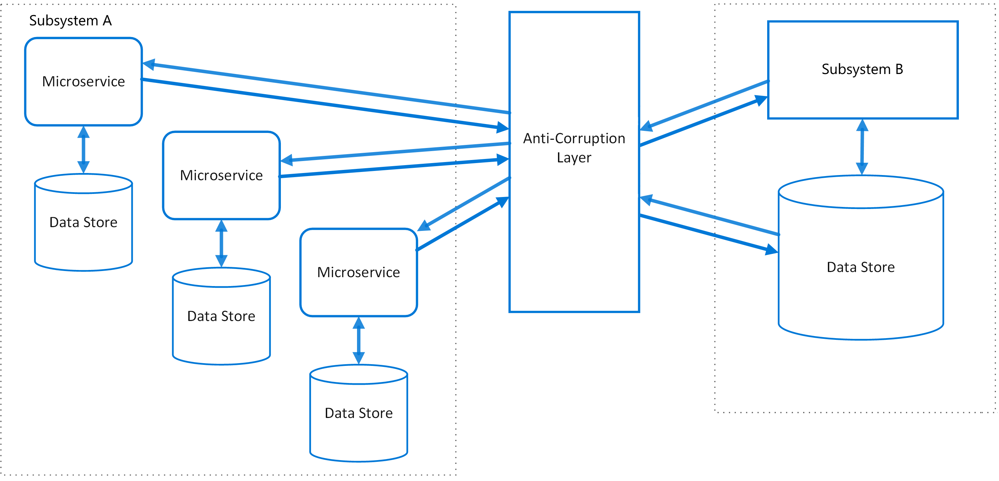

## 云上托管应用的设计模式

参考资料：[Ambassador pattern - Azure Architecture Center | Microsoft Learn](https://learn.microsoft.com/en-us/azure/architecture/patterns/ambassador)

#### 1、大使模式（Ambassador pattern）和边车模式（sidecar pattern）

Put client frameworks and libraries into an external process that acts as a proxy between your application and external services. Deploy the proxy on the same host environment as your application to allow control over routing, resiliency, security features, and to avoid any host-related access restrictions. You can also use the ambassador pattern to standardize and extend instrumentation. The proxy can monitor performance metrics such as latency or resource usage, and this monitoring happens in the same host environment as the application.

#### 2、防腐层模式（Anti-corruption Layer pattern），

简单的说，就是在调用的上下层之间插入一层，对上层屏蔽掉下层的细节，当下层需要重构的时候，上层不需要大面积修改。

Isolate the different subsystems by placing an anti-corruption layer between them. This layer translates communications between the two systems, allowing one system to remain unchanged while the other can avoid compromising its design and technological approach.

#### 3、无花果模式（Strangler Fig pattern）

与防腐层设计模式类似，无花果模式是针对系统升级过程中，新老版本过度的做法，对外屏蔽升级的系统的细节和路由控制。

#### 4、异步请求应答模式（Asynchronous Request-Reply pattern）

简单的说，就是http轮询。对于长任务，不断轮询它的状态，直到有明确结果或者超时。为什么叫异步呢？明明是同步轮询。这里的异步是指先提交一个异步长任务（不能立即获得结果），然后同步不断的轮询。

One solution to this problem is to use HTTP polling. Polling is useful to client-side code, as it can be hard to provide call-back endpoints or use long running connections. Even when callbacks are possible, the extra libraries and services that are required can sometimes add too much extra complexity.

#### 5、用于前端的后端模式（Backends for Frontends pattern）

每种前端差异巨大，如果都由偏原子的统一的后台接口来提供服务，会导致前端逻辑复杂，尤其是移动端。后端是多个微服务，每个服务都只提供原子型正交的接口，而前端移动端需要呈现复杂的业务逻辑，但移动的前端会有耗电、网络流量、弱网、设备性能、程序包大小等考虑，形成了矛盾点。那BFF的设计模式能够很好的解决，BFF适合把多个微服务整合出一个综合的前端请求的场景：

1. 一方面，利好SDK/app，SDK/app只需要面对单连接（省电、省流量、抗弱网）、更一致的数据、更自然的业务建模（BFF代替SDK撮合多个后端和多段业务逻辑）。
2. 另一方面，利好后台，后台肯定还是原子化和微服务化更好（并行开发、高内聚低耦合、故障隔离仓、更好的容量管理、更好的可运维性）

然后就插入一bff层，专门适配前端。

推荐阅读这个材料：[Sam Newman - Backends For Frontends](https://samnewman.io/patterns/architectural/bff/)