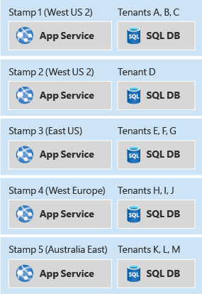

## 云上托管应用的设计模式

参考资料：[Ambassador pattern - Azure Architecture Center | Microsoft Learn](https://learn.microsoft.com/en-us/azure/architecture/patterns/ambassador)

### 1、关于扩展性的设计模式

#### 1.1、大使模式（Ambassador pattern）和边车模式（sidecar pattern）

Put client frameworks and libraries into an external process that acts as a proxy between your application and external services. Deploy the proxy on the same host environment as your application to allow control over routing, resiliency, security features, and to avoid any host-related access restrictions. You can also use the ambassador pattern to standardize and extend instrumentation. The proxy can monitor performance metrics such as latency or resource usage, and this monitoring happens in the same host environment as the application.

#### 1.2、防腐层模式（Anti-corruption Layer pattern），

简单的说，就是在调用的上下层之间插入一层，对上层屏蔽掉下层的细节，当下层需要重构的时候，上层不需要大面积修改。

Isolate the different subsystems by placing an anti-corruption layer between them. This layer translates communications between the two systems, allowing one system to remain unchanged while the other can avoid compromising its design and technological approach.

#### 1.3、无花果模式（Strangler Fig pattern）

与防腐层设计模式类似，无花果模式是针对系统升级过程中，新老版本过度的做法，对外屏蔽升级的系统的细节和路由控制。

#### 1.4、异步请求应答模式（Asynchronous Request-Reply pattern）

简单的说，就是http轮询。对于长任务，不断轮询它的状态，直到有明确结果或者超时。为什么叫异步呢？明明是同步轮询。这里的异步是指先提交一个异步长任务（不能立即获得结果），然后同步不断的轮询。

One solution to this problem is to use HTTP polling. Polling is useful to client-side code, as it can be hard to provide call-back endpoints or use long running connections. Even when callbacks are possible, the extra libraries and services that are required can sometimes add too much extra complexity.

#### 1.5、用于前端的后端模式（Backends for Frontends pattern）

每种前端差异巨大，如果都由偏原子的统一的后台接口来提供服务，会导致前端逻辑复杂，尤其是移动端。后端是多个微服务，每个服务都只提供原子型正交的接口，而前端移动端需要呈现复杂的业务逻辑，但移动的前端会有耗电、网络流量、弱网、设备性能、程序包大小等考虑，形成了矛盾点。那BFF的设计模式能够很好的解决，BFF适合把多个微服务整合出一个综合的前端请求的场景：

1. 一方面，利好SDK/app，SDK/app只需要面对单连接（省电、省流量、抗弱网）、更一致的数据、更自然的业务建模（BFF代替SDK撮合多个后端和多段业务逻辑）。
2. 另一方面，利好后台，后台肯定还是原子化和微服务化更好（并行开发、高内聚低耦合、故障隔离仓、更好的容量管理、更好的可运维性）

然后就插入一bff层，专门适配前端。

推荐阅读这个材料：[Sam Newman - Backends For Frontends](https://samnewman.io/patterns/architectural/bff/)

#### 1.6  集中配置管理系统的设计模式（External Configuration Store pattern）

Move configuration information out of the application deployment package to a centralized location. This can provide opportunities for easier management and control of configuration data, and for sharing configuration data across applications and application instances.

#### 1.7 联合登录的设计模式（也叫单点登录系统，Federated Identity pattern）

Implement an authentication mechanism that can use federated identity. Separate user authentication from the application code, and delegate authentication to a trusted identity provider. This can simplify development and allow users to authenticate using a wider range of identity providers (IdP) while minimizing the administrative overhead. It also allows you to clearly decouple authentication from authorization.

#### 1.7 看门人模式（Gatekeeper pattern）

其实就是加入一个网关，它可以访问控制和校验，屏蔽内部敏感接口和细节，降低安全风险，就像一个防火墙。其实网关远不止这个功效，这个模式突出强调网关在安全方面的作用

#### 1.8 网关聚合模式（Gateway Aggregation pattern）

前端可能访问很多个后端资源，如果这些后端资源都是各自的接入点暴露给前端，会导致前端要和很多后端打交道，增删改后端资源都要动前端。改模式通过插入一个网关来聚合成一个集中的接入点，解决上述痛点。

Use a gateway to reduce chattiness between the client and the services. The gateway receives client requests, dispatches requests to the various backend systems, and then aggregates the results and sends them back to the requesting client.

This pattern can reduce the number of requests that the application makes to backend services, and improve application performance over high-latency networks.

#### 1.9 网关减负模型（Gateway Offloading pattern）

通过插入一层网关，把就近接入、SSL证书管理、限流等多个后端服务都要重复解决的问题，集中到一个团队和一个服务（网关）解决。

Offload some features into a gateway, particularly cross-cutting concerns such as certificate management, authentication, SSL termination, monitoring, protocol translation, or throttling.

#### 1.10 网络路由模型（Gateway Routing pattern）

很直白常用，不啰嗦了。

Route requests to multiple services or multiple service instances using a single endpoint. The pattern is useful when you want to:

- Expose multiple services on a single endpoint and route to the appropriate service based on the request
- Expose multiple instances of the same service on a single endpoint for load balancing or availability purposes
- Expose differing versions of the same service on a single endpoint and route traffic across the different versions

#### 1.11 调度器/代理/监督者模型（Scheduler Agent Supervisor pattern）

有点向master-worker模型，Scheduler 负责调度和分配任务，agent负责干活，Supervisor 负责检查长任务的状态，做必要的补偿和修复。

#### 1.12 泊车员钥匙模型（Valet Key pattern）

泊车员这个在国内还不常见，但装修工钥匙大家都见过，好像是红色的，给到装修工装修期间开门锁门，业主不用去现场也不用担心装修工自己私自另配钥匙。装修完了后，通过一个特殊操作，让装修工持有的钥匙失效。

在软件设计领域，这个表示一个临时派发的用于访问某资源的token。

This key or token is usually referred to as a valet key. It provides time-limited access to specific resources and allows only predefined operations such as reading and writing to storage or queues, or uploading and downloading in a web browser. Applications can create and issue valet keys to client devices and web browsers quickly and easily, allowing clients to perform the required operations without requiring the application to directly handle the data transfer. This removes the processing overhead, and the impact on performance and scalability, from the application and the server.

### 2、关于容错性和鲁棒性的设计模式

#### 2.1、隔离舱模式（Bulkhead pattern）

隔离舱模式是一种容错设计模式，把资源和服务分割为多个独立的池子，其中一个故障不影响其他池子的服务。

In a bulkhead architecture, elements of an application are isolated into pools so that if one fails, the others will continue to function. 

#### 2.2、熔断模式（Circuit Breaker pattern）

The Circuit Breaker pattern can prevent an application from repeatedly trying to execute an operation that's likely to fail. Allowing it to continue without waiting for the fault to be fixed or wasting CPU cycles while it determines that the fault is long lasting. The Circuit Breaker pattern also enables an application to detect whether the fault has been resolved. If the problem appears to have been fixed, the application can try to invoke the operation.

#### 2.3、重试模式（Retry pattern）

In the cloud, transient faults aren't uncommon and an application should be designed to handle them elegantly and transparently. This minimizes the effects faults can have on the business tasks the application is performing.

#### 2.4、限流模式（Throttling pattern）

An alternative strategy to autoscaling is to allow applications to use resources only up to a limit, and then throttle them when this limit is reached. The system should monitor how it's using resources so that, when usage exceeds the threshold, it can throttle requests from one or more users. 

#### 2.5 服务端点健康检查模型（Health Endpoint Monitoring pattern）

好像没有什么好说的

#### 2.6 leader选举模型（Leader Election pattern）

简单的说就是需要一个唯一的执行流作为leader来做协调和分配工作，但是单点的进程来做这个任务，一旦crash了可能容错性会比较差，所以就让多个进程竞争选举出一个leader来做。如果该leader意外退出了，其他进程会重新选举出新leader，从而提高了容错性。

The task instances might run separately for much of the time, but it might also be necessary to coordinate the actions of each instance to ensure that they don't conflict, cause contention for shared resources, or accidentally interfere with the work that other task instances are performing.

A single task instance should be elected to act as the leader, and this instance should coordinate the actions of the other subordinate task instances. If all of the task instances are running the same code, they are each capable of acting as the leader. Therefore, the election process must be managed carefully to prevent two or more instances taking over the leader role at the same time.

#### 2.7 其他容错性设计模式

1. **Checkpoint long-running transactions：**对于长任务，执行过程中不断保存执行状态到磁盘，任务一旦异常停止，可以从磁盘恢复，而不用从头开始。 pytorch这些深度学习框架，训练过程中就经常用到这个设计模式。
2. **Degrade gracefully：**优雅降级就是只如果不能提供完整完美的服务，那么只提供部分关键的服务和功能，也比全面失败要好。
3. **Using availability zones：**部署上做多可用区部署。多可用区通常是一个机房的多个隔离舱，多可用区之间可以内网通信。甚至做多region间容灾

### 3、高性能的设计模式

#### 3.1  cache模式

这个无需多讲？

#### 3.2 认领牌模式（Claim-Check pattern）

简单的说，就是基于消息的架构，在消息里不适合直接传输文件、图片等大块数据。该设计模式是把这类大块的数据在传递前先存储到一个存储系统里，并在传输的消息里持有对该大块数据访问的一个认领牌（例如url），在需要真正用到大块数据的的时候，使用该认领牌从存储系统里提取。

Store the entire message payload into an external service, such as a database. Get the reference to the stored payload, and send just that reference to the message bus. The reference acts like a claim check used to retrieve a piece of luggage, hence the name of the pattern. Clients interested in processing that specific message can use the obtained reference to retrieve the payload, if needed.

#### 3.3 竞争消费者模式（Competing Consumers pattern）

简单的说：使用消息队列来对突发请求削峰填谷，同时在消费者这端，是多个消费者构成的池子，对请求进行处理。类似kafka里的Consumers group。一个topic的某条消息，同一个group只会消费一次。nsq也有类似的概念和设计。

#### 3.4 基于队列的负载调节模式（Queue-Based Load Leveling pattern）

其实就是消息队列的对突发请求削峰填谷功能。

说到队列，就不得不提优先级队列，这也是一个设计模式，不另外提了。总之就是把系统中的请求分优先级，优先级队列可以确保把系统资源向高优先级的请求倾斜，更及时的处理。

#### 3.5 读写分离模式（CQRS pattern）

CQRS stands for Command and Query Responsibility Segregation, a pattern that separates read and update operations for a data store.Implementing CQRS in your application can maximize its performance, scalability, and security. 

#### 3.6 多集群部署模式（Deployment Stamps pattern）

就是把多租户分布到不同的集群上，好处有：

1. 提高性能的横向扩展能力
2. 隔离故障
3. 灰度部署降低发布变更的风险
4. 地理上的就近或者地缘政治的考虑

#### 3.7 晶球模型（Geode pattern）

其实类似上面的多集群部署模型，这个强调的是地域性和同一个租户的不同地域的用户访问就近的一个后台集群。

Deploy the service into a number of satellite deployments spread around the globe, each of which is called a *geode*.   A global load balancer routes traffic via the shortest path to a nearby geode, which improves latency and performance.

#### 3.8 索引表模型（Index Table pattern）

简单的说，就是要建立查找的索引，提高检索速度。例如对于关系型数据库，要根据业务查询的需要，创建索引。对于非关系型数据库，要创建类似倒排表这样的数据结构。

#### 3.9 实体化视图模型（Materialized View pattern）

简答的说，就是一个聚合后的数据缓存。最典型的就是大数据里的离线计算，把原始数据按照分钟聚合，提前生成可能查询的一些曲线和指标。而不是临时从原始数据开始生成。另外微博、朋友圈这样的time line，通常也是一个提前定期计算的视图。

To support efficient querying, a common solution is to generate, in advance, a view that materializes the data in a format suited to the required results set. 

#### 3.10 sharding模型（Sharding pattern）

Divide a data store into a set of horizontal partitions or shards. This can improve scalability when storing and accessing large volumes of data.

比较常用，不罗嗦

#### 3.11 静态内容托管模型（Static Content Hosting pattern）

很好理解，把静态内容托管到CDN等服务上进行分发，与动态内容分开，提供性能。

Deploy static content to a cloud-based storage service that can deliver them directly to the client. This can reduce the need for potentially expensive compute instances.

#### 3.12 尽量使用乐观并发控制替代悲观并发控制（optimistic concurrency vs pessimistic concurrency ）

Pessimistic concurrency control uses database locks to prevent conflicts. This can cause poor performance and reduce availability. With optimistic concurrency control, each transaction modifies a copy or snapshot of the data. When the transaction is committed, the database engine validates the transaction and rejects any transactions that would affect database consistency.

### 4、关于事务和一致性的设计模式

分布式系统里，为了A（高可用）和P（区域自治），通常是牺牲C（一致性），采取最终一致。当一个业务处理过程涉及到分布式系统的多个子模块的数据修改，中途的失败可能导致数据不一致。如何使得数据最终一致。通常有下面的设计模式。

#### 4.1 补偿事务模式（Compensating Transaction pattern）

The solution is to implement a compensating transaction. The steps in a compensating transaction undo the effects of the steps in the original operation. An intuitive approach is to replace the current state with the state the system was in at the start of the operation. 

#### 4.2 事件溯源模式（Event Sourcing pattern）

类似bin log的设计，不只是保存数据的最终状态，还记录数据变更的事件日志，用于恢复数据、避免互斥冲突提高写性能、数据备份和审计等等。

The Event Sourcing pattern defines an approach to handling operations on data that's driven by a sequence of events, each of which is recorded in an append-only store. Application code sends a series of events that imperatively describe each action that has occurred on the data to the event store, where they're persisted. Each event represents a set of changes to the data

#### 4.3 幂等设计模式 （idempotent pattern）

When possible, design operations to be idempotent. 

