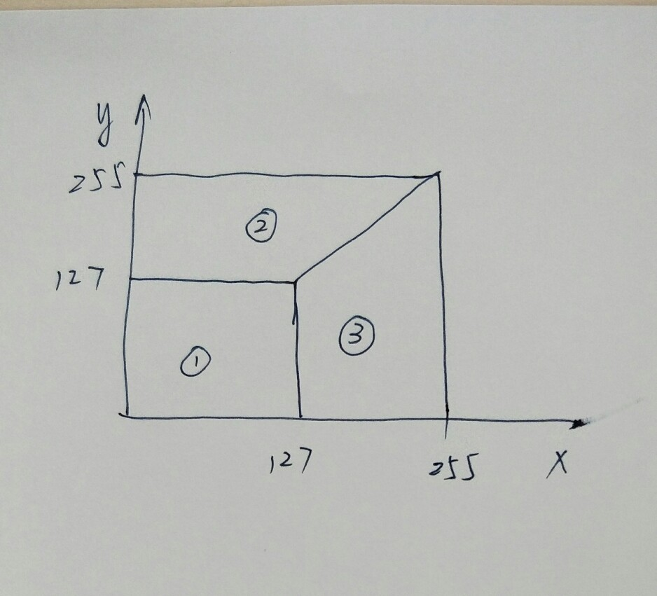

# 1.引子 #

使用caffe对图片进行分类等处理，网上有很多例子，通常会使用卷积层、pooling什么的，这类网络也很多。对于传统机器学习处理的结构化数据分类问题，使用神经网络来处理，有无可能完成呢？怎么做呢？

本文演示了一个简单的demo

# 2.问题 #

使用BP网络（反正就是深度学习的那些网络吧），训练出一个模型，满足：
输入x, y（整数，范围在0到255之间，不含255），输出分类c（取值为1/2/3），如图所示：

# 3.产生训练集数据 #

为了能够产生足够多的样本，我们把x，y的取值范围扩展到uint16_t，[0, 65535)。用java快速写了点代码，随机产生训练/测试样本

[产生训练/测试样本的代码下载](code/bpclassify/gendata.java)

[训练集合](code/bpclassify/range_train.csv)

[测试集合](code/bpclassify/range_test.csv)

样本样例：
    
    #x,y,class
    40579,24746,3,
    45257,52982,2,
    37299,26774,3,
    15185,2324,1,

# 4.将数据转换为lmdb形态的“图片” #

因为caffe下的深度学习的网络，通常有个DATA层，可以接收lmdb形式的数据，里面是一张一张的图片。我们的结构化数据只有x,y两个uint16_t型整数，所以最简单的办法就是把每个样本模拟成高1像素、宽4像素、channel数为1的图片。

这段代码比较简单，但是用到的库会多一些，有lmdb、opencv、protobuf什么的，都是caffe编译时候带的。

    void convert_dataset(const char* fileName,
            const char* db_path){
        //访问lmdb的句柄
        scoped_ptr<db::DB> db(db::GetDB("lmdb"));
        db->Open(db_path, db::NEW);
        scoped_ptr<db::Transaction> txn(db->NewTransaction());
    
        FILE * fp = fopen(fileName, "rb");//打开csv文件
        if (fp == NULL) { perror("fopen:"); return;}
    
        int count = 0;
    
        int item_id;
    
        unsigned char databuf[MAX_FIELD_NUM*sizeof(InputType)];
        //写入lmdb的数据，是一个protobuf message序列化后的字节流
        //这个message的定义是Datum
        string value;
        Datum datum;
        datum.set_channels(1);
    
    
        for (item_id = 0; ; item_id++)//一行一行的读
        {
            char line[1024];
            if ( NULL == fgets(line, sizeof(line)-1, fp) )
            {
                break;
            }
            rmReturn(line);
    
            InputType fields[MAX_FIELD_NUM];
    
            int field_num = split2fields(line, fields);//按逗号分割成3个字段
    
    
            if (item_id < 1)
            {
                printf("field number:%d, %d,%d,%d\n", field_num, fields[0], fields[1], fields[field_num-1]); 
    
                datum.set_height(1);
                datum.set_width( (field_num-1) * sizeof(InputType) );
            }
    
    
            //将x,y拷贝到一个缓冲区，设置到datum的data字段里
            int j;
            int offset = 0;
            memcpy(databuf, &fields[0], sizeof(InputType)*(field_num-1) );
    
    
            offset += sizeof(InputType)*(field_num-1);
    
    
            datum.set_data(databuf, sizeof(InputType)*(field_num-1) );
            datum.set_label(fields[field_num-1]); //将分类设置到label字段里
    
            if (item_id < 3) 
            { 
                printf("label:%d ", datum.label());
                printf("x:%d, y:%d\n", *(InputType*)(databuf), *(InputType*)(databuf+sizeof(InputType)) ); 
            }
    
            string key_str = caffe::format_int(item_id, 8);
            datum.SerializeToString(&value);
    
            if (item_id < 3) { printf("keystr:%s, value len:%d\n", key_str.c_str(), value.length());}
    
            txn->Put(key_str, value);//写入数据库
    
            if (++count % 1000 == 0) {
                txn->Commit();
            }
        }
        // write the last batch
        if (count % 1000 != 0) {
            txn->Commit();
        }
        db->Close();
        fclose(fp);
    }

[将csv写入lmdb的代码](code/bpclassify/main.cpp)

[读lmdb以验证数据的代码](code/bpclassify/readlmdb.cpp)

[makefile](code/bpclassify/makefile)

执行上面的程序，会生成训练/测试的lmdb库，并且调用caffe的一个工具，生成数据的均值，用于训练：

    tools/compute_image_mean ./range_train_lmdb   range_mean.binaryproto

# 5.定义网络并训练 #

caffe框架的两个关键文件：

[train.prototxt](code/bpclassify/train.prototxt)

[solver.prototxt](code/bpclassify/solver.prototxt)

这个网络是拿alexNet裁剪的，后来发现不能收敛，经高手指点加上reLU层，并调整 solver.prototxt里的相关参数才收敛。另外，solver.prototxt里的看似只是影响收敛速度的参数，可能直接影响最后是否收敛，例如stepsize

输入命令开始训练：

    /data/caffe-1.0/build/tools/caffe train --solver=./solver.prototxt   --gpu=1

训练结果显示：

    I1204 12:25:56.751425 56786 sgd_solver.cpp:273] Snapshotting solver state to binary proto file alexNet_range_iter_20000.solverstate
    I1204 12:25:56.755051 56786 solver.cpp:310] Iteration 20000, loss = 0.00358959
    I1204 12:25:56.755077 56786 solver.cpp:330] Iteration 20000, Testing net (#0)
    I1204 12:25:56.755086 56786 net.cpp:676] Ignoring source layer loss
    I1204 12:25:56.772317 56846 data_layer.cpp:73] Restarting data prefetching from start.
    I1204 12:25:56.773005 56786 solver.cpp:397]     Test net output #0: accuracy = 0.9999

结果模型保存在alexNet_range_iter_20000.solverstate文件里

# 6.在程序里使用训练出来的模型进行分类 #

在caffe目录下找了个调用模型的代码，改改，实现读入csv文件的x,y，利用模型进行分类，并与实际分类进行比对，里面关键的数据结构是Mat类和MyClassifier类。

	int main(int argc, char** argv) {
	  if (argc != 6) {
		std::cerr << "Usage: " << argv[0]
				  << " deploy.prototxt network.caffemodel"
				  << " mean.binaryproto labels.txt dataInCsv" << std::endl;
		return 1;
	  }

	  string model_file   = argv[1];
	  string trained_file = argv[2];
	  string mean_file    = argv[3];
	  string label_file   = argv[4];
	  MyClassifier classifier(model_file, trained_file, mean_file, label_file);

	  string file = argv[5];

	  std::cout << "---------- Prediction for "
				<< file << " ----------" << std::endl;

	  FILE * fp = fopen(file.c_str(), "rb");

	  int i, j,  f_idx;
	  for (i = 0; ; ++i)
	  {
		  char line[1024];
		
		  if ( NULL == fgets(line, sizeof(line)-1, fp) )
		  {
			break;
		  }
		  rmReturn(line);
		  //printf("%d\n", __LINE__);
		  InputType fields[MAX_FIELD_NUM];
		  int field_num = split2fields(line, fields);

		  
		  cv::Mat img(1, sizeof(InputType)*(field_num-1), CV_8UC1);
		  for(f_idx = 0; f_idx < field_num-1; f_idx++)
		  {
				  unsigned char * p = (unsigned char*)&fields[f_idx]; 

				  for (j = 0; j < sizeof(InputType); ++j)
				  {
						  img.at<unsigned char>(0,f_idx*sizeof(InputType)+j)= *(p+j);
				  }
		  }

	#if 1
		  CHECK(!img.empty()) << "Unable to decode image " << file;
		  std::vector<Prediction> predictions = classifier.Classify(img);

		  /* Print the top N predictions. 0.9980 - "0 NO" */
		  for (size_t i = 0; i < predictions.size(); ++i) {
			  Prediction p = predictions[i];
			  std::cout << std::fixed << std::setprecision(4) << p.second << " - \""
				  << p.first << "\"" << std::endl;
		  }
	#endif
		  
		  std::cout << "actually:" << fields[field_num-1] << std::endl << std::endl;

	  }
	}

[详细代码下载](code/bpclassify/classification.cpp)

还要用到一个deploy.prototxt：

[deploy.prototxt](code/bpclassify/deploy.prototxt)

输入命令：

    ./classify  ../alexnet/deploy.prototxt  ../alexnet/alexNet_range_iter_20000.caffemodel ./range_mean.binaryproto ../alexnet/labels.txt test.csv

结果如下：

	1.0000 - "1 c1"
	0.0000 - "2 c2"
	0.0000 - "0 c0"
	0.0000 - "3 c3"
	actually:1

	1.0000 - "3 c3"
	0.0000 - "2 c2"
	0.0000 - "0 c0"
	0.0000 - "1 c1"
	actually:3

# 7.关于数据预处理 #

* 如果是double类型的x,y，然后直接内存拷贝到datum.data，也就是把double类型字段的内存挨个作为图片的像素，训练效果会很差，也能收敛一点（有一次达到了70%的准确率），但比整数的情况要差，所以要尽量用uint型

* 这还是好理解的，double类型字段在内存里是IEEE745标准，又是指数部分又是基数又是偏移的，跟图片的像素太不“线性相关”了：两个空间距离很近的点(x,y)，在double型的内存里可能相距很远；可能负整数都会带来坏的影响，因为是补码

* 根据前面double的情形推断：如果是字符串类型的字段，应该转换为正整数的枚举类型，直接拷贝字符串的字符内存（字符数组）可能效果也不太好，因为两个完全不同意义的字符串（语义距离很远），在字符数组内存上差异很小，只相差一两个字节

所以我这里写了一个java类，用于数据预处理，把字符串类型的字段、double型字段、 可能取负值的整数字段统一归一化到UINT63的范围内（没有写错，确实不是UINT64，因为java的long类型），代码里的例子是预处理UCI的Adult数据集

[数据预处理的java类](code/bpclassify/preprocess.java)

