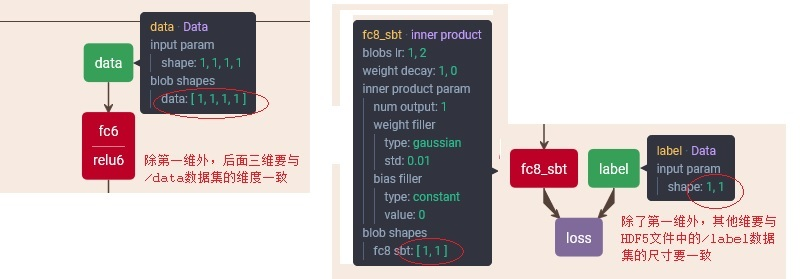

# 1、问题提出

深度学习用于图片分类问题处理是非常典型和常见的。作者有篇文章使用深度学习尝试对结构化数据做分类，主要的思路是把标注的数据转化为uint8类型，并写入Datum数据结构，伪装成图片的样子写成lmdb文件，然后使用softmax loss层使用交叉熵做损失函数。

作者另外一篇文章：使用深度学习进行超分辨率，以SRCNN网络为例。其本质是一个回归问题，网络输出21X21大小的超分后的图片区域，使用的损失函数是像素值的欧式距离的平方。

进一步的提出问题：caffe是否能方便的对结构化数据做回归呢？

假设标注数据是输入x（浮点数，大于0小于10），输出y，其中y与x隐藏的关系是：

```
y=2x^2 + x + 3
```

我们不知道上面多项式，需要训练出一个网络，对标注的数据进行回归。

# 2、HDF5格式的训练数据的产生

Datum + lmdb的DATA型数据输入层比较局限：适合像素类型的输入数据、且Datum结构的用于存储标注的label是一个整数，适合分类，不太适合回归。

相比之下，以HDF5文件作为载体的HDF5_DATA数据输入层适合回归：输入数据可以是float、int等各种类型，标注的回归值也可以是多个float、int等类型。

HDF5文件格式和访问API可以见HDF5的官网。这里只说重点：HDF5_DATA数据输入层的文件格式是：

1. 输入数据存储在HDF5文件的"/data" 数据集中
2. 标注的回归值存储在HDF5文件的"/label"数据集中，按照顺序与"/data"数据集中的记录对应
3. 根据实际情况，"/data"和"/label"数据集的格式和类型可以灵活处理

我们这个例子中的HDF5文件内容是这样的：

```
h5dump.exe train.h5 >e:\a.txt

GROUP "/" {
   DATASET "data" {
      DATATYPE  H5T_IEEE_F64BE
      DATASPACE  SIMPLE { ( 10000, 1, 1, 1 ) / ( 10000, 1, 1, 1 ) }
      DATA {
      (0,0,0,0): 7.10654,
      (1,0,0,0): 2.69692,
      ...
   DATASET "label" {
      DATATYPE  H5T_IEEE_F64BE
      DATASPACE  SIMPLE { ( 10000, 1 ) / ( 10000, 1 ) }
      DATA {
      (0,0): 111.112,
      (1,0): 20.2437,
      (2,0): 102.095,
      ...
```

产生这些数据的主要代码和API如下：
```c
	hid_t       file_id, dataset_id, dataset_id2, dataspace_id, dataspace_id2;

	file_id = H5Fcreate(db_path, H5F_ACC_TRUNC, H5P_DEFAULT, H5P_DEFAULT);
	hsize_t dims[4], labelDims[2];
	dims[0] = 10000;
	dims[1] = 1;
	dims[2] = 1;
	dims[3] = 1;
	
	labelDims[0] = 10000;
	labelDims[1] = 1;

	dataspace_id = H5Screate_simple(4, dims, NULL);
	dataspace_id2 = H5Screate_simple(2, labelDims, NULL);

	
	/* Create the dataset. */
	dataset_id = H5Dcreate(file_id, "/data", H5T_IEEE_F64BE, dataspace_id, H5P_DEFAULT, H5P_DEFAULT, H5P_DEFAULT);
	dataset_id2 = H5Dcreate(file_id, "/label", H5T_IEEE_F64BE, dataspace_id2, H5P_DEFAULT, H5P_DEFAULT, H5P_DEFAULT);

	static InputType inputData[10000][1][1][1];
	static InputType inputLabel[10000][1];
	
	H5Dwrite(dataset_id, H5T_NATIVE_DOUBLE, H5S_ALL, H5S_ALL, H5P_DEFAULT, inputData);
	H5Dwrite(dataset_id2, H5T_NATIVE_DOUBLE, H5S_ALL, H5S_ALL, H5P_DEFAULT, inputLabel);

	H5Dclose(dataset_id);
	H5Dclose(dataset_id2);
	H5Sclose(dataspace_id);
	H5Sclose(dataspace_id2);
	H5Fclose(file_id);
```

详细的代码文件如下：

[产生HDF5文件的代码](code/bpregression/GeneH5.cpp)

# 3、训练模型

train_val.prototxt文件的重点是一开始的输入层以及最后输出层和损失函数层：
```
layers {
  name: "data"
  type: HDF5_DATA
  top: "data"
  top: "label"
  hdf5_data_param {
    source: "train.txt"
    batch_size: 200
  }
  include: { phase: TRAIN }
}
layers {
  name: "data"
  type: HDF5_DATA
  top: "data"
  top: "label"
  hdf5_data_param {
    source: "test.txt"
    batch_size: 50
  }
  include: { phase: TEST }
  ...
layers {
  name: "fc8_sbt"
  type: INNER_PRODUCT
  bottom: "fc9"
  top: "fc8_sbt"
  blobs_lr: 1
  blobs_lr: 2
  weight_decay: 1
  weight_decay: 0
  inner_product_param {
    num_output: 1
    weight_filler {
      type: "gaussian"
      std: 0.01
    }
    bias_filler {
      type: "constant"
      value: 0
    }
  }
}

layers {
  name: "loss"
  type: EUCLIDEAN_LOSS
  bottom: "fc8_sbt"
  bottom: "label"
  top: "loss"
 include: { phase: TRAIN }
}
```

需要重点注意的是：HDF5文件中数据集的维度，要和网络中相关层的维度保持一致：



[详细的prototxt文件在这里](code/bpregression)

caffe训练跑起来后，可以看到损失函数的值迅速收敛：
```
>caffe.exe train --solver=solve.prototxt --gpu=0

I0301 19:34:07.575019  8144 sgd_solver.cpp:105] Iteration 9960, lr = 1e-05
I0301 19:34:07.894455  8144 solver.cpp:218] Iteration 9980 (63.8491 iter/s, 0.313239s/20 iters), loss = 0.0277267
I0301 19:34:07.895453  8144 solver.cpp:237]     Train net output #0: loss = 0.0277268 (* 1 = 0.0277268 loss)
I0301 19:34:07.896450  8144 sgd_solver.cpp:105] Iteration 9980, lr = 1e-05
I0301 19:34:08.161769  8144 solver.cpp:447] Snapshotting to binary proto file struct_reg_iter_10000.caffemodel
I0301 19:34:08.275161  8144 sgd_solver.cpp:273] Snapshotting solver state to binary proto file struct_reg_iter_10000.solverstate
I0301 19:34:08.306107  8144 solver.cpp:310] Iteration 10000, loss = 0.0269606
I0301 19:34:08.307076  8144 solver.cpp:330] Iteration 10000, Testing net (#0)
I0301 19:34:08.308101  8144 net.cpp:676] Ignoring source layer loss
I0301 19:34:09.030141  8144 solver.cpp:397]     Test net output #0: accuracy = 0
I0301 19:34:09.030141  8144 solver.cpp:315] Optimization Done.
I0301 19:34:09.032135  8144 caffe.cpp:260] Optimization Done.
```

在分类网络中工作的很好的Accuracy层在这里不行，老提示准确度维0，应该是场景不合适。从这个角度看，测试集那就没有什么意义了。

# 4、模型调用和验证

调用的代码在作者其他几篇文章里提到比较多，很类似，主要的代码如下：

```c
void regression(boost::shared_ptr<Net<float> > net, double x)
{
    float data_input[1][1][1]; 
	data_input[0][0][0] = x;
	
	Blob<float>* input_blobs = net->input_blobs()[0];
	switch (Caffe::mode())
	{
	case Caffe::CPU:
		memcpy(input_blobs->mutable_cpu_data(), data_input,
			sizeof(float) * input_blobs->count());
		break;
	case Caffe::GPU:
		cudaMemcpy(input_blobs->mutable_gpu_data(), data_input,
			sizeof(float) * input_blobs->count(), cudaMemcpyHostToDevice);
		break;
	default:
		LOG(FATAL) << "Unknown Caffe mode.";
	}
	
	net->Forward();
	
	int index = get_blob_index(net, "fc8_sbt");
	boost::shared_ptr<Blob<float> > blob = net->blobs()[index];
	unsigned int num_data = blob->count();
	int i;
	double expectValue = 2 * x*x + x + 3;
	for (i = 0; i < num_data; ++i)
	{
		const float *blob_ptr = (const float *)blob->cpu_data();
		printf("%f,%f,%f,\n", *(blob_ptr+i), 
						expectValue, 
						*(blob_ptr + i) / expectValue);
	}
	printf("\n");

}
```

[详细代码在这里](code/bpregression/UseTrainedModel.cpp)

执行情况很让人满意，随机产生的100个测试样例，预测值和理论值非常接近：

```
预测值，理论值，两者比值
---------------------------
123.223465,123.253208,0.999759,
49.872707,49.891467,0.999624,
36.207577,36.223801,0.999552,
97.172989,97.203782,0.999683,
75.547760,75.587040,0.999480,
```

# 5、小结与遗留问题

在caffe下，使用HDF5输入层和欧式距离损失函数来做结构化数据的回归，其实还是很方便的。

重要的知识点就是HDF5输入层的理解、欧式距离损失函数的理解、BLOB数据形状的理解。

遗留问题：

1. Accuracy层在这里能不能用，不能用的话怎么直观的测试准确率
2. HDF5数据比较大的时候，如何使用unlimited维度避免数据全部在内存里准备好才能写HDF5的数据集
3. 调用模型的时候，例子里传入的浮点数和计算的结果是float型，可否是double？ 

