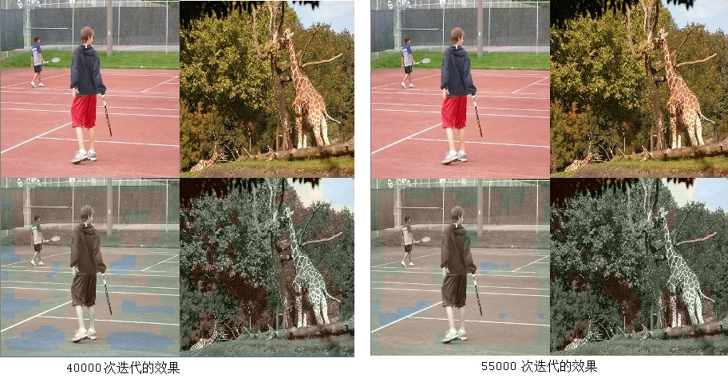

# 利用深度学习给黑白图片上色

利用深度网络，给黑白照片上色，和图片分割是比较类似的。对像素进行分类，获得合适的颜色。

## 1、使用网友分享的深度网络

在网上找到一个别人的项目，文档还挺详细的，如下：

https://github.com/richzhang/colorization

该网络几乎全部使用卷积层和反卷积层。

简单粗暴的理解：一开始使用python层自定义代码将RGB转为Lab模式，使用slice层将blob切分为亮度部分L和色度部分ab。L作为输入数据，网络学习到ab两个通道的数据，原图实际的ab数据作为参照/标签，两者之间的均方差作为损失函数（回归问题）。

实际实现要比上述的复杂，例如作者对ab做了量化，量化为313个分类，转化为像素分类问题。


该项目作者声称需要重新编译安装他修改过的caffe版本，我发现其代码不适合在windows下编译，例如有linux下signal特有的处理函数等。修改一些代码后在windows下运行起来后，运行时候还是会出现报错：

```
TypeError: No to_python (by-value) converter found for C++ type: class caffe::LayerParameter
```

我最后没有能把这个问题解决掉。

抱着试一试的心态用机器上已有的官方的caffe来训练，没有问题！

基于coco数据集的8万张图片，经过20来个小时，迭代4万次，获得一个模型，损失函数从16198收敛到3756。

```
caffe.exe train --solver=.\train\solver.prototxt --weights=.\models\init_v2.caffemodel

...
I0402 18:27:20.344954  4616 caffe.cpp:155] Finetuning from .\models\init_v2.caffemodel
I0402 18:27:20.504952  4616 net.cpp:744] Ignoring source layer img
I0402 18:27:20.504952  4616 net.cpp:744] Ignoring source layer gt_ab_313
I0402 18:27:20.674953  4616 net.cpp:744] Ignoring source layer img
I0402 18:27:20.674953  4616 net.cpp:744] Ignoring source layer gt_ab_313
I0402 18:27:20.714982  4616 caffe.cpp:249] Starting Optimization
I0402 18:27:20.714982  4616 solver.cpp:274] Solving LtoAB
I0402 18:27:20.724984  4616 solver.cpp:275] Learning Rate Policy: step
I0402 18:27:22.394950  4616 solver.cpp:220] Iteration 0 (-4.00371e-07 iter/s, 1.66881s/50 iters), loss = 16198.6
I0402 18:27:22.394950  4616 solver.cpp:239]     Train net output #0: loss8_313 = 16198.6 (* 1 = 16198.6 loss)
I0402 18:27:22.394950  4616 sgd_solver.cpp:105] Iteration 0, lr = 3.16e-05, solver type:Adam

...

I0402 14:38:12.815524 13176 sgd_solver.cpp:105] Iteration 39950, lr = 3.16e-05, solver type:Adam
I0402 14:39:24.185487 13176 solver.cpp:449] Snapshotting to binary proto file ./train/snapshot/colornet_iter_40000.caffemodel
I0402 14:39:25.755486 13176 sgd_solver.cpp:274] Snapshotting solver state to binary proto file ./train/snapshot/colornet_iter_40000.solverstate
I0402 14:39:28.445483 13176 solver.cpp:220] Iteration 40000 (0.661105 iter/s, 75.631s/50 iters), loss = 3943.37
I0402 14:39:28.445483 13176 solver.cpp:239]     Train net output #0: loss8_313 = 3756.27 (* 1 = 3756.27 loss)
I0402 14:39:28.455456 13176 sgd_solver.cpp:105] Iteration 40000, lr = 3.16e-05, solver type:Adam
```

下面是简单的测试用例：


## 2、尝试自构建深度网络

借鉴fcn的网络，自己改改，尝试训练模型，给图片上色。没有成功，损失函数不收敛。也记录下来吧，方便后面有空还会继续研究呢，而且过程中也有一些关于caffe使用方面的收获。

### 2.1 训练数据输入的要点

1. 方式一：lmdb数据，每张图片两个通道：Y通道和UV色彩通道，都是uchar数据类型。UV通道作为label，每个像素被分类到64类（色）中的一个类。然后使用slice层，将Y通道和UV通道切开，用做输入的数据和标签。需要编写数据预处理程序，将每张RGB图片转换为YUV色彩模式，将Y作为一个通道，将UV压缩为一个通道，U占3bit，V占3 bit，然后写入lmdb。
2. 方式二：HDF5数据，类似在图片语义分割笔记中提到的，每个HDF5文件有两个dataset：/data和/label，每个像素有一个label，取值0-63。caffe的HDF5数据层可以方便的处理。


相关[文件](code/colornet)说明：

[GeneImdb.cpp](code/colornet/GeneImdb.cpp) ：产生上面方式一的lmdb数据的代码

[solver_color.prototxt](code/colornet/solver_color.prototxt) /[ train_val_color.prototxt](code/colornet/train_val_color.prototxt)：借鉴richzhang的coloration项目构建的网络定义文件

[solver_fcn.prototxt](code/colornet/solver_fcn.prototxt) / [train_val_fcn.prototxt](code/colornet/train_val_fcn.prototxt)：借鉴fcn项目构建的网络定义文件

[UseTrainedModel.cpp](code/colornet/UseTrainedModel.cpp)：调用已经训练好的模型对图片着色的代码

值得特别说明的是，train_val_color.prototxt文件里用到了两个比较特殊的layer：

1. 使用slice层来切分data和label

2. 使用pooling来做下采样，224的输入经Pooling下采样后为居然为113，只好再使用Crop层裁剪尺寸，进一步引出softmax with loss层的反向传播的配置细节


摘录如下：

```
layer {
  name: "slice"
  type: "Slice"
  bottom: "data"
  top: "data_y" 
  top: "label_uv" 
  propagate_down: false
  slice_param {
    axis: 1
    slice_point: 1
  }
}
```


```
layer {
  name: "pool1"   
  type: "Pooling"  
  bottom: "label_uv"  
  top: "label_uv2"   
  pooling_param {
    pool: MAX
    kernel_size: 1  
    stride: 2  
  }
}
layer {
  name: "crop1"
  type: "Crop"
  bottom: "label_uv2"
  bottom: "conv9_1"
  top: "label_uv3"
  crop_param {
    axis: 2
    offset:0
    offset:0
  }
}
layer {
  name: "loss"
  type: "SoftmaxWithLoss"
  bottom: "conv9_1"
  bottom: "label_uv3"
  propagate_down:true  #需要往conv9_1方向做反向传播
  propagate_down:false #不要往label_uv3方向做反向传播
  top: 'loss'
  loss_param{
      normalization: NONE
 }
}
```


最后的损失函数，我用的是SoftmaxWithLoss层，也就是当做分类问题来处理的。

我觉得也可以使用EuclideanLoss层，当做回归问题，即对两个尺寸为[N, 1, 112, 112]的BLOB计算均方差。

经过55000多次迭代（网络比较大，每个迭代batchsize为4），loss值不收敛。

```
I0407 17:36:50.986207 13784 sgd_solver.cpp:105] Iteration 55300, lr = 1e-10, solver type:SGD
I0407 17:37:50.716219 13784 solver.cpp:220] Iteration 55400 (1.67424 iter/s, 59.7286s/100 iters), loss = 57421.2
I0407 17:37:50.716219 13784 solver.cpp:239]     Train net output #0: loss = 74302.8 (* 1 = 74302.8 loss)
I0407 17:37:50.716219 13784 sgd_solver.cpp:105] Iteration 55400, lr = 1e-10, solver type:SGD
I0407 17:38:50.472383 13784 solver.cpp:220] Iteration 55500 (1.67344 iter/s, 59.7573s/100 iters), loss = 64228.1
I0407 17:38:50.472383 13784 solver.cpp:239]     Train net output #0: loss = 49046.4 (* 1 = 49046.4 loss)
```

上色的效果很差：



### 2.2 训练样本准备过程中颜色处理的要点

1. opencv将RGB转为YUV后，YUV的数据类型都是uchar，U和V的中心点在128，即128表示没有颜色。简单的对0-255的值做量化，会导致色偏（U或V值128经过量化和反量化，不等于128），需要在将中心点移动到0，对[-128,127]的数据范围做量化，才没有色偏。
2. 训练样本里，U，V=128的无颜色点比例较高，当做为64种颜色进行分类学习的时候，模型会懒惰的都预测为这种颜色（分类号为36），损失函数里加上ignore_label:36可以帮助矫正这个问题
3. 常用的位图处理工具里，经常看到把一张位图存为16色位图，还有不错的质量。但我们尝试准备16种颜色分类的训练数据的时候，会发现16色图片的质量很差。前者质量好，是因为每张图片个性化处理：统计直方图，取合适该图片的16种主要颜色用于量化，而我们的训练数据，是对所有图片都用同一的16种颜色，所以质量很差。最后我是尝试做64种颜色分类，平衡了图片质量和模型复杂性。
4. 大量的像素，UV值是在0附近，或者说在128附近，也就是不那么浓郁的颜色。简单的等步长量化为64色，会导致很多像素（其UV值与中值的距离小于一个步长）恢复出来是黑白的。所以要用μ律或者A律进行压扩，压扩后效果好很多。


### 2.3 后续的尝试结果

前面主要是基于train_val_fcn.prototxt + SoftmaxWithLoss损失函数做训练，不收敛。后来又尝试了其他组合：

2019.4.7：使用train_val_color.prototxt + 交叉熵作为损失函数，转化为分类问题，不收敛

2019.4.8：使用train_val_color.prototxt + SoftmaxWithLoss损失函数，转化为回归问题，不收敛

很令人沮丧！

