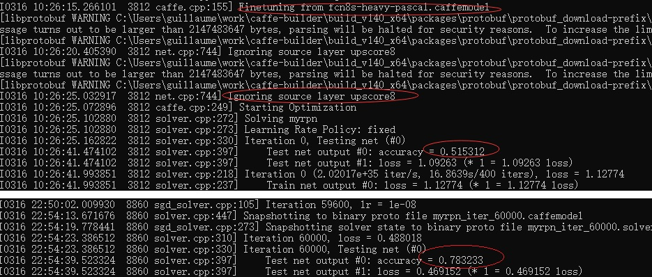
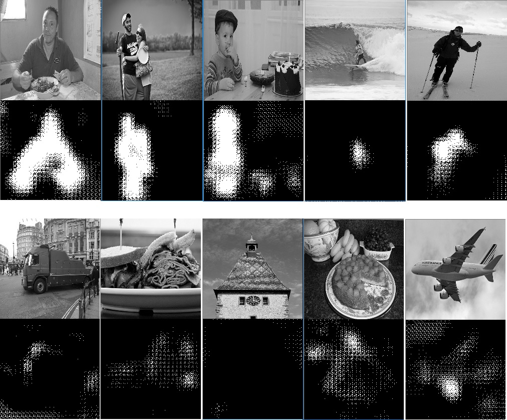
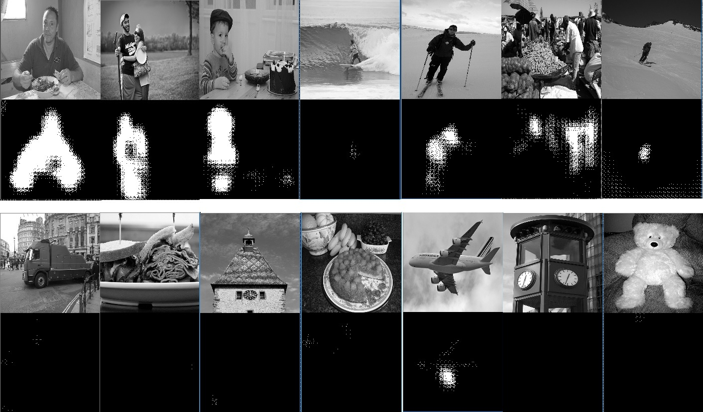

# 利用深度学习进行图片语义分割

## 1、问题提出

图片语义分割，就是自动分割并识别出图片中的各部分内容。类似下面图中识别出人体、动物、球拍等。


用到的技术之一是全卷积网络（FCN），顾名思义，就是这个网络是全部由卷积层组成的。

FCN是CNN演变而来的，CNN最典型的一个用法是用于图片分类，最后的几层通常是全连接层和SoftMax层，将图片进过卷积层提取到的特征经过计算后，转化为N X 1的向量，向量的每个元素对应一个分类的概率。类似下面图中的上面部分最后对1000个分类进行概率判断：


FCN通过deconvolution层上采样，相当于对输入图片的每个像素都进行分类，也就是输入一张 Ch X W X H的图片，输出一个 N X W X H的结果， N是分类总个数，像素位置一一对应。

deconvolution本质上还是卷积操作，在输入输出的尺寸上与卷积层刚好反过来：


来自上层的输入尺寸 7 X 7， 卷积核大小是4，步进大小是2，那么输出尺寸是多少呢？  反过来推导：输入尺寸是多少，经过一个核大小为4步进大小是2的卷积核，才能输出7 X 7 呢？ 很容易计算得到是16 X 16。

FCN的

[详细的论文](https://www.cv-foundation.org/openaccess/content_cvpr_2015/html/Long_Fully_Convolutional_Networks_2015_CVPR_paper.html)

[官方github代码](https://github.com/shelhamer/fcn.berkeleyvision.org)

## 2、试验

### 2.1 试验数据的获取和整理

我使用的是coco数据集中的train2014数据包和对应的标注，一开始简单点：只做二分类 ：区分前景和背景，把coco数据集中的segmentation标注的多边形区域都认为是前景，其他区域认为是背景。生成的训练集的每个像素的label为0/1二分类。

[coco数据集](http://cocodataset.org/)

先用python脚本把标注信息整理成一个文本文件，每行的格式为

```
文件名 分割信息的数组
```

然后用下面的代码处理成HDF5文件或者是单独的图片，该程序主要用到了jsoncpp  opencv hdf5等库。

[生成训练集的代码](code/fcn/ConvertRegionToClass.cpp)

摘要一些片段如下：

```c
int segm_num = root.size();// how many segm in this image
for (int i = 0;  i < segm_num; ++i)
{
	int partnum = root[i].size(); // how many part in this segm

	for (int j = 0; j < partnum; ++j)
	{
		int coornum = root[i][j].size();//how many coordinary in this part
		static Point points[1][1024];
		int k;
		for (k = 0; k < coornum && k < 2048; k+=2)
		{
			int x = root[i][j][k].asInt();
			int y = root[i][j][k+1].asInt();
			points[0][k / 2] = Point(x, y);
		}
		
		const Point* pts[] = { points[0] };
		int npts[1];
		npts[0] = k / 2;
		//polylines(img, pts, npts, 1, true, Scalar(255), 3);
		fillPoly(dest, pts, npts, 1, Scalar(255));
		//polylines(dest, pts, npts, 1, true, Scalar(255), 3);
	}

}
```
下面是其中一个样本，左边是输入的图片，右边是标注的分类，实际输入到网络里的分类值是0和1，不是0和255。


### 2.2 使用官方的pycaffe接口的方式进行训练

fcn官方github上代码是使用caffe的python接口写代码来训练的方式，而不是我常见的caffe.exe train命令行的方式。

官方的代码和文档几乎没有什么整理，以至于csdn上大量的博客写怎么怎么搞定这件事情的，这些作者通常会悲催的弄上两三个星期。

[这篇博客记录得很详细](https://blog.csdn.net/jiongnima/article/details/78549326)

下载了github上的zip包，我照着博客指引跑通了，细节不赘述了，记录几个要点：

1. 用了python类型的数据层来输入数据和标注，voc_layers.py、siftflow_layers.py、pascalcontext_layers.py分别应对不同的开源数据集。这些python层通常有两个类，分别处理输入数据和输入标签
2. voc_xxx、siftflow_xxx、pascalcontent_xxx等子目录，是根据开源数据集和上采样的倍数区分的，大同小异，都是做语义分割，进入其中一个子目录开始折腾就好。有耐心的解决solver.py执行中遇到的问题即可
3. fcn训练是很耗资源的，我的小机器从0开始训练基本上没有什么进展，所以要基于一定的基础做finetune，子目录下的caffemodel-url文件给出了一个现成的用来finetune的模型，比较大，要有耐心下载
4. 把infer.py  score.py等这些被引用的python代码都拷贝到你想要折腾的那个子目录，把训练集目录对应的路径相关的代码有耐心的改改
5. 需要反复尝试不同的base_lr值，才能找到一个合适的准确率逐步提升的学习率。

我用了三万张图片来训练，跑了10来个小时后，loss从4下降到1左右不收敛了，测试的准确率为80%。 对于一个二分类问题来说，这个准确率太低，比瞎蒙好不了多少。mean accuracy是什么鬼？


### 2.3 使用我熟悉的命令行方式训练

其实我是先用命令行方式来训练的，只是后来不收敛了，就开始怀疑人生，然后找到了上面提到的csdn上的那篇博客，又尝试用python方式。

网络定义来自官网voc-fcn8s目录下的定义，且基于 官网voc-fcn8s/caffemodel-url指明的已有模型进行finetune。

博客中提到的什么三次插值初始化是收敛的关键点，我有点怀疑。因为其实大家都是在同一个现有模型的基础上finetune，那某一层的额外的初始化还重要吗？

我用的是HDF5文件作为数据输入类型，其他预置的数据输入类型应该不支持该场景的输入与标签表示需要。

用到的prototxt文件在下面目录

[存放网络定义文件的目录](code/myfcn)

[finetune的基石模型](http://dl.caffe.berkeleyvision.org/fcn8s-heavy-pascal.caffemodel)

跑了5个小时，准确率从68%提升到77%，中间准确率到过79%：


这里有个曲折的过程，我一开始习惯性的输入灰度图片，所以对于第一层卷积核的尺寸是1X3X3，而finetune的caffemodel文件里的第一层卷积层的核的尺寸是三通道的，即3 X 3 X 3，尺寸与我的train.prototxt里定义的卷积层的核尺寸不符，加载会报错，所以我改了该卷积层的名字，没有加载finetune的caffemodel文件里的参数作为初始值，且在我的train.prototxt文件里一开始没有使用weight_filler / bias_fillter明确指定初始化方法，caffe对卷积层的参数默认初始化为0，自然这一层参数就无法梯度优化，一直是0。

我尝试改进：

1. 先对第一层卷积层使用xavier方式的参数初始化，尝试训练，准确率提升很有限
2. 后来我就改为输入三通道彩色图片，准确率从68%提升到77%

另外，base_lr的设置也影响很大，需要反复尝试，设置的比较大（1e-6）的时候，loss值下降很明显，但测试到的准确率不怎么变化，应该是过拟合了；设置的稍微小一点，虽然loss值下降不快，但测试到的准确率有比较稳步的上升。

在网上找了些python代码改改，做成一个查看caffemodel文件的工具，发现了上述问题。这里也一并把这个工具给出：

[查看caffemodel的脚本工具](code/myfcn/showCaffeModel.py)

```python
import caffe
import struct
import numpy as np
import sys
import os

np.set_printoptions(threshold='nan')

MODEL_FILE = sys.argv[2]
PRETRAIN_FILE = sys.argv[1]

params_txt = 'params.txt'
pf_txt = open(params_txt, 'w')

net = caffe.Net(MODEL_FILE, PRETRAIN_FILE, caffe.TEST)

for param_name in net.params.keys():
    weight = net.params[param_name][0].data
                     
    pf_dat = open('./weight/'+param_name+'.txt', 'w')
         
    pf_txt.write(param_name)
    pf_txt.write('\n')
    pf_txt.write('shape:(')
    pf_dat.write('shape:(')
    for dim in weight.shape[:]:
        pf_txt.write(str(dim))
        pf_dat.write(str(dim))
        pf_txt.write(" ")
        pf_dat.write(" ")
    pf_txt.write(')\n')
    pf_dat.write(')\n')
     
    pf_dat.write('\n' + param_name + '_weight:\n\n')
    
    weight.shape = (-1, 1)
        
    for w in weight:
        pf_dat.write('%f, ' % w)
     
    if len(net.params[param_name]) < 2:
        pf_dat.write("\n\nlayer %s has NO bias!!"%param_name)
        pf_dat.close
        continue
    
    bias =  net.params[param_name][1].data
    pf_dat.write('\n\n' + param_name + '_bias:\n\n')
    bias.shape = (-1, 1)
    for b in bias:
        pf_dat.write('%f, ' % b)
    pf_dat.close

pf_txt.close
```

### 2.4 模型使用

准确率虽然不高，把训练好的模型还是拿出来测试几个例子看看吧。

关键的代码如下：

```c++
void classify(boost::shared_ptr<Net<float> > net, const Mat & img)
{
	float data_input[3][input_size][input_size];

	if (img.channels() != 3)
	{
		return;
	}
	Mat inputMat;
	resize(img, inputMat, Size(input_size, input_size), 0, 0, INTER_CUBIC);
	int width, height, chn;
	for (height = 0; height < input_size; ++height)
	{
		for (width = 0; width < input_size; ++width)
		{
			cv::Point3_<uchar>* p = inputMat.ptr<cv::Point3_<uchar> >(height, width);
			data_input[0][height][width] = p->x;//B
			data_input[1][height][width] = p->y;//G
			data_input[2][height][width] = p->z;//R
            //训练的时候，输入数据减过均值127，那么调用的时候也减一下才对
			data_input[0][height][width] -= 127;
			data_input[1][height][width] -= 127;
			data_input[2][height][width] -= 127;
		}
	}

	Blob<float>* input_blobs = net->input_blobs()[0];
	printf("inpupt blob x count:%d\n", input_blobs->count());
	switch (Caffe::mode())
	{
	case Caffe::CPU:
		memcpy(input_blobs->mutable_cpu_data(), data_input,
			sizeof(float) * input_blobs->count());
		break;
	case Caffe::GPU:

		cudaMemcpy(input_blobs->mutable_gpu_data(), data_input,
			sizeof(float) * input_blobs->count(), cudaMemcpyHostToDevice);
		break;
	default:
		LOG(FATAL) << "Unknown Caffe mode.";
	}
	
	net->Forward();
	int index = get_blob_index(net, "score");
	boost::shared_ptr<Blob<float> > blob = net->blobs()[index];
	unsigned int num_data = blob->count();
	printf("output blob index:%d,  y count:%d\n", index, blob->count());

	int class_idx;
	Mat result(input_size, input_size, CV_8UC1, Scalar(0));
	const int CLASS_NUM = 2;
	const float *blob_ptr = (const float *)blob->cpu_data();
	for (height = 0; height < input_size; height++)
	{
		for (width = 0; width < input_size; width++)
		{
			int max = blob_ptr[0 * (input_size*input_size) + height * input_size + width];
			int max_idx = 0;
			for (class_idx = 1; class_idx < CLASS_NUM; ++class_idx)
			{
				int offset = class_idx * (input_size*input_size) + height * input_size + width;
				if (blob_ptr[offset] > max)
				{
					max = blob_ptr[offset];
					max_idx = class_idx;
				}
			}
			if (max_idx == 1)
			{
				result.at<uchar>(height, width) = 255;
			}

		}
	}
	namedWindow("Display window", WINDOW_AUTOSIZE);

	imshow("Display window", inputMat);                // Show our image inside it.
	waitKey(0); // Wait for a keystroke in the window

	imshow("Display window", result);                // Show our image inside it.
	waitKey(0); // Wait for a keystroke in the window
	
	return;
}
```

[详细的代码文件在这里](code/fcn/UseTrainedModel.cpp)

测试结果如下所示，并不令人满意：


另外，对于均值的理解：

1. 标准的caffe数据输入层通常提供的均值参数，像素数据在输入网络第一层的时候，会减掉这些均值。据说这样有利于模型的快速收敛
2. 我准备的HDF5数据，也简单粗暴的减掉了均值127（拍脑袋的值，不准确）
3. 在模型调用的时候，数据输入网络前，也减掉了均值。

在使用上述模型的时候，我只检查了输出层的0,1两个类的概率，而实际上，该网络会输出21个类，如果我检查21个类的输出，结果会更符合预期一点。

```c++
    int class_idx;
	Mat result(input_size, input_size, CV_8UC1, Scalar(0));
	const int CLASS_NUM = 21;
	const float *blob_ptr = (const float *)blob->cpu_data();
	for (height = 0; height < input_size; height++)
	{
		for (width = 0; width < input_size; width++)
		{
			int max = blob_ptr[0 * (input_size*input_size) + height * input_size + width];
			int max_idx = 0;
			for (class_idx = 1; class_idx < CLASS_NUM; ++class_idx)
			{
				int offset = class_idx * (input_size*input_size) + height * input_size + width;
				if (blob_ptr[offset] > max)
				{
					max = blob_ptr[offset];
					max_idx = class_idx;
				}
			}
            if (max_idx > 0)//frontground
            {
                result.at<uchar>(height, width) = 255;
            }
		}
	}
```

测试结果如下：


这个也可以解释：finetune的基础模型可能是一个来自大量数据集、出自专家之手训练出来的模型，分割效果已经非常好（实际调用验证也确实如此），而我在此基础上使用少量的数据集（区区3万张图片，可能还只是原来数据集的一个子集），想要从21分类训练出一个2分类模型，其实只是对原有的模型做了很小的调整，这个调整可能还是更糟糕的。凭什么改天换地呢？

## 3、持续更新中

### 3.1    2019.3.14：分类数为2的人体分割

既然前面对于输出的分类数的使用有模糊的地方，我尝试训练分类数刚刚好为2的模型，用于图片中人体部分的分割：

1. 修改upscore8层，这一层参数可以认为是我自己从无到有训练来获得
   1. 改num_output为2
   2. 修改名字（避免加载finetune模型的参数报错）；
   3. 修改filler为xavier，避免weights默认初始化为0；
   4. 将lr_mult从0改为1（很重要，fcn项目这一层lr_mult默认为0，那这一层参数就不会进一步学习了，我一开始在这里踩坑了）
2. 训练图片仅使用category为人体的4.3万张图片，还是每个batch 4张，迭代3万次

修改后的upscore8层如下：

```
layer {
  name: "upscore8_bison"
  type: "Deconvolution"
  bottom: "fuse_pool3"
  top: "upscore8"
  param {
    lr_mult: 1
  }
  convolution_param {
    num_output: 2
    bias_term: false
    kernel_size: 16
    stride: 8
   weight_filler {
      type: "xavier"
   }
   bias_filler {
      type: "xavier"
   }
  }
}
```

关于lr_mult等参数的影响，摘抄网上的解释如下：

```
lr_mult: 学习率的系数，最终的学习率是这个数乘以solver.prototxt配置文件中的base_lr。如果有两个lr_mult, 则第一个表示权值的学习率，第二个表示偏置项的学习率。一般偏置项的学习率是权值学习率的两倍。

如果想要在caffe中固定某些网络参数，只训练某些层，实现的关键变量是：propagate_down
含义：表示当前层的梯度是否向前传播
比如有4个全连接层A->B->C->D

a. 你希望C层的参数不会改变，C前面的AB层的参数也不会改变，这种情况也就是D层的梯度不往前反向传播到D层的输入blob（也就是C层的输出blob 没有得到梯度），你可以通过设置D层的propagate_down为false来做到。

propagate_down的数量与输入blob的数量相同，假如你某个层有2个输入blob，那么你应该在该layer的Param里面写上两行：
propagate_down : 0    # 第1个输入blob不会得到反向传播的梯度
propagate_down : 0    # 第2个输入blob不会得到反向传播的梯度
这样的话，你这个layer的梯度就不会反向传播啦，前面的所有layer的参数也就不会改变了
    
b. 你希望C层的参数不会改变，但是C前面的AB层的参数会改变，这种情况，只是固定了C层的参数，C层得到的梯度依然会反向传播给前面的B层。只需要将对应的参数blob的学习率调整为0：
在layer里面加上
param { lr_mult: 0 }
就可以了，比如全连接层里面：
layer {
	type: "InnerProduct"
	param { 
	# 对应第1个参数blob的配置，也就是全连接层的参数矩阵的配置
 	lr_mult: 0 # 学习率为0，其他参数可以看caffe.proto里面的ParamSpec这个类型
 }
param { 
	# 对应第2个参数blob的配置，也就是全连接层的偏置项的配置
	lr_mult: 0 # 学习率为0
 }
}
```

经历漫长的12小时后，准确率由51%（完全随机瞎蒙）提升到78%，还在继续提升：



从测试结果也可以看到，就是一堆随机的0,1外加轮廓的样子，不知道fcn官网的模型是怎么获得那么清晰的边界的：


这个网络有几十层，只有一个层是没有底子的开始训练，用了4.3万张图片花了12个多小时，准确率还不到80%。可能我的姿势不太对，但一定程度上反映图片分割的训练是开销很大的。还不知道该怎么操作才能让分割的边界清晰。

对上面的结果用滤波器处理一下，可以得到基本可用的分割信息：


滤波器的代码如下：

```c++
int denoise(Mat & img)
{
	if (img.channels() != 1)
	{
		Mat tmp = img;
		cvtColor(tmp, img, COLOR_BGR2GRAY);
	}
	
	Mat dst;// Mat dst = img ; will result problem!!!
	int kernel_sz = 5;
	//Mat kernel = (Mat_<float>(3, 3) <<0.1111, 0.1111, 0.1111, 0.1111, 0.1111, 0.1111, 0.1111, 0.1111, 0.1111);
	Mat kernel = Mat::ones(kernel_sz, kernel_sz, CV_32F) / (float)(kernel_sz *kernel_sz);

	filter2D(img, dst, -1, kernel);
	printf("width:%d,%d\n", img.cols, dst.cols);
	int width, height;
	for (height = 0; height < dst.rows; ++height)
	{
		for (width = 0; width < dst.cols; ++width)
		{
			uchar v = dst.at<uchar>(height, width);
			const uchar thr = 255 * 0.5;
			if (v < thr)
			{
				dst.at<uchar>(height, width) = 0;
			}
			else
			{
				dst.at<uchar>(height, width) = 255;
			}	
		}
	}
	namedWindow("Display window", WINDOW_AUTOSIZE);
	Mat toShow = img;
	toShow.push_back(dst);
	imshow("Display window", toShow);
	waitKey(0);

	dst.copyTo(img);
	return 0;
}
```

### 3.2  2019.3.17:

在上面78%准确率的模型上继续训练，又经过漫长的10来个小时，准确率提升到86%。到87%的时候，准确率开始摇摆，进一步提升比较慢了：


测试情况如下：对于图片中有人体的部分，分割还比较准确，对于没有人体的图片，假阳性率有点高：：



### 3.3 2019.3.18 image augment和没有人体的训练数据的加入

训练集数据的准备进一步改进：

1. 把上面飞机、餐盘这样的图片也加入训练集，其标注为全黑的一张图片（每个像素分类都为0）
2. 对图片做augment后丰富训练集，例如使用python的Augmentor库可以很方便实现。我这里只是使用opencv简单的对图片做了左右翻转、椒盐噪声、模糊处理

[Augmentor的python脚本示例](code/fcn/augmentor.py)

在3.2小节得到的模型上进一步finetune。又经过6万次迭代十多个小时训练后，测试效果如下，可以看到对于飞机、餐盘这种，白点会稀疏很多，更好的照顾了假阳性，但对小人的处理（冲浪者）似乎变差了。




上面的图片都是测试集中的，为了更一般化，使用不在测试集中的数据看看效果：


看到网上说把输入的像素值归一化到0-1之间有助于收敛，我试了一下没有明显帮助。

## 4、Deconvolution层

这个鬼东西挺让人费解的。澄清一下：

1. 与数字信号处理中的反卷积不是一回事。
2. 名字取错了，这个鬼和卷积没有啥关系。
3. 这个幼稚的设想不成立：一个kernel，卷积后的输出经过该kernel反卷积，能够得到卷积的输入

下面这段代码验证了上面的3：

```python
import numpy as np
import mxnet.ndarray as nd
import mxnet as mx
import mxnet.gluon as gluon
import mxnet.gluon.nn as nn
from mxnet import init

input = nd.array([[1,2,3],[1,2,3],[1,2,3]]).reshape(shape=(1,1,3,3))
dconv = nn.Conv2DTranspose(1, 3)
dconv.initialize()
output = dconv(input)
print(output)

k = dconv.params['conv0_weight'].data()
print(k)
print(nd.Convolution(output, k, kernel=(3,3), num_filter=1, no_bias=True))

conv = nn.Conv2D(1, 3)
conv.initialize(init=init.Constant(k))
#conv.params['conv1_weight'].set_data(k)
print(conv(output))
print(conv.params)
```


其实这个鬼就是一类新的运算：输入的每个像素倍乘kernel，然后这些kernel按照空间方位叠加起来，下面这个图很清楚：


（图片来源：https://blog.csdn.net/q295684174/article/details/79064580，这篇博客写得不错）

用代码可以验证：

```python
import numpy as np
import mxnet.ndarray as nd
import mxnet as mx
import mxnet.gluon as gluon
import mxnet.gluon.nn as nn
from mxnet import init

input = nd.array([[1,2,3],[1,2,3],[1,2,3]]).reshape(shape=(1,1,3,3))
dconv = nn.Conv2DTranspose(1, 3)
dconv.initialize()
output = dconv(input) # DConv计算结果output
print(output)

k = dconv.params['conv0_weight'].data()
print(k)

input = input.reshape((3,3))
k = k.reshape(3,3)
output2 = nd.zeros(shape=(5,5))
for i in range(3):
    for j in range(3):
        for m in range(3):
            for n in range(3):
                output2[i+m,j+n] += k[m,n].asscalar()*input[i,j].asscalar()
print(output2) # 手工按照上面的说法来计算结果output2，是等于output的
```

又例如caffe中下面upscore8_bison这个deconvolution层，用工具可查看到它的参数的尺寸是：(2, 21, 16, 16)，注意区别于输出或者输入blob的尺寸，即16 X 16 X 21的三维卷积核，这样的卷积核有2个。

输入大小是34X34，第一个像素倍乘卷积核，得到16X16的输出，从第二个像素开始，每次倍乘卷积核后叠加，使得尺寸增加stride=8，所以输出的尺寸是 16+(34-1)*8 = 280，进一步印证了上面的理解。


有的框架下叫转置卷积层，是从另外一个视角来看待：卷积操作可以通过im2col转换为矩阵的点乘，而转置卷积操作和卷积操作的系数矩阵是转置关系。

https://zh.gluon.ai/chapter_computer-vision/fcn.html

但代码验证不成立：

```python
import numpy as np
import mxnet.ndarray as nd
import mxnet as mx
import mxnet.gluon as gluon
import mxnet.gluon.nn as nn
from mxnet import init

K = nd.arange(10).reshape((1,1,3,3))
X = nd.arange(17).reshape((1,1,4,4))
#把卷积核变换成系数矩阵W
W, k = nd.zeros((4, 16)), nd.zeros(11)
k[:3], k[4:7], k[8:] = K[0, 0, 0, :], K[0, 0, 1, :], K[0, 0, 2, :]
W[0, 0:11], W[1, 1:12], W[2, 4:15], W[3, 5:16] = k, k, k, k
#点积计算的结果
output = nd.dot(W, X.reshape(16)).reshape((1, 1, 2, 2))
print(output, W)
#卷积计算的结果，两者相等
print(nd.Convolution(X, K, kernel=(3,3),num_filter=1, no_bias=True))
# 转置点乘output，不等于input呀
print(nd.dot(nd.transpose(W), output.reshape(4)).reshape(1,1,4,4))
```

参考资料：

[A guide to convolution arithmetic for deep learning](https://arxiv.org/pdf/1603.07285.pdf)

[github上的动画演示](https://github.com/vdumoulin/conv_arithmetic)

[信号处理学科中的deconvolution](https://en.wikipedia.org/wiki/Deconvolution)


## 9、题外话

1. python真的很强大，同样是处理一个很大的json文件（来自coco数据集），我一开始用jsonc库（号称最好用的c语言下的json库），加载文件失败；改用java语言，提示虚拟机堆栈空间不够，调整虚拟机参数也没有解决。 python轻松搞定
2. jsoncpp/rapidjson/jsonc等好几个库，下载到windows下从源代码开始构建，步骤是
   1. 在库展开的目录下建一个build子目录
   2. cd到build子目录，执行cmake ..
   3. 然后就会看到build子目录里有个visualstudio解决方案，用vs2015打开它就能编译好
3. 但上面cmake这样搞出来的，默认是x86不是x64的，与x64的项目用不到一块。咋办？cmake的时候加一个选项即可： -G ' Visual Studio 14 win64'
4. 另外，windows下cmake还提供了了GUI的cmake，适合小白，configure的时候提示出错，可以方便的设置“Entry”指向依赖的库：
5. 
6. cmake GUI设置的“Entry”，都在build目录的CMakeCache.txt文件里记录，而不是修改的source目录下的CMakeLists.txt文件。命令行场景下可以手工修改CMakeCache.txt达到和GUI下一样的效果。

```
//Path to a file.
LMDB_INCLUDE_DIR:PATH=D:/software/caffe_install/dependencies/libraries_v140_x64_py35_1.1.0/libraries/include

//Path to a library.
LMDB_LIBRARIES:FILEPATH=D:/software/caffe_install/dependencies/libraries_v140_x64_py35_1.1.0/libraries/lib/lmdb.lib

//Path in which the file leveldb/db.h is located.
LevelDB_INCLUDE:PATH=D:/software/caffe_install/dependencies/libraries_v140_x64_py35_1.1.0/libraries/include

//Path to leveldb library.
LevelDB_LIBRARY:FILEPATH=D:/software/caffe_install/dependencies/libraries_v140_x64_py35_1.1.0/libraries/lib/leveldb.lib
```

6. 即使cmake成功生成了vs2015解决方案，也不意味着这个项目可以在windows下成功编译，例如我上面尝试编译的个性化的caffe，用于给黑白照片上色的模型训练，作者修改的这个caffe应该是只能在linux下编译的。

