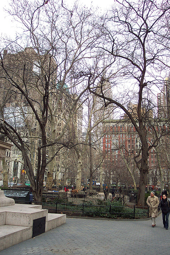
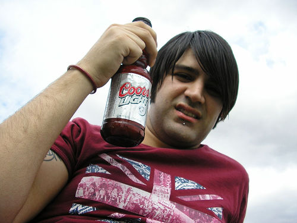
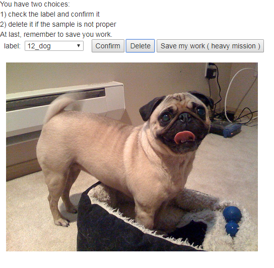

# 1.准备标注的数据 #

网上开源的图片数据集比较多，比较有名的是ImageNet。为了更快下载到，我这次用的是一个小一点的数据集， PASCAL：

wget http://host.robots.ox.ac.uk/pascal/VOC/voc2012/VOCtrainval_11-May-2012.tar

这个数据集可能更适合用来做物体识别和分割，因为图片比较复杂，往往包含多个物体。

下载下来解开tar包后，可以看到JPEGImages目录下有图片；ImageSets/Main目录下有对应图片的标注信息。

写一些简单的脚本提取自己想要使用的标签和图片用于后面的分类即可。

# 2.训练 #

通常我们可以把图片写入lmdb，caffe也支持直接从文件系统读取图片和标注信息的方式。使用type为ImageData的层即可：

    layer {
      name: "data"
      type: "ImageData"
      top: "data"
      top: "label"
      include {
        phase: TRAIN
      }
      transform_param {
        mirror: true
        crop_size: 227
        mean_value:104
        mean_value:117
        mean_value:107
      }
      image_data_param {
        #source: "/data/bisonliao/PASCAL_classify/data/train.txt"
        source: "/data/bisonliao/PASCAL_classify/data/train2.txt"
        batch_size: 128
        root_folder: ""
      }
    }

指定的source是一个文本文件，每一行一个样本，每个样本两个字段：图片文件路径和分类整数，用空格分开，例如：

    /data/bisonliao/PASCAL_classify/data/JPEGImages/2008_005902.jpg 14
    /data/bisonliao/PASCAL_classify/data/JPEGImages/2010_004998.jpg 1

mean_value，可以很认真的写个工具把所有图片的RGB三个通道的平均值算一下，但似乎意义不大，通常的做法可以使用ImageNet的统计均值，我这里是自己按经验写的三个值。

这里还是用的alexNet作为示例：

    https://github.com/BVLC/caffe/tree/master/models/bvlc_alexnet

上述链接的readme.md文档里给出了一个初步训练好的模型参数，可以加载作为网络参数的初始值，用于fine tunning，能够更快的完成模型训练:

    /data/caffe-1.0/build/tools/caffe train --solver=./solver.prototxt  --weights=./bvlc_alexnet.caffemodel 2>&1 |tee train.log

我的例子里有20个分类，直接使用了PASCAL的分类标注信息，发现训练的收敛情况并不好，准确率只能到62%左右，仔细检查样本，可以看到有很多图片质量并不好，例如下面这张分类为person的图片，人占图片的比例太小：

还有下面这张标注为bottle的图片，可能更适合person这个分类：

# 3.优化训练样本数据 #

为了得到更好的样本数据，我快速开发了一个简易的图片标注系统，基于tomcat+ajax+java servlet。 下面是这个系统的操作界面：

这个系统也有比较灵活的通用性，只需要修改web根目录下的data目录，保持data目录的结构规则：

    images：图片所在的目录
    labels.txt：分类的可读标签，从分类0到n排好序
    worker：该目录保存了标注人员待做的工作和已做的成果，例如：
        bisonliao.txt: 待工人bisonliao标注/确认的任务
        bisonliao_confirmed.txt:工人bisonliao已经完成的标注
        bisonliao_deleted.txt:工人bisonliao删除掉的不合适的样本

标注系统的代码，在bison的daydayup目录里面

工人bisonliao标注了一个多小时，完成了1000多张样本的标注，重新训练，准确率能达到83%

    I1229 18:21:38.385395  6241 solver.cpp:310] Iteration 3000, loss = 0.0150513
    I1229 18:21:38.385447  6241 solver.cpp:330] Iteration 3000, Testing net (#0)
    I1229 18:21:39.791846  6241 solver.cpp:397]     Test net output #0: accuracy = 0.83
    I1229 18:21:39.792026  6241 solver.cpp:397]     Test net output #1: loss = 0.814241 (* 1 = 0.814241 loss)
    I1229 18:21:39.792034  6241 solver.cpp:315] Optimization Done.
    I1229 18:21:39.792037  6241 caffe.cpp:259] Optimization Done.

另外网上也有高手说，可以对已有的训练图片做augment，即通过缩放、旋转等各种变换，来得到新的训练样本，进而扩充训练集，达到更好的训练结果。

# 4.调用训练好的模型来分类图片 #

这里不赘述了，可以参考

[我的另外一篇文章的第6小节](https://github.com/bisonliao/goodgoodstudy/blob/master/%E4%BD%BF%E7%94%A8BP%E7%BD%91%E7%BB%9C%E8%BF%9B%E8%A1%8C%E7%AE%80%E5%8D%95%E7%BB%93%E6%9E%84%E5%8C%96%E5%88%86%E7%B1%BB.md)

