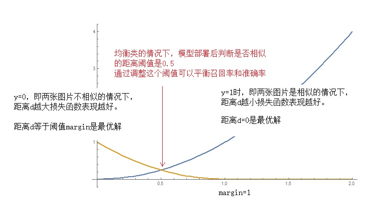

# 利用深度学习进行图片相似性比较

## 1、问题提出

有些场景需要对两张图片做相似性比较：

1. 人脸验证：输入人脸图片和人的ID，输出图片和ID是否匹配，实际上是比对数据库里的该ID的人脸图片和输入的图片是否相似。相比人脸识别的优势：
   1. 新加入人ID，不需要重新训练模型；
   2. 因为是1:1的人脸识别，不是1：n的，对准确率要求比较低；
   3. 对训练数据的数量要求较少，1两张图片就可以满足
2. 图片/视频的指纹库，防盗版。用于两张图片相似性比较的孪生网络，其隐含层包含了图片的特征摘要，利用这些摘要做倒排，可以建立图片、视频版权库，通过搜索比对特征摘要，达到防盗版、视频片段检索的目的。


一种常见的解决方案是孪生网络（siamese network）。之所以叫孪生，因为网络由多个类似的小网络组成，他们之间共享相同的参数。

孪生网络主要有两种形态：

1. 两输入的孪生网络：输入两张图片，生成特征摘要，特征摘要的距离大小满足对图片相似度的分类：相似or不相似
2. 三输入的三胞胎网络（triplet network）：输入三张图片，分别是anchor（参照图）、positive（与参照图相似的图）、negtive（与参照图不相似的图），输出对应的三个特征摘要f(A)/f(P)/f(N)，满足distance(f(A), f(P)) 比distance(f(A), f(N)) 小一定的阈值α。

还是借用吴恩达老师的图来示意：


## 2、试验一：手写数字比对

caffe源代码的目录下，有个examples/siamese例子，可以对手写数字进行两两比对，判断他们是不是同一个数字。

网络拓扑如下：


这个网络有如下特点：

1. 数据输入方面，把两张图片合并为一张2通道的图片，每张图片各使用一个通道。label还是一个整数（1表示相似，0表示不相似），存储在Datum这个message的label字段里。经过slice层将两个通道切割开，即slice层输入的blob是[batchsz,  2, 28, 28]，输入是两个blob：[batchsz,  1, 28,  28]
2. 参数共享：通过相同的参数名实现对应的层共享，例如conv2和conv2_p是共享参数的
3. 最后的特征摘要层是feat和feat_p，blob大小为[batchsz,  2]，即两个浮点数。
4. 损失函数层，我第一次见到：ContrastiveLoss类型

### 2.1 关于ContrastiveLoss

根据网友的blog：


下图是距离d和损失函数的关系，比较直观好理解：



### 2.2 训练与测试结果

数据用caffe提供的脚本，比较方便就准备好了。然后开始训练：

```
E:\DeepLearning\siamese\siamese>caffe.exe train --solver=.\mnist_siamese_solver.prototxt

I0430 20:44:57.489703 12096 solver.cpp:399]     Test net output #0: loss = 0.209038 (* 1 = 0.209038 loss)
I0430 20:44:57.524310 12096 solver.cpp:220] Iteration 0 (-2.00567e-35 iter/s, 0.684607s/1000 iters), loss = 0.234112
I0430 20:44:57.525387 12096 solver.cpp:239]     Train net output #0: loss = 0.234112 (* 1 = 0.234112 loss)
I0430 20:44:57.525387 12096 sgd_solver.cpp:105] Iteration 0, lr = 0.01, solver type:SGD
I0430 20:45:00.639927 12096 solver.cpp:332] Iteration 500, Testing net (#0)
I0430 20:45:00.809927 18424 data_layer.cpp:73] Restarting data prefetching from start.
I0430 20:45:00.819928 12096 solver.cpp:399]     Test net output #0: loss = 0.0346499 (* 1 = 0.0346499 loss)
I0430 20:45:03.242072  6792 data_layer.cpp:73] Restarting data prefetching from start.
I0430 20:45:03.555248 12096 solver.cpp:332] Iteration 1000, Testing net (#0)
I0430 20:45:03.727337 18424 data_layer.cpp:73] Restarting data prefetching from start.
I0430 20:45:03.727337 12096 solver.cpp:399]     Test net output #0: loss = 0.0273838 (* 1 = 0.0273838 loss)
I0430 20:45:03.737339 12096 solver.cpp:220] Iteration 1000 (161.173 iter/s, 6.20451s/1000 iters), loss = 0.0230628
I0430 20:45:03.737339 12096 solver.cpp:239]     Train net output #0: loss = 0.0230628 (* 1 = 0.0230628 loss)
...
I0430 20:49:16.570897 18424 data_layer.cpp:73] Restarting data prefetching from start.
I0430 20:49:16.580899 12096 solver.cpp:399]     Test net output #0: loss = 0.0188294 (* 1 = 0.0188294 loss)
I0430 20:49:17.464105  6792 data_layer.cpp:73] Restarting data prefetching from start.
I0430 20:49:18.990659 12096 solver.cpp:449] Snapshotting to binary proto file snapshot/mnist_siamese_iter_50000.caffemodel
I0430 20:49:19.010659 12096 sgd_solver.cpp:274] Snapshotting solver state to binary proto file snapshot/mnist_siamese_iter_50000.solverstate
I0430 20:49:19.020689 12096 solver.cpp:312] Iteration 50000, loss = 0.000393342
I0430 20:49:19.020689 12096 solver.cpp:332] Iteration 50000, Testing net (#0)
I0430 20:49:19.195806 18424 data_layer.cpp:73] Restarting data prefetching from start.
I0430 20:49:19.205806 12096 solver.cpp:399]     Test net output #0: loss = 0.0191147 (* 1 = 0.0191147 loss)
I0430 20:49:19.205806 12096 solver.cpp:317] Optimization Done.
I0430 20:49:19.205806 12096 caffe.cpp:260] Optimization Done.
```
从训练环节来看，损失函数收敛不错，但从测试环节来看，损失函数收敛的不是很好。

写个代码调用模型来感受一下：


直观上感觉模型的准确率不太高。

测试1万对图片，量化的准确率为78.34%。

[详细的代码见这里](code/siamese_net/UseTrainedModel.cpp)

[网络定义文件在这里](code/siamese_net/)

摘取部分代码如下：
```c
int classify(boost::shared_ptr<Net<float> > net, const Mat & img1, const Mat & img2)
{
	static float data_input[2][input_size][input_size];
	Mat image1, image2;
	
	if (img1.channels() != 1)
	{
		cvtColor(img1, image1, CV_BGR2GRAY);
	}
	else
	{
		image1 = img1;
	}
	if (img2.channels() != 1)
	{
		cvtColor(img2, image2, CV_BGR2GRAY);
	}
	else
	{
		image2 = img2;
	}
	Mat resized = image1.clone();
	cv::resize(resized, image1, cv::Size(input_size, input_size));
	resized = image2.clone();
	cv::resize(resized, image2, cv::Size(input_size, input_size));

	int width, height, chn;
	for (height = 0; height < input_size; ++height)
	{
		for (width = 0; width < input_size; ++width)
		{
			uchar v = image1.at<uchar>(height, width);
			data_input[0][height][width] = v / 256.0;
	
			v = image2.at<uchar>(height, width);
			data_input[1][height][width] = v / 256.0;
	
		}
	}
	
	Blob<float>* input_blobs = net->input_blobs()[0];
	//printf("inpupt blob x count:%d\n", input_blobs->count());
	switch (Caffe::mode())
	{
	case Caffe::CPU:
		memcpy(input_blobs->mutable_cpu_data(), data_input,
			sizeof(float) * input_blobs->count());
		break;
	case Caffe::GPU:
	
		cudaMemcpy(input_blobs->mutable_gpu_data(), data_input,
			sizeof(float) * input_blobs->count(), cudaMemcpyHostToDevice);

		break;
	default:
		LOG(FATAL) << "Unknown Caffe mode.";
	}
	net->Forward();
	
	int index = get_blob_index(net, "loss");
	boost::shared_ptr<Blob<float> > blob = net->blobs()[index];
	//printf("output blob index:%d,  y count:%d\n", index, blob->count());
	const float *blob_ptr = (const float *)blob->cpu_data();
	float y = *blob_ptr;
	
	if (y > 1)
	{
		return 0;
	}
	else
	{
		return 1;
	}
}
```

