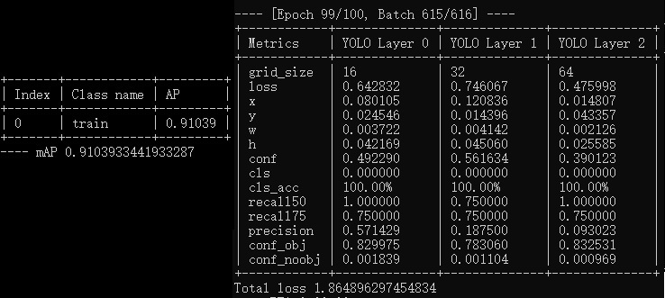
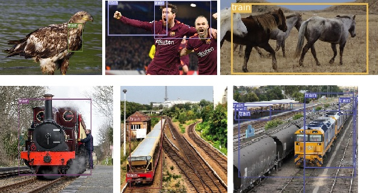
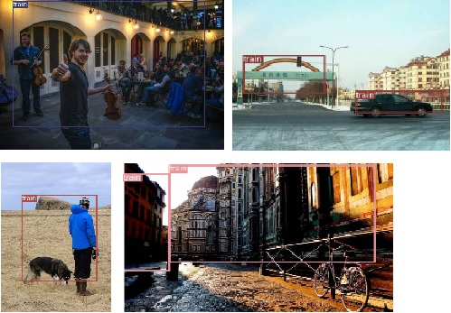
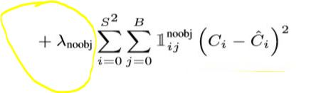
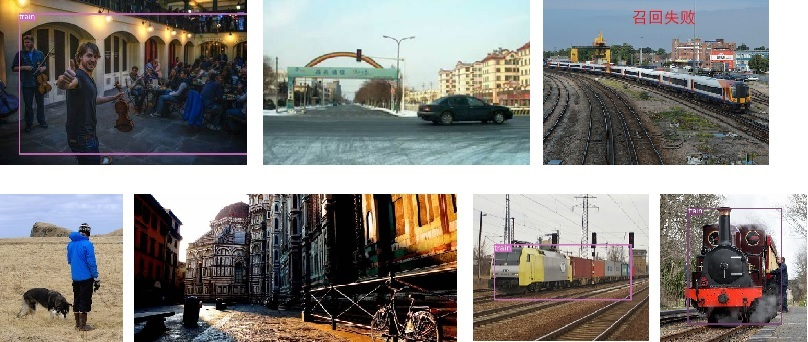

# 1 YOLO的基本原理

论文地址如下，应该是YOLOv1版本，文中没有特别说明就是基于此版本阐述：

```
https://arxiv.org/abs/1506.02640
```

简单的说：输入一张图片，经过一个全卷积网络，最后获得一个向量输出，里面有bbox和物体识别分类的预测。


## 1.1 预测向量的结构

YOLO是如何编码它的预测输出的呢？

输入图片被分割为 S X S 个grid/cell，每个出现在图片中的标注物体，有一个cell负责对它进行预测，这个cell就是物体中心所在的cell。

### 1.1.1 bbox的预测数据

每个cell会预测输出B个bbox位置（例如3个）、C个物体分类。每个bbox有5个预测分量：

```
(x, y, w, h, conf)
```

(x, y)是对bbox中心点坐标的预测，相对所属cell的左上角的坐标，取值范围 [0, 1]。如果这个bbox的中心不在该cell范围内，那么该bbox就不属于该cell。

(w, h)是bbox的宽度和高度，取值范围 [0, 1]，表示相对于图片尺寸的比例。

下面是一个例子，鹰这个物体的中心落在中间这个cell里面：


conf置信度这个字段这样计算：

```
conf = Pr(Object) * IOU(pred, truth) 
```

**疑问：Pr(obj)应该是网络的输出吧？**

即，如果没有物体的中心落在该cell里面，则Pr(Object)输出0，那么confidence为0；否则confidence等于预测的bbox和标注的bbox的IoU值（两个矩形相交面积比并集面积）。

如果我没有理解错的话，可以看出：只有那些 “有幸” 被ground truth 标注物体的中心点砸中的cell（的预测输出）才会被关注。

所以，对于bbox的预测，输出预测值的个数为：

```
 S x S x B * 5 
```

### 1.1.2 物体识别的分类预测

类似物体识别， 每个cell会输出C个分类预测值。与bbox预测信息同样的，只有被标注物体的中心砸中的幸运cell的分类预测值才会被关注。每个cell值预测一组分类信息，与bbox个数无关。预测值的个数：

```
 S x S x C 
```

下面这种图片来自另外一篇文章和不同的YOLO版本，所以符号有点不一致，但不影响理解：


ground truth标注一条狗（黄框框），黄框框的中心落在这个红色cell里，虽然每个cell都有输出预测信息，但这个训练样本中只有红色cell的输出被关注。这里讨论的yolo版本，物体识别p1/p2.../pc应该在1.0版本里不是每个bbox都有，不应该乘以B。v3版本是每个bbox都有。


## 1.2 网络结构

网络结构就是普通常见的卷积网络，由大量的卷积层和max pooling层叠加，最后跟两个全连接层。YOLO v3还有类似残差网络的中间短路的方式，且有多种cell划分方式来组合检测：13 X 13, 26 X 26, 52 X 52。


上图中的好几个卷积核写在一起是从上到下一层一层顺序传递，没有其他特殊的意思。

## 1.3  损失函数

损失函数分四部分，见下面红蓝黄绿划线：


式中的几个lamda就是几个常数，不用太关注。

那个像黑体 **1** 带上标为obj和下标为i,j的特殊符号这样来理解：

- 如果有标注物体的中心落在cell #i  里面，且该cell的第j个bbox对其负责，那么这个特殊符号就取值为1
- 其他cell#ij 的特殊符号都取值为0

那怎么知道该cell的哪个bbox对该标注物体 “负责”呢？论文如是说：

```
YOLO predicts multiple bounding boxes per grid cell. At training time we only want one bounding box predictor to be responsible for each object. We assign one predictor to be “responsible” for predicting an object based on which prediction has the highest current IOU with the ground truth.
```

也就是说该cell的B个bbox中，谁与ground truth的bbox的IoU值高，哪个就对该标注物体负责。

上标是noobj的符号刚好与此相反。看来也不只是关注被砸中的幸运cell哈。

对于w / h，为什么要取平方根呢，是为了避免大尺寸的bbox的偏差值也大，对损失函数有过大的影响，所以取平方根

**疑问：C hat（confidence）的truth值是什么？1.0吗？**

## 1.4 锚定

YOLO v1版本相对比较简单，YOLO v2和 v3版本引入了anchor box。

网络预测的bbox的宽和高会导致不稳定的梯度，一种应对方法是使用预先定义的bbox进行锚定，即Anchor Boxes 。

t 是网络预测的bbox的尺寸和位置，经过锚定后的尺寸和位置数据 b，才用于损失函数计算和梯度计算。锚定转换过程如下，左边是公式，右边是图解：


 tx, ty, tw, th 是网络的输出. cx cy cell的左上角坐标. pw ph是预设的anchor box的宽高。

可以看出tx, ty经过sigmoid函数后，会归一化为[0, 1]。


# 2 实操

有个牛人实现了：

```
https://github.com/eriklindernoren/PyTorch-YOLOv3
```

下载下来按照指引能够训练模型、检测物体。

遇到好多好多坑，基本上把issues里面的问题都踩了一遍。COCO数据集也坑爹，里面的class id居然不是连续的，80个分类编码了90来个整数。光这个问题就折腾了一天。

训练计算量巨大，费了很多电和时间。

## 3.1 只训练一个物体的检测

coco train2014目录下2464张火车图片， 其中2364张作为训练集，其中100张作为valid集。训练8个小时后，loss值从200多收敛到2左右，mAP提升到91%：

```
sh create_custom_model.sh 1
mv yolov3-custom.cfg yolov3-bison.cfg

python train.py --model_def config/yolov3-bison.cfg --data_config=config/bison.data --batch_size=4
```




```
python detect.py --model_def config\yolov3-bison.cfg --class_path=data\bison\classes.names --weights_path=checkpoints\yolov3_ckpt_99.pth
```

效果并不好，误检率很高，召回率很好：



是怎么回事呢？ 继续训练？

又继续训练了100个epoch， loss下降到1以下，偶尔会上到1.0以上。上面的鸟、球员、马没有被误检了，但是有其他东西还是被检测为火车，心情很差：



进一步的，我通过调大损失函数里的一个系数，增大对“假阳性”（不是火车但识别为火车）的惩罚，这样召回率确实会下降一些，但照顾了精度：



```
models.py : line # 188

self.noobj_scale = 1000 # original value is 100, bison increase it to reduce misdetect
```



## 3.2 自己从头实现

[][自己实现的代码]

[自己实现的代码](code/yolo/MyYOLOv1.py)

参考文档：

```
How to implement a YOLO (v3) object detector from scratch in PyTorch: Part 1 ：
https://blog.paperspace.com/how-to-implement-a-yolo-object-detector-in-pytorch/

You Only Look Once: Unified, Real-Time Object Detection：
https://arxiv.org/abs/1506.02640

Understanding YOLO：
https://hackernoon.com/understanding-yolo-f5a74bbc7967
```

