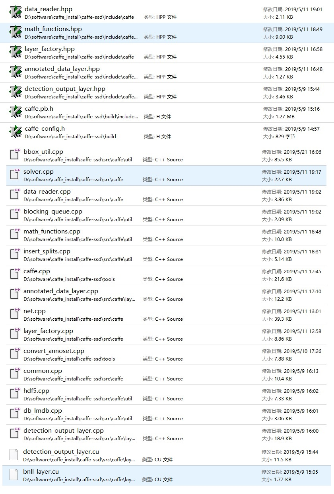
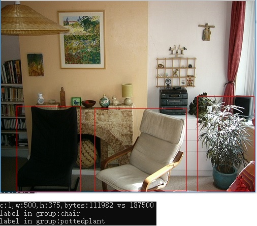
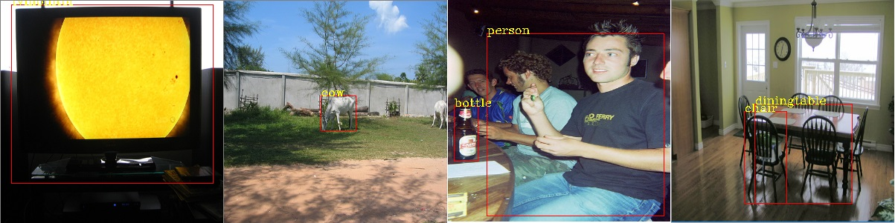

ssd的官网：

https://github.com/weiliu89/caffe/tree/ssd

ssd对windows环境不友好，我最终也没有完全搞定，先记录下来一些进展。

官网上的指引应该说还是写得很详细的，作者的工程习惯也很好。由于训练用的数据结构和网络结构都比较复杂，所以作者用了大量python和shell脚本来生成数据和网络prototxt文件：

1. create_list.sh和create_data.sh生成训练数据和test_name_size.txt，后者据说是用来存储测试用图片文件名和大小
2. ssd_pascal.py 脚本生成 prototxt文件，并可以拉起caffe.exe  train命令行

## 1、编译安装caffe-ssd

首先是在windows上安装caffe-ssd 

因为前面有安装caffe-windows的经验，我以为会比较容易搞定，无非就是

1. 建立一个build目录，把上次的CMakeCache.txt文件拷贝到build目录里，这样就不用再重复设置繁琐的编译环境。
2. 拉起cmake-gui工具configure\generate
3. 使用vs2015编译caffe.sln解决方案

但是我错了！很折腾，修改了很多代码，但最终还是成功编译出caffe-ssd.exe可执行程序，简单的mnist项目验证也ok。

但pycaffe子项目编译总报错，所以python接口使用上应该会有问题。

```
_caffe.obj : error LNK2019: 无法解析的外部符号 "class caffe::Solver<float> const volatile * __cdecl boost::get_pointer...
```

下面是修改的文件列表：



其中最坑的是annotated_data_layer.hpp用来防止多次包含的宏名字写错了，#ifndef CAFFE_DATA_LAYER_HPP_

导致编译莫名其妙错误，折腾大半天。

### 2、生成训练数据

我装了个cygwin，希望可以执行修改修改后的的create_list.sh和create_data.sh。cygwin下，可以通过/cygdrive/d/a/b这样的路径来访问原生windows下的 d:\a\b 文件

进入cygwin，执行修改过的create_list.sh，因为不涉及python，所以这一步成功了。

但create_data.sh涉及执行python脚本，那就牵扯到是用windows原生python还是cygwin里python的问题，我尝试了一下，没有能搞定。

仔细观察，发现这个脚本其实主要就是调caffe-ssd的convert_annoset这个命令行工具。我写了个bat脚本，成功生成了lmdb文件：

```
convert_annoset ^
 --anno_type=detection^
 --label_type=xml^
 --label_map_file=D:\software\caffe_install\caffe-ssd\data\VOC0712\labelmap_voc.prototxt^
 --check_label=true^
 --min_dim=0^
 --max_dim=0^
 --resize_height=0^
 --resize_width=0^
 --backend=lmdb^
 --shuffle=false^
 --check_size=false^
 --encode_type=jpg^
 --encoded=false^
 --gray=true^
 E:\DeepLearning\data\VOCdevkit\ D:\software\caffe_install\caffe-ssd\data\VOC0712\val.txt E:\DeepLearning\ssd\test_lmdb

convert_annoset ^
 --anno_type=detection^
 --label_type=xml^
 --label_map_file=D:\software\caffe_install\caffe-ssd\data\VOC0712\labelmap_voc.prototxt^
 --check_label=true^
 --min_dim=0^
 --max_dim=0^
 --resize_height=0^
 --resize_width=0^
 --backend=lmdb^
 --shuffle=false^
 --check_size=false^
 --encode_type=jpg^
 --encoded=false^
 --gray=true^
 E:\DeepLearning\data\VOCdevkit\ D:\software\caffe_install\caffe-ssd\data\VOC0712\trainval.txt E:\DeepLearning\ssd\train_lmdb
```

### 3、生成prototxt文件

官网提供了ssd_pascal.py这样的脚本来生成prototxt文件，我试了一下总报错，提示什么xxx库不能import啥的，可能和pycaffe编译失败有关。我对python又一知半解，所以放弃。

在网上好不容易找到了一个小伙贴的ssd的train.prototxt文件，拿下来改改，可以跑起来。

但遇到两个问题：

1. 不能直接修改最后的分类数目，否则会报错。我理解是最后loss层的各bottom输入的blob尺寸不一致。需要同样的修改后向的相关层的输出尺寸，研究了一下未果，这应该也是为什么作者用了一个python脚本来产生prototxt文件的原因，牵一发动全身。
2. 中途中断的caffe-ssd.exe train命令，生成的solvestate文件，下次启动的使用，通过--snapshot参数加载不起来。原因未知

[好心人提供的prototxt文件在这里](code/ssd/)

### 4、训练

执行命令：

```
caffe-ssd.exe train --solver=solve.prototxt --weights=vgg16.caffemodel
```

输出如下：

```
I0522 09:04:55.152274 11336 caffe.cpp:274] Finetuning from vgg16.caffemodel
I0522 09:04:55.262374 11336 caffe.cpp:370] Starting Optimization
I0522 09:04:55.262374 11336 solver.cpp:295] Solving VGG_VOC0712_SSD_300x300_train
I0522 09:04:55.262374 11336 solver.cpp:296] Learning Rate Policy: step
I0522 09:04:56.352274 11336 solver.cpp:244] Iteration 0, loss = 21.3669
I0522 09:04:56.352274 11336 solver.cpp:260]     Train net output #0: mbox_loss = 21.2487 (* 1 = 21.2487 loss)
I0522 09:04:56.352274 11336 sgd_solver.cpp:138] Iteration 0, lr = 0.0004
I0522 09:06:29.354743 11336 solver.cpp:244] Iteration 100, loss = 8.80909
I0522 09:06:29.354743 11336 solver.cpp:260]     Train net output #0: mbox_loss = 9.36699 (* 1 = 9.36699 loss)
I0522 09:06:29.354743 11336 sgd_solver.cpp:138] Iteration 100, lr = 0.0004
I0522 09:08:03.869545 11336 solver.cpp:244] Iteration 200, loss = 8.03628
I0522 09:08:03.869545 11336 solver.cpp:260]     Train net output #0: mbox_loss = 7.82754 (* 1 = 7.82754 loss)
I0522 09:08:03.869545 11336 sgd_solver.cpp:138] Iteration 200, lr = 0.0004
I0522 09:09:37.741247 11336 solver.cpp:244] Iteration 300, loss = 8.08153
I0522 09:09:37.741247 11336 solver.cpp:260]     Train net output #0: mbox_loss = 6.99807 (* 1 = 6.99807 loss)
......这中间经过了漫长的5小时
I0522 14:17:52.310133 11336 solver.cpp:244] Iteration 19700, loss = 6.16242
I0522 14:17:52.310133 11336 solver.cpp:260]     Train net output #0: mbox_loss = 5.73436 (* 1 = 5.73436 loss)
I0522 14:17:52.310133 11336 sgd_solver.cpp:138] Iteration 19700, lr = 0.0004
I0522 14:19:27.979728 11336 solver.cpp:244] Iteration 19800, loss = 5.91935
I0522 14:19:27.979728 11336 solver.cpp:260]     Train net output #0: mbox_loss = 6.88547 (* 1 = 6.88547 loss)
I0522 14:19:27.979728 11336 sgd_solver.cpp:138] Iteration 19800, lr = 0.0004
I0522 14:21:03.791196 11336 solver.cpp:244] Iteration 19900, loss = 5.81281
I0522 14:21:03.791196 11336 solver.cpp:260]     Train net output #0: mbox_loss = 4.53011 (* 1 = 4.53011 loss)
I0522 14:21:03.791196 11336 sgd_solver.cpp:138] Iteration 19900, lr = 0.0004
I0522 14:22:38.869782 11336 solver.cpp:600] Snapshotting to binary proto file snapshot/ssd_iter_20000.caffemodel
I0522 14:22:39.959810 11336 sgd_solver.cpp:307] Snapshotting solver state to binary proto file snapshot/ssd_iter_20000.solverstate
I0522 14:22:40.459780 11336 solver.cpp:333] Iteration 20000, loss = 6.18779
I0522 14:22:40.459780 11336 solver.cpp:338] Optimization Done.
I0522 14:22:40.459780 11336 caffe.cpp:373] Optimization Done.
```

经过5个小时左右的训练，loss不怎么收敛，在6左右晃荡。

### 5、标注数据的结构

caffe原有的Datum结构不够用来表示ssd需要的标注信息，所以caffe-ssd扩展了标注数据的结构：

```
// An extension of Datum which contains "rich" annotations.
message AnnotatedDatum {
  enum AnnotationType {
    BBOX = 0;
  }
  optional Datum datum = 1;
  // If there are "rich" annotations, specify the type of annotation.
  // Currently it only supports bounding box.
  // If there are no "rich" annotations, use label in datum instead.
  optional AnnotationType type = 2;
  // Each group contains annotation for a particular class.
  repeated AnnotationGroup annotation_group = 3;
}

// Group of annotations for a particular label.
message AnnotationGroup {
  optional int32 group_label = 1;
  repeated Annotation annotation = 2;
}

// Annotation for each object instance.
message Annotation {
  optional int32 instance_id = 1 [default = 0];
  optional NormalizedBBox bbox = 2;
}

// The normalized bounding box [0, 1] w.r.t. the input image size.
message NormalizedBBox {
  optional float xmin = 1;
  optional float ymin = 2;
  optional float xmax = 3;
  optional float ymax = 4;
  optional int32 label = 5;
  optional bool difficult = 6;
  optional float score = 7;
  optional float size = 8;
}
```

还是比较直观：

1. 图片数据存储在datum的data字段里，可以是压缩的格式，例如jpg。是否压缩取决于生成LMDB的时候convert_annoset工具的参数设置
2. 每个bbox的标签存储在group_label 里，相同label的bbox被聚类成一个group
3. bbox的x y坐标都归一化为0~1 的浮点数。

详细的可以见下面展示lmdb里AnnotatedDatum信息的c代码：

```c
void check_lmdb(const char * db_path)
{
	MDB_env *env;
	MDB_txn * txn;
	MDB_dbi dbi;
	MDB_cursor * cursor;
	int iRet;
	//这里省略打开lmdb数据库的代码
	MDB_val key, data;
	MDB_cursor_op op = MDB_FIRST;
	int i;
	cv::namedWindow("check lmdb", cv::WINDOW_AUTOSIZE);


	for (i = 0; i < 10000; i++)
	{
		if (i > 0) { op = MDB_NEXT; }
		if (iRet = mdb_cursor_get(cursor, &key, &data, op))
		{
			fprintf(stderr, "mdb_cursor_get() failed, iRet=%d\n", iRet);
			break;
		}
		else
		{
			string k((const char*)key.mv_data, (size_t)key.mv_size);
			string v((const char*)data.mv_data, (size_t)data.mv_size);
			AnnotatedDatum record;
			record.ParseFromString(v);
			int width, height, channel;
			
			width = record.datum().width();
			height = record.datum().height();
			channel = record.datum().channels();
			const string & datastr = record.datum().data();
			const uchar * data_ptr = (const uchar*)(datastr.c_str());
			printf("c:%d,w:%d,h:%d,bytes:%d vs %d \n", channel, width, height, datastr.length(), width*height);
	
			std::vector<uchar> vv(datastr.begin(), datastr.end());
	// load picture
			cv::Mat img = imdecode(vv, CV_LOAD_IMAGE_COLOR);//解码jpg的图片数据
		
			//draw annotation
			int grp_num = record.annotation_group_size();
			int i;
			for (i = 0; i < grp_num; ++i)
			{
				const AnnotationGroup & grp = record.annotation_group(i);
				int  label = grp.group_label();
				printf("label in group:%s\n", g_labels[label].c_str());
				int anno_num = grp.annotation_size();
				int j;
				for (j = 0; j < anno_num; ++j)
				{
					const NormalizedBBox &  bbox = grp.annotation(j).bbox();
					int x = bbox.xmin() * width;
					int y = bbox.ymin() * height;
					int w = (bbox.xmax() - bbox.xmin())*width;
					int h = (bbox.ymax() - bbox.ymin())*height;
					cv::Rect rec(x,y,w,h);
					
					cv::rectangle(img, rec, cv::Scalar(0, 0, 255));
					//printf("label in bbox:%s\n", g_labels[bbox.label()].c_str()); // label in bbox is invalid
	
				}
	
			}
			cv::imshow("check lmdb", img);
			cv::waitKey(0);
		}
		
	}
	mdb_cursor_close(cursor);
	mdb_dbi_close(env, dbi);
	mdb_env_close(env);
}
```

[完整代码在这里](code/ssd/ShowAnnotationInLmdb.cpp)

展示效果如下：



### 6、模型调用

caffe-ssd的代码目录examples/ssd下有个文件：ssd_detect.cpp是原作者用来演示如何调用模型的。

[模型的deploy.prototxt文件在这里](code/ssd/deploy2.prototxt)

也是好心人帮我用ssd_pascal.py生成的。

我其实对ssd网络的细节一知半解，重点是抓住最后一层DetectionOutputLayer的输出blob，它的形状是[1, 1, n, 7]，n是检测到的bbox的个数，每个bbox信息是7个浮点数，分别表示图片id、标签、置信度以及4个坐标。

所以模型调用输出结果的时候，有这样的代码：

```c
net->Forward();
Blob<float>* result_blob = net->output_blobs()[0];
// shape is [ 1, 1, num_det, 7], 输出每行7个数，分别表示图片id、标签、置信度以及4个坐标
const float* result = result_blob->cpu_data(); 
const int num_det = result_blob->height();
printf("detect %d bbox\n", num_det);
for (int k = 0; k < num_det; ++k) {
	if (result[0] == -1) {
		// Skip invalid detection.
		result += 7;
		continue;
     }
	float xmin = *(result + 3);
	float ymin = *(result + 4);
	float xmax = *(result + 5);
	float ymax = *(result + 6);

	int x = xmin * input_size;
	int y = ymin * input_size;
	int w = (xmax - xmin)*input_size;
	int h = (ymax - ymin)*input_size;
	cv::Rect rec(x, y, w, h);
	cv::rectangle(img2, rec, cv::Scalar(0, 0, 255));
	
	result += 7;
}
```

[模型调用的c代码在这里](code/ssd/UseTrainedModel.cpp)

用我前面5个小时迭代2万次的那个模型来试一下，效果意料之中的差：



后续改进计划：

0、试一下原作者已经训练好的模型
1、增加数据和迭代次数
2、减少分类
3、加入test看看准确率