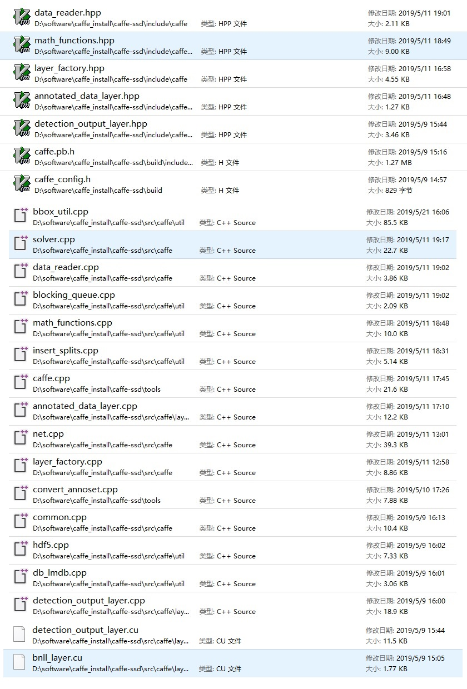

ssd的官网：

https://github.com/weiliu89/caffe/tree/ssd

ssd对windows环境不友好，我最终也没有完全搞定，先记录下来一些进展。

官网上的指引应该说还是写得很详细的，作者的工程习惯也很好。由于训练用的数据结构和网络结构都比较复杂，所以作者用了大量python和shell脚本来生成数据和网络prototxt文件：

1. create_list.sh和create_data.sh生成训练数据和test_name_size.txt，后者据说是用来存储测试用图片文件名和大小
2. ssd_pascal.py 脚本生成 prototxt文件，并可以拉起caffe.exe  train命令行

## 编译安装caffe-ssd

首先是在windows上安装caffe-ssd 

因为前面有安装caffe-windows的经验，我以为会比较容易搞定，无非就是

1. 建立一个build目录，把上次的CMakeCache.txt文件拷贝到build目录里，这样就不用再重复设置繁琐的编译环境。
2. 拉起cmake-gui工具configure\generate
3. 使用vs2015编译caffe.sln解决方案

但是我错了！很折腾，修改了很多代码，但最终还是成功编译，简单的mnist项目验证也ok。

下面是修改的文件列表：



其中最坑的是annotated_data_layer.hpp用来防止多次包含的宏名字写错了，#ifndef CAFFE_DATA_LAYER_HPP_

导致编译莫名其妙错误，折腾大半天。

### 生成训练数据

我装了个cygwin，希望可以执行修改修改后的的create_list.sh和create_data.sh。cygwin下，可以通过/cygdrive/d/a/b这样的路径来访问原生windows下的 d:\a\b 文件

进入cygwin，执行修改过的create_list.sh，因为不涉及python，所以这一步成功了。

但create_data.sh涉及执行python脚本，那就牵扯到是用windows原生python还是cygwin里python的问题，我尝试了一下，没有能搞定。

仔细观察，发现这个脚本其实主要就是调caffe-ssd的convert_annoset这个命令行工具。我写了个bat脚本，成功生成了lmdb文件：

```
convert_annoset ^
 --anno_type=detection^
 --label_type=xml^
 --label_map_file=D:\software\caffe_install\caffe-ssd\data\VOC0712\labelmap_voc.prototxt^
 --check_label=true^
 --min_dim=0^
 --max_dim=0^
 --resize_height=0^
 --resize_width=0^
 --backend=lmdb^
 --shuffle=false^
 --check_size=false^
 --encode_type=jpg^
 --encoded=false^
 --gray=true^
 E:\DeepLearning\data\VOCdevkit\ D:\software\caffe_install\caffe-ssd\data\VOC0712\val.txt E:\DeepLearning\ssd\test_lmdb

convert_annoset ^
 --anno_type=detection^
 --label_type=xml^
 --label_map_file=D:\software\caffe_install\caffe-ssd\data\VOC0712\labelmap_voc.prototxt^
 --check_label=true^
 --min_dim=0^
 --max_dim=0^
 --resize_height=0^
 --resize_width=0^
 --backend=lmdb^
 --shuffle=false^
 --check_size=false^
 --encode_type=jpg^
 --encoded=false^
 --gray=true^
 E:\DeepLearning\data\VOCdevkit\ D:\software\caffe_install\caffe-ssd\data\VOC0712\trainval.txt E:\DeepLearning\ssd\train_lmdb
```

### 生成prototxt文件

官网提供了ssd_pascal.py这样的脚本来生成prototxt文件，我试了一下总报错，提示什么xxx库不能import啥的。我对python又一知半解，所以放弃。

在网上好不容易找到了一个小伙贴的ssd的train.prototxt文件，拿下来改改，可以跑起来。

但遇到两个问题：

1. 不能直接修改最后的分类数目，否则会报错。我理解是最后loss层的各bottom输入的blob尺寸不一致。需要同样的修改后向的相关层的输出尺寸，研究了一下未果，这应该也是为什么作者用了一个python脚本来产生prototxt文件的原因，牵一发动全身。
2. 中途中断的caffe-ssd.exe train命令，生成的solvestate文件，下次启动的使用，通过--snapshot参数加载不起来。原因未知

[好心人提供的prototxt文件在这里](code/ssd/)

### 训练

执行命令：

```
caffe-ssd.exe train --solver=solve.prototxt --weights=vgg16.caffemodel
```

输出如下：

```
I0522 09:04:55.152274 11336 caffe.cpp:274] Finetuning from vgg16.caffemodel
I0522 09:04:55.262374 11336 caffe.cpp:370] Starting Optimization
I0522 09:04:55.262374 11336 solver.cpp:295] Solving VGG_VOC0712_SSD_300x300_train
I0522 09:04:55.262374 11336 solver.cpp:296] Learning Rate Policy: step
I0522 09:04:56.352274 11336 solver.cpp:244] Iteration 0, loss = 21.3669
I0522 09:04:56.352274 11336 solver.cpp:260]     Train net output #0: mbox_loss = 21.2487 (* 1 = 21.2487 loss)
I0522 09:04:56.352274 11336 sgd_solver.cpp:138] Iteration 0, lr = 0.0004
I0522 09:06:29.354743 11336 solver.cpp:244] Iteration 100, loss = 8.80909
I0522 09:06:29.354743 11336 solver.cpp:260]     Train net output #0: mbox_loss = 9.36699 (* 1 = 9.36699 loss)
I0522 09:06:29.354743 11336 sgd_solver.cpp:138] Iteration 100, lr = 0.0004
I0522 09:08:03.869545 11336 solver.cpp:244] Iteration 200, loss = 8.03628
I0522 09:08:03.869545 11336 solver.cpp:260]     Train net output #0: mbox_loss = 7.82754 (* 1 = 7.82754 loss)
I0522 09:08:03.869545 11336 sgd_solver.cpp:138] Iteration 200, lr = 0.0004
I0522 09:09:37.741247 11336 solver.cpp:244] Iteration 300, loss = 8.08153
I0522 09:09:37.741247 11336 solver.cpp:260]     Train net output #0: mbox_loss = 6.99807 (* 1 = 6.99807 loss)
```

loss不怎么收敛，在8左右晃荡。


希望我下来能够鼓起勇气，深入研究清楚，把ssd搞定