# 1.引子 #
使用深度学习进行分类，是比较常见的一类应用，还有一类应用就是回归，对图像进行超分辨率，是回归中比较典型的例子

有比较多网络用于超分辨率，SRCNN是其中一个，本文记录作者通过SRCNN来体验深度学习的回归类应用的浅显过程。 SRCNN详细可见：

http://mmlab.ie.cuhk.edu.hk/projects/SRCNN.html

# 2.模型原理 #
SRCNN通过深度学习训练出来一个模型，该模型输入33\*33大小的（模糊）图片像素，输出21\*21大小的（清晰）图片像素。 

SRCNN对于一个低分辨率图像，先使用双三次（bicubic）插值将其放大到目标大小，再通过上述模型的计算，得到的结果作为高分辨率图像输出。

训练和测试用的标注样本也是这么来的： 一张清晰的图片O，通过先缩小再拉升的方式，获得一张模糊的图片B,提取模糊图片B的33\*33大小的区域作为模型的输入，提取清晰图片O的对应的21\*21的区域作为标注结果

SRCNN用到的网络比较简单，三层卷积，卷积核大小为9\*9、1\*1和5\*5。

相比分类，回归的损失函数是不一样的。回归用的是EuclideanLoss类型的损失函数，计算的是各个输出与标注之间的方差之和，分类用的是SOFTMAX_LOSS类型的损失函数。

# 3.模型训练 #

[官方训练包下载](http://mmlab.ie.cuhk.edu.hk/projects/SRCNN.html)

[另存一份的下载](code/srcnn/SRCNN.zip)

从SRCNN的官网下载caffe下的训练包，使用matlab执行generate_train.m和generate_test.m即可生成训练集和测试集，可以看到这两个脚本还算比较简单，就是扫描图片区域，生成标注好的样本，存储到HDF5里

	clear;close all;
	%% settings
	folder = 'Train\batch4';
	savepath = 'train4.h5';
	size_input = 33;  %%网络的输入大小
	size_label = 21;  %%网络的输出大小
	scale = 3;        %%超分倍数
	stride = 14;      %%扫描窗移动的步长
	
	%% initialization
	data = zeros(size_input, size_input, 1, 1);
	label = zeros(size_label, size_label, 1, 1);
	padding = abs(size_input - size_label)/2;
	count = 0;
	
	%% generate data
	filepaths = dir(fullfile(folder,'*.bmp'));
	   
	for i = 1 : length(filepaths)
		
		%%读取一张图片，灰度化，并将像素值转化为浮点
		image = imread(fullfile(folder,filepaths(i).name));
		image = rgb2ycbcr(image);
		image = im2double(image(:, :, 1));
		
		im_label = modcrop(image, scale); %%裁剪一下，使得宽高都是scale的倍数
		[hei,wid] = size(im_label);
		%%进行缩放，形成模糊的图片，
		im_input = imresize(imresize(im_label,1/scale,'bicubic'),[hei,wid],'bicubic');
	
		for x = 1 : stride : hei-size_input+1
			for y = 1 :stride : wid-size_input+1
				
				%%提取输入
				subim_input = im_input(x : x+size_input-1, y : y+size_input-1);
				%%提取标注结果，也就是模型的输出
				subim_label = im_label(x+padding : x+padding+size_label-1, y+padding : y+padding+size_label-1);
	
				count=count+1;
				%%写到内存数据结构里
				data(:, :, 1, count) = subim_input;
				label(:, :, 1, count) = subim_label;
			end
		end
	end

生成训练集和测试集后，即可执行caffe命令进行模型训练

# 4.模型的使用 #

[调用srcnn模型的c++例子](code/srcnn/sc.cpp)

[调用srcnn模型的makefile](code/srcnn/makefile)

过程中主要使用opencv的系列函数对图片进行操作，使用caffe的库函数使用训练好的模型。

节选一段代码：
	
    //对图片img的局部区域（i,j）进行超分，存储到img2里
    void super_resolution(boost::shared_ptr<Net<float> > net,
    		cv::Mat & img,  cv::Mat & img2,
    		int i, int j)
    {
    		float data_input[input_size][input_size];
    
    		//挨个像素填写输入项
    		int sub_i, sub_j;
    		for (sub_i = 0; sub_i < input_size; ++sub_i)
    		{
    				for (sub_j = 0; sub_j < input_size; ++sub_j)
    				{
    						data_input[sub_i][sub_j] = (float)(img.at<uchar>(i+sub_i, j+sub_j));
    				}
    		}
    
    		caffe_forward(net, (float*)data_input);//网络向前传播，计算出输出
    		int index = get_blob_index(net, "conv3");//获取conv3层的输出值
    		boost::shared_ptr<Blob<float> > blob = net->blobs()[index];
    		unsigned int num_data = blob->count(); 
    		const float *blob_ptr = (const float *) blob->cpu_data();
    
    		//逐项写入到img2
    		for (sub_i = 0; sub_i < label_size; ++sub_i)
    		{
    				for (sub_j = 0; sub_j < label_size; ++sub_j)
    				{
    						img2.at<uchar>(i+sub_i, j+sub_j) = (unsigned char)(blob_ptr[sub_i*label_size+sub_j]);
    				}
    		}
    
    }


代码比较简单，就不赘述，直接下载上面的代码看即可

下面是作者的效果图，可以看出效果不太好，相比bicubic，没有明显的优势。应该是我哪里姿势不对

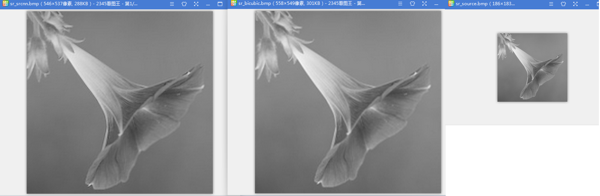

# 5.tips #

* 如果用于训练的图片比较多，matlab脚本生成的HDF5文件会比较大，可以分批生成多个HDF5文件，caffe支持在train.txt和 test.txt文件里指定多个HDF5文件
* 如果不想在windows下使用matlab，可以尝试在linux下安装octave软件（一个比较有名的数学工具，兼容matlab脚本），安装的时候需要装全octave的pkg，在opensuse下，用yum search all octave命令可以找到所有的包，全部都安装，也可以在octave交互模式下输入 pkg install -forge <pkgname>的方式来安装。 但是：octave执行起来真的好慢好慢，对于大量的图片处理是不合适的
* 有高手同事说，训练集准备，需要做一下扩充，把一些图片进行变换（90\*n的旋转、0.6~0.9倍的缩小两者的组合）后补充到Train目录下再用generate_train.m脚本处理，否则训练出来的模型效果不好，只是下采样的逆。 我直观上不太能理解，但我先记住这个结论吧。
* 基于已有的模型做精细化调教（finetune），使用命令行参数--weights=....caffemodel文件，如果是训练中断后需要做“断点续练”，那么使用命令行参数--snapshot=....solverstat文件

# 6.几个概念 #

神经网络里，有几个概念：

* **batch\_size**：分训练的batch\_size和测试的batch\_size。训练/测试的时候，不是每次一个样本，也不是每次都把完整训练/测试集都拿来测试/训练，而是一次取batch\_size个样本，来进行一次传播（一次传播=一次前向传播+一次后向传播）。 batch\_size越大，效率约高，但占用内存越大。
* **前向传播**：取出batch\_size个样本，对每个样本输入**X**  , 经过与各层网络的weight、bias值乘加运算，得到**Y**，与样本标注的分类/回归值**YY** 对比获得差值**d** ，batch\_size个样本的差值**d** 加起来，得到损失函数**L**
* **后向传播**：损失函数**L**是**Y**和**YY**的函数，而**Y**是最后一层weight和bias参数的函数，也就是说损失函数是最后一层weight和bias参数的函数，要使得损失函数最小，就求偏导的方式，找到损失函数的梯度，微调weight和bias参数； 同理，函数关系继续往上一层网络的weight和bias传播，可以用梯度下降的方式调整倒数第二层的weight和bias参数，如此反复，最后完成第一层网络的weight和bias参数的微调，这是一次后向传播
* **iteration**: 输入batch\_size个训练样本，完成一次前向传播+后向传播，就是一次iteration
* **epoch**： 执行n次iteration，将训练样本恰好全部的训练一次，叫做一次epoch，通常我们一次epoch就做一次测试，所以通常solver.prototxt文件里的test\_interval乘以训练的batch\_size就等于训练集的大小，而test\_iter乘以测试的batch\_size就等于测试集的大小
* **max\_iter**： 通过solver.prototxt文件里的max_iter参数，可以指定最多训练多少个iteration才终止
* **激活函数**: 如果不引入sigmoid这样的激活函数，那么网络中的多个层实际上等同于只有一层，因为最后层的某项输出就等于w1\*x1+w2\*x2+...+w0，各层的参数会发生退化与合并。 同时可以注意到：激活函数的引入，使得向后传播求变得复杂了，而且不同激活函数的导数值对后向传播效率有影响。

关于激活函数以及其对后向传播的影响，这里有篇文章写的比较好：

```
https://mp.weixin.qq.com/s?__biz=MzU4MjQ3MDkwNA==&mid=2247483977&idx=1&sn=401b211bf72bc70f733d6ac90f7352cc&chksm=fdb69fdecac116c81aad9e5adae42142d67f50258106f501af07dc651d2c1473c52fad8678c3&scene=21#wechat_redirect
```

摘取其中的几段：

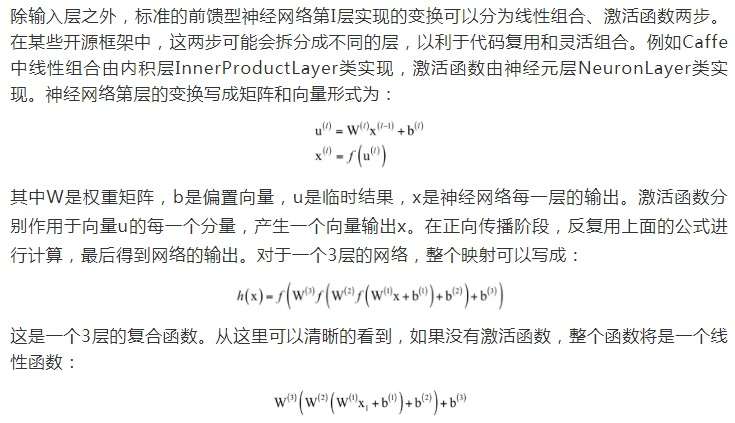

激活函数的要求：

1. 非线性
2. 万能逼近定理
3. 处处可导：满足后向传播时候链式求导的需要
4. 导数绝对值不能太大，也不能太小，避免引起梯度消失和梯度爆炸

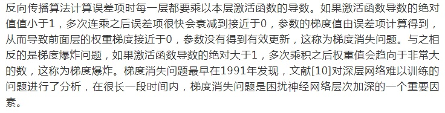


# 7.梯度下降法 #

以一个线性回归问题为例:

N个实例组成的训练集(x1, x2， y)[N], 训练出一组参数a,b,c，使得输入x1,x2,  计算y'=a*x1 + b*x2 +c， y'与y误差尽量小。

定义损失函数为 J = 1/N * ∑(y-y')^2 ， 求使得损失函数最小的参数a,b,c， 可以使用梯度下降法：

1. 随机选取向量 **w(0)** = (w1, w2, w3)作为初始值
2. 根据梯度公式 **▽J(w)** = ( ∂J/∂w1, ∂J/∂w2, ∂J/∂w2) ，代入当前的(w1, w2, w3)值，即获得当前位置的梯度
3. 沿着梯度下降的方向前进一小步，计算得到新的**w**。即 **w(n+1)** = **w(n)** - step * **▽J(w)**
4. 如此反复，直到收敛。

下面用mathematica代码演示：

先构建一组训练集：

	ClearAll["Global`*"];
	a = 1;
	b = 2;
	c = 3;
	NUM = 20;
	y[x1_, x2_] = a*x1 + b*x2 + c;
	x1arr = Table[RandomReal[{-5, 5}], {i, 1, NUM}];
	x2arr = Table[RandomReal[{-10, 10}], {i, 1, NUM}];
	trainset = Table[0, {i, 1, NUM}];
	labels = Table[0, {i, 1, NUM}];
	For[i = 1, i <= NUM, i++,
	  labels[[i]] = y[x1arr[[i]], x2arr[[i]]] + RandomReal[{-0.1, 0.1}];
	  trainset[[i]] = {x1arr[[i]], x2arr[[i]], labels[[i]] }
	  
	  ];

将参数都初始化为1，然后定义损失函数，并求梯度公式、代入参数计算当前的梯度值

	w1 = 1;
	w2 = 1;
	w3 = 1;
	stepsz = 0.001;
	loss = Sum[(s1*x1arr[[i]] + s2*x2arr[[i]] + s3 - labels[[i]])^2 / 
	    NUM, {i, 1, NUM}];
	Do[
	  g1 = D[loss, s1] /. {s1 -> w1, s2 -> w2, s3 -> w3};
	  g2 = D[loss, s2] /. {s1 -> w1, s2 -> w2, s3 -> w3};
	  g3 = D[loss, s3] /. {s1 -> w1, s2 -> w2, s3 -> w3};
	  
	  w1 = w1 - g1*stepsz;
	  w2 = w2 - g2*stepsz;
	  w3 = w3 - g3*stepsz
	  ,
	  {k, 1, 2000}];
	Print[{w1, w2, w3}];

得到正确的输出为：

	{1.01699,2.00054,2.90552}


# 8.各种layer的理解

## 8.1卷积层

### 卷积的在视觉上的意义

根据数字信号处理学科的知识，卷积其实是一个滤波器，过滤出信号中的某个特征。在DNN中，一个卷积核可以识别图像中的一种特征，例如识别出一个拐角。

假设我们要识别的图像特征和卷积核如下：

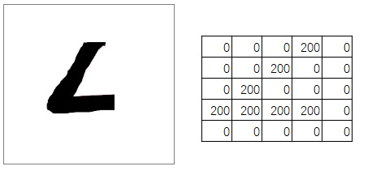

上面的卷积核在输入图像上滑动，每个位置都计算卷积值。当移动到图像的拐角线条区域的时候，卷积得到一个很大的值：

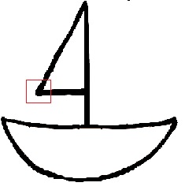

当移动到其他位置的时候，卷积得到的值比较小：

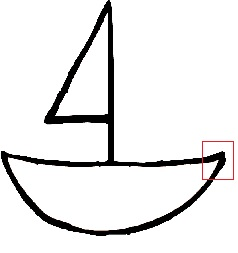

严格意义上来说，计算卷积的时候，卷积核还需要做左右和上下翻转，所以上面的例子只是示意。

在一副大图片里搜索一个局部小图片（例如在蒙娜丽莎图片里搜索/匹配蒙娜丽莎的眼睛），也可以用卷积的方法。

一个卷积层通常会配置有几十到几百个卷积核，提出几十上百种特征。

下面这段mathematica代码演示拐角的提取：
```
ClearAll["Global`*"];
img = Import["e:\\boat.bmp"];

img = ColorConvert[img, "Grayscale"];

imgdata = ImageData[img, "Byte"];
Print["原图：", img];
kernel = {{0, 0, 0, 0, 0, 1, 0}, 
          {0, 0, 0, 0, 1, 0, 0}, 
          {0, 0, 0, 1, 0, 0, 0}, 
          {0, 0, 1, 0, 0, 0, 0},
          {0, 1, 0, 0, 0, 0, 0},
          {1, 1, 1, 1, 1, 1, 1}, 
          {0, 0, 0, 0, 0, 0, 0}};
(*
kimg = Import["e:\\kernel.bmp"];
kimg = ColorConvert[kimg, "Grayscale"];
kernel = ImageData[kimg, "Byte"];
*)
edgesz = Floor[Length[kernel] / 2];
Print[edgesz];
rownum = Length[imgdata];
colnum = Length[imgdata[[1]]];
Print[rownum, ",", colnum];

result = Table[   Table[0, {j, 1, colnum - edgesz*2}], 
   	{i, 1, rownum - edgesz*2}];
Print[Length[result]];
Print[Length[result[[1]]]];
max = 0;
maxi = 1;
maxj = 1;
For[i = 1 + edgesz, i <= (rownum - edgesz), i++,
  	For[j = 1 + edgesz, j <= (colnum - edgesz), j++,
    	sum = 0;
    	For[k = -edgesz, k <= edgesz, k++,
     	For[m = -edgesz, m <= edgesz, m++,
       	 sum = 
         sum + imgdata[[i + k]][[j + m]] * 
           kernel[[1 + edgesz + k]][[1 + edgesz + m]];
       
       ];
     ];
    result[[i - edgesz]][[j - edgesz]] = sum;
    If[sum > max, max = sum; maxi = i; maxj = j, null];
    ];
  ];
Print[maxi, ",", maxj, ",", max];
result2 = result;
For[i = 1, i <= (rownum - edgesz*2), i++,
  	For[j = 1, j <= (colnum - edgesz*2), j++,
    	result[[i]][[j]] = Floor[result[[i]][[j]]/max * 255];
    	If[result2[[i]][[j]] != max, result2[[i]][[j]] = 0, null];
    ];
  ];

Print["卷积后的图像:", Image[result]];
Print[Image[result2]];
```

输出结果如下：

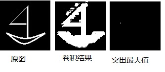

### 多通道数据的卷积

实际的DNN中的卷积层，输入和输出都是多通道的，例如下面这个网络中的一个卷积层，输入数据是96个通道，输出是256通道，那么怎么理解？

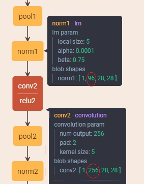

额外提一下：上面这个图是用一个web界面工具生成的，非常方便。url是：

```
http://ethereon.github.io/netscope/#/editor
```

我们在学习数字信号处理的时候知道：音频信号的卷积，是一维的，灰度图的卷积，是二维的。这里多通道数据的卷积，是三维的！也就是说上图中的卷积层的卷积核是一个三维的卷积核，尺寸是5 X 5 X 96，输入数据是28 X 28 X 96，每次卷积运算，是对立方体内各元素计算点积，得到一个浮点标量的结果。这个卷积层有256个这样的三维卷积核。所以该卷积层需要学习到的参数有5 X 5 X 96 X 256。

需要注意区分各层参数的尺寸与输出blob尺寸是两个不同的东东，以上面的卷积层conv2为例：

1. 该层的参数尺寸，就是256个卷积核的参数值，每个卷积核是一个长方形的魔方，有 5 X 5 X 96 个参数，这样的魔方有256个，所以该层参数的尺寸是 5 X 5 X 96 X256
2. 数据经过该层运算后输出，存放在BLOB里，其尺寸是28见方的矩阵，有256层，每层对应一个卷积核的输出。所以是28 X 28 X 256。这个尺寸跟上一层的输出也就是该层的输入数据的尺寸有关，输入越大，得到的输出通常也越大。
3. finetune的时候，有时候遇到参数尺寸不匹配而报错，通常是参数尺寸不匹配。


## 8.2全连接层

全连接层中的每一个神经元节点，都和上一层的每个数据有一个连接/参数。

例如下面fc6这个连接层，该层有512个节点，每个节点和输入的384X7X7个数据中的每一个数据都有一个连接和参数，所以总共有7 X 7 X 384 X 512个参数，还没有算512个偏置参数b。

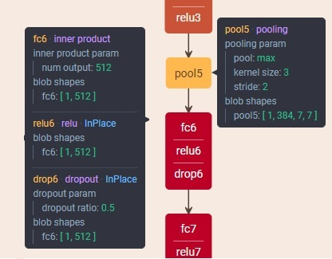

也可以吧全连接层当做卷积层来理解：fc6是一个卷积层，有512个卷积核，每个卷积核是大小为 7 X 7 X 384的3D卷积核。每个卷积核与上一层输出数据做卷积后，产生一个标量数据输出。

## 8.3 Pooling层和SPP层

Pooling层可以简单理解为下采样层，通常的取值方法有最大值、平均值、随机值。

SPP层可以理解为特殊的Pooling层，全称是Spatial Pyramid Pooling Layer。顾名思义，跟金字塔一样，将输入池化为逐渐变小的输出，多个输出摞在一起像个金字塔。

如下图所示，SPP层等价于并行3个Pooling层，将输入池化为4X4、2X2、1X1大小，然后一起输出到下一层。

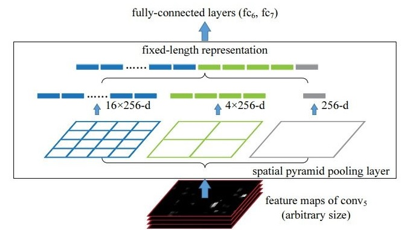

## 8.4 数据（输入）层

数据层解决的是将原始训练数据输入到网络里，有多种数据层的实现：

1. Image Data：支持读取图片文件

2. Database: 支持从lmdb/leveldb中读取数据

3. HDF5Input：支持从HDF5中读取。HDF5是一种跨平台的通用数据格式，注意区分hadoop的分布式文件系统HDFS，他们之间没有任何关系。

4. Input: 通常用于训练好的模型部署的时候输入数据，出现在deploy.prototxt中

   ```
   layer {
    name: "input"
     type: "Input"
     top: "data"
     input_param {
       shape { dim: 1 dim: 1 dim: 200 dim: 200 }
     }
   # or 
   input: "data"
   input_dim: 1 
   input_dim: 1 #channel
   input_dim: 200 #row
   input_dim: 200 #col
   ```

   

5. 其他WindowData/MemoryData什么的我没有见过。


详细可以见：

[caffe的关于layer的说明文档](http://caffe.berkeleyvision.org/tutorial/layers.html)

## 8.5 激活函数层

第6小节已经有提到了。

## 8.6 SOFTMAX层

max函数是返回多个值中最大的那个，soft max顾名思义，比较柔和比较柔性，根据多个值的大小，一定概率的返回某个值，值越大，返回的概率越大。且这些值返回的概率和等于1。适合用于分类问题中最后一层。softmax层通常出现在deploy.prototxt文件里，与之对应的，在train_val.prototxt文件里出现的是softmax loss层。

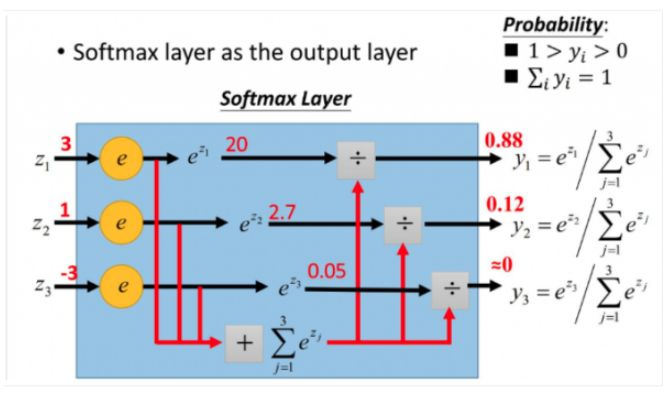

## 8.7  Softmax with Loss 层

### 先说交叉熵

我们知道，熵，也叫信息熵，就是编码一个随机事件的最短的平均bit数。H(p)=sum( P[i] * log2(1/P[i]))，其中 P[i]是该随机事件的各种状态的概率。 当我们对该事件的概率分布足够掌握，那么计算得到的熵是最优的（最短的）平均bit

数。

但是，如果我们对一个随机事件的概率分布掌握不够，估计为 Q [i]，而实际发生是P[i]，那么由此计算得到的熵叫做交叉熵。估计得越不准，交叉熵越大，越偏离信息熵。**这个就可以用来作为softmax_loss层的损失函数。**

交叉熵与信息熵之间的差值，叫做相对熵。

一个小例子：

如果随机事件有两个状态，一个状态A的概率为y，那么另外一个状态B的概率就为1-y。

我们对该随机事件进行估计，认为状态A的概率为x，状态B的概率为1-x。

所以交叉熵为 

```
y*Log[1/x] + (1 - y)*Log[1/(1 - x)]
```

我们看看这个函数的情况：

```
h[x_, y_] = y*Log[1/x] + (1 - y)*Log[1/(1 - x)];
Print[Plot3D[h[x, y], {x, 0.00001, 0.99999}, {y, 0.00001, 0.99999}]];
Print["when the possibility of state A is actually 0.2:"];
Print[Plot[h[x, 0.2], {x, 0.00001, 0.99999}]];
fs = Table[h[x, k], {k, 0.2, 0.8, 0.2}]
Print[Plot[fs, {x, 0.00001, 0.99999}]];
```

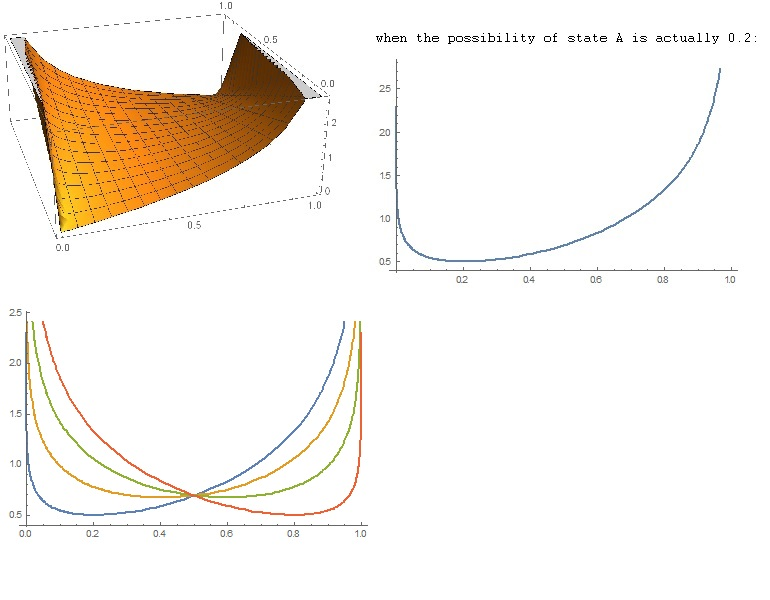

上面左图是交叉熵随 x，y变化的情况。

右图是当实际的概率为y=0.2的时候，交叉熵与估计概率x的关系，可见当x也等于0.2，即估计准确的时候，交叉熵才最小。

左下图中的曲线分别是当实际概率y为0.2，0.4，0.6，0.8的时候交叉熵随x变化的情况。

softmax loss层就是使用交叉熵作为损失函数的。

再举个例子：

假设一个5分类问题，一个样本的标签y=[0,0,0,1,0]，也就是说样本的真实标签是4。

假设模型预测的结果概率（softmax的输出）p=[0.1,0.15,0.05,0.6,0.1]，可以看出这个预测是对的，那么对应的损失L=-log(0.6)，也就是当这个样本经过这样的网络参数产生这样的预测p时，它的损失是-log(0.6)。

假设模型预测输出p=[0.15,0.2,0.4,0.1,0.15]，因为真实标签是4，而模型判断这个样本是4的概率只有0.1（远不如其他概率高，那么模型预测该样本属于类别3），对应损失L=-log(0.1)。

因为-log(0.6)  < -log(0.1)，所以预测错比预测对的损失要大，预测错得离谱比预测错得轻微的损失要大。

softmax层和softmax loss层似乎是对应出现的，一个出现在train_val.prototxt里，一个出现在对应的deploy.prototxt里。

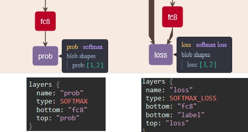

## 8.8 SigmoidCrossEntropyLoss层

这个层也是使用交叉熵作为损失函数，我理解它应对的是二分类问题，前面softmax是多分类问题。

## 8.9  多项逻辑斯蒂损失层

这一种损失函数层，也是使用的交叉熵作为损失函数。实际上，softmax with loss可以认为是softmax层后面跟一个多项逻辑斯蒂损失层。

二项逻辑斯蒂回归，用于二分类的情况，比较常见和熟悉；多项逻辑斯蒂回归则用于多分类问题。如下：

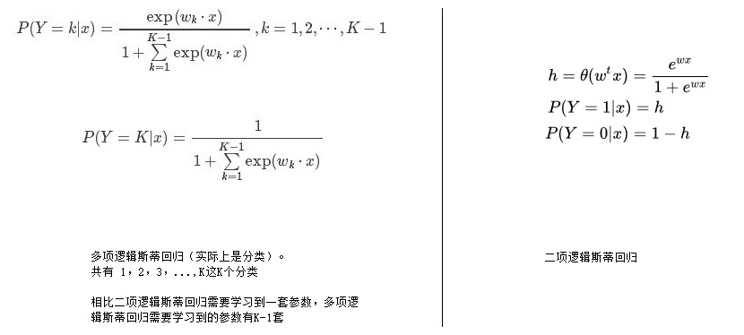


## 8.10 方差之和/欧式距离损失层

Sum-of-Squares / Euclidean Loss Layer

感觉比较好理解，预测值和标注值之间的差的平方作为损失函数。我理解应该比较适合回归问题。

## 8.？ python layer

让用户可以自定义一个层，而不需要修改和编译caffe的核心代码。

