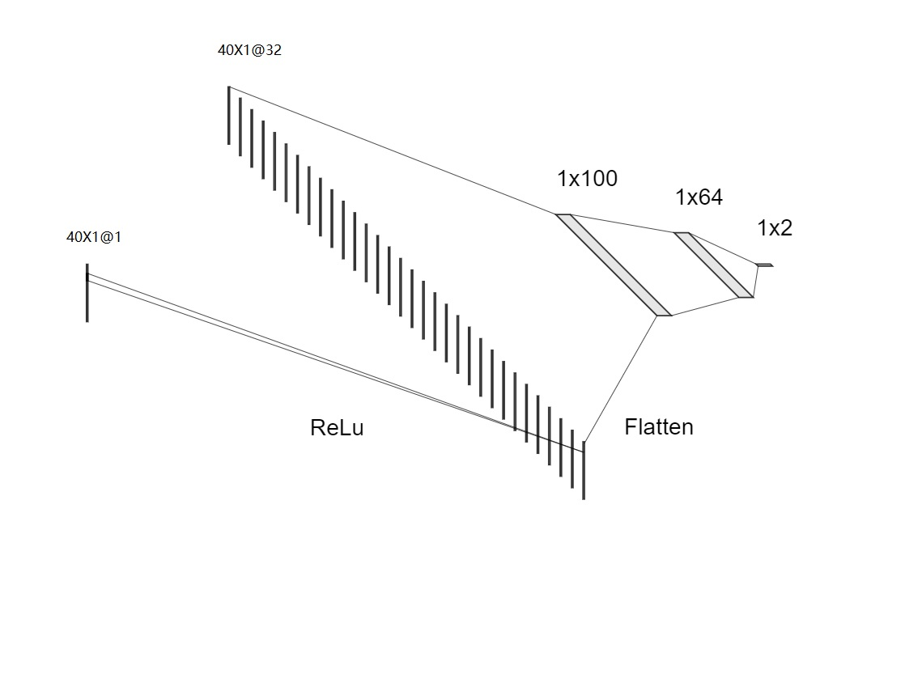

# 利用神经网络检测随机字符串域名

## 问题提出

有同事问我，工作中他们发现客户提交的域名是随机字符串构成的，不利于维护，这种有什么好的算法可以检测发现？ 

手写检测算法可能不容易收敛，我用pytorch尝试训练一个神经网络，用于检测正常的自然人可读的域名字符串和随机字符串域名，效果还不错，实验室准确率97.8%，写个小文记录如下。更严谨的做法应该同时看一下召回率，但根据经验，正负样本数比较平衡的时候，准确率高，召回率不会很差。

## 神经网络架构



如上图所示，每个输入的样本是40个字符组成的字符串，后面的部分字符是‘\0’补齐到40字节长度。

经过一个一维卷积，卷积核大小为5，padding为2，共32个卷积核，输出32个特征。卷积的结果是40X1X32的三维矩阵。

矩阵经过flatten处理后，经过三次全连接层的计算，输出为二分类：1表示是正常的域名，0表示是随机字符串构成的域名。

结合看代码会清晰一点：

```python
# 简单的卷积网络。没有卷积层的话，准确率可以到90%，加上卷积层可以到96%
class MyModel(nn.Module):
    def __init__(self):
        super(MyModel, self).__init__()
        self.conv1 = nn.Conv1d(1, 32, kernel_size=5, padding=2)
        self.fc1 = nn.Linear(32 * inputsz, 100)
        self.fc2 = nn.Linear(100, 64)
        self.fc3 = nn.Linear(64, 2)

    def forward(self, x):
        x = x.reshape(x.shape[0], 1, -1)
        x = nn.functional.relu(self.conv1(x))
        x = x.reshape(x.shape[0], -1)
        x = F.dropout(x, 0.1)
        x = nn.functional.relu(self.fc1(x))
        x = nn.functional.relu(self.fc2(x))
        x = self.fc3(x)
        return x
```

## 训练样本构造

使用英文小说，去掉各种奇怪的标点符号，只保留英文字母和句号，随机截断用作正样本。

使用26个小写英文字符和数字还有英文句号，随机组合，构成负样本。

正负样本数8比2。总共3万个样本，其中5000个用于测试，25000个用于训练。

```python
# 从一本书里生成随机的 域名的正例。这样的域名通常含有英文单词
def get_positive():
    with open("e:\\aninlandvoyage.txt", "rb") as f:
        char_artical = f.read()
    char_artical = clean(char_artical)
    total_len = len(char_artical)
    offset = 0
    ret = list()
    while offset < total_len:
        example_len = random.randint(20, inputsz)
        endpos = offset + example_len
        if endpos > total_len:
            endpos = total_len
        substr = char_artical[offset:endpos]
        offset = endpos

        if substr[0:1] == bytes(".", encoding="utf8"):
            substr = substr[1:]
        if substr[-1:] == bytes(".", encoding="utf8"):
            substr = substr[:-1]

        while len(substr) < inputsz:
            substr = substr + b'\0'

        if offset < 400:
            print(str(substr))
        t = torch.tensor([int(substr[i]) for i in range(inputsz)])
        ret.append((t, 1))
    return ret


# 随机的字符组成的域名，是反例
def get_negtive():
    ret = list()
    chars = "abcedfghijklmnopqrstuvwxyz0123456789.."
    for i in range(25000):
        example_len = random.randint(20, inputsz)
        example = bytes()
        for j in range(example_len):
            pos = random.randint(0, len(chars))
            example = example + bytes(chars[pos:pos + 1], encoding="utf8")
        while len(example) < inputsz:
            example = example + b'\0'

        if i < 10:
            print(example)
        t = torch.tensor([int(example[i]) for i in range(inputsz)])

        ret.append((t, 0))
    return ret
```

几个样本的举例：

```
b'book.with.a.preface.is.i\x00\x00\x00\x00\x00\x00\x00\x00\x00\x00\x00\x00\x00\x00\x00\x00'
b'am.half.afraid.to.sin.against.pr\x00\x00\x00\x00\x00\x00\x00\x00'
b'oportion.but.a.preface.is.mor\x00\x00\x00\x00\x00\x00\x00\x00\x00\x00\x00'

b'taruwcqc9e3qwv68d15d27aigywfu287.kn96\x00\x00\x00'
b'2ewfca.q623rrv9ncb0h\x00\x00\x00\x00\x00\x00\x00\x00\x00\x00\x00\x00\x00\x00\x00\x00\x00\x00\x00\x00'
b'3v8ide610z2ml96.lffyegtz42up\x00\x00\x00\x00\x00\x00\x00\x00\x00\x00\x00\x00'
```

## 训练结果

过程中，准确率不断持续上升，5000次迭代后，准确率达到97.8%

```shell
#依次为epoch数、迭代次数、损失函数值  
0   200   0.48426503166556356
0  acc: 0.78  #测试集合准确率
1   400   0.31340339325368405
1  acc: 0.8518181818181818 #测试集合准确率
2   600   0.24707667134702205
2  acc: 0.8545454545454545
3   800   0.19998351994901895
3   1000   0.17785323597490788
3  acc: 0.9045454545454545
4   1200   0.17209207866340875
4  acc: 0.9327272727272727
5   1400   0.15451651997864246
5  acc: 0.9390909090909091
6   1600   0.1492527356557548
6   1800   0.1384443433023989
6  acc: 0.9481818181818182
7   2000   0.13415666678920388
7  acc: 0.9481818181818182
8   2200   0.12118349635973573
8  acc: 0.9490909090909091
9   2400   0.11915699679404497
9  acc: 0.9627272727272728
10   2600   0.11746669515967369
10   2800   0.10649290926754475
10  acc: 0.9618181818181818
11   3000   0.1055853345990181
11  acc: 0.9645454545454546
12   3200   0.10078558260574937
12  acc: 0.9636363636363636
13   3400   0.09598261619918048
13   3600   0.08701083545573056
13  acc: 0.9681818181818181
14   3800   0.08431043795309962
14  acc: 0.9581818181818181
15   4000   0.0815417252574116
15  acc: 0.9781818181818182
16   4200   0.07994165162555873
16   4400   0.07331002817489207
16  acc: 0.9790909090909091
17   4600   0.06973772327415645
17  acc: 0.98
18   4800   0.0710556190321222
18  acc: 0.9781818181818182
19   5000   0.06854084383230656
19  acc: 0.9781818181818182
```

## 完整的代码

```python
import torch
import numpy as np
import random
import torch.utils.data.dataset as dataset
import torch.utils.data.dataloader as dataloader
import torch.nn as nn
import torch.nn.functional as F
import torch.jit

batchsz = 100
lr = 0.001
inputsz = 40
epochnm = 20
minbatch = 0
compute = True


# clean the text, only alpha and space is left
def clean(text):
    result = bytes()
    for i in range(len(text)):
        c = chr(text[i])
        if c.isalpha() or c.isnumeric():
            result = result + text[i:i + 1].lower()
        if c == " ":
            result = result + bytes(".", encoding="utf8")
    return result


# 从一本书里生成随机的 域名的正例。这样的域名通常含有英文单词
def get_positive():
    with open("e:\\aninlandvoyage.txt", "rb") as f:
        char_artical = f.read()
    char_artical = clean(char_artical)
    total_len = len(char_artical)
    offset = 0
    ret = list()
    while offset < total_len:
        example_len = random.randint(20, inputsz)
        endpos = offset + example_len
        if endpos > total_len:
            endpos = total_len
        substr = char_artical[offset:endpos]
        offset = endpos

        if substr[0:1] == bytes(".", encoding="utf8"):
            substr = substr[1:]
        if substr[-1:] == bytes(".", encoding="utf8"):
            substr = substr[:-1]

        while len(substr) < inputsz:
            substr = substr + b'\0'

        if offset < 400:
            print(str(substr))
        t = torch.tensor([int(substr[i]) for i in range(inputsz)])
        ret.append((t, 1))
    return ret


# 随机的字符组成的域名，是反例
def get_negtive():
    ret = list()
    chars = "abcedfghijklmnopqrstuvwxyz0123456789.."
    for i in range(25000):
        example_len = random.randint(20, inputsz)
        example = bytes()
        for j in range(example_len):
            pos = random.randint(0, len(chars))
            example = example + bytes(chars[pos:pos + 1], encoding="utf8")
        while len(example) < inputsz:
            example = example + b'\0'

        if i < 10:
            print(example)
        t = torch.tensor([int(example[i]) for i in range(inputsz)])

        ret.append((t, 0))
    return ret


class myDataset(dataset.Dataset):
    def __init__(self, isTrain=True):
        super(myDataset, self).__init__()
        self.isTrain = isTrain
        poslist = get_positive()
        neglist = get_negtive()
        self.train = list()
        self.test = list()

        for t in poslist:
            r = random.randint(0, 10)
            if r > 8:
                self.test.append(t)
            else:
                self.train.append(t)
        for t in neglist:
            r = random.randint(0, 10)
            if r > 8:
                self.test.append(t)
            else:
                self.train.append(t)
        random.shuffle(self.test)
        random.shuffle(self.train)
        print("test size:", len(self.test))
        print("train size:", len(self.train))

    def __getitem__(self, index):
        if self.isTrain:
            return self.train[index][0].to(dtype=torch.float32) / 255, torch.tensor(self.train[index][1],
                                                                                    dtype=torch.long)
        else:
            return self.test[index][0].to(dtype=torch.float32) / 255, torch.tensor(self.test[index][1],
                                                                                   dtype=torch.long)

    def __len__(self):
        if self.isTrain:
            return len(self.train)
        else:
            return len(self.test)


set1 = myDataset()
train_data = dataloader.DataLoader(set1, batchsz, False)  # type:dataloader.DataLoader

set1 = myDataset(False)
test_data = dataloader.DataLoader(set1, batchsz, False)  # type:dataloader.DataLoader


# 简单的卷积网络。没有卷积层的话，准确率可以到90%，加上卷积层可以到96%
class MyModel(nn.Module):
    def __init__(self):
        super(MyModel, self).__init__()
        self.conv1 = nn.Conv1d(1, 32, kernel_size=5, padding=2)
        self.fc1 = nn.Linear(32 * inputsz, 100)
        self.fc2 = nn.Linear(100, 64)
        self.fc3 = nn.Linear(64, 2)

    def forward(self, x):
        x = x.reshape(x.shape[0], 1, -1)
        x = nn.functional.relu(self.conv1(x))
        x = x.reshape(x.shape[0], -1)
        x = F.dropout(x, 0.1)
        x = nn.functional.relu(self.fc1(x))
        x = nn.functional.relu(self.fc2(x))
        x = self.fc3(x)
        return x


# the network according to some TextCNN papaer
'''class MyModel(torch.nn.Module):
    def __init__(self):
        super(MyModel, self).__init__()
        self.chnnum = 2
        self.conv1 = nn.Conv1d(1, self.chnnum, kernel_size=4, padding=0) # 37 X self.chnnum
        self.conv2 = nn.Conv1d(1, self.chnnum, kernel_size=3, padding=0) # 38 X self.chnnum
        self.conv3 = nn.Conv1d(1, self.chnnum, kernel_size=2, padding=0) # 39 X self.chnnum
        self.pool1 = nn.MaxPool1d(inputsz-3)
        self.pool2 = nn.MaxPool1d(inputsz - 2)
        self.pool3 = nn.MaxPool1d(inputsz - 1)
        self.fc = nn.Linear(self.chnnum*3, 2)
    def forward(self, x):
        x = x.reshape(x.shape[0], 1, -1)
        x1 = nn.functional.relu(self.conv1(x)) # (batchsz, self.chnnum, 37)
        x2 = nn.functional.relu(self.conv2(x)) # (batchsz, self.chnnum, 38)
        x3 = nn.functional.relu(self.conv3(x))# (batchsz, self.chnnum, 39)
        x1 = self.pool1(x1)
        x2 = self.pool1(x2)
        x3 = self.pool1(x3)
        x1 = x1.reshape(x1.shape[0], -1) # (batchsz, self.chnnum)
        x2 = x2.reshape(x2.shape[0], -1) # (batchsz, self.chnnum)
        x3 = x3.reshape(x3.shape[0], -1) # (batchsz, self.chnnum)
        x = torch.cat([x1, x2, x3 ], dim=1) # (batchsz, self.chnnum*3)
        x = self.fc(x).softmax(1)
        return x'''


# 用测试集对模型进行校验
def test(model, test_data):
    model.eval()
    s = nn.Softmax(dim=1)
    total = 0
    same = 0
    for inputs, labels in test_data:
        inputs = inputs.to(device="cpu")
        labels = labels.to(device="cpu")
        y = model(inputs)
        y = s(y)
        y = torch.max(y, 1)  # type:torch.return_types.max
        same += (y[1] == labels).sum().to(device='cpu').numpy()
        total += batchsz
        if total > 1000:
            break
    return same / total


# 训练
if compute:
    model = MyModel().to("cpu")
    trainer = torch.optim.Adam(model.parameters(), lr)
    lossfun = nn.CrossEntropyLoss()
    lossSum = 0

    for e in range(epochnm):
        model.train()

        for inputs, labels in train_data:
            minbatch += 1
            inputs = inputs.to(device="cpu")  # type:torch.tensor()
            labels = labels.to(device="cpu")
            y = model(inputs)

            L = lossfun(y, labels)
            trainer.zero_grad()
            L.backward()
            trainer.step()

            lossSum = lossSum + L.to("cpu").data.numpy()
            if minbatch % 200 == 0:
                print(e, " ", minbatch, " ", lossSum / 200)
                lossSum = 0
        print(e, " acc:", test(model, test_data))
        model.train()
    torch.jit.script(model).save("e:\\findRandStr.pt")
```