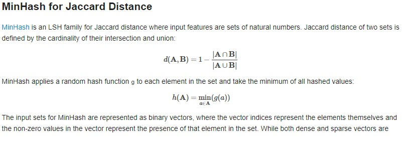
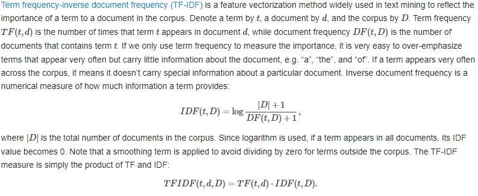
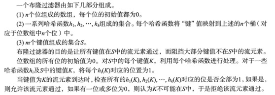

# 大规模数据挖掘笔记 #

是这本书：mining of massive dataset

作者有：

1. Jure Leskovec@Stanford Univ.
2. Anand Rajaraman@Milliway Labs
3. Jeffrey D. Ullman@Stanford Univ.

这本书我还没有仔细的研究，粗略读了一下，用作这方面的索引参考吧。

生产实践可以参考spark mllib：

https://spark.apache.org/docs/latest/ml-features.html

# 第一章：数据挖掘基本概念 #

介绍了机器学习、特征提取、hash函数、全书架构等等

# 第二章：map reduce #

介绍了map reduce、Hadoop/spark等。因为我之前看过也做过这方面的练习，所以这里不誊抄了。

# 第三章：相似项的发现 #

补充教材：

```
https://medium.com/engineering-brainly/locality-sensitive-hashing-explained-304eb39291e4
```

## 3.1 集合的jaccard相似度 ##

J(A,B) = A交B的大小 /  A并B的大小

主要的应用场景有：

1. 用于度量文档的相似度：两个文档的重点词汇集合的距离
2. 协同过滤中度量相似用户或者相似物品

jaccard相似度只是距离的一种计算方式，其他的还有欧式距离、cos距离、海明距离等非常多算法。

## 3.2 文档的相似性

### 3.2.1 minhash和LSH

思路是把文档转化为集合、集合间的jaccard相似度替代文档间的相似度；为了方便查找与一个文档相似的其他文档列表，把集合组织成LSH。

LSH是一种特殊的hash table（不是hash函数），使得相似度高的集合大概率落在同一个hash桶内，方便快速查找相似的集合（文档），这是一个近似的结果。

1. shingling：把文档转化为词/子串的集合的一个方法：k-shingling即扫描出文档中所有长度为k的字符子串，组成一个子串的集合。另外基于词（word）这一天然的分割，而不是k个连续的字符，把一篇文档看做词的集合。
2. 利用minhash做近似估计：shingles后的集合来表示一篇文档，还是太大，且大小不一，不方便存储和比对。进一步做minhash处理，可得到长度一致且较短的文档描述。例如选取10个不同的hash函数应用于每个集合（也就是文档）：对集合中的每个元素计算hash值，取其中最小的值，如此反复10次，每个文档就会得到10个hash值组成的集合。文档就用这样长度一致（10个整数）的小集合表示。这些集合之间的jaccard距离，近似等于文档之间的相似度。
3. 建立LSH索引加速邻近搜索：LSH使得相似的minhash集合（文档）大概率落在同一个hash桶里。简单的理解，假设每个集合有10个minhash值，那么两两一组，得到5个编号，放入5个桶里。还有很多其他LSH设计方案，应对不同的距离度量。

minhash的计算方法，摘自spark mllib文档：



```
https://spark.apache.org/docs/latest/ml-features.html#minhash-for-jaccard-distance
```

minhash之所以这么简单，是因为在集合的jaccard相似度与集合的最小hash值之间存在着神奇的关联：

两个集合经随机排列转换之后得到的两个最小hash值相等的概率，等于这两个集合的jaccard相似度。

随机排列转换，涉及到集合的特征矩阵，通常采取使用不同的hash函数的方式来实现。即minhash需要使用多个hash函数就行计算。

下面这段代码演示了这种神奇的关联，输出符合预期：

```python
import random
import hashlib

def hash(a:int):
    h = hashlib.sha256()
    h.update(a.to_bytes(length=((a.bit_length()+7) // 8), byteorder='big') )
    d = h.digest()
    return int.from_bytes(d[:4], byteorder='big')

def jaccard(A:set, B:set):
    C = len(A.intersection(B))
    D = len(A.union(B))
    return C / D

def minhash(A:set, B:set):
    num = 0
    TOTAL = 200
    for i in range(TOTAL):
        a = min([  hash(a + i) for a in A])
        b = min([  hash(b + i) for b in B])
        if a == b:
            #print(a, " == ", b)
            num = num + 1
    return num / TOTAL

def test():
    TEST_NUM = 100
    pp = 0
    nn = 0
    for i in range(TEST_NUM):
        A = set( [random.randint(1, 100) for j in range(40)])
        B = set( [random.randint(1, 100) for j in range(80)])
        C =set( [random.randint(200, 300) for j in range(50)])

        abj = jaccard(A,B)
        abm = minhash(A,B)
        bcm = minhash(B,C)
        if  abj /abm > 0.9 and abj/abm < 1.11:
            pp += 1
        if bcm < 0.1:
            nn += 1
        print("\rcomplete %f"%(i/TEST_NUM), end='')
    print("\r%f, %f"%(pp/TEST_NUM, nn/TEST_NUM))

test()
```

下面这段代码是基于spark下的mllib库进行LSH近邻搜索的demo：

```python
from pyspark.ml.feature import MinHashLSH
from pyspark.ml.linalg import Vectors
from pyspark.sql import SparkSession
from pyspark.sql import DataFrame

spark = SparkSession \
    .builder \
    .appName("my app") \
    .config("Master", "local") \
    .getOrCreate()

dataA = [(0, Vectors.sparse(6, [0, 1, 2], [1.0, 1.0, 1.0]),),
         (1, Vectors.sparse(6, [2, 3, 4], [1.0, 1.0, 1.0]),),
         (2, Vectors.sparse(6, [0, 2, 4], [1.0, 1.0, 1.0]),)]
dfA = spark.createDataFrame(dataA, ["id", "features"])
key = Vectors.sparse(6, [1, 3], [1.0, 1.0])

mh = MinHashLSH(inputCol="features", outputCol="hashes", numHashTables=5)
model = mh.fit(dfA)
# Feature Transformation
print("The hashed dataset where hashed values are stored in the column 'hashes':")
model.transform(dfA).show()
# approximate nearest neighbor search.
print("Approximately searching dfA for 2 nearest neighbors of the key:")
model.approxNearestNeighbors(dfA, key, 2).show()
```

scikit-learn也提供了LSH算法，非常直观好用，但后来因为性能问题废弃了：

```
from sklearn.neighbors import LSHForest
import numpy as np
import random
f = LSHForest()
X = [[random.randint(0,5) for k in range(5)] for i in range(10)]
X = np.array(X)
print(X)
f.fit(X)
print(f.kneighbors(X[0:1]))
```

有个姓朱的博士提供了datasketch这个python包，里面包含了LSH的实现。

### 3.2.2 simhash

这是另外一种算法，simhash。

1. TF-IDF：用以评估一个词对于一个语料库中的其中一份文件的重要程度。字词的重要性随着它在文件中出现的次数成正比增加，但同时会随着它在语料库中出现的频率成反比下降。
2. simhash：也是一种LSH算法。步骤如下：
   1. 对语料库中的文档进行分词，根据TF-IDF算法提取 N个最重要的词作为语料库中文档的特征词
   2. 对其中一个文档计算N个特征词的权重，也就是TF-IDF值，并对这N个词进行hash，假设hash结果是M bits，那么对于一个文档来说得到了N个M bit长度的hash，每个hash对应的词有一个权重值。
   3. 将M bit的hash替换为M个整数的序列，值为1的bit替换为正的权重值，值为0的bit替换为负的权重值。因此每篇文档得到N个整数序列，每个整数序列长度为M
   4. 将该篇文档的N个整数序列进行按索引加，结果是一个长度为M的整数序列。将结果整数序列转换为1/0 bit序列，正整数替换为1，非正整数替换为0。最后得到的这个长度为M的1/0序列就是文档的simhash。
   5. 两个文档的相似性就是比较这两个文档的simhash的汉明距离
   6. 建立LSH索引表：应对汉明距离这种度量，比较简单的一种方式是抽样一些bit位作为hash桶的索引。

关于TF-IDF算法，spark-mllib文档是这样描述的：



python的一个simhash的实现：

```
https://leons.im/posts/a-python-implementation-of-simhash-algorithm/
```

## 3.3 最近邻居搜索

这里讨论的相似项的发现，属于Nearest Neighbor Search领域。该领域其实是很广泛的一个课题，包括很多算法和场景，例如KDTree、BallTree、RTree、Vector quantization、LSH、聚类算法、降维算法、词向量。深度学习在这个领域也有研究和应用。概述可以参考wiki上的该词条。

# 第四章：流式数据的挖掘

## 流数据挖掘模型 ##

可以把流数据看做一个一个不断产生的元组数据，每个元组数据有若干个字段。对他们的处理有时效的要求，否则数据就会丢失。

数据流的查询有哪些类型？有哪些处理策略？

1. 固定查询：对前来的数据一直在执行查询和计算：例如汽车显示即时速度、统计过去几秒钟的瞬时油耗
2. 即时查询ad hoc：仅当一个查询操作提交时，才对数据进行计算查询：例如一次性的临时查询月度消费1000元的用户

内存大小的限制，是数据流处理考虑的主要因素。因此，数据流处理算法的两个策略：

1. 计算问题的近似解，比精确解高效的多
2. hash技术，对求解近似解非常有帮助

## 流数据的抽样问题 ##

对用户进行抽样，而不是对每个用户的数据进行抽样

将某些字段看成关键字组合，并利用hash的a/b策略，即b个桶，a作为阈值，保留小于a的采样值

新用户出现，每个用户的样本规模不断变大，以至于抽样的数据都超出了分配的空间，如何处理？那么就设定新的阈值a-1，即降低阈值，并将hash值等于a的数据删除，这样可以提高效率，节省空间。

## 流数据过滤 ##

我们只想接受满足某个标准的元组的集合，当这个标准是一个简单的可计算属性是，过滤操作很容易完成，当标准涉及到一个非常大的集合查找时（例如用户白名单），问题就会变得困难。这时候布隆过滤器就很方便。



如果某个元组的键值在S中，那么该元组一定能通过布隆过滤器（一定在过滤器中表示为存在），大多数不在S中的元组不能通过，但个别不在S中的元组也会通过布隆过滤器，这成为假阳性，需要尽量避免。其概率为：

(1-e^(-km/n))^k

## 流数据中独立元素数量的统计 ##

当独立元素个数不是太多的时候，可以通过hash等方式存放到内存里用于检索和排重。但如果元素个数非常大的时候，内存就会不够用，前面说的抽样能解决一定的问题。这时候FM算法就很有帮助。

FM算法将元素hash到一个足够长的位串，并记住出现过的位串末尾连续bit 0的最大位数（也可以是连续bit 1的最大位数），假设最大位数为a，那么截止当前出现过的独立元素的个数近似为2^a。

这是一个近似值，为了更加精确，可以使用一组不同的hash函数，各自计算出一个最大位数，得到一组a[]，求数组的均值和中值的方式。

## 矩估计（对问题4的扩展） ##

一个元素出现的次数mi, 矩的概念就是 求和 mi ^ k

k=0，即不同元素的数目

k=1，所有元素的出现的次数，mi就是每种元素出现的频率

k=2，就是度量元素分布的非均匀性，也称为奇异数

问题：当数据流过大，内存中无法存下时，如何估计这些数字特征？

如何估计二阶矩？AMS算法 即Alon-Matias-Szegedy algorithm

这里没有认真看

## 窗口内计数的问题 ##

一个窗口大小为N的二进制流，对任意的k，k<N，能够回答：最近k位上有多少个1？我们依然关注内存无法容纳整个窗口N的情况。

除了内存这个空间复杂度问题，还有扫描k位这个时间复杂度问题。有DGIM算法以O( (logN)^2 )的空间复杂度来估计

这里没有认真看

# 第五章：web链接分析 #

主要讲PageRank算法，如何有效的对搜索结果的文档做重要性和相关性排序，对抗作弊。

这里没有认真看 ：）

# 第六章：发现频繁项集 #

经典的场景就是，有大量的物品（项）和大量的购买记录，每个购买记录是一个购物车，购物车里有不多的物品。

希望找出频繁出现在购物车里的项的组合（项集），通常希望找出的频繁项集的大小是1,2,3这样的，其中以2尤其典型，成为频繁项対。例如啤酒和尿布

## A-Priori算法 ##

前提：假定对所有项的计数可以放在内存里，大小为1的频繁项集不会太多，所以它们两两交叉出来可能的频繁项対的技术可以放在内存里。

如此经过两遍对购物车记录的扫描，就可以很容易找出频繁项对。

进一步的，也可以交叉出可能的大小为3的频繁项集，经过又一次购物车扫描，找出大小为3的频繁项集。

PCY是改进版本的A-Priori算法，比较类似。

进一步的，通过简单的对购物车数据做抽样并存放于内存中，使用A-Priori算法或者PCY算法，可以获得整体数据的近似解，或者说获得对抽样数据的精确解。由于购物车数据存放在内存，所以这里只需要扫描一次购物车数据。

## SON和Toivonen算法 ##

这两个算法是只扫描两遍购物车数据、且适合mapreduce并行计算的算法

SON算法，思路就是对购物车数据进行分组，每个分组求出候选项集，然后第二遍扫描购物车数据，判断候选项集中哪些是真正的频繁项集 

# 第七章：聚类 #

## 层级式聚类算法 ##

简单的说就是自底向上，一开始把每个点都看作是一个簇，计算各个簇之间的距离，合并两个最近的簇，成为一个新簇；然后开始下一轮迭代，直到满足停止的条件。

该算法复杂度为O(n^3)，通过避免重复的距离计算，改进的算法复杂度是O(n^2 * logn)，不是一个适合大规模数据处理的算法

根据距离的定义（欧式距离/海明距离/编辑距离…）、簇距离的定义（质心的距离/最邻近点的距离/簇的代表点的距离…）的不同，层级式聚类算法可以应对各种场景。

算法停止条件也可能是多样的：

1. 预先知道有多少个簇
2. 某些指标指导：例如一个簇的直径/半径不能大于多少

## 点分配聚类算法 ##

最有代表性的就是k均值聚类算法

还有k均值聚类算法的变种：BFR算法、CURE算法

简单的说就是，一开始通过一定的算法选举出K个点作为簇的质心，计算各个点到K个质心的距离，从而决定每个点属于哪个簇，然后更新各个簇的质心。重复该操作，直到收敛。

我怎么感觉不是欧式空间也可以用这些算法。

# 第八章：web广告 #

这章没有怎么仔细看，之前看过一点《计算广告》

# 第九章：推荐系统 #

见另外一个文档 [推荐系统读书笔记](./推荐系统读书笔记.md)


# 第十章：社交网络的挖掘 #

# 第十一章：降维 #
# 第十二章：大规模机器学习 #


