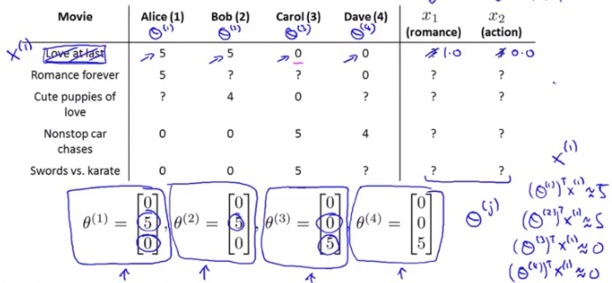

# 大规模数据挖掘笔记 #

是这本书：mining of massive dataset

作者有：

1. Jure Leskovec@Stanford Univ.
2. Anand Rajaraman@Milliway Labs
3. Jeffrey D. Ullman@Stanford Univ.

这本书我还没有仔细的研究，粗略读了一下，用作这方面的索引参考吧。

# 第一章：数据挖掘基本概念 #

介绍了机器学习、特征提取、hash函数、全书架构等等

# 第二章：map reduce #

介绍了map reduce、Hadoop/spark等。因为我之前看过也做过这方面的练习，所以这里不誊抄了。

# 第三章：相似项的发现 #

## 集合的jaccard距离 ##

J(A,B) = A交B的大小 /  A并B的大小

主要的应用场景有：

1. 用于度量文档的相似度：两个文档的重点词汇集合的距离
2. 协同过滤：例如电子商务中，给用户推荐与之相似的用户的喜欢的商品

## shingling ##

把文档转化为词的集合的一个方法：k-shingling即扫描出文档中所有长度为k的字符子串，组成一个集合。

## minhash ##

经过shingling得到的集合太大，不方便计算和存储。minhash是将集合经过随机的排列转换后映射为一个整数，相当于对集合计算摘要。它能保持集合的jaccard距离：

两个集合经过随机排列转换后的两个minhash相等的概率，等于这两个集合的Jaccard距离

## 局部敏感hash算法（LSH）##

数据挖掘中，对海量的文档做两两比较，得到他们的相似度（例如Jaccard距离），这个计算不现实。通常的做法是对文档做LSH，让相似的文档大概率的落到相同的hash桶里，有点像聚类算法，或者有点像基于向量的量化。

## 距离的测度方法 ##

Jaccard距离只是其中一种，其他常用的还有：余弦距离、欧式距离、汉明距离、编辑距离等等

#第四章：流式数据的挖掘#

## 流数据挖掘模型 ##

可以把流数据看做一个一个不断产生的元组数据，每个元组数据有若干个字段。对他们的处理有时效的要求，否则数据就会丢失。

数据流的查询有哪些类型？有哪些处理策略？

1. 固定查询：对前来的数据一直在执行查询和计算：例如汽车显示即时速度、统计过去几秒钟的瞬时油耗
2. 即时查询ad hoc：仅当一个查询操作提交时，才对数据进行计算查询：例如一次性的临时查询月度消费1000元的用户

内存大小的限制，是数据流处理考虑的主要因素。因此，数据流处理算法的两个策略：

1. 计算问题的近似解，比精确解高效的多
2. hash技术，对求解近似解非常有帮助

## 流数据的抽样问题 ##

对用户进行抽样，而不是对每个用户的数据进行抽样

将某些字段看成关键字组合，并利用hash的a/b策略，即b个桶，a作为阈值，保留小于a的采样值

新用户出现，每个用户的样本规模不断变大，以至于抽样的数据都超出了分配的空间，如何处理？那么就设定新的阈值a-1，即降低阈值，并将hash值等于a的数据删除，这样可以提高效率，节省空间。

## 流数据过滤 ##

我们只想接受满足某个标准的元组的集合，当这个标准是一个简单的可计算属性是，过滤操作很容易完成，当标准涉及到一个非常大的集合查找时（例如用户白名单），问题就会变得困难。这时候布隆过滤器就很方便。

如果某个元组的键值在S中，那么该元组一定能通过布隆过滤器（一定在过滤器中表示为存在），大多数不在S中的元组不能通过，但个别不在S中的元组也会通过布隆过滤器，这成为假阳性，需要尽量避免。其概率为：

(1-e^(-km/n))^k

## 流数据中独立元素数量的统计 ##

当独立元素个数不是太多的时候，可以通过hash等方式存放到内存里用于检索和排重。但如果元素个数非常大的时候，内存就会不够用，前面说的抽样能解决一定的问题。这时候FM算法就很有帮助。

FM算法将元素hash到一个足够长的位串，并记住出现过的位串末尾连续bit 0的最大位数（也可以是连续bit 1的最大位数），假设最大位数为a，那么截止当前出现过的独立元素的个数近似为2^a。

这是一个近似值，为了更加精确，可以使用一组不同的hash函数，各自计算出一个最大位数，得到一组a[]，求数组的均值和中值的方式。

## 矩估计（对问题4的扩展） ##

一个元素出现的次数mi, 矩的概念就是 求和 mi ^ k

k=0，即不同元素的数目

k=1，所有元素的出现的次数，mi就是每种元素出现的频率

k=2，就是度量元素分布的非均匀性，也称为奇异数

问题：当数据流过大，内存中无法存下时，如何估计这些数字特征？

如何估计二阶矩？AMS算法 即Alon-Matias-Szegedy algorithm

这里没有认真看

## 窗口内计数的问题 ##

一个窗口大小为N的二进制流，对任意的k，k<N，能够回答：最近k位上有多少个1？我们依然关注内存无法容纳整个窗口N的情况。

除了内存这个空间复杂度问题，还有扫描k位这个时间复杂度问题。有DGIM算法以O( (logN)^2 )的空间复杂度来估计

这里没有认真看

# 第五章：web链接分析 #

主要讲PageRank算法，如何有效的对搜索结果的文档做重要性和相关性排序，对抗作弊。

这里没有认真看 ：）

# 第六章：发现频繁项集 #

经典的场景就是，有大量的物品（项）和大量的购买记录，每个购买记录是一个购物车，购物车里有不多的物品。

希望找出频繁出现在购物车里的项的组合（项集），通常希望找出的频繁项集的大小是1,2,3这样的，其中以2尤其典型，成为频繁项対。例如啤酒和尿布

## A-Priori算法 ##

前提：假定对所有项的计数可以放在内存里，大小为1的频繁项集不会太多，所以它们两两交叉出来可能的频繁项対的技术可以放在内存里。

如此经过两遍对购物车记录的扫描，就可以很容易找出频繁项对。

进一步的，也可以交叉出可能的大小为3的频繁项集，经过又一次购物车扫描，找出大小为3的频繁项集。

PCY是改进版本的A-Priori算法，比较类似。

进一步的，通过简单的对购物车数据做抽样并存放于内存中，使用A-Priori算法或者PCY算法，可以获得整体数据的近似解，或者说获得对抽样数据的精确解。由于购物车数据存放在内存，所以这里只需要扫描一次购物车数据。

## SON和Toivonen算法 ##

这两个算法是只扫描两遍购物车数据、且适合mapreduce并行计算的算法

SON算法，思路就是对购物车数据进行分组，每个分组求出候选项集，然后第二遍扫描购物车数据，判断候选项集中哪些是真正的频繁项集 

# 第七章：聚类 #

## 层级式聚类算法 ##

简单的说就是自底向上，一开始把每个点都看作是一个簇，计算各个簇之间的距离，合并两个最近的簇，成为一个新簇；然后开始下一轮迭代，直到满足停止的条件。

该算法复杂度为O(n^3)，通过避免重复的距离计算，改进的算法复杂度是O(n^2 * logn)，不是一个适合大规模数据处理的算法

根据距离的定义（欧式距离/海明距离/编辑距离…）、簇距离的定义（质心的距离/最邻近点的距离/簇的代表点的距离…）的不同，层级式聚类算法可以应对各种场景。

算法停止条件也可能是多样的：

1. 预先知道有多少个簇
2. 某些指标指导：例如一个簇的直径/半径不能大于多少

## 点分配聚类算法 ##

最有代表性的就是k均值聚类算法

还有k均值聚类算法的变种：BFR算法、CURE算法

简单的说就是，一开始通过一定的算法选举出K个点作为簇的质心，计算各个点到K个质心的距离，从而决定每个点属于哪个簇，然后更新各个簇的质心。重复该操作，直到收敛。

我怎么感觉不是欧式空间也可以用这些算法。

# 第八章：web广告 #

这章没有怎么仔细看，之前看过一点《计算广告》

# 第九章：推荐系统 #

推荐系统里的两个参与者：

1. 项，也叫物品，也叫内容，也叫item
2. 用户

## 协同过滤算法

两类协同过滤算法推荐系统：

1. 基于内容（也叫物品、项、item）的推荐系统：
2. 基于协同过滤的推荐系统

基于内容的推荐系统，根据用户过去喜欢的物品（内容），为用户推荐和他过去喜欢的物品相似的物品。而关键就在于物品相似性的度量；主要有三步：

1. 为每个物品提取特征
2. 利用该用户历史上喜欢或者不喜欢的物品，提取该用户的特征
3. 通过计算物品和用户的特征的距离，推荐相关度大的物品
	

基于协同过滤的推荐系统又分：

1. 基于用户的协同过滤：与A用户相似的用户的喜欢的内容，推荐给用户A
2. 基于内容的协同过滤：与A用户喜欢历史喜欢的内容相似的内容，推荐给用户A

内容的特征提取方法：

1. 文档的特征发现，例如TF.IDF，第四章的文档相似性，基于词汇来定义，而推荐系统关注的文档特征，是一些重要词汇的是否出现，而进一步的距离的度量、相似文档的发现，minhash LSH都在推荐系统里可用
2. 内容的标签
3. 	内容的结构化资料

基于内容的推荐系统，还有一个思路是机器学习的方式，将特定的数据（例如一组历史上用户喜欢或者不喜欢的内容的特征作为输入特征，用户喜欢或者不喜欢作为分类标签）当做是训练集，然后为每个用户训练一个分类器，来预测该用户对一个内容的评分/喜好

协同过滤，关键步骤是计算相似性，可以用第四章介绍的距离度量的方式计算相似的用户/内容，也可以使用聚类的机器学习算法，聚类出相似的簇。

[试验代码](code/data_mining/UserCollaborativeFiltering.py)

基于用户和基于物品的协同过滤算法的对比：

## 潜在因子算法

另外一种重要的推荐算法是潜在因子算法（latent factor model）

以下面四个用户对五个电影的打分为例。目标是预测一些用户对某部电影可能的评价，据此来决定要不要给该用户推荐。例如预测Alice对第三部电影的评价。

算法是：

1. 对每部电影，建立一些特征，类似线性回归例子中的每个房子有建筑面积、卧室个数等特征。上面例子的电影有两个特征：x1-浪漫类系数，x2-动作类系数
2. 每个用户是一个线性回归模型（也可以是其他机器学习模型），根据该用户对某些电影已有的评价信息，可以学习到该用户的线性回归参数θ。例如上面例子中，可以训练获得Alice用户的θ=[0, 5, 0]
3. 利用上一步学习获得的θ， 可以预测该用户对其他电影的评价，例如Alice对第三部电影的评价是4.95分

也可能的场景是，知道一些用户的模型参数θ，但是某些电影的特征数据缺失，例如下图：

类似的，可以依据已有的用户模型参数θ，训练获得电影的特征数据。然后利用学习到的数据，对缺失的评价进行预测。

在一个推荐系统里，往往两个方向的学习都有：只有部分用户模型参数θ，只有部分电影的特征数据x；利用已知的电影特征数据x，可以学习到缺失的用户模型参数θ；利用已知的用户模型参数θ，可以学习到缺失的电影的特征数据x。最终实现预测某用户对某电影是否感兴趣。

x1,x2这些特征因子、用户模型参数θ、物品的特征数据都可以由用户的评价矩阵生成，通过UV分解和梯度下降学习得到，[试验代码在这里](code/data_mining/LFM.py)

# 第十章：社交网络的挖掘 #

# 第十一章：降维 #
# 第十二章：大规模机器学习 #

