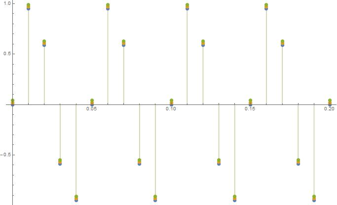
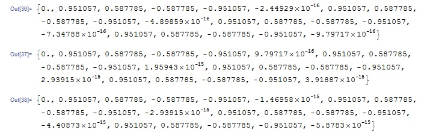
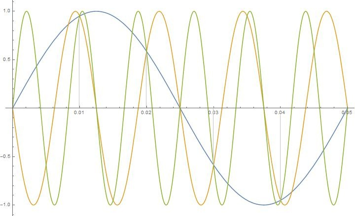

* 奈奎斯特采样定理：

**A continuous signal can be properly sampled, only if it does not contain frequency components above one-half of the sampling rate.**

如果连续模拟信号中存在频率大于采样频率一半的分量，那么会出现混淆/走样（aliasing）。

即奈奎斯特采样定理要求，在根据采样后的离散数据进行模拟信号恢复还原的时候，遵从一个约定：即模拟信号各正弦波分量的最高频率不大于采样频率的一半。

举个例子：

采样频率为100HZ，对一个频率为20Hz模拟信号进行采样，获得一组离散的采样点。在根据采样数据恢复模拟信号的时候，如果不遵从奈奎斯特采样定理的约定，我们可以恢复出20Hz的模拟信号，也可以恢复出80Hz的模拟信号，或者按照120Hz、180Hz、220Hz...等频率进行恢复，这些模拟信号都能够很好的吻合采样点的位置。

用Mathematica软件试验：

f1是一个20Hz的正弦波：

	f1[t_] = Sin[2 Pi*20 t]

f2是一个80Hz的正弦波：

	f2[t_] = -Sin[2 Pi*80 t]

f3是一个120Hz的正弦波：

	f3[t_] = Sin[2 Pi*120 t]

samplePosition是采样点的位置，采样频率为100Hz：

	samplePosition = Range[0, 0.2, 0.01]

我们通过画图可以看出：f1/f2/f3在采样点处的取值是一样的：

	DiscretePlot[ {f1[t], f2[t], f3[t]}, {t, samplePosition}]

为了看得更清楚，我们给f2 f3加上一点点偏移：

	DiscretePlot[ {f1[t], f2[t] + 0.02, f3[t] + 0.04}, {t,   samplePosition}]

从数值上可以直观比对一下：

	f1result = Table[f1[t], {t, samplePosition}]
	f2result = Table[f2[t], {t, samplePosition}]
	f3result = Table[f3[t], {t, samplePosition}]

个别为0的点，有效数字完全不同，但实际上都非常接近0，应该是计算误差导致的。

或者画曲线看看他们的重合位置：

	Plot[{f1[t], f2[t], f3[t]}, {t, 0, 0.05}]

可以看到，不同频率的三条曲线都是能吻合采样数据的，只有加上奈奎斯特采样定理的约束，20Hz的模拟信号才是唯一解和确定解。
