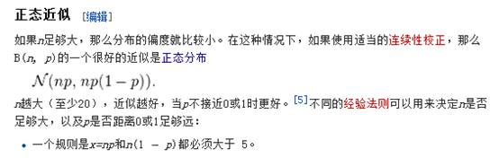
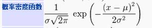
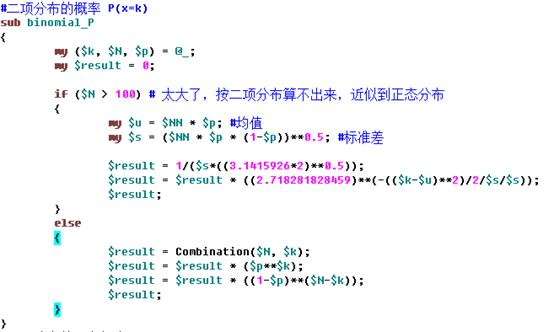
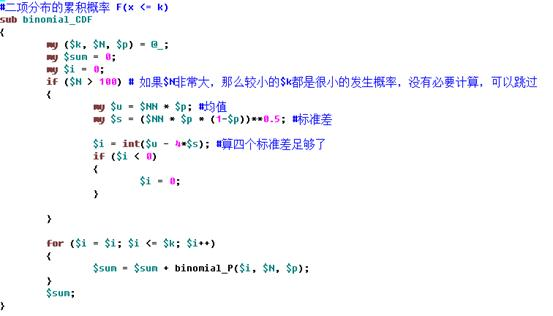
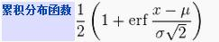
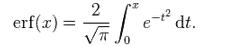
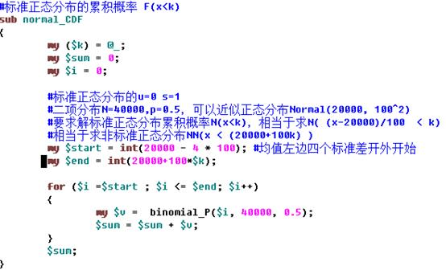

# 如何编程计算试验次数很大的二项分布的概率  #

最近一次工作中用到了二项分布，但这个二项分布的试验次数比较大，5万次，每次试验的事件发生概率是0.15。发现用计算机按照二项分布的概率函数公式去计算概率，算不出来，因为其中需要计算组合，当试验次数比较大的时候，组合的结果非常大。普通计算机算不出来。

为了有个直观的印象，我们算一下组合Combination(100, 50):

结果非常大，更别提计算combination(50000, 50)了。

## 利用正态分布计算二项分布的概率 ##

怎么办？

二项分布，当实验次数（N）很大的时候，就近似正态分布了。

**利用这个我们可以很容易转化为正态分布的问题来求解二项分布的概率。**

假设我们要获得二项分布Binomial(N, p)当x=k的概率，就可以转化为正态分布Normal(u，s^2)当x=k的概率密度。直接代入正态分布的密度函数：

其中u=N*p，

 

所以perl脚本中求二项分布的概率的函数如下：

近似为正态分布，对于二项分布的累积概率的求解的效率优化，也很有帮助，不用从k=0开始累加概率，而是从正态分布的u-4*s（均值往左4个标准差）开始累加即可。4个标准差以外的概率累积为0。

以二项分布N=50000, p=0.15，求F(x<=7590)为例，不用从0到7590累加所有的二项分布概率，直接从7280到7590累加一下即可，因为F(x<7280)近似为0。如此，效率可以提高24倍

 

## 二项分布反过来也能帮助到正态分布。 ##

正态分布的累积概率按照公式求解是很麻烦的，那个erf函数就不是个常规函数

当然，我们也可以微分一小段小段的累加求积分的方式，编程实现erf函数从而实现求正态分布的累积概率。但是借助二项分布可以更简单的求解

当然，上面这个函数里调用的binomial_P，它的实现还是用的正态分布的密度函数

 

小结：

多次从教科书里学习到二项分布近似正态分布的知识，但是直到真正在实际工作中用一下才有更多的体会。可见实践出真知。

