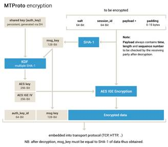
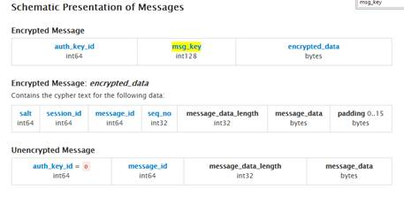

**IM软件telegram的粗略了解**

（2014年）

1、  telegram的私密聊天模式支持完美向前安全。为了保证过去的通信信息安全，官方版本的telegram客户端在当前密钥使用了一段时间后，会重新初始化一个（会话）密钥。具体的条件是：当前密钥被用来加解密超过100条消息，或者使用时间超过1个星期。老的密钥会被安全的销毁，及时有权限获取到当前的新密钥，也不能恢复老密钥

2、  Telegram支持两种模式的通讯：普通聊天模式，使用client-server间加解密（server知道密钥和聊天内容）；私密的端到端加密模式，server也不能获取聊天内容。

3、  私密的聊天模式是一对一的聊天，所有的消息都被加密，且密钥只被聊天参与者知悉（服务器都不知道）。没有第三方可以获取到被解密的消息，除非能够访问到参与聊天的某个设备。

4、  中间人攻击的防止：普通聊天模式，client和server间通过DH协商密钥的时候，使用预先嵌入在客户端软件的RSA公钥（挑战server）的方式，来对server进行身份验证（类似证书了）。私密模式下，因为前面client-server密钥协商已经认证过server了，所以两个客户端都可以信任服务端，服务端帮忙搭桥进行DH密钥协商，防止中间人攻击

5、  Telegram使用mtproto协议进行通信。Mtproto协议主要有三层功能

a)      应用层：定义协议里的具体字段、实现打包拆包

b)      加解密层

c)      网络传输层，包括http  tcp udcp各种方式

6、  重点看一下mtproto加解密层的设计。详细可见https://core.telegram.org/mtproto/description

a)      Shared key( auth_key)，通过DH协商到的密钥（不是会话密钥），2048bit。标识一个设备

b)      Server key，预置在客户端软件的用于校验server身份的RSA公钥，2048bit

c)      Key identifier（auth_key_id），用于标识该消息用哪个auth_key加解密。Auth_key_id是对应的auth_key的sha1摘要之后的低64bit。Auth_key_id为0表示该消息不加密

d)      Session：客户端产生的一个64bit的随机数，用于标识（同一个auth_key下）不同的会话。Session+auth_key对应一个会话

e)      Server salt：server定期要求修改的一个64bit随机数，用于防重放攻击。一个新的server salt产生后，后续消息都必须包含该salt（在途的包含旧salt的老消息在300s内仍然有效）。Server salt还用于一个小技巧，用来校对客户端的时间（没有看到更详细的资料）。

f)       Message identifier(msg_id)：在session内唯一标识一条消息，单调递增，满足一定的规则：客户端发起的消息除4余0；除4余1的是server应答client的消息，余3就是反之；大概等于unixtime*2^32，可以用于获得消息的产生时间，用于丢弃已经超时无效的消息。另外还有个message sequence的字段

g)       Message key：消息的sha1摘要的低128bit。我理解是消息完整性校验用

h)      AES会话密钥：用auth_key和msg_key计算出一个256bit的会话密钥(aes_key)和初始向量(aes_iv)，所以不难理解auth_key_id和msg_key都要明文传输的。详细计算过程这里不摘抄了

7、  Telegram目前（2014.11）还不支持在群/讨论组内进行私密消息，也不支持在群/讨论组内的消息阅后即焚。上述两个特性只支持c2c。阅后即焚只支持在私密模式下

8、  用户可以设置“最后一次上线时间”的可见范围，这个设置是对等的，你不分享给别人，别人的你也看不到

9、  对于互联网上用户隐私的保护，telegram认为像facebook/google那样提供一些设置项让用户可以选择信息的社交公开程度是不够的（英语没有看太懂），它强调必须做好两方面：

a)      保护隐私的聊天不被包括服务提供商雇员等第三方窃听

b)      保护个人的数据不被第三方利用，例如用于广告投放、市场分析

10、 Telegram的setting|privacy and security里有一个菜单，可以用于踢所有其他终端下线；如果6个月（时间用户可以设置）不登陆，帐号可以被回收，数据将被清理

11、 Telegram支持广播的模式，给最多100个联系人发同样的消息。与群不同的是，这些联系人不会知道其他联系人也收到了消息，接收方看到的是普通的c2c消息

12、 Telegram客户端代码、API、通讯协议都是开源的，号称所有代码都会逐步开放。

13、 Telegram使用DH协商私密聊天session的会话密钥。客户端提供类似二维码的密钥图片，供用户线下比对，以确保没有中间人攻击。因为DH遭遇中间人攻击情况下，一手托两家协商出相同的密钥的几率为0

14、 至于为什么不全部都采取私密聊天的方式，telegram的解释是：非私密聊天可以漫游消息，可以搜索消息，提供更好的用户体验，而这个也是很重要的。

15、 手机丢失了怎么办？ Telegram强依赖手机号作为帐号，短信是登录密码。以后可能会推出二次密码。如果手机丢失了，建议用户：

a)      联系运营商，紧急挂失sim卡，并补发新卡

b)      如果另外一个终端有登录telegram，踢掉其他终端；如果没有额外登录的终端，那等新卡下拉，踢掉其他终端

16、 隐私条款中的数据存储：

a)      普通聊天模式下，云端会保存消息、照片、视频、文档。Telegram声称所有的数据都被重度加密，且密钥拆分存储在不同的司法区的DC中，避免某个DC的工程师和入侵者访问到用户数据（不明白怎么做到的，可能是将密钥拆分后存储到不同的公有云里，例如一部分存阿里云，一部分存百度云，只提供带登录态的接口。毕竟他们勾结的可能性比较小?）

b)      私密聊天模式下，消息没有被保存到云端。  照片/视频/文档这些富媒体，是用私密会话的会话密钥加密后保存到云端的。对于云来说，因为加密过，这些都是些乱码

c)      联系人也保存在server，因为要用于上线通知等功能，联系人应该是对服务商可见的。

17、 用户可以主动到一个页面上注销帐号。帐号一旦注销，云端的数据也会被删除；用户删除一条消息，那么server端还保存有，供对方使用，只有当对方也删除这条消息，云端才会彻底删除该消息。

18、 隐私条款中，telegram坚定的声称不会把用户的数据用于它途

