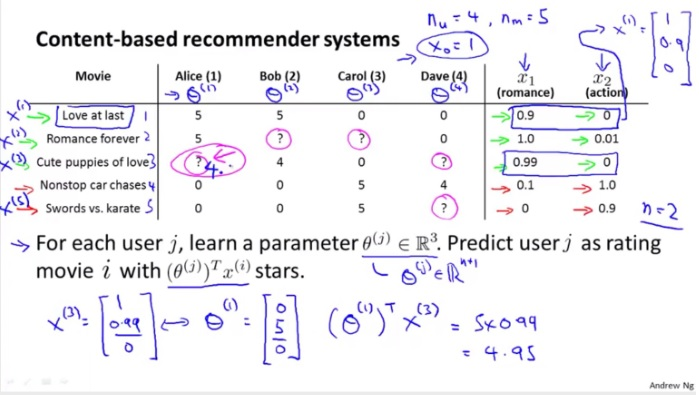

## 异常检测

来自吴恩达老师在Coursera上的机器学习第九章 anomaly detection。

我理解，严格的说这不是机器学习的方法，更像传统的一种数据统计算法。常用于正样本非常少的欺诈检测和生产中的次品检测。如果使用机器学习分类的方式来处理，会面临不平衡类问题。

网友的这篇笔记比较详细。我这里只是简要的记录一下。

```
https://www.cnblogs.com/Deribs4/p/5265192.html
```

### 定义

简单的说，就是：

1. 对各特征分别拟合高斯分布
2. 对于新的待监测点，计算各个特征在各自分布中的概率（密度），累乘得到一个p值
3. 如果p值小于阈值，就是异常样本。
4. 上述模型也通过一组标注数据进行验证和校正


### 适用场景

与有监督的分类算法相比，异常检测算法有不同的适应场景，主要区别：

1. 异常点（正样本）很少，相对有很多的负样本
2. 异常点说不太准，没有怎么经历过 ：）


### 特征工程

如果特征不是高斯分布，那么通过指数函数、对数函数变换为高斯分布，或者增加特征来实现异常检测。


### 多变量的高斯分布和异常检测

有时候，因为特征之间存在相关性，使得正常点和异常点的分解不是刚好为一个圆形，而是一个椭圆。

这种情况下，异常检测结果出现假阴性。例如下面的这个绿点：


可以通过引入更多特征来解决，例如引入一个新的变量：(cpu load) * (cpu load) / (memory use)。

还有个办法，就是使用多变量的高斯分布：不用对每个特征拟合高斯分布，对所有特征一起拟合高斯分布。


可以看到，多变量的高斯分布自动处理了特征间的相关性。上面的case对应上图的右下角，钟型耸起的横截面是椭圆的，待检测的绿点所在的位置在等高线图上显示海拔很低，即p值很小，显示为异常点。

### 多变量高斯分布检测方法适用场景

那是不是这种算法可以替代前面的按特征拟合高斯分布的算法呢？ 不是的，各有所长。


主要的局限性在于：

1. 多变量高斯适合n比较小的情况，协方差矩阵是nXn大小的，太大求逆求行列式计算都很复杂。
2. m必须大于n，否则协方差矩阵不可逆。

### 练习

#### 1、特征分布调整为高斯分布

我试了一下教程中的指数函数、对数函数的方法，不凑效。但使用高考标准分的方式是确定ok的，代码如下：

```
ClearAll["Global`*"];
geneData[] := Module[{x, cnt, j, i},
   x = {};
   Do[
    cnt = 200/(i^0.5);
    For[j = 0, j < cnt, j = j + 1,
     AppendTo[x, i + RandomReal[3]];
     ];
    ,
    {i, 1, 100}
    ];
   x
   ];
convert2Std[x_] := Module[{},
   xx = Sort[x, Less];
   flags = {1};(*我前面有多少人*)
   max = xx[[1]];
   len = Length[xx];

   For[i = 2, i <= len, ++i,
    If[xx[[i]] > max, AppendTo[flags, i]; max = xx[[i]],  
      AppendTo[flags, Last[flags]]];
    ];
   {xx, flags/(len + 1)}
   ];

x = geneData[];
u = Mean[x];
v = Sqrt[Variance[x]];
Print["u:", u, " stdvar:", v];
xx = convert2Std[x];
cdf = InverseCDF[NormalDistribution[], xx[[2]]];

xx = u + v*cdf;
Histogram[x, 20]
Histogram[xx, 20]
```

输出如下：


#### 2、多变量的高斯分布

​	

```
ClearAll["Global`*"];
cdf[x_] = CDF[NormalDistribution[50, 20], x];
geneData[] := Module[{result, sum, i, j, cnt, x2},
   result = {};
   sum = cdf[0];
   For[i = 1, i < 100, i = i + 1,
    cnt = (cdf[i] - sum)*1000 ;
    cnt = Ceiling[cnt];
    For[j = 0, j < cnt, j = j + 1,
     AppendTo[result, i];
     ];
    sum = cdf[i];
   ];
   x2 =  Table[ 2 x + RandomReal[{-100, 100}], {x, result}];
   {result, x2}
];

getSigma[x_, u_] := Module[{len, result, i},
   len = Length[x];
   result = {0, 0};
   For[i = 1, i <= len, i = i + 1,
    onesample = {x[[i]] - u}; (* 形状如{{1,2}} *)
    (*If[i \[Equal] 1, Print[N[x[[i]]]];Print[N[onesample]];Print[N[
    Transpose[onesample] .onesample]],null];*)
    result = result + Transpose[onesample] .onesample;
    ];
   result = result / len;
   result
];
   
getp[x_, u_, s_] := Module[{n, det, xu, si},
   n = Length[x[[1]]];
   det = Det[s];
   xu = {x - u};
   si = Inverse[s];
   1/(2 (Pi)^(n/2)*Sqrt[det]) * Exp[-0.5 *( xu.si.Transpose[xu])]
];

{x1, x2} = geneData[];
Print[Histogram[x1, 100]];
Print[Histogram[x2, 50]];
x =Transpose[{x1, x2}];(*每行一个样本，100个样本100行*)
Print[Histogram3D[x, 50]];
u = Total[x]/Length[x];
sigma = getSigma[x, u];
Plot3D[getp[{x, y}, u, sigma], {x, 0, 100}, {y, -50, 250}, 
 PlotRange -> All]
ContourPlot[getp[{x, y}, u, sigma], {x, 0, 100}, {y, -50, 250}, 
 PlotRange -> All]
```

输出如下：


### 推荐系统

这章也简单介绍了推荐系统，我记录一下。

以下面四个用户对五个电影的打分为例。目标是预测一些用户对某部电影可能的评价，据此来决定要不要给该用户推荐。例如预测Alice对第三部电影的评价。



算法是：

1. 对每部电影，建立一些特征，类似线性回归例子中的每个房子有建筑面积、卧室个数等特征。上面例子的电影有两个特征：x1-浪漫类系数，x2-动作类系数
2. 每个用户是一个线性回归模型（也可以是其他机器学习模型），根据该用户对某些电影已有的评价信息，可以学习到该用户的线性回归参数θ。例如上面例子中，可以训练获得Alice用户的θ=[0, 5, 0]
3. 利用上一步学习获得的θ， 可以预测该用户对其他电影的评价，例如Alice对第三部电影的评价是4.95分

也可能的场景是，知道一些用户的模型参数θ，但是某些电影的特征数据缺失，例如下图：


类似的，可以依据已有的用户模型参数θ，训练获得电影的特征数据。然后利用学习到的数据，对缺失的评价进行预测。

在一个推荐系统里，往往两个方向的学习都有：只有部分用户模型参数θ，只有部分电影的特征数据x；利用已知的电影特征数据x，可以学习到缺失的用户模型参数θ；利用已知的用户模型参数θ，可以学习到缺失的电影的特征数据x。最终实现预测某用户对某电影是否感兴趣。