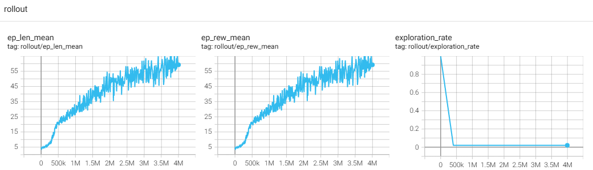

## 强化学习入门（2）

由于文件太大会导致加载缓慢、编辑的时候卡顿，所以另外开一个文件，不在原来的强化学习入门.md文件上继续追加内容。

### 1、 高维像素输入

#### 1.1 要考虑的问题

**问题1：延迟奖励带来的虚假奖励问题**

以gym里的breakout（小球敲砖块）的小游戏来理解：

先不考虑跳帧，如下场景： 

1. agent逐帧对环境进行观察，做出动作选择，每一帧都对环境施加了动作，也就是每一帧都会调用env.step(action)。虽然很多时候的action移动托盘，但不会接触到球，没有真正影响到环境，当然这样的移动对于下一次托举球做准备是有意义的。 
2. 在t-5帧的时候，托盘很好的托住了球，球反弹飞向砖块，而达到砖块还需要时间 
3. 此后的8帧时间内，agent继续保持对环境的每一帧都施加一个动作，也就是调用step(action)，这段时间内托盘都与球不发生接触，还在飞行，step返回0作为reward。reward和action会保存在同一个元组tuple里 
4. 在t时刻也就是t帧的时候，agent又对环境执行了step(action)，同时环境里发生了球击中砖块的事件，所以这一次的step（）会返回1 作为reward。那么这个等于1的reward会记录在与这次action相同的tuple元组里，表示这个时候对环境施加了action同时发生了球击中砖块事件，虽然这个事情因果关系并不强烈（因为t-5时刻以后的action对于这次击中砖块是没有帮助的）
5. DQN等算法在利用上述过程中收集的样本，会回溯，以折扣回报的方式奖励 t-5时刻的动作。**但算法也会错误的奖励 t-3, t-4等时刻的action。**
6. replay buffer里随机打散和随机抽样样本的方式进行训练，会不会导致 t 时刻的值为1的奖励不能很好的回馈 t-5时刻的托举动作？ 不会，因为通过TD误差的传播，在某个批次，reward 1 会影响Q(t)值，在某个批次，Q(t)值会影响Q(t-1)，依次类推， reward 1会影响到 Q(t-5, 托举)
7. 但不得不说，**这样的错误归因和奖励，会导致训练的agent收敛慢很多，甚至不能收敛。**

我觉得解决方案可能有：

1. 需要修改奖励机制，例如托举到球，要奖励；击中砖块，要回溯奖励最近一次托举和上一次托举之间的动作
2. 层级式强化学习？（HRL）


**问题2：逐帧处理有什么问题？跳帧处理又有什么问题？**

逐帧处理的问题：

1. 逐帧处理的话，要求Agent的处理速度必须非常高，以60帧每秒的游戏刷新率为例，那就要求agent的策略网络/价值网络的计算和动作施加都要控制在1/60秒内
2. 很多动作是冗余的微小的，紧接着的帧冗余，没有意义，加大了运算负担。
3. 从模拟人玩游戏的角度来看，逐帧处理没有太多必要，决策不需要这么高频的去观察和采取动作
4. 相同的堆叠数下，不容易发现运动趋势，因为帧与帧之间的差异不够大

跳帧的设计，我理解有下面的问题： 

1. 可能错过关键时刻，例如小球飞过去了没有能够托住
2.  动作重复的方式，如果动作是增量的相对的，那么动作可能过量 
3. 可能错失奖励，例如某一帧小球击中了砖块，但是这一帧被跳过了


CleanRL开源项目的代码中breakout游戏的处理，是粗暴的跳过4帧、动作重复执行4次，返回最后两次的观测的最大值和4次reward的累加。

```python
    def step(self, action: int) -> AtariStepReturn:
        """
        Step the environment with the given action
        Repeat action, sum reward, and max over last observations.

        :param action: the action
        :return: observation, reward, terminated, truncated, information
        """
        total_reward = 0.0
        terminated = truncated = False
        for i in range(self._skip):
            obs, reward, terminated, truncated, info = self.env.step(action)
            done = terminated or truncated
            if i == self._skip - 2:
                self._obs_buffer[0] = obs
            if i == self._skip - 1:
                self._obs_buffer[1] = obs
            total_reward += float(reward)
            if done:
                break
        # Note that the observation on the done=True frame
        # doesn't matter
        max_frame = self._obs_buffer.max(axis=0)

        return max_frame, total_reward, terminated, truncated, info
```


CleanRL中对环境的处理有很多有用的组件，用于包装环境：


#### 1.2 实操1：手搓breakout游戏

训练效果很好，经过5个小时1x3万个回合后，能够很稳定的弹球，见评估的[效果视频](img/RL/my_breakout.mp4)。


注意，这还不是完全的只依赖像素输入的，因为奖励/回合结束等信息，还是来自模拟器返回的结构化数据。

代码如下：

```python
import os
import random

import numpy
import numpy as np
from collections import deque, namedtuple
from typing import List, Tuple, Optional


import ale_py
import os

from stable_baselines3.common.env_util import make_atari_env
from stable_baselines3.common.vec_env import VecFrameStack


import torch
import torch.nn as nn
import torch.optim as optim
import torch.nn.functional as F
from torch.utils.tensorboard import SummaryWriter
from datetime import datetime


# 设备配置 (优先使用CUDA)
device = torch.device("cuda" if torch.cuda.is_available() else "cpu")

class CNN_DQN(nn.Module):
    """处理像素输入的深度Q网络"""

    def __init__(self, stack_size: int, action_dim: int):
        super(CNN_DQN, self).__init__()
        self.conv1 = nn.Conv2d(stack_size, 32, kernel_size=8, stride=4)
        self.conv2 = nn.Conv2d(32, 64, kernel_size=4, stride=2)
        self.conv3 = nn.Conv2d(64, 64, kernel_size=3, stride=1)
        self.fc1 = nn.Linear(64 * 7 * 7, 512)
        self.fc2 = nn.Linear(512, action_dim)

        # 初始化权重
        for m in self.modules():
            if isinstance(m, nn.Conv2d) or isinstance(m, nn.Linear):
                nn.init.xavier_uniform_(m.weight)
                if m.bias is not None:
                    m.bias.data.zero_()

    def forward(self, x: torch.Tensor) -> torch.Tensor:
        """前向传播"""
        x = F.relu(self.conv1(x))
        x = F.relu(self.conv2(x))
        x = F.relu(self.conv3(x))
        x = x.contiguous().view(x.size(0), -1)  # 展平
        x = F.relu(self.fc1(x))
        return self.fc2(x)


class DQNAgent:
    """DQN智能体，处理像素输入"""

    def __init__(self, env, stack_size: int = 4, buffer_capacity: int = 10_000,
                 batch_size: int = 32, gamma: float = 0.99, lr: float = 1e-4,
                 tau: float = 1.0, initial_epsilon: float = 1.0,
                 final_epsilon: float = 0.01, num_episodes=100_000, n_envs=4):
        self.env = env
        self.n_envs = n_envs
        self.stack_size = stack_size
        self.action_dim = env.action_space.n
        print(f"action_dim:{self.action_dim}")
        self.batch_size = batch_size
        self.gamma = gamma
        self.tau = tau
        self.epsilon = initial_epsilon
        self.final_epsilon = final_epsilon
        self.num_episodes = num_episodes

        # 初始化网络
        self.policy_net = CNN_DQN(stack_size, self.action_dim).to(device)
        self.target_net = CNN_DQN(stack_size, self.action_dim).to(device)
        self.target_net.load_state_dict(self.policy_net.state_dict())
        self.target_net.eval()  # 目标网络不训练

        # 优化器
        self.optimizer = optim.Adam(self.policy_net.parameters(), lr=lr)

        # 经验回放
        self.memory = deque(maxlen=buffer_capacity)  # 10万个step就是11个GB

        # TensorBoard
        dt = datetime.now().strftime("%Y%m%d_%H%M%S")
        self.writer = SummaryWriter(log_dir=f"logs/raw_dqn_{dt}")
        self.steps_done = 1

    def select_action(self, state: np.ndarray, evaluate: bool = False) -> int:

        """根据ε-greedy策略选择动作"""
        if not evaluate and random.random() < self.epsilon:
            result = numpy.ndarray((self.n_envs,), dtype=numpy.int32)
            for i in range(self.n_envs):
                result[i] = random.randint(0, self.action_dim - 1)
            return result

        # 转换为torch张量并添加batch维度
        state_tensor = torch.FloatTensor(state).to(device)
        assert state_tensor.shape.__len__() == 4

        with torch.no_grad():
            q_values = self.policy_net(state_tensor)

        return q_values.argmax(dim=1).cpu().numpy()

    def update_model(self) -> float:
        """更新策略网络"""
        if len(self.memory) < self.batch_size*100:
            return 0.0  # 如果经验不足，不更新

        # 从回放缓冲区采样


        batch = random.sample(self.memory, k=self.batch_size)
        s, a, s_, r, d = zip(*batch)

        # 转换为张量
        state_batch = torch.FloatTensor(np.array(s)).to(device)
        action_batch = torch.LongTensor(a).unsqueeze(1).to(device)
        next_state_batch = torch.FloatTensor(np.array(s_)).to(device)
        reward_batch = torch.FloatTensor(r).to(device)
        done_batch = torch.FloatTensor(d).to(device)

        # 计算当前Q值
        current_q = self.policy_net(state_batch).gather(1, action_batch)
        self.writer.add_scalar(f"steps/current_Q", current_q.mean().item(), self.steps_done)
        # 计算目标Q值
        with torch.no_grad():
            next_q = self.target_net(next_state_batch).max(1)[0].detach()
            target_q = reward_batch + (1 - done_batch) * self.gamma * next_q
        self.writer.add_scalar(f"steps/target_Q", target_q.mean().item(), self.steps_done)

        loss = F.mse_loss(current_q.squeeze(), target_q)

        # 反向传播
        self.optimizer.zero_grad()
        loss.backward()
        torch.nn.utils.clip_grad_norm_(self.policy_net.parameters(), 10.0)  # 新增梯度裁剪
        '''if self.steps_done % 10000 == 0:
            # 检查梯度是否存在
            for name, param in self.policy_net.named_parameters():
                if param.grad is None:
                    self.writer.add_scalar(f"grad/{name}", 0, self.steps_done)
                else:
                    self.writer.add_scalar(f"grad/{name}", param.grad.mean().item(), self.steps_done)'''
        self.optimizer.step()

        # 更新目标网络 (软更新)
        if self.steps_done % 1000 == 0:
            for target_param, policy_param in zip(self.target_net.parameters(),
                                                  self.policy_net.parameters()):
                target_param.data.copy_(
                    self.tau * policy_param.data + (1 - self.tau) * target_param.data
                )

        return loss.item()

    def decay_epsilon(self, episode):
        """衰减探索率"""
        stop_pointer = 5000
        decay_rate = (1.0 - self.final_epsilon) / stop_pointer  # 在1-stop pointer，epsilon就从1线性下降到final_epsilon
        if episode  < stop_pointer:
            self.epsilon = 1 - episode * decay_rate
        else:
            self.epsilon = self.final_epsilon

    def save_checkpoint(self, episode: int, total_reward, checkpoint_dir: str = "checkpoints"):
        """保存模型检查点"""
        if not os.path.exists(checkpoint_dir):
            os.makedirs(checkpoint_dir)

        checkpoint_path = os.path.join(checkpoint_dir, f"dqn_episode_{episode}_{total_reward}.pth")
        torch.save({
            'episode': episode,
            'policy_state_dict': self.policy_net.state_dict(),
            'target_state_dict': self.target_net.state_dict(),
            'optimizer_state_dict': self.optimizer.state_dict(),
            'epsilon': self.epsilon,
            'steps_done': self.steps_done
        }, checkpoint_path)

        # print(f"Checkpoint saved to {checkpoint_path}")

    def load_checkpoint(self, checkpoint_path: str):
        """加载模型检查点"""
        if not os.path.exists(checkpoint_path):
            raise FileNotFoundError(f"Checkpoint file {checkpoint_path} not found")

        checkpoint = torch.load(checkpoint_path)
        self.policy_net.load_state_dict(checkpoint['policy_state_dict'])
        self.target_net.load_state_dict(checkpoint['target_state_dict'])
        self.optimizer.load_state_dict(checkpoint['optimizer_state_dict'])
        self.epsilon = checkpoint['epsilon']
        self.steps_done = checkpoint['steps_done']

        print(f"Checkpoint loaded from {checkpoint_path}, "
              f"resuming from episode {checkpoint['episode']}")

        return checkpoint['episode']


    def train(self, checkpoint_interval: int = 1000,
              checkpoint_dir: str = "checkpoints", resume_checkpoint: Optional[str] = None):
        """训练循环"""
        start_episode = 0

        # 如果提供了检查点，从中恢复
        if resume_checkpoint is not None:
            start_episode = self.load_checkpoint(resume_checkpoint) + 1


        episode_cnt = 0
        max_episode_len = -1
        while episode_cnt < 10_000:
            states = self.env.reset()
            states = states.transpose(0, 3, 1, 2)
            total_reward = 0
            episode_len = 1e-4
            for _ in range(300):
                actions = self.select_action(states)
                next_states, rewards, dones, infos = self.env.step(actions)
                next_states = next_states.transpose(0, 3, 1, 2)
                self.steps_done += 1
                if dones[0]:
                    # 处理episode_len数据
                    episode_cnt += 1
                    self.writer.add_scalar("episode/episode_len", episode_len, episode_cnt)
                    self.writer.add_scalar('episode/total_reward', total_reward, episode_cnt)
                    if episode_len >= max_episode_len:  # 等于也保存，觉得后面训练时间更长，可能效果更好
                        max_episode_len = episode_len
                        self.save_checkpoint(episode_cnt, episode_len, "./checkpoints")
                    episode_len = 1e-4
                    total_reward = 0
                else:
                    episode_len += 1
                    total_reward += rewards[0]

                # 经验回放缓存
                for env_idx in range(self.n_envs):
                    if dones[env_idx]:
                        if infos[env_idx]["TimeLimit.truncated"]:  # 被截断了，不是真的结束，那么这个时间步的done flag应该为false
                            self.memory.append(
                                (states[env_idx], actions[env_idx], next_states[env_idx], rewards[env_idx], False))
                        else:  # 是真的一个回合结束了，由于环境自动reset，所以next_states并不是真的随后一个状态，而是reset后下一回合的新状态
                            next_stt = infos[env_idx]["terminal_observation"]
                            next_stt = next_stt.transpose(2, 0, 1)
                            self.memory.append( (states[env_idx], actions[env_idx],  next_stt, rewards[env_idx],  dones[env_idx]) )
                    else:
                        self.memory.append(
                            (states[env_idx], actions[env_idx], next_states[env_idx], rewards[env_idx], dones[env_idx]))

                states = next_states

                # 更新模型
                if  self.steps_done % 4 == 0:
                    loss = self.update_model()
                    self.writer.add_scalar('episode/loss', loss, self.steps_done)


            # 衰减探索率
            self.decay_epsilon(episode_cnt)

            # 记录到TensorBoard


            self.writer.add_scalar('episode/epsilon', self.epsilon, episode_cnt)


            # 定期保存检查点
            if (episode_cnt + 1) % checkpoint_interval == 0:
                self.save_checkpoint(episode_cnt, 0, checkpoint_dir)

        self.writer.close()

    def evaluate(self, vec_env, num_episodes: int = 10, checkpoint_path: Optional[str] = None):
        """评估模型性能"""
        # 使用 render_mode="human" ，再单独调用 env.render() 不能获取 RGB 数组

        if checkpoint_path is not None:
            self.load_checkpoint(checkpoint_path)


        total_rewards = []

        for episode in range(num_episodes):
            states = vec_env.reset()
            states = states.transpose(0, 3, 1, 2)
            total_reward = 0
            done = False

            while not done:
                # 选择动作 (评估时不使用探索)
                actions = self.select_action(states, evaluate=True)

                states, rewards, dones, _ = vec_env.step(actions)
                done = dones[0]
                states = states.transpose(0, 3, 1, 2)
                total_reward += rewards[0]
                vec_env.render("human")

            total_rewards.append(total_reward)
            print(f"Evaluation Episode {episode + 1}, Reward: {total_reward:.1f}")

        avg_reward = np.mean(total_rewards)
        print(f"Average reward over {num_episodes} episodes: {avg_reward:.1f}")
        return avg_reward


if __name__ == "__main__":

    # 创建环境 (训练时不渲染)
    n_envs = 3
    vec_env = make_atari_env('BreakoutNoFrameskip-v4', n_envs=n_envs, seed=0) #这里会进行灰度化和裁剪为 84x84
    # Frame-stacking with 4 frames
    vec_env = VecFrameStack(vec_env, n_stack=4)

    # 初始化智能体
    agent = DQNAgent(vec_env, n_envs=n_envs)

    agent.train(checkpoint_interval=500, checkpoint_dir="./checkpoints")
    agent.evaluate(vec_env, 10,"./checkpoints/dqn_episode_9226_299.0001.pth")

```

#### 1.3 实操2：Pong游戏

Pong游戏看似和Breakout游戏很类似，似乎把上面的代码拿过来把env_id改一下就ok，但实际上Pong游戏的reward非常稀疏，而且是对抗型的游戏。

使用SB3的DQN封装训练50万步也没有收敛的趋势，可能要改算法？

三个AI都说从适合稀疏奖励的的角度， PPO > A2C > DQN，所以换算法试试。

##### 1.3.1 手搓PPO方法(没搞定)

不收敛。我要哭了，我已经仔细参考1.3.5 cleanRL的代码反复比对修改了代码，但就是不收敛。

cleanRL和SB3的PPO实现，都可以对Pong这个任务收敛。见1.3.4和1.3.5，说明这个事情本身是可行的。

```python
import os
import numpy as np
import torch
import torch.nn as nn
from torch.distributions.categorical import Categorical
from stable_baselines3.common.atari_wrappers import (
    ClipRewardEnv,
    EpisodicLifeEnv,
    FireResetEnv,
    MaxAndSkipEnv,
    NoopResetEnv,
)
from stable_baselines3.common.monitor import Monitor
from stable_baselines3.common.torch_layers import NatureCNN
from gymnasium.wrappers import ResizeObservation, TransformObservation, GrayscaleObservation

import gymnasium as gym
from typing import Optional, Dict, Any, Tuple
import warnings
from torch.utils.tensorboard import SummaryWriter
from datetime import datetime as dt
import ale_py #这个虽然是灰的，也不能删除
import torch.nn.init as init

# 忽略警告
warnings.filterwarnings("ignore")

logTimestamp = dt.now().strftime("%y%m%d_%H%M%S")
writer = SummaryWriter(f"logs/ppo_{logTimestamp}")


class PPOConfig:
    """PPO算法的超参数配置类"""

    def __init__(self):
        # 环境参数
        self.env_id = "PongNoFrameskip-v4"
        self.seed = 42
        self.capture_video = True

        # PPO超参数
        self.total_timesteps = 1_000_000  # 总训练步数
        self.learning_rate = 3e-4
        self.num_steps = 1024  # 每次收集的步数
        self.gamma = 0.99  # 折扣因子
        self.gae_lambda = 0.95  # GAE参数
        self.num_minibatches = 4   # 小批量数
        self.update_epochs = 10  # 每次更新的epoch数
        self.clip_coef = 0.1  # PPO的clip系数
        self.ent_coef = 0.01  # 熵系数
        self.vf_coef = 0.5  # value函数系数
        self.max_grad_norm = 0.5  # 最大梯度范数
        self.clip_vloss = True

        # 网络架构
        self.hidden_size = 512
        self.cnn_features_dim = 512

        # 其他参数
        self.save_freq = 50_000  # 保存模型的频率
        self.checkpoint_path = "ppo_pong_checkpoints"  # 模型保存路径

def layer_init(layer, std=np.sqrt(2), bias_const=0.0):
    torch.nn.init.orthogonal_(layer.weight, std)
    torch.nn.init.constant_(layer.bias, bias_const)
    return layer
class PPONetwork(nn.Module):
    """简化的PPO网络架构"""

    def __init__(self, env: gym.Env, config: PPOConfig):
        super().__init__()
        self.config = config

        # 特征提取器 (使用NatureCNN)
        self.feature_extractor = nn.Sequential(
            layer_init(nn.Conv2d(4, 32, 8, stride=4)),
            nn.ReLU(),
            layer_init(nn.Conv2d(32, 64, 4, stride=2)),
            nn.ReLU(),
            layer_init(nn.Conv2d(64, 64, 3, stride=1)),
            nn.ReLU(),
            nn.Flatten(),
            layer_init(nn.Linear(64 * 7 * 7, 512)),
            nn.ReLU(),
        )

        self.actor = layer_init(nn.Linear(512, env.action_space.n), std=0.01)
        self.critic = layer_init(nn.Linear(512, 1), std=1)

    def get_value(self, x: torch.Tensor) -> torch.Tensor:
        '''
            没有调用 model(input) 形式，而是直接调用了自定义的 get_value 和 get_action_and_value 函数，这两个函数里调用了内部子模块
            （比如 self.feature_extractor(x)、self.actor(hidden)、self.critic(hidden)），这些调用会自动调用相应模块的 forward 方法。

            也就是说，PyTorch 仍然会构建计算图，进行自动求导。你不写 forward，只要你显式地调用了模块的子网络（如 self.feature_extractor(x)）进行计算，反向传播和梯度计算仍然有效。
        '''
        """获取状态价值"""
        return self.critic(self.feature_extractor(x))

    def get_action_and_value(
            self,
            x: torch.Tensor,
            action: Optional[torch.Tensor] = None
    ) -> Tuple[torch.Tensor, torch.Tensor, torch.Tensor, torch.Tensor]:
        """获取动作、对数概率、熵和状态价值"""
        hidden = self.feature_extractor(x)
        logits = self.actor(hidden)
        probs = Categorical(logits=logits)

        if action is None:
            action = probs.sample()

        return action, probs.log_prob(action), probs.entropy(), self.critic(hidden)


class PPOBuffer:
    """简化的经验回放缓冲区"""

    def __init__(self, config: PPOConfig, obs_shape: tuple, action_shape: tuple, device: torch.device):
        self.config = config
        self.device = device

        # 初始化缓冲区
        self.obs = torch.zeros((config.num_steps,) + obs_shape).to(device)
        self.actions = torch.zeros((config.num_steps,) + action_shape).to(device)
        self.logprobs = torch.zeros((config.num_steps,)).to(device)
        self.rewards = torch.zeros((config.num_steps,)).to(device)
        self.dones = torch.zeros((config.num_steps,)).to(device)
        self.values = torch.zeros((config.num_steps,)).to(device)

        self.reset()

    def reset(self):
        """重置缓冲区指针"""
        self.step = 0

    def add(
            self,
            obs: torch.Tensor,
            action: torch.Tensor,
            logprob: torch.Tensor,
            reward: torch.Tensor,
            done: torch.Tensor,
            value: torch.Tensor,
    ):
        """向缓冲区添加经验"""
        self.obs[self.step] = obs
        self.actions[self.step] = action
        self.logprobs[self.step] = logprob
        self.rewards[self.step] = reward
        self.dones[self.step] = done
        self.values[self.step] = value
        self.step += 1

    def get(self, last_value: torch.Tensor, done) -> Dict[str, torch.Tensor]:
        """使用 GAE（Generalized Advantage Estimation）计算 advantage 和 returns"""
        advantages = torch.zeros_like(self.rewards).to(self.device)
        returns = torch.zeros_like(self.rewards).to(self.device)

        last_gae_lambda = 0
        with torch.no_grad():
            for t in reversed(range(self.config.num_steps)):
                if t == self.config.num_steps - 1:
                    next_non_terminal = 1.0 - done
                    next_value = last_value
                else:
                    next_non_terminal = 1.0 - self.dones[t + 1]
                    next_value = self.values[t + 1]

                delta = self.rewards[t] + self.config.gamma * next_value * next_non_terminal - self.values[t]
                last_gae_lambda = delta + self.config.gamma * self.config.gae_lambda * next_non_terminal * last_gae_lambda
                advantages[t] = last_gae_lambda

            returns = advantages + self.values

        return {
            "obs": self.obs,
            "actions": self.actions,
            "logprobs": self.logprobs,
            "advantages": advantages,
            "returns": returns,
            "values": self.values
        }

def make_env(env_id: str, seed: int, capture_video: bool = False, render_mode="rgb_array") -> gym.Env:
    """创建并包装单个环境"""
    env = gym.make(env_id, render_mode=render_mode)
    env = gym.wrappers.RecordEpisodeStatistics(env)
    env.reset(seed=seed)
    env.action_space.seed(seed)
    env.observation_space.seed(seed)

    # Atari预处理
    env = NoopResetEnv(env, noop_max=30)
    #env = MaxAndSkipEnv(env, skip=4)  # ALE已经跳过4帧，这里再跳过4帧(总共8帧)
    env = EpisodicLifeEnv(env)
    env = FireResetEnv(env)
    env = ClipRewardEnv(env)

    # 图像预处理
    env = GrayscaleObservation(env, keep_dim=False)
    env = ResizeObservation(env, shape=(84, 84))
    env = TransformObservation(env, lambda obs: obs.astype(np.float32) / 255.0,
                               observation_space=gym.spaces.Box(0.0, 1.0, shape=env.observation_space.shape, dtype=np.float32))

    # 帧堆叠
    env = gym.wrappers.FrameStackObservation(env, 4)

    return env


class PPOTrainer:
    """简化的PPO训练器"""

    def __init__(self, config: PPOConfig):
        self.config = config
        self.device = torch.device("cuda" if torch.cuda.is_available() else "cpu")

        # 创建环境
        self.env = make_env(config.env_id, config.seed)

        # 初始化网络和优化器
        self.agent = PPONetwork(self.env, config).to(self.device)
        self.optimizer = torch.optim.Adam(self.agent.parameters(), lr=config.learning_rate, eps=1e-5)

        # 创建缓冲区
        obs_shape = self.env.observation_space.shape
        action_shape = self.env.action_space.shape
        self.buffer = PPOBuffer(config, obs_shape, action_shape, self.device)

        # 创建检查点目录
        os.makedirs(config.checkpoint_path, exist_ok=True)

        # 训练统计
        self.global_step = 0
        self.episode_reward = 0
        self.episode_length = 0

    def train(self):
        #只主动reset环境一次，后面就一直连续不断
        obs, _ = self.env.reset()
        obs = torch.Tensor(np.array(obs)).to(self.device)
        done = False
        """训练循环"""
        while self.global_step < self.config.total_timesteps:
            # 收集经验
            self.buffer.reset()
            for _ in range(self.config.num_steps):
                self.global_step += 1

                with torch.no_grad():
                    action, logprob, _, value = self.agent.get_action_and_value(obs.unsqueeze(0))

                # 执行动作
                next_obs, reward, terminated, truncated, info = self.env.step(action.cpu().item())
                # 存储经验, done比其他字段要往后错一个位置，这个是我看CleanRL代码得出的结论
                self.buffer.add(
                    obs,
                    action,
                    logprob,
                    torch.tensor(reward, dtype=torch.float32).to(self.device),
                    torch.tensor(done, dtype=torch.float32).to(self.device),
                    value.flatten(),
                )
                done = terminated or truncated #对应的是next_obs是否结束
                # 关键修复2：回合中途结束时立即重置环境
                if done:
                    next_obs, _ = self.env.reset()
                    done = False

                # 更新观察
                obs = torch.Tensor(np.array(next_obs)).to(self.device)

                # 记录回合信息
                if isinstance(info, dict)  and "episode" in info:
                    print(f"Episode len: {info['episode']['l']}: reward={info['episode']['r']:.2f}")
                    writer.add_scalar("episode/episode_len", info['episode']['l'], self.global_step)
                    writer.add_scalar("episode/episode_rew", info['episode']['r'], self.global_step)

            # 如果退出回合的时候，回合并没有结束，而是因为达到了num_steps结束的，那么优势函数的计算，要基于最后一个状态的value来bootstrap
            # 计算最后一个观察的价值
            if done:
                last_value = torch.zeros((1,1), dtype=torch.float32).to(self.device)
            else:
                with torch.no_grad():
                    last_value = self.agent.get_value(obs.unsqueeze(0)).reshape(1, -1)

            # 获取批量数据
            batch = self.buffer.get(last_value, done) # done 和 last_value都不在buffer里，要额外传入

            # 优化网络
            for epoch in range(self.config.update_epochs):
                # 随机打乱数据
                indices = torch.randperm(self.config.num_steps, device=self.device)

                # 小批量更新
                for start in range(0, self.config.num_steps, self.config.num_steps // self.config.num_minibatches):
                    end = start + (self.config.num_steps // self.config.num_minibatches)
                    mb_indices = indices[start:end]

                    # 获取小批量数据
                    mb_obs = batch["obs"][mb_indices]
                    mb_actions = batch["actions"][mb_indices]
                    mb_logprobs = batch["logprobs"][mb_indices]
                    mb_advantages = batch["advantages"][mb_indices]
                    mb_returns = batch["returns"][mb_indices]
                    mb_values = batch["values"][mb_indices]

                    mb_advantages = (mb_advantages - mb_advantages.mean()) / (mb_advantages.std() + 1e-8)

                    # 计算新的动作概率和价值
                    _, newlogprob, entropy, newvalue = self.agent.get_action_and_value(mb_obs, mb_actions)

                    # 计算比率
                    logratio = newlogprob - mb_logprobs
                    ratio = logratio.exp()

                    # 策略损失
                    pg_loss1 = -mb_advantages * ratio
                    pg_loss2 = -mb_advantages * torch.clamp(ratio, 1 - self.config.clip_coef, 1 + self.config.clip_coef)
                    pg_loss = torch.max(pg_loss1, pg_loss2).mean()

                    # 价值损失
                    newvalue = newvalue.view(-1)
                    if self.config.clip_vloss:
                        v_loss_unclipped = (newvalue - mb_returns) ** 2
                        v_clipped = mb_values + torch.clamp(
                            newvalue - mb_returns,
                            -self.config.clip_coef,
                            self.config.clip_coef,
                        )
                        v_loss_clipped = (v_clipped - mb_returns) ** 2
                        v_loss_max = torch.max(v_loss_unclipped, v_loss_clipped)
                        v_loss = 0.5 * v_loss_max.mean()
                    else:
                        v_loss = 0.5 * ((newvalue - mb_returns) ** 2).mean()

                    # 熵损失
                    entropy_loss = entropy.mean()

                    # 总损失
                    loss = pg_loss - self.config.ent_coef * entropy_loss + v_loss * self.config.vf_coef

                    # 优化步骤
                    self.optimizer.zero_grad()
                    loss.backward()
                    nn.utils.clip_grad_norm_(self.agent.parameters(), self.config.max_grad_norm)
                    self.optimizer.step()

            # 保存检查点
            if self.global_step % self.config.save_freq == 0:
                self.save_checkpoint(f"ppo_pong_{self.global_step}.pt")

    def save_checkpoint(self, filename: str):
        """保存模型检查点"""
        checkpoint_path = os.path.join(self.config.checkpoint_path, filename)
        torch.save({
            "global_step": self.global_step,
            "model_state_dict": self.agent.state_dict(),
            "optimizer_state_dict": self.optimizer.state_dict(),
        }, checkpoint_path)
        print(f"Saved checkpoint to {checkpoint_path}")

    def load_checkpoint(self, filename: str):
        """加载模型检查点"""
        checkpoint_path = os.path.join(self.config.checkpoint_path, filename)
        checkpoint = torch.load(checkpoint_path)

        self.agent.load_state_dict(checkpoint["model_state_dict"])
        self.optimizer.load_state_dict(checkpoint["optimizer_state_dict"])
        self.global_step = checkpoint["global_step"]

        print(f"Loaded checkpoint from {checkpoint_path}")

    def evaluate(self, num_episodes: int = 5, render: bool = True):
        """评估模型性能"""
        eval_env = make_env(self.config.env_id, self.config.seed + 1, render_mode="human")

        episode_rewards = []

        for i in range(num_episodes):
            obs, _ = eval_env.reset()
            done = False
            episode_reward = 0

            while not done:
                obs_tensor = torch.Tensor(np.array(obs)).to(self.device).unsqueeze(0)

                with torch.no_grad():
                    action, _, _, _ = self.agent.get_action_and_value(obs_tensor)

                obs, reward, terminated, truncated, _ = eval_env.step(action.cpu().numpy()[0])
                done = terminated or truncated
                episode_reward += reward

            episode_rewards.append(episode_reward)
            print(f"Evaluation Episode {i + 1}: Reward = {episode_reward}")

        print(f"\nMean Reward over {num_episodes} episodes: {np.mean(episode_rewards):.2f}")


if __name__ == "__main__":
    config = PPOConfig()
    trainer = PPOTrainer(config)

    # 训练模型
    trainer.train()

    # 评估模型
    trainer.evaluate(render=True)
```

##### 1.3.2 手搓Actor-Critic方法

**不收敛**，没有明显的收敛趋势。

但如果把env_id改为Breakout就有收敛的趋势（如下图），说明代码本身没有问题，主要还是环境的差异，可能A-C算法确实不好搞定Pong任务，毕竟reward太稀疏了，TD(0) 方法不凑效。1.3.3也验证了我的猜想。


```python
import os
import gymnasium as gym
import numpy as np
import torch
import torch.nn as nn
from torch.distributions import Categorical
from stable_baselines3.common.vec_env import  SubprocVecEnv, VecFrameStack,VecTransposeImage
from stable_baselines3.common.atari_wrappers import (
    NoopResetEnv, EpisodicLifeEnv, FireResetEnv, ClipRewardEnv
)
from gymnasium.wrappers import ResizeObservation, TransformObservation, GrayscaleObservation
from stable_baselines3.common.torch_layers import NatureCNN
from torch.utils.tensorboard import SummaryWriter
from datetime import datetime
import ale_py

device = torch.device("cuda" if torch.cuda.is_available() else "cpu")

log_dir = "logs"
os.makedirs(log_dir, exist_ok=True)
writer = SummaryWriter(log_dir=os.path.join(log_dir, datetime.now().strftime("%Y%m%d-%H%M%S")))

# ---------------------------
# 环境封装
# ---------------------------
def make_env(env_id, seed):
    def thunk():
        env = gym.make(env_id, render_mode="rgb_array")
        env = gym.wrappers.RecordEpisodeStatistics(env)
        env.reset(seed=seed)
        env.action_space.seed(seed)
        env.observation_space.seed(seed)

        # Atari预处理
        env = NoopResetEnv(env, noop_max=30)
        env = EpisodicLifeEnv(env)
        env = FireResetEnv(env)
        env = ClipRewardEnv(env)

        # 图像预处理
        env = GrayscaleObservation(env, keep_dim=False)
        env = ResizeObservation(env, shape=(84, 84))
        env = TransformObservation(env, lambda obs: obs.astype(np.float32) / 255.0,
                                   observation_space=gym.spaces.Box(0.0, 1.0, shape=env.observation_space.shape,
                                                                    dtype=np.float32))

        # 帧堆叠
        env = gym.wrappers.FrameStackObservation(env, 4)
        return env
    return thunk


def make_vec_env(env_id, num_envs=4, seed=0, frame_stack=4):
    envs = SubprocVecEnv([make_env(env_id, seed + i) for i in range(num_envs)])

    return envs


# ---------------------------
# 模型结构定义
# ---------------------------
class ActorCriticNet(nn.Module):
    def __init__(self, observation_space, action_space):
        super().__init__()
        self.shared_cnn = NatureCNN(observation_space, features_dim=512, normalized_image=True)
        self.actor = nn.Linear(512, action_space)
        self.critic = nn.Linear(512, 1)

    def forward(self, x):
        features = self.shared_cnn(x)
        logits = self.actor(features)
        value = self.critic(features).squeeze()
        return logits, value


# ---------------------------
# Agent 封装
# ---------------------------
class ActorCriticAgent:
    def __init__(self, observation_space, action_space, lr=1e-4, gamma=0.99):
        self.gamma = gamma
        self.net = ActorCriticNet(observation_space, action_space).to(device)
        self.optimizer = torch.optim.Adam(self.net.parameters(), lr=lr)

    def select_action(self, obs):
        logits, value = self.net(obs)
        probs = Categorical(logits=logits)
        action = probs.sample()
        log_prob = probs.log_prob(action)
        return action, log_prob, value, probs.entropy()

    def train_step(self, obs, action, log_prob, value, reward, next_obs, done, entropy):
        with torch.no_grad():
            _, next_value = self.net(next_obs)
            target = reward + self.gamma * next_value.detach() * (1 - done)

        advantage = target - value
        actor_loss = -(log_prob * advantage.detach()).mean()
        critic_loss = advantage.pow(2).mean()
        loss = actor_loss + critic_loss - 0.1 * entropy.mean()

        self.optimizer.zero_grad()
        loss.backward()
        self.optimizer.step()
        return loss.item(), actor_loss.item(), critic_loss.item()

def report_infos(infos, timestep):
    reward_list = []
    length_list = []
    for info in infos:
        if "episode" in info:
            reward_list.append(info['episode']["r"])
            length_list.append(info['episode']["l"])

    if reward_list.__len__() > 0:
        avg_reward = np.mean(reward_list)
        writer.add_scalar("steps/AverageReward", avg_reward, timestep)
    if length_list.__len__() > 0:
        avg_len = np.mean(length_list)
        writer.add_scalar("steps/AverageLength", avg_len, timestep)

# ---------------------------
# 主训练循环
# ---------------------------
def train():
    env_id = "ALE/Pong-v5"
    #env_id = "ALE/Breakout-v5"
    num_envs = 13
    total_timesteps = 1_000_000
    log_interval = 100
    save_interval = 100_000

    envs = make_vec_env(env_id, num_envs=num_envs, seed=42)
    agent = ActorCriticAgent(envs.observation_space, envs.action_space.n)


    model_dir = "checkpoints"
    os.makedirs(model_dir, exist_ok=True)

    obs = envs.reset()
    obs = torch.tensor(obs, dtype=torch.float32).to(device)
    print(f"obs shape:{obs.shape}")


    for timestep in range(1, total_timesteps + 1):
        action, log_prob, value, entropy = agent.select_action(obs)

        next_obs, reward, done, infos = envs.step(action.cpu().numpy())
        next_obs_t = torch.tensor(next_obs, dtype=torch.float32).to(device)
        if timestep == 1: print(f"next_obs shape:{next_obs.shape}")
        reward_t = torch.tensor(reward, dtype=torch.float32).to(device)
        done_t = torch.tensor(done, dtype=torch.float32).to(device)

        #并行环境下的next_obs和done是需要特殊处理的
        true_next_obs = []
        true_done = []
        for env_idx in range(envs.num_envs):
            if done_t[env_idx].item() > 0:
                if infos[env_idx]["TimeLimit.truncated"]:  # 被截断了，不是真的结束，那么这个时间步的done flag应该为false
                    true_done.append(torch.tensor(0.0))
                    true_next_obs.append(next_obs_t[env_idx])
                else:  # 是真的一个回合结束了，由于环境自动reset，所以next_states并不是真的随后一个状态，而是reset后下一回合的新状态
                    next_stt = infos[env_idx]["terminal_observation"]
                    true_next_obs.append(torch.tensor(next_stt, dtype=torch.float32))
                    true_done.append(done_t[env_idx])
            else:
                true_next_obs.append(next_obs_t[env_idx])
                true_done.append(done_t[env_idx])
        true_next_obs = torch.stack(true_next_obs).to(device)
        true_done = torch.stack(true_done).to(device)


        loss, actor_loss, critic_loss = agent.train_step(
            obs, action, log_prob, value, reward_t, true_next_obs, true_done, entropy )

        if timestep % log_interval == 0:
            writer.add_scalar("steps/ActorLoss", actor_loss, timestep)
            writer.add_scalar("steps/CriticLoss", critic_loss, timestep)

        obs = next_obs_t

        report_infos(infos, timestep)


        if timestep % save_interval == 0:
            torch.save(agent.net.state_dict(), os.path.join(model_dir, f"ac_{timestep}.pt"))
            print(f"Model saved at timestep {timestep}")


if __name__ == "__main__":
    train()

```

##### 1.3.3 SB3实现的A2C方式

下面SB3的pong的训练也不收敛。训练了100万步，看不到收敛的趋势。

把env_id换成 "BreakoutNoFrameskip-v4"能看到明显的收敛趋势（如下图），演示效果也很好。


```python
from stable_baselines3.common.env_util import make_atari_env
from stable_baselines3.common.vec_env import VecFrameStack
from stable_baselines3 import A2C
import ale_py

game="PongNoFrameskip-v4"

vec_env = make_atari_env(game, n_envs=4, seed=0)
vec_env = VecFrameStack(vec_env, n_stack=4)

model = A2C("CnnPolicy", vec_env, verbose=1, tensorboard_log="logs")
model.learn(total_timesteps=1_000_000)
model.save("a2c_pong")
del model

# 测试环境用单个环境，模型要开启确定性预测，否则表现会很糟糕
vec_env = make_atari_env(game, n_envs=1, seed=0)
vec_env = VecFrameStack(vec_env, n_stack=4)
model = A2c.load("a2c_pong")

obs = vec_env.reset()
while True:
    action, _states = model.predict(obs, deterministic=True)
    obs, rewards, dones, info = vec_env.step(action)
    vec_env.render("human")
    if dones:
        obs = vec_env.reset()
```

##### 1.3.4 SB3实现的PPO方式

能够收敛，[实际演示的效果也挺好的](img/RL/pong_ppo.mp4)。


可见算法之间的适应能力还是差别比较大的，同样的任务，A2C不能收敛，PPO收敛得很好。

代码如下：

```python
from stable_baselines3.common.env_util import make_atari_env
from stable_baselines3.common.vec_env import VecFrameStack
from stable_baselines3 import A2C, PPO
import ale_py
from stable_baselines3.common.callbacks import CheckpointCallback

game = "PongNoFrameskip-v4"
checkpoint_callback = CheckpointCallback(
    save_freq=100_000,               # 每隔多少 environment steps 保存一次
    save_path="./checkpoints/",    # 模型保存路径

    name_prefix="ppo_pong"   # 保存的文件名前缀
)

vec_env = make_atari_env(game, n_envs=6, seed=0)
vec_env = VecFrameStack(vec_env, n_stack=4)

model = PPO("CnnPolicy", vec_env, verbose=1, tensorboard_log="logs")
model.learn(total_timesteps=1_000_000, callback=checkpoint_callback)
model.save("ppo_pong")
del model

# 测试环境用单个环境，模型要开启确定性预测，否则表现会很糟糕
test_env = make_atari_env(game, n_envs=1, seed=42)
test_env = VecFrameStack(test_env, n_stack=4)
model = PPO.load("ppo_pong", env=test_env)

obs = test_env.reset()
while True:
    action, _states = model.predict(obs, deterministic=True)  # 开启确定性预测
    obs, reward, done, info = test_env.step(action)
    test_env.render("human")
    if done:
        obs = test_env.reset()
```

##### 1.3.5 CleanRL的PPO方法

1.3.1一直没有搞定，很不服气很不爽，看看CleanRL是怎么写的，其实也没有什么帮助，看着代码的主要步骤都一样，但1.3.1就是不收敛。

CleanRL的收敛表现还可以，虽然比SB3的实现要差一点。没有跑完400万时间步，从趋势上看最终应该能收敛。

cleanRL的训练，从40万步以后才有起色，我1.3.1一直没有耐心等这么久，到10万步没有结果就放弃了。


CleanRL中的PPO代码

```python
# docs and experiment results can be found at https://docs.cleanrl.dev/rl-algorithms/ppo/#ppo_ataripy
import os
import random
import time
from dataclasses import dataclass
import ale_py #这个虽然是灰的，也不能删除
import gymnasium as gym
import numpy as np
import torch
import torch.nn as nn
import torch.optim as optim
import tyro
from torch.distributions.categorical import Categorical
from torch.utils.tensorboard import SummaryWriter

from stable_baselines3.common.atari_wrappers import (  # isort:skip
    ClipRewardEnv,
    EpisodicLifeEnv,
    FireResetEnv,
    MaxAndSkipEnv,
    NoopResetEnv,
)


@dataclass
class Args:
    exp_name: str = os.path.basename(__file__)[: -len(".py")]
    """the name of this experiment"""
    seed: int = 1
    """seed of the experiment"""
    torch_deterministic: bool = True
    """if toggled, `torch.backends.cudnn.deterministic=False`"""
    cuda: bool = False
    """if toggled, cuda will be enabled by default"""
    track: bool = False
    """if toggled, this experiment will be tracked with Weights and Biases"""
    wandb_project_name: str = "cleanRL"
    """the wandb's project name"""
    wandb_entity: str = None
    """the entity (team) of wandb's project"""
    capture_video: bool = False
    """whether to capture videos of the agent performances (check out `videos` folder)"""

    # Algorithm specific arguments
    env_id: str = "PongNoFrameskip-v4"
    """the id of the environment"""
    total_timesteps: int = 4000000
    """total timesteps of the experiments"""
    learning_rate: float = 2.5e-4
    """the learning rate of the optimizer"""
    num_envs: int = 6
    """the number of parallel game environments"""
    num_steps: int = 128
    """the number of steps to run in each environment per policy rollout"""
    anneal_lr: bool = True
    """Toggle learning rate annealing for policy and value networks"""
    gamma: float = 0.99
    """the discount factor gamma"""
    gae_lambda: float = 0.95
    """the lambda for the general advantage estimation"""
    num_minibatches: int = 4
    """the number of mini-batches"""
    update_epochs: int = 4
    """the K epochs to update the policy"""
    norm_adv: bool = True
    """Toggles advantages normalization"""
    clip_coef: float = 0.1
    """the surrogate clipping coefficient"""
    clip_vloss: bool = True
    """Toggles whether or not to use a clipped loss for the value function, as per the paper."""
    ent_coef: float = 0.01
    """coefficient of the entropy"""
    vf_coef: float = 0.5
    """coefficient of the value function"""
    max_grad_norm: float = 0.5
    """the maximum norm for the gradient clipping"""
    target_kl: float = None
    """the target KL divergence threshold"""

    # to be filled in runtime
    batch_size: int = 0
    """the batch size (computed in runtime)"""
    minibatch_size: int = 0
    """the mini-batch size (computed in runtime)"""
    num_iterations: int = 0
    """the number of iterations (computed in runtime)"""


def make_env(env_id, idx, capture_video, run_name):
    def thunk():
        if capture_video and idx == 0:
            env = gym.make(env_id, render_mode="rgb_array")
            env = gym.wrappers.RecordVideo(env, f"videos/{run_name}")
        else:
            env = gym.make(env_id)
        env = gym.wrappers.RecordEpisodeStatistics(env)
        env = NoopResetEnv(env, noop_max=30)
        env = MaxAndSkipEnv(env, skip=4)
        env = EpisodicLifeEnv(env)
        if "FIRE" in env.unwrapped.get_action_meanings():
            env = FireResetEnv(env)
        env = ClipRewardEnv(env)
        env = gym.wrappers.ResizeObservation(env, (84, 84))
        env = gym.wrappers.GrayscaleObservation(env)
        env = gym.wrappers.FrameStackObservation(env, 4)
        return env

    return thunk


def layer_init(layer, std=np.sqrt(2), bias_const=0.0):
    torch.nn.init.orthogonal_(layer.weight, std)
    torch.nn.init.constant_(layer.bias, bias_const)
    return layer


class Agent(nn.Module):
    def __init__(self, envs):
        super().__init__()
        self.network = nn.Sequential(
            layer_init(nn.Conv2d(4, 32, 8, stride=4)),
            nn.ReLU(),
            layer_init(nn.Conv2d(32, 64, 4, stride=2)),
            nn.ReLU(),
            layer_init(nn.Conv2d(64, 64, 3, stride=1)),
            nn.ReLU(),
            nn.Flatten(),
            layer_init(nn.Linear(64 * 7 * 7, 512)),
            nn.ReLU(),
        )
        self.actor = layer_init(nn.Linear(512, envs.single_action_space.n), std=0.01)
        self.critic = layer_init(nn.Linear(512, 1), std=1)

    def get_value(self, x):
        return self.critic(self.network(x / 255.0))

    def get_action_and_value(self, x, action=None):
        hidden = self.network(x / 255.0)
        logits = self.actor(hidden)
        probs = Categorical(logits=logits)
        if action is None:
            action = probs.sample()
        return action, probs.log_prob(action), probs.entropy(), self.critic(hidden)


if __name__ == "__main__":
    args = tyro.cli(Args)
    args.batch_size = int(args.num_envs * args.num_steps)
    args.minibatch_size = int(args.batch_size // args.num_minibatches)
    args.num_iterations = args.total_timesteps // args.batch_size
    run_name = f"{args.env_id}__{args.exp_name}__{args.seed}__{int(time.time())}"
    if args.track:
        import wandb

        wandb.init(
            project=args.wandb_project_name,
            entity=args.wandb_entity,
            sync_tensorboard=True,
            config=vars(args),
            name=run_name,
            monitor_gym=True,
            save_code=True,
        )
    writer = SummaryWriter(f"logs/{run_name}")
    writer.add_text(
        "hyperparameters",
        "|param|value|\n|-|-|\n%s" % ("\n".join([f"|{key}|{value}|" for key, value in vars(args).items()])),
    )

    # TRY NOT TO MODIFY: seeding
    random.seed(args.seed)
    np.random.seed(args.seed)
    torch.manual_seed(args.seed)
    torch.backends.cudnn.deterministic = args.torch_deterministic

    device = torch.device("cuda" if torch.cuda.is_available() and args.cuda else "cpu")

    # env setup
    envs = gym.vector.SyncVectorEnv(
        [make_env(args.env_id, i, args.capture_video, run_name) for i in range(args.num_envs)],
    )
    assert isinstance(envs.single_action_space, gym.spaces.Discrete), "only discrete action space is supported"

    agent = Agent(envs).to(device)
    optimizer = optim.Adam(agent.parameters(), lr=args.learning_rate, eps=1e-5)

    # ALGO Logic: Storage setup
    obs = torch.zeros((args.num_steps, args.num_envs) + envs.single_observation_space.shape).to(device)
    actions = torch.zeros((args.num_steps, args.num_envs) + envs.single_action_space.shape).to(device)
    logprobs = torch.zeros((args.num_steps, args.num_envs)).to(device)
    rewards = torch.zeros((args.num_steps, args.num_envs)).to(device)
    dones = torch.zeros((args.num_steps, args.num_envs)).to(device)
    values = torch.zeros((args.num_steps, args.num_envs)).to(device)

    # TRY NOT TO MODIFY: start the game
    global_step = 0
    start_time = time.time()
    next_obs, _ = envs.reset(seed=args.seed)
    next_obs = torch.Tensor(next_obs).to(device)
    next_done = torch.zeros(args.num_envs).to(device)

    total_reward = 0

    for iteration in range(1, args.num_iterations + 1):
        # Annealing the rate if instructed to do so.
        if args.anneal_lr:
            frac = 1.0 - (iteration - 1.0) / args.num_iterations
            lrnow = frac * args.learning_rate
            optimizer.param_groups[0]["lr"] = lrnow

        for step in range(0, args.num_steps):
            global_step += args.num_envs
            obs[step] = next_obs
            dones[step] = next_done

            # ALGO LOGIC: action logic
            with torch.no_grad():
                action, logprob, _, value = agent.get_action_and_value(next_obs)
                values[step] = value.flatten()
            actions[step] = action
            logprobs[step] = logprob

            # TRY NOT TO MODIFY: execute the game and log data.
            next_obs, reward, terminations, truncations, infos = envs.step(action.cpu().numpy())
            #统计环境1交互过程中的每个回合的total reward
            if terminations[0]:
                writer.add_scalar("steps/total_reward_of_env0", total_reward, global_step)
                total_reward = 0
            else:
                total_reward += reward[0]

            next_done = np.logical_or(terminations, truncations)
            rewards[step] = torch.tensor(reward).to(device).view(-1)
            next_obs, next_done = torch.Tensor(next_obs).to(device), torch.Tensor(next_done).to(device)

            if "final_info" in infos:
                print(infos["final_info"])
                for info in infos["final_info"]:
                    if info and "episode" in info:
                        print(f"global_step={global_step}, episodic_return={info['episode']['r']}")
                        writer.add_scalar("steps/episodic_return", info["episode"]["r"], global_step)
                        writer.add_scalar("steps/episodic_length", info["episode"]["l"], global_step)


        # bootstrap value if not done
        with torch.no_grad():
            next_value = agent.get_value(next_obs).reshape(1, -1)
            advantages = torch.zeros_like(rewards).to(device)
            lastgaelam = 0
            for t in reversed(range(args.num_steps)):
                if t == args.num_steps - 1:
                    nextnonterminal = 1.0 - next_done
                    nextvalues = next_value
                else:
                    nextnonterminal = 1.0 - dones[t + 1]
                    nextvalues = values[t + 1]
                delta = rewards[t] + args.gamma * nextvalues * nextnonterminal - values[t]
                advantages[t] = lastgaelam = delta + args.gamma * args.gae_lambda * nextnonterminal * lastgaelam
            returns = advantages + values

        # flatten the batch
        b_obs = obs.reshape((-1,) + envs.single_observation_space.shape)
        b_logprobs = logprobs.reshape(-1)
        b_actions = actions.reshape((-1,) + envs.single_action_space.shape)
        b_advantages = advantages.reshape(-1)
        b_returns = returns.reshape(-1)
        b_values = values.reshape(-1)

        # Optimizing the policy and value network
        b_inds = np.arange(args.batch_size)
        clipfracs = []
        for epoch in range(args.update_epochs):
            np.random.shuffle(b_inds)
            for start in range(0, args.batch_size, args.minibatch_size):
                end = start + args.minibatch_size
                mb_inds = b_inds[start:end]

                _, newlogprob, entropy, newvalue = agent.get_action_and_value(b_obs[mb_inds], b_actions.long()[mb_inds])
                logratio = newlogprob - b_logprobs[mb_inds]
                ratio = logratio.exp()

                with torch.no_grad():
                    # calculate approx_kl http://joschu.net/blog/kl-approx.html
                    old_approx_kl = (-logratio).mean()
                    approx_kl = ((ratio - 1) - logratio).mean()
                    clipfracs += [((ratio - 1.0).abs() > args.clip_coef).float().mean().item()]

                mb_advantages = b_advantages[mb_inds]
                if args.norm_adv:
                    mb_advantages = (mb_advantages - mb_advantages.mean()) / (mb_advantages.std() + 1e-8)

                # Policy loss
                pg_loss1 = -mb_advantages * ratio
                pg_loss2 = -mb_advantages * torch.clamp(ratio, 1 - args.clip_coef, 1 + args.clip_coef)
                pg_loss = torch.max(pg_loss1, pg_loss2).mean()

                # Value loss
                newvalue = newvalue.view(-1)
                if args.clip_vloss:
                    v_loss_unclipped = (newvalue - b_returns[mb_inds]) ** 2
                    v_clipped = b_values[mb_inds] + torch.clamp(
                        newvalue - b_values[mb_inds],
                        -args.clip_coef,
                        args.clip_coef,
                    )
                    v_loss_clipped = (v_clipped - b_returns[mb_inds]) ** 2
                    v_loss_max = torch.max(v_loss_unclipped, v_loss_clipped)
                    v_loss = 0.5 * v_loss_max.mean()
                else:
                    v_loss = 0.5 * ((newvalue - b_returns[mb_inds]) ** 2).mean()

                entropy_loss = entropy.mean()
                loss = pg_loss - args.ent_coef * entropy_loss + v_loss * args.vf_coef

                optimizer.zero_grad()
                loss.backward()
                nn.utils.clip_grad_norm_(agent.parameters(), args.max_grad_norm)
                optimizer.step()

            if args.target_kl is not None and approx_kl > args.target_kl:
                break

        y_pred, y_true = b_values.cpu().numpy(), b_returns.cpu().numpy()
        var_y = np.var(y_true)
        explained_var = np.nan if var_y == 0 else 1 - np.var(y_true - y_pred) / var_y

        # TRY NOT TO MODIFY: record rewards for plotting purposes
        writer.add_scalar("steps/learning_rate", optimizer.param_groups[0]["lr"], global_step)
        writer.add_scalar("losses/value_loss", v_loss.item(), global_step)
        writer.add_scalar("losses/policy_loss", pg_loss.item(), global_step)
        writer.add_scalar("losses/entropy", entropy_loss.item(), global_step)
        writer.add_scalar("losses/old_approx_kl", old_approx_kl.item(), global_step)
        writer.add_scalar("losses/approx_kl", approx_kl.item(), global_step)
        writer.add_scalar("losses/clipfrac", np.mean(clipfracs), global_step)
        writer.add_scalar("losses/explained_variance", explained_var, global_step)
        print("SPS:", int(global_step / (time.time() - start_time)))
        writer.add_scalar("steps/SPS", int(global_step / (time.time() - start_time)), global_step)

    envs.close()
    writer.close()
```


#### 1.4 实操3：SB3实现像素输入的CartPole游戏

我在“强化学习入门.md”笔记中有手搓DQN+像素输入的方式来训练agent玩CartPole，agent有明显学习和提升，但相比结构化输入的效果总是远远不及。现在有了SB3，我看看用SB3重做这个实验会不会效果更好。

400万个时间步以后，学习有长进，但是没有比我之前手搓的代码效果好（我的均值回合长度在100左右，和这次的相当）。

同样是像素输入，cartpole比atari游戏例如breakout学习效果要差很多，和AI讨论下来，觉得主要原因还是：**CartPole 这个任务的关键状态在像素图像中表现得不明显，甚至无法分辨，导致 agent 根本无法学到 meaningful 的表征。**



从指标看，有明显的学习长进。evaluate输出：

```
total reward:125.00
total reward:68.00
total reward:28.00
total reward:55.00
total reward:72.00
total reward:117.00
total reward:61.00
...
```

从视觉效果上看，pole没有稳定竖立起来，每次就能竖一秒钟左右，不过确实比没有学习的要好（没有学习的total reward为3左右）

代码如下：

```python
import gym
import numpy as np
import cv2
from stable_baselines3 import DQN
from stable_baselines3.common.torch_layers import NatureCNN
from stable_baselines3.common.env_util import make_vec_env
from stable_baselines3.common.vec_env import VecFrameStack
from stable_baselines3.common.env_checker import check_env
from gym import ObservationWrapper, spaces
from gym.wrappers import GrayScaleObservation, ResizeObservation
from stable_baselines3.common.callbacks import CheckpointCallback


# 1. 自定义环境封装器：把原始 CartPole 的状态转换为像素图像
class PixelObservationEnv(ObservationWrapper):
    def __init__(self, env, width=84, height=84):
        super(PixelObservationEnv, self).__init__(env)
        self.width = width
        self.height = height
        self.observation_space = spaces.Box(
            low=0, high=255, shape=(self.height, self.width, 1), dtype=np.uint8
        )

    def observation(self, obs):
        # 渲染并灰度化图像（(210, 160, 3) => (84, 84, 1)）
        frame = self.render()
        frame = cv2.cvtColor(frame, cv2.COLOR_RGB2GRAY)
        frame = cv2.resize(frame, (self.width, self.height), interpolation=cv2.INTER_AREA)
        return frame[:, :, None]  # shape: (H, W, 1)

# 帧跳跃封装器：每个动作重复执行 N 次（默认4）
class FrameSkipEnv(gym.Wrapper):
    def __init__(self, env, skip=4):
        super(FrameSkipEnv, self).__init__(env)
        self._skip = skip

    def step(self, action):
        total_reward = 0.0
        terminated = False
        truncated = False
        cnt = 1e-5
        for _ in range(self._skip):
            obs, reward, term, trunc, info = self.env.step(action)
            total_reward += reward
            cnt += 1
            terminated = terminated or term
            truncated = truncated or trunc
            if terminated or truncated:
                break
        return obs, total_reward/cnt, terminated, truncated, info

# 2. 创建 pixel-based CartPole 环境
def make_pixel_cartpole_env():
    env = gym.make("CartPole-v1", render_mode="rgb_array")
    env = FrameSkipEnv(env, skip=4)  # 添加跳帧封装
    env = PixelObservationEnv(env)
    return env

checkpoint_callback = CheckpointCallback(
    save_freq=100_000,               # 每隔多少 environment steps 保存一次
    save_path="./checkpoints/",    # 模型保存路径
    name_prefix="dqn_cartpole_pixel"   # 保存的文件名前缀
)

# 3. 启动向量化环境
vec_env = make_vec_env(make_pixel_cartpole_env, n_envs=4)
vec_env = VecFrameStack(vec_env, n_stack=4)

# 4. 使用 DQN 训练模型，使用 NatureCNN 处理图像输入
model = DQN(
    "CnnPolicy",               # 使用 CNN 处理像素图像
    vec_env,
    learning_rate=1e-4,
    buffer_size=50000,
    learning_starts=1000,
    batch_size=32,
    tau=1.0,
    gamma=0.99,
    train_freq=4,
    target_update_interval=1000,
    exploration_fraction=0.1,
    exploration_final_eps=0.02,
    verbose=1,
    tensorboard_log="./logs/"
)


# 5. 开始训练
model.learn(total_timesteps=4_000_000, log_interval=200, callback=checkpoint_callback)

# 6. 保存模型
model.save("dqn_cartpole_pixel")

del model

model = DQN.load('dqn_cartpole_pixel')

# 7. 测试模型
env = make_vec_env(make_pixel_cartpole_env, n_envs=1)
env = VecFrameStack(env, n_stack=4)
obs = env.reset()
total_reward = 0
while True:
    action, _states = model.predict(obs, deterministic=True)
    obs, reward, done, info = env.step(action)
    env.render('human')
    total_reward += reward.mean()
    if done:
        print(f"total reward:{total_reward:.2f}")
        obs = env.reset()
        total_reward = 0

```

尝试让特征更加明显，方便DQN判断，在图片中间加一条竖线，用于比对出pole的角度和cart的左右位置，400万时间步下来，没有明显改进。

```python
class PixelObservationEnv(ObservationWrapper):
    def __init__(self, env, width=84, height=84):
        super(PixelObservationEnv, self).__init__(env)
        self.width = width
        self.height = height
        self.observation_space = spaces.Box(
            low=0, high=255, shape=(self.height, self.width, 1), dtype=np.uint8
        )

    def observation(self, obs):
        # 渲染并灰度化图像（(210, 160, 3) => (84, 84, 1)）
        frame = self.render()
        # 加入视觉辅助线（图像中心的垂直红线）
        frame = self._draw_vertical_reference(frame)
        frame = cv2.cvtColor(frame, cv2.COLOR_RGB2GRAY)
        frame = cv2.resize(frame, (self.width, self.height), interpolation=cv2.INTER_AREA)
        return frame[:, :, None]  # shape: (H, W, 1)


    def _draw_vertical_reference(self, frame):
        h, w, _ = frame.shape
        center_x = w // 2
        # 红线，粗一点
        cv2.line(frame, (center_x, 0), (center_x, h), color=(255, 0, 0), thickness=3)
        return frame
```


由于tensorboard服务重启过，所以线条颜色变了。橘色是没有加竖线的，深蓝是加了竖线的。

### 2 机器人手臂的仿真模拟环境


#### 2.1 PyBullet基础

[这个小哥的视频](https://www.bilibili.com/video/BV1T24y1w7Ht/?spm_id_from=333.337.search-card.all.click&vd_source=2173cb93b451f2278a1c87becf3ef529)讲得很清楚。

这个也不错：[一篇简单的入门文章](https://alexanderfabisch.github.io/pybullet.html)

官网的文档反而不是那么容易入门。


#### 2.2 用PyBullet实现Cartpole

使用模拟方式能够很好的收敛：


pybullet还支持录制摄像头看到的视频，是一个强大好用的模拟环境：


```python
import datetime
import time
import gymnasium as gym
import pybullet as p
import pybullet_data
import random
import numpy as np
import torch
import torch.nn as nn
import torch.optim as optim

from torch.distributions import Categorical
from torch.utils.tensorboard  import SummaryWriter
import imageio

'''
两个关节的信息
0 (0, b'slider_to_cart', 1, 7, 6, 1,   0.0, 0.0,     -15.0, 15.0,         1000.0, 5.0, b'cart', (1.0, 0.0, 0.0), (0.0, 0.0, 0.0), (0.0, 0.0, 0.0, 1.0), -1)
1 (1, b'cart_to_pole',   0, 8, 7, 1,   0.0, 0.0,    0.0,  -1.0,          0.0,     0.0, b'pole', (0.0, 1.0, 0.0), (0.0, 0.0, 0.0), (0.0, 0.0, 0.0, 1.0), 0)
'''
### ------------------ 定义环境 -----------------------------------
class CartPoleEnvInBullet:
    def __init__(self, enableRealTimeSimulation=False):
        self.client = p.connect(p.GUI)
        self.fps = 20
        self.enableRealTimeSimulation = enableRealTimeSimulation
        p.resetSimulation(physicsClientId=self.client)
        p.setAdditionalSearchPath(pybullet_data.getDataPath())

        self.cart = p.loadURDF("cartpole.urdf", useFixedBase=False, physicsClientId=self.client)
        p.setGravity(0, 0, -9.81, physicsClientId=self.client)
        p.setTimeStep(1/self.fps, physicsClientId=self.client)
        p.setRealTimeSimulation(self.enableRealTimeSimulation, physicsClientId=self.client)

        p.setJointMotorControl2(self.cart, 1, p.VELOCITY_CONTROL, force=0, physicsClientId=self.client)

        self.joint_cart = -1
        self.joint_pole = -1
        joint_num = p.getNumJoints(self.cart, physicsClientId=self.client)
        for joint_id in range(joint_num):
            info = p.getJointInfo(self.cart, joint_id, physicsClientId=self.client)
            if info[1] == b'slider_to_cart':
                self.joint_cart = joint_id
            elif info[1] == b'cart_to_pole':
                self.joint_pole = joint_id

        assert self.joint_cart != -1 and self.joint_pole != -1

        self.max_steps = 500
        self.step_count = 0

        self.frames = []
        self.record = False

    def startRecoard(self):
        self.record = True

    def reset(self):
        # 随机微小扰动
        p.resetJointState(self.cart, self.joint_cart, random.uniform(-0.05, 0.05), 0, physicsClientId=self.client)
        p.resetJointState(self.cart, self.joint_pole, random.uniform(-0.05, 0.05), 0, physicsClientId=self.client)
        self.step_count = 0
        return self._getCurrentState(),{}

    def _getCurrentState(self):
        '''
        1. p.JOINT_REVOLUTE（旋转关节）
            position: 当前角度（单位：弧度），例如电机转了多少。
            velocity: 当前角速度（单位：rad/s）。

        2. p.JOINT_PRISMATIC（滑动关节）
            position: 当前线性位移（单位：米），沿 joint 的 axis 移动的距离。
            velocity: 当前线速度（单位：m/s）。
        '''
        cart_pos, cart_vel =   p.getJointState(self.cart, self.joint_cart, physicsClientId=self.client)[:2]
        pole_angle, pole_vel = p.getJointState(self.cart, self.joint_pole, physicsClientId=self.client)[:2]
        return np.array([cart_pos, cart_vel, pole_angle, pole_vel], dtype=np.float32)

    def step(self, action:int):
        """
        action: int ∈ {0, 1}
            0 -> apply negative force (left)
            1 -> apply positive force (right)
        """
        assert action in [0, 1], "Action must be 0 (left) or 1 (right)"
        force = 50 if action == 1 else -50 #这个推力小了不行，单位是牛顿
        # slider_to_cart 是 p.JOINT_PRISMATIC（滑动关节）。
        # controlMode=p.TORQUE_CONTROL
        p.setJointMotorControl2(self.cart,
                                self.joint_cart,
                                controlMode=p.TORQUE_CONTROL,
                                force=force,
                                physicsClientId=self.client)
        if self.enableRealTimeSimulation:
            # 固定延迟, 避免程序比物理世界跑得快，在0.1s内快速的非常多的调用step函数，
            # 物理世界还没有来得及反应，杆子不会倒下（应为有惯性）
            time.sleep(1/self.fps)
        else:
            p.stepSimulation(physicsClientId=self.client)

        self.step_count += 1

        if self.record:
            #录制视频
            width, height, rgb, _, _ = p.getCameraImage(
                width=320,
                height=240,
                renderer=p.ER_BULLET_HARDWARE_OPENGL
            )
            self.frames.append(rgb)

        state = self._getCurrentState()
        cart_pos, cart_vel, pole_angle, pole_vel = state

        truncated = (self.step_count >= self.max_steps)

        terminated = bool(
            cart_pos < -10 or cart_pos > 10 or
            pole_angle < -0.2095 or pole_angle > 0.2095
        )
        done = truncated or terminated


        reward = 1.0 if not done else 0.0
        return state, reward, terminated, truncated, {}

    def render(self):
        pass  # 使用 GUI 模式时自动显示

    def close(self):
        if self.record:
            print(f"total frames={len(self.frames)}")
            imageio.mimsave("./pybullet_cartpole.mp4", self.frames, format='FFMPEG', fps=self.fps)
        p.disconnect(physicsClientId=self.client)


# 设置随机种子
torch.manual_seed(42)
np.random.seed(42)

# 检测设备
device = torch.device("cuda" if torch.cuda.is_available() else "cpu")
print(f"Using device: {device}")
writer = SummaryWriter(log_dir=f"logs/bullet_cartpole_{datetime.datetime.now().strftime('%y%m%d_%H%M%S')}")


# ----------------------------
# 1. 策略网络定义
# ----------------------------
class PolicyNetwork(nn.Module):
    def __init__(self, state_dim, action_dim, hidden_dim=128):
        super(PolicyNetwork, self).__init__()
        self.fc1 = nn.Linear(state_dim, hidden_dim)
        self.fc2 = nn.Linear(hidden_dim, action_dim)
        self.softmax = nn.Softmax(dim=-1)

    def forward(self, x):
        if len(x.shape) == 1:
            x = x.unsqueeze(0)  # [state_dim] -> [1, state_dim]
        x = torch.relu(self.fc1(x))  # [batch_size, hidden_dim]
        logits = self.fc2(x)  # [batch_size, action_dim]
        probs = self.softmax(logits)  # [batch_size, action_dim]
        return probs

# ----------------------------
# 2. 训练策略网络
# ----------------------------
def train(hidden_dim=128, lr=1e-2,
          gamma=0.99, max_episodes=600, print_interval=20):
    #训练的代码没有问题，换gym的环境就能显著收敛
    env = CartPoleEnvInBullet(False)
    #env = gym.make('CartPole-v1', render_mode='human')
    state_dim = 4
    action_dim = 2

    policy = PolicyNetwork(state_dim, action_dim, hidden_dim).to(device)
    optimizer = optim.Adam(policy.parameters(), lr=lr)


    for episode in range(1, max_episodes):
        state = env.reset()
        state = state[0]
        states, actions, rewards = [], [], []
        episode_reward = 0

        if episode > (max_episodes-3): #录制最后5个回合的视频
            env.startRecoard()

        while True:
            state_tensor = torch.FloatTensor(state).to(device)
            state_tensor = state_tensor.unsqueeze(0)
            probs = policy(state_tensor)
            m = Categorical(probs) #根据各种action的概率值probs创建一个离散的概率分布
            action = m.sample() #使用该概率分布进行抽样，得到一个具体的action

            next_state, reward, terminated, truncated, _ = env.step(action.item())
            done = terminated or truncated

            states.append(state_tensor.squeeze(0))
            actions.append(action.squeeze(0))
            rewards.append(reward)
            episode_reward += reward

            state = next_state
            if done:
                break


        # 计算回报
        total_reward = sum(rewards)
        writer.add_scalar("episode/total_reward", total_reward, episode)

        returns = compute_returns(rewards, gamma)
        # 让权重有正有负，如果正的，我们就要增大在这个状态采取这个动作的概率；如果是负的，我们就要减小在这个状态采取这个动作的概率
        returns = (returns - returns.mean()) / (returns.std() + 1e-9)

        # 更新策略
        loss = train_policy_network(policy, optimizer, states, actions, returns)


        # 打印进度
        if (episode + 1) % print_interval == 0:
            print(f"Episode {episode + 1}, episode Reward: {total_reward:.2f}, Loss: {loss:.4f}")

    env.close()


# ----------------------------
# 5. 辅助函数， 用于策略梯度更新（替代Q(s,a) 的蒙特卡洛估计）
# 因为刚好是一个完整的episode，所以不需要处理done的信息
# ----------------------------
def compute_returns(rewards, gamma=0.99):
    returns = []
    R = 0
    for r in reversed(rewards):
        R = r + gamma * R
        returns.insert(0, R)
    return torch.tensor(returns, device=device)


def train_policy_network(policy, optimizer, states, actions, returns):
    # 将列表中的状态/动作/回报堆叠成张量， 假设一把游戏玩下来的状态个数是T
    states = torch.stack(states)  # [T, 4]
    actions = torch.stack(actions) # [T]
    returns = returns  # [T]
    # 1. 通过策略网络计算动作概率
    probs = policy(states)  # [T, action_dim]
    # 2. 创建分类分布（用于采样和计算对数概率）
    m = Categorical(probs)
    # 3. 计算所选动作的对数概率
    log_probs = m.log_prob(actions)  # [T,]
    # 4. 因为基于策略的强化学习要使用梯度上升使得state-value函数的期望最大化，所以损失函数是期望值的负数
    # returns已经在函数外面进行了带折扣的汇总运算，也就是已经是U了，不是每一步的r
    loss = -(log_probs * returns).mean()
    optimizer.zero_grad()
    loss.backward()
    optimizer.step()
    return loss.item()


# ----------------------------
# 6. 主函数（命令行参数解析）
# ----------------------------
def main(mode):
    if mode == "train":
        train()


if __name__ == "__main__":
    main("train")
```

#### 2.3 自定义 平衡托举板 环境（balancing_plate）

首先在装有pybullet的python虚拟环境的  Lib\site-packages\pybullet_data 目录下创建 balancing_plate.urdf文件：

```xml
<?xml version="1.0" ?> 
<robot name="balancing_plate">  <!-- 定义一个名为 balancing_plate 的机器人 -->

  <!-- ========== 定义第一个 link：base_link ========== -->
  <link name="base_link">  <!-- 基座 link，整个系统的基础部分 -->
    <inertial>  <!-- 定义 base_link 的惯性参数 -->
      <mass value="1.0"/>  <!-- 质量为 1kg -->
      <inertia ixx="0.01" iyy="0.01" izz="0.01"  <!-- 对角惯性张量元素 -->
               ixy="0.0" ixz="0.0" iyz="0.0"/>  <!-- 非对角惯性张量元素，全为 0 表示简化模型 -->
    </inertial>
  </link>

  <!-- ========== 第一个关节：pitch_joint，允许绕 X 轴旋转 ========== -->
  <joint name="pitch_joint" type="revolute">  <!-- 定义一个 revolute（转动）关节，名为 pitch_joint -->
    <parent link="base_link"/>  <!-- 父 link 是 base_link -->
    <child link="pitch_link"/>  <!-- 子 link 是 pitch_link，连接平台的第一层结构 -->
    <origin xyz="0 0 0.05" rpy="0 0 0"/>  <!-- 关节相对于父 link 的位置（在 Z 轴上升 0.05m）和姿态（欧拉角） -->
    <axis xyz="1 0 0"/>  <!-- 该关节绕 X 轴转动（pitch） -->
    <limit effort="10.0" velocity="1.0" lower="-1.57" upper="1.57"/>  <!-- 力矩限制10N·m，速度限制1rad/s，角度范围±90° -->
  </joint>

  <!-- ========== pitch_link 结构体 ========== -->
  <link name="pitch_link">  <!-- 中间层结构，承载第二个关节 -->
    <inertial>  <!-- pitch_link 的惯性参数 -->
      <mass value="0.5"/>  <!-- 质量 0.5kg -->
      <inertia ixx="0.005" iyy="0.005" izz="0.005"  <!-- 对角惯性分量 -->
               ixy="0.0" ixz="0.0" iyz="0.0"/>  <!-- 非对角惯性分量，简化为 0 -->
    </inertial>
  </link>

  <!-- ========== 第二个关节：roll_joint，允许绕 Y 轴旋转 ========== -->
  <joint name="roll_joint" type="revolute">  <!-- 定义第二个 revolute（转动）关节，名为 roll_joint -->
    <parent link="pitch_link"/>  <!-- 父 link 是 pitch_link -->
    <child link="plate"/>  <!-- 子 link 是最终承载乒乓球的平台 -->
    <origin xyz="0 0 0" rpy="0 0 0"/>  <!-- 关节原点与父 link 重合，无偏移 -->
    <axis xyz="0 1 0"/>  <!-- 绕 Y 轴旋转（roll） -->
    <limit effort="10.0" velocity="1.0" lower="-1.57" upper="1.57"/>  <!-- 力矩限制10N·m，速度限制1rad/s，角度范围±90° -->
  </joint>

  <!-- ========== 最上层 link：plate 平台 ========== -->
  <link name="plate">  <!-- 最终用于放置乒乓球的平板结构 -->
    <visual>  <!-- 可视化模型 -->
      <geometry>
        <box size="0.3 0.3 0.02"/>  <!-- 一个 30cm x 30cm，厚度 2cm 的平板 -->
      </geometry>
      <material name="gray">  <!-- 灰色材质 -->
        <color rgba="0.7 0.7 0.7 1"/>  <!-- 颜色为浅灰（不透明） -->
      </material>
    </visual>
    <collision>  <!-- 碰撞模型，通常与可视模型相同 -->
      <geometry>
        <box size="0.3 0.3 0.02"/>  <!-- 相同的碰撞盒大小 -->
      </geometry>
    </collision>
    <inertial>  <!-- 平台的质量和惯性 -->
      <mass value="0.3"/>  <!-- 质量为 0.3kg -->
      <inertia ixx="0.002" iyy="0.002" izz="0.002"  <!-- 简化后的惯性张量 -->
               ixy="0.0" ixz="0.0" iyz="0.0"/>  <!-- 无耦合项 -->
    </inertial>
  </link>

</robot>  <!-- 完整的 URDF 文件结束 -->

```

然后创建一个兼容gym环境接口的类：

```python
import random
from collections import deque

import pybullet as p
import pybullet_data
import numpy as np
import time
import os
import math
import imageio

class BalancingPlateEnv:
    def __init__(self, gui=True):
        self.gui = gui
        self.time_step = 1./100.0
        self.max_torque = 0.0003  # 控制力大小

        # 启动仿真
        if self.gui:
            self.client = p.connect(p.GUI)
        else:
            self.client = p.connect(p.DIRECT)

        p.setAdditionalSearchPath(pybullet_data.getDataPath())
        p.setGravity(0, 0, -9.81, physicsClientId=self.client)
        p.setTimeStep(self.time_step, physicsClientId=self.client)
        p.setRealTimeSimulation(0, physicsClientId=self.client)

        # 加载环境
        self.planeId = p.loadURDF("plane.urdf", physicsClientId=self.client) #地面
        self.plateId = p.loadURDF("balancing_plate.urdf", basePosition=[0, 0, 0.1], useFixedBase=True, physicsClientId=self.client)

        # 创建乒乓球
        self.radius = 0.02
        self.ball_collision = p.createCollisionShape(p.GEOM_SPHERE, radius=self.radius, physicsClientId=self.client)
        self.ball_visual = p.createVisualShape(p.GEOM_SPHERE, radius=self.radius, rgbaColor=[1, 0.5, 0.5, 1], physicsClientId=self.client)
        self.ballId = p.createMultiBody(baseMass=0.0007, # 0.7克重
                                        baseCollisionShapeIndex=self.ball_collision,
                                        baseVisualShapeIndex=self.ball_visual,
                                        basePosition=[0, 0, 0.25], physicsClientId=self.client)

        # 禁用电机
        for joint in range(p.getNumJoints(self.plateId, physicsClientId=self.client)):
            p.setJointMotorControl2(self.plateId, joint, p.VELOCITY_CONTROL, force=0, physicsClientId=self.client)

        self.frames = deque(maxlen= 5000)
        self.record = False
        self.reset()

    def enableRecord(self, enable=True):
        self.record = enable

    def reset(self):
        p.resetDebugVisualizerCamera(
            cameraDistance=0.5,  # 视角距离，调小一点
            cameraYaw=45,  # 左右旋转角度
            cameraPitch=-30,  # 上下俯仰角度
            cameraTargetPosition=[0, 0, 0.1],  # 对准平台中心
            physicsClientId=self.client
        )
        # 重置乒乓球, 单位四元数，表示没有旋转（即初始默认朝向）。不能写[0,0,0,0]，因为他们的平方和要等于1
        p.resetBasePositionAndOrientation(self.ballId, [0, 0, 0.20], [0, 0, 0, 1], physicsClientId=self.client)
        p.resetBaseVelocity(self.ballId, [0, 0, 0], [0, 0, 0], physicsClientId=self.client) #线速度和角速度都为0，静止的一个球

        # 重置关节角度, 两个都是转动关节，设置他们的初始角度和初始角速度,单位都是用弧度
        for i in range(2):
            targetValue = (random.random() - 0.5) * 0.001  #初始角度  # 最大3度的倾角
            targetVelocity = (random.random() - 0.5) * 0.0001  #初始角速度
            p.resetJointState(self.plateId, i, targetValue, targetVelocity, physicsClientId=self.client)

        state, _ = self.__getState()

        return state, {}

    def stepSimulate(self):
        p.stepSimulation(physicsClientId=self.client)

    def step(self, action:int):
        """
        action: [a_pitch, a_roll], 每个是 0 或 1
            0 -> -torque，1 -> +torque
        """
        torques = [self.max_torque if a == 1 else -self.max_torque for a in action]

        # 应用力矩控制
        for i in range(2):
            p.setJointMotorControl2(
                self.plateId,
                i,
                p.TORQUE_CONTROL,
                force=torques[i], physicsClientId=self.client
            )

        # 模拟一步
        p.stepSimulation(physicsClientId=self.client)
        if self.record:
            # 录制视频
            width, height, rgb, _, _ = p.getCameraImage(
                width=320,
                height=240,
                renderer=p.ER_BULLET_HARDWARE_OPENGL
            )
            self.frames.append(rgb)


        # 获取状态
        obs, ball_z = self.__getState()

        # 奖励函数：球尽量在中心，避免掉下去
        '''ball_pos = obs[0:2]
        distance = np.linalg.norm(ball_pos)
        reward = -distance  # 离中心越远惩罚越大
        '''
        reward = 1.0

        # 是否结束：球掉下平台
        done = ball_z < 0.1  # 球 z 轴太低表示掉下平台了


        return obs, reward, done, False, {} #False表示没有最大时间步数量限制，永远不截断

    def __getState(self):
        # 获取球的位置和速度
        pos, orn = p.getBasePositionAndOrientation(self.ballId, physicsClientId=self.client)
        vel, ang_vel = p.getBaseVelocity(self.ballId, physicsClientId=self.client)

        # 获取平台角度（两个关节）
        pitch_state = p.getJointState(self.plateId, 0, physicsClientId=self.client)
        roll_state = p.getJointState(self.plateId, 1, physicsClientId=self.client)
        pitch_angle = pitch_state[0]
        roll_angle = roll_state[0]

        # 返回 state 向量
        state =  np.array([
            pos[0], pos[1], pos[2],     # 球的位置
            vel[0], vel[1], vel[2],     # 球的速度
            pitch_angle, roll_angle     # 平台角度
        ], dtype=np.float32) * 10       # 值都太小，乘以10返回
        return state, pos[2]

    def render(self):
        if self.gui:
            time.sleep(self.time_step)

    def close(self):
        p.disconnect(physicsClientId=self.client)
        if self.record:
            print(f"total frames={len(self.frames)}")
            imageio.mimsave("./balancing_plate.mp4", self.frames, format='FFMPEG', fps=int(1.0/self.time_step) )


```

然后我们就可以用强化学习训练了，来个DQN算法吧:

```python
import datetime
import random
import gym
import torch
import torch.nn as nn
import torch.optim as optim
import torch.nn.functional as F
import numpy as np
from collections import deque
from torch.utils.tensorboard import SummaryWriter
from balancing_plate import BalancingPlateEnv

# 设备选择
device = torch.device("cuda" if torch.cuda.is_available() else "cpu")

# 超参数
gamma = 0.99  # 折扣因子
epsilon = 1.0  # 初始探索率
epsilon_min = 0.05  # 最低探索率
epsilon_decay = 0.999  # 探索率衰减
learning_rate = 1e-3  # 学习率
batch_size = 64  # 经验回放的批量大小
memory_size = 100000  # 经验池大小
target_update_freq = 1000  # 目标网络更新频率

env = BalancingPlateEnv()
n_state = 8
n_action = 4

writer = SummaryWriter(log_dir=f"logs/balancing_dqn_{datetime.datetime.now().strftime('%y%m%d_%H%M%S')}")

# DQN 网络输出 0/1/2/3 四个动作的Q值，训练选择其中Q值最大的动作
# 根据动作编号，得到真正的动作
def index_to_action(index):
    # 对应动作空间：(-1,-1), (-1,+1), (+1,-1), (+1,+1)
    torque_map = {
        0: [0, 0],
        1: [0, 1],
        2: [1, 0],
        3: [1, 1]
    }
    return torque_map[index]

def decay_epsilon(max_episode, current_episode):
    delta = (1.0 - epsilon_min) / (max_episode*2/3)
    return max(epsilon_min, 1 - current_episode * delta)


# DQN 网络定义
class DQN(nn.Module):
    def __init__(self, state_dim, action_dim):
        super(DQN, self).__init__()
        self.fc1 = nn.Linear(state_dim, 128)
        self.fc2 = nn.Linear(128, 128)
        self.fc3 = nn.Linear(128, action_dim)

    def forward(self, x):
        x = F.relu(self.fc1(x))
        x = F.relu(self.fc2(x))
        return self.fc3(x)


# 初始化网络
model = DQN(n_state, n_action).to(device)
target_model = DQN(n_state, n_action).to(device)
target_model.load_state_dict(model.state_dict())
optimizer = optim.Adam(model.parameters(), lr=learning_rate)
memory = deque(maxlen=memory_size)


def select_action(state, epsilon):
    """基于 ε-greedy 选择动作"""
    if random.random() < epsilon:
        return random.randint(0, n_action - 1)  # 随机选择
    else:
        state = torch.FloatTensor(state).unsqueeze(0).to(device)  # 变换前：[8] -> 变换后：[1, 8]
        return model(state).argmax(1).item()  # 选取 Q 值最大的动作


def train():
    if len(memory) < batch_size*10:
        return 9.0  # 经验池数据不足时不训练

    batch = random.sample(memory, batch_size)
    states, actions, rewards, next_states, dones = zip(*batch)

    states = torch.FloatTensor(states).to(device)  # (batch_size, 8)
    actions = torch.LongTensor(actions).unsqueeze(1).to(device)  # (batch_size,) -> (batch_size, 1)
    rewards = torch.FloatTensor(rewards).unsqueeze(1).to(device)  # (batch_size,) -> (batch_size, 1)
    next_states = torch.FloatTensor(next_states).to(device)  # (batch_size, 8)
    dones = torch.FloatTensor(dones).unsqueeze(1).to(device)  # (batch_size,) -> (batch_size, 1)

    # 计算当前 Q 值
    q_values = model(states).gather(1, actions)  # 从 Q(s, a) 选取执行的动作 Q 值

    # 计算目标 Q 值
    next_q_values = target_model(next_states).max(1, keepdim=True)[0]  # 选取 Q(s', a') 的最大值
    target_q_values = rewards + gamma * next_q_values * (1 - dones)  # TD 目标

    # 计算损失
    loss = F.mse_loss(q_values, target_q_values.detach())
    optimizer.zero_grad()
    loss.backward()
    optimizer.step()

    return loss.item()


def main(mode):
    global epsilon
    if mode == "train":
        episodes = 5000
        step_done = 0

        for episode in range(episodes):
            state, _ = env.reset()
            total_reward = 0
            episode_len = 0
            positive_reward = 0

            if episode == (episodes-10):
                env.enableRecord()
            while True:
                action = select_action(state, epsilon)
                torque = index_to_action(action)
                next_state, reward, done, _, _ = env.step(torque)
                step_done += 1
                if reward > 0:
                    positive_reward += 1

                # 经验回放缓存
                memory.append((state, action, reward, next_state, done))
                state = next_state
                total_reward += reward
                episode_len += 1

                # 训练 DQN
                if step_done % 4 == 0:
                    loss = train()

                if done:
                    break

            # 逐步降低 epsilon，减少随机探索，提高利用率
            epsilon = decay_epsilon(episodes, episode)

            # 定期更新目标网络，提高稳定性
            if step_done % target_update_freq == 0:
                target_model.load_state_dict(model.state_dict())

            writer.add_scalar('episode/total_reward', total_reward, episode)
            writer.add_scalar('episode/episode_len', episode_len, episode)
            writer.add_scalar('episode/epsilon', epsilon, episode)
            writer.add_scalar('episode/loss', loss, episode)
            writer.add_scalar('episode/pos_ratio', positive_reward / episode_len, episode)
            if step_done % 20 == 0:
                print(f"Episode {episode}, Reward: {total_reward:.2f}, Epsilon: {epsilon:.3f}, loss:{loss:.8f}")
    env.close()


if __name__ == "__main__":
    main("train")

```


### 3 高并发环境的并行仿真

并行化环境交互是强化学习**提速**、**稳健**与**可扩展**的基础手段：

1. 提升样本吞吐，缩短调参/收敛时间。尤其对于交互时延很大/计算量很大的环境
2. 打散数据相关性，稳定梯度估计
3. 更好地利用 CPU/GPU 资源，例如可以异步的同时进行样本收集（侧重CPU+网络）和网络更新（侧重GPU）
4. 支撑异步、大规模分布式算法。例如当下很火的LLM，每次交互时延/计算量都很大，为了高效收集样本数据，必须进行分布式部署

快速研究了一下三个并发库，结论是SB3很好，其他两个有或多或少的问题，不好用。

```
# stable_baseline3
https://stable-baselines3.readthedocs.io/en/master/guide/vec_envs.html

# ray rllib
https://docs.ray.io/en/latest/cluster/getting-started.html

# envpool
https://envpool.readthedocs.io/en/latest/

# gymnium
gym.vector.SyncVectorEnv
gym.vector.AsyncVectorEnv
```

#### 3.0 gymnium的并行环境

gym.vector.SyncVectorEnv
gym.vector.AsyncVectorEnv

没有来得及研究，可以看cleanRL的 代码，例如[RPO的例子](https://github.com/vwxyzjn/cleanrl/blob/master/cleanrl/rpo_continuous_action.py)

#### 3.1 开发库 Stable-Baselines3

[SB3](https://stable-baselines3.readthedocs.io/en/master/index.html)是一个基于 PyTorch 的强化学习（RL）库，提供可靠且易于使用的 RL 算法实现，特性有：

1. 实现了多种常用的强化学习算法，所有算法遵循统一的接口和代码结构，便于快速上手和切换不同算法
2. 通过向量化环境（VecEnv）支持并行训练，加速实验过程
3. 提供详细的用户指南、API 参考和教程；充分测试（95%的覆盖率）
4. RL Baselines3 Zoo提供预训练的代理、超参数调优脚本、评估工具和结果可视化
5. 支持用户定义自己的特征提取器和网络结构，满足特定需求；提供灵活的回调机制，便于在训练过程中插入自定义逻辑，如早停、模型保存等
6. atari环境的wrappers，例如ClipRewardEnv / EpisodicLifeEnv / FireResetEnv等， 还有各种工具类，让开发变得简单方便。


思考：

stable-baseline3提供了对很多RL算法的封装，对于典型的gym 游戏的训练只需要3-5行代码，极其方便：

1. 从知其所以然的角度来看，封装的太好不利于我这样的初学者洞悉背后的细节，很多时候我希望手搓代码
2. 但是从有一个好的开始而提振信心（尤其是对于高维像素输入方式下的游戏agent训练）来说，有一个先成功跑起来的代码是有较大价值的。下面的3.4就让人很激动
3. 另外，研究中用作实验对比的基准，需要一个可靠的RL算法x环境的实现。毕竟RL很玄学，有时候即使训练出来一个可以work的agent，也拿不准是不是充分收敛的agent


**具体到SB3中提供的VecEnv来实现并行多环境交互：**

VecEnv有两个具体实现：DummyVecEnv和SubprocVecEnv，前者实际上是串行的在多个env上执行交互，后者才是真正的多进程并发。

使用make_vec_env()函数可以创建VecEnv并明确指定具体的实现，也可以直接调用他们的构造函数。

```python
vec_env = make_vec_env(env_id='CartPole-v1', n_envs=4, vec_env_cls=SubprocVecEnv)
```

VecEnv的使用注意事项：


根据上面的文档，**回合终止的处理需要额外注意**：

1. 当一个 episode 正常终止（terminated），我们就知道它的最终结果，比如 agent 掉落悬崖，得了 -100 分 —— 这是明确的，我们就不需要估计接下来的价值（因为 episode 已经结束，没有下一步）。但如果 episode 是因为 **时间限制（timeout）被截断（truncated）**，那其实 agent 可能还没死、还可以继续获得 reward，只是我们强制停止了。在这种情况下：
   1. 我们**不能简单地认为 episode 到此就结束了**；
   2. 所以我们**应当用当前状态的值函数来估算未来**，这就是 bootstrap。
2. 另外，当一个回合终止后，由于并行环境会自动reset，那么step函数返回的state其实是reset后新的回合的开始，并非上一个回合真的最后一个state，所以要通过infos字段来获得真正的最后一个state，放入到replaybuffer里。


#### 3.2 实操一：用VecEnv+手搓DQN实现并行交互

手搓代码总是让人更好的理解背后的机制，下面的代码能够取得不错的训练效果：


```
Inference finished. Total reward: 369.0
```

代码如下：

```python
import random
import gym
import numpy
import torch
import torch.nn as nn
import torch.optim as optim
import torch.nn.functional as F
import numpy as np
from collections import deque
import argparse
import os
from stable_baselines3.common.vec_env import SubprocVecEnv
from torch.utils.tensorboard import SummaryWriter
from datetime import datetime as dt

# 设备选择
device = torch.device("cuda" if torch.cuda.is_available() else "cpu")
writer = SummaryWriter(f"logs/parrallel_{dt.now().strftime('%y%m%d_%H%M%S')}")

# 超参数
gamma = 0.99  # 折扣因子
epsilon = 1.0  # 初始探索率
epsilon_min = 0.01  # 最低探索率
epsilon_decay = 0.95  # 探索率衰减
learning_rate = 1e-3  # 学习率
batch_size = 64  # 经验回放的批量大小
memory_size = 100_000  # 经验池大小
target_update_freq = 10  # 目标网络更新频率
n_envs = 4

# 创建一个返回 CartPole 环境的函数（每个子环境都需要一个独立实例）
def make_env(seed, index):
    def _init():
        env = gym.make("CartPole-v1", max_episode_steps=None) #max_episode_steps这样修改没有用，内部还是500步最大，需要继续研究
        return env
    return _init

single_env = gym.make("CartPole-v1", render_mode="human")
n_state = single_env.observation_space.shape[0]  # 状态维度
n_action = single_env.action_space.n  # 动作数量

# DQN 网络定义
class DQN(nn.Module):
    def __init__(self, state_dim, action_dim):
        super(DQN, self).__init__()
        self.fc1 = nn.Linear(state_dim, 128)
        self.fc2 = nn.Linear(128, 128)
        self.fc3 = nn.Linear(128, action_dim)

    def forward(self, x):
        x = F.relu(self.fc1(x))
        x = F.relu(self.fc2(x))
        return self.fc3(x)


# 初始化网络
model = DQN(n_state, n_action).to(device)
target_model = DQN(n_state, n_action).to(device)
target_model.load_state_dict(model.state_dict())
optimizer = optim.Adam(model.parameters(), lr=learning_rate)
memory = deque(maxlen=memory_size)


def select_action(states:numpy.ndarray, epsilon):

    """基于 ε-greedy 选择动作"""
    if random.random() < epsilon:
        actions = torch.zeros(states.shape[0], dtype=torch.long).to(device)
        for i in range(states.shape[0]):
            actions[i] = random.randint(0, n_action - 1)
        return   actions.cpu().numpy()
    else:
        states = torch.tensor(states).to(device)
        if states.shape.__len__() < 2:
            states = states.unsqueeze(0)
        return model(states).argmax(1).cpu().numpy()  # 选取 Q 值最大的动作


def train():
    if len(memory) < batch_size*10:
        return 99.0  # 经验池数据不足时不训练

    batch = random.sample(memory, batch_size)
    states, actions, rewards, next_states, dones = zip(*batch)

    states = torch.FloatTensor(states).to(device)  # (batch_size, 4)
    actions = torch.LongTensor(actions).unsqueeze(1).to(device)  # (batch_size,) -> (batch_size, 1)
    rewards = torch.FloatTensor(rewards).unsqueeze(1).to(device)  # (batch_size,) -> (batch_size, 1)
    next_states = torch.FloatTensor(next_states).to(device)  # (batch_size, 4)
    dones = torch.FloatTensor(dones).unsqueeze(1).to(device)  # (batch_size,) -> (batch_size, 1)

    # 计算当前 Q 值
    q_values = model(states).gather(1, actions)  # 从 Q(s, a) 选取执行的动作 Q 值

    # 计算目标 Q 值
    next_q_values = target_model(next_states).max(1, keepdim=True)[0]  # 选取 Q(s', a') 的最大值
    target_q_values = rewards + gamma * next_q_values * (1 - dones)  # TD 目标

    # 计算损失
    loss = F.mse_loss(q_values, target_q_values.detach())
    optimizer.zero_grad()
    loss.backward()
    optimizer.step()

    return loss.item()


def save_checkpoint(id):
    path=f"checkpoints/dqn_checkpoint_{id}.pth"
    torch.save(model.state_dict(), path)
    print(f"Checkpoint saved to {path}")


def load_checkpoint(path):
    if os.path.exists(path):
        model.load_state_dict(torch.load(path, map_location=device))
        print(f"Checkpoint loaded from {path}")
    else:
        print("No checkpoint found, starting from scratch.")


def main(mode, env):
    global epsilon

    if mode == "train":
        epoches = 500
        states = env.reset() 
        episode_len = 0 #跟踪0号环境的回合长度
        episode_cnt = 0 # 跟踪0号环境的回合个数
        step_cnt = 0 #总的交互次数，没有乘以环境并发数
        max_episode_len = -1 #跟踪0号环境最大的回合长度
        for epoch in range(epoches):
            # 本来是可以一直执行下去，因为并行环境会自动reset，但这里做一个控制：
            # 每300步要跳出来做一点其他事情，例如更新epsilon。
            # 300这个参数很关键的，直接影响epsilon的节奏
            for _ in range(300):
                actions = select_action(states, epsilon)
                next_states, rewards, dones, infos = env.step(actions) 
                step_cnt += 1
                if dones[0]:
                    # 处理episode_len数据
                    episode_cnt += 1
                    writer.add_scalar("a_train/episode_len", episode_len, episode_cnt) #加上a_让这个排在前面
                    if episode_len >= max_episode_len: #等于也保存，觉得后面训练时间更长，可能效果更好
                        max_episode_len = episode_len
                        save_checkpoint(max_episode_len)
                        if  episode_len == 499:
                            print("reach 499")
                    episode_len = 0
                else:
                    episode_len += 1

                # 经验回放缓存
                for env_idx in range(n_envs):
                    if not dones[env_idx]:
                        memory.append((states[env_idx], actions[env_idx], rewards[env_idx], next_states[env_idx], dones[env_idx]))
                        continue
                    if infos[env_idx]["TimeLimit.truncated"]: #被截断了，不是真的结束，那么这个时间步的done flag应该为false
                        memory.append( (states[env_idx], actions[env_idx], rewards[env_idx], next_states[env_idx], False))
                    else: # 是真的一个回合结束了，由于环境自动reset，所以next_states并不是真的随后一个状态，而是reset后下一回合的新状态
                        next_stt = infos[env_idx]["terminal_observation"] 
                        memory.append( (states[env_idx], actions[env_idx], rewards[env_idx], next_stt, dones[env_idx]))

                states = next_states


                # 训练 DQN
                loss = train()
                if step_cnt % 10 == 0:
                    writer.add_scalar("loss/loss", loss, step_cnt)

            # 逐步降低 epsilon，减少随机探索，提高利用率
            epsilon = max(epsilon_min, epsilon * epsilon_decay)

            # 定期更新目标网络，提高稳定性
            if epoch % target_update_freq == 0:
                target_model.load_state_dict(model.state_dict())


            writer.add_scalar("epoch/epsilon", epsilon, epoch)
            print(f"Finished epoch#{epoch}")

    elif mode == "infer":
        load_checkpoint("./checkpoints/dqn_checkpoint_499.pth")
        state = single_env.reset()
        state = state[0]
        total_reward = 0

        while True:
            single_env.render()
            action = select_action(state, 0)  # 纯利用，epsilon=0
            state, reward, done, _, _ = single_env.step(action[0])
            total_reward += reward

            if done:
                break

        print(f"Inference finished. Total reward: {total_reward}")


if __name__ == "__main__":
    # 使用 SubprocVecEnv 实现多进程并行环境（注意：在 Windows 中建议使用 if __name__ == "__main__"）
    env_fns = [make_env(seed=i, index=i) for i in range(n_envs)]
    envs = SubprocVecEnv(env_fns)
    main("train", envs)
```

上面的SubprocVecEnv的创建方式默认有限制一个回合的最大步数为500，也可以通过下面的代码去掉：

```python
import gym
from gym.wrappers import TimeLimit
from stable_baselines3.common.env_util import make_vec_env

def make_unlimited_cartpole():
    env = gym.make("CartPole-v1")
    # 如果环境被 TimeLimit 包装，移除它
    if isinstance(env, TimeLimit):
        env = env.env  # unwrap TimeLimit
    return env

# 使用 make_vec_env 构造并行环境
envs = make_vec_env(make_unlimited_cartpole, n_envs=4)

```

这样果然会出现回合长度超过10000的回合。

#### 3.3 实操二：直接用SB3训练DQN（CartPole）

感觉上面3.2的自己手搓的代码还不够好，因为训练的回合长度没有一路单调增长，中间波动很大，但又不知道问题出在哪里。

所以直接用SB3这样的专家代码来训练DQN，发现回合平均长度也波动很大。

下面代码直接使用SB3库解决CartPole任务，可以看到回合平均长度波动很大且后面都变得很糟糕。但通过及时的保存best model，得到的模型在评估中表现很好。


评估时候输出的回合长度：

```
episode len:500
episode len:500
episode len:500
episode len:500
episode len:500
episode len:500
episode len:500
episode len:500
episode len:500
episode len:500
```

代码：

```python
from stable_baselines3 import DQN
from stable_baselines3.common.env_util import make_vec_env
from stable_baselines3.common.callbacks import EvalCallback


eval_env = make_vec_env("CartPole-v1", n_envs=1)
# 创建评估回调
eval_callback = EvalCallback(
    eval_env,
    best_model_save_path="./best_model/",
    log_path="./logs/eval/",
    eval_freq=50_000,                  # 每隔多少步评估一次
    n_eval_episodes=5,                 # 每次评估使用多少个 episode
    deterministic=True,
    render=False,
    verbose=1                          # 日志显示
)

if __name__ == "__main__":
    #下面函数默认是创建DummyVecEnv，不是真的并行，除非明确指定vec_env_cls=SubprocVecEnv，但对于cartpole这样简单的
    # 环境，后者反而更慢，因为增加了额外的进程间通信开销
    vec_env = make_vec_env(env_id='CartPole-v1', n_envs=4,vec_env_cls=SubprocVecEnv)
    model = DQN("MlpPolicy", vec_env,
                    verbose=1,
                    tensorboard_log="logs") #这里可以写很多参数，包括replaybuffer大小、衰减率、学习率等等
    model.learn(total_timesteps=5_000_000, callback=eval_callback)
    del model

    model = DQN.load("./best_model/best_model.zip")

    obs = vec_env.reset()
    for i in range(10):
        done = False
        episode_len = 0
        while not done:
            action, _states = model.predict(obs, deterministic=False)
            obs, rewards, dones, info = vec_env.step(action)
            done = dones[0]
            episode_len += 1
            vec_env.render("human")
        print(f"episode len:{episode_len}")

```


#### 3.4 实操三：用SB3库搞定像素输入（Breakout）

效果很好，可以说是惊艳，可以上分100多，见[视频](img/RL/SB3_breakout.mp4)：

```
一开始：
----------------------------------
| rollout/            |          |
|    ep_len_mean      | 703      |
|    ep_rew_mean      | 1.13     |
|    exploration_rate | 0.923    |
| time/               |          |
|    episodes         | 1000     |
|    fps              | 475      |
|    time_elapsed     | 68       |
|    total_timesteps  | 32512    |
| train/              |          |
|    learning_rate    | 0.0001   |
|    loss             | 0.00183  |
|    n_updates        | 1406     |
----------------------------------
经过4个小时后如下:
----------------------------------
| rollout/            |          |
|    ep_len_mean      | 5.22e+03 |
|    ep_rew_mean      | 69.9     |
|    exploration_rate | 0.05     |
| time/               |          |
|    episodes         | 27000    |
|    fps              | 295      |
|    time_elapsed     | 13172    |
|    total_timesteps  | 3898952  |
| train/              |          |
|    learning_rate    | 0.0001   |
|    loss             | 0.00214  |
|    n_updates        | 243059   |
----------------------------------
```


代码如下（来自SB3文档）：

```python
import gymnasium as gym
from stable_baselines3 import DQN
from stable_baselines3.common.atari_wrappers import AtariWrapper
from stable_baselines3.common.env_util import make_atari_env
from stable_baselines3.common.vec_env import VecFrameStack, DummyVecEnv
import ale_py

# There already exists an environment generator
# that will make and wrap atari environments correctly.
# Here we are also multi-worker training (n_envs=4 => 4 environments)
vec_env = make_atari_env("BreakoutNoFrameskip-v4", n_envs=4, seed=0)
# Frame-stacking with 4 frames
vec_env = VecFrameStack(vec_env, n_stack=4)

# 使用 CNN 网络进行训练
model = DQN("CnnPolicy", vec_env, verbose=1, buffer_size=10_000, learning_rate=1e-4, batch_size=32,
            learning_starts=10_000, target_update_interval=1_000, train_freq=4)

# 训练 100k steps（可以增加）
model.learn(total_timesteps=4_000_000, log_interval=1_000)

# 保存模型
model.save("dqn_breakout")
del model

model = DQN.load("dqn_breakout")

obs = vec_env.reset()
while True:
    action, _states = model.predict(obs, deterministic=False)
    obs, rewards, dones, info = vec_env.step(action)
    vec_env.render("human")

```

#### 3.5 开发库 EnvPool（不好用有bug）

Here are EnvPool’s several highlights:

- Compatible with OpenAI `gym` APIs and DeepMind `dm_env` APIs;
- Manage a pool of envs, interact with the envs in batched APIs by default;
- Support both synchronous execution and asynchronous execution;
- Support both single player and multi-player environment;
- Easy C++ developer API to add new envs: [Customized C++ environment integration](https://envpool.readthedocs.io/en/latest/content/new_env.html);
- High performance
  - Free **~2x** speedup with only single environment;
  - **1 Million** Atari frames / **3 Million** Mujoco steps per second simulation with 256 CPU cores, **~20x** throughput of Python subprocess-based vector env;
  - **~3x** throughput of Python subprocess-based vector env on low resource setup like 12 CPU cores;
- Compatible and general
  - XLA support with JAX jit function;
  - Comparing with the existing GPU-based solution ([Brax](https://github.com/google/brax) / [Isaac-gym](https://developer.nvidia.com/isaac-gym)), EnvPool is a **general** solution for various kinds of speeding-up RL environment parallelization;
  - Compatible with some existing RL libraries, e.g., [Stable-Baselines3](https://github.com/DLR-RM/stable-baselines3), [Tianshou](https://github.com/thu-ml/tianshou), [ACME](https://github.com/deepmind/acme), [CleanRL](https://github.com/vwxyzjn/cleanrl) ([Solving Pong in 5 mins](https://iclr-blog-track.github.io/2022/03/25/ppo-implementation-details/#solving-pong-in-5-minutes-with-ppo--envpool)), [rl_games](https://github.com/Denys88/rl_games) (2 mins [Pong](https://colab.research.google.com/drive/1iWFv0g67mWqJONoFKNWUmu3hdxn_qUf8?usp=sharing), 15 mins [Breakout](https://colab.research.google.com/drive/1U_NxL6gSs0yRVhfl0cKl9ttRmcmMCiBS?usp=sharing), 5 mins [Ant](https://colab.research.google.com/drive/1C9yULxU_ahQ_i6NUHCvOLoeSwJovQjdz?usp=sharing) and [HalfCheetah](https://colab.research.google.com/drive/1bser52bpItzmlME00IA0bbmPdp1Xm0fy?usp=sharing)).

**envpool比较操蛋，果断弃用**：

1. 不支持windows，只支持类unix环境。
2. 文档几乎没有，找个想要的示例代码都没有
3. 大模型对于envpool的问题，几乎回答不了，说明envpool在网上的信息很少或者质量不行
4. 下面3.6的代码，发现envpool有bug，8个环境reset出来都是一样的，env_id都是0，step为每个环境输入的action不一样得到的next_obs也是一样的。换Pool-v5也这样


#### 3.6 实操四：用EnvPool+手搓DQN实现并行交互

下面的代码在linux上可以跑，但实际上只有一个环境，envpool有bug，可以看到obs每次输出几个环境之间都是完全一样的的

官方代码库还有很多[没有关闭的Bug Issue](https://github.com/sail-sg/envpool/issues)：

代码如下：

```python
import random
import numpy as np
import torch
import torch.nn as nn
import torch.optim as optim
import torch.nn.functional as F
from collections import deque
from torch.utils.tensorboard import SummaryWriter
from datetime import datetime as dt
import os
import envpool  
import gym

# 设备
device = torch.device("cuda" if torch.cuda.is_available() else "cpu")
writer = SummaryWriter(f"logs/envpool_{dt.now().strftime('%y%m%d_%H%M%S')}")

# 超参数
gamma = 0.99
epsilon = 1.0
epsilon_min = 0.01
epsilon_decay = 0.95
learning_rate = 1e-3
batch_size = 64
memory_size = 100_000
target_update_freq = 10
n_envs = 8

# 单个环境用于推理
single_env = gym.make("CartPole-v1", render_mode="human")
n_state = single_env.observation_space.shape[0]
n_action = single_env.action_space.n

# 网络结构
class DQN(nn.Module):
    def __init__(self, state_dim, action_dim):
        super(DQN, self).__init__()
        self.fc1 = nn.Linear(state_dim, 128)
        self.fc2 = nn.Linear(128, 128)
        self.fc3 = nn.Linear(128, action_dim)

    def forward(self, x):
        x = F.relu(self.fc1(x))
        x = F.relu(self.fc2(x))
        return self.fc3(x)

# 初始化模型
model = DQN(n_state, n_action).to(device)
target_model = DQN(n_state, n_action).to(device)
target_model.load_state_dict(model.state_dict())
optimizer = optim.Adam(model.parameters(), lr=learning_rate)
memory = deque(maxlen=memory_size)

# ε-greedy 动作选择
def select_action(states: np.ndarray, epsilon):
    if random.random() < epsilon:
        actions = np.random.randint(0, n_action, size=states.shape[0])
        return actions
    else:
        states = torch.tensor(states, dtype=torch.float32).to(device)
        if states.ndim == 1:
            states = states.unsqueeze(0)
        with torch.no_grad():
            return model(states).argmax(1).cpu().numpy()

# 训练过程
def train():
    if len(memory) < batch_size * 10:
        return 99.0

    batch = random.sample(memory, batch_size)
    states, actions, rewards, next_states, dones = zip(*batch)

    states = torch.FloatTensor(states).to(device)
    actions = torch.LongTensor(actions).unsqueeze(1).to(device)
    rewards = torch.FloatTensor(rewards).unsqueeze(1).to(device)
    next_states = torch.FloatTensor(next_states).to(device)
    dones = torch.FloatTensor(dones).unsqueeze(1).to(device)

    q_values = model(states).gather(1, actions)
    next_q_values = target_model(next_states).max(1, keepdim=True)[0]
    target_q_values = rewards + gamma * next_q_values * (1 - dones)

    loss = F.mse_loss(q_values, target_q_values.detach())
    optimizer.zero_grad()
    loss.backward()
    optimizer.step()

    return loss.item()

# 保存模型
def save_checkpoint(id):
    os.makedirs("checkpoints", exist_ok=True)
    path = f"checkpoints/dqn_checkpoint_{id}.pth"
    torch.save(model.state_dict(), path)
    print(f"Checkpoint saved to {path}")

# 加载模型
def load_checkpoint(path):
    if os.path.exists(path):
        model.load_state_dict(torch.load(path, map_location=device))
        print(f"Checkpoint loaded from {path}")
    else:
        print("No checkpoint found, starting from scratch.")

# 主函数
def main(mode, env):
    global epsilon

    if mode == "train":
        epoches = 500
        obs = env.reset()
        print("reset returns:", obs)
        states = obs[0]
        episode_len = 0
        episode_cnt = 0
        step_cnt = 0
        max_episode_len = -1

        for epoch in range(epoches):
            for _ in range(300):
                actions = select_action(states, epsilon)
                if step_cnt == 0: print("actions:", actions)
                next_obs, rewards, dones, truncs, infos = env.step(actions)
                next_states = next_obs
                if step_cnt == 0: print('Next_states:', next_states)
                step_cnt += 1

                # 处理0号环境的episode长度
                if dones[0] or truncs[0]:
                    episode_cnt += 1
                    writer.add_scalar("a_train/episode_len", episode_len, episode_cnt)
                    if episode_len >= max_episode_len:
                        max_episode_len = episode_len
                        save_checkpoint(max_episode_len)
                        if episode_len == 499:
                            print("reach 499")
                    episode_len = 0
                else:
                    episode_len += 1

                # 存入经验池，按环境逐一处理
                for env_idx in range(n_envs):
                    s = states[env_idx]
                    a = actions[env_idx]
                    r = rewards[env_idx]

                    # 情况 1：未终止也未截断，正常步
                    if not dones[env_idx] and not truncs[env_idx]:
                        next_s = next_states[env_idx]
                        done_flag = False

                    # 情况 2：被截断（如超时终止），使用 terminal_observation
                    elif truncs[env_idx] and "terminal_observation" in infos[env_idx]:
                        next_s = infos[env_idx]["terminal_observation"]
                        print(">>>>>>>>>>", next_s.shape)
                        done_flag = False  # 截断并不意味着任务完成

                    # 情况 3：真正 episode 结束（自然结束或其他终止）
                    else:
                        next_s = next_states[env_idx]
                        done_flag = True

                    memory.append((s, a, r, next_s, done_flag))

                states = next_states

                # 训练网络
                loss = train()
                if step_cnt % 10 == 0:
                    writer.add_scalar("loss/loss", loss, step_cnt)

            epsilon = max(epsilon_min, epsilon * epsilon_decay)

            if epoch % target_update_freq == 0:
                target_model.load_state_dict(model.state_dict())

            writer.add_scalar("epoch/epsilon", epsilon, epoch)
            print(f"Finished epoch#{epoch}")

    elif mode == "infer":
        load_checkpoint("./checkpoints/dqn_checkpoint_499.pth")
        state = single_env.reset()[0]
        total_reward = 0

        while True:
            single_env.render()
            action = select_action(state, 0)
            state, reward, done, _, _ = single_env.step(action[0])
            total_reward += reward
            if done:
                break
        print(f"Inference finished. Total reward: {total_reward}")

if __name__ == "__main__":
    # 初始化并行环境
    print("envpool version:", envpool.__version__)
    envs = envpool.make("CartPole-v1", num_envs=n_envs, seed=43,  env_type="gymnasium", batch_size=n_envs)
    main("train", envs)

```

cleanRL项目里有使用envpool：

```
https://github.com/vwxyzjn/cleanrl/blob/master/cleanrl/ppo_atari_envpool.py
https://github.com/vwxyzjn/cleanrl/blob/master/cleanrl/ppo_rnd_envpool.py
```

#### 3.7 开发库 Ray RLlib

**问了工业界的朋友，他们大规模生产中就是用Ray**。

Ray is an open source unified framework for scaling AI and Python applications. It provides a simple, universal API for building distributed applications that can scale from a laptop to a cluster. It includes:

1. Ray Data: Scalable Dataset for ML。分布式数据集
2. Ray Train: Distributed Model Training。分布式的模型训练
3. Ray Tune: Hyperparameter Tuning 。超参数搜索
4. Ray Serve: Scalable Model Serving。模型分布式部署用于推理
5. Ray RLlib: Industry-Grade Reinforcement Learning。强化学习库

具体到强化学习库RLlib:


如上图，主要的概念有：

1. 算法
2. 配置
3. EnvRunner，即分布式的环境交互，完成经验收集
4. Learner， 即分布式的agent训练，利用收集的经验进行agent的训练

RLLib的文档说到：

```
RLlib overview: The central component of RLlib is the Algorithm class, acting as a runtime for executing your RL experiments. Your gateway into using an Algorithm is the AlgorithmConfig class, allowing you to manage available configuration settings, for example learning rate or model architecture. Most Algorithm objects have EnvRunner actors to collect training samples from the RL environment and Learner actors to compute gradients and update your models. The algorithm synchronizes model weights after an update.
```


#### 3.8 实操五：用RLlib训练DQN（CartPole任务）

很简单的从官方抄下来的几行代码，在windows下异常：启动后报错，又停不下来，只能完全退出pycharm。

```
2025-05-19 14:17:22,351	ERROR services.py:1362 -- Failed to start the dashboard , return code 3221226505
2025-05-19 14:17:22,351	ERROR services.py:1387 -- Error should be written to 'dashboard.log' or 'dashboard.err'. We are printing the last 20 lines for you. See 'https://docs.ray.io/en/master/ray-observability/user-guides/configure-logging.html#logging-directory-structure' to find where the log file is.
2025-05-19 14:17:22,352	ERROR services.py:1397 -- Couldn't read dashboard.log file. Error: 'utf-8' codec can't decode byte 0xbe in position 22: invalid start byte. It means the dashboard is broken even before it initializes the logger (mostly dependency issues). Reading the dashboard.err file which contains stdout/stderr.
2025-05-19 14:17:22,352	ERROR services.py:1431 -- 
The last 20 lines of C:\Users\11228\AppData\Local\Temp\ray\session_2025-05-19_14-17-18_283568_7704\logs\dashboard.err (it contains the error message from the dashboard): 
2025-05-19 14:17:22,511	INFO worker.py:1888 -- Started a local Ray instance.
[2025-05-19 14:17:24,403 E 7704 5736] core_worker.cc:513: Failed to register worker to Raylet: IOError: [RayletClient] Unable to register worker with raylet. Unknown error worker_id=01000000ffffffffffffffffffffffffffffffffffffffffffffffff

```

在linux下可以正常运行：

```
Episode complete:
  Steps taken: 387
  Total reward: 387.00
```

代码如下：

```python
import gymnasium as gym
import numpy as np
import torch
from typing import Dict, Tuple, Any, Optional
from ray.rllib.algorithms.dqn import DQNConfig

print("Setting up the DQN configuration...")
config = (
    DQNConfig().environment("CartPole-v1")
    .training( lr=1e-4 )
    # Parallelize environment rollouts for faster training.
    .env_runners(num_env_runners=3)
)

# Construct the actual PPO algorithm object from the config.
algo = config.build_algo()
rl_module = algo.get_module()


print("\nStarting training loop...")
for i in range(25):
    results = algo.train()

    # Log the metrics from training results
    print(f"Iteration {i+1}")
    print(f"  episode_return_mean:{results['env_runners']['episode_return_mean']}")
    print(f"  episode_len_mean:{results['env_runners']['episode_len_mean']}")
    print(f"  num_env_steps_sampled:{results['env_runners']['num_env_steps_sampled']}")

# Save the trained algorithm (optional)
checkpoint_dir = algo.save()
print(f"\nSaved model checkpoint to: {checkpoint_dir}")

print("\nRunning inference with the trained policy...")
env = gym.make("CartPole-v1", render_mode="human")
# Get the initial observation (should be: [0.0] for the starting position).
obs, info = env.reset()
terminated = truncated = False
total_reward = 0.0
step_count = 0

# Play one episode and track the agent's trajectory
print("\nAgent trajectory:")

while not terminated and not truncated:
    # Compute an action given the current observation
    actions = rl_module.forward_inference(
        {"obs": torch.from_numpy(obs).unsqueeze(0)}
    )
    action = actions['actions'].item()

    # Log the agent's decision
    action_name = "LEFT" if action == 0 else "RIGHT"
    print(f"  Step {step_count}: Action: {action_name}")

    # Apply the computed action in the environment
    obs, reward, terminated, truncated, info = env.step(action)

    # Sum up rewards
    total_reward += reward
    step_count += 1

# Report final results
print(f"\nEpisode complete:")
print(f"  Steps taken: {step_count}")
print(f"  Total reward: {total_reward:.2f}")

```

#### 3.9 实操：只使用RLLib的环境并发组件（没有搞定）

尝试只使用环境并发组件与CartPole-v1环境进行交互，其他部分我们自己手搓，有更好的掌控。

AI也信心满满的写代码，但是写出来的代码运行总有问题。这也说明RLLib复杂又多变，否则AI不会这么难。

prompt如下：

```
我希望使用Ray RLlib中类似Stable-Baselines3里VecEnv的组件，由我自己提供行为策略，实现与环境的并发交互获得采样数据。
不要进行训练等其他操作。我的框架是pytorch.
```


### 4 有挑战的任务场景

#### 4.1 奖励稀疏的任务（Pong）

#### 4.2 奖励稀疏+多次动作（BasicMath）

### 5 自定义环境

#### 5.1 Gym的自定义环境

#### 5.2 SB3的自定义环境