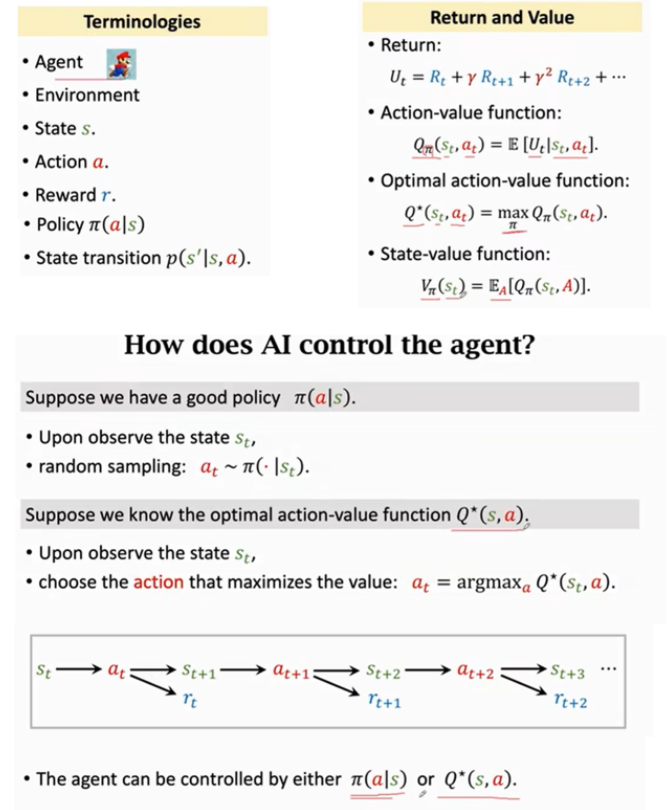
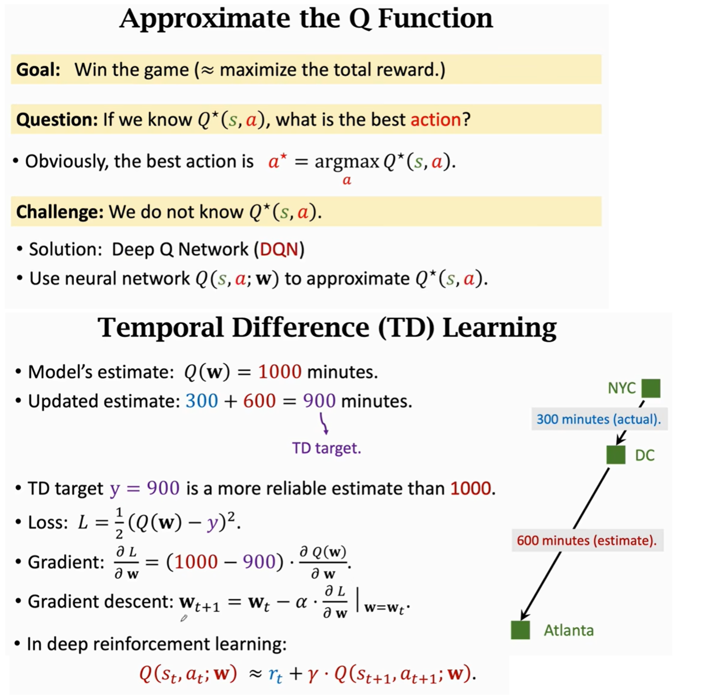
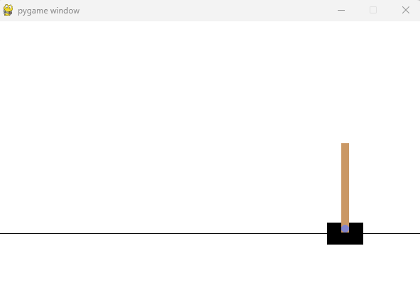
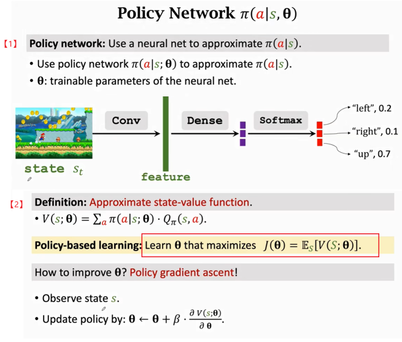
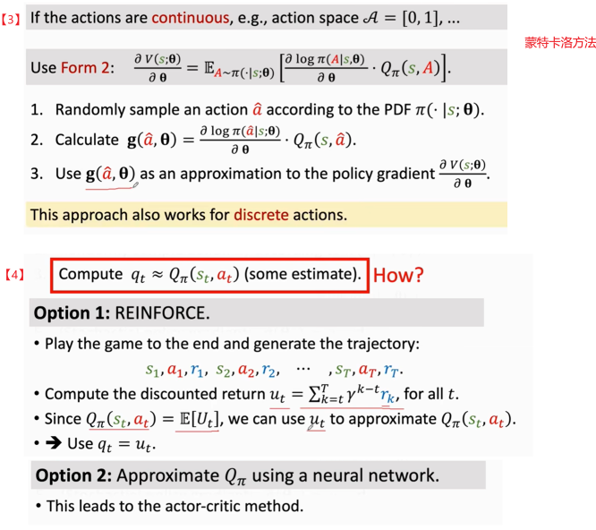
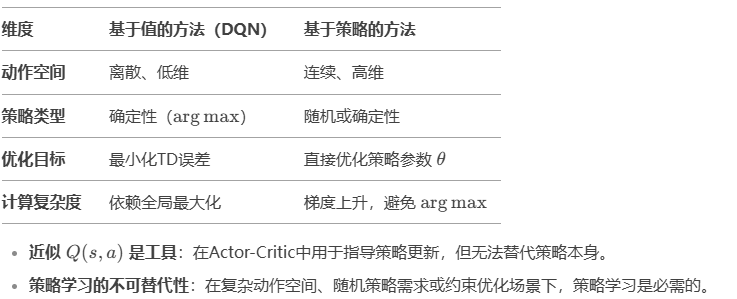

## 强化学习入门

### 1. 基本原理

推荐王树森老师的这个[教学视频](https://www.bilibili.com/video/BV12o4y197US?spm_id_from=333.788.videopod.episodes&vd_source=2173cb93b451f2278a1c87becf3ef529)



#### 1.1 两个容易混淆的价值函数：

在深度强化学习中，**action-value函数**和**state-value函数**是评估策略性能的两个关键函数，它们的区别和联系如下：

**1. 定义**

- **State-Value Function (V函数)**:
  - 表示在状态 \( s \) 下，遵循策略 \( \pi \) 的预期回报。
  
  - 公式：
  $$
    V^\pi(s) = \mathbb{E}_\pi \left[ \sum_{t=0}^\infty \gamma^t R_{t+1} \mid S_t = s \right] 
  $$
  
  
  - 其中，
    $$
    \gamma  是折扣因子，( R_{t+1} ) 是时刻 ( t+1 ) 的奖励。
    $$
  
- **Action-Value Function (Q函数)**:
  
  - 表示在状态 \( s \) 下采取动作 \( a \)，然后遵循策略 Pi 的预期回报。
  
  - 公式：
    $$
    Q^\pi(s, a) = \mathbb{E}_\pi \left[ \sum_{t=0}^\infty \gamma^t R_{t+1} \mid S_t = s, A_t = a \right] 
    $$
    

**2. 区别**

- **输入**:
  
  - V 函数只依赖于状态 \( s \)。
  - Q 函数依赖于状态 \( s \) 和动作 \( a \)。
  
- **用途**:
  - V 函数 用于评估策略在状态 \( s \) 下的表现。
  - Q 函数用于评估在状态 \( s \) 下采取动作 \( a \) 的效果。
  
  

### 2.方式一：基于价值的学习（Value based RL）

#### 2.1 原理

Q(s, a)函数，即action-value函数，能返回状态s下 分别采取各种行动a的未来总的奖励期望值。agent可以根据Q(s, a)函数，在每个状态下采取奖励期望值最大的行动，持续进行下去。

DQN就是要训练出一个深度神经网络，拟合Q(s, a)函数。准确的说，是输入s，输出各种a下的奖励期望。


DQN（Deep Q-Network）是强化学习的一种方法，结合了 Q-Learning 和深度学习。其核心原理如下：

1. **Q-Learning**：使用 Q 函数 Q(s,a)Q(s, a) 估计状态 ss 下采取动作 aa 的长期回报。更新规则：
   $$
   Q(s,a)←Q(s,a)+α[r+γmax⁡Q(s′,a′)−Q(s,a)]
   $$

   $$
   其中 r 是奖励，γ 是折扣因子，s′ 是下一个状态。
   $$

2. **深度神经网络**：用 CNN/MLP 逼近 Q 函数，输入状态 ss，输出所有动作的 Q 值。

3. **经验回放（Experience Replay）**：收集游戏经历，存入缓冲区，**随机采样**训练，减少数据相关性，提高稳定性。

4. **目标网络（Target Network）**：用一个 **滞后的 Q 网络**计算目标 Q 值，减少训练不稳定性。

5. **ε-greedy 策略**：开始时以一定概率随机探索（选择随机动作），逐渐减少探索，更多利用学习到的策略（选择 Q 值最大的动作）。




#### 2.2 实操1 举高高

OpenAI Gym 提供了许多强化学习环境，可以用来训练 DQN（Deep Q-Network）。下面使用 **CartPole-v1**，它的状态空间小，动作空间离散，训练速度快，适合作为 DQN 的入门案例。

**CartPole 任务简介**

- **目标**：控制一个小车，使其上的杆子保持平衡
- **状态空间**：4 维（小车位置、速度、杆子角度、杆子角速度）
- **动作空间**：2 维（向左推、向右推）
- **奖励**：每个时间步 +1，直到杆子倒下或小车超出边界


action只有向左或向右移动小车两个动作，策略看起来是简单的依据当前杆子的角度，杆子往哪边倒就往哪边推车子，这是一个贪心算法，但并不work。

因为车子的状态还包括车子的速度、杆子的角速度，所以杆子的角度并不表示一定像某一侧倾倒，杆子同时也在转动，且有惯性，车子也在移动和有加速度。

```python
import random
import gym
import torch
import torch.nn as nn
import torch.optim as optim
import torch.nn.functional as F
import numpy as np
from collections import deque
import argparse
import os

# 设备选择
device = torch.device("cuda" if torch.cuda.is_available() else "cpu")

# 超参数
gamma = 0.99  # 折扣因子
epsilon = 1.0  # 初始探索率
epsilon_min = 0.01  # 最低探索率
epsilon_decay = 0.995  # 探索率衰减
learning_rate = 1e-3  # 学习率
batch_size = 64  # 经验回放的批量大小
memory_size = 10000  # 经验池大小
target_update_freq = 10  # 目标网络更新频率

env = gym.make("CartPole-v1", render_mode="human")
n_state = env.observation_space.shape[0]  # 状态维度
n_action = env.action_space.n  # 动作数量


# DQN 网络定义
class DQN(nn.Module):
    def __init__(self, state_dim, action_dim):
        super(DQN, self).__init__()
        self.fc1 = nn.Linear(state_dim, 128)
        self.fc2 = nn.Linear(128, 128)
        self.fc3 = nn.Linear(128, action_dim)

    def forward(self, x):
        x = F.relu(self.fc1(x))
        x = F.relu(self.fc2(x))
        return self.fc3(x)


# 初始化网络
model = DQN(n_state, n_action).to(device)
target_model = DQN(n_state, n_action).to(device)
target_model.load_state_dict(model.state_dict())
optimizer = optim.Adam(model.parameters(), lr=learning_rate)
memory = deque(maxlen=memory_size)


def select_action(state, epsilon):
    """基于 ε-greedy 选择动作"""
    if random.random() < epsilon:
        return random.randint(0, n_action - 1)  # 随机选择
    else:
        state = torch.FloatTensor(state).unsqueeze(0).to(device)  # 变换前：[4] -> 变换后：[1, 4]
        return model(state).argmax(1).item()  # 选取 Q 值最大的动作


def train():
    if len(memory) < batch_size:
        return 9999.0  # 经验池数据不足时不训练

    batch = random.sample(memory, batch_size)
    states, actions, rewards, next_states, dones = zip(*batch)

    states = torch.FloatTensor(states).to(device)  # (batch_size, 4)
    actions = torch.LongTensor(actions).unsqueeze(1).to(device)  # (batch_size,) -> (batch_size, 1)
    rewards = torch.FloatTensor(rewards).unsqueeze(1).to(device)  # (batch_size,) -> (batch_size, 1)
    next_states = torch.FloatTensor(next_states).to(device)  # (batch_size, 4)
    dones = torch.FloatTensor(dones).unsqueeze(1).to(device)  # (batch_size,) -> (batch_size, 1)

    # 计算当前 Q 值
    q_values = model(states).gather(1, actions)  # 从 Q(s, a) 选取执行的动作 Q 值

    # 计算目标 Q 值
    next_q_values = target_model(next_states).max(1, keepdim=True)[0]  # 选取 Q(s', a') 的最大值
    target_q_values = rewards + gamma * next_q_values * (1 - dones)  # TD 目标

    # 计算损失
    loss = F.mse_loss(q_values, target_q_values.detach())
    optimizer.zero_grad()
    loss.backward()
    optimizer.step()

    return loss.item()


def save_checkpoint(id):
    path=f"dqn_checkpoint_{id}.pth"
    torch.save(model.state_dict(), path)
    print(f"Checkpoint saved to {path}")


def load_checkpoint(path):
    if os.path.exists(path):
        model.load_state_dict(torch.load(path, map_location=device))
        print(f"Checkpoint loaded from {path}")
    else:
        print("No checkpoint found, starting from scratch.")


def main(mode):
    global epsilon

    if mode == "train":
        episodes = 500
        for episode in range(episodes):
            state = env.reset()
            state = state[0]  # 适配 Gym v26
            total_reward = 0

            while True:
                action = select_action(state, epsilon)
                next_state, reward, done, _, _ = env.step(action)

                # 经验回放缓存
                memory.append((state, action, reward, next_state, done))
                state = next_state
                total_reward += reward

                # 训练 DQN
                loss = train()

                if done:
                    break

            # 逐步降低 epsilon，减少随机探索，提高利用率
            epsilon = max(epsilon_min, epsilon * epsilon_decay)

            # 定期更新目标网络，提高稳定性
            if episode % target_update_freq == 0:
                target_model.load_state_dict(model.state_dict())

            # 定期保存模型
            #if episode % 50 == 0:
            if total_reward > 1000:
                save_checkpoint(total_reward)

            print(f"Episode {episode}, Reward: {total_reward}, Epsilon: {epsilon:.3f}, loss:{loss}")

    elif mode == "infer":
        load_checkpoint("./dqn_checkpoint.pth")
        state = env.reset()
        state = state[0]
        total_reward = 0

        while True:
            env.render()
            action = select_action(state, 0)  # 纯利用，epsilon=0
            state, reward, done, _, _ = env.step(action)
            total_reward += reward

            if done:
                break

        print(f"Inference finished. Total reward: {total_reward}")


if __name__ == "__main__":
    main("train")
```

训练效果：

```shell
#一开始杆子竖立不了多久 （看total reward值）
Episode 3, Reward: 24.0, Epsilon: 0.980, loss:0.08007372915744781
Episode 4, Reward: 20.0, Epsilon: 0.975, loss:0.028971994295716286

# 400个episode的时候，杆子可以竖立很久，图片上可以看到不怎么晃
Episode 383, Reward: 8844.0, Epsilon: 0.146, loss:0.049317866563797
Episode 384, Reward: 266.0, Epsilon: 0.145, loss:0.011158960871398449
Episode 385, Reward: 2882.0, Epsilon: 0.144, loss:0.006994911935180426
Episode 386, Reward: 19383.0, Epsilon: 0.144, loss:0.02331690490245819
Episode 387, Reward: 13857.0, Epsilon: 0.143, loss:0.007248120382428169
Episode 388, Reward: 12.0, Epsilon: 0.142, loss:0.27341461181640625
Episode 389, Reward: 60.0, Epsilon: 0.142, loss:0.019126372411847115
Episode 390, Reward: 2144.0, Epsilon: 0.141, loss:0.01851404272019863
Episode 391, Reward: 5288.0, Epsilon: 0.140, loss:0.009122185409069061
Episode 392, Reward: 100.0, Epsilon: 0.139, loss:0.0026022980455309153
Episode 393, Reward: 1567.0, Epsilon: 0.139, loss:0.006415518932044506
Episode 394, Reward: 3256.0, Epsilon: 0.138, loss:1.4469681978225708
#中间效果变差过
Episode 489, Reward: 287.0, Epsilon: 0.086, loss:0.053130991756916046
Episode 490, Reward: 222.0, Epsilon: 0.085, loss:0.09821200370788574
Episode 491, Reward: 1530.0, Epsilon: 0.085, loss:0.4331984519958496
Episode 492, Reward: 12340.0, Epsilon: 0.084, loss:0.03685907647013664
#到这里的时候，已经过去两个小时没有输出了，杆子屹立不倒...
```



### 3. 方式二：基于策略的学习（Policy based RL）

#### 3.1 原理





我没有想明白的是：如果能够近似计算Q(s,a)，那似乎也就回到了DQN，不需要做策略学习了？

AI这样说上面训练过程不需要拟合Q函数，只需要计算一次从s开始采取a的游戏局的return就可以。两个方法的区别：



另外可以从下面的代码看出：基于策略的强化学习（如Policy Gradient方法）的一个重要优势是：**它不需要每一步（step-wise）都有明确的即时奖励信号，只要在整局游戏（episode）结束时能获得一个累积奖励（或最终胜负结果），就可以直接训练策略网络**。这是与基于值函数的方法（如DQN）的关键区别之一。

这样我就可以开发一个五子棋小游戏，不需要每一步落子都显式编程给出奖励值，只需要在棋局终局给胜者10000负者-10000的奖励即可。降低了设计的难度。

#### 3.2 实操1 举高高

还是平衡车小游戏：

```python
import gym
import numpy as np
import torch
import torch.nn as nn
import torch.optim as optim
from torch.distributions import Categorical
import argparse
import os
import matplotlib.pyplot as plt

# 设置随机种子
torch.manual_seed(42)
np.random.seed(42)

# 检测设备
device = torch.device("cuda" if torch.cuda.is_available() else "cpu")
print(f"Using device: {device}")


# ----------------------------
# 1. 策略网络定义
# ----------------------------
class PolicyNetwork(nn.Module):
    def __init__(self, state_dim, action_dim, hidden_dim=128):
        super(PolicyNetwork, self).__init__()
        self.fc1 = nn.Linear(state_dim, hidden_dim)
        self.fc2 = nn.Linear(hidden_dim, action_dim)
        self.softmax = nn.Softmax(dim=-1)

    def forward(self, x):
        if len(x.shape) == 1:
            x = x.unsqueeze(0)  # [state_dim] -> [1, state_dim]
        x = torch.relu(self.fc1(x))  # [batch_size, hidden_dim]
        logits = self.fc2(x)  # [batch_size, action_dim]
        probs = self.softmax(logits)  # [batch_size, action_dim]
        return probs


# ----------------------------
# 2. Checkpoint 保存与加载
# ----------------------------
def save_checkpoint(policy, optimizer, episode, reward, path="checkpoint.pth"):
    torch.save({
        'policy_state_dict': policy.state_dict(),
        'optimizer_state_dict': optimizer.state_dict(),
        'episode': episode,
        'reward': reward
    }, path)
    print(f"Checkpoint saved to {path} (Reward: {reward:.2f})")


def load_checkpoint(policy, optimizer, path="checkpoint.pth"):
    if os.path.exists(path):
        checkpoint = torch.load(path)
        policy.load_state_dict(checkpoint['policy_state_dict'])
        optimizer.load_state_dict(checkpoint['optimizer_state_dict'])
        print(f"Loaded checkpoint from {path} (Episode: {checkpoint['episode']}, Reward: {checkpoint['reward']:.2f})")
        return checkpoint['episode'], checkpoint['reward']
    else:
        print(f"No checkpoint found at {path}")
        return 0, 0


# ----------------------------
# 3. 训练函数（带Checkpoint和可视化）
# ----------------------------
def train(env_name="CartPole-v1", hidden_dim=128, lr=1e-2,
          gamma=0.99, max_episodes=1000, print_interval=2):
    env = gym.make(env_name, render_mode="human")  # 开启可视化
    state_dim = env.observation_space.shape[0]
    action_dim = env.action_space.n

    policy = PolicyNetwork(state_dim, action_dim, hidden_dim).to(device)
    optimizer = optim.Adam(policy.parameters(), lr=lr)

    # 尝试加载Checkpoint
    checkpoint_path = "./pbrl_checkpoint_150_2955xx.0.pth"
    start_episode, _ = load_checkpoint(policy, optimizer, checkpoint_path)
    episode_rewards = []

    for episode in range(start_episode, max_episodes):
        state = env.reset()
        state = state[0]
        states, actions, rewards = [], [], []

        while True:
            state_tensor = torch.FloatTensor(state).to(device)
            state_tensor = state_tensor.unsqueeze(0)
            probs = policy(state_tensor)
            m = Categorical(probs) #根据各种action的概率值probs创建一个离散的概率分布
            action = m.sample() #使用该概率分布进行抽样，得到一个具体的action

            next_state, reward, done, _, _ = env.step(action.item())

            states.append(state_tensor.squeeze(0))
            actions.append(action.squeeze(0))
            actions.append(action)
            rewards.append(reward)

            state = next_state
            if done:
                break
            '''到后面模型能力强了，游戏一把玩好久也不死。就导致两次训练的时间间隔很长
            粗暴的截断会有两个问题：
            1、可能导致游戏后面才会出现的states，从来没有出现在训练集里，使得模型失去泛化能力
            2、compute_returns不准确了，这个可能对于密集奖励型游戏还好，毕竟到了后面状态，伽马的n次方接近0，后面的项影响有限
            '''
            '''if  len(rewards) > 1000:
                print('brutally cut')
                break'''

        # 计算回报
        total_reward = sum(rewards)
        episode_rewards.append(total_reward)

        returns = compute_returns(rewards, gamma)
        returns = (returns - returns.mean()) / (returns.std() + 1e-9)

        # 更新策略
        loss = train_policy_network(policy, optimizer, states, actions, returns)

        # 保存Checkpoint（如果回报>1000）
        if total_reward > 1000:
            checkpoint_path = f"./pbrl_checkpoint_{episode}_{total_reward}.pth"
            save_checkpoint(policy, optimizer, episode, total_reward, checkpoint_path)

        # 打印进度
        if (episode + 1) % print_interval == 0:
            avg_reward = np.mean(episode_rewards[-print_interval:])
            print(f"Episode {episode + 1}, Avg Reward: {avg_reward:.2f}, Loss: {loss:.4f}")

        # 提前终止
        if len(episode_rewards) >= 100 and np.mean(episode_rewards[-100:]) >= 2000:
            print(f"Solved at Episode {episode + 1}!")
            break

    env.close()
    return episode_rewards


# ----------------------------
# 4. 推理函数（演示训练好的模型）
# ----------------------------
def test(env_name="CartPole-v1", hidden_dim=128, checkpoint_path="checkpoint.pth"):
    env = gym.make(env_name, render_mode="human")  # 开启可视化
    state_dim = env.observation_space.shape[0]
    action_dim = env.action_space.n

    policy = PolicyNetwork(state_dim, action_dim, hidden_dim).to(device)
    optimizer = optim.Adam(policy.parameters(), lr=0.001)  # 仅占位，实际不用于测试

    # 加载Checkpoint
    load_checkpoint(policy, optimizer, checkpoint_path)

    print("Starting inference...")
    while True:  # 无限运行直到手动停止
        state = env.reset()[0]
        total_reward = 0

        while True:
            with torch.no_grad():
                state_tensor = torch.FloatTensor(state).to(device)
                probs = policy(state_tensor)
                action = torch.argmax(probs).item()  # 直接选最优动作

            next_state, reward, done, _, _ = env.step(action)
            total_reward += reward
            state = next_state

            if done:
                print(f"Inference Reward: {total_reward}")
                break


# ----------------------------
# 5. 辅助函数， 用于策略梯度更新（替代Q(s,a) 的蒙特卡洛估计）
# ----------------------------
def compute_returns(rewards, gamma=0.99):
    returns = []
    R = 0
    for r in reversed(rewards):
        R = r + gamma * R
        returns.insert(0, R)
    return torch.tensor(returns, device=device)


def train_policy_network(policy, optimizer, states, actions, returns):
    # 将列表中的状态/动作/回报堆叠成张量， 假设一把游戏玩下来的状态个数是T
    states = torch.stack(states)  # [T, 4]
    actions = torch.stack(actions) # [T]
    returns = returns  # [T]
    # 1. 通过策略网络计算动作概率
    probs = policy(states)  # [T, action_dim]
    # 2. 创建分类分布（用于采样和计算对数概率）
    m = Categorical(probs)
    # 3. 计算所选动作的对数概率
    log_probs = m.log_prob(actions)  # [T,] 
    # 4. 因为基于策略的强化学习要使用梯度上升使得state-value函数的期望最大化，所以损失函数是期望值的负数
    # returns已经在函数外面进行了带折扣的汇总运算，也就是已经是U了，不是每一步的r
    loss = -(log_probs * returns).mean()
    optimizer.zero_grad()
    loss.backward()
    optimizer.step()
    return loss.item()


# ----------------------------
# 6. 主函数（命令行参数解析）
# ----------------------------
def main(mode):
    if mode == "train":
        rewards = train()
        plt.plot(rewards)
        plt.xlabel("Episode")
        plt.ylabel("Total Reward")
        plt.title("Policy Gradient Training")
        plt.show()
    elif mode == "test":
        test(checkpoint_path="./pbrl_checkpoint_1001.0.pth")


if __name__ == "__main__":
    main("train")
```

效果类似基于价值的强化学习，150个episode后，一根棍子可以举很久不倒。

#### 3.3 实操2 左右博弈五子棋

先让AI帮忙写一个五子棋程序，提供reset()  step()等接口

```python
import time

import numpy as np
import pygame
import sys

# 定义颜色
WHITE = (255, 255, 255)
BLACK = (0, 0, 0)
GRAY = (200, 200, 200)
GREEN = (0, 255, 0)

# 棋盘大小
BOARD_SIZE = 9
CELL_SIZE = 50
WINDOW_SIZE = BOARD_SIZE * CELL_SIZE

class Gomoku:
    def __init__(self):
        """ 初始化五子棋环境 """
        pygame.init()
        self.screen = pygame.display.set_mode((WINDOW_SIZE, WINDOW_SIZE))
        pygame.display.set_caption("五子棋")
        self.font = pygame.font.Font(None, 36)
        self.reset()

    def reset(self):
        """ 重新初始化棋局，在中心落一个黑子 """
        self.board = np.zeros((BOARD_SIZE, BOARD_SIZE), dtype=int)
        self.last_move = None
        mid = BOARD_SIZE // 2
        self.board[mid, mid] = 1  # 黑棋先手
        self.last_move = (mid, mid)
        self.game_over = False
        self.winner = None
        return self.board.copy()

    def step(self, role, x, y):
        """ 执行落子，并计算局部奖励 """
        if self.game_over or self.board[x, y] != 0:
            return self.board.copy(), 0, self.game_over  # 非法落子

        self.board[x, y] = role
        self.last_move = (x, y)

        # 检查胜负
        if self.check_win(x, y, role):
            self.game_over = True
            self.winner = role
            reward = 10000 if role == 1 else -10000
        else:
            reward = self.evaluate_move(x, y, role)
        self.render()
        return self.board.copy(), reward, self.game_over

    def evaluate_move(self, x, y, role):
        """ 评估当前落子的奖励 """
        reward = 0
        directions = [(1, 0), (0, 1), (1, 1), (1, -1)]

        def count_stones(x, y, dx, dy, role):
            """ 计算某个方向上的连子数量 """
            count, block = 0, 0
            for d in [-1, 1]:
                nx, ny = x, y
                while True:
                    nx += d * dx
                    ny += d * dy
                    if 0 <= nx < BOARD_SIZE and 0 <= ny < BOARD_SIZE:
                        if self.board[nx, ny] == role:
                            count += 1
                        elif self.board[nx, ny] == -role:
                            block += 1
                            break
                        else:
                            break
                    else:
                        block += 1
                        break
            return count, block

        for dx, dy in directions:
            count, block = count_stones(x, y, dx, dy, role)

            # 活三（两端均为空）
            if count == 2 and block == 0:
                reward += 10
            # 冲四（只有一端为空）
            elif count == 3 and block == 1:
                reward += 20
            # 活四（两端均为空）
            elif count == 3 and block == 0:
                reward += 50

            # 防守奖励：如果成功堵截对手的活三或活四
            opp_count, opp_block = count_stones(x, y, dx, dy, -role)
            if opp_count == 3 and opp_block == 0:  # 阻挡对方活四
                reward += 30
            elif opp_count == 2 and opp_block == 0:  # 阻挡对方活三
                reward += 15

        return reward

    def check_win(self, x, y, role):
        """ 判断当前落子是否形成五连胜 """
        directions = [(1, 0), (0, 1), (1, 1), (1, -1)]
        for dx, dy in directions:
            count = 1
            for d in [-1, 1]:  # 计算两个方向
                nx, ny = x, y
                while True:
                    nx += d * dx
                    ny += d * dy
                    if 0 <= nx < BOARD_SIZE and 0 <= ny < BOARD_SIZE and self.board[nx, ny] == role:
                        count += 1
                    else:
                        break
            if count >= 5:
                return True
        return False

    def render(self):
        """ 渲染棋盘 """
        self.screen.fill(WHITE)

        # 画网格
        for i in range(BOARD_SIZE):
            pygame.draw.line(self.screen, GRAY, (i * CELL_SIZE + CELL_SIZE // 2, CELL_SIZE // 2),
                             (i * CELL_SIZE + CELL_SIZE // 2, WINDOW_SIZE - CELL_SIZE // 2), 2)
            pygame.draw.line(self.screen, GRAY, (CELL_SIZE // 2, i * CELL_SIZE + CELL_SIZE // 2),
                             (WINDOW_SIZE - CELL_SIZE // 2, i * CELL_SIZE + CELL_SIZE // 2), 2)

        # 画棋子
        for x in range(BOARD_SIZE):
            for y in range(BOARD_SIZE):
                if self.board[x, y] == 1:  # 黑子
                    pygame.draw.circle(self.screen, BLACK, (y * CELL_SIZE + CELL_SIZE // 2,
                                                             x * CELL_SIZE + CELL_SIZE // 2), CELL_SIZE // 3)
                elif self.board[x, y] == -1:  # 白子
                    pygame.draw.circle(self.screen, WHITE, (y * CELL_SIZE + CELL_SIZE // 2,
                                                             x * CELL_SIZE + CELL_SIZE // 2), CELL_SIZE // 3)
                    pygame.draw.circle(self.screen, BLACK, (y * CELL_SIZE + CELL_SIZE // 2,
                                                             x * CELL_SIZE + CELL_SIZE // 2), CELL_SIZE // 3, 2)

        # 标记最后一手棋
        if self.last_move:
            lx, ly = self.last_move
            pygame.draw.circle(self.screen, GREEN, (ly * CELL_SIZE + CELL_SIZE // 2,
                                                     lx * CELL_SIZE + CELL_SIZE // 2), CELL_SIZE // 3 + 3, 2)

        # 游戏结束显示赢家
        if self.game_over:
            msg = "black wins." if self.winner == 1 else "white wins."
            text = self.font.render(msg, True, BLACK)
            self.screen.blit(text, (WINDOW_SIZE // 3, WINDOW_SIZE // 2))

        pygame.display.flip()

    def play_human(self):
        """ 让人类玩家交互式落子 """
        running = True
        role = -1  # 轮到白棋（-1），因为黑棋已经在 reset() 里落了一子
        while running:
            self.render()
            for event in pygame.event.get():
                if event.type == pygame.QUIT:
                    running = False
                    pygame.quit()
                    sys.exit()
                elif event.type == pygame.MOUSEBUTTONDOWN and not self.game_over:
                    x, y = event.pos[1] // CELL_SIZE, event.pos[0] // CELL_SIZE
                    _, _, done = self.step(role, x, y)
                    if not done:
                        role *= -1  # 轮到另一方落子
        pygame.quit()

    def human_play(self):
        """ 让人类玩家落子，阻塞直到有效输入，并返回新状态 """
        role = -1  # 人类执白
        self.render()

        while True:  # 阻塞等待有效输入
            for event in pygame.event.get():
                if event.type == pygame.QUIT:
                    pygame.quit()
                    exit()  # 退出程序

                elif event.type == pygame.MOUSEBUTTONDOWN and not self.game_over:
                    x, y = event.pos[1] // CELL_SIZE, event.pos[0] // CELL_SIZE

                    # 确保落子位置未被占据
                    if self.board[x, y] == 0:
                        state, reward, done = self.step(role, x, y)
                        return state, reward, done  # 返回新状态、奖励、是否终局


```

然后是训练的代码：

```python
import torch
import torch.nn as nn
import torch.optim as optim
import torch.nn.functional as F
import numpy as np
import time
import pygame
import numpy as np
from collections import Counter
import os
from gomoku import Gomoku  # 假设 gomoku.py 里定义了五子棋环境
from torch.distributions import Categorical

# 设备初始化
device = torch.device("cuda" if torch.cuda.is_available() else "cpu")


# 定义策略网络
class PolicyNet(nn.Module):
    def __init__(self):
        super(PolicyNet, self).__init__()
        self.conv1 = nn.Conv2d(1, 32, kernel_size=3, padding=1)
        self.conv2 = nn.Conv2d(32, 64, kernel_size=3, padding=1)
        self.conv3 = nn.Conv2d(64, 128, kernel_size=3, padding=1)
        self.fc = nn.Linear(128 * 9 * 9, 9 * 9)

    def forward(self, state):
        batch_size = state.size(0)  # 获取 batch 大小

        # 计算合法落子 mask（state=0 的地方可以落子）
        mask = (state.view(batch_size, 9, 9) == 0).float()  # [batch, 9, 9]，可落子=1，不可落子=0
        mask = mask.view(batch_size, 81)  # [batch, 81]

        # 通过 CNN 提取特征
        x = F.relu(self.conv1(state))
        x = F.relu(self.conv2(x))
        x = F.relu(self.conv3(x))

        # 展平成 [batch, 128 * 9 * 9]
        x = x.view(batch_size, -1)
        x = self.fc(x)  # 输出 [batch, 81]，即 9x9 个位置的 logits

        # 对不可落子的位置赋极小值 (-inf)
        x = x.masked_fill(mask == 0, float('-inf'))  # 屏蔽不可落子的位置

        # 计算 softmax 仅在合法位置
        x = F.softmax(x, dim=1)

        return x.view(batch_size, 9, 9)  # 变回 [batch, 9, 9] 的棋盘格式

# 选择动作
def select_action(policy_net, state):
    """
    选择动作，避免已落子点，并处理棋盘已满的情况。

    :param policy_net: 策略网络
    :param state: 当前棋盘状态 (9x9)
    :return: 选择的动作坐标 (x, y) 或 None（表示平局）
    """
    state_tensor = torch.tensor(state, dtype=torch.float32, device=device).unsqueeze(0).unsqueeze(0)
    policy_net.eval()
    with torch.no_grad():
        action_probs = policy_net(state_tensor).squeeze().detach().cpu().numpy()  # 转到CPU计算
    policy_net.train()


    # 不能选择已落子点
    action_probs[state != 0] = 0

    total_prob = action_probs.sum()
    if total_prob == 0:
        return None  # 棋盘已满，平局

    action_probs /= total_prob  # 归一化
    choice = np.random.choice(9 * 9, p=action_probs.flatten())
    return divmod(choice, 9)  # 返回 (x, y) 坐标

#用来监控每局赢
def entropy(coords):
    if not coords:
        return 0  # 空列表的熵定义为0

    counter = Counter(coords)  # 统计每个坐标的出现次数
    total = len(coords)  # 总数
    probs = np.array([count / total for count in counter.values()])  # 计算概率分布
    return -np.sum(probs * np.log2(probs))  # 计算熵（以2为底）

# 运行完整一局游戏，收集经验
def play_one_episode(policy_net, opponent_net, win_coords):
    env = Gomoku()
    state = env.reset()
    states, actions, rewards = [], [], []
    turn = -1 #棋盘reset后，中间有一颗黑子，黑方已经下过了，现在轮到白方
    blackwin = False


    while True:
        action = select_action(policy_net if turn == 1 else opponent_net, state * turn)
        if action is None:  # 平局
            print(f"Draw detected. Ending episode. rewards len:{len(rewards)}")
            break
        #print(f"on {action[0], action[1]}")
        new_state, reward, done = env.step(turn, *action)

        state_tensor = torch.tensor(state*turn, dtype=torch.float32, device=device).unsqueeze(0).unsqueeze(0)
        #双方的信息都收集，还是只收集turn==1的呢？ 我觉得可以都收集，但是turn=-1的时候，state要乘以-1，都看到一致的执黑
        states.append(state_tensor.squeeze(0))
        actions.append(torch.tensor(action, dtype=torch.long, device=device))
        rewards.append(reward)

        if done:
            if turn == 1 and reward > 0:
                blackwin = True
            win_coords.append(action)
            break

        state = new_state
        turn *= -1  # 切换回合

    return states, actions, rewards, blackwin


# 计算折扣回报（G_t）
def compute_returns(rewards, gamma=0.99):
    returns = []
    G = 0
    for r in reversed(rewards):
        G = r + gamma * G
        returns.insert(0, G)  # 按时间步正序排列
    return torch.tensor(returns, dtype=torch.float32, device=device)


def train_policy_network(policy, optimizer, states, actions, returns):
    """
    policy: 策略网络
    optimizer: 优化器
    states:  [T, 9, 9]，每一步的棋盘状态
    actions: [T, 2]，每一步 (x, y) 位置的动作
    returns: [T]，每一步的折扣回报
    """
    states = torch.stack(states)  # [T, 1, 9, 9]
    actions = torch.stack(actions)  # [T, 2]，包含 x 和 y 坐标

    # **Step 1: 计算 state_mask**
    state_mask = (states != 0).float().squeeze(1)  # [T, 9, 9]，非 0（已落子）为 1，空位为 0

    # **Step 2: 计算策略网络输出**
    probs = policy(states)  # [T, 9, 9]

    # **Step 3: 过滤已落子点**
    masked_probs = probs * (1 - state_mask)  # 已落子的位置概率设为 0
    masked_probs = masked_probs / (masked_probs.sum(dim=(1, 2), keepdim=True) + 1e-9)  # 重新归一化

    # **Step 4: 计算 log 概率**
    # 从 masked_probs 这个 [T, 9, 9] 的张量中，提取每一步行动 actions[x, y] 处的概率, 并求log()
    log_probs = torch.log( masked_probs[torch.arange(actions.shape[0]), actions[:, 0], actions[:, 1]] + 1e-9)

    # **Step 5: 归一化 returns**
    returns = (returns - returns.mean()) / (returns.std() + 1e-9)

    # **Step 6: 计算损失**
    loss = -(log_probs * returns).mean()

    optimizer.zero_grad()
    loss.backward()
    optimizer.step()

    return loss.item()

# 主训练循环
def train(policy_net, episodes=10000, checkpoint_path='policy.pth', gamma=0.99):

    opponent_net = PolicyNet()
    optimizer = optim.Adam(policy_net.parameters(), lr=0.0001)

    # 加载已有的模型参数
    if os.path.exists(checkpoint_path):
        policy_net.load_state_dict(torch.load(checkpoint_path, map_location=device))
        opponent_net.load_state_dict(torch.load(checkpoint_path, map_location=device))

    policy_net = policy_net.to(device)
    opponent_net = opponent_net.to(device)
    win_cnt = 0

    win_coords = []
    for episode in range(episodes):
        # 运行一局游戏，收集 (states, actions, rewards), win_coords收集一段时间的赢的坐标，用于监控是不是棋局总是在重复
        states, actions, rewards, blackwin = play_one_episode(policy_net, opponent_net, win_coords)
        if blackwin:
            win_cnt += 1

        # 计算折扣回报
        returns = compute_returns(rewards, gamma)

        # 更新策略网络
        loss = train_policy_network(policy_net, optimizer, states, actions, returns)

        # 训练完成，进行对局 UI 更新
        #pygame.display.update()
        #time.sleep(1)

        # 每 100 轮更新对手策略，
        update_interval = 100
        if episode % update_interval == 0:
            opponent_net.load_state_dict(policy_net.state_dict())
            torch.save(policy_net.state_dict(), checkpoint_path)
            entro = entropy(win_coords)
            print(f'Episode {episode}: Model updated, checkpoint saved, Loss: {loss:.4f}, win_ratio:{win_cnt / update_interval:.2f},entropy:{entro:.2f}')
            win_cnt = 0
            win_coords = []

def play_with_human(checkpoint_path='policy.pth'):
    env = Gomoku()

    policy_net = PolicyNet().to(device)
    policy_net.load_state_dict(torch.load(checkpoint_path))
    state = env.reset()
    turn = -1  # AI 执黑，人类执白
    done = False

    while not done:
        if turn == 1:
            action = select_action(policy_net, state)
            state, _, done = env.step(1, *action)  # AI 落子
        else:
            state, _, done = env.human_play()  # 人类落子

        turn *= -1  # 轮流落子


if __name__ == "__main__":
    import argparse
    policy = PolicyNet().to(device)
    arg = "train"
    if arg == "train":
        train(policy)
    else:
        play_with_human()

```

到目前为止，还不能有效学习，实验失败中。主要的问题：

棋局很单一，每次赢的落点坐标随机性不够