## 强化学习入门

### 1. 基本原理

推荐王树森老师的这个[教学视频](https://www.bilibili.com/video/BV12o4y197US?spm_id_from=333.788.videopod.episodes&vd_source=2173cb93b451f2278a1c87becf3ef529)

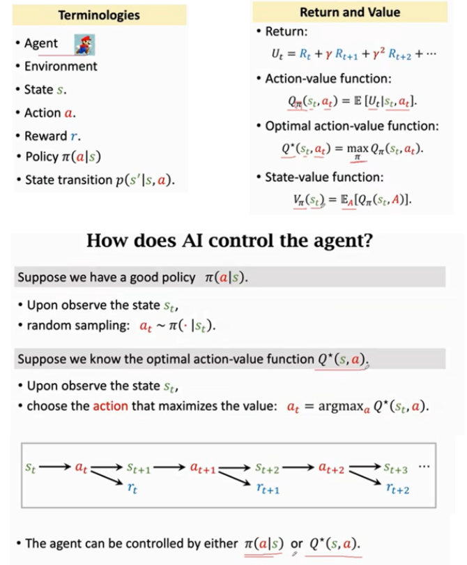

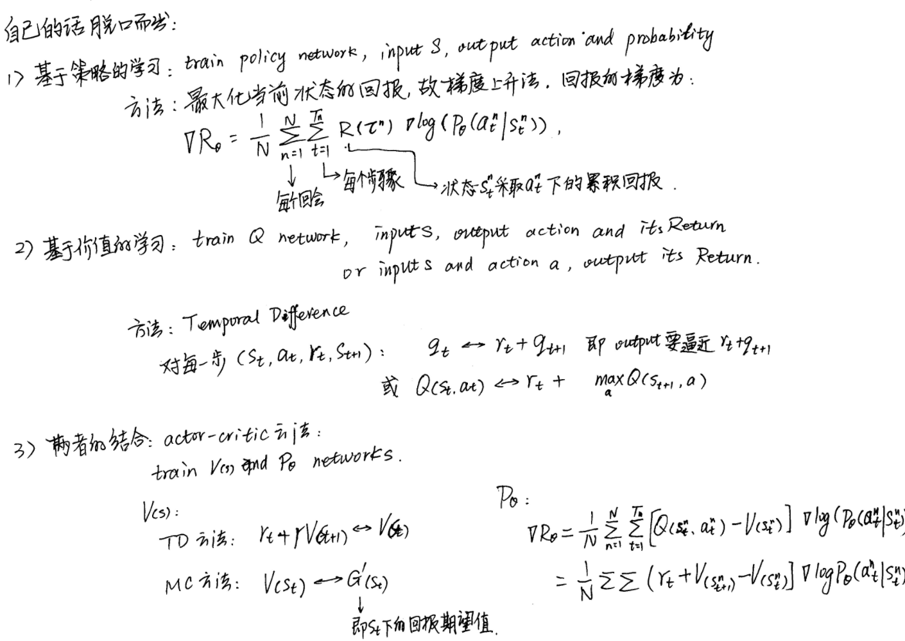

#### 1.1 两个容易混淆的价值函数：

在深度强化学习中，**action-value函数**和**state-value函数**是评估策略性能的两个关键函数，它们的区别和联系如下：

**1. 定义**

- **State-Value Function (V函数)**:
  
  - 表示在状态 \( s \) 下，遵循策略 \( \pi \) 的预期回报。
  
  - 公式：
  $$
    V^\pi(s) = \mathbb{E}_\pi \left[ \sum_{t=0}^\infty \gamma^t R_{t+1} \mid S_t = s \right] 
  $$
  
  
  - 其中，
    $$
    \gamma  是折扣因子，( R_{t+1} ) 是时刻 ( t+1 ) 的奖励。
    $$
  
- **Action-Value Function (Q函数)**:
  
  - 表示在状态 \( s \) 下采取动作 \( a \)，然后遵循策略 Pi 的预期回报。
  
  - 公式：
    $$
    Q^\pi(s, a) = \mathbb{E}_\pi \left[ \sum_{t=0}^\infty \gamma^t R_{t+1} \mid S_t = s, A_t = a \right] 
    $$
    

**2. 区别**

- **输入**:
  
  - V 函数只依赖于状态 \( s \)。
  - Q 函数依赖于状态 \( s \) 和动作 \( a \)。
  
- **用途**:
  - V 函数 用于评估策略在状态 \( s \) 下的表现。
  - Q 函数用于评估在状态 \( s \) 下采取动作 \( a \) 的效果。
  


### 2.方式一：基于价值的学习（Value based RL）

#### 2.1 原理

又叫Q-Learning。

Q(s, a)函数，即action-value函数，能返回状态s下 分别采取各种行动a的未来总的奖励期望值。agent可以根据Q(s, a)函数，在每个状态下采取奖励期望值最大的行动，持续进行下去。

DQN就是要训练出一个深度神经网络，拟合Q(s, a)函数。准确的说，是输入s，输出各种a下的奖励期望。


DQN（Deep Q-Network）是强化学习的一种方法，结合了 Q-Learning 和深度学习。其核心原理如下：

1. **Q-Learning**：使用 Q 函数 Q(s,a)Q(s, a) 估计状态 ss 下采取动作 aa 的长期回报。更新规则：
   $$
   Q(s,a)←Q(s,a)+α[r+γmax⁡Q(s′,a′)−Q(s,a)]
   $$

   $$
   其中 r 是奖励，γ 是折扣因子，s′ 是下一个状态。
   $$

2. **深度神经网络**：用 CNN/MLP 逼近 Q 函数，输入状态 ss，输出所有动作的 Q 值。

3. **经验回放（Experience Replay）**：收集游戏经历，存入缓冲区，**随机采样**训练，减少数据相关性，提高稳定性。

4. **目标网络（Target Network）**：用一个 **滞后的 Q 网络**计算目标 Q 值，减少训练不稳定性。

5. **ε-greedy 策略**：开始时以一定概率随机探索（选择随机动作），逐渐减少探索，更多利用学习到的策略（选择 Q 值最大的动作）。


下图是李宏毅老师的课件笔记：

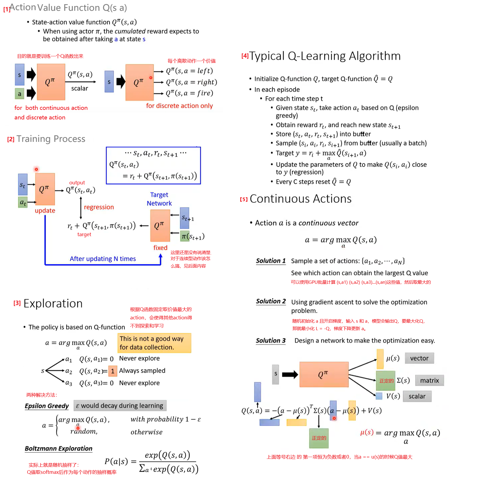


我的理解：对于状态和动作空间离散且有限的场景（甚至连续的也可以？），还可以用策略迭代更新 + 蒙特卡洛方法，从而得到最优策略：

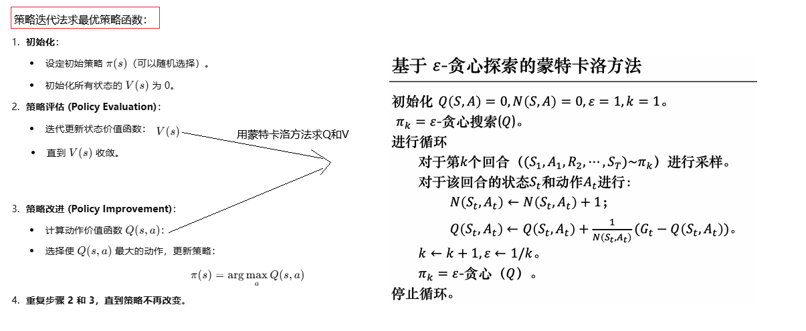

#### 2.2 实操1 cartpole

OpenAI Gym 提供了许多强化学习环境，可以用来训练 DQN（Deep Q-Network）。下面使用 **CartPole-v1**，它的状态空间小，动作空间离散，训练速度快，适合作为 DQN 的入门案例。

**CartPole 任务简介**

- **目标**：控制一个小车，使其上的杆子保持平衡
- **状态空间**：4 维（小车位置、速度、杆子角度、杆子角速度）
- **动作空间**：2 维（向左推、向右推）
- **奖励**：每个时间步 +1，直到杆子倒下或小车超出边界


action只有向左或向右移动小车两个动作，策略看起来是简单的依据当前杆子的角度，杆子往哪边倒就往哪边推车子，这是一个贪心算法，但并不work。

因为车子的状态还包括车子的速度、杆子的角速度，所以杆子的角度并不表示一定像某一侧倾倒，杆子同时也在转动，且有惯性，车子也在移动和有加速度。

```python
import random
import gym
import torch
import torch.nn as nn
import torch.optim as optim
import torch.nn.functional as F
import numpy as np
from collections import deque
import argparse
import os

# 设备选择
device = torch.device("cuda" if torch.cuda.is_available() else "cpu")

# 超参数
gamma = 0.99  # 折扣因子
epsilon = 1.0  # 初始探索率
epsilon_min = 0.01  # 最低探索率
epsilon_decay = 0.995  # 探索率衰减
learning_rate = 1e-3  # 学习率
batch_size = 64  # 经验回放的批量大小
memory_size = 10000  # 经验池大小
target_update_freq = 10  # 目标网络更新频率

env = gym.make("CartPole-v1", render_mode="human")
n_state = env.observation_space.shape[0]  # 状态维度
n_action = env.action_space.n  # 动作数量


# DQN 网络定义
class DQN(nn.Module):
    def __init__(self, state_dim, action_dim):
        super(DQN, self).__init__()
        self.fc1 = nn.Linear(state_dim, 128)
        self.fc2 = nn.Linear(128, 128)
        self.fc3 = nn.Linear(128, action_dim)

    def forward(self, x):
        x = F.relu(self.fc1(x))
        x = F.relu(self.fc2(x))
        return self.fc3(x)


# 初始化网络
model = DQN(n_state, n_action).to(device)
target_model = DQN(n_state, n_action).to(device)
target_model.load_state_dict(model.state_dict())
optimizer = optim.Adam(model.parameters(), lr=learning_rate)
memory = deque(maxlen=memory_size)


def select_action(state, epsilon):
    """基于 ε-greedy 选择动作"""
    if random.random() < epsilon:
        return random.randint(0, n_action - 1)  # 随机选择
    else:
        state = torch.FloatTensor(state).unsqueeze(0).to(device)  # 变换前：[4] -> 变换后：[1, 4]
        return model(state).argmax(1).item()  # 选取 Q 值最大的动作


def train():
    if len(memory) < batch_size:
        return 9999.0  # 经验池数据不足时不训练

    batch = random.sample(memory, batch_size)
    states, actions, rewards, next_states, dones = zip(*batch)

    states = torch.FloatTensor(states).to(device)  # (batch_size, 4)
    actions = torch.LongTensor(actions).unsqueeze(1).to(device)  # (batch_size,) -> (batch_size, 1)
    rewards = torch.FloatTensor(rewards).unsqueeze(1).to(device)  # (batch_size,) -> (batch_size, 1)
    next_states = torch.FloatTensor(next_states).to(device)  # (batch_size, 4)
    dones = torch.FloatTensor(dones).unsqueeze(1).to(device)  # (batch_size,) -> (batch_size, 1)

    # 计算当前 Q 值
    q_values = model(states).gather(1, actions)  # 从 Q(s, a) 选取执行的动作 Q 值

    # 计算目标 Q 值
    next_q_values = target_model(next_states).max(1, keepdim=True)[0]  # 选取 Q(s', a') 的最大值
    target_q_values = rewards + gamma * next_q_values * (1 - dones)  # TD 目标

    # 计算损失
    loss = F.mse_loss(q_values, target_q_values.detach())
    optimizer.zero_grad()
    loss.backward()
    optimizer.step()

    return loss.item()


def save_checkpoint(id):
    path=f"dqn_checkpoint_{id}.pth"
    torch.save(model.state_dict(), path)
    print(f"Checkpoint saved to {path}")


def load_checkpoint(path):
    if os.path.exists(path):
        model.load_state_dict(torch.load(path, map_location=device))
        print(f"Checkpoint loaded from {path}")
    else:
        print("No checkpoint found, starting from scratch.")


def main(mode):
    global epsilon

    if mode == "train":
        episodes = 500
        for episode in range(episodes):
            state = env.reset()
            state = state[0]  # 适配 Gym v26
            total_reward = 0

            while True:
                action = select_action(state, epsilon)
                next_state, reward, done, _, _ = env.step(action)

                # 经验回放缓存
                memory.append((state, action, reward, next_state, done))
                state = next_state
                total_reward += reward

                # 训练 DQN
                loss = train()

                if done:
                    break

            # 逐步降低 epsilon，减少随机探索，提高利用率
            epsilon = max(epsilon_min, epsilon * epsilon_decay)

            # 定期更新目标网络，提高稳定性
            if episode % target_update_freq == 0:
                target_model.load_state_dict(model.state_dict())

            # 定期保存模型
            #if episode % 50 == 0:
            if total_reward > 1000:
                save_checkpoint(total_reward)

            print(f"Episode {episode}, Reward: {total_reward}, Epsilon: {epsilon:.3f}, loss:{loss}")

    elif mode == "infer":
        load_checkpoint("./dqn_checkpoint.pth")
        state = env.reset()
        state = state[0]
        total_reward = 0

        while True:
            env.render()
            action = select_action(state, 0)  # 纯利用，epsilon=0
            state, reward, done, _, _ = env.step(action)
            total_reward += reward

            if done:
                break

        print(f"Inference finished. Total reward: {total_reward}")


if __name__ == "__main__":
    main("train")
```

训练效果：

```shell
#一开始杆子竖立不了多久 （看total reward值）
Episode 3, Reward: 24.0, Epsilon: 0.980, loss:0.08007372915744781
Episode 4, Reward: 20.0, Epsilon: 0.975, loss:0.028971994295716286

# 400个episode的时候，杆子可以竖立很久，图片上可以看到不怎么晃
Episode 383, Reward: 8844.0, Epsilon: 0.146, loss:0.049317866563797
Episode 384, Reward: 266.0, Epsilon: 0.145, loss:0.011158960871398449
Episode 385, Reward: 2882.0, Epsilon: 0.144, loss:0.006994911935180426
Episode 386, Reward: 19383.0, Epsilon: 0.144, loss:0.02331690490245819
Episode 387, Reward: 13857.0, Epsilon: 0.143, loss:0.007248120382428169
Episode 388, Reward: 12.0, Epsilon: 0.142, loss:0.27341461181640625
Episode 389, Reward: 60.0, Epsilon: 0.142, loss:0.019126372411847115
Episode 390, Reward: 2144.0, Epsilon: 0.141, loss:0.01851404272019863
Episode 391, Reward: 5288.0, Epsilon: 0.140, loss:0.009122185409069061
Episode 392, Reward: 100.0, Epsilon: 0.139, loss:0.0026022980455309153
Episode 393, Reward: 1567.0, Epsilon: 0.139, loss:0.006415518932044506
Episode 394, Reward: 3256.0, Epsilon: 0.138, loss:1.4469681978225708
#中间效果变差过
Episode 489, Reward: 287.0, Epsilon: 0.086, loss:0.053130991756916046
Episode 490, Reward: 222.0, Epsilon: 0.085, loss:0.09821200370788574
Episode 491, Reward: 1530.0, Epsilon: 0.085, loss:0.4331984519958496
Episode 492, Reward: 12340.0, Epsilon: 0.084, loss:0.03685907647013664
#到这里的时候，已经过去两个小时没有输出了，杆子屹立不倒...
```

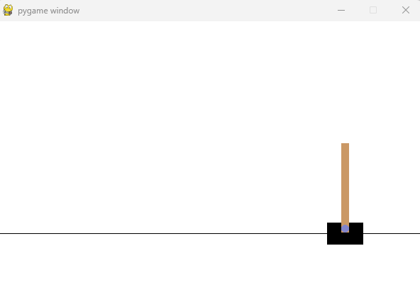

### 3. 方式二：基于策略的学习（Policy based RL）

#### 3.1 原理

相比基于价值的强化学习，基于策略的强化学习（如Policy Gradient方法）的一个重要优势是：**它不需要每一步（step-wise）都有明确的即时奖励信号，只要在整局游戏（episode）结束时能获得一个累积奖励（或最终胜负结果），就可以直接训练策略网络**。这是与基于值函数的方法（如DQN）的关键区别之一。

这样我就可以开发一个五子棋小游戏，不需要每一步落子都显式编程给出奖励值，只需要在棋局终局给胜者1负者-1的奖励即可。降低了设计的难度。

但它明显的劣势是梯度倍乘的Return值变化太大，不稳定。我们使用G表示累积奖励，G是非常不稳定的。因为交互的过程本身具有随机性，所以在某一个状 态s采取某一个动作a时计算得到的累积奖励，每次结果都是不同的，因此G是一个随机变量。

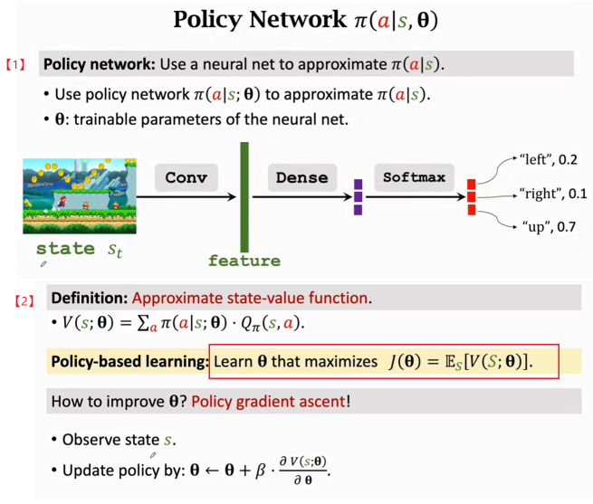


我没有想明白的是：如果能够近似计算Q(s,a)，那似乎也就回到了DQN，不需要做策略学习了？

AI这样说上面训练过程不需要拟合Q函数，只需要计算一次从s开始采取a的游戏局的return就可以。两个方法的区别：

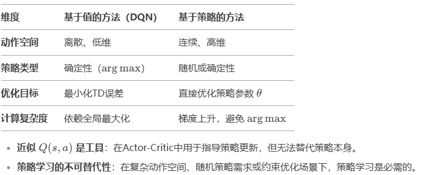


下面两个图是李宏毅老师课程的笔记：

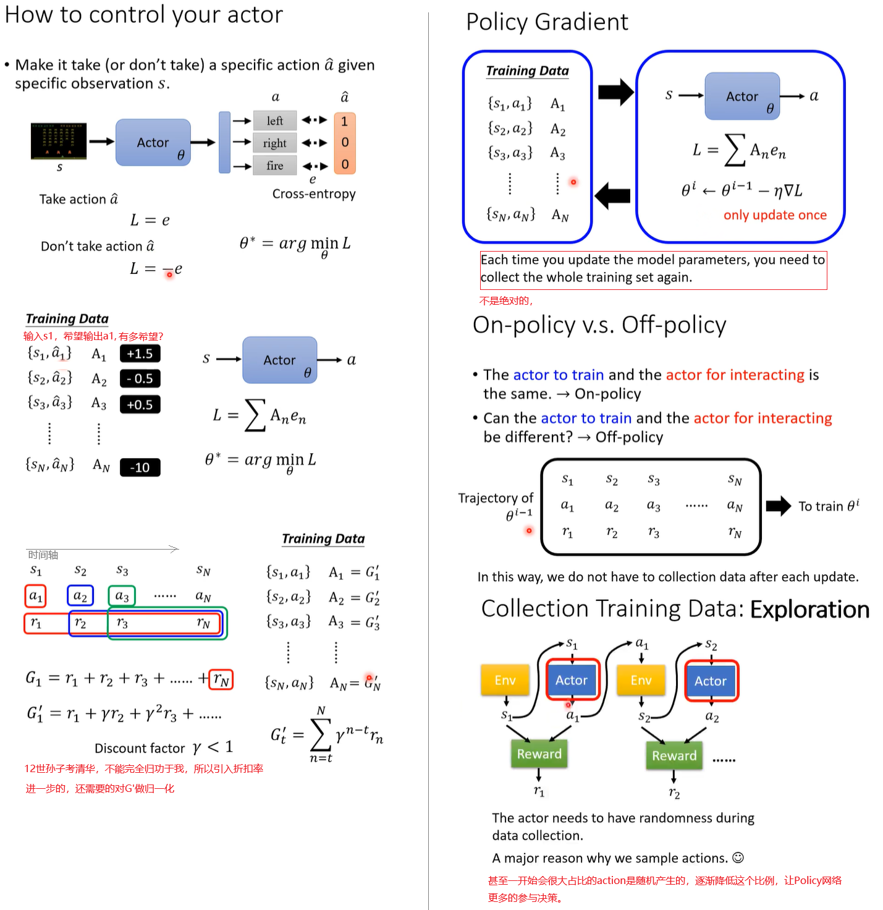


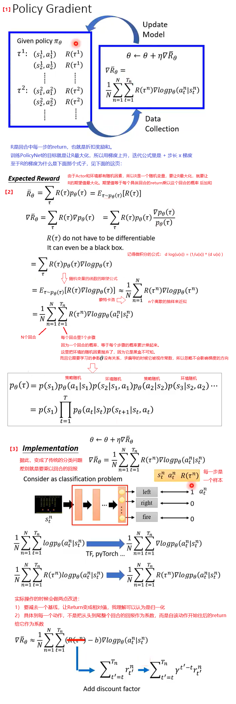

#### 3.2 实操1 cartpole

还是平衡车小游戏：

```python
import gym
import numpy as np
import torch
import torch.nn as nn
import torch.optim as optim
from torch.distributions import Categorical
import argparse
import os
import matplotlib.pyplot as plt

# 设置随机种子
torch.manual_seed(42)
np.random.seed(42)

# 检测设备
device = torch.device("cuda" if torch.cuda.is_available() else "cpu")
print(f"Using device: {device}")


# ----------------------------
# 1. 策略网络定义
# ----------------------------
class PolicyNetwork(nn.Module):
    def __init__(self, state_dim, action_dim, hidden_dim=128):
        super(PolicyNetwork, self).__init__()
        self.fc1 = nn.Linear(state_dim, hidden_dim)
        self.fc2 = nn.Linear(hidden_dim, action_dim)
        self.softmax = nn.Softmax(dim=-1)

    def forward(self, x):
        if len(x.shape) == 1:
            x = x.unsqueeze(0)  # [state_dim] -> [1, state_dim]
        x = torch.relu(self.fc1(x))  # [batch_size, hidden_dim]
        logits = self.fc2(x)  # [batch_size, action_dim]
        probs = self.softmax(logits)  # [batch_size, action_dim]
        return probs


# ----------------------------
# 2. Checkpoint 保存与加载
# ----------------------------
def save_checkpoint(policy, optimizer, episode, reward, path="checkpoint.pth"):
    torch.save({
        'policy_state_dict': policy.state_dict(),
        'optimizer_state_dict': optimizer.state_dict(),
        'episode': episode,
        'reward': reward
    }, path)
    print(f"Checkpoint saved to {path} (Reward: {reward:.2f})")


def load_checkpoint(policy, optimizer, path="checkpoint.pth"):
    if os.path.exists(path):
        checkpoint = torch.load(path)
        policy.load_state_dict(checkpoint['policy_state_dict'])
        optimizer.load_state_dict(checkpoint['optimizer_state_dict'])
        print(f"Loaded checkpoint from {path} (Episode: {checkpoint['episode']}, Reward: {checkpoint['reward']:.2f})")
        return checkpoint['episode'], checkpoint['reward']
    else:
        print(f"No checkpoint found at {path}")
        return 0, 0


# ----------------------------
# 3. 训练函数（带Checkpoint和可视化）
# ----------------------------
def train(env_name="CartPole-v1", hidden_dim=128, lr=1e-2,
          gamma=0.99, max_episodes=1000, print_interval=2):
    env = gym.make(env_name, render_mode="human")  # 开启可视化
    state_dim = env.observation_space.shape[0]
    action_dim = env.action_space.n

    policy = PolicyNetwork(state_dim, action_dim, hidden_dim).to(device)
    optimizer = optim.Adam(policy.parameters(), lr=lr)

    # 尝试加载Checkpoint
    checkpoint_path = "./pbrl_checkpoint_150_2955xx.0.pth"
    start_episode, _ = load_checkpoint(policy, optimizer, checkpoint_path)
    episode_rewards = []

    for episode in range(start_episode, max_episodes):
        state = env.reset()
        state = state[0]
        states, actions, rewards = [], [], []

        while True:
            state_tensor = torch.FloatTensor(state).to(device)
            state_tensor = state_tensor.unsqueeze(0)
            probs = policy(state_tensor)
            m = Categorical(probs) #根据各种action的概率值probs创建一个离散的概率分布
            action = m.sample() #使用该概率分布进行抽样，得到一个具体的action

            next_state, reward, done, _, _ = env.step(action.item())

            states.append(state_tensor.squeeze(0))
            actions.append(action.squeeze(0))
            rewards.append(reward)

            state = next_state
            if done:
                break
            '''到后面模型能力强了，游戏一把玩好久也不死。就导致两次训练的时间间隔很长
            粗暴的截断会有两个问题：
            1、可能导致游戏后面才会出现的states，从来没有出现在训练集里，使得模型失去泛化能力
            2、compute_returns不准确了，这个可能对于密集奖励型游戏还好，毕竟到了后面状态，伽马的n次方接近0，后面的项影响有限
            '''
            '''if  len(rewards) > 1000:
                print('brutally cut')
                break'''

        # 计算回报
        total_reward = sum(rewards)
        episode_rewards.append(total_reward)

        returns = compute_returns(rewards, gamma)
        # 让权重有正有负，如果正的，我们就要增大在这个状态采取这个动作的概率；如果是负的，我们就要减小在这个状态采取这个动作的概率
        returns = (returns - returns.mean()) / (returns.std() + 1e-9) 

        # 更新策略
        loss = train_policy_network(policy, optimizer, states, actions, returns)

        # 保存Checkpoint（如果回报>1000）
        if total_reward > 1000:
            checkpoint_path = f"./pbrl_checkpoint_{episode}_{total_reward}.pth"
            save_checkpoint(policy, optimizer, episode, total_reward, checkpoint_path)

        # 打印进度
        if (episode + 1) % print_interval == 0:
            avg_reward = np.mean(episode_rewards[-print_interval:])
            print(f"Episode {episode + 1}, Avg Reward: {avg_reward:.2f}, Loss: {loss:.4f}")

        # 提前终止
        if len(episode_rewards) >= 100 and np.mean(episode_rewards[-100:]) >= 2000:
            print(f"Solved at Episode {episode + 1}!")
            break

    env.close()
    return episode_rewards


# ----------------------------
# 4. 推理函数（演示训练好的模型）
# ----------------------------
def test(env_name="CartPole-v1", hidden_dim=128, checkpoint_path="checkpoint.pth"):
    env = gym.make(env_name, render_mode="human")  # 开启可视化
    state_dim = env.observation_space.shape[0]
    action_dim = env.action_space.n

    policy = PolicyNetwork(state_dim, action_dim, hidden_dim).to(device)
    optimizer = optim.Adam(policy.parameters(), lr=0.001)  # 仅占位，实际不用于测试

    # 加载Checkpoint
    load_checkpoint(policy, optimizer, checkpoint_path)

    print("Starting inference...")
    while True:  # 无限运行直到手动停止
        state = env.reset()[0]
        total_reward = 0

        while True:
            with torch.no_grad():
                state_tensor = torch.FloatTensor(state).to(device)
                probs = policy(state_tensor)
                action = torch.argmax(probs).item()  # 直接选最优动作

            next_state, reward, done, _, _ = env.step(action)
            total_reward += reward
            state = next_state

            if done:
                print(f"Inference Reward: {total_reward}")
                break


# ----------------------------
# 5. 辅助函数， 用于策略梯度更新（替代Q(s,a) 的蒙特卡洛估计）
# ----------------------------
def compute_returns(rewards, gamma=0.99):
    returns = []
    R = 0
    for r in reversed(rewards):
        R = r + gamma * R
        returns.insert(0, R)
    return torch.tensor(returns, device=device)


def train_policy_network(policy, optimizer, states, actions, returns):
    # 将列表中的状态/动作/回报堆叠成张量， 假设一把游戏玩下来的状态个数是T
    states = torch.stack(states)  # [T, 4]
    actions = torch.stack(actions) # [T]
    returns = returns  # [T]
    # 1. 通过策略网络计算动作概率
    probs = policy(states)  # [T, action_dim]
    # 2. 创建分类分布（用于采样和计算对数概率）
    m = Categorical(probs)
    # 3. 计算所选动作的对数概率
    log_probs = m.log_prob(actions)  # [T,] 
    # 4. 因为基于策略的强化学习要使用梯度上升使得state-value函数的期望最大化，所以损失函数是期望值的负数
    # returns已经在函数外面进行了带折扣的汇总运算，也就是已经是U了，不是每一步的r
    loss = -(log_probs * returns).mean() 
    optimizer.zero_grad()
    loss.backward()
    optimizer.step()
    return loss.item()


# ----------------------------
# 6. 主函数（命令行参数解析）
# ----------------------------
def main(mode):
    if mode == "train":
        rewards = train()
        plt.plot(rewards)
        plt.xlabel("Episode")
        plt.ylabel("Total Reward")
        plt.title("Policy Gradient Training")
        plt.show()
    elif mode == "test":
        test(checkpoint_path="./pbrl_checkpoint_1001.0.pth")


if __name__ == "__main__":
    main("train")
```

效果类似基于价值的强化学习，150个episode后，一根棍子可以举很久不倒。

上面的代码，是严格按照王树森老师的使V(s)最大化的思路来实现的，如果按照李宏毅老师的交叉熵的思路，train函数改为如下：

```python
def train_policy_network(policy, optimizer, states, actions, returns):
    # 将列表中的状态/动作/回报堆叠成张量， 假设一把游戏玩下来的状态个数是T
    states = torch.stack(states)  # [T, 4]
    actions = torch.stack(actions) # [T]
    returns = returns  # [T]
    # 1. 通过策略网络计算动作概率
    probs = policy(states)  # [T, action_dim]
    # 2. 计算交叉熵，因为probs是softmax处理过后的，所以用nll_loss函数
    loss = (torch.nn.functional.nll_loss(torch.log(probs), actions, reduction='none')  * returns).mean()

    optimizer.zero_grad()
    loss.backward()
    optimizer.step()
    return loss.item()
```

这样修改后，也能够快速收敛，把棍子举得久久的。

#### 3.3 实操2 左右博弈五子棋 v1

具体的： 

1. 先让AI帮忙写一个简单的五子棋小游戏，提供reset()  step()等接口，供RL程序调用
2. 定义一个策略CNN网络，输入是9x9的棋局，也就是状态，返回9x9个位置上落黑子的概率。在获取概率每个位置的概率的时候，把当期棋局已经落子的位置剔除掉不考虑
3.  把上面的CNN策略网络创建两个实例，一个叫A，一个叫B。他们是同一个类型网络的左右手对弈。在调用B获得下一步的action的时候，需要把棋局的黑白对调一下后作为输入状态传给B，返回下一步在每个坐标下黑子的概率。因为他们是同一个网络的两个实例，我们训练的网络是执黑的。 
4. 每隔10个epsode就把A的参数赋值给B 
5. 五子棋程序只有在分出胜负的时候才返回非0的reward 


一开始如上面所示的去做，怎么训练都没有起色。后来简化了问题：

1. 棋盘大小改为5x5
2. 连成3个就算赢
3. 让RL程序执黑，和人肉智能对弈（ black_step()函数背后会有白子执行人肉智能 ）， 每128局统计一下黑方的赢率

简化后训练会有效果，慢慢的黑棋的赢率会达到53%，最高到90%，但不能稳住在一个高水平，经常在30%+附近。

人类与之对弈，会明显发现训练后的模型会比训练前聪明。

下面是简化后的代码

```python
import random
import time
import numpy as np
import pygame
import sys
import torch
from exceptiongroup import catch

# 定义颜色
WHITE = (255, 255, 255)
BLACK = (0, 0, 0)
GRAY = (200, 200, 200)
GREEN = (0, 255, 0)

# 棋盘大小
BOARD_SIZE = 5
CELL_SIZE = 50
WINDOW_SIZE = BOARD_SIZE * CELL_SIZE


class Gomoku:
    def __init__(self):
        """ 初始化五子棋环境 """
        pygame.init()
        self.screen = pygame.display.set_mode((WINDOW_SIZE, WINDOW_SIZE))
        pygame.display.set_caption("五子棋")
        self.font = pygame.font.Font(None, 36)
        self.reset()

    def reset(self):
        """ 重新初始化棋局，在中心落一个黑子 """
        self.board = np.zeros((BOARD_SIZE, BOARD_SIZE), dtype=int)
        self.last_move = None
        # 随机初始位置
        '''x = random.randint(0, BOARD_SIZE - 1)
        y = random.randint(0, BOARD_SIZE - 1)
        self.board[x, y] = 1  # 黑棋先手
        self.last_move = (x, y)'''
        self.game_over = False
        self.winner = None
        return self.board.copy()

    def step(self, role, x, y):
        """ 执行落子，并计算局部奖励 """
        if self.game_over or self.board[x, y] != 0:
            return self.board.copy(), 0, self.game_over  # 非法落子

        self.board[x, y] = role
        self.last_move = (x, y)

        # 检查胜负
        if self.check_win(x, y, role):
            self.game_over = True
            self.winner = role
            reward = 1 if role == 1 else -1
        else:
            reward = 0
        self.render()
        return self.board.copy(), reward, self.game_over

    def black_step(self, x, y):
        """ 黑方落子，然后白方智能应对 """
        draw = False
        # 黑方落子
        state, reward, done = self.step(1, x, y)
        if done:
            return state, reward, done, draw, (x,y)

        # 白方智能落子
        if not done:
            white_x, white_y = self.find_best_move(-1)
            if white_x is None:
                draw = True
                return None, None, None, draw, (x, y)
            state, reward, done = self.step(-1, white_x, white_y)

        return state, reward, done, draw, (white_x, white_y)

    def ai_play_episode(self, slow=False):
        """ 自动对弈一局，返回黑方的状态、动作和奖励序列 """
        states = []
        actions = []
        rewards = []


        self.reset()
        states.append(torch.tensor(self.board.copy()).unsqueeze(0))

        draw = False
        lastcoord = None
        while not self.game_over:
            # 黑方智能落子
            black_x, black_y = self.find_best_move(1)
            if black_x is None:
                draw = True
                break
            actions.append(torch.tensor([black_x, black_y]))
            state, reward, done, draw, lastcoord = self.black_step(black_x, black_y)
            if draw:
                break
            if slow:
                time.sleep(2)
            states.append( torch.tensor(state.copy()).unsqueeze(0))
            rewards.append(reward)
            if done :
                break


            # 处理游戏结束事件
            for event in pygame.event.get():
                if event.type == pygame.QUIT:
                    pygame.quit()
                    sys.exit()
        if slow:
            time.sleep(2)
        return states[:-1], actions, rewards, draw, lastcoord  # 最后一个状态不需要

    def find_best_move(self, role):
        """ 智能寻找最佳落子位置 """
        opponent = -role

        # 1. 检查自己是否能直接获胜
        for x in range(BOARD_SIZE):
            for y in range(BOARD_SIZE):
                if self.board[x, y] == 0:
                    self.board[x, y] = role
                    if self.check_win(x, y, role):
                        self.board[x, y] = 0  # 恢复
                        return x, y
                    self.board[x, y] = 0  # 恢复

        # 2. 检查对手是否能直接获胜，需要防守
        for x in range(BOARD_SIZE):
            for y in range(BOARD_SIZE):
                if self.board[x, y] == 0:
                    self.board[x, y] = opponent
                    if self.check_win(x, y, opponent):
                        self.board[x, y] = 0  # 恢复
                        return x, y
                    self.board[x, y] = 0  # 恢复

        # 3. 评估每个空位的得分
        best_score = -1
        best_moves = []
        for x in range(BOARD_SIZE):
            for y in range(BOARD_SIZE):
                if self.board[x, y] == 0:
                    score = self.evaluate_position(x, y, role)
                    if score > best_score:
                        best_score = score
                        best_moves = [(x, y)]
                    elif score == best_score:
                        best_moves.append((x, y))

        # 从最佳候选位置中随机选择一个
        if len(best_moves) == 0:
            return None,None
        else:
            return random.choice(best_moves)

    def evaluate_position(self, x, y, role):
        """ 评估在(x,y)落子的价值 """
        directions = [(1, 0), (0, 1), (1, 1), (1, -1)]
        total_score = 0

        for dx, dy in directions:
            # 计算这个方向上的棋型
            line = []
            for d in [-4, -3, -2, -1, 0, 1, 2, 3, 4]:  # 检查9个位置
                nx, ny = x + d * dx, y + d * dy
                if 0 <= nx < BOARD_SIZE and 0 <= ny < BOARD_SIZE:
                    line.append(self.board[nx, ny])
                else:
                    line.append(2)  # 边界外

            # 只关注以(x,y)为中心的5个位置
            center = BOARD_SIZE // 2  # 因为前面检查了9个位置，(x,y)在中间
            segment = line[center - BOARD_SIZE // 2:center + BOARD_SIZE // 2+1]

            # 计算这个方向的得分
            total_score += self.evaluate_segment(segment, role)

        return total_score

    def evaluate_segment(self, segment, role):
        """ 评估一个5连位置的得分 """
        opponent = -role
        count_role = segment.count(role)
        count_opponent = segment.count(opponent)

        # 如果有对手的棋子，这个位置价值降低
        if count_opponent > 0:
            return 0

        # 根据连子数给分
        if count_role == 4: return 10000  # 活四
        if count_role == 3: return 1000  # 活三
        if count_role == 2: return 100  # 活二
        if count_role == 1: return 10  # 活一
        return 1  # 空位

    def check_win(self, x, y, role):
        """ 判断当前落子是否形成五连胜 """
        directions = [(1, 0), (0, 1), (1, 1), (1, -1)]
        for dx, dy in directions:
            count = 1
            for d in [-1, 1]:  # 计算两个方向
                nx, ny = x, y
                while True:
                    nx += d * dx
                    ny += d * dy
                    if 0 <= nx < BOARD_SIZE and 0 <= ny < BOARD_SIZE and self.board[nx, ny] == role:
                        count += 1
                    else:
                        break
            if count >= 3:
                return True
        return False

    def render(self):
        """ 渲染棋盘 """
        self.screen.fill(WHITE)

        # 画网格
        for i in range(BOARD_SIZE):
            pygame.draw.line(self.screen, GRAY, (i * CELL_SIZE + CELL_SIZE // 2, CELL_SIZE // 2),
                             (i * CELL_SIZE + CELL_SIZE // 2, WINDOW_SIZE - CELL_SIZE // 2), 2)
            pygame.draw.line(self.screen, GRAY, (CELL_SIZE // 2, i * CELL_SIZE + CELL_SIZE // 2),
                             (WINDOW_SIZE - CELL_SIZE // 2, i * CELL_SIZE + CELL_SIZE // 2), 2)

        # 画棋子
        for x in range(BOARD_SIZE):
            for y in range(BOARD_SIZE):
                if self.board[x, y] == 1:  # 黑子
                    pygame.draw.circle(self.screen, BLACK, (y * CELL_SIZE + CELL_SIZE // 2,
                                                            x * CELL_SIZE + CELL_SIZE // 2), CELL_SIZE // 3)
                elif self.board[x, y] == -1:  # 白子
                    pygame.draw.circle(self.screen, WHITE, (y * CELL_SIZE + CELL_SIZE // 2,
                                                            x * CELL_SIZE + CELL_SIZE // 2), CELL_SIZE // 3)
                    pygame.draw.circle(self.screen, BLACK, (y * CELL_SIZE + CELL_SIZE // 2,
                                                            x * CELL_SIZE + CELL_SIZE // 2), CELL_SIZE // 3, 2)

        # 标记最后一手棋
        if self.last_move:
            lx, ly = self.last_move
            pygame.draw.circle(self.screen, GREEN, (ly * CELL_SIZE + CELL_SIZE // 2,
                                                    lx * CELL_SIZE + CELL_SIZE // 2), CELL_SIZE // 3 + 3, 2)

        # 游戏结束显示赢家
        if self.game_over:
            msg = "black wins." if self.winner == 1 else "white wins."
            text = self.font.render(msg, True, BLACK)
            self.screen.blit(text, (WINDOW_SIZE // 3, WINDOW_SIZE // 2))

        pygame.display.flip()

    def play_human(self):
        """ 让人类玩家交互式落子 """
        running = True
        role = 1
        while running:
            self.render()
            for event in pygame.event.get():
                if event.type == pygame.QUIT:
                    running = False
                    pygame.quit()
                    sys.exit()
                elif event.type == pygame.MOUSEBUTTONDOWN and not self.game_over:
                    x, y = event.pos[1] // CELL_SIZE, event.pos[0] // CELL_SIZE
                    _, r, done = self.step(role, x, y)
                    print(f"r={r}")
                    if not done:
                        role *= -1  # 轮到另一方落子
        pygame.quit()

    def human_play(self, role):
        """ 让人类玩家落子，阻塞直到有效输入，并返回新状态 """
        self.render()

        while True:  # 阻塞等待有效输入
            for event in pygame.event.get():
                if event.type == pygame.QUIT:
                    pygame.quit()
                    exit()  # 退出程序

                elif event.type == pygame.MOUSEBUTTONDOWN and not self.game_over:
                    x, y = event.pos[1] // CELL_SIZE, event.pos[0] // CELL_SIZE

                    # 确保落子位置未被占据
                    if self.board[x, y] == 0:
                        state, reward, done,  = self.step(role,  x, y)
                        return state, reward, done  # 返回新状态、奖励、是否终局


def main():
    go = Gomoku()
    print(5//2)
    go.ai_play_episode(True)


if __name__ == "__main__":
    main()
```

然后是训练的代码：

```python
import torch
import torch.nn as nn
import torch.optim as optim
import torch.nn.functional as F
import numpy as np
import time
import pygame
import numpy as np
from collections import Counter
import os
from gomoku import Gomoku  # 假设 gomoku.py 里定义了五子棋环境
from gomoku import BOARD_SIZE
from torch.distributions import Categorical

# 设备初始化
device = torch.device("cuda" if torch.cuda.is_available() else "cpu")


# 定义策略网络
class PolicyNet(nn.Module):
    def __init__(self):
        super(PolicyNet, self).__init__()
        self.conv1 = nn.Conv2d(1, 32, kernel_size=3, padding=1)
        self.conv2 = nn.Conv2d(32, 64, kernel_size=3, padding=1)
        self.conv3 = nn.Conv2d(64, 128, kernel_size=3, padding=1)
        self.fc = nn.Linear(128 * BOARD_SIZE * BOARD_SIZE, BOARD_SIZE * BOARD_SIZE)

    def forward(self, state):
        batch_size = state.size(0)  # 获取 batch 大小

        # 计算合法落子 mask（state=0 的地方可以落子）
        mask = (state.view(batch_size, BOARD_SIZE, BOARD_SIZE) == 0).float()  # [batch, BOARD_SIZE, BOARD_SIZE]，可落子=1，不可落子=0
        mask = mask.view(batch_size, BOARD_SIZE*BOARD_SIZE)  # [batch, BOARD_SIZE*BOARD_SIZE]

        # 通过 CNN 提取特征
        x = F.relu(self.conv1(state))
        x = F.relu(self.conv2(x))
        x = F.relu(self.conv3(x))

        # 展平成 [batch, 128 * BOARD_SIZE * BOARD_SIZE]
        x = x.view(batch_size, -1)
        x = self.fc(x)

        # 对不可落子的位置赋极小值 (-inf)
        x = x.masked_fill(mask == 0, float('-inf'))  # 屏蔽不可落子的位置

        # 计算 softmax 仅在合法位置
        x = F.softmax(x, dim=1)

        return x.view(batch_size, BOARD_SIZE, BOARD_SIZE)  # 变回 [batch, BOARD_SIZE, BOARD_SIZE] 的棋盘格式

# 选择动作
def select_action(policy_net, state):
    """
    选择动作，避免已落子点，并处理棋盘已满的情况。

    :param policy_net: 策略网络
    :param state: 当前棋盘状态 (9x9)
    :return: 选择的动作坐标 (x, y) 或 None（表示平局）
    """
    state_tensor = torch.tensor(state, dtype=torch.float32, device=device).unsqueeze(0).unsqueeze(0)
    policy_net.eval()
    with torch.no_grad():
        action_probs = policy_net(state_tensor).squeeze().detach().cpu().numpy()  # 转到CPU计算
    policy_net.train()


    # 不能选择已落子点
    action_probs[state != 0] = 0

    total_prob = action_probs.sum()
    if total_prob == 0:
        return None  # 棋盘已满，平局

    action_probs /= total_prob  # 归一化
    choice = np.random.choice(BOARD_SIZE * BOARD_SIZE, p=action_probs.flatten())
    return divmod(choice, BOARD_SIZE)  # 返回 (x, y) 坐标

def entropy(coords):
    if not coords:
        return 0  # 空列表的熵定义为0

    counter = Counter(coords)  # 统计每个坐标的出现次数
    total = len(coords)  # 总数
    probs = np.array([count / total for count in counter.values()])  # 计算概率分布
    #print(f"{len(coords)}, {len(probs)}")
    return -np.sum(probs * np.log2(probs))  # 计算熵（以2为底）

# 运行完整一局游戏，收集经验
def play_one_episode(policy_net, win_coords):
    env = Gomoku()
    state = env.reset()
    states, actions, rewards = [], [], []

    blackwin = False


    while True:
        action = select_action(policy_net , state )
        if action is None:  # 平局
            print(f"Draw detected. Ending episode. rewards len:{len(rewards)}")
            break
        #print(f"on {action[0], action[1]}")
        new_state, reward, done, draw, (x,y) = env.black_step(*action)
        if draw:
            continue;


        state_tensor = torch.tensor(state, dtype=torch.float32, device=device).unsqueeze(0).unsqueeze(0)
        states.append(state_tensor.squeeze(0))
        actions.append(torch.tensor(action, dtype=torch.long, device=device))
        rewards.append(reward)


        if done:
            if reward > 0:
                blackwin = True
            win_coords.append((x,y))
            break

        state = new_state


    return states, actions, rewards, blackwin


# 计算折扣回报（G_t）
def compute_returns(rewards, gamma=0.99):
    returns = []
    G = 0
    for r in reversed(rewards):
        G = r + gamma * G
        returns.insert(0, G)  # 按时间步正序排列
    return torch.tensor(returns, dtype=torch.float32, device=device)


def train_policy_network(policy, optimizer, states, actions, returns):
    """
    policy: 策略网络
    optimizer: 优化器
    states:  [T, BOARD_SIZE, BOARD_SIZE]，每一步的棋盘状态
    actions: [T, 2]，每一步 (x, y) 位置的动作
    returns: [T]，每一步的折扣回报
    """
    states = torch.stack(states)  # [T, 1, BOARD_SIZE, BOARD_SIZE]
    actions = torch.stack(actions)  # [T, 2]，包含 x 和 y 坐标

    # **Step 1: 计算 state_mask**
    state_mask = (states != 0).float().squeeze(1)  # [T, BOARD_SIZE, BOARD_SIZE]，非 0（已落子）为 1，空位为 0

    # **Step 2: 计算策略网络输出**
    probs = policy(states)  # [T, BOARD_SIZE, BOARD_SIZE]

    # **Step 3: 过滤已落子点**
    masked_probs = probs * (1 - state_mask)  # 已落子的位置概率设为 0
    masked_probs = masked_probs / (masked_probs.sum(dim=(1, 2), keepdim=True) + 1e-9)  # 重新归一化

    # **Step 4: 计算 log 概率**
    # 从 masked_probs 这个 [T, BOARD_SIZE, BOARD_SIZE] 的张量中，提取每一步行动 actions[x, y] 处的概率, 并求log()
    log_probs = torch.log( masked_probs[torch.arange(actions.shape[0]), actions[:, 0], actions[:, 1]] + 1e-9)

    # **Step 5: 归一化 returns**
    returns = (returns - returns.mean()) / (returns.std() + 1e-9)

    # **Step 6: 计算损失**
    loss = -(log_probs * returns).mean()

    optimizer.zero_grad()
    loss.backward()
    optimizer.step()

    return loss.item()

# 主训练循环
def train(policy_net, episodes=50000, checkpoint_path='policy.pth', gamma=0.99):
    optimizer = optim.Adam(policy_net.parameters(), lr=0.00001)

    # 加载已有的模型参数
    if os.path.exists(checkpoint_path):
        policy_net.load_state_dict(torch.load(checkpoint_path, map_location=device))


    policy_net = policy_net.to(device)

    win_cnt = 0

    win_coords = []
    for episode in range(episodes):
        # 运行一局游戏，收集 (states, actions, rewards), win_coords收集一段时间的赢的坐标，用于监控是不是棋局总是在重复
        states, actions, rewards, blackwin = play_one_episode(policy_net,  win_coords)
        if blackwin:
            win_cnt += 1

        # 计算折扣回报
        returns = compute_returns(rewards, gamma)

        # 更新策略网络
        loss = train_policy_network(policy_net, optimizer, states, actions, returns)


        # 每 128 轮更新对手策略，
        update_interval = 128
        if episode % update_interval == 0:
            path = checkpoint_path
            if win_cnt / update_interval > 0.4:
                path = f"simple_gomoku_{int(win_cnt*100 / update_interval)}.pth"
            torch.save(policy_net.state_dict(), path)
            entro = entropy(win_coords)
            print(f'Episode {episode}: Model updated, checkpoint saved, Loss: {loss:.4f}, win_ratio:{win_cnt / update_interval:.2f},entropy:{entro:.2f}')
            win_cnt = 0
            win_coords = []

def play_with_human(checkpoint_path='policy.pth'):
    env = Gomoku()

    policy_net = PolicyNet().to(device)
    policy_net.load_state_dict(torch.load(checkpoint_path))
    state = env.reset()
    turn = 1  # AI 执黑，人类执白
    done = False

    while not done:
        if turn == 1:
            action = select_action(policy_net, state)
            state, _, done = env.step(1, *action)  # AI 落子
        else:
            state, _, done = env.human_play(-1)  # 人类落子

        turn *= -1  # 轮流落子


if __name__ == "__main__":
    import argparse
    policy = PolicyNet().to(device)
    arg = "test"
    if arg == "train":
        train(policy)
    else:
        play_with_human('./simple_gomoku_53.pth')

```


#### 3.4 实操3 左右博弈五子棋 v2

参考AlphaGo的训练方式，修改一下：

1. 状态的表示，用10个通道，而不是只有一个通道。分别表示黑子和白子过去5步的棋子布局
3. 网络结构也调整一下，加了残差网络、归一化、1x1卷积等
4. 棋盘缩小到5x5，连成3个即为胜出
5. 五子棋类Gomoku增加了基于规则搜索的人肉智能：
   1. ai_play_episode()两个人肉智能对弈一局，记录下棋谱可以供RL训练；
   2. black_step()用于RL作为黑方下了后，人肉智能作为对手会再落子并返回新的状态

五子棋代码：

```python
import random
import time
import numpy as np
import pygame
import sys
import torch
from exceptiongroup import catch

# 定义颜色
WHITE = (255, 255, 255)
BLACK = (0, 0, 0)
GRAY = (200, 200, 200)
GREEN = (0, 255, 0)

# 棋盘大小
BOARD_SIZE = 5
CELL_SIZE = 50
WINDOW_SIZE = BOARD_SIZE * CELL_SIZE


class Gomoku:
    def __init__(self):
        """ 初始化五子棋环境 """
        pygame.init()
        self.screen = pygame.display.set_mode((WINDOW_SIZE, WINDOW_SIZE))
        pygame.display.set_caption("五子棋")
        self.font = pygame.font.Font(None, 36)
        self.reset()

    def reset(self):
        """ 重新初始化棋局，在中心落一个黑子 """
        self.board = np.zeros((BOARD_SIZE, BOARD_SIZE), dtype=int)
        self.last_move = None
        # 随机初始位置
        '''x = random.randint(0, BOARD_SIZE - 1)
        y = random.randint(0, BOARD_SIZE - 1)
        self.board[x, y] = 1  # 黑棋先手
        self.last_move = (x, y)'''
        self.game_over = False
        self.winner = None
        return self.board.copy()

    def step(self, role, x, y):
        """ 执行落子，并计算局部奖励 """
        if self.game_over or self.board[x, y] != 0:
            return self.board.copy(), 0, self.game_over  # 非法落子

        self.board[x, y] = role
        self.last_move = (x, y)

        # 检查胜负
        if self.check_win(x, y, role):
            self.game_over = True
            self.winner = role
            reward = 1 if role == 1 else -1
        else:
            reward = 0
        self.render()
        return self.board.copy(), reward, self.game_over

    def black_step(self, x, y):
        """ 黑方落子，然后白方智能应对 """
        draw = False
        # 黑方落子
        state, reward, done = self.step(1, x, y)
        if done:
            return state, reward, done, draw, (x,y)

        # 白方智能落子
        if not done:
            white_x, white_y = self.find_best_move(-1)
            if white_x is None:
                draw = True
                return None, None, None, draw, (x, y)
            state, reward, done = self.step(-1, white_x, white_y)

        return state, reward, done, draw, (white_x, white_y)

    def ai_play_episode(self, slow=False):
        """ 自动对弈一局，返回黑方的状态、动作和奖励序列 """
        states = []
        actions = []
        rewards = []


        self.reset()
        states.append(torch.tensor(self.board.copy()).unsqueeze(0))

        draw = False
        lastcoord = None
        while not self.game_over:
            # 黑方智能落子
            black_x, black_y = self.find_best_move(1)
            if black_x is None:
                draw = True
                break
            actions.append(torch.tensor([black_x, black_y]))
            state, reward, done, draw, lastcoord = self.black_step(black_x, black_y)
            if draw:
                break
            if slow:
                time.sleep(2)
            states.append( torch.tensor(state.copy()).unsqueeze(0))
            rewards.append(reward)
            if done :
                break


            # 处理游戏结束事件
            for event in pygame.event.get():
                if event.type == pygame.QUIT:
                    pygame.quit()
                    sys.exit()
        if slow:
            time.sleep(2)
        return states[:-1], actions, rewards, draw, lastcoord  # 最后一个状态不需要

    def find_best_move(self, role):
        """ 智能寻找最佳落子位置 """
        opponent = -role

        # 1. 检查自己是否能直接获胜
        for x in range(BOARD_SIZE):
            for y in range(BOARD_SIZE):
                if self.board[x, y] == 0:
                    self.board[x, y] = role
                    if self.check_win(x, y, role):
                        self.board[x, y] = 0  # 恢复
                        return x, y
                    self.board[x, y] = 0  # 恢复

        # 2. 检查对手是否能直接获胜，需要防守
        for x in range(BOARD_SIZE):
            for y in range(BOARD_SIZE):
                if self.board[x, y] == 0:
                    self.board[x, y] = opponent
                    if self.check_win(x, y, opponent):
                        self.board[x, y] = 0  # 恢复
                        return x, y
                    self.board[x, y] = 0  # 恢复

        # 3. 评估每个空位的得分
        best_score = -1
        best_moves = []
        for x in range(BOARD_SIZE):
            for y in range(BOARD_SIZE):
                if self.board[x, y] == 0:
                    score = self.evaluate_position(x, y, role)
                    if score > best_score:
                        best_score = score
                        best_moves = [(x, y)]
                    elif score == best_score:
                        best_moves.append((x, y))

        # 从最佳候选位置中随机选择一个
        if len(best_moves) == 0:
            return None,None
        else:
            return random.choice(best_moves)

    def evaluate_position(self, x, y, role):
        """ 评估在(x,y)落子的价值 """
        directions = [(1, 0), (0, 1), (1, 1), (1, -1)]
        total_score = 0

        for dx, dy in directions:
            # 计算这个方向上的棋型
            line = []
            for d in [-4, -3, -2, -1, 0, 1, 2, 3, 4]:  # 检查9个位置
                nx, ny = x + d * dx, y + d * dy
                if 0 <= nx < BOARD_SIZE and 0 <= ny < BOARD_SIZE:
                    line.append(self.board[nx, ny])
                else:
                    line.append(2)  # 边界外

            # 只关注以(x,y)为中心的5个位置
            center = BOARD_SIZE // 2  # 因为前面检查了9个位置，(x,y)在中间
            segment = line[center - BOARD_SIZE // 2:center + BOARD_SIZE // 2+1]

            # 计算这个方向的得分
            total_score += self.evaluate_segment(segment, role)

        return total_score

    def evaluate_segment(self, segment, role):
        """ 评估一个5连位置的得分 """
        opponent = -role
        count_role = segment.count(role)
        count_opponent = segment.count(opponent)

        # 如果有对手的棋子，这个位置价值降低
        if count_opponent > 0:
            return 0

        # 根据连子数给分
        if count_role == 4: return 10000  # 活四
        if count_role == 3: return 1000  # 活三
        if count_role == 2: return 100  # 活二
        if count_role == 1: return 10  # 活一
        return 1  # 空位

    def check_win(self, x, y, role):
        """ 判断当前落子是否形成五连胜 """
        directions = [(1, 0), (0, 1), (1, 1), (1, -1)]
        for dx, dy in directions:
            count = 1
            for d in [-1, 1]:  # 计算两个方向
                nx, ny = x, y
                while True:
                    nx += d * dx
                    ny += d * dy
                    if 0 <= nx < BOARD_SIZE and 0 <= ny < BOARD_SIZE and self.board[nx, ny] == role:
                        count += 1
                    else:
                        break
            if count >= 3:
                return True
        return False

    def render(self):
        """ 渲染棋盘 """
        self.screen.fill(WHITE)

        # 画网格
        for i in range(BOARD_SIZE):
            pygame.draw.line(self.screen, GRAY, (i * CELL_SIZE + CELL_SIZE // 2, CELL_SIZE // 2),
                             (i * CELL_SIZE + CELL_SIZE // 2, WINDOW_SIZE - CELL_SIZE // 2), 2)
            pygame.draw.line(self.screen, GRAY, (CELL_SIZE // 2, i * CELL_SIZE + CELL_SIZE // 2),
                             (WINDOW_SIZE - CELL_SIZE // 2, i * CELL_SIZE + CELL_SIZE // 2), 2)

        # 画棋子
        for x in range(BOARD_SIZE):
            for y in range(BOARD_SIZE):
                if self.board[x, y] == 1:  # 黑子
                    pygame.draw.circle(self.screen, BLACK, (y * CELL_SIZE + CELL_SIZE // 2,
                                                            x * CELL_SIZE + CELL_SIZE // 2), CELL_SIZE // 3)
                elif self.board[x, y] == -1:  # 白子
                    pygame.draw.circle(self.screen, WHITE, (y * CELL_SIZE + CELL_SIZE // 2,
                                                            x * CELL_SIZE + CELL_SIZE // 2), CELL_SIZE // 3)
                    pygame.draw.circle(self.screen, BLACK, (y * CELL_SIZE + CELL_SIZE // 2,
                                                            x * CELL_SIZE + CELL_SIZE // 2), CELL_SIZE // 3, 2)

        # 标记最后一手棋
        if self.last_move:
            lx, ly = self.last_move
            pygame.draw.circle(self.screen, GREEN, (ly * CELL_SIZE + CELL_SIZE // 2,
                                                    lx * CELL_SIZE + CELL_SIZE // 2), CELL_SIZE // 3 + 3, 2)

        # 游戏结束显示赢家
        if self.game_over:
            msg = "black wins." if self.winner == 1 else "white wins."
            text = self.font.render(msg, True, BLACK)
            self.screen.blit(text, (WINDOW_SIZE // 3, WINDOW_SIZE // 2))

        pygame.display.flip()

    def play_human(self):
        """ 让人类玩家交互式落子 """
        running = True
        role = 1
        while running:
            self.render()
            for event in pygame.event.get():
                if event.type == pygame.QUIT:
                    running = False
                    pygame.quit()
                    sys.exit()
                elif event.type == pygame.MOUSEBUTTONDOWN and not self.game_over:
                    x, y = event.pos[1] // CELL_SIZE, event.pos[0] // CELL_SIZE
                    _, r, done = self.step(role, x, y)
                    print(f"r={r}")
                    if not done:
                        role *= -1  # 轮到另一方落子
        pygame.quit()

    def human_play(self, role):
        """ 让人类玩家落子，阻塞直到有效输入，并返回新状态 """
        self.render()

        while True:  # 阻塞等待有效输入
            for event in pygame.event.get():
                if event.type == pygame.QUIT:
                    pygame.quit()
                    exit()  # 退出程序

                elif event.type == pygame.MOUSEBUTTONDOWN and not self.game_over:
                    x, y = event.pos[1] // CELL_SIZE, event.pos[0] // CELL_SIZE

                    # 确保落子位置未被占据
                    if self.board[x, y] == 0:
                        state, reward, done,  = self.step(role,  x, y)
                        return state, reward, done  # 返回新状态、奖励、是否终局


def main():
    go = Gomoku()
    print(5//2)
    go.ai_play_episode(True)


if __name__ == "__main__":
    main()
```

训练的代码：

```python
import time

import torch
import torch.nn as nn
import torch.optim as optim
import torch.nn.functional as F

import numpy as np
from collections import Counter
import os
from gomoku import BOARD_SIZE

from gomoku import Gomoku  # 假设 gomoku.py 里定义了五子棋环境

# 设备初始化
device = torch.device("cuda" if torch.cuda.is_available() else "cpu")
'''
'''
HISTORY_LEN=5


# 定义一个残差块
class ResidualBlock(nn.Module):
    def __init__(self, channels):
        super(ResidualBlock, self).__init__()
        self.conv1 = nn.Conv2d(channels, channels, kernel_size=3, padding=1)
        self.bn1 = nn.BatchNorm2d(channels)
        self.conv2 = nn.Conv2d(channels, channels, kernel_size=3, padding=1)
        self.bn2 = nn.BatchNorm2d(channels)

    def forward(self, x):
        residual = x
        out = F.relu(self.bn1(self.conv1(x)))
        out = self.bn2(self.conv2(out))
        out += residual  # 残差连接
        return F.relu(out)


# 定义策略网络
class PolicyNet(nn.Module):
    def __init__(self):
        super(PolicyNet, self).__init__()
        # 初始卷积层 + BN
        self.conv1 = nn.Conv2d(HISTORY_LEN * 2, 32, kernel_size=3, padding=1)
        self.bn1 = nn.BatchNorm2d(32)
        self.conv2 = nn.Conv2d(32, 64, kernel_size=3, padding=1)
        self.bn2 = nn.BatchNorm2d(64)
        self.conv3 = nn.Conv2d(64, 128, kernel_size=3, padding=1)
        self.bn3 = nn.BatchNorm2d(128)

        # 添加两个残差块
        self.res_block1 = ResidualBlock(128)
        self.res_block2 = ResidualBlock(128)

        # 策略头：使用 1x1 卷积替代全连接层
        self.policy_conv = nn.Conv2d(128, 4, kernel_size=1)
        self.policy_bn = nn.BatchNorm2d(4)
        self.policy_out = nn.Conv2d(4, 1, kernel_size=1)

    def forward(self, state):
        batch_size = state.size(0)

        # 计算合法落子 mask（state=0 的地方可以落子）
        # 这里假设通道0和通道5代表双方棋子
        mask = state[:, 0, :, :] + state[:, 5, :, :]
        mask = (mask.view(batch_size, BOARD_SIZE, BOARD_SIZE) == 0).float()
        mask = mask.view(batch_size, BOARD_SIZE*BOARD_SIZE)

        # 通过卷积层提取特征，后接BN与ReLU
        x = F.relu(self.bn1(self.conv1(state)))
        x = F.relu(self.bn2(self.conv2(x)))
        x = F.relu(self.bn3(self.conv3(x)))

        # 通过残差块进一步提取特征
        x = self.res_block1(x)
        x = self.res_block2(x)

        # 策略头：1x1卷积层 + BN + ReLU
        x = F.relu(self.policy_bn(self.policy_conv(x)))
        x = self.policy_out(x)  # 输出 shape: [batch, 1, BOARD_SIZE, BOARD_SIZE]

        # 展平成 [batch, 81] 作为 logits
        x = x.view(batch_size, BOARD_SIZE*BOARD_SIZE)

        # 对不可落子的位置赋极小值 (-inf)
        x = x.masked_fill(mask == 0, float('-inf'))

        # 计算 softmax 仅在合法位置
        x = F.softmax(x, dim=1)

        return x.view(batch_size, BOARD_SIZE, BOARD_SIZE)

# 选择动作
def select_action(policy_net, state):
    """
    选择动作，避免已落子点，并处理棋盘已满的情况。

    :param policy_net: 策略网络
    :param state: 当前棋盘状态 (9x9)
    :return: 选择的动作坐标 (x, y) 或 None（表示平局）
    """
    state = torch.stack(state).to(device)
    state_tensor = torch.tensor(state, dtype=torch.float32, device=device)
    state_tensor = reorganize_state(state_tensor, True)
    policy_net.eval()
    with torch.no_grad():
        action_probs = policy_net(state_tensor).squeeze().detach().cpu().numpy()  # 转到CPU计算
    policy_net.train()


    # 不能选择已落子点
    action_probs[state[-1,-1].cpu() != 0] = 0 # 取最新的一次state里的

    total_prob = action_probs.sum()
    if total_prob == 0:
        policy_net(state_tensor)
        return None  # 棋盘已满，平局

    action_probs /= total_prob  # 归一化
    choice = np.random.choice(BOARD_SIZE * BOARD_SIZE, p=action_probs.flatten())
    return divmod(choice, BOARD_SIZE)  # 返回 (x, y) 坐标

def entropy(coords):
    if not coords:
        return 0  # 空列表的熵定义为0

    counter = Counter(coords)  # 统计每个坐标的出现次数
    total = len(coords)  # 总数
    probs = np.array([count / total for count in counter.values()])  # 计算概率分布
    #print(f"{len(coords)}, {len(probs)}")
    return -np.sum(probs * np.log2(probs))  # 计算熵（以2为底）

# 运行完整一局游戏，收集经验
def play_one_episode(policy_net,  win_coords):
    env = Gomoku()
    state = env.reset()
    states, actions, rewards = [], [], []
    blackwin = False
    draw = False


    while True:
        history = states.copy()
        history.append(torch.tensor(state).unsqueeze(0).to(device))
        action = select_action(policy_net, history)

        if action is None:  # 平局
            print(f"Draw detected. Ending episode. rewards len:{len(rewards)}")
            draw = True
            break
        new_state, reward, done, draw, lastcoord = env.black_step(*action)


        #time.sleep(2)

        state_tensor = torch.tensor(state, dtype=torch.float32, device=device).unsqueeze(0).unsqueeze(0)
        states.append(state_tensor.squeeze(0))
        actions.append(torch.tensor(action, dtype=torch.long, device=device))
        rewards.append(reward)


        if done:
            if  reward > 0:
                blackwin = True
            win_coords.append(lastcoord)
            break
        state = new_state


    return states, actions, rewards, blackwin, draw


# 计算折扣回报（G_t）
def compute_returns(rewards, gamma=1):
    returns = []
    G = 0
    for r in reversed(rewards):
        G = r + gamma * G
        returns.insert(0, G)  # 按时间步正序排列
    return torch.tensor(returns, dtype=torch.float32, device=device)


def reorganize_state(states: torch.Tensor, only_return_last_one=False):
    # states本身的shape：batchsz, 1, BOARD_SIZE, BOARD_SIZE
    batchsz = len(states)
    state_tensor = torch.zeros(batchsz, HISTORY_LEN * 2, BOARD_SIZE, BOARD_SIZE)

    for i in range(batchsz): #每个样本
        for j in range(HISTORY_LEN): #历史状态
            if i - j < 0:
                break
            s = states[i - j][0]
            state_tensor[i, j] = (s == 1).int()  # 通道 0 1 2 3 4 存放黑棋(自己)的最近5步
            state_tensor[i, 5+j] = (s == -1).int()  # 通道 5 6 7 8 9 存放白棋（对手）的最近5步
    state_tensor = state_tensor.to(device)
    if only_return_last_one:
        return state_tensor[-1:, :,:,:]
    else:
        return state_tensor

def train_policy_network(policy, optimizer, states, actions, returns):
    """
    policy: 策略网络
    optimizer: 优化器
    states:  [T, BOARD_SIZE, BOARD_SIZE]，每一步的棋盘状态
    actions: [T, 2]，每一步 (x, y) 位置的动作
    returns: [T]，每一步的折扣回报
    """

    states = torch.stack(states).to(device)  # [T, 1, BOARD_SIZE, BOARD_SIZE]
    actions = torch.stack(actions).to(device)  # [T, 2]，包含 x 和 y 坐标

    # **Step 1: 计算 state_mask**
    state_mask = (states != 0).float().squeeze(1)  # [T, BOARD_SIZE, BOARD_SIZE]，非 0（已落子）为 1，空位为 0

    states = reorganize_state(states)

    # **Step 2: 计算策略网络输出**
    probs = policy(states)  # [T, BOARD_SIZE, BOARD_SIZE]

    # **Step 3: 过滤已落子点**
    masked_probs = probs * (1 - state_mask)  # 已落子的位置概率设为 0
    masked_probs = masked_probs / (masked_probs.sum(dim=(1, 2), keepdim=True) + 1e-9)  # 重新归一化

    # **Step 4: 计算 log 概率**
    # 从 masked_probs 这个 [T, BOARD_SIZE, BOARD_SIZE] 的张量中，提取每一步行动 actions[x, y] 处的概率, 并求log()
    log_probs = torch.log( masked_probs[torch.arange(actions.shape[0]), actions[:, 0], actions[:, 1]] + 1e-9)

    # **Step 5: 归一化 returns**
    returns = (returns - returns.mean()) / (returns.std() + 1e-9)

    # **Step 6: 计算损失**
    loss = -(log_probs * returns).mean()

    optimizer.zero_grad()
    loss.backward()
    optimizer.step()

    return loss.item()

# 主训练循环
def train_by_human_rules(policy_net, episodes=500000, checkpoint_path='policy.pth', gamma=0.99):

    optimizer = optim.Adam(policy_net.parameters(), lr=0.0001)

    # 加载已有的模型参数
    if os.path.exists(checkpoint_path):
        policy_net.load_state_dict(torch.load(checkpoint_path, map_location=device))


    policy_net = policy_net.to(device)

    win_cnt = 0

    win_coords = []
    for episode in range(episodes):

        env = Gomoku()
        env.reset()
        # 植入了人肉智能的两个自动程序下棋，把回合记录下来用于训练
        states, actions, rewards, draw, lastcoord = env.ai_play_episode()
        if rewards[-1] > 0:
            blackwin = True
        else:
            blackwin = False

        if blackwin:
            win_cnt += 1
        if draw:  #平局导致return都为0，没有必要训练
            continue

        win_coords.append(lastcoord)

        # 计算折扣回报
        returns = compute_returns(rewards,gamma)

        # 更新策略网络
        loss = train_policy_network(policy_net, optimizer, states, actions, returns)

        update_interval = 128
        if episode % update_interval == 0:
            torch.save(policy_net.state_dict(), checkpoint_path)
            entro = entropy(win_coords)
            print(f'Episode {episode}: Model updated, checkpoint saved, Loss: {loss:.4f}, win_ratio:{win_cnt / update_interval:.2f},entropy:{entro:.2f}')
            win_cnt = 0
            win_coords = []

def train_by_self_play(policy_net, episodes=100000, checkpoint_path='policy.pth', gamma=0.9):

    optimizer = optim.Adam(policy_net.parameters(), lr=0.0001)

    # 加载已有的模型参数
    if os.path.exists(checkpoint_path):
        policy_net.load_state_dict(torch.load(checkpoint_path, map_location=device))


    policy_net = policy_net.to(device)

    win_cnt = 0

    win_coords = []
    for episode in range(episodes):
        # 网络基于自己的策略，跟人肉智能对弈一个回合，收集 (states, actions, rewards),
        # win_coords收集一段时间的赢的坐标，用于监控是不是棋局总是在重复
        states, actions, rewards, blackwin, draw = play_one_episode(policy_net, win_coords)


        if blackwin:
            win_cnt += 1
        if draw:  #平局导致return都为0，没有必要训练
            continue

        # 计算折扣回报
        returns = compute_returns(rewards,gamma)

        # 更新策略网络
        loss = train_policy_network(policy_net, optimizer, states, actions, returns)

        update_interval = 128
        if episode % update_interval == 0:
            path = checkpoint_path
            if win_cnt / update_interval > 0.4:
                path=f"./gomoku_{int(win_cnt*100 / update_interval)}.pth"
            torch.save(policy_net.state_dict(), path)
            entro = entropy(win_coords)
            print(f'Episode {episode}: Model updated, checkpoint saved, Loss: {loss:.4f}, win_ratio:{win_cnt / update_interval:.2f},entropy:{entro:.2f}')
            win_cnt = 0
            win_coords = []


def play_with_human(checkpoint_path='policy.pth'):
    env = Gomoku()

    policy_net = PolicyNet().to(device)
    policy_net.load_state_dict(torch.load(checkpoint_path))
    print(f"load {checkpoint_path} successfully")
    state = env.reset()
    turn = 1  # AI 执黑，人类执白
    done = False
    states = []

    while not done:
        if turn == 1:
            history = states.copy()
            history.append(torch.tensor(state).unsqueeze(0).to(device))
            action = select_action(policy_net, history)
            state, _, done = env.step(1, *action)  # AI 落子
            if done:
                print("AI win")
            state_tensor = torch.tensor(state, dtype=torch.float32, device=device).unsqueeze(0).unsqueeze(0)
            states.append(state_tensor.squeeze(0))
        else:
            state, _, done = env.human_play(-1)  # 人类落子
            if done:
                print("human win")

        turn *= -1  # 轮流落子


if __name__ == "__main__":
    import argparse
    policy = PolicyNet().to(device)
    arg = "train"
    if arg == "train":
        train_by_human_rules(policy)
    else:
        play_with_human(checkpoint_path='./policy.pth')

```

学习完22万次“人肉智能”的黑方棋谱后，前后对比能看到明显有提升：

[训练前的对弈视频，相当愚蠢](img/RL/stupid_chess.mp4)

[训练后的对弈视频，有一定的智能](img/RL/clever_chess.mp4)

从0开始，RL通过直接与人肉智能对弈，也能学习到一些技能，胜率高的时候能到70%，但不能稳定在一个较高的胜率上。

### 4. 方式三：Actor-Critic方法

#### 4.1 原理

基于策略的方法中，每次需要根据当前策略采集一条完整的轨迹，并计算这条轨迹上的回报。这 种采样方式的方差比较大，学习效率也比较低。我们可以借鉴时序差分学习的思想，使用动态规划方法来 提高采样效率，即从状态s开始的总回报可以通过当前动作的即时奖励r(s,a,s′)和下一个状态s′ 的值函 数来近似估计。

Actor-Critic方法，借助于价值函数，演员-评论员算法可以进行单步参数更新，不需要等到回合结 束才进行更新。

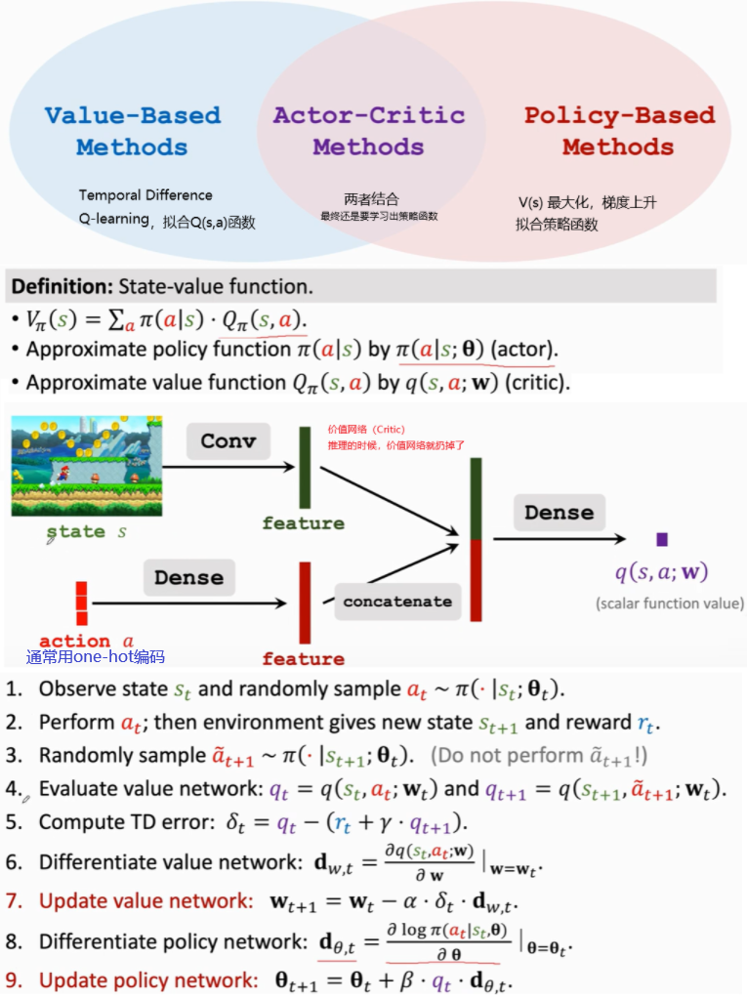


按照上图进行的训练，我没有能够收敛，所以我又找了[李宏毅老师的课程](https://www.bilibili.com/video/BV15hw9euExZ?spm_id_from=333.788.videopod.episodes&vd_source=2173cb93b451f2278a1c87becf3ef529&p=3)学习，总结如下，并在4.3的训练里收敛了：

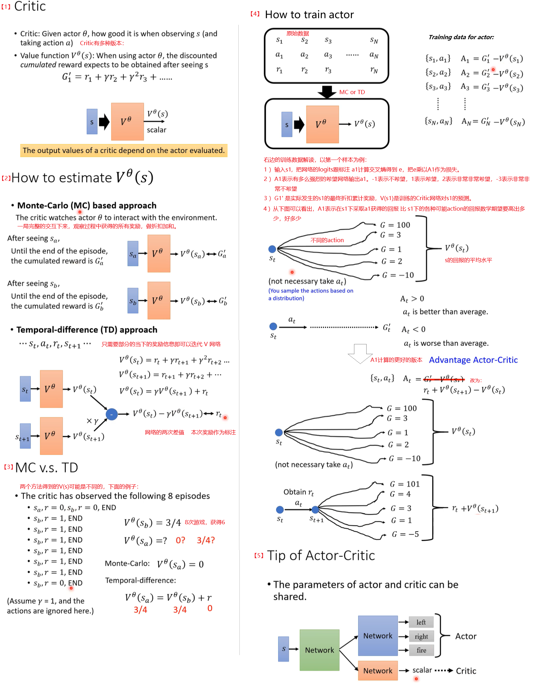

进一步理解一下：

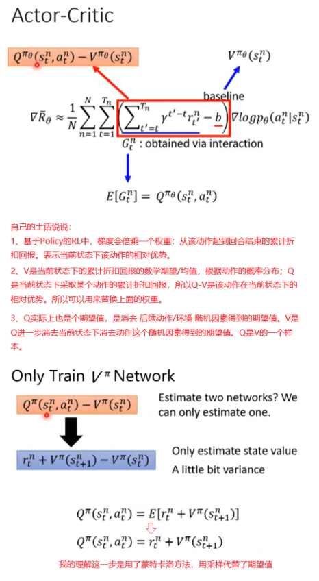

#### 4.2 实操1 按照王树森老师的课程进行训练

按照上面的算法，代码如下，但是不收敛（后来参考DDPG设计进行改造，能收敛，但效果也还是不太好）：

```python
import gym
import numpy as np
import torch
import torch.nn as nn
import torch.optim as optim
from torch.distributions import Categorical
import argparse
import os
import matplotlib.pyplot as plt

# 设置随机种子
torch.manual_seed(42)
np.random.seed(42)

# 检测设备
device = torch.device("cuda" if torch.cuda.is_available() else "cpu")
print(f"Using device: {device}")


# ----------------------------
# 1. 策略网络定义
# ----------------------------
class PolicyNetwork(nn.Module):
    def __init__(self, state_dim, action_dim, hidden_dim=128):
        super(PolicyNetwork, self).__init__()
        self.fc1 = nn.Linear(state_dim, hidden_dim)
        self.fc2 = nn.Linear(hidden_dim, action_dim)
        self.softmax = nn.Softmax(dim=-1)

    def forward(self, x):
        if len(x.shape) == 1:
            x = x.unsqueeze(0)  # [state_dim] -> [1, state_dim]
        x = torch.relu(self.fc1(x))  # [batch_size, hidden_dim]
        logits = self.fc2(x)  # [batch_size, action_dim]
        probs = self.softmax(logits)  # [batch_size, action_dim]
        return probs


class Critic(nn.Module):
    def __init__(self, state_dim=4, action_dim=1, hidden_dim=128):
        super(Critic, self).__init__()
        self.fc1 = nn.Linear(state_dim + action_dim, hidden_dim)
        self.fc2 = nn.Linear(hidden_dim, hidden_dim)
        self.fc3 = nn.Linear(hidden_dim, 1)  # 输出单个Q值
        self.relu = nn.ReLU()

    def forward(self, state, action):
        x = torch.cat([state, action], dim=-1)  # 拼接状态和动作
        x = self.relu(self.fc1(x))
        x = self.relu(self.fc2(x))
        q_value = self.fc3(x)
        return q_value


# ----------------------------
# 2. Checkpoint 保存与加载
# ----------------------------
def save_checkpoint(policy, optimizer1, critic, optimizer2, episode, reward, path):
    torch.save({
        'policy_state_dict': policy.state_dict(),
        'optimizer1_state_dict': optimizer1.state_dict(),
        'critic_state_dict': critic.state_dict(),
        'optimizer2_state_dict': optimizer2.state_dict(),
        'episode': episode,
        'reward': reward
    }, path)
    print(f"Checkpoint saved to {path} (Reward: {reward:.2f})")


def load_checkpoint(policy, optimizer1, critic, optimizer2, path):
    if os.path.exists(path):
        checkpoint = torch.load(path)
        policy.load_state_dict(checkpoint['policy_state_dict'])
        optimizer1.load_state_dict(checkpoint['optimizer1_state_dict'])
        critic.load_state_dict(checkpoint['critic_state_dict'])
        optimizer2.load_state_dict(checkpoint['optimizer2_state_dict'])
        print(f"Loaded checkpoint from {path} (Episode: {checkpoint['episode']}, Reward: {checkpoint['reward']:.2f})")
        return checkpoint['episode'], checkpoint['reward']
    else:
        print(f"No checkpoint found at {path}")
        return 0, 0


# ----------------------------
# 3. 训练函数（带Checkpoint和可视化）
# ----------------------------
def train(env_name="CartPole-v1", hidden_dim=128, lr=1e-3,
          gamma=0.99, max_episodes=10000, print_interval=2):
    env = gym.make(env_name, render_mode="human")  # 开启可视化
    state_dim = env.observation_space.shape[0]
    action_dim = env.action_space.n

    policy = PolicyNetwork(state_dim, action_dim, hidden_dim).to(device)
    critic = Critic(state_dim, action_dim, hidden_dim).to(device)
    optimizer1 = optim.Adam(policy.parameters(), lr=lr/10.0)
    optimizer2 = optim.Adam(critic.parameters(), lr=lr)

    # 尝试加载Checkpoint
    checkpoint_path = "./actor_critic_checkpoint_150_2955xx.0.pth"
    start_episode, _ = load_checkpoint(policy, optimizer1, critic, optimizer2, checkpoint_path)

    rewards_list = []
    for episode in range(start_episode, max_episodes):
        state = env.reset()
        state = state[0]
        episode_reward = 0
        episode_loss = 0.0
        step_cnt = 0

        while True:
            # randomly sample action from PolicyNet
            state_tensor = torch.FloatTensor(state).to(device)
            state_tensor = state_tensor.unsqueeze(0)
            probs = policy(state_tensor)
            m = Categorical(probs) #根据各种action的概率值probs创建一个离散的概率分布
            action = m.sample() #使用该概率分布进行抽样，得到一个具体的action
            log_probs = m.log_prob(action)

            # perform the action
            next_state, reward, done, _, _ = env.step(action.item())
            episode_reward += reward

            # randomly sample next_action from policynet,but do not perform it
            policy.eval()
            with torch.no_grad():
                state_tensor = torch.FloatTensor(next_state).to(device)
                state_tensor = state_tensor.unsqueeze(0)
                probs = policy(state_tensor)
                m = Categorical(probs)  # 根据各种action的概率值probs创建一个离散的概率分布
                next_action = m.sample()  # 使用该概率分布进行抽样，得到一个具体的action
            policy.train()

            # evaluate value network twice
            state_tensor = torch.FloatTensor(state).to(device)
            state_tensor = state_tensor.unsqueeze(0)
            action_tensor = torch.tensor([0,0], dtype=torch.float, device=device)
            action_tensor[action.item()] = 1.0 # one-hot编码action
            action_tensor = action_tensor.unsqueeze(0)
            qt = critic.forward(state_tensor, action_tensor)

            critic.eval()
            with torch.no_grad():
                state_tensor = torch.FloatTensor(next_state).to(device)
                state_tensor = state_tensor.unsqueeze(0)
                action_tensor = torch.tensor([0, 0], dtype=torch.float, device=device)
                action_tensor[next_action.item()] = 1.0  # one-hot编码action
                action_tensor = action_tensor.unsqueeze(0)
                qt_next = critic.forward(state_tensor, action_tensor)
            critic.train()

            # calculate TD error and update critc network
            loss1 = (qt - (reward + gamma * qt_next)) * (qt - (reward + gamma * qt_next))  / 2.0
            optimizer2.zero_grad()
            loss1.backward()
            optimizer2.step()
            episode_loss += loss1.item()

            # update policy network
            loss2 = -(log_probs * qt.detach()).mean()
            optimizer1.zero_grad()
            loss2.backward()
            optimizer1.step()
            episode_loss += loss2.item()

            state = next_state
            step_cnt += 1
            if done:
                break
            '''到后面模型能力强了，游戏一把玩好久也不死。就导致两次训练的时间间隔很长
            粗暴的截断会有两个问题：
            1、可能导致游戏后面才会出现的states，从来没有出现在训练集里，使得模型失去泛化能力
            2、compute_returns不准确了，这个可能对于密集奖励型游戏还好，毕竟到了后面状态，伽马的n次方接近0，后面的项影响有限
            '''
            '''if  len(rewards) > 1000:
                print('brutally cut')
                break'''

        rewards_list.append(episode_reward)
        if len(rewards_list) > 10000:
            rewards_list = rewards_list[-10000:]
        # 保存Checkpoint（如果回报>1000）
        if episode_reward > 1000:
            checkpoint_path = f"./actor_critic_checkpoint_{episode}_{episode_reward}.pth"
            save_checkpoint(policy, optimizer1, critic, optimizer2,episode, episode_reward, checkpoint_path)

        print(f"Episode {episode + 1}, Reward: {episode_reward:.2f}, Loss: {episode_loss / step_cnt:.4f}")


    env.close()
    return rewards_list


# ----------------------------
# 4. 推理函数（演示训练好的模型）
# ----------------------------
def test(env_name="CartPole-v1", hidden_dim=128, checkpoint_path="checkpoint.pth"):
    env = gym.make(env_name, render_mode="human")  # 开启可视化
    state_dim = env.observation_space.shape[0]
    action_dim = env.action_space.n

    policy = PolicyNetwork(state_dim, action_dim, hidden_dim).to(device)
    critic = Critic(state_dim, action_dim, hidden_dim).to(device) #占位符，不会被用于推理
    optimizer = optim.Adam(policy.parameters(), lr=0.001)  # 仅占位，实际不用于测试
    optimizer2 = optim.Adam(critic.parameters(), lr=0.001)  # 仅占位，实际不用于测试

    # 加载Checkpoint
    load_checkpoint(policy, optimizer, critic, optimizer2, checkpoint_path)

    print("Starting inference...")
    while True:  # 无限运行直到手动停止
        state = env.reset()[0]
        total_reward = 0

        while True:
            with torch.no_grad():
                state_tensor = torch.FloatTensor(state).to(device)
                probs = policy(state_tensor)
                action = torch.argmax(probs).item()  # 直接选最优动作

            next_state, reward, done, _, _ = env.step(action)
            total_reward += reward
            state = next_state

            if done:
                print(f"Inference Reward: {total_reward}")
                break


# ----------------------------
# 6. 主函数（命令行参数解析）
# ----------------------------
def main(mode):
    if mode == "train":
        rewards = train()
        plt.plot(rewards)
        plt.xlabel("Episode")
        plt.ylabel("Total Reward")
        plt.title("Policy Gradient Training")
        plt.show()
    elif mode == "test":
        test(checkpoint_path="./actor_critic_checkpoint_1001.0.pth")


if __name__ == "__main__":
    main("train")
```


#### 4.3 实操2 按照李宏毅老师的课程进行训练

下面的代码，模型能够收敛，能上2万多分：

```python
Episode 298, Reward: 372.00, Loss: 1.0105
Checkpoint saved to ./actor_critic_checkpoint_298_26247.0.pth (Reward: 26247.00)
```

代码如下：

```python
import gym
import numpy as np
import torch
import torch.nn as nn
import torch.optim as optim
from torch.distributions import Categorical
import argparse
import os
import matplotlib.pyplot as plt

# 设置随机种子
torch.manual_seed(42)
np.random.seed(42)

# 检测设备
device = torch.device("cuda" if torch.cuda.is_available() else "cpu")
print(f"Using device: {device}")


# ----------------------------
# 1. 策略网络定义
# ----------------------------
class PolicyNetwork(nn.Module):
    def __init__(self, state_dim, action_dim, hidden_dim=128):
        super(PolicyNetwork, self).__init__()
        self.fc1 = nn.Linear(state_dim, hidden_dim)
        self.fc2 = nn.Linear(hidden_dim, action_dim)
        self.softmax = nn.Softmax(dim=-1)

    def forward(self, x):
        if len(x.shape) == 1:
            x = x.unsqueeze(0)  # [state_dim] -> [1, state_dim]
        x = torch.relu(self.fc1(x))  # [batch_size, hidden_dim]
        logits = self.fc2(x)  # [batch_size, action_dim]
        probs = self.softmax(logits)  # [batch_size, action_dim]
        return probs

# 价值网络的定义
class Critic(nn.Module):
    def __init__(self, state_dim=4, hidden_dim=128):
        super(Critic, self).__init__()
        self.fc1 = nn.Linear(state_dim, hidden_dim)
        self.fc2 = nn.Linear(hidden_dim, hidden_dim)
        self.fc3 = nn.Linear(hidden_dim, 1)  # 输出状态价值V
        self.relu = nn.ReLU()

    def forward(self, state):
        x = self.relu(self.fc1(state))
        x = self.relu(self.fc2(x))
        value = self.fc3(x)
        return value


# ----------------------------
# 2. Checkpoint 保存与加载
# ----------------------------
def save_checkpoint(policy, optimizer1, critic, optimizer2, episode, reward, path):
    torch.save({
        'policy_state_dict': policy.state_dict(),
        'optimizer1_state_dict': optimizer1.state_dict(),
        'critic_state_dict': critic.state_dict(),
        'optimizer2_state_dict': optimizer2.state_dict(),
        'episode': episode,
        'reward': reward
    }, path)
    print(f"Checkpoint saved to {path} (Reward: {reward:.2f})")


def load_checkpoint(policy, optimizer1, critic, optimizer2, path):
    if os.path.exists(path):
        checkpoint = torch.load(path)
        policy.load_state_dict(checkpoint['policy_state_dict'])
        optimizer1.load_state_dict(checkpoint['optimizer1_state_dict'])
        critic.load_state_dict(checkpoint['critic_state_dict'])
        optimizer2.load_state_dict(checkpoint['optimizer2_state_dict'])
        print(f"Loaded checkpoint from {path} (Episode: {checkpoint['episode']}, Reward: {checkpoint['reward']:.2f})")
        return checkpoint['episode'], checkpoint['reward']
    else:
        print(f"No checkpoint found at {path}")
        return 0, 0


# ----------------------------
# 3. 训练函数（带Checkpoint和可视化）
# ----------------------------
def train(env_name="CartPole-v1", hidden_dim=128, lr=1e-3,
          gamma=0.99, max_episodes=10000, print_interval=2):
    env = gym.make(env_name, render_mode="human")  # 开启可视化
    state_dim = env.observation_space.shape[0]
    action_dim = env.action_space.n

    policy = PolicyNetwork(state_dim, action_dim, hidden_dim).to(device)
    critic = Critic().to(device)
    optimizer1 = optim.Adam(policy.parameters(), lr=lr)
    optimizer2 = optim.Adam(critic.parameters(), lr=lr)

    # 尝试加载Checkpoint
    checkpoint_path = "./actor_critic_checkpoint_150_2955xx.0.pth"
    start_episode, _ = load_checkpoint(policy, optimizer1, critic, optimizer2, checkpoint_path)

    rewards_list = []
    for episode in range(start_episode, max_episodes):
        state = env.reset()
        state = state[0]
        episode_reward = 0
        episode_loss = 0.0
        step_cnt = 0

        while True:
            # 选择动作
            state_tensor = torch.FloatTensor(state).to(device).unsqueeze(0)
            probs = policy(state_tensor)
            m = Categorical(probs)
            action = m.sample()
            log_prob = m.log_prob(action)

            # 执行动作
            next_state, reward, done, _, _ = env.step(action.item())
            episode_reward += reward

            # 计算V值
            state_value = critic(state_tensor)
            next_state_tensor = torch.FloatTensor(next_state).to(device).unsqueeze(0)
            next_state_value = critic(next_state_tensor).detach()

            # 计算TD误差(优势函数)
            td_error = reward + gamma * next_state_value * (1 - done) - state_value

            # 更新Critic
            critic_loss = td_error.pow(2).mean()
            optimizer2.zero_grad()
            critic_loss.backward()
            optimizer2.step()
            episode_loss += critic_loss.item()

            # 更新Actor
            policy_loss = -log_prob * td_error.detach()
            optimizer1.zero_grad()
            policy_loss.backward()
            optimizer1.step()
            episode_loss += policy_loss.item()

            state = next_state
            step_cnt += 1
            if done:
                break
            '''到后面模型能力强了，游戏一把玩好久也不死。就导致两次训练的时间间隔很长
            粗暴的截断会有两个问题：
            1、可能导致游戏后面才会出现的states，从来没有出现在训练集里，使得模型失去泛化能力
            2、compute_returns不准确了，这个可能对于密集奖励型游戏还好，毕竟到了后面状态，伽马的n次方接近0，后面的项影响有限
            '''
            '''if  len(rewards) > 1000:
                print('brutally cut')
                break'''

        rewards_list.append(episode_reward)
        if len(rewards_list) > 10000:
            rewards_list = rewards_list[-10000:]
        # 保存Checkpoint（如果回报>1000）
        if episode_reward > 1000:
            checkpoint_path = f"./actor_critic_checkpoint_{episode}_{episode_reward}.pth"
            save_checkpoint(policy, optimizer1, critic, optimizer2,episode, episode_reward, checkpoint_path)

        print(f"Episode {episode + 1}, Reward: {episode_reward:.2f}, Loss: {episode_loss / step_cnt:.4f}")


    env.close()
    return rewards_list


# ----------------------------
# 4. 推理函数（演示训练好的模型）
# ----------------------------
def test(env_name="CartPole-v1", hidden_dim=128, checkpoint_path="checkpoint.pth"):
    env = gym.make(env_name, render_mode="human")  # 开启可视化
    state_dim = env.observation_space.shape[0]
    action_dim = env.action_space.n

    policy = PolicyNetwork(state_dim, action_dim, hidden_dim).to(device)
    critic = Critic().to(device) #占位符，不会被用于推理
    optimizer = optim.Adam(policy.parameters(), lr=0.001)  # 仅占位，实际不用于测试
    optimizer2 = optim.Adam(critic.parameters(), lr=0.001)  # 仅占位，实际不用于测试

    # 加载Checkpoint
    load_checkpoint(policy, optimizer, critic, optimizer2, checkpoint_path)

    print("Starting inference...")
    while True:  # 无限运行直到手动停止
        state = env.reset()[0]
        total_reward = 0

        while True:
            with torch.no_grad():
                state_tensor = torch.FloatTensor(state).to(device)
                probs = policy(state_tensor)
                action = torch.argmax(probs).item()  # 直接选最优动作

            next_state, reward, done, _, _ = env.step(action)
            total_reward += reward
            state = next_state

            if done:
                print(f"Inference Reward: {total_reward}")
                break


# ----------------------------
# 6. 主函数（命令行参数解析）
# ----------------------------
def main(mode):
    if mode == "train":
        rewards = train()
        plt.plot(rewards)
        plt.xlabel("Episode")
        plt.ylabel("Total Reward")
        plt.title("Policy Gradient Training")
        plt.show()
    elif mode == "test":
        test(checkpoint_path="./actor_critic_checkpoint_1001.0.pth")


if __name__ == "__main__":
    main("train")
```

### 5. AlphaGo的原理

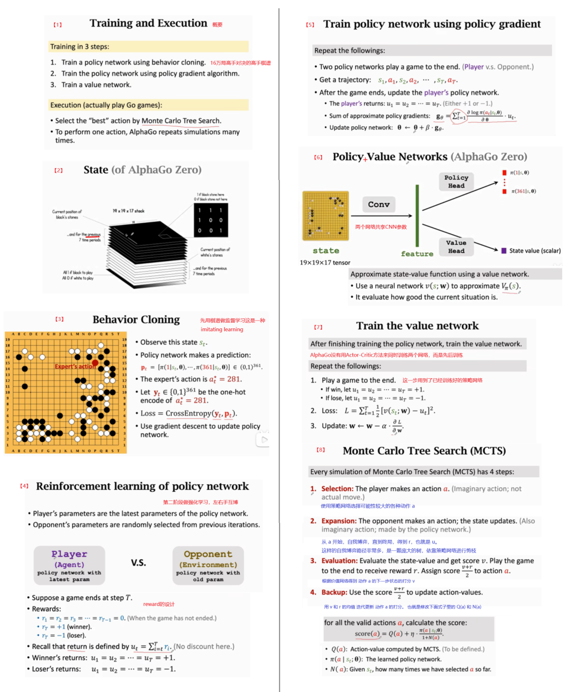

### 6. 蒙特卡洛算法

蒙特卡洛算法是一种通过反复随机抽样以逼近某个数值的数值方法。

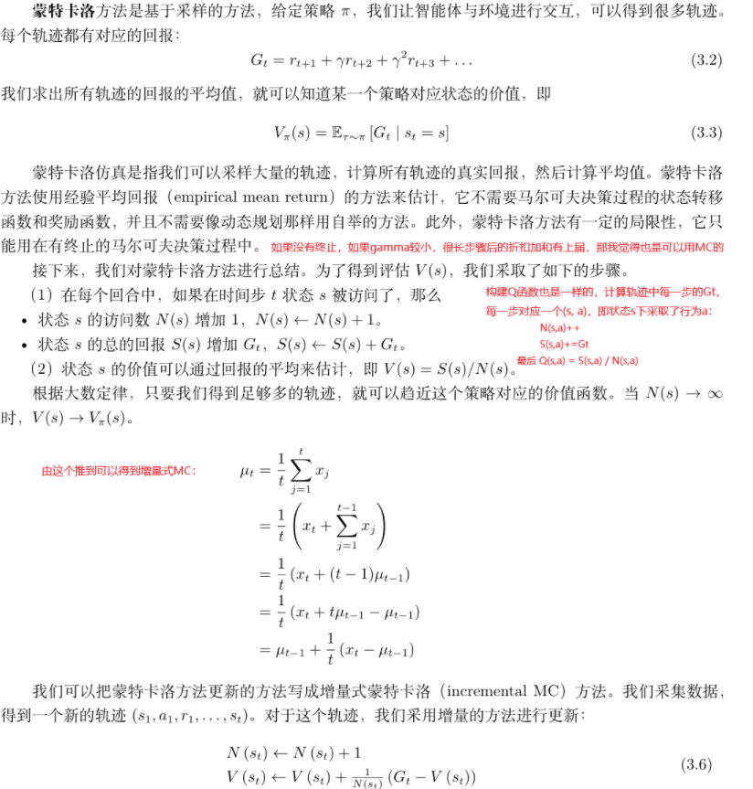


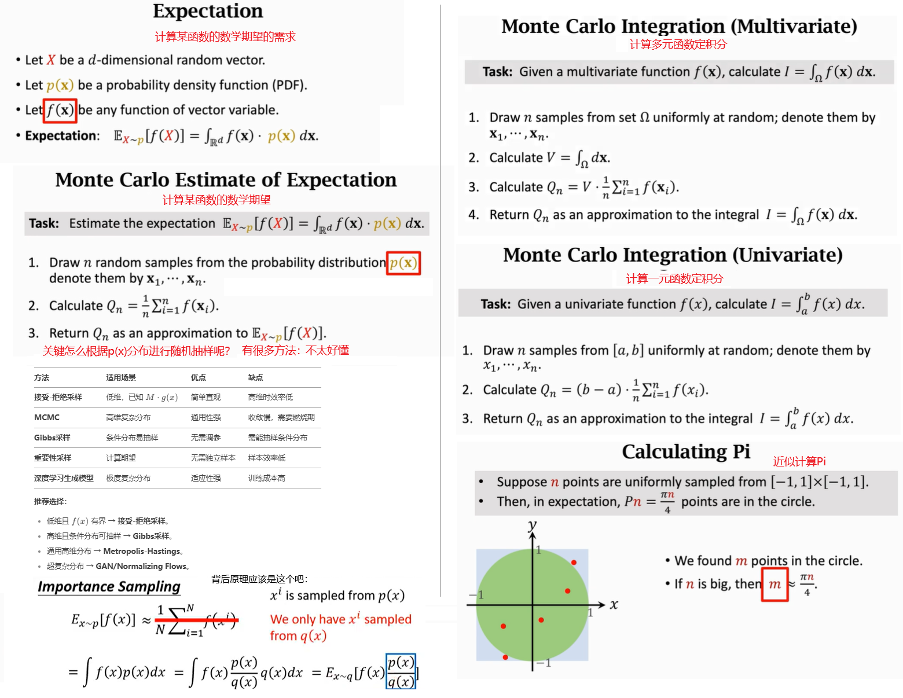

### 7. Off-Policy方法与近端策略优化(PPO)

#### 7.1 原理

1. 把on-policy方法转为off-policy方法，可以更高效，避免必须采样一回合才能训练一回合。
2. 但被训练的策略网络和负责与环境交互的策略网络不是同一个，采样是遵从后者的分布，这时候就需要用重要性采样对梯度计算进行调整。
3. 两者的分布不能相差太远，否则会触发重要性采样的issue，所以PPO会引入KL作为惩罚项


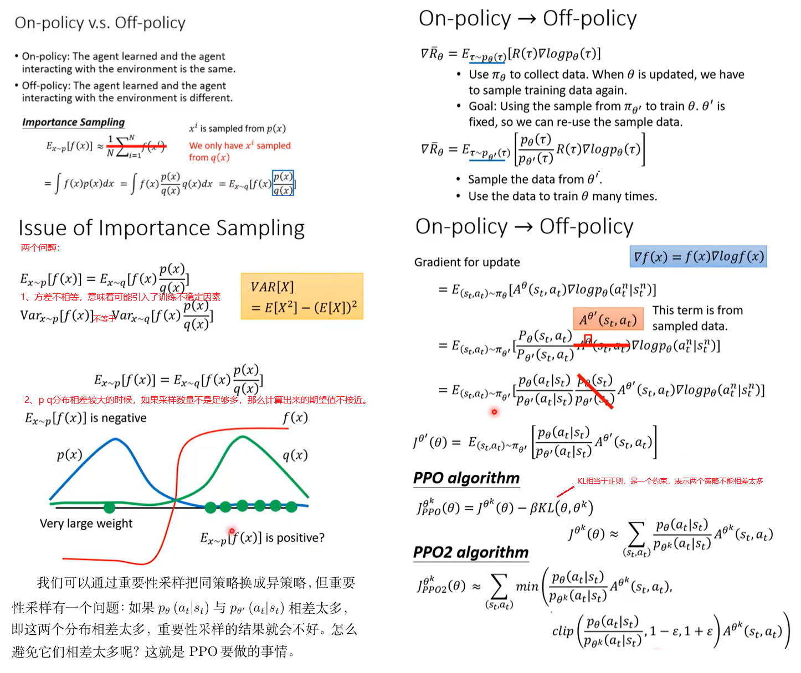

我自然而然就会思考一个问题：A-C和DQN怎么改造为Off-Policy方式以提高训练效率和样本利用率？AI这么跟我说：

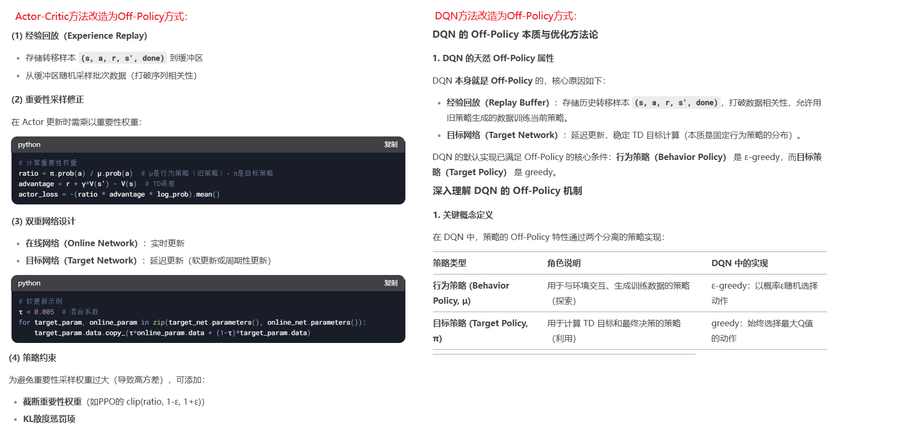

#### 7.2 实操

还是平衡车小游戏：

```python
import gym
import numpy as np
import torch
import torch.nn as nn
import torch.optim as optim
from torch.distributions import Categorical
import argparse
import os
import matplotlib.pyplot as plt

# 设置随机种子
torch.manual_seed(42)
np.random.seed(42)

# 检测设备
device = torch.device("cuda" if torch.cuda.is_available() else "cpu")
print(f"Using device: {device}")


# ----------------------------
# 1. 策略网络定义
# ----------------------------
class PolicyNetwork(nn.Module):
    def __init__(self, state_dim, action_dim, hidden_dim=128):
        super(PolicyNetwork, self).__init__()
        self.fc1 = nn.Linear(state_dim, hidden_dim)
        self.fc2 = nn.Linear(hidden_dim, action_dim)
        self.softmax = nn.Softmax(dim=-1)

    def forward(self, x):
        if len(x.shape) == 1:
            x = x.unsqueeze(0)  # [state_dim] -> [1, state_dim]
        x = torch.relu(self.fc1(x))  # [batch_size, hidden_dim]
        logits = self.fc2(x)  # [batch_size, action_dim]
        probs = self.softmax(logits)  # [batch_size, action_dim]
        return probs


# ----------------------------
# 2. Checkpoint 保存与加载
# ----------------------------
def save_checkpoint(policy, optimizer, episode, reward, path="checkpoint.pth"):
    torch.save({
        'policy_state_dict': policy.state_dict(),
        'optimizer_state_dict': optimizer.state_dict(),
        'episode': episode,
        'reward': reward
    }, path)
    print(f"Checkpoint saved to {path} (Reward: {reward:.2f})")


def load_checkpoint(policy, optimizer, path="checkpoint.pth"):
    if os.path.exists(path):
        checkpoint = torch.load(path)
        policy.load_state_dict(checkpoint['policy_state_dict'])
        optimizer.load_state_dict(checkpoint['optimizer_state_dict'])
        print(f"Loaded checkpoint from {path} (Episode: {checkpoint['episode']}, Reward: {checkpoint['reward']:.2f})")
        return checkpoint['episode'], checkpoint['reward']
    else:
        print(f"No checkpoint found at {path}")
        return 0, 0


# ----------------------------
# 3. 训练函数（带Checkpoint和可视化）
# ----------------------------
def train(env_name="CartPole-v1", hidden_dim=128, lr=1e-3,    # backup  lr=1e-2
          gamma=0.99, max_episodes=1000, print_interval=2):
    env = gym.make(env_name, render_mode="human")  # 开启可视化
    state_dim = env.observation_space.shape[0]
    action_dim = env.action_space.n

    learner = PolicyNetwork(state_dim, action_dim, hidden_dim).to(device) #负责学习，更新梯度
    worker = PolicyNetwork(state_dim, action_dim, hidden_dim).to(device)  #负责与环境交互
    optimizer = optim.Adam(learner.parameters(), lr=lr)

    # 尝试加载Checkpoint
    checkpoint_path = "./ppo_checkpoint_150_2955xx.0.pth"
    start_episode, _ = load_checkpoint(learner, optimizer, checkpoint_path)
    worker.load_state_dict(learner.state_dict())

    episode_rewards = []

    for episode in range(start_episode, max_episodes):

        #用worker收集若干个回合的轨迹
        states, actions, rewards = [], [], []
        while len(actions) < 64:
            state = env.reset()
            state = state[0]
            while True:
                state_tensor = torch.FloatTensor(state).to(device)
                state_tensor = state_tensor.unsqueeze(0)
                probs = worker(state_tensor)
                m = Categorical(probs) #根据各种action的概率值probs创建一个离散的概率分布
                action = m.sample() #使用该概率分布进行抽样，得到一个具体的action

                next_state, reward, done, _, _ = env.step(action.item())

                states.append(state_tensor.squeeze(0))
                actions.append(action.squeeze(0))
                rewards.append(reward)

                state = next_state
                if done:
                    break


        # 计算回报
        total_reward = sum(rewards)
        episode_rewards.append(total_reward)

        returns = compute_returns(rewards, gamma)
        returns = (returns - returns.mean()) / (returns.std() + 1e-9)

        # 反复利用收集到的数据，更新learner策略
        i = 0
        for i in range(5):
            loss, kl = train_policy_network(learner, worker, optimizer, states, actions, returns)
            if abs(kl) > 0.01: # kl散度比较大，说明两个模型之间分布差异偏大，不适合继续训练，需要重新跟环境交互
                break

        worker.load_state_dict(learner.state_dict())

        # 保存Checkpoint（如果回报>1000）
        if total_reward > 1000:
            checkpoint_path = f"./ppo_checkpoint_{episode}_{total_reward}.pth"
            save_checkpoint(learner, optimizer, episode, total_reward, checkpoint_path)


        # 打印进度
        if (episode + 1) % print_interval == 0:
            avg_reward = np.mean(episode_rewards[-print_interval:])
            print(f"Episode {episode + 1}, Avg Reward: {avg_reward:.2f}, Loss: {loss:.4f}")

        # 提前终止
        if len(episode_rewards) >= 100 and np.mean(episode_rewards[-100:]) >= 2000:
            print(f"Solved at Episode {episode + 1}!")
            break

    env.close()
    return episode_rewards


# ----------------------------
# 4. 推理函数（演示训练好的模型）
# ----------------------------
def test(env_name="CartPole-v1", hidden_dim=128, checkpoint_path="checkpoint.pth"):
    env = gym.make(env_name, render_mode="human")  # 开启可视化
    state_dim = env.observation_space.shape[0]
    action_dim = env.action_space.n

    policy = PolicyNetwork(state_dim, action_dim, hidden_dim).to(device)
    optimizer = optim.Adam(policy.parameters(), lr=0.001)  # 仅占位，实际不用于测试

    # 加载Checkpoint
    load_checkpoint(policy, optimizer, checkpoint_path)

    print("Starting inference...")
    while True:  # 无限运行直到手动停止
        state = env.reset()[0]
        total_reward = 0

        while True:
            with torch.no_grad():
                state_tensor = torch.FloatTensor(state).to(device)
                probs = policy(state_tensor)
                action = torch.argmax(probs).item()  # 直接选最优动作

            next_state, reward, done, _, _ = env.step(action)
            total_reward += reward
            state = next_state

            if done:
                print(f"Inference Reward: {total_reward}")
                break


# ----------------------------
# 5. 辅助函数， 用于策略梯度更新（替代Q(s,a) 的蒙特卡洛估计）
# ----------------------------
def compute_returns(rewards, gamma=0.99):
    returns = []
    R = 0
    for r in reversed(rewards):
        R = r + gamma * R
        returns.insert(0, R)
    return torch.tensor(returns, device=device)

def importance_sample_and_kl(learner, worker, states, actions, epsilon=0.2):
    # 计算当前策略（learner）下的动作概率
    with torch.no_grad():
        probs = learner(states)  # [T, action_dim]
    pa1 = probs[torch.arange(probs.size(0)), actions]  # 当前策略下，动作a的概率

    # 计算旧策略（worker）下的动作概率
    with torch.no_grad():
        old_probs = worker(states)  # [T, action_dim]
    pa2 = old_probs[torch.arange(probs.size(0)), actions]  # 旧策略下，动作a的概率

    # 计算重要性采样比率: r_t = pi_new(a|s) / pi_old(a|s)
    importance_ratio = pa1 / (pa2 + 1e-6)

    # 计算KL散度
    log_pa1 = torch.log(pa1 + 1e-6)  # 当前策略下的log概率
    log_pa2 = torch.log(pa2 + 1e-6)  # 旧策略下的log概率
    kl_divergence = torch.mean( pa2 * (log_pa2 - log_pa1)  )  # KL散度

    return importance_ratio, kl_divergence


def train_policy_network(learner, worker, optimizer, states, actions, returns):
    # 将列表中的状态/动作/回报堆叠成张量， 假设一把游戏玩下来的状态个数是T
    states = torch.stack(states)  # [T, 4]
    actions = torch.stack(actions) # [T]
    returns = returns  # [T]
    # 1. 通过策略网络计算动作概率
    probs = learner(states)  # [T, action_dim]
    # 2. 创建分类分布（用于采样和计算对数概率）
    m = Categorical(probs)
    # 3. 计算所选动作的对数概率
    log_probs = m.log_prob(actions)  # [T,]
    importance_ratio, kl = importance_sample_and_kl(learner, worker, states, actions)
    importance_ratio = torch.clamp(importance_ratio, 1 - 0.2, 1 + 0.2)
    # 4. 因为基于策略的强化学习要使用梯度上升使得state-value函数的期望最大化，所以损失函数是期望值的负数
    # returns已经在函数外面进行了带折扣的汇总运算，也就是已经是U了，不是每一步的r
    loss = -(log_probs * returns*importance_ratio).mean() + 0.01 * kl
    optimizer.zero_grad()
    loss.backward()
    optimizer.step()
    return loss.item(), kl


# ----------------------------
# 6. 主函数（命令行参数解析）
# ----------------------------
def main(mode):
    if mode == "train":
        rewards = train()
        plt.plot(rewards)
        plt.xlabel("Episode")
        plt.ylabel("Total Reward")
        plt.title("Policy Gradient Training")
        plt.show()
    elif mode == "test":
        test(checkpoint_path="./pbrl_checkpoint_1001.0.pth")


if __name__ == "__main__":
    main("train")
```

感觉收敛会比之前的On Policy的方法要慢一些：

```shell
Episode 218, Avg Reward: 384.00, Loss: -0.0044
Checkpoint saved to ./ppo_checkpoint_219_1834.0.pth (Reward: 1834.00)
Episode 220, Avg Reward: 1230.50, Loss: -0.0003
```


### 8. imitation learning

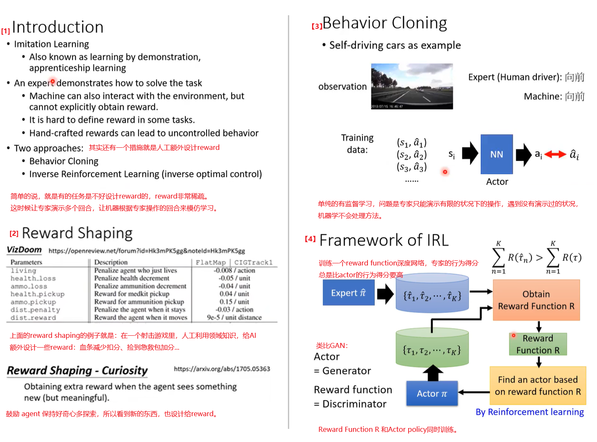

### 9. RLHF

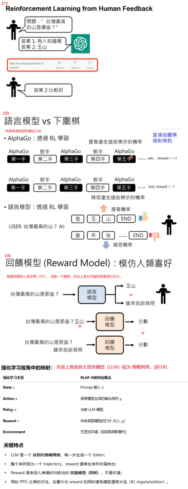

### 10. 马尔可夫决策过程(MDP)与动态规划(DP)

#### 10.1 基本概念

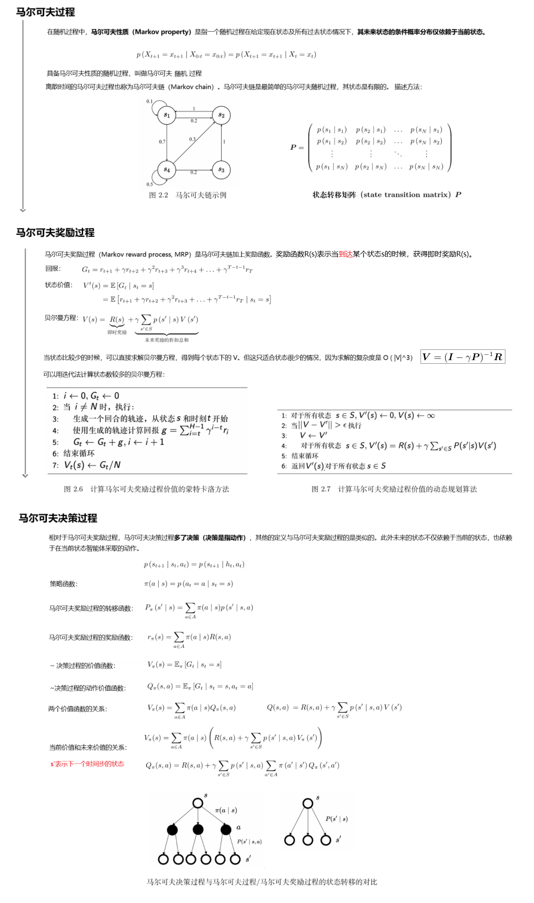

#### 10.2 如何用动态规划进行预测与控制

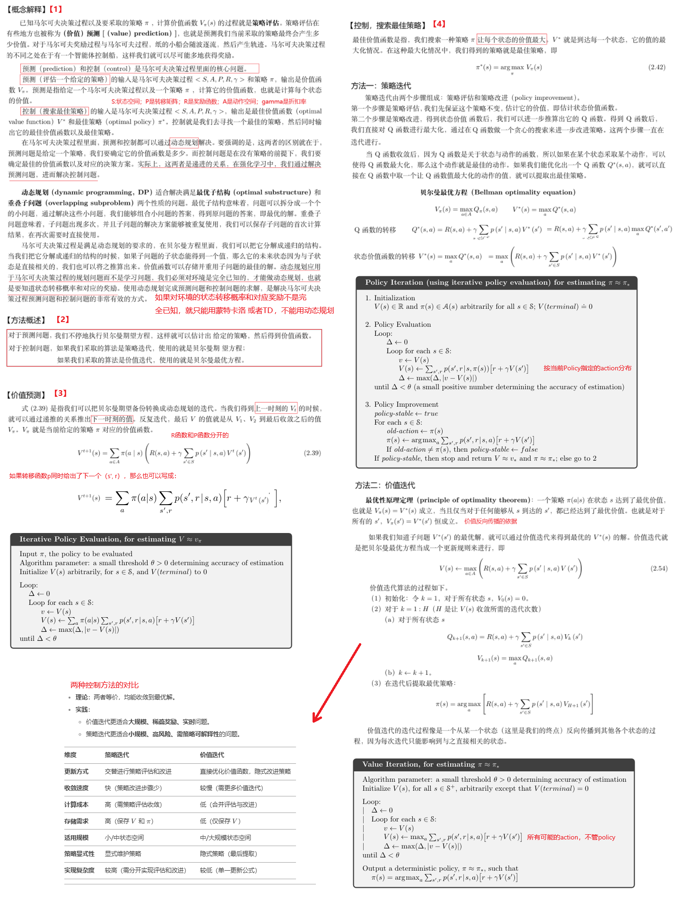

思考：

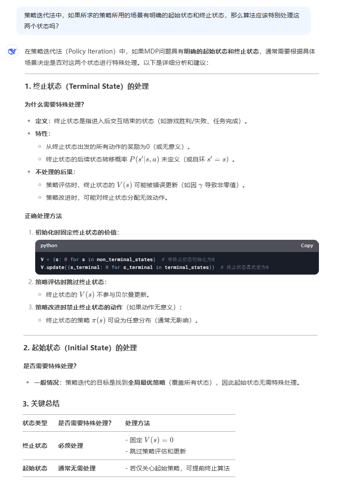

##### 10.2.1 实操1  用动态规划实现GridWorld的预测与控制

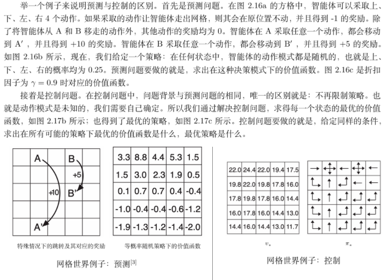

代码如下，包括预测与控制：

```python
import random
import torch
from tqdm import tqdm

# 这里环境的代码之所以我自己直接写，说明
# 1. 环境对我们是已知的，也就是状态变迁概率函数和奖励函数是完全掌握额
# 2. 说明我们不需要真的跟环境交互，用自己的代码来描述环境的状态变迁和奖励
class GridWorldEnv:
    def __init__(self):
        self.GRID_NUM = 5
        self.ACTION_SPACE = {1:'UP', 2:'DOWN', 3:'LEFT',4:'RIGHT'}
        self.current_x = 0
        self.current_y = 0
        self.A = (1, 0)
        self.B = (3, 0)
        self.AA = (1, 4)
        self.BB = (3, 2)
        self.gamma = 0.9

    def reset(self):
        self.current_x = random.randint(0, self.GRID_NUM-1)
        self.current_y = random.randint(0, self.GRID_NUM - 1)
        return (self.current_x, self.current_y)

    def step(self, action):
        reward = 0
        if not action in self.ACTION_SPACE:
            print(f"invalid action {action}")
            return (self.current_x, self.current_y), reward, False # new_state, reward, done
        if (self.current_x, self.current_y) == self.A:
            self.current_x, self.current_y = self.AA
            reward = 10
            return (self.current_x, self.current_y), reward, False
        if (self.current_x, self.current_y) == self.B:
            self.current_x, self.current_y = self.BB
            reward = 5
            return (self.current_x, self.current_y), reward, False
        if action == 1 and self.current_y == 0: # up but boundary
            reward = -1
            return (self.current_x, self.current_y), reward, False
        if action == 2 and self.current_y == (self.GRID_NUM-1): # down but boundary
            reward = -1
            return (self.current_x, self.current_y), reward, False
        if action == 3 and self.current_x == 0: # left but boundary
            reward = -1
            return (self.current_x, self.current_y), reward, False
        if action == 4 and self.current_x == (self.GRID_NUM-1): # left but boundary
            reward = -1
            return (self.current_x, self.current_y), reward, False
        if action == 1: # up
            self.current_y -= 1
            reward = 0
            return (self.current_x, self.current_y), reward, False
        if action == 2: # down
            self.current_y += 1
            reward = 0
            return (self.current_x, self.current_y), reward, False
        if action == 3: # left
            self.current_x -= 1
            reward = 0
            return (self.current_x, self.current_y), reward, False
        if action == 4: # right
            self.current_x += 1
            reward = 0
            return (self.current_x, self.current_y), reward, False
	#额外赠送：蒙特卡洛方式进行预测
    def monte_carlo_update(self):
        v = torch.zeros(self.GRID_NUM, self.GRID_NUM, dtype=torch.float32)
        return_sum = torch.zeros(self.GRID_NUM, self.GRID_NUM, dtype=torch.float32)
        return_cnt = torch.zeros(self.GRID_NUM, self.GRID_NUM, dtype=torch.float32)

        for episode in range(1000): # 1000个回合
            self.reset()
            # 抽样很多了就换个起点，这是一个优化，可以去掉
            if return_cnt[self.current_y, self.current_x] > 1000:
                continue

            # walk 1000 steps，得到一个回合的步骤
            trajectory = []
            for i in range(500): #每个回合最多500步
                from_x, from_y = self.current_x, self.current_y
                action = random.randint(1,4)
                _, r, _ = self.step(action)
                trajectory.append((from_x, from_y, r))

                # 如果已经有了100步，且当前状态的抽样已经很多了。这是一个优化，可以去掉
                if len(trajectory) > 100 and return_cnt[self.current_y, self.current_x] > 200: #抽样很多了就可以不继续往下走
                    G = return_sum[self.current_y, self.current_x] / return_cnt[self.current_y, self.current_x]
                    trajectory.append((self.current_x, self.current_y, G ))
                    break

            # calculate returns
            G = 0
            for (x, y, r) in reversed(trajectory):
                G = r + G * self.gamma
                return_sum[y, x] += G
                return_cnt[y, x] += 1

        for y in range(self.GRID_NUM):
            for x in range(self.GRID_NUM):
                if return_cnt[y, x] > 0:
                    v[y, x] = return_sum[y, x] / return_cnt[y, x]

        for y in range(self.GRID_NUM):
            for x in range(self.GRID_NUM):
                print(f"{v[y, x]:.2f} ", end="")
            print("")
        return v
 ########################### 进行预测 ##################################
	#动态规划对 等概率随机动作的策略 进行预测
    def calculate_V(self):
        v = torch.zeros(self.GRID_NUM, self.GRID_NUM, dtype=torch.float32)

        for episode in range(1000):#最多迭代这么多次
            deltaBig = False
            self.reset()
            old_v = v.clone()
            #每一个状态
            for y in range(self.GRID_NUM):
                for x in range(self.GRID_NUM):
                    #每一个动作
                    newvalue = 0
                    for action in [1,2,3,4]:
                        #强制设置当前位置在(y,x)处，并做出一个行动
                        self.current_y = y
                        self.current_x = x
                        _, r, _ = self.step(action)
                        newvalue += 0.25 * (self.gamma * old_v[self.current_y, self.current_x] + r)
                    if (newvalue-old_v[y, x])*(newvalue-old_v[y, x]) > 0.000001:
                        deltaBig = True
                    v[y, x] = newvalue
            if not deltaBig: #早停
                break

        for y in range(self.GRID_NUM):
            for x in range(self.GRID_NUM):
                print(f"{v[y, x]:.2f} ", end="")
            print("")
        return v
################## 进行控制 #################################
    # Q*
    def calculate_Q(self):
        self.Q = torch.zeros(self.GRID_NUM, self.GRID_NUM, len(self.ACTION_SPACE))
        for episode in range(1000): #最多1000轮
            delta = 0#统计本轮最大的迭代变化绝对值
            old_Q = self.Q.clone()
            #每一个状态
            for y in range(self.GRID_NUM):
                for x in range(self.GRID_NUM):
                    #每一个动作
                    for action in range( len(self.ACTION_SPACE)):
                        # 强制设置当前位置在(y,x)处，并做出一个行动
                        self.current_y = y
                        self.current_x = x
                        (next_x, next_y), r, _ = self.step(action+1)
                        max_next_Q = old_Q[next_y, next_x].max().item()
                        self.Q[y, x, action] = self.gamma * max_next_Q + r

                        if (old_Q[y, x, action] - (self.gamma * max_next_Q + r)).abs() > delta:
                            delta = (old_Q[y, x, action] - (self.gamma * max_next_Q + r)).abs().item()

            if (delta * delta) < 0.000001:
                break

        for y in range(self.GRID_NUM):
            for x in range(self.GRID_NUM):
                print("(", end="")
                for action in range(len(self.ACTION_SPACE)):
                    print(f"{self.Q[y, x, action]:.1f},", end="")
                print(") ", end="")
            print("")
        return self.Q
    
#根据Q* 找到每个状态下回报最大的动作
    def extract_best_policy(self):
        self.Pi = torch.zeros(self.GRID_NUM, self.GRID_NUM, dtype=torch.int32)
        arrows = {0: '↑', 1: '↓', 2: '←', 3: '→'}

        for y in range(self.GRID_NUM):
            for x in range(self.GRID_NUM):
                max_Q_action = self.Q[y, x].argmax().item()
                self.Pi[y, x] = max_Q_action+1
                print(f"{arrows[max_Q_action]} ", end="")
            print("")


env = GridWorldEnv()
print("dynamic plan:")
env.calculate_V()
print("monte carlo:")
env.monte_carlo_update()
print("\nQ* :")
env.calculate_Q()
print("\nbest policy:")
env.extract_best_policy()
```

【思考】：

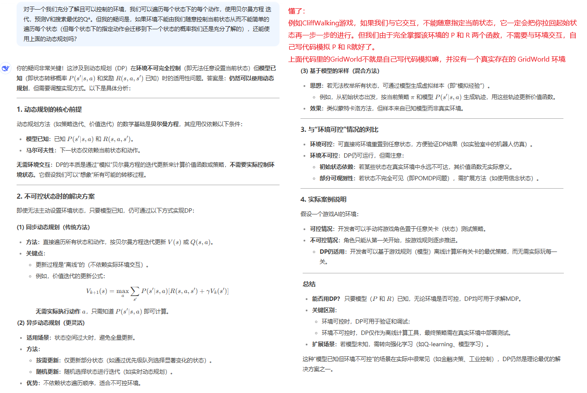

##### 10.2.2 实操2 策略迭代法进行控制

还是实操1的toy problem，策略迭代法进行最优策略求解：

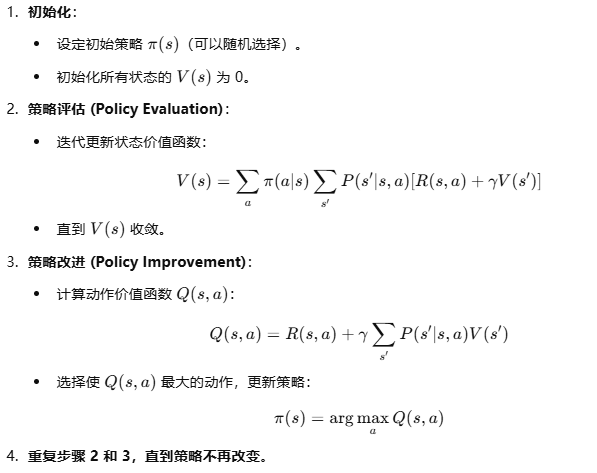


代码如下：

```python
import random
import torch
from tqdm import tqdm

class GridWorldEnv:
    def __init__(self):
        self.GRID_NUM = 5
        self.ACTION_SPACE = {1:'UP', 2:'DOWN', 3:'LEFT',4:'RIGHT'}
        self.current_x = 0
        self.current_y = 0
        self.A = (1, 0)
        self.B = (3, 0)
        self.AA = (1, 4)
        self.BB = (3, 2)
        self.gamma = 0.9

    def reset(self):
        self.current_x = random.randint(0, self.GRID_NUM-1)
        self.current_y = random.randint(0, self.GRID_NUM - 1)
        return (self.current_x, self.current_y)

    def step(self, action):
        reward = 0
        if not action in self.ACTION_SPACE:
            print(f"invalid action {action}")
            return (self.current_x, self.current_y), reward, False # new_state, reward, done
        if (self.current_x, self.current_y) == self.A:
            self.current_x, self.current_y = self.AA
            reward = 10
            return (self.current_x, self.current_y), reward, False
        if (self.current_x, self.current_y) == self.B:
            self.current_x, self.current_y = self.BB
            reward = 5
            return (self.current_x, self.current_y), reward, False
        if action == 1 and self.current_y == 0: # up but boundary
            reward = -1
            return (self.current_x, self.current_y), reward, False
        if action == 2 and self.current_y == (self.GRID_NUM-1): # down but boundary
            reward = -1
            return (self.current_x, self.current_y), reward, False
        if action == 3 and self.current_x == 0: # left but boundary
            reward = -1
            return (self.current_x, self.current_y), reward, False
        if action == 4 and self.current_x == (self.GRID_NUM-1): # left but boundary
            reward = -1
            return (self.current_x, self.current_y), reward, False
        if action == 1: # up
            self.current_y -= 1
            reward = 0
            return (self.current_x, self.current_y), reward, False
        if action == 2: # down
            self.current_y += 1
            reward = 0
            return (self.current_x, self.current_y), reward, False
        if action == 3: # left
            self.current_x -= 1
            reward = 0
            return (self.current_x, self.current_y), reward, False
        if action == 4: # right
            self.current_x += 1
            reward = 0
            return (self.current_x, self.current_y), reward, False


    def policy_iterate(self, theta=1e-4):
        """ 使用策略迭代求解最优策略 """
        V = torch.zeros((self.GRID_NUM, self.GRID_NUM), dtype=torch.float32)  # 状态值函数 V(s)
        policy = torch.zeros((self.GRID_NUM, self.GRID_NUM), dtype=torch.int32)  # 初始随机策略

        while True:
            # 1. 策略评估 (Policy Evaluation)
            while True:
                delta = 0
                V_old = V.clone()

                for x in range(self.GRID_NUM):
                    for y in range(self.GRID_NUM):
                        self.current_x = x
                        self.current_y = y
                        action = policy[y, x].item()
                        (next_x, next_y), reward, _ = self.step( action+1)
                        V[y, x] = reward + self.gamma * V[next_y, next_x]
                        delta = max(delta, abs(V[y, x] - V_old[y, x]))

                if delta < theta:  # 价值函数收敛
                    break

            # 2. 策略改进 (Policy Improvement)
            policy_stable = True

            for y in range(self.GRID_NUM):
                for x in range(self.GRID_NUM):
                    old_action = policy[y, x].item()

                    # 计算 Q(s, a) 并选择最优动作
                    Q_values = []
                    for action in range(4):
                        self.current_x = x
                        self.current_y = y
                        (next_x, next_y), reward, _ = self.step( action+1)
                        Q_values.append(reward + self.gamma * V[next_y, next_x])

                    best_action = torch.tensor(Q_values).argmax().item()
                    policy[y, x] = best_action  # 选择最优动作

                    if old_action != best_action:
                        policy_stable = False  # 策略仍在变化

            if policy_stable:  # 当策略不再变化时，停止迭代
                break

        return policy, V

env = GridWorldEnv()
policy, v = env.policy_iterate()
arrows = {0: '↑', 1: '↓', 2: '←', 3: '→'}
for y in range(env.GRID_NUM):
    for x in range(env.GRID_NUM):
        action = policy[y, x].item()
        print(f"{arrows[action]} ", end="")
    print("")
```

##### 10.2.3 实操3 价值迭代法进行控制

还是实操1的toy problem，价值迭代法进行最优策略求解：

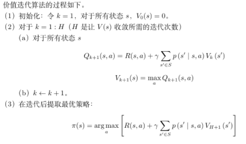

代码如下：

```python
import random
import torch
from tqdm import tqdm

class GridWorldEnv:
    def __init__(self):
        self.GRID_NUM = 5
        self.ACTION_SPACE = {1:'UP', 2:'DOWN', 3:'LEFT',4:'RIGHT'}
        self.current_x = 0
        self.current_y = 0
        self.A = (1, 0)
        self.B = (3, 0)
        self.AA = (1, 4)
        self.BB = (3, 2)
        self.gamma = 0.9

    def reset(self):
        self.current_x = random.randint(0, self.GRID_NUM-1)
        self.current_y = random.randint(0, self.GRID_NUM - 1)
        return (self.current_x, self.current_y)

    def step(self, action):
        reward = 0
        if not action in self.ACTION_SPACE:
            print(f"invalid action {action}")
            return (self.current_x, self.current_y), reward, False # new_state, reward, done
        if (self.current_x, self.current_y) == self.A:
            self.current_x, self.current_y = self.AA
            reward = 10
            return (self.current_x, self.current_y), reward, False
        if (self.current_x, self.current_y) == self.B:
            self.current_x, self.current_y = self.BB
            reward = 5
            return (self.current_x, self.current_y), reward, False
        if action == 1 and self.current_y == 0: # up but boundary
            reward = -1
            return (self.current_x, self.current_y), reward, False
        if action == 2 and self.current_y == (self.GRID_NUM-1): # down but boundary
            reward = -1
            return (self.current_x, self.current_y), reward, False
        if action == 3 and self.current_x == 0: # left but boundary
            reward = -1
            return (self.current_x, self.current_y), reward, False
        if action == 4 and self.current_x == (self.GRID_NUM-1): # left but boundary
            reward = -1
            return (self.current_x, self.current_y), reward, False
        if action == 1: # up
            self.current_y -= 1
            reward = 0
            return (self.current_x, self.current_y), reward, False
        if action == 2: # down
            self.current_y += 1
            reward = 0
            return (self.current_x, self.current_y), reward, False
        if action == 3: # left
            self.current_x -= 1
            reward = 0
            return (self.current_x, self.current_y), reward, False
        if action == 4: # right
            self.current_x += 1
            reward = 0
            return (self.current_x, self.current_y), reward, False


    def value_iterate(self):
        V = torch.zeros((self.GRID_NUM, self.GRID_NUM), dtype=torch.float32)
        for k in range(100):
            Q = torch.zeros((self.GRID_NUM, self.GRID_NUM, 4), dtype=torch.float32)
            old_V = V.clone()
            for x in range(self.GRID_NUM):
                for y in range(self.GRID_NUM):
                    for action  in range(4):
                        self.current_x = x
                        self.current_y = y
                        (next_x, next_y), reward, _ = self.step(action + 1)
                        Q[y, x, action] = reward + self.gamma * V[next_y, next_x].item()
                    V[y,x] = Q[y,x].max().item()
            if torch.dist(V, old_V, p=2).item() < 0.000001:#这个对于性能提升很重要
                break
        policy = torch.zeros((self.GRID_NUM, self.GRID_NUM), dtype=torch.int32)
        for x in range(self.GRID_NUM):
            for y in range(self.GRID_NUM):
                vlist = []
                for action in range(4):
                    self.current_x = x
                    self.current_y = y
                    (next_x, next_y), reward, _ = self.step(action + 1)
                    vlist.append( reward + self.gamma * V[next_y, next_x].item() )
                a = torch.tensor(vlist).argmax().item()
                policy[y,x] = a
        return policy, V


env = GridWorldEnv()
print("value iterate result:")
policy, v = env.value_iterate()
arrows = {0: '↑', 1: '↓', 2: '←', 3: '→'}
for y in range(env.GRID_NUM):
    for x in range(env.GRID_NUM):
        action = policy[y, x].item()
        print(f"{arrows[action]} ", end="")
    print("")

```

#### 10.3 刻意练习

动态规划和马尔可夫决策过程，我一直没有入脑入心。所以安排刻意练习的环节

##### 10.3.1 练习1 配送pizza

学习到的一个经验就是：

1. Value的初始化会影响到是否收敛。不能照搬书上的算法把它初始化为0.
2. reward的设计会影响到是否收敛，例如下面的问题里，对于不能移动的情况的耗时，必须要比较大才会收敛。而前面cliffwalking的例子，跌下悬崖太大又会导致不能收敛...
3. reward不是说都要归一化，不是要都在同一个量级。有时候在同一量级，会导致不收敛。下面的练习题里，不能移动的情况下cost要比较大才能收敛


【练习的问题是：】

在一个n*m的矩阵里,只有一个格子是字符X,表示pizza店所在地。 $表示写字楼位置，需要把pizza送到写字楼。 

在矩阵里: 

1. 字符‘$'表示该格子是一座写字楼 ** (注意,在本题中,pizza店本身也是写字楼) ** ,里面的客户订 了一个pizza。
2. 字符'0’~'9'表示该格子是空地,同时表示该空地的高度。每个空地格子的高度范围为[0,9]。 送餐员可以从当前格子往 上、下、左、右四个方向移动一格。当然根据高度的不同,移动一次的时间也不同。 

你能从A格子进入B格子的条件是: 

1. A、B两个格子相邻 ** (有一条公共边) **; 
2. 关于移动方法： 
   1. 如果A、B均为空地: 
      1. 如果A、B高度相等,那么花费的时间是1; 
      2. 如果A、B高度差为1,那么花费的时间是3;
      3. 如果高度差大于1,则不能从A走到B。
   2. 如果A与B当中,至少有一个格子是写字楼(包括两个格子都是写字楼的情况， X也是写字楼) 花费的时间是2。(如果A或B当中有空地的话,不需要考虑A或B的高度) 注意:送餐员可以进入写字楼,即使他不是给该写字楼的客户送pizza(也就是可以借道)。

 矩阵如下，大小为3行7列： 

```shell
3442211 
34$221X 
3442211 
```

请实现了动态规划的策略迭代方法，为送餐员找到最合适的行路策略，使得送餐时间最短。代码如下：

```c++
#include <stdlib.h>
#include <stdio.h>
#include <string.h>
#include <vector>
#include <utility>
#include <string>
#include <stdint.h>
#include <cmath>
#include <climits>
using namespace std;

#define MAX_SZ (50)

int row, col; // 实际的地图大小
int start_x, start_y; // pizza店位置
int dest_x, dest_y; // 送餐的位置
char arr[MAX_SZ][MAX_SZ]; // 地图
char policy[MAX_SZ][MAX_SZ]; // 策略，action: 0-up, 1-down, 2-left, 3-right
float gamma_w = 1.0; // 折扣率设为1.0，因为我们想要准确的总成本
const int CANNOT_MOVE_COST = INT_MAX/2; // 不能移动时的成本（设为一个大数） 这个值也会影响到是否收敛！！

// action: 0-up, 1-down, 2-left, 3-right
int env_step(int from_x, int from_y, int action, int & next_x, int & next_y, int &cost)
{
    // 边界检查
    if (from_x < 0 || from_y < 0 || from_x >= col || from_y >= row || action < 0 || action > 3)
    {
        printf("invalid argument at %d ! %d, %d, %d\n", __LINE__, from_x, from_y, action);
        return -1;
    }

    // 检查是否不能移动
    if ((from_x == 0 && action == 2) ||  // 左边界且向左移动
        (from_y == 0 && action == 0) ||  // 上边界且向上移动
        (from_x == col-1 && action == 3) ||  // 右边界且向右移动
        (from_y == row-1 && action == 1))  // 下边界且向下移动
    {
        next_x = from_x;
        next_y = from_y;
        cost = CANNOT_MOVE_COST;
        return 1;
    }

    // 计算目标位置
    if (action == 0) next_y = from_y-1, next_x = from_x; // up
    else if (action == 1) next_y = from_y+1, next_x = from_x; // down
    else if (action == 2) next_x = from_x-1, next_y = from_y; // left
    else if (action == 3) next_x = from_x+1, next_y = from_y; // right

    char B = arr[next_y][next_x];
    char A = arr[from_y][from_x];

    // 处理写字楼情况（包括X和$）
    if (A == '$' || B == '$' || A == 'X' || B == 'X')
    {
        cost = 2; // 穿过写字楼耗时2
        return 0;
    }
    
    // 处理空地情况
    if ('0' <= A && A <= '9' && '0' <= B && B <= '9')
    {
        int aa = A - '0';
        int bb = B - '0';
        int diff = abs(aa - bb);

        if (diff == 0) {
            cost = 1; // 高度相同耗时1
            return 0;
        } else if (diff == 1) {
            cost = 3; // 高度差1耗时3
            return 0;
        } else {
            next_x = from_x;
            next_y = from_y;
            cost = CANNOT_MOVE_COST;
            return 1; // 不能移动
        }
    }

    printf("invalid state at [%d,%d] and [%d,%d]\n", from_y, from_x, next_y, next_x);
    return -1;
}

void print_arr()
{
    for (int i = 0; i < row; ++i)
    {
        for (int j = 0; j < col; ++j)
        {
            printf("%c", arr[i][j]);
        }
        printf("\n");
    }
    printf("\n");
}

void print_value(float v[MAX_SZ][MAX_SZ])
{
    for (int i = 0; i < row; ++i)
    {
        for (int j = 0; j < col; ++j)
        {
            if (v[i][j] > CANNOT_MOVE_COST/2) printf("  INF ");
            else printf("%5.1f ", v[i][j]);
        }
        printf("\n");
    }
    printf("\n");
}

void print_policy()
{
    for (int i = 0; i < row; ++i)
    {
        for (int j = 0; j < col; ++j)
        {
            if (i == dest_y && j == dest_x) {
                printf("  G "); // 目标位置
                continue;
            }
            
            switch(policy[i][j]) {
                case 0: printf("  ↑ "); break;
                case 1: printf("  ↓ "); break;
                case 2: printf("  ← "); break;
                case 3: printf("  → "); break;
                default: printf("  ? "); break;
            }
        }
        printf("\n");
    }
    printf("\n");
}

int policy_iteration()
{
    float value[MAX_SZ][MAX_SZ];
    // 初始化值函数为一个大数（类似无穷大），因为我们最后是选择成本最低的动作，而不是选择回报最大的动作。
    for (int i = 0; i < row; ++i) {
        for (int j = 0; j < col; ++j) {
            value[i][j] = CANNOT_MOVE_COST; //初始化为0也可以收敛，但这里初始化比较大会可靠一些
        }
    }
    // 终止状态值为0
    value[dest_y][dest_x] = 0;
    
    memset(policy, 0, sizeof(policy));
    
    int iteration = 0;
    while (1)
    {
        printf("Iteration %d:\n", ++iteration);
        
        // 策略评估
        float delta;
        do {
            delta = 0.0;
            for (int i = 0; i < row; ++i)
            {
                for (int j = 0; j < col; ++j)
                {
                    if (i == dest_y && j == dest_x) continue; // 跳过终止状态
                    
                    int from_x = j, from_y = i;
                    int next_x, next_y, cost;
                    float old_v = value[from_y][from_x];
                    
                    // 执行当前策略的动作
                    int action = policy[from_y][from_x];
                    int ret = env_step(from_x, from_y, action, next_x, next_y, cost);
                    
                    if (ret == 0) {
                        // 最小化总成本：当前成本 + 下一步的期望成本
                        value[from_y][from_x] = cost + gamma_w * value[next_y][next_x];
                        delta = max(delta, abs(value[from_y][from_x] - old_v));
                    } else {
                        value[from_y][from_x] = CANNOT_MOVE_COST;
                    }
                }
            }
        } while (delta > 0.01); // 收敛阈值

        printf("Value function after evaluation:\n");
        print_value(value);

        // 策略改进
        int stable = 1;
        for (int i = 0; i < row; ++i)
        {
            for (int j = 0; j < col; ++j)
            {
                if (i == dest_y && j == dest_x) continue; // 跳过终止状态
                
                int old_action = policy[i][j];
                int from_x = j, from_y = i;
                float min_q = CANNOT_MOVE_COST;
                int best_action = old_action;
                
                // 测试所有可能的动作，寻找最小成本的动作
                for (int a = 0; a < 4; ++a)
                {
                    int next_x, next_y, cost;
                    if (env_step(from_x, from_y, a, next_x, next_y, cost) == 0)
                    {
                        float q = cost + gamma_w * value[next_y][next_x];
                        if (q < min_q) { //不一样的地方，这里要取最小的值作为最佳动作
                            min_q = q;
                            best_action = a;
                        }
                    }
                }
                
                policy[i][j] = best_action;
                if (best_action != old_action) {
                    stable = 0;
                }
            }
        }

        printf("Policy after improvement:\n");
        print_policy();

        if (stable) break;
    }

    return 0;
}

int main()
{
    // 测试数据
    const char * map_data[] = {
        "3442211",
        "34$221X",
        "3442211"
    };
    
    row = 3;
    col = 7;
    
    // 初始化地图
    for (int i = 0; i < row; ++i)
    {
        for (int j = 0; j < col; ++j)
        {
            arr[i][j] = map_data[i][j];
            if (arr[i][j] == 'X') {
                start_x = j;
                start_y = i;
            } else if (arr[i][j] == '$') {
                dest_x = j;
                dest_y = i;
            }
        }
    }
    
    printf("Initial map:\n");
    print_arr();
    
    printf("Pizza shop at (%d, %d)\n", start_x, start_y);
    printf("Destination at (%d, %d)\n", dest_x, dest_y);
    
    policy_iteration();
    
    printf("Final optimal policy:\n");
    print_policy();
    
    // 打印从起点到终点的路径
    printf("Path from pizza shop to destination:\n");
    int x = start_x, y = start_y;
    while (!(x == dest_x && y == dest_y)) {
        printf("(%d, %d) -> ", x, y);
        int action = policy[y][x];
        if (action == 0) y--;
        else if (action == 1) y++;
        else if (action == 2) x--;
        else if (action == 3) x++;
    }
    printf("(%d, %d) [Destination]\n", dest_x, dest_y);
    
    return 0;
}
```

可能AI写的这份代码可读性更好：

```c++
#include <iostream>
#include <vector>
#include <climits>
#include <cmath>
#include <algorithm>
#include <iomanip>
#include <unordered_map>

using namespace std;

// 定义方向：上、下、左、右
const vector<pair<int, int>> DIRECTIONS = {{-1, 0}, {1, 0}, {0, -1}, {0, 1}};
const vector<string> DIRECTION_SYMBOLS = {"↑", "↓", "←", "→"};

struct Cell {
    char type;  // 'X': pizza店, '$': 写字楼, '0'-'9': 空地
    int height; // 如果是空地，存储高度
};

class PizzaDeliverySolver {
private:
    vector<vector<Cell>> grid;
    int rows;
    int cols;
    pair<int, int> pizza_shop;
    vector<pair<int, int>> office_buildings;
    vector<vector<double>> value_function;
    vector<vector<int>> policy;

public:
    PizzaDeliverySolver(const vector<vector<Cell>>& grid) : grid(grid) {
        rows = grid.size();
        cols = rows > 0 ? grid[0].size() : 0;
        findSpecialLocations();
        initializeValueAndPolicy();
    }

    void solve() {
        bool policy_stable = false;
        int iterations = 0;

        while (!policy_stable) {
            iterations++;
            policy_stable = true;

            // 策略评估
            evaluatePolicy();

            // 策略改进
            policy_stable = improvePolicy();
        }

        cout << "Policy Iteration completed in " << iterations << " iterations.\n";
    }

    void printResults() const {
        printPolicyTable();
        printOptimalPath();
    }

private:
    void findSpecialLocations() {
        for (int i = 0; i < rows; ++i) {
            for (int j = 0; j < cols; ++j) {
                if (grid[i][j].type == 'X') {
                    pizza_shop = {i, j};
                } else if (grid[i][j].type == '$') {
                    office_buildings.emplace_back(i, j);
                }
            }
        }
    }

    void initializeValueAndPolicy() {
        value_function.assign(rows, vector<double>(cols, INT_MAX)); //必须初始化比较大一点的值，0的话不收敛。
        policy.assign(rows, vector<int>(cols, -1));

        // 设置目标状态的值函数为0
        for (const auto& office : office_buildings) {
            value_function[office.first][office.second] = 0;
        }
    }

    void evaluatePolicy() {
        bool value_changed;
        do {
            value_changed = false;
            for (int i = 0; i < rows; ++i) {
                for (int j = 0; j < cols; ++j) {
                    if (isTargetLocation(i, j)) continue;

                    double old_value = value_function[i][j];
                    double new_value = INT_MAX;

                    for (int d = 0; d < DIRECTIONS.size(); ++d) {
                        auto di = DIRECTIONS[d].first;
                        auto dj = DIRECTIONS[d].second;
                        int ni = i + di;
                        int nj = j + dj;

                        if (!isValidMove(ni, nj)) continue;

                        double cost = calculateMoveCost(i, j, ni, nj);
                        double candidate_value = cost + value_function[ni][nj];
                        new_value = min(new_value, candidate_value);
                    }

                    if (new_value < old_value) {
                        value_function[i][j] = new_value;
                        value_changed = true;
                    }
                }
            }
        } while (value_changed);
    }

    bool improvePolicy() {
        bool policy_stable = true;

        for (int i = 0; i < rows; ++i) {
            for (int j = 0; j < cols; ++j) {
                if (isTargetLocation(i, j)) continue;

                int old_action = policy[i][j];
                int best_action = -1;
                double min_value = INT_MAX;

                for (int d = 0; d < DIRECTIONS.size(); ++d) {
                    auto di = DIRECTIONS[d].first;
                    auto dj = DIRECTIONS[d].second;
                    int ni = i + di;
                    int nj = j + dj;

                    if (!isValidMove(ni, nj)) continue;

                    double cost = calculateMoveCost(i, j, ni, nj);
                    double candidate_value = cost + value_function[ni][nj];

                    if (candidate_value < min_value) {
                        min_value = candidate_value;
                        best_action = d;
                    }
                }

                if (best_action != -1 && best_action != old_action) {
                    policy[i][j] = best_action;
                    policy_stable = false;
                }
            }
        }

        return policy_stable;
    }

    bool isTargetLocation(int i, int j) const {
        for (const auto& office : office_buildings) {
            if (i == office.first && j == office.second) {
                return true;
            }
        }
        return false;
    }

    bool isValidMove(int i, int j) const {
        return i >= 0 && i < rows && j >= 0 && j < cols;
    }

    double calculateMoveCost(int i, int j, int ni, int nj) const {
        // 如果任一方是写字楼或pizza店
        if (grid[i][j].type == '$' || grid[i][j].type == 'X' || 
            grid[ni][nj].type == '$' || grid[ni][nj].type == 'X') {
            return 2;
        }
        
        // 否则计算高度差
        int height_diff = abs(grid[i][j].height - grid[ni][nj].height);
        if (height_diff == 0) return 1;
        if (height_diff == 1) return 3;
        return INT_MAX; // 不能移动
    }

    void printPolicyTable() const {
        cout << "\nOptimal Policy Table:\n";
        cout << "Each cell shows the best action to take (↑, ↓, ←, →)\n";
        cout << "X: Pizza shop, $: Office building\n\n";

        for (int i = 0; i < rows; ++i) {
            for (int j = 0; j < cols; ++j) {
                if (grid[i][j].type == 'X') {
                    cout << " X ";
                } else if (grid[i][j].type == '$') {
                    cout << " $ ";
                } else {
                    if (policy[i][j] == -1) {
                        cout << " - ";
                    } else {
                        cout << " " << DIRECTION_SYMBOLS[policy[i][j]] << " ";
                    }
                }
            }
            cout << endl;
        }
    }

    void printOptimalPath() const {
        vector<pair<int, int>> path;
        vector<string> directions;
        
        int x = pizza_shop.first;
        int y = pizza_shop.second;
        path.emplace_back(x, y);

        while (!isTargetLocation(x, y)) {
            int action = policy[x][y];
            if (action == -1) {
                cout << "\nNo valid path found from pizza shop to office building!\n";
                return;
            }

    
            auto dx = DIRECTIONS[action].first;
            auto dy = DIRECTIONS[action].second;
            x += dx;
            y += dy;
            path.emplace_back(x, y);
            directions.push_back(DIRECTION_SYMBOLS[action]);
        }

        cout << "\nOptimal Path from Pizza Shop to Office Building:\n";
        for (size_t i = 0; i < path.size(); ++i) {
            cout << "(" << path[i].first << "," << path[i].second << ")";
            if (i < directions.size()) {
                cout << " -> " << directions[i] << " -> ";
            }
        }
        cout << "\nTotal delivery time: " << value_function[pizza_shop.first][pizza_shop.second] << endl;
    }
};

int main() {
    // 定义网格
    vector<string> grid_str = {
        "3442211",
        "34$221X",
        "3442211"
    };
    
    // 转换为Cell结构
    vector<vector<Cell>> grid(grid_str.size(), vector<Cell>(grid_str[0].size()));
    for (int i = 0; i < grid_str.size(); ++i) {
        for (int j = 0; j < grid_str[i].size(); ++j) {
            grid[i][j].type = grid_str[i][j];
            if (grid_str[i][j] >= '0' && grid_str[i][j] <= '9') {
                grid[i][j].height = grid_str[i][j] - '0';
            } else {
                grid[i][j].height = 0;
            }
        }
    }
    
    // 创建并运行求解器
    PizzaDeliverySolver solver(grid);
    solver.solve();
    solver.printResults();
    
    return 0;
}
```

##### 10.3.2 练习2 带终止状态的GridWorld

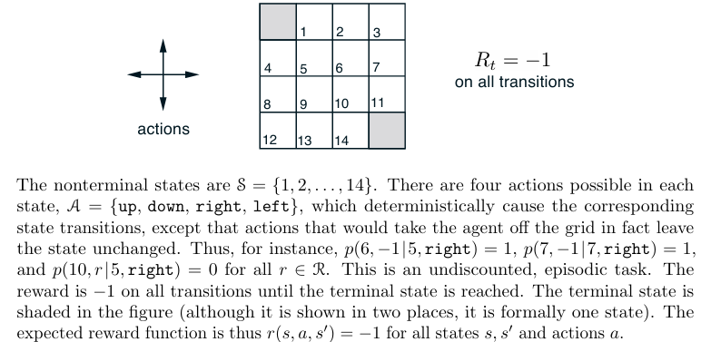

代码如下，可以收敛：

```python
import torch


class GridWorld:
    def __init__(self):
        self.size = 4
        self.cannot_move_reward = -1
        self.terminator1 = (0, 0)
        self.terminator2 = (self.size-1, self.size-1)
        return

    def step(self, state, action):
        x,y = state
        if x < 0 or x >= self.size or y < 0 or y >= self.size or action <0 or action > 3:
            raise ValueError(f" invalid arguments")
        next_x = x
        next_y = y
        reward = -1
        if action == 0: # up
            next_y = y-1
        if action == 1: # down
            next_y = y+1
        if action == 2: # left
            next_x = x-1
        if action == 3: #right
            next_x = x+1
        if next_x < 0 or next_x >= self.size:
            next_x = x
            reward = self.cannot_move_reward
        if next_y < 0 or next_y >= self.size:
            next_y = y
            reward = self.cannot_move_reward

        done = False
        if (next_y, next_x) == self.terminator1 or (next_y, next_x) == self.terminator2:
            done = True
        return (next_x, next_y), reward, done
    def policy_iteration_initialize(self):
        self.policy = torch.zeros((self.size, self.size), dtype=torch.int32)
        self.value = torch.ones( (self.size, self.size), dtype=torch.float32) * 0
        self.value[self.terminator1[0], self.terminator1[1]] = 0
        self.value[self.terminator2[0], self.terminator2[1]] = 0
    def policy_iteration_evaluating(self):
        while True:
            delta = 0
            for h in range(self.size):
                for w in range(self.size):
                    old_v = self.value[h, w].item()
                    if (h,w) == self.terminator1 or (h, w) == self.terminator2:
                        continue
                    action = self.policy[h, w]
                    (next_x, next_y), r, done = self.step( (w,h), action)
                    if next_x != w or next_y != h : # moved
                        self.value[h, w] = r + self.value[next_y, next_x].item()
                        delta = max(delta, abs(self.value[h, w].item() - old_v) )
            if delta < 0.0001:
                break
        return self.value
    def policy_iteration_improving(self):
        stable = True
        for h in range(self.size):
            for w in range(self.size):
                if (h, w) == self.terminator1 or (h, w) == self.terminator2:
                    continue
                old_policy = self.policy[h,w].item()
                q_values = []
                for action in range(4):
                    (next_x, next_y), r, done = self.step((w, h), action)
                    if next_x != w or next_y != h:  # moved
                        q_values.append(r + self.value[next_y, next_x].item())
                    else: #如果不能移动，这个动作也要占位，否则后面求argmax的时候就出bug了
                        q_values.append(float('-inf'))
                self.policy[h, w] = torch.tensor(q_values).argmax().item()
                if self.policy[h, w].item() != old_policy:
                    stable = False
        return stable
    #价值迭代法
    def value_iteration(self):
        self.value = torch.ones((self.size, self.size), dtype=torch.float32) * 0
        self.value[self.terminator1[0], self.terminator1[1]] = 0
        self.value[self.terminator2[0], self.terminator2[1]] = 0
        while True:
            delta = 0
            for h in range(self.size):
                for w in range(self.size):
                    old_v = self.value[h, w].item()
                    if (h,w) == self.terminator1 or (h, w) == self.terminator2:
                        continue
                    q_values = []
                    for action in range(4):
                        (next_x, next_y), r, done = self.step( (w,h), action)
                        if next_x != w or next_y != h : # moved
                            q_values.append(r + self.value[next_y, next_x].item())
                    self.value[h, w] = torch.tensor(q_values).max().item()
                    delta = max(delta, abs(self.value[h, w].item() - old_v) )
            if delta < 0.0001:
                break
        # extract policy from v*
        self.policy = torch.zeros((self.size, self.size), dtype=torch.int32)
        for h in range(self.size):
            for w in range(self.size):
                old_v = self.value[h, w].item()
                if (h, w) == self.terminator1 or (h, w) == self.terminator2:
                    continue
                q_values = []
                for action in range(4):
                    (next_x, next_y), r, done = self.step((w, h), action)
                    if next_x != w or next_y != h:  # moved
                        q_values.append(r + self.value[next_y, next_x].item())
                    else:
                        q_values.append(float('-inf')) #占位，确保argmax正确
                self.policy[h,w] = torch.tensor(q_values).argmax().item()
        return
    #策略迭代法
    def policy_iteration(self):
        self.policy_iteration_initialize()
        while True:
            self.policy_iteration_evaluating()
            #print("iteration finished:")
            #env.print_value()
            stable = self.policy_iteration_improving()
            if stable:
                break

    def print_policy(self):
        arrows = {0: '↑', 1: '↓', 2: '←', 3: '→'}

        for y in range(self.size):
            for x in range(self.size):
                if (x,y) == self.terminator1 or (x,y) == self.terminator2:
                    print("X ", end="")
                else:
                    print(f"{arrows[self.policy[y,x].item()]} ", end="")
            print("")
    def print_value(self):
        for y in range(self.size):
            for x in range(self.size):
                print(f"{self.value[y,x].item():.2f} ", end="")
            print("")


env = GridWorld()
env.policy_iteration()
print("\noptimal prolicy and value:")
env.print_policy()
env.print_value()
env.value_iteration()
print("\noptimal prolicy and value:")
env.print_policy()
env.print_value()

```

##### 10.3.3 练习3 汽车门店间调度

杰克为一家全国性汽车租赁公司管理两个门店。每天都会有若干顾客到这两个门店租车。如果杰克门店有车可用，他将车辆租出并能从总公司获得10美元租金。若该门店车辆已租罄，则这笔生意就会流失。租出的车辆需在归还后的第二天才能重新投入使用。

为了确保车辆能合理调配到需求点，杰克可以在夜间将车辆在两个门店间转移，每转移一辆车需花费2美元成本。我们假设每个门店的车辆租用需求和归还数量均服从泊松分布，即数量为n的概率为( (n^λ) * e^(-λ) ) / (n!)，其中λ为期望值。

具体参数λ设置为：第一家门店的租车需求λ=3，还车λ=3；第二家门店租车需求λ=4，还车λ=2。

为简化问题，我们设定每个门店的车辆存储上限为20辆（超出部分将返还总公司，不再计入系统），且一夜间最多只能转移5辆车。取折扣率γ=0.9，将此问题建模为一个持续型有限马尔可夫决策过程（MDP）：时间步长为天，状态是每日营业结束时各门店的车辆库存数，动作为夜间在两个门店间调配的车辆净数量。

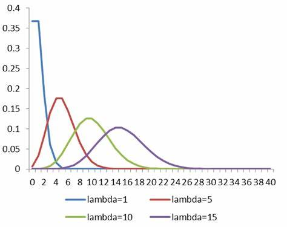

从这个例子就可以看出动态规划方法，只适合处理很小的状态空间和动作空间的问题。这个练习的状态空间 441个，动作空间11个，V*的一次迭代计算就要16分钟，如果20次迭代可以收敛出V\*,  那就要320分钟也就是5个多小时。

我让AI帮我修改代码，变成GPU并行版本，不到10分钟可以跑出结果。

CPU版本代码如下：

```python
import os.path

import torch
from torch.distributions import Poisson
import math
from functools import lru_cache
from tqdm import  tqdm
import datetime as dt

# 预计算泊松分布表 (λ=2,3,4; x=0~20)， 用查表法加速
POISSON_TABLES = {
    2: [math.exp(-2) * (2 ** k) / math.factorial(k) for k in range(15)],
    3: [math.exp(-3) * (3 ** k) / math.factorial(k) for k in range(15)],
    4: [math.exp(-4) * (4 ** k) / math.factorial(k) for k in range(15)]
}
poisson_occur_cache = {} # 避免poisson_occur()函数重复计算 的cache
#直接查表得到泊松分布的 x值和概率  对的列表
def get_poisson_pairs(lambda_):
    k_values = [k for k in range(15)]
    probs = POISSON_TABLES[lambda_]
    return list(zip(k_values, probs))

class RentingCar:
    def __init__(self):
        self.min_action = -5
        self.max_action = 5
        self.gamma = 0.9
        self.max_car_num = 20
        self.value = torch.zeros((self.max_car_num+1, self.max_car_num+1),dtype=torch.float32)
        self.policy = torch.zeros((self.max_car_num+1, self.max_car_num+1),dtype=torch.int32)
        return

    #门店经过晚上移车后的早晨有car_num辆车，按照两个lambda参数发生还车(in)和借车(out)
    def poisson_occur(self, car_num, in_lambda, out_lambda):
        '''
        门店，现存有 x 辆车，当天还车的数量in 服从lambda=3的泊松分布，
        当天借出去的车的数量out 服从lambda=4的泊松分布，两个分布独立。
        y不能小于0.
        当天闭店时的车辆数 y 等于 x + in - out，求y的各种取值的概率：
        1）枚举所有 in的可能值和发生概率（in, in_p），得到列表1
        2）枚举所有out的可能值和发生概率 (out, out_p)，得到列表2
        3）两两组合列表1和列表2的所有可能， 计算y = x + in - out，和出现概率p =  in_p * out_p， 如果y < 0, 令y=0。
        4) 把 (y, p)放到一个列表里
        '''
        # 为了避免重复计算，计算的结果放到缓存里
        global  poisson_occur_cache
        key = (car_num, in_lambda, out_lambda)
        if poisson_occur_cache.__contains__( key ):
            #print(f"hit cache {key}")
            return poisson_occur_cache[key]
        #else:
            #print(f"miss cache {key}")

        result = [] #保存 三元组 (y值，挣的钱，发生概率)
        in_list = get_poisson_pairs(in_lambda)
        out_list = get_poisson_pairs(out_lambda)
        for in_c, in_p in in_list:
            for out_c, out_p in out_list:
                y =  car_num + in_c - out_c
                if y < 0: #车辆数 入不敷出
                    y = 0
                    out_c = car_num + in_c # 那最多就只能出租这么多车了
                if y > 20:
                    y = 20
                earn = out_c * 10 #挣的佣金
                p = in_p * out_p
                result.append( (y, earn, p) )
        psum = 0
        for (y, e, p) in result:
            psum += p
        assert(psum == 1.0, f"psum is not 1.0:{psum:.2f} in poisson_occur()")
        poisson_occur_cache[key] = result
        return result
    def poisson_result(self, next_num1, next_num2):
        shop1 = self.poisson_occur(next_num1, 3, 3)
        shop2 = self.poisson_occur(next_num2, 2, 4)
        psum = 0.0
        total_reward = 0
        for (y1, e1, p1) in shop1:
            for (y2, e2, p2) in shop2:
                p = p1 * p2
                psum += p
                reward = e1 + e2
                total_reward += p * (reward + self.gamma * self.value[y1, y2].item())
        assert(psum == 1.0, f"psum is not 1.0:{psum:.2f}")
        return total_reward


    def value_iteration(self, checkpoint="./rentcar_0.pth"):
        iterate_num = 0
        if os.path.exists(checkpoint):
            data = torch.load(checkpoint)
            self.value = data['value']
            iterate_num = data['iterate_num']

        while True:
            # 状态：门店1的日结车辆数 num1, 门店2的日结车辆数 num2
            # action: 当晚从门店1运走action量车到门店2， -5 <= action <= 5
            delta = 0
            iterate_num += 1
            for num1 in tqdm(range(self.max_car_num +1), "shop1"):
                for num2 in range(self.max_car_num +1):
                    max_reward_action = 0
                    max_reward = float('-inf')
                    old_value = self.value[num1, num2].item()
                    for action in range(self.min_action, self.max_action+1):
                        # 当晚搬运汽车
                        true_action = action
                        if num1 - action < 0:
                            true_action = num1
                        if num2 + action < 0:
                            true_action = num2 * (-1)
                        move_cost = abs(true_action) * 2 #挪车开销
                        next_num1 = min(num1 - true_action, self.max_car_num)
                        next_num2 = min(num2 + true_action, self.max_car_num)
                        # 第二天发生还车借车随机事件
                        #print(f"{dt.datetime.now()} begin")
                        total_reward = self.poisson_result(next_num1, next_num2)
                        #print(f"{dt.datetime.now()} end")
                        total_reward -= move_cost
                        if total_reward > max_reward:
                            max_reward = total_reward
                            max_reward_action = action
                    self.value[num1, num2] = max_reward
                    delta = max(delta, abs(old_value - self.value[num1, num2].item()))

            print(f"{iterate_num} finish one iteration, delta={delta:.4f}")

            # save checkpoint
            data = {}
            data['value'] = self.value
            data['iterate_num'] = iterate_num
            torch.save(data, f"./rentcar_{iterate_num}.pth")

            if delta < 0.0001:
                break
        # extract policy from v*
        for num1 in range(self.max_car_num+1):
            for num2 in range(self.max_car_num+1):
                max_reward_action = 0
                max_reward = float('-inf')
                for action in range(self.min_action, self.max_action+1):
                    # 当晚搬运汽车
                    true_action = 0
                    if num1 - action < 0:
                        true_action = num1
                    if num2 + action < 0:
                        true_action = num2 * (-1)
                    move_cost = abs(true_action) * 2  # 挪车开销
                    next_num1 = min(num1 - true_action, self.max_car_num)
                    next_num2 = min(num2 + true_action, self.max_car_num)
                    # 第二天发生还车借车随机事件
                    total_reward = self.poisson_result(next_num1, next_num2)
                    if total_reward > max_reward:
                        max_reward = total_reward
                        max_reward_action = action
                self.policy[num1, num2] = max_reward_action

    def print_policy(self):
        for num1 in range(self.max_car_num+1):
            for num2 in range(self.max_car_num+1):
                print(f"{self.policy[num1, num2].item()} ")
            print("")
    def print_value(self):
        for num1 in range(self.max_car_num+1):
            for num2 in range(self.max_car_num+1):
                print(f"{self.value[num1, num2].item():.2f} ")
            print("")


rc = RentingCar()
rc.value_iteration()
rc.print_policy()
rc.print_value()
```

GPU并行计算的版本：

```python
import os.path
import torch
import math
from tqdm import tqdm
import datetime as dt

# 检查是否有可用的CUDA设备
device = torch.device("cuda" if torch.cuda.is_available() else "cpu")
print(f"Using device: {device}")

# 预计算泊松分布表 (λ=2,3,4; x=0~20)，用查表法加速
POISSON_TABLES = {
    2: torch.tensor([math.exp(-2) * (2 ** k) / math.factorial(k) for k in range(15)], device=device),
    3: torch.tensor([math.exp(-3) * (3 ** k) / math.factorial(k) for k in range(15)], device=device),
    4: torch.tensor([math.exp(-4) * (4 ** k) / math.factorial(k) for k in range(15)], device=device)
}


class RentingCar:
    def __init__(self):
        self.min_action = -5
        self.max_action = 5
        self.gamma = 0.9
        self.max_car_num = 20

        # 将value和policy张量移到GPU
        self.value = torch.zeros((self.max_car_num + 1, self.max_car_num + 1),
                                 dtype=torch.float32, device=device)
        self.policy = torch.zeros((self.max_car_num + 1, self.max_car_num + 1),
                                  dtype=torch.int32, device=device)

        # 预先生成所有可能的k值
        self.k_values = torch.arange(15, device=device)
        return

    def get_poisson_pairs(self, lambda_):
        # 使用PyTorch张量操作替代列表
        k_values = self.k_values
        probs = POISSON_TABLES[lambda_]
        return k_values, probs

    def poisson_occur(self, car_num, in_lambda, out_lambda):
        # 使用张量操作替代双重循环
        in_k, in_probs = self.get_poisson_pairs(in_lambda)
        out_k, out_probs = self.get_poisson_pairs(out_lambda)

        # 使用广播机制计算所有组合
        in_k_exp = in_k.unsqueeze(1)  # (in_size, 1)
        out_k_exp = out_k.unsqueeze(0)  # (1, out_size)
        in_probs_exp = in_probs.unsqueeze(1)  # (in_size, 1)
        out_probs_exp = out_probs.unsqueeze(0)  # (1, out_size)

        # 计算所有可能的y值
        y = car_num + in_k_exp - out_k_exp
        y = torch.clamp(y, 0, self.max_car_num)  # 限制在0到max_car_num之间

        # 计算所有可能的earn值
        actual_out = torch.minimum(out_k_exp, car_num + in_k_exp)
        earn = actual_out * 10

        # 计算联合概率
        probs = in_probs_exp * out_probs_exp

        return y, earn, probs

    def poisson_result(self, next_num1, next_num2):
        # 获取两个店铺的结果
        y1, e1, p1 = self.poisson_occur(next_num1, 3, 3)
        y2, e2, p2 = self.poisson_occur(next_num2, 2, 4)

        # 计算所有组合的奖励和概率
        reward = e1.unsqueeze(-1).unsqueeze(-1) + e2.unsqueeze(0).unsqueeze(0)
        joint_prob = p1.unsqueeze(-1).unsqueeze(-1) * p2.unsqueeze(0).unsqueeze(0)

        # 获取对应的value值
        value_matrix = self.value[y1.unsqueeze(-1).unsqueeze(-1), y2.unsqueeze(0).unsqueeze(0)]

        # 计算总奖励
        total_reward = torch.sum(joint_prob * (reward + self.gamma * value_matrix))

        return total_reward.item()

    def value_iteration(self, checkpoint="./rentcar_0.pth"):
        iterate_num = 0
        if os.path.exists(checkpoint):
            data = torch.load(checkpoint, map_location=device)
            self.value = data['value'].to(device)
            iterate_num = data['iterate_num']

        # 预先生成所有可能的动作
        actions = torch.arange(self.min_action, self.max_action + 1, device=device)

        while True:
            delta = 0
            iterate_num += 1

            # 创建网格坐标
            num1_grid, num2_grid = torch.meshgrid(
                torch.arange(self.max_car_num + 1, device=device),
                torch.arange(self.max_car_num + 1, device=device),
                indexing='ij'
            )

            # 初始化新value矩阵
            new_value = torch.zeros_like(self.value)
            new_policy = torch.zeros_like(self.policy)

            # 对每个状态进行并行处理
            for num1 in tqdm(range(self.max_car_num + 1), "shop1"):
                for num2 in range(self.max_car_num + 1):
                    old_value = self.value[num1, num2].item()

                    # 计算所有动作的奖励
                    action_rewards = []
                    for action in actions:
                        # 当晚搬运汽车
                        true_action = action
                        if num1 - action < 0:
                            true_action = num1
                        if num2 + action < 0:
                            true_action = -num2

                        move_cost = abs(true_action) * 2
                        next_num1 = min(num1 - true_action, self.max_car_num)
                        next_num2 = min(num2 + true_action, self.max_car_num)

                        # 计算总奖励
                        total_reward = self.poisson_result(next_num1, next_num2) - move_cost
                        action_rewards.append(total_reward)

                    # 找到最佳动作和最大奖励
                    action_rewards = torch.tensor(action_rewards, device=device)
                    max_reward, best_action_idx = torch.max(action_rewards, dim=0)
                    best_action = actions[best_action_idx]

                    new_value[num1, num2] = max_reward
                    new_policy[num1, num2] = best_action

                    delta = max(delta, abs(old_value - max_reward.item()))

            # 更新value
            self.value = new_value

            print(f"{iterate_num} finish one iteration, delta={delta:.4f}")

            # 保存检查点
            data = {
                'value': self.value.cpu(),
                'iterate_num': iterate_num
            }
            torch.save(data, f"./rentcar_{iterate_num}.pth")

            if delta < 0.01:
                break

        # 提取最终策略
        self.policy = new_policy

    def print_policy(self):
        policy_cpu = self.policy.cpu()
        for num1 in range(self.max_car_num + 1):
            for num2 in range(self.max_car_num + 1):
                print(f"{policy_cpu[num1, num2].item()} ", end="")
            print()

    def print_value(self):
        value_cpu = self.value.cpu()
        for num1 in range(self.max_car_num + 1):
            for num2 in range(self.max_car_num + 1):
                print(f"{value_cpu[num1, num2].item():.2f} ", end="")
            print()


rc = RentingCar()
rc.value_iteration()
rc.print_policy()
rc.print_value()
```

结果与书上的结果一致：

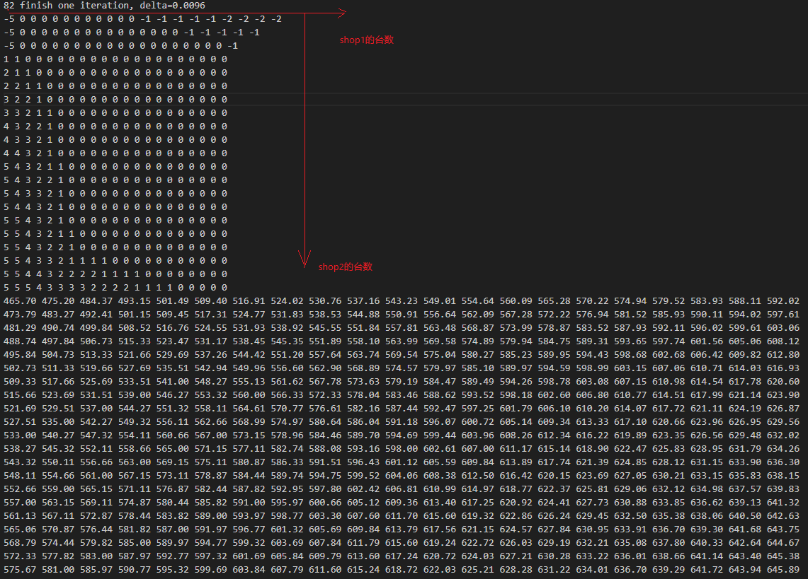

##### 10.3.4 练习4 赌徒策略

一名赌徒有机会对一系列抛硬币的结果进行押注。若硬币为正面朝上，他将赢得与该次押注金额相等的美元；若为反面朝上，则损失所押注的金额。当赌徒达到100美元的目标时获胜，或资金耗尽时失败，游戏即告终止。每次抛硬币前，赌徒需决定以整数美元为单位押注其当前资本的多少比例。

该问题可被表述为一个**无折扣、分段式、有限马尔可夫决策过程（MDP）**。其状态为赌徒的资本额 s∈{ 1,2,...,99 }，动作为押注金额 a∈{ 1,...,min⁡(s,100−s)  }。除赌徒达成目标时获得+1奖励外，其他状态转移的奖励均为零。此时，状态价值函数表示从各状态出发的获胜概率。

策略是从资本额到押注金额的映射，最优策略则最大化达成目标的概率。设 p为硬币正面朝上的概率。若 p 已知，则可通过**价值迭代**等方法求解此问题。

```python
import os.path
import matplotlib.pyplot as plt
import torch


class Gamble:
    def __init__(self):
        self.min_action = 1
        self.p_head = 0.4
        self.gamma = 1
        self.min_state = 1
        self.max_state = 99
        self.value = torch.zeros((self.max_state+1,),dtype=torch.float32)
        self.policy = torch.zeros((self.max_state+1,),dtype=torch.int32)
        return

    def value_iteration(self, checkpoint="./gamble_0.pth"):
        iterate_num = 0
        if os.path.exists(checkpoint):
            data = torch.load(checkpoint)
            self.value = data['value']
            iterate_num = data['iterate_num']

        while True:
            delta = 0
            iterate_num += 1
            for state in range(self.min_state, self.max_state+1):
                max_reward_action = 0
                max_reward = float('-inf')
                old_value = self.value[state].item()
                max_action = min(state, 100-state)
                for action in range(self.min_action, max_action+1):
                    total_reward = 0
                    ################# 上概率 ####################
                    ######### head,win
                    next_state = state + action # 一定的概率赢
                    if next_state > self.max_state: #到达终态，终态的V = 0
                        total_reward += self.p_head * (1 + self.gamma * 0)
                    else:
                        total_reward += self.p_head * (0 + self.gamma * self.value[next_state].item())
                    ######### not head, lost
                    next_state = state - action
                    if next_state < 1: # 输光
                        total_reward += (1-self.p_head) * (0 + self.gamma * 0)
                    else:
                        total_reward += (1-self.p_head) * (0 + self.gamma * self.value[next_state].item())

                    if total_reward > max_reward:
                        max_reward = total_reward
                        max_reward_action = action
                    # 下面几行能看出最佳策略不是唯一的，奇怪的是action还是没有取偏小的那个
                    elif total_reward == max_reward:
                        print(f"hit, {action} and {max_reward_action} for {state}")
                        max_reward_action = min(max_reward_action, action)
                self.value[state] = max_reward
                self.policy[state] = max_reward_action
                delta = max(delta, abs(old_value - self.value[state].item()))

            print(f"{iterate_num} finish one iteration, delta={delta:.4f}")

            # save checkpoint
            data = {}
            data['value'] = self.value
            data['iterate_num'] = iterate_num
            #torch.save(data, f"./gamble_{iterate_num}.pth")

            if delta < 0.001:
                break
        

    def print_policy(self):
        """打印策略并绘制折线图"""
        print("policy:")
        policy_values = []
        for state in range(self.min_state, self.max_state + 1):
            val = self.policy[state].item()
            print(f"{state}:{val} ", end="")
            policy_values.append(val)
            if state % 10 == 0:
                print("")
        print("")

        # 绘制策略折线图
        plt.figure(figsize=(10, 5))
        plt.plot(range(self.min_state, self.max_state + 1), policy_values, 'b-o')
        plt.title("Policy Function")
        plt.xlabel("State (Capital)")
        plt.ylabel("Stake Amount")
        plt.grid(True)
        plt.show()

    def print_value(self):
        """打印价值函数并绘制折线图"""
        print("value:")
        value_values = []
        for state in range(self.min_state, self.max_state + 1):
            val = self.value[state].item()
            print(f"{state}:{val:.4f} ", end="")
            value_values.append(val)
            if state % 10 == 0:
                print("")
        print("")

        # 绘制价值函数折线图
        plt.figure(figsize=(10, 5))
        plt.plot(range(self.min_state, self.max_state + 1), value_values, 'r-o')
        plt.title("Value Function (Probability of Winning)")
        plt.xlabel("State (Capital)")
        plt.ylabel("Probability")
        plt.grid(True)
        plt.show()


g = Gamble()
g.value_iteration()

g.print_policy()
g.print_value()
```

我运行的结果（右边）与书上的答案（左边）不同，不过作者也说不只有一个最终的策略：

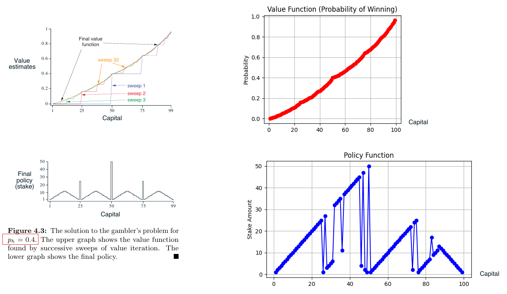

#### 10.4 控制算法的CUDA化

##### 10.4.1 算法描述

前面汽车门店调度的问题，状态和动作空间并不大，用CPU串行计算需要4-5个小时，改为GPU矩阵运算后只需要不到10分钟。所以控制算法CUDA化非常有必要。

下面是AI帮我整理的CUDA化版本的两大控制算法。

策略迭代算法

```python
"""
    基于CUDA并行的策略迭代算法（含终止态处理）
    
    参数说明:
    ----------
    P : torch.Tensor, shape [|S|, |A|, |S|]
        转移概率张量，P[s, a, s'] 表示在状态s执行动作a后转移到状态s'的概率
        要求: 每对 (s,a) 的概率分布需归一化，即 Σ_{s'} P[s,a,s'] = 1
        
    R : torch.Tensor, shape [|S|, |A|]
        即时奖励张量，R[s, a] 表示在状态s执行动作a获得的即时奖励
        
    γ : float
        折扣因子（0 ≤ γ < 1），用于平衡当前奖励与未来奖励的权重
        
    max_iters : int
        最大外层迭代次数（策略改进轮次）
        
    terminal_mask : torch.Tensor, shape [|S|]
        终止态布尔掩码，terminal_mask[s] = True 表示状态s为终止态
        终止态的特性:
        1. 值函数固定为 V(s) = 0
        2. 无需策略动作（策略π[s]的值无意义）
        3. 不参与贝尔曼更新和收敛性检查
    
    输出:
    -------
    π : torch.Tensor, shape [|S|]
        最优策略，π[s] ∈ [0, |A|-1] 表示状态s下的最优动作索引
        注意: 终止态的策略值会被保留为初始值（实际无意义）
    
    内部张量说明:
    ----------
    V : torch.Tensor, shape [|S|]
        值函数，V[s] 表示状态s的长期期望回报
        终止态的V值始终被强制设为0
        
    Q : torch.Tensor, shape [|S|, |A|]
        Q值表，Q[s, a] 表示在状态s执行动作a的长期期望回报
        终止态的Q值会被设为 -inf，避免被argmax选中
    """
def policy_iteration_cuda(P, R, γ, max_iters, terminal_mask):
    # 初始化 (所有张量在GPU上)
    V = zeros(|S|, device='cuda')          # 价值函数
    π = randint(0, |A|, size=(|S|,), device='cuda')  # 随机策略
    
    while not converged:
        # -------------------- 策略评估 (并行化Bellman更新) -------------------
        for _ in range(max_eval_iters):
            V_old = V.clone()
            
            # 关键步骤1：选择当前策略的动作 π[s] -> a
            a_indices = π.unsqueeze(1).unsqueeze(2)  # [|S|, 1, 1]
            
            # 关键步骤2：广播选取P和R（跳过终止态）
            P_selected = torch.gather(P, 1, a_indices.expand(-1, -1, |S|)).squeeze(1)  # [|S|, |S|]
            R_selected = torch.gather(R, 1, π.unsqueeze(1)).squeeze(1)  # [|S|]
            
            # 关键步骤3：并行计算V(s)（终止态值固定为0）
            #   - P_selected: [|S|, |S|] 形状，表示在策略π下，从状态s转移到s'的概率 P(s'|s, π(s))
            #   - R_selected: [|S|] 形状，表示在策略π下的即时奖励 R(s, π(s))
            #   - V_old: [|S|] 形状，上一轮迭代的价值函数
            #   - γ: 折扣因子
            #   - terminal_mask: [|S|] 形状的布尔掩码，True表示终止态
            # 计算 V(s) = Σ_{s'} P(s'|s,π(s)) * [R(s,π(s)) + γ * V_old(s')]
            # 解释:
            #   - R_selected.unsqueeze(1): 将奖励从[|S|]扩展为[|S|, 1]，以便广播到所有s'
            #   - V_old.unsqueeze(0): 将V_old从[|S|]扩展为[1, |S|]，匹配P_selected的维度
            #   - R + γV_old: 广播后得到[|S|, |S|]，每个元素为 R(s,π(s)) + γ*V_old(s')
            #   - P_selected * (R + γV_old): 按概率加权，结果仍为[|S|, |S|]
            #   - .sum(dim=1): 对s'维度求和，得到[|S|]形状的V_update
            V_update = (P_selected * (R_selected.unsqueeze(1) + γ * V_old.unsqueeze(0))).sum(dim=1)
            # 处理终止态：强制设置终止态的V值为0
            V = torch.where(terminal_mask, torch.zeros_like(V), V_update)  # 终止态掩码覆盖
            
            # 提前终止检查（仅检查非终止态）
            non_terminal_diff = (V - V_old).abs() * (~terminal_mask)  # 掩码过滤
            if non_terminal_diff.max() < δ:
                break
		
        # ---------------- 策略改进 (并行化argmax) ----------------------------
        # 关键步骤1：计算所有动作的Q值（终止态Q值设为-inf）
        #   - P: [|S|, |A|, |S|] 形状，转移概率 P(s'|s,a)
        #   - R: [|S|, |A|] 形状，即时奖励 R(s,a)
        #   - V: [|S|] 形状，当前价值函数
        #   - γ: 折扣因子
        #   - terminal_mask: [|S|] 形状的布尔掩码
        # 计算 Q(s,a) = Σ_{s'} P(s'|s,a) * [R(s,a) + γ * V(s')]
        # 解释:
        #   - R.unsqueeze(2): 将R从[|S|, |A|]扩展为[|S|, |A|, 1]，以便广播到s'
        #   - V.unsqueeze(0).unsqueeze(0): 将V从[|S|]扩展为[1, 1, |S|]，匹配P的维度
        #   - R + γV: 广播后得到[|S|, |A|, |S|]，每个元素为 R(s,a) + γ*V(s')
        #   - P * (R + γV): 按概率加权，结果仍为[|S|, |A|, |S|]
        #   - .sum(dim=2): 对s'维度求和，得到[|S|, |A|]形状的Q值表
        Q = (P * (R.unsqueeze(2) + γ * V.unsqueeze(0).unsqueeze(0))).sum(dim=2)  # [|S|,|A|]
        # 处理终止态：将终止态的所有动作Q值设为-inf
        Q = torch.where(terminal_mask.unsqueeze(1), -torch.inf, Q)  # 终止态动作无效
        
        # 关键步骤2：并行argmax（终止态策略保持任意值）
        π_new = Q.argmax(dim=1)
        π_new = torch.where(terminal_mask, π, π_new)  # 终止态策略不变
        
        # 收敛检查（忽略终止态）
        if (π[~terminal_mask] == π_new[~terminal_mask]).all():
            break
        π = π_new
    
    return π
```

价值迭代算法

```python
# 输入: 
#   P: 转移概率矩阵，形状 [|S|, |A|, |S|], P[s,a,s'] = P(s'|s,a)
#   R: 即时奖励矩阵，形状 [|S|, |A|], R[s,a] = R(s,a)
#   γ: 折扣因子，标量
#   max_iters: 最大迭代次数，标量
#   terminal_mask: 终止态掩码，形状 [|S|], True表示终止态
# 输出:
#   V: 最优价值函数，形状 [|S|]
#   π: 最优策略，形状 [|S|]
def value_iteration_cuda(P, R, γ, max_iters, terminal_mask):
    # 初始化 (所有张量在GPU上)
    V = torch.zeros(|S|, device='cuda')  # 价值函数
    V = torch.where(terminal_mask, torch.zeros_like(V), V)  # 显式设置终止态V=0

    while not converged:
        V_old = V.clone()
        
        # --- 并行计算所有Q值 [|S|, |A|] ---
        # 关键步骤1: 广播计算 Q(s,a) = Σ P(s,a,s') * (R(s,a) + γV_old(s'))
        # 步骤1.1: 扩展R的维度以匹配P [广播准备] [|S|,|A|] → [|S|,|A|,1]
        # 步骤1.2: 扩展V_old的维度以匹配P [广播准备] 	[|S|] → [1,1,|S|]
        # 步骤1.3: 计算 R(s,a) + γV_old(s') [广播机制] ，R_expanded + γ * V_expanded  得到形状 [|S|,|A|,|S|]
        # 步骤1.4: 计算 P * (R + γV) 并按s'维度求和  [|S|,|A|,|S|] → [|S|,|A|]
        Q = (P * (R.unsqueeze(2) + γ * V_old.unsqueeze(0).unsqueeze(0))).sum(dim=2)  # [|S|, |A|]
        
        # 关键步骤2: 终止态处理 (Q值设为-inf，避免被max选中)
        Q = torch.where(terminal_mask.unsqueeze(1), -torch.inf, Q)  # [|S|, |A|]
        
        # --- 取每状态的最大Q值更新V ---
        V_new = Q.max(dim=1).values  # 并行规约
        V = torch.where(terminal_mask, torch.zeros_like(V), V_new)  # 终止态保持V=0
        
        # --- 收敛检查 (忽略终止态) ---
        non_terminal_diff = (V - V_old).abs() * (~terminal_mask)  # 掩码过滤
        if non_terminal_diff.max() < δ:
            break

    # --- 提取策略 (终止态策略设为任意值，如0) ---
    Q = (P * (R.unsqueeze(2) + γ * V.unsqueeze(0).unsqueeze(0))).sum(dim=2)
    Q = torch.where(terminal_mask.unsqueeze(1), -torch.inf, Q)  # 终止态屏蔽
    π = Q.argmax(dim=1)
    π = torch.where(terminal_mask, torch.zeros_like(π), π)  # 终止态策略设为0

    return V, π
```

##### 10.4.2 实操练习

还用汽车门店调度的例子

```python
#import torch
import torch
import math
from tqdm import tqdm

device = "cuda"
state_num = 21 * 21
action_num = 11 # [-5, 5]

def car_num_to_state(num1:int, num2:int):
    return num1 * 21 + num2

def state_to_car_num(state:int):
    return state // 21, state%21

def value_iteration(P: torch.Tensor, R: torch.Tensor, gamma: float, epsilon: float = 1e-6, max_iter: int = 1000):
    """
    Corrected value iteration implementation with proper tensor operations.

    Args:
        P: Transition matrix of shape (S, A, S)
        R: Reward matrix of shape (S, A)
        gamma: Discount factor
        epsilon: Convergence threshold
        max_iter: Maximum iterations

    Returns:
        policy: (S,) tensor of optimal actions
        V: (S,) tensor of state values
    """
    S, A = R.shape
    V = torch.zeros(S, dtype=torch.float32, device=P.device)

    for iter_num in range(1, max_iter + 1):
        V_prev = V.clone()

        # Correct way to compute expected future value:
        # For each state s and action a: sum over s' of P(s'|s,a)*V(s')
        # We can do this efficiently using matrix multiplication
        # Reshape V to (1, 1, S) for batch matrix multiplication
        EV = torch.bmm(P, V_prev.view(1, -1, 1).expand(S, -1, 1)).squeeze(-1)  # shape (S, A)

        # Compute Q-values
        Q = R + gamma * EV

        # Update value function
        V, _ = Q.max(dim=1)

        # Check convergence
        delta = torch.norm(V - V_prev, p=torch.inf).item()
        if iter_num % 10 == 0:
            print(f"Iter {iter_num}: delta = {delta:.6f}")

        if delta < epsilon:
            print(f"\nConverged after {iter_num} iterations")
            break

    # Compute final policy
    EV_final = torch.bmm(P, V.view(1, -1, 1).expand(S, -1, 1)).squeeze(-1)
    Q_final = R + gamma * EV_final
    policy = Q_final.argmax(dim=1)

    return policy, V

# 预计算泊松分布表 (λ=2,3,4; x=0~20)， 用查表法加速
POISSON_TABLES = {
    2: [math.exp(-2) * (2 ** k) / math.factorial(k) for k in range(15)],
    3: [math.exp(-3) * (3 ** k) / math.factorial(k) for k in range(15)],
    4: [math.exp(-4) * (4 ** k) / math.factorial(k) for k in range(15)]
}
poisson_occur_cache = {} # 避免poisson_occur()函数重复计算 的cache
#直接查表得到泊松分布的 x值和概率  对的列表
def get_poisson_pairs(lambda_):
    k_values = [k for k in range(15)]
    probs = POISSON_TABLES[lambda_]
    return list(zip(k_values, probs))
poisson_occur_cache = {} # 避免poisson_occur()函数重复计算 的cache

# 门店经过晚上移车后的早晨有car_num辆车，按照两个lambda参数发生还车(in)和借车(out)
def poisson_occur(car_num, in_lambda, out_lambda):
    '''
    门店，现存有 x 辆车，当天还车的数量in 服从lambda=3的泊松分布，
    当天借出去的车的数量out 服从lambda=4的泊松分布，两个分布独立。
    y不能小于0.
    当天闭店时的车辆数 y 等于 x + in - out，求y的各种取值的概率：
    1）枚举所有 in的可能值和发生概率（in, in_p），得到列表1
    2）枚举所有out的可能值和发生概率 (out, out_p)，得到列表2
    3）两两组合列表1和列表2的所有可能， 计算y = x + in - out，和出现概率p =  in_p * out_p， 如果y < 0, 令y=0。
    4) 把 (y, p)放到一个列表里
    '''
    # 为了避免重复计算，计算的结果放到缓存里
    global poisson_occur_cache
    key = (car_num, in_lambda, out_lambda)
    if poisson_occur_cache.__contains__(key):
        # print(f"hit cache {key}")
        return poisson_occur_cache[key]
    result = []  # 保存 三元组 (y值，挣的钱，发生概率)
    in_list = get_poisson_pairs(in_lambda)
    out_list = get_poisson_pairs(out_lambda)
    for in_c, in_p in in_list:
        for out_c, out_p in out_list:
            y = car_num + in_c - out_c
            if y < 0:  # 车辆数 入不敷出
                y = 0
                out_c = car_num + in_c  # 那最多就只能出租这么多车了
            if y > 20:
                y = 20
            earn = out_c * 10  # 挣的佣金
            p = in_p * out_p
            result.append((y, earn, p))
    psum = 0
    for (y, e, p) in result:
        psum += p
    assert ( abs(psum - 1.0) < 0.0001, f"psum is not 1.0:{psum:.2f} in poisson_occur()")
    poisson_occur_cache[key] = result
    return result


def print_policy(policy):
    for num1 in range(20 + 1):
        for num2 in range(20 + 1):
            state = car_num_to_state(num1, num2)
            print(f"{policy[state].item()-5} ",end="")
        print("")


def print_value(value):
    for num1 in range(20 + 1):
        for num2 in range(20 + 1):
            state = car_num_to_state(num1, num2)
            print(f"{value[state].item():.2f} ",end="")
        print("")
#这个本身特别耗时，需要2个小时，必须改为cuda
def prepare_arguments():
    P = torch.zeros((state_num, action_num, state_num), dtype=torch.float32, device=device)
    R = torch.zeros((state_num, action_num), dtype=torch.float32, device=device)
    for s in tqdm(range(state_num), "prepare argument"):
        for a in range(action_num):
            action = a - 5
            num1, num2 = state_to_car_num(s)
            # 当晚搬运汽车
            true_action = action
            if num1 - action < 0:
                true_action = num1
            if num2 + action < 0:
                true_action = num2 * (-1)
            move_cost = abs(true_action) * 2  # 挪车开销
            next_num1 = min(num1 - true_action, 20)
            next_num2 = min(num2 + true_action, 20)
            # 第二天发生还车借车随机事件
            shop1 = poisson_occur(next_num1, 3, 3)
            shop2 = poisson_occur(next_num2, 2, 4)
            psum = 0.0
            R[s, a] -= move_cost
            for (y1, e1, p1) in shop1:
                for (y2, e2, p2) in shop2:
                    p = p1 * p2
                    psum += p
                    reward = e1 + e2
                    next_state = car_num_to_state(y1, y2)
                    P[s, a, next_state] += p  # 指定s,a的情况下，next_state可能重复出现，所以要 +=
                    R[s, a] += p * reward #这里有点不好理解,因为每个reward都是一定概率发生，不是百分百确定，s,a会导致去向不同的s'
            assert ( abs(psum - 1.0) < 0.0001, f"psum is not 1.0:{psum:.2f} in prepare_arguments()")
    print(P)
    print(R)
    torch.save( (P, R), "./P_R.pth")  
    return P, R, 0.9 #0.9是gamma

def main():
    P,R,gamma = prepare_arguments()

    policy, value = value_iteration(P, R, gamma)
    print_policy(policy)
    print_value(value)

main()
```

AI写的用CUDA加速的数据准备过程：

```python
import torch
import math
from tqdm import tqdm

device = "cuda" if torch.cuda.is_available() else "cpu"
state_num = 21 * 21
action_num = 11  # [-5, 5]

# 预计算泊松分布表 (λ=2,3,4; x=0~14)
POISSON_TABLES = {
    2: torch.tensor([math.exp(-2) * (2 ** k) / math.factorial(k) for k in range(15)], device=device),
    3: torch.tensor([math.exp(-3) * (3 ** k) / math.factorial(k) for k in range(15)], device=device),
    4: torch.tensor([math.exp(-4) * (4 ** k) / math.factorial(k) for k in range(15)], device=device)
}

def car_num_to_state(num1, num2):
    return int(num1 * 21 + num2)  # 确保返回整数

def state_to_car_num(state):
    return state // 21, state % 21

def get_poisson_pairs(lambda_):
    k_values = torch.arange(15, device=device)
    probs = POISSON_TABLES[lambda_]
    return torch.stack((k_values, probs), dim=1)

def compute_poisson_occur(car_num, in_lambda, out_lambda):
    in_pairs = get_poisson_pairs(in_lambda)
    out_pairs = get_poisson_pairs(out_lambda)
    
    in_c = in_pairs[:, 0].view(-1, 1)
    in_p = in_pairs[:, 1].view(-1, 1)
    out_c = out_pairs[:, 0].view(1, -1)
    out_p = out_pairs[:, 1].view(1, -1)
    
    y = car_num + in_c - out_c
    y = torch.clamp(y, min=0, max=20)
    out_c_actual = torch.where(car_num + in_c - out_c < 0, car_num + in_c, out_c)
    earn = out_c_actual * 10
    p = in_p * out_p
    
    unique_y = torch.unique(y)
    result = []
    for val in unique_y:
        mask = (y == val)
        total_p = p[mask].sum()
        total_earn = (earn[mask] * p[mask]).sum() / total_p if total_p > 0 else 0
        result.append((int(val.item()), float(total_earn), float(total_p)))  # 确保类型正确
    
    return result

# 预计算泊松缓存
poisson_cache = {}
for car_num in range(21):
    for in_lambda, out_lambda in [(3, 3), (2, 4)]:
        key = (car_num, in_lambda, out_lambda)
        poisson_cache[key] = compute_poisson_occur(car_num, in_lambda, out_lambda)

def prepare_arguments_cuda():
    P = torch.zeros((state_num, action_num, state_num), dtype=torch.float32, device=device)
    R = torch.zeros((state_num, action_num), dtype=torch.float32, device=device)
    
    states = torch.arange(state_num, device=device)
    actions = torch.arange(action_num, device=device) - 5
    
    num1, num2 = state_to_car_num(states)
    num1 = num1.view(-1, 1)
    num2 = num2.view(-1, 1)
    
    for a_idx in tqdm(range(action_num), desc="Processing actions"):
        action = actions[a_idx]
        
        true_action = torch.where(num1 - action < 0, num1, action)
        true_action = torch.where(num2 + true_action < 0, -num2, true_action)
        move_cost = torch.abs(true_action) * 2
        
        next_num1 = torch.clamp(num1 - true_action, 0, 20)
        next_num1 = next_num1.long()  # 确保是整数
        next_num2 = torch.clamp(num2 + true_action, 0, 20)
        next_num2 = next_num2.long()  # 确保是整数
        
        for s in range(state_num):
            n1 = next_num1[s].item()
            n2 = next_num2[s].item()
            
            shop1 = poisson_cache[(n1, 3, 3)]
            shop2 = poisson_cache[(n2, 2, 4)]
            
            for (y1, e1, p1) in shop1:
                for (y2, e2, p2) in shop2:
                    p = p1 * p2
                    reward = e1 + e2
                    next_state = car_num_to_state(y1, y2)  # 这里已经是整数
                    
                    P[s, a_idx, next_state] += p
                    R[s, a_idx] += p * reward
            
            R[s, a_idx] -= move_cost[s].item()
    
    # 验证概率总和
    for s in range(state_num):
        for a in range(action_num):
            prob_sum = P[s, a].sum().item()
            if abs(prob_sum - 1.0) > 1e-4:
                print(f"Warning: Probability sum is {prob_sum:.6f} for state {s}, action {a}")
                # 归一化处理
                P[s, a] /= prob_sum
    
    torch.save((P.cpu(), R.cpu()), "./P_R.pth")
    return P, R, 0.9

if __name__ == "__main__":
    P, R, gamma = prepare_arguments_cuda()
    print("Transition matrix P shape:", P.shape)
    print("Reward matrix R shape:", R.shape)
```

运行结果是正确的，同10.3.3的结果截图。

### 11. 表格型方法

#### 11.1 Q-Learning法实现CliffWalk

cliffwaling的游戏介绍在[这里](https://gymnasium.farama.org/environments/toy_text/cliff_walking/)

代码如下，可以收敛

```python
import torch
import random
import gym
import numpy as np

# 创建环境
env = gym.make('CliffWalking-v0')
state_num = env.observation_space.n
action_num = env.action_space.n
gamma = 0.95  # 折扣因子
lr = 0.001


# 产生动作，一定概率随机（epsilon-greedy）
def generate_action(epsilon, q:torch.Tensor, state):
    if random.random() < epsilon:
        return random.randint(0, action_num - 1)
    else:
        return q[state].argmax().item()  # 根据当前Q函数选择最优动作


def Q_learning(epsilon, q:torch.Tensor):
    episode = 0
    for episode in range(100):  # 迭代次数
        # 收集一条轨迹，存放到buffer里
        buffer = []
        state = env.reset()[0]  # 重置环境并获取初始状态
        while True:
            action = generate_action(epsilon, q, state)
            next_state, reward, done, _, _ = env.step(action)
            buffer.append((state, action, reward, done, next_state))  #
            if done or len(buffer) > 200:
                break
            state = next_state

		#重放buffer并更新Q
        for s, a, r,d, ss in buffer:
            predict = q[s, a].item()
            if d:
                target = r
            else:
                target = r + gamma * q[ss].max().item()
            q[s, a] += lr * (target - predict)

    return


# 根据Q函数表格得到最佳策略函数（也是一个表格）
def get_policy_from_Q(Q):
    policy = torch.zeros((state_num,), dtype=torch.int32)
    for s in range(state_num):
        policy[s] = torch.argmax(Q[s]).item()  # 每个状态选择Q值最大的动作
    return policy


# 打印策略的函数
def print_policy(policy):
    arrows = {0: '↑', 2: '↓', 3: '←', 1: '→'}
    for i in range(state_num):
        print(f"{arrows[policy[i].item()]} ", end="")
        if (i + 1) % 12 == 0:
            print("")


# 反复迭代计算Q
def main():
    epsilon = 1.0  # 初始epsilon
    Q = torch.zeros((state_num, action_num), dtype=torch.float32)  # 初始化Q表
    for episode in range(100):  # 迭代次数
        Q_learning(epsilon, Q)
        # epsilon衰减
        epsilon = max(0.1, epsilon * 0.90)  # 保证epsilon不会小于0.1，避免过早陷入确定性策略

        if (episode+1) % 10 == 0:  # 每10个回合打印一次策略
            print(f"Updated Policy at Episode {episode}:")
            policy = get_policy_from_Q(Q)  # 从Q值更新策略
            print_policy(policy)
            print()

    print("Final Q-table:")
    print(Q)
    print("Final Policy:")
    policy = get_policy_from_Q(Q)  # 从Q值更新策略
    print_policy(policy)


if __name__ == "__main__":
    main()

```

结果能够收敛，在第89次的时候得到了正确的策略：

```shell
Updated Policy at Episode 89:
→ → → → ↓ → → → → ← ↓ ↑ 
→ → ↑ ↑ → → → → → → ↓ ↓ 
→ → → → → → → → → → → ↓ 
↑ ↑ ↑ ↑ ↑ ↑ ↑ ↑ ↑ ↑ ↑ ↑ 

Updated Policy at Episode 99:
→ → → → → → → → → ↓ → ↓ 
→ → → ↓ → → → → → → → ↓ 
→ → → → → → → → → → → ↓ 
↑ ↑ ↑ ↑ ↑ ↑ ↑ ↑ ↑ ↑ ↑ ↑ 
```

#### 11.2 蒙特卡洛+策略迭代法实现CliffWalk


我发现 env并不能随意指定state进行step，它内部有连续的状态管理，reset后我step(0)，它会返回next_state=36，把agent强行拉回七点。所以我不能完全按照上面的算法先求V再求Q，而是直接用蒙特卡洛方法求Q。

并且，在师兄的指导下，我把跌入悬崖的reward特殊处理了一下，改为-3。这样在第39次迭代的时候收敛到了最优策略。后面就稳定了

```python
Episode #39: avg_reword:-11.81, traj_num:10000
Updated Policy at Episode 39:
↑ ← ↓ ↓ → → ↑ ↓ → → → → 
→ → ↓ ↓ → ↓ ↓ → → → → ↓ 
→ → → → → → → → → → → ↓ 
↑ ↑ ↑ ↑ ↑ ↑ ↑ ↑ ↑ ↑ ↑ ↑ 
```

如果掉悬崖情况下保持reward原值（-100），几个小时候跑了300个迭代，也没有收敛。

代码如下：

```python
import torch
import random
import gym
import numpy as np

# 创建环境
env = gym.make('CliffWalking-v0')
state_num = env.observation_space.n
action_num = env.action_space.n
gamma = 0.95  # 折扣因子


# 产生动作，一定概率随机（epsilon-greedy）
def generate_action(epsilon, policy, state):
    if random.random() < epsilon:
        return random.randint(0, action_num - 1)
    else:
        return policy[state].item()  # 根据当前策略选择最优动作


# 基于当前的策略（外加一些随机 epsilon-greedy），使用蒙特卡洛法计算Q价值函数（一张表格）
def calculate_Q(epsilon, policy):
    Q = torch.zeros((state_num, action_num), dtype=torch.float32)  # 初始化Q表
    N = torch.zeros((state_num, action_num), dtype=torch.int32)  # 记录每个state-action对的访问次数

    total_reward = 0.0
    trajectory_count = 0

    traj_num = 0
    for traj_num in range(10000): #这个一万次不能改小，改小了可能不收敛
        # 收集一条轨迹
        trajectory = []
        state = env.reset()[0]  # 重置环境并获取初始状态
        while True:
            action = generate_action(epsilon, policy, state)
            next_state, reward, done, _, _ = env.step(action)
            if reward == -100:
                reward = -3
            trajectory.append((state, action, reward))  # 存储轨迹 (state, action, reward)
            if done or len(trajectory) > 500:
                break
            state = next_state

        # 计算每一步的回报，更新Q表
        G = 0  # 初始化回报
        for s, a, r in reversed(trajectory):
            G = r + gamma * G  # 计算折扣回报
            N[s, a] += 1
            Q[s, a] += (G - Q[s, a].item()) / N[s, a].item()  # 使用蒙特卡洛方法更新Q表

        total_reward += G
        trajectory_count += 1

        # 如果每个状态的每个动作都有足够的访问次数，可以提前结束蒙特卡洛计算
        tmp = N >= 10
        tmp = tmp.count_nonzero().item()
        if tmp >= (38*action_num):  # 只要每个状态-动作对都访问了至少若干次就结束
            print("early stop")
            break

    average_reward = total_reward / trajectory_count if trajectory_count > 0 else 0
    return Q, average_reward, traj_num+1


# 根据Q函数表格得到最优策略函数（也是一个表格）
def get_policy_from_Q(Q):
    policy = torch.zeros((state_num,), dtype=torch.int32)
    for s in range(state_num):
        policy[s] = torch.argmax(Q[s]).item()  # 每个状态选择Q值最大的动作
    return policy


# 打印策略的函数
def print_policy(policy):
    arrows = {0: '↑', 2: '↓', 3: '←', 1: '→'}
    for i in range(state_num):
        print(f"{arrows[policy[i].item()]} ", end="")
        if (i + 1) % 12 == 0:
            print("")


# 策略迭代法：根据当前policy计算Q -> 根据Q更新policy -> 根据新的policy计算Q-->
def main():
    epsilon = 1.0  # 初始epsilon
    policy = torch.zeros((state_num,), dtype=torch.int32)  # 初始化随机策略
    for episode in range(100):  # 迭代次数
        Q, avg_r, traj_num = calculate_Q(epsilon, policy)
        print(f"Episode #{episode}: avg_reword:{avg_r:.2f}, traj_num:{traj_num}")
        policy = get_policy_from_Q(Q)  # 从Q值更新策略

        # epsilon衰减
        epsilon = max(0.1, epsilon * 0.90)  # 保证epsilon不会小于0.1，避免过早陷入确定性策略

        if (episode+1) % 10 == 0:  # 每10个回合打印一次策略
            print(f"Updated Policy at Episode {episode}:")
            print_policy(policy)
            print()

    print("Final Q-table:")
    print(Q)
    print("Final Policy:")
    print_policy(policy)


if __name__ == "__main__":
    main()

```

### 12. DQN的各种优化方法

#### 12.1 概述


#### 12.2 C51

##### 12.2.1 原理

每个动作，都输出51个原子，每个原子有一个概率值，51个原子的概率和为1。|A|个动作就有|A|组原子和概率分布。每一组分布等同于深度神经网络的多分类问题的返回一样，51个分类。 因为Q网络输出的是每个动作的价值的分布，所以选动作的时候，还是回到比较每个动作的分布的期望值谁大。

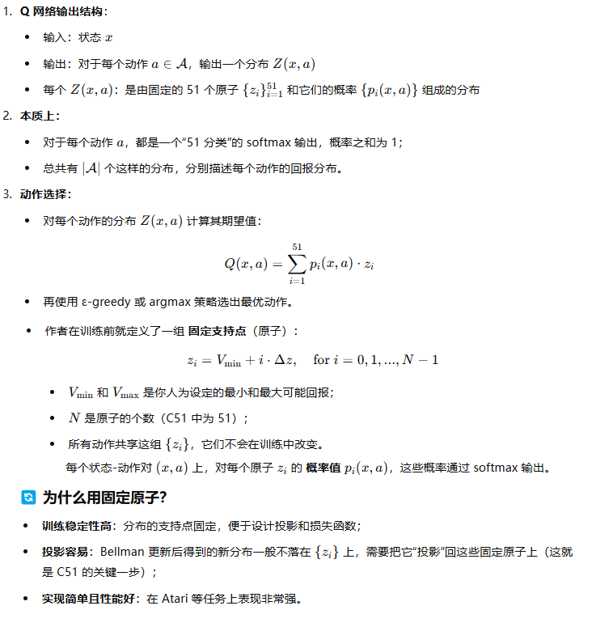

投影的理解


损失函数的计算，比较费解，仔细体会：


思考

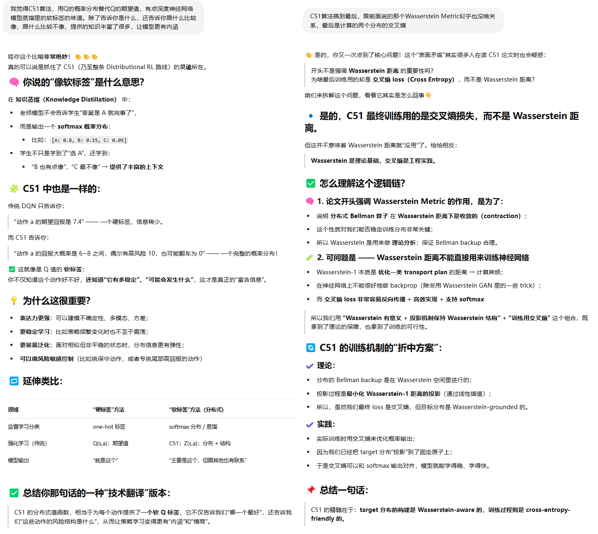

##### 12.2.2 实操

能够得到把游戏玩得非常久（等太久都不失败直接关闭游戏窗口）的checkpoint，而且这个checkpoint是在训练1500个回合（耗时17分钟）左右就得到了。后面持续训练了两个多小时，发现后面出现了分布坍缩，51个原子，最大的概率超过47%了。

后面训练2个小时后的checkpoint挑一个，也能玩很久游戏（得了7895 reward），说明整体上训练是成功。

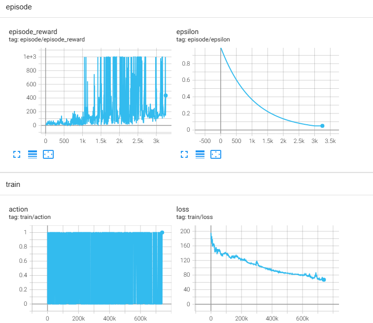

代码如下

```python
import random
import gym
import torch
import torch.nn as nn
import torch.optim as optim
import torch.nn.functional as F
import numpy as np
from collections import deque
import argparse
import os
from torch.utils.tensorboard import SummaryWriter
from datetime import datetime

# 设备选择
device = torch.device("cuda" if torch.cuda.is_available() else "cpu")

# 超参数
gamma = 0.99  # 折扣因子
epsilon = 1.0  # 初始探索率
epsilon_min = 0.05  # 最低探索率
epsilon_decay = 0.999  # 探索率衰减
learning_rate = 1e-3  # 学习率
batch_size = 64  # 经验回放的批量大小
memory_size = 10000  # 经验池大小
target_update_freq = 500  # 目标网络更新频率

env = gym.make("CartPole-v1")
n_state = env.observation_space.shape[0]  # 状态维度
n_action = env.action_space.n
n_atoms = 51
delta_z = 4
z_array = torch.tensor( [i*delta_z for i in range(n_atoms)] ).to(device)

dt = datetime.now().strftime("%H%M%S")
writer = SummaryWriter(f"runs/{dt}")
total_step = 0


# DQN 网络定义
class DQN(nn.Module):
    def __init__(self, state_dim, atom_num=n_atoms, action_num=n_action):
        super(DQN, self).__init__()
        self.action_num = action_num
        self.atom_num = atom_num
        self.fc1 = nn.Linear(state_dim, 128)
        self.fc2 = nn.Linear(128, 128)
        self.fc3 = nn.Linear(128, self.action_num*self.atom_num)

    def forward(self, x):
        x = F.relu(self.fc1(x))
        x = F.relu(self.fc2(x))
        x = self.fc3(x)  # (batch, action_num * atom_num)
        x = x.view(-1, self.action_num, self.atom_num)
        prob = F.softmax(x, dim=-1)  # 每个动作的分布
        z_support = z_array.view(1, 1, -1)  # shape: (1, 1, atom_num)
        q_value = (prob * z_support).sum(dim=-1)  # (batch, action)
        return prob, q_value


    # 初始化网络
model = DQN(n_state).to(device)
target_model = DQN(n_state).to(device)
target_model.load_state_dict(model.state_dict())
optimizer = optim.Adam(model.parameters(), lr=learning_rate)
memory = deque(maxlen=memory_size)


def select_action(state, epsilon):
    """基于 ε-greedy 选择动作"""
    if random.random() < epsilon:
        return random.randint(0, n_action - 1)  # 随机选择
    else:
        state = torch.FloatTensor(state).unsqueeze(0).to(device)
        prob, q_value = model(state)
        return q_value.argmax(dim=1).item()  # 选取 Q 值最大的动作


def train():
    if len(memory) < batch_size:
        return 9999.0

    batch = random.sample(memory, batch_size)
    states, actions, rewards, next_states, dones = zip(*batch)

    states = torch.FloatTensor(states).to(device)
    actions = torch.LongTensor(actions).unsqueeze(1).to(device)
    rewards = torch.FloatTensor(rewards).unsqueeze(1).to(device)
    next_states = torch.FloatTensor(next_states).to(device)
    dones = torch.FloatTensor(dones).unsqueeze(1).to(device)

    with torch.no_grad():
        next_prob, next_q = target_model(next_states)
        next_actions = next_q.argmax(dim=1, keepdim=True)  # (batch, 1)
        next_prob = next_prob.gather(1, next_actions.unsqueeze(-1).expand(-1, 1, n_atoms)).squeeze(1)  # (batch, n_atoms)

        Tz = rewards + (1 - dones) * gamma * z_array.view(1, -1)  # shape: (batch, n_atoms)
        Tz = Tz.clamp(min=z_array[0], max=z_array[-1])  # clip to support

        b = (Tz - z_array[0]) / delta_z  # 计算投影位置
        l = b.floor().long()
        u = b.ceil().long()

        # 防止越界
        l = l.clamp(0, n_atoms - 1)
        u = u.clamp(0, n_atoms - 1)

        m = torch.zeros(batch_size, n_atoms).to(device)

        offset = torch.linspace(0, (batch_size - 1) * n_atoms, batch_size).long().unsqueeze(1).to(device)
        for i in range(n_atoms):
            m.view(-1).index_add_(
                0,
                (l + offset).view(-1),
                (next_prob * (u.float() - b)).view(-1)
            )
            m.view(-1).index_add_(
                0,
                (u + offset).view(-1),
                (next_prob * (b - l.float())).view(-1)
            )

    # 当前网络预测的分布
    pred_prob, _ = model(states)  # (batch, action, atom)
    actions_index = actions.unsqueeze(-1).expand(-1, 1, n_atoms)  # (batch, 1, atom)
    chosen_prob = pred_prob.gather(1, actions_index).squeeze(1)  # (batch, atom)

    eps = 1e-7
    loss = - (m * (chosen_prob + eps).log()).sum(dim=1).mean()
    optimizer.zero_grad()
    loss.backward()
    optimizer.step()
    writer.add_scalar("train/loss", loss.item(), total_step)

    return loss.item()


def save_checkpoint(id):
    path=f"dqn_checkpoint_{id}.pth"
    torch.save(model.state_dict(), path)
    print(f"Checkpoint saved to {path}")


def load_checkpoint(path):
    if os.path.exists(path):
        model.load_state_dict(torch.load(path, map_location=device))
        print(f"Checkpoint loaded from {path}")
    else:
        print("No checkpoint found, starting from scratch.")


def main(mode):
    global epsilon
    global total_step
    global env

    if mode == "train":
        episodes = 5000
        for episode in range(episodes):
            state = env.reset()
            state = state[0]  # 适配 Gym v26
            total_reward = 0

            for step in range(1000): #最大1000步，避免长时间一局玩不完
                action = select_action(state, epsilon)
                next_state, reward, done, _, _ = env.step(action)
                total_step += 1
                writer.add_scalar("train/action", action, total_step)

                # 经验回放缓存
                memory.append((state, action, reward, next_state, done))
                state = next_state
                total_reward += reward

                # 训练 DQN
                loss = train()

                if done:
                    break

            # 逐步降低 epsilon，减少随机探索，提高利用率
            epsilon = max(epsilon_min, epsilon * epsilon_decay)
            writer.add_scalar("episode/epsilon", epsilon, episode)

            # 定期更新目标网络，提高稳定性
            if episode % target_update_freq == 0:
                target_model.load_state_dict(model.state_dict())


            if episode % 100 == 0:
                state = torch.FloatTensor(env.reset()[0]).unsqueeze(0).to(device)
                prob, _ = model(state)
                max_prob = prob[0].max(dim=-1)[0]  # 每个动作最大原子概率
                print(f"[Episode {episode}] max prob per action: {max_prob.detach().cpu().numpy()}")

            if total_reward > 500:
                save_checkpoint(total_reward)
            writer.add_scalar("episode/episode_reward", total_reward, episode)
            print(f"Episode {episode}, Reward: {total_reward}, Epsilon: {epsilon:.3f}, loss:{loss:.3f}")

    elif mode == "infer":
        load_checkpoint("./dqn_checkpoint_729.0.pth")
        env = gym.make("CartPole-v1", render_mode='human')
        state = env.reset()
        state = state[0]
        total_reward = 0

        while True:
            env.render()
            action = select_action(state, 0)  # 纯利用，epsilon=0
            state, reward, done, _, _ = env.step(action)
            total_reward += reward

            if done:
                break

        print(f"Inference finished. Total reward: {total_reward}")


if __name__ == "__main__":
    main("train")
```


### 13. 针对连续动作空间的DQN

#### 13.1 方法

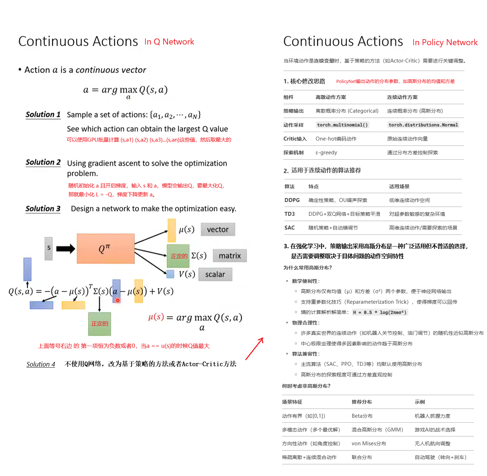

#### 13.2 练习

gym里钟摆小游戏的动作空间是连续的[-2, 2]，下面尝试用**Solution 1** 训练一个Q网络：

```python
import random
import gym
import torch
import torch.nn as nn
import torch.optim as optim
import torch.nn.functional as F
import numpy as np
from collections import deque
from torch.utils.tensorboard import SummaryWriter
import os
import datetime as dt

# 设备选择
device = torch.device("cuda" if torch.cuda.is_available() else "cpu")

# 超参数
gamma = 0.99  # 折扣因子
epsilon = 1.0  # 初始探索率
epsilon_min = 0.05  # 最低探索率
epsilon_decay = 0.995  # 探索率衰减
learning_rate = 1e-4  # 学习率
batch_size = 256  # 更合理的批量大小
memory_size = 100000  # 更大的经验池
target_update_freq = 100  # 目标网络更新频率
max_steps = 2000000  # 最大训练步数
eval_interval = 1000  # 评估间隔
num_candidates = 1000 #等间隔采样连续的动作的个数

writer = SummaryWriter("./logs")
env = gym.make("Pendulum-v1")

n_state = env.observation_space.shape[0]  # 状态维度
n_action = env.action_space.shape[0]
action_high = env.action_space.high[0]
action_low = env.action_space.low[0]

# 状态归一化参数
state_mean = np.array([0.0, 0.0, 0.0])
state_std = np.array([1.0, 1.0, 8.0])


# DQN 网络定义
class QNetwork(nn.Module):
    def __init__(self, state_dim=3, action_dim=1):
        super(QNetwork, self).__init__()
        self.fc1 = nn.Linear(state_dim + action_dim, 256)
        self.fc2 = nn.Linear(256, 256)
        self.fc3 = nn.Linear(256, 1)

    def forward(self, state, action):
        x = torch.cat([state, action], dim=1)
        x = F.relu(self.fc1(x))
        x = F.relu(self.fc2(x))
        return self.fc3(x)


# 初始化网络
model = QNetwork(n_state, n_action).to(device)
target_model = QNetwork(n_state, n_action).to(device)
target_model.load_state_dict(model.state_dict())
optimizer = optim.Adam(model.parameters(), lr=learning_rate)
memory = deque(maxlen=memory_size)


def normalize_state(state):
    return (state - state_mean) / state_std


def select_action(state, epsilon, noise_scale=0.1):
    """基于 ε-greedy 选择动作"""
    if random.random() < epsilon:
        # 随机动作
        action = np.random.uniform(action_low, action_high)
    else:
        # 使用确定性策略选择动作
        state = torch.FloatTensor(normalize_state(state)).unsqueeze(0).to(device)

        # 生成候选动作 
        with torch.no_grad():
            # 生成一组候选动作
            actions = torch.linspace(action_low, action_high, steps=num_candidates, device=device).view(-1, 1)
            states = state.repeat(num_candidates, 1)
            q_values = model(states, actions)
            best_action = actions[q_values.argmax()]

            # 添加一些噪声增加探索
            noise = torch.randn_like(best_action) * noise_scale
            action = torch.clamp(best_action + noise, action_low, action_high).item()

    return np.array([action])


def train(step):
    if len(memory) < batch_size :
        return 0.0

    # 从经验池中采样
    batch = random.sample(memory, batch_size)
    states, actions, rewards, next_states, dones = zip(*batch)

    # 转换为张量并归一化
    states = torch.FloatTensor(np.array(states)).to(device)
    states = (states - torch.FloatTensor(state_mean).to(device)) / torch.FloatTensor(state_std).to(device)

    actions = torch.FloatTensor(np.array(actions)).to(device)
    rewards = torch.FloatTensor(np.array(rewards)).unsqueeze(1).to(device)
    next_states = torch.FloatTensor(np.array(next_states)).to(device)
    next_states = (next_states - torch.FloatTensor(state_mean).to(device)) / torch.FloatTensor(state_std).to(device)
    dones = torch.FloatTensor(np.array(dones)).unsqueeze(1).to(device)

    # 计算当前Q值
    current_q = model(states, actions)

    # 计算目标Q值
    with torch.no_grad():
        # 生成候选动作

        candidate_actions = torch.linspace(action_low, action_high, steps=num_candidates, device=device).view(-1, 1)

        # 计算每个next_state对应的最大Q值
        next_q_values = []
        for next_state in next_states:
            next_state_repeated = next_state.unsqueeze(0).repeat(num_candidates, 1)
            q_values = target_model(next_state_repeated, candidate_actions)
            next_q_values.append(q_values.max())

        next_q_values = torch.stack(next_q_values).unsqueeze(1)
        target_q = rewards + gamma * next_q_values * (1 - dones)

    # 计算损失并更新
    loss = F.mse_loss(current_q, target_q)
    optimizer.zero_grad()
    loss.backward()
    optimizer.step()

    # 记录日志
    writer.add_scalar("Train/Q_value", current_q.mean().item(), step)
    writer.add_scalar("Train/Loss", loss.item(), step)

    return loss.item()


def evaluate(step):
    total_reward = 0.0
    num_episodes = 1
    eval_env = gym.make("Pendulum-v1")
    for _ in range(num_episodes):
        state = eval_env.reset()
        if isinstance(state, tuple):
            state = state[0]
        episode_reward = 0.0
        done = False

        for i in range(100):
            action = select_action(state, 0.0)  # 无探索
            next_state, reward, done, _, _ = eval_env.step(action)
            episode_reward += reward
            state = next_state
            if done:
                break

        total_reward += episode_reward

    avg_reward = total_reward / num_episodes
    writer.add_scalar("Eval/Average Reward", avg_reward, step)
    eval_env.close()
    return avg_reward


def save_checkpoint(step, reward=None):
    os.makedirs("checkpoints", exist_ok=True)
    if reward is not None:
        path = f"checkpoints/dqn_{step}_reward_{reward:.1f}.pth"
    else:
        path = f"checkpoints/dqn_{step}.pth"
    torch.save({
        'model_state_dict': model.state_dict(),
        'optimizer_state_dict': optimizer.state_dict(),
        'step': step,
        'epsilon': epsilon,
    }, path)
    #print(f"Checkpoint saved to {path}")


def load_checkpoint(path):
    if os.path.exists(path):
        checkpoint = torch.load(path, map_location=device)
        model.load_state_dict(checkpoint['model_state_dict'])
        optimizer.load_state_dict(checkpoint['optimizer_state_dict'])
        global epsilon
        epsilon = checkpoint['epsilon']
        print(f"Checkpoint loaded from {path}, step {checkpoint['step']}")
        return checkpoint['step']
    else:
        print("No checkpoint found, starting from scratch.")
        return 0


def main(mode="train"):
    global epsilon
    global env
    if mode == "train":
        step_cnt = load_checkpoint("checkpoints/dqn_latest.pth")
        best_reward = -float('inf')

        state = env.reset()
        if isinstance(state, tuple):
            state = state[0]

        while step_cnt < max_steps:
            # 选择动作并执行

            action = select_action(state, epsilon)
            next_state, reward, done, _, _ = env.step(action)

            # 存储经验
            memory.append((state, action, reward, next_state, done))
            state = next_state
            step_cnt += 1

            # 训练模型

            loss = train(step_cnt)

            # 衰减探索率
            epsilon = max(epsilon_min, epsilon * epsilon_decay)

            # 更新目标网络
            if step_cnt % target_update_freq == 0:
                target_model.load_state_dict(model.state_dict())

            # 定期评估
            if step_cnt % eval_interval == 0:
                avg_reward = evaluate(step_cnt)
                print(f"{dt.datetime.now()} Step {step_cnt}, Eval Reward: {avg_reward:.1f}, Epsilon: {epsilon:.3f} best reward:{best_reward:.2f}")
                state = env.reset()
                if isinstance(state, tuple):
                    state = state[0]

                # 保存最佳模型
                if avg_reward > best_reward:
                    best_reward = avg_reward
                    save_checkpoint(step_cnt, best_reward)

                # 保存最新模型
                save_checkpoint(step_cnt)
                writer.flush()

            # 重置环境
            if done:
                state = env.reset()
                if isinstance(state, tuple):
                    state = state[0]

        writer.close()

    elif mode == "infer":
        load_checkpoint("checkpoints/dqn_36000_reward_-0.2.pth")
        env = gym.make("Pendulum-v1", render_mode='human')
        state = env.reset()
        if isinstance(state, tuple):
            state = state[0]
        total_reward = 0.0

        for i in range(200):
            env.render()
            action = select_action(state, 0.0)
            state, reward, done, _, _ = env.step(action)
            total_reward += reward

            if done:
                break

        print(f"Inference finished. Total reward: {total_reward:.1f}")


if __name__ == "__main__":
    main("infer")
```

结果能收敛，在3万次交互附近有两个特别大的reward的checkpoint，验证发现确实效果很好（见[效果视频](img/RL/pendulum.mp4)）：

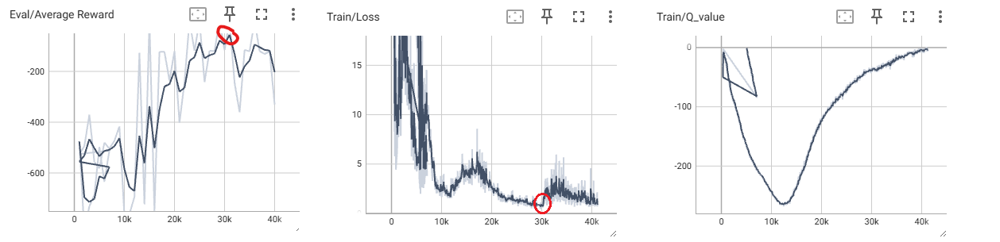


### 14. 连续动作空间的基于策略的方法

#### 14.1 DDPG（深度确定性的策略梯度）方法

##### 14.1.1 原理

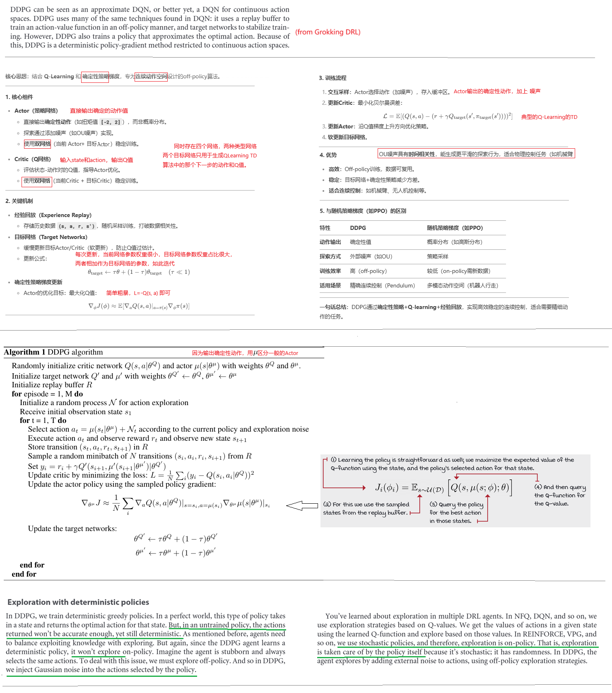

【思考】


【思考】

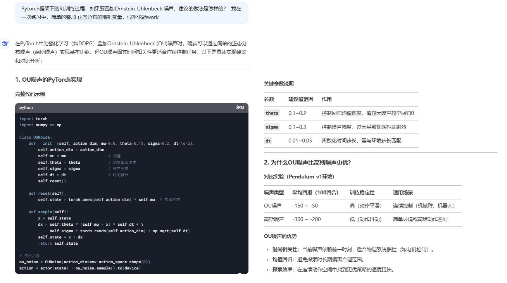

##### 14.1.2 练习：玩转钟摆

下面这个代码是可以收敛的，把钟摆恰好的甩上去立起来

```python
import os
import random
import numpy as np
import torch
import torch.nn as nn
import torch.optim as optim
from torch.utils.tensorboard import SummaryWriter
import gym
from collections import deque, namedtuple


# 超参数配置
class Config:
    def __init__(self):
        self.env_name = "Pendulum-v1"  # 环境名称
        self.seed = 42  # 随机种子
        self.batch_size = 128  # 训练批次大小
        self.gamma = 0.99  # 折扣因子
        self.tau = 0.005  # 目标网络软更新系数
        self.actor_lr = 1e-4  # Actor学习率
        self.critic_lr = 1e-3  # Critic学习率
        self.buffer_size = 100000  # 经验回放缓冲区大小
        self.min_buffer_size = 1000  # 开始训练前的最小数据量
        self.max_episodes = 1000  # 最大训练回合数
        self.max_steps = 200  # 每回合最大步数
        self.exploration_noise = 0.1  # 动作探索噪声
        self.save_interval = 100  # 保存模型的间隔（回合数）
        self.checkpoint_dir = "./checkpoints"  # 模型保存路径
        self.log_dir = "./logs"  # TensorBoard日志路径


# 经验回放缓冲区
class ReplayBuffer:
    def __init__(self, buffer_size):
        self.buffer = deque(maxlen=buffer_size)
        self.experience = namedtuple("Experience", field_names=["state", "action", "reward", "next_state", "done"])

    def add(self, state, action, reward, next_state, done):
        e = self.experience(state, action, reward, next_state, done)
        self.buffer.append(e)

    def sample(self, batch_size):
        experiences = random.sample(self.buffer, batch_size)
        states = torch.FloatTensor(np.array([e.state for e in experiences]))
        actions = torch.FloatTensor(np.array([e.action for e in experiences]))
        rewards = torch.FloatTensor(np.array([e.reward for e in experiences])).unsqueeze(1)
        next_states = torch.FloatTensor(np.array([e.next_state for e in experiences]))
        dones = torch.FloatTensor(np.array([e.done for e in experiences])).unsqueeze(1)
        return states, actions, rewards, next_states, dones

    def __len__(self):
        return len(self.buffer)


# Actor网络（策略网络）
class Actor(nn.Module):
    def __init__(self, state_dim, action_dim, max_action):
        super(Actor, self).__init__()
        self.max_action = max_action
        self.fc1 = nn.Linear(state_dim, 256)
        self.fc2 = nn.Linear(256, 256)
        self.fc3 = nn.Linear(256, action_dim)

    def forward(self, x):
        x = torch.relu(self.fc1(x))
        x = torch.relu(self.fc2(x))
        x = torch.tanh(self.fc3(x)) * self.max_action
        return x


# Critic网络（Q值网络）
class Critic(nn.Module):
    def __init__(self, state_dim, action_dim):
        super(Critic, self).__init__()
        self.fc1 = nn.Linear(state_dim + action_dim, 256)
        self.fc2 = nn.Linear(256, 256)
        self.fc3 = nn.Linear(256, 1)

    def forward(self, x, a):
        x = torch.cat([x, a], dim=1)
        x = torch.relu(self.fc1(x))
        x = torch.relu(self.fc2(x))
        x = self.fc3(x)
        return x


# DDPG算法
class DDPG:
    def __init__(self, config):
        self.config = config
        self.device = torch.device("cuda" if torch.cuda.is_available() else "cpu")

        # 初始化环境
        self.env = gym.make(config.env_name, render_mode="human")
        self.state_dim = self.env.observation_space.shape[0]
        self.action_dim = self.env.action_space.shape[0]
        self.max_action = float(self.env.action_space.high[0])

        # 初始化网络
        self.actor = Actor(self.state_dim, self.action_dim, self.max_action).to(self.device)
        self.actor_target = Actor(self.state_dim, self.action_dim, self.max_action).to(self.device)
        self.actor_target.load_state_dict(self.actor.state_dict())
        self.actor_optimizer = optim.Adam(self.actor.parameters(), lr=config.actor_lr)

        self.critic = Critic(self.state_dim, self.action_dim).to(self.device)
        self.critic_target = Critic(self.state_dim, self.action_dim).to(self.device)
        self.critic_target.load_state_dict(self.critic.state_dict())
        self.critic_optimizer = optim.Adam(self.critic.parameters(), lr=config.critic_lr)

        # 经验回放缓冲区
        self.buffer = ReplayBuffer(config.buffer_size)

        # 训练指标
        self.writer = SummaryWriter(config.log_dir)
        self.episode_rewards = []
        self.total_steps = 0

        # 随机种子
        self._set_seed()

    def _set_seed(self):
        torch.manual_seed(self.config.seed)
        np.random.seed(self.config.seed)
        random.seed(self.config.seed)
        #self.env.seed(self.config.seed)

    def select_action(self, state, add_noise=True):
        state = torch.FloatTensor(state).unsqueeze(0).to(self.device)
        state = state / torch.tensor([[1.0,1.0,8.0]]).to(self.device)
        action = self.actor(state).cpu().data.numpy().flatten()
        if add_noise:
            noise = np.random.normal(0, self.config.exploration_noise, size=self.action_dim)
            action = (action + noise).clip(-self.max_action, self.max_action)
        return action

    def train_step(self):
        if len(self.buffer) < self.config.min_buffer_size:
            return

        # 从缓冲区采样
        states, actions, rewards, next_states, dones = self.buffer.sample(self.config.batch_size)
        states = states.to(self.device)
        states = states / torch.tensor([[1.0, 1.0, 8.0]]).to(self.device) #归一化，避免不同维度的特征差距过大。除数应该会自动做广播
        actions = actions.to(self.device)
        rewards = rewards.to(self.device)
        next_states = next_states.to(self.device)
        next_states = next_states / torch.tensor([[1.0, 1.0, 8.0]]).to(self.device)  # 归一化，避免不同维度的特征差距过大。除数应该会自动做广播
        dones = dones.to(self.device)

        # 更新Critic
        with torch.no_grad():
            next_actions = self.actor_target(next_states)
            target_q = self.critic_target(next_states, next_actions)
            target_q = rewards + (1 - dones) * self.config.gamma * target_q

        current_q = self.critic(states, actions)
        critic_loss = nn.MSELoss()(current_q, target_q)

        self.critic_optimizer.zero_grad()
        critic_loss.backward()
        self.critic_optimizer.step()

        # 更新Actor
        actor_loss = -self.critic(states, self.actor(states)).mean()

        self.actor_optimizer.zero_grad()
        actor_loss.backward()
        self.actor_optimizer.step()

        # 软更新目标网络
        for param, target_param in zip(self.actor.parameters(), self.actor_target.parameters()):
            target_param.data.copy_(self.config.tau * param.data + (1 - self.config.tau) * target_param.data)
        for param, target_param in zip(self.critic.parameters(), self.critic_target.parameters()):
            target_param.data.copy_(self.config.tau * param.data + (1 - self.config.tau) * target_param.data)

        # 记录训练指标
        self.writer.add_scalar("Loss/Critic", critic_loss.item(), self.total_steps)
        self.writer.add_scalar("Loss/Actor", actor_loss.item(), self.total_steps)
        self.writer.add_scalar("Q_value", current_q.mean().item(), self.total_steps)

    def save_checkpoint(self, episode, reward):
        if not os.path.exists(self.config.checkpoint_dir):
            os.makedirs(self.config.checkpoint_dir)
        checkpoint_path = os.path.join(self.config.checkpoint_dir, f"ddpg_episode_{episode}_{int(reward)}.pth")
        torch.save({
            "episode": episode,
            "actor_state_dict": self.actor.state_dict(),
            "critic_state_dict": self.critic.state_dict(),
            "actor_target_state_dict": self.actor_target.state_dict(),
            "critic_target_state_dict": self.critic_target.state_dict(),
            "actor_optimizer_state_dict": self.actor_optimizer.state_dict(),
            "critic_optimizer_state_dict": self.critic_optimizer.state_dict(),
            #"buffer": self.buffer,
            "episode_rewards": self.episode_rewards,
            "total_steps": self.total_steps,
        }, checkpoint_path)
        print(f"Checkpoint saved at episode {episode}")

    def load_checkpoint(self, checkpoint_path):
        checkpoint = torch.load(checkpoint_path)
        self.actor.load_state_dict(checkpoint["actor_state_dict"])
        self.critic.load_state_dict(checkpoint["critic_state_dict"])
        self.actor_target.load_state_dict(checkpoint["actor_target_state_dict"])
        self.critic_target.load_state_dict(checkpoint["critic_target_state_dict"])
        self.actor_optimizer.load_state_dict(checkpoint["actor_optimizer_state_dict"])
        self.critic_optimizer.load_state_dict(checkpoint["critic_optimizer_state_dict"])
        #self.buffer = checkpoint["buffer"]
        self.episode_rewards = checkpoint["episode_rewards"]
        self.total_steps = checkpoint["total_steps"]
        print(f"Checkpoint loaded from {checkpoint_path}, resuming from episode {checkpoint['episode']}")
        return checkpoint["episode"] + 1

    def train(self, resume_checkpoint=None):
        if resume_checkpoint:
            start_episode = self.load_checkpoint(resume_checkpoint)
        else:
            start_episode = 0

        for episode in range(start_episode, self.config.max_episodes):
            state = self.env.reset()[0]
            episode_reward = 0

            for step in range(self.config.max_steps):
                action = self.select_action(state)
                next_state, reward, done, _, _ = self.env.step(action)
                self.buffer.add(state, action, reward, next_state, done)
                state = next_state
                episode_reward += reward
                self.total_steps += 1

                # 训练一步
                self.train_step()

                if done:
                    break

            self.episode_rewards.append(episode_reward)
            self.writer.add_scalar("Reward/Episode", episode_reward, episode)
            print(f"Episode: {episode}, Reward: {episode_reward:.2f}, Steps: {step + 1}")

            # 定期保存模型
            if (episode + 1) % self.config.save_interval == 0 or episode_reward > -1.0:
                self.save_checkpoint(episode + 1, episode_reward)

        self.env.close()
        self.writer.close()

    def showcase(self, checkpoint_path=None):
        """加载训练好的策略网络并展示10回合游戏"""
        if checkpoint_path:
            self.load_checkpoint(checkpoint_path)

        for episode in range(10):
            state = self.env.reset()[0]
            episode_reward = 0
            done = False

            for step in range(self.config.max_steps):
                action = self.select_action(state, add_noise=False)  # 关闭探索噪声
                #print(f"action#{step}:{action}")
                next_state, reward, done, _, _ = self.env.step(action)
                episode_reward += reward
                state = next_state
                self.env.render()  # 显示游戏画面
                if done:
                    break

            print(f"Showcase Episode {episode + 1}, Reward: {episode_reward:.2f}")

        self.env.close()


if __name__ == "__main__":
    config = Config()
    ddpg = DDPG(config)

    # 如果要恢复训练，可以指定checkpoint路径
    # ddpg.train(resume_checkpoint="./checkpoints/ddpg_episode_100.pth")
    #ddpg.train()

    ddpg.showcase("./checkpoints/ddpg_episode_97_0.pth")
    #ddpg.showcase("./checkpoints/ddpg_episode_100.pth")
```

##### 14.1.3 用于离散动作空间的环境？

想起了我前面4.2节到2025/4/7还不能收敛的问题，似乎Actor-Critic方法里面的Critic一定要是V函数不能是Q函数。但DDPG里面，critic是Q函数，让人不禁想要照葫芦画瓢的解决4.2不能收敛的问题。然后我把DDPG的代码改叭改叭，用于离散动作的CartPole游戏。

很苦恼，搞了很久，不能收敛，太玄学了。后来在AI的指导下修改为下面的代码，训练几百个回合后，回合reward最多只能到200多一点，不能像前面一些算法的几十万。

AI对此的评价是：请注意，这种"离散化DDPG"的方法本质上是在重新发明轮子，标准的策略梯度方法（如PPO）或DQN变体在离散动作空间会更合适。

```python
import os
import random
import numpy as np
import torch
import torch.nn as nn
import torch.optim as optim
from torch.utils.tensorboard import SummaryWriter
import gym
from collections import deque, namedtuple
from torch.distributions import Categorical


# 超参数配置
class Config:
    def __init__(self):
        self.env_name = "CartPole-v1"  # 环境名称
        self.seed = 42  # 随机种子
        self.batch_size = 256  # 训练批次大小
        self.gamma = 0.95  # 折扣因子
        self.tau = 0.005  # 目标网络软更新系数
        self.actor_lr = 1e-4  # Actor学习率
        self.critic_lr = 1e-4  # Critic学习率
        self.buffer_size = 100000  # 经验回放缓冲区大小
        self.min_buffer_size = 1000  # 开始训练前的最小数据量
        self.max_episodes = 10000  # 最大训练回合数
        self.max_steps = 200000  # 每回合最大步数
        self.exploration_noise = 0.1  # 动作探索噪声
        self.save_interval = 100  # 保存模型的间隔（回合数）
        self.checkpoint_dir = "./checkpoints"  # 模型保存路径
        self.log_dir = "./logs"  # TensorBoard日志路径


# 经验回放缓冲区
class ReplayBuffer:
    def __init__(self, buffer_size):
        self.buffer = deque(maxlen=buffer_size)
        self.experience = namedtuple("Experience", field_names=["state", "action", "reward", "next_state", "done"])

    def add(self, state, action, reward, next_state, done):
        e = self.experience(state, action, reward, next_state, done)
        self.buffer.append(e)

    def sample(self, batch_size):
        experiences = random.sample(self.buffer, batch_size)
        states = torch.FloatTensor(np.array([e.state for e in experiences]))
        actions = torch.FloatTensor(np.array([e.action for e in experiences]))
        rewards = torch.FloatTensor(np.array([e.reward for e in experiences])).unsqueeze(1)
        next_states = torch.FloatTensor(np.array([e.next_state for e in experiences]))
        dones = torch.FloatTensor(np.array([e.done for e in experiences])).unsqueeze(1)
        return states, actions, rewards, next_states, dones

    def __len__(self):
        return len(self.buffer)


# Actor网络（策略网络）
class Actor(nn.Module):
    def __init__(self, state_dim, action_dim):
        super().__init__()
        self.fc1 = nn.Linear(state_dim, 256)
        self.fc2 = nn.Linear(256, 256)
        self.fc3 = nn.Linear(256, action_dim)

    def forward(self, x):
        x = torch.relu(self.fc1(x))
        x = torch.relu(self.fc2(x))
        return torch.softmax(self.fc3(x), dim=1)


# Critic网络（Q值网络）
class Critic(nn.Module):
    def __init__(self, state_dim, action_dim):
        super().__init__()
        # 对每个离散动作创建一个独立的Q值流
        self.fc1 = nn.Linear(state_dim, 256)
        self.fc2 = nn.Linear(256, 256)
        self.fc3 = nn.Linear(256, action_dim)  # 输出每个动作的Q值

    def forward(self, x, a=None):
        x = torch.relu(self.fc1(x))
        x = torch.relu(self.fc2(x))
        x = self.fc3(x)
        if a is not None:
            return x.gather(1, a.long().unsqueeze(1))  # 选择特定动作的Q值
        return x


# DDPG算法
class AC:
    def __init__(self, config):
        self.config = config
        self.device = torch.device("cuda" if torch.cuda.is_available() else "cpu")

        # 初始化环境
        self.env = gym.make(config.env_name, render_mode="human")
        self.state_dim = self.env.observation_space.shape[0]
        self.action_dim = self.env.action_space.n


        # 初始化网络
        self.actor = Actor(self.state_dim, self.action_dim).to(self.device)
        self.actor_target = Actor(self.state_dim, self.action_dim).to(self.device)
        self.actor_target.load_state_dict(self.actor.state_dict())
        self.actor_optimizer = optim.Adam(self.actor.parameters(), lr=config.actor_lr)

        self.critic = Critic(self.state_dim, self.action_dim).to(self.device)
        self.critic_target = Critic(self.state_dim, self.action_dim).to(self.device)
        self.critic_target.load_state_dict(self.critic.state_dict())
        self.critic_optimizer = optim.Adam(self.critic.parameters(), lr=config.critic_lr)

        # 经验回放缓冲区
        self.buffer = ReplayBuffer(config.buffer_size)

        # 训练指标
        self.writer = SummaryWriter(config.log_dir)
        self.episode_rewards = []
        self.total_steps = 0

        # 随机种子
        self._set_seed()

    def _set_seed(self):
        torch.manual_seed(self.config.seed)
        np.random.seed(self.config.seed)
        random.seed(self.config.seed)

    def select_action(self, state, explore=True):
        state = torch.FloatTensor(state).unsqueeze(0).to(self.device)
        probs = self.actor(state).cpu().detach().numpy().flatten()

        if explore:
            action = np.random.choice(len(probs), p=probs)  # 按概率探索
        else:
            action = np.argmax(probs)
        return action


    def train_step(self):
        if len(self.buffer) < self.config.batch_size:
            return

        # 从缓冲区采样
        states, actions, rewards, next_states, dones = self.buffer.sample(self.config.batch_size)
        states = states.to(self.device)
        actions = actions.to(self.device)
        rewards = rewards.to(self.device)
        next_states = next_states.to(self.device)
        dones = dones.to(self.device)

        # Critic更新
        with torch.no_grad():
            next_probs = self.actor_target(next_states)
            next_q = self.critic_target(next_states)
            target_q = rewards + (1 - dones) * self.config.gamma * \
                       (next_probs * next_q).sum(1, keepdim=True)

        current_q = self.critic(states).gather(1, actions.long().unsqueeze(1))
        critic_loss = nn.MSELoss()(current_q, target_q)

        self.critic_optimizer.zero_grad()
        critic_loss.backward()
        self.critic_optimizer.step()

        # Actor更新（使用可导的probability-based更新）
        probs = self.actor(states)
        q_values = self.critic(states)
        actor_loss = -(probs * q_values).sum(1).mean()  # 可导的更新

        self.actor_optimizer.zero_grad()
        actor_loss.backward()
        self.actor_optimizer.step()

        # 软更新目标网络，#不是完全用actor网络更新，只用一点点比例
        for param, target_param in zip(self.actor.parameters(), self.actor_target.parameters()):
            target_param.data.copy_(self.config.tau * param.data + (1 - self.config.tau) * target_param.data)
        for param, target_param in zip(self.critic.parameters(), self.critic_target.parameters()):
            target_param.data.copy_(self.config.tau * param.data + (1 - self.config.tau) * target_param.data)

        # 记录训练指标
        self.writer.add_scalar("Loss/Critic", critic_loss.item(), self.total_steps)
        self.writer.add_scalar("Loss/Actor", actor_loss.item(), self.total_steps)
        self.writer.add_scalar("Perf/Q_value", current_q.mean().item(), self.total_steps)

    def save_checkpoint(self, episode, reward):
        if not os.path.exists(self.config.checkpoint_dir):
            os.makedirs(self.config.checkpoint_dir)
        checkpoint_path = os.path.join(self.config.checkpoint_dir, f"ac_episode_{episode}_{int(reward)}.pth")
        torch.save({
            "episode": episode,
            "actor_state_dict": self.actor.state_dict(),
            "critic_state_dict": self.critic.state_dict(),
            "actor_target_state_dict": self.actor_target.state_dict(),
            "critic_target_state_dict": self.critic_target.state_dict(),
            "actor_optimizer_state_dict": self.actor_optimizer.state_dict(),
            "critic_optimizer_state_dict": self.critic_optimizer.state_dict(),
            #"buffer": self.buffer,
            "episode_rewards": self.episode_rewards,
            "total_steps": self.total_steps,
        }, checkpoint_path)
        print(f"Checkpoint saved at episode {episode}")

    def load_checkpoint(self, checkpoint_path):
        checkpoint = torch.load(checkpoint_path)
        self.actor.load_state_dict(checkpoint["actor_state_dict"])
        self.critic.load_state_dict(checkpoint["critic_state_dict"])
        self.actor_target.load_state_dict(checkpoint["actor_target_state_dict"])
        self.critic_target.load_state_dict(checkpoint["critic_target_state_dict"])
        self.actor_optimizer.load_state_dict(checkpoint["actor_optimizer_state_dict"])
        self.critic_optimizer.load_state_dict(checkpoint["critic_optimizer_state_dict"])
        #self.buffer = checkpoint["buffer"]
        self.episode_rewards = checkpoint["episode_rewards"]
        self.total_steps = checkpoint["total_steps"]
        print(f"Checkpoint loaded from {checkpoint_path}, resuming from episode {checkpoint['episode']}")
        return checkpoint["episode"] + 1

    def train(self, resume_checkpoint=None):
        if resume_checkpoint:
            start_episode = self.load_checkpoint(resume_checkpoint)
        else:
            start_episode = 0

        for episode in range(start_episode, self.config.max_episodes):
            state = self.env.reset()[0]
            episode_reward = 0

            for step in range(self.config.max_steps):
                action = self.select_action(state)
                next_state, reward, done, _, _ = self.env.step(action)
                self.buffer.add(state, action, reward, next_state, done)
                state = next_state
                episode_reward += reward
                self.total_steps += 1

                # 训练一步
                self.train_step()

                if done:
                    break

            self.episode_rewards.append(episode_reward)
            self.writer.add_scalar("Perf/Reward", episode_reward, episode)
            print(f"Episode: {episode}, Reward: {episode_reward:.2f}, Steps: {step + 1}")

            # 定期保存模型
            if (episode + 1) % self.config.save_interval == 0 or episode_reward > 1000:
                self.save_checkpoint(episode + 1, episode_reward)

        self.env.close()
        self.writer.close()

    def showcase(self, checkpoint_path=None):
        """加载训练好的策略网络并展示10回合游戏"""
        if checkpoint_path:
            self.load_checkpoint(checkpoint_path)

        for episode in range(10):
            state = self.env.reset()[0]
            episode_reward = 0
            done = False

            for step in range(self.config.max_steps):
                action = self.select_action(state, add_noise=False)  # 关闭探索噪声
                #print(f"action#{step}:{action}")
                next_state, reward, done, _, _ = self.env.step(action)
                episode_reward += reward
                state = next_state
                self.env.render()  # 显示游戏画面
                if done:
                    break

            print(f"Showcase Episode {episode + 1}, Reward: {episode_reward:.2f}")

        self.env.close()


if __name__ == "__main__":
    config = Config()
    ac = AC(config)

    # 如果要恢复训练，可以指定checkpoint路径
    # ac.train(resume_checkpoint="./checkpoints/ac_episode_100.pth")
    ac.train()

    ac.showcase("./checkpoints/ac_episode_97_0.pth")
    
```

每个回合的reward走势，横轴是回合：

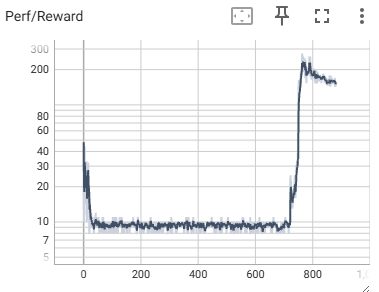

#### 14.2 TD3 (双Q延迟更新DDPG)

##### 14.2.1 原理

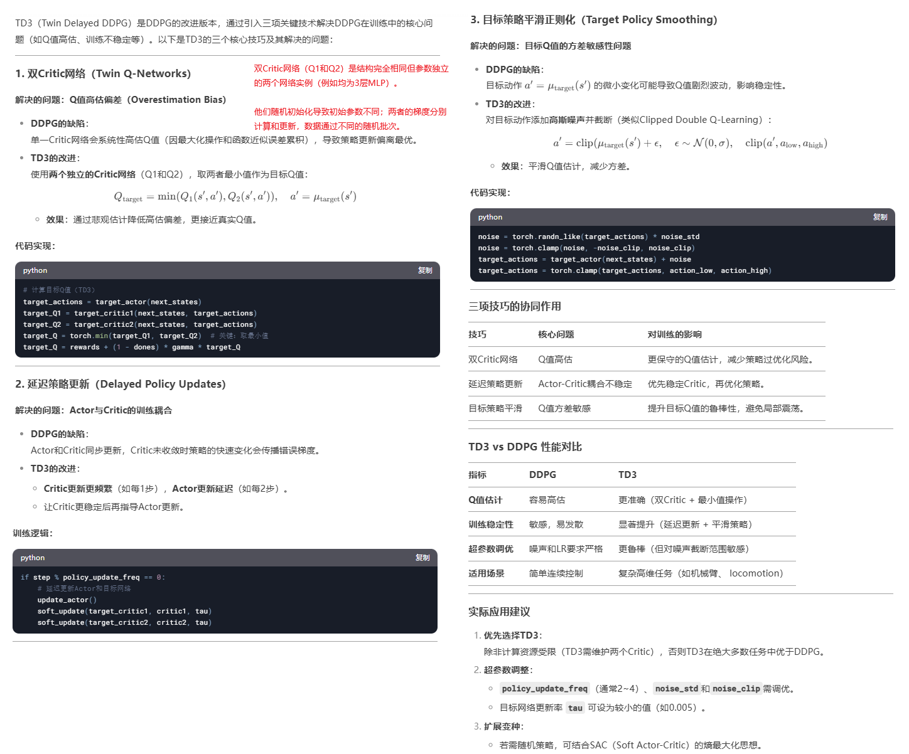

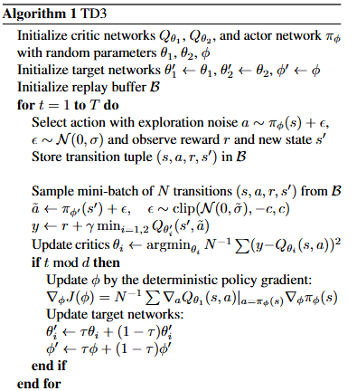

##### 14.2.2 练习

还是倒立钟摆，代码如下。一开始怎么都不收敛，loss不断增大，后来在反向传播的位置加上**对梯度的裁剪**后，就收敛了。

而且发现：网络前向传播里第state和 action做的归一化，去掉也不影响收敛，甚至收敛得更快

```python
import os
import random
import numpy as np
import gym
import torch
import torch.nn as nn
import torch.nn.functional as F
from torch.optim import Adam
from collections import deque
from torch.utils.tensorboard import SummaryWriter

# 设置随机种子保证可复现性
SEED = 42
random.seed(SEED)
np.random.seed(SEED)
torch.manual_seed(SEED)
torch.cuda.manual_seed(SEED)
torch.backends.cudnn.deterministic = True


# 超参数配置
class Config:
    DEVICE = torch.device("cuda" if torch.cuda.is_available() else "cpu")
    ENV_NAME = "Pendulum-v1"
    MAX_EPISODES = 2000  # 最大训练回合数
    MAX_STEPS = 200  # 每回合最大步数
    BATCH_SIZE = 256  # 从经验池采样的批次大小
    GAMMA = 0.99  # 折扣因子
    TAU = 0.005  # 目标网络软更新系数
    LR_ACTOR = 1e-4  # Actor学习率
    LR_CRITIC = 1e-3  # Critic学习率
    REPLAY_BUFFER_SIZE = 100000  # 经验回放池大小
    EXPLORATION_NOISE = 0.1  # 探索噪声标准差
    POLICY_NOISE = 0.1  # 目标策略平滑噪声标准差
    NOISE_CLIP = 0.3  # 噪声截断范围
    POLICY_UPDATE_FREQ = 2  # 策略网络延迟更新频率
    CHECKPOINT_DIR = "./td3_checkpoints"  # 模型保存目录
    CHECKPOINT_INTERVAL = 50  # 每隔多少回合保存一次模型
    LOGS_DIR = "./logs"


# 创建检查点目录
os.makedirs(Config.CHECKPOINT_DIR, exist_ok=True)
os.makedirs(Config.LOGS_DIR, exist_ok=True)
writer = SummaryWriter(Config.LOGS_DIR)


# Actor策略网络
class Actor(nn.Module):
    def __init__(self, state_dim, action_dim, max_action):
        super(Actor, self).__init__()
        self.max_action = max_action

        # 网络结构
        self.l1 = nn.Linear(state_dim, 256)
        self.l2 = nn.Linear(256, 256)
        self.l3 = nn.Linear(256, action_dim)

    def forward(self, state):
        """
        输入: state [batch_size, state_dim]
        输出: action [batch_size, action_dim], 范围[-max_action, max_action]
        """
        state = state / torch.tensor([[1.0, 1.0, 8.0]]).to(Config.DEVICE)
        a = F.relu(self.l1(state))
        a = F.relu(self.l2(a))
        a = torch.tanh(self.l3(a)) * self.max_action
        return a


# Critic价值网络 (双Q网络)
class Critic(nn.Module):
    def __init__(self, state_dim, action_dim):
        super(Critic, self).__init__()
        # Q1网络
        self.l1 = nn.Linear(state_dim + action_dim, 256)
        self.l2 = nn.Linear(256, 256)
        self.l3 = nn.Linear(256, 1)

        # Q2网络 (结构相同但参数独立)
        self.l4 = nn.Linear(state_dim + action_dim, 256)
        self.l5 = nn.Linear(256, 256)
        self.l6 = nn.Linear(256, 1)

    def forward(self, state, action):
        """
        输入:
            state [batch_size, state_dim]
            action [batch_size, action_dim]
        输出:
            Q1值 [batch_size, 1], Q2值 [batch_size, 1]
        """

        sa = torch.cat([state, action], dim=1)
        sa = sa / torch.tensor([[1.0, 1.0, 8.0, 2.0]]).to(Config.DEVICE)

        # Q1网络前向
        q1 = F.relu(self.l1(sa))
        q1 = F.relu(self.l2(q1))
        q1 = self.l3(q1)

        # Q2网络前向
        q2 = F.relu(self.l4(sa))
        q2 = F.relu(self.l5(q2))
        q2 = self.l6(q2)

        return q1, q2

    def Q1(self, state, action):
        """仅返回Q1值"""
        sa = torch.cat([state, action], dim=1)
        sa = sa / torch.tensor([[1.0, 1.0, 8.0, 2.0]]).to(Config.DEVICE)
        q1 = F.relu(self.l1(sa))
        q1 = F.relu(self.l2(q1))
        q1 = self.l3(q1)
        return q1


# 经验回放池
class ReplayBuffer:
    def __init__(self, max_size):
        self.buffer = deque(maxlen=max_size)

    def add(self, state, action, reward, next_state, done):
        """存储单步经验"""
        self.buffer.append((state, action, reward, next_state, done))

    def sample(self, batch_size):
        """随机采样批次经验"""
        batch = random.sample(self.buffer, batch_size)
        # 转换为PyTorch张量并移动到设备
        states = torch.FloatTensor(np.array([t[0] for t in batch])).to(Config.DEVICE)
        actions = torch.FloatTensor(np.array([t[1] for t in batch])).to(Config.DEVICE)
        rewards = torch.FloatTensor(np.array([t[2] for t in batch])).unsqueeze(1).to(Config.DEVICE)
        next_states = torch.FloatTensor(np.array([t[3] for t in batch])).to(Config.DEVICE)
        dones = torch.FloatTensor(np.array([t[4] for t in batch])).unsqueeze(1).to(Config.DEVICE)
        return states, actions, rewards, next_states, dones

    def __len__(self):
        return len(self.buffer)


# TD3算法主体
class TD3:
    def __init__(self, state_dim, action_dim, max_action):
        self.max_action = max_action

        # 初始化网络
        self.actor = Actor(state_dim, action_dim, max_action).to(Config.DEVICE)
        self.actor_target = Actor(state_dim, action_dim, max_action).to(Config.DEVICE)
        self.actor_target.load_state_dict(self.actor.state_dict())
        self.actor_optimizer = Adam(self.actor.parameters(), lr=Config.LR_ACTOR)

        self.critic = Critic(state_dim, action_dim).to(Config.DEVICE)
        self.critic_target = Critic(state_dim, action_dim).to(Config.DEVICE)
        self.critic_target.load_state_dict(self.critic.state_dict())
        self.critic_optimizer = Adam(self.critic.parameters(), lr=Config.LR_CRITIC)

        # 经验回放池
        self.replay_buffer = ReplayBuffer(Config.REPLAY_BUFFER_SIZE)

        # 训练计数器
        self.total_it = 0

    def select_action(self, state, add_noise=True):
        """
        根据状态选择动作 (推理时add_noise=False)
        输入: state [state_dim] (numpy数组)
        输出: action [action_dim] (numpy数组)
        """
        state = torch.FloatTensor(state).unsqueeze(0).to(Config.DEVICE)  # [1, state_dim]
        action = self.actor(state).cpu().data.numpy().flatten()  # [action_dim]

        if add_noise:
            # 添加探索噪声
            noise = np.random.normal(0, Config.EXPLORATION_NOISE, size=action.shape)
            action = (action + noise).clip(-self.max_action, self.max_action)
        return action

    def train(self, batch_size):
        """训练一步"""
        self.total_it += 1

        # 从经验池采样
        states, actions, rewards, next_states, dones = self.replay_buffer.sample(batch_size)

        # 计算目标Q值 (带策略平滑和双Q网络最小值)
        with torch.no_grad():
            # 目标策略动作 + 平滑噪声
            noise = (torch.randn_like(actions) * Config.POLICY_NOISE).clamp(
                -Config.NOISE_CLIP, Config.NOISE_CLIP)
            next_actions = (self.actor_target(next_states) + noise).clamp(
                -self.max_action, self.max_action)

            # 双Q网络目标值取最小
            target_Q1, target_Q2 = self.critic_target(next_states, next_actions)
            target_Q = torch.min(target_Q1, target_Q2)
            target_Q = rewards + (1 - dones) * Config.GAMMA * target_Q

        # 更新Critic网络 (最小化TD误差)
        current_Q1, current_Q2 = self.critic(states, actions)
        critic_loss = F.mse_loss(current_Q1, target_Q) + F.mse_loss(current_Q2, target_Q)
        writer.add_scalar("train/current_Q1", current_Q1.mean().cpu().item(), self.total_it)
        writer.add_scalar("train/current_Q2", current_Q2.mean().cpu().item(), self.total_it)

        self.critic_optimizer.zero_grad()
        critic_loss.backward()
        torch.nn.utils.clip_grad_norm_(self.critic.parameters(), 1.0) #对梯度进行裁剪，防止梯度爆炸
        self.critic_optimizer.step()
        writer.add_scalar("train/critic_loss", critic_loss.cpu().item(), self.total_it)

        # 延迟更新Actor和目标网络
        if self.total_it % Config.POLICY_UPDATE_FREQ == 0:
            # 更新Actor (最大化Q值)
            actor_loss = -self.critic.Q1(states, self.actor(states)).mean()

            self.actor_optimizer.zero_grad()
            actor_loss.backward()
            torch.nn.utils.clip_grad_norm_(self.actor.parameters(), 1.0) #对梯度进行裁剪，防止梯度爆炸
            self.actor_optimizer.step()

            writer.add_scalar("train/actor_loss", actor_loss.cpu().item(), self.total_it)

            # 软更新目标网络
            for param, target_param in zip(self.critic.parameters(), self.critic_target.parameters()):
                target_param.data.copy_(Config.TAU * param.data + (1 - Config.TAU) * target_param.data)

            for param, target_param in zip(self.actor.parameters(), self.actor_target.parameters()):
                target_param.data.copy_(Config.TAU * param.data + (1 - Config.TAU) * target_param.data)

    def save_checkpoint(self, episode, reward, checkpoint_dir=None):
        """保存模型检查点"""
        if checkpoint_dir is None:
            checkpoint_dir = Config.CHECKPOINT_DIR

        os.makedirs(checkpoint_dir, exist_ok=True)
        torch.save({
            'episode': episode,
            'actor_state_dict': self.actor.state_dict(),
            'critic_state_dict': self.critic.state_dict(),
            'actor_target_state_dict': self.actor_target.state_dict(),
            'critic_target_state_dict': self.critic_target.state_dict(),
            'actor_optimizer_state_dict': self.actor_optimizer.state_dict(),
            'critic_optimizer_state_dict': self.critic_optimizer.state_dict(),
            'total_it': self.total_it,
            'reward': reward
        }, os.path.join(checkpoint_dir, f"td3_episode_{episode}_reward_{reward:.2f}.pth"))

    def load_checkpoint(self, checkpoint_path):
        """加载模型检查点"""
        checkpoint = torch.load(checkpoint_path)
        self.actor.load_state_dict(checkpoint['actor_state_dict'])
        self.critic.load_state_dict(checkpoint['critic_state_dict'])
        self.actor_target.load_state_dict(checkpoint['actor_target_state_dict'])
        self.critic_target.load_state_dict(checkpoint['critic_target_state_dict'])
        self.actor_optimizer.load_state_dict(checkpoint['actor_optimizer_state_dict'])
        self.critic_optimizer.load_state_dict(checkpoint['critic_optimizer_state_dict'])
        self.total_it = checkpoint['total_it']
        return checkpoint['episode'], checkpoint['reward']


# 训练函数
def train_td3(resume_checkpoint=None):
    # 初始化环境
    env = gym.make(Config.ENV_NAME)
    state_dim = env.observation_space.shape[0]
    action_dim = env.action_space.shape[0]
    max_action = float(env.action_space.high[0])

    # 初始化TD3
    td3 = TD3(state_dim, action_dim, max_action)

    # 如果指定了检查点，则加载
    start_episode = 0
    if resume_checkpoint is not None:
        start_episode, _ = td3.load_checkpoint(resume_checkpoint)
        print(f"Resuming training from episode {start_episode} with checkpoint {resume_checkpoint}")

    # 训练循环
    step_cnt = 0
    for episode in range(start_episode, Config.MAX_EPISODES):
        state, _ = env.reset()
        episode_reward = 0

        for step in range(Config.MAX_STEPS):
            # 选择动作并执行
            action = td3.select_action(state)
            next_state, reward, terminated, truncated, _ = env.step(action)
            step_cnt += 1
            done = terminated or truncated
            writer.add_scalar("train/selected_action", action, step_cnt)

            # 存储经验
            td3.replay_buffer.add(state, action, reward, next_state, done)
            state = next_state
            episode_reward += reward

            # 训练
            if len(td3.replay_buffer) >= Config.BATCH_SIZE:
                td3.train(Config.BATCH_SIZE)

            if done:
                break
        writer.add_scalar("train/episode_reward", episode_reward, episode)

        # 打印训练进度
        print(f"Episode {episode + 1}/{Config.MAX_EPISODES}, Reward: {episode_reward:.2f}, Steps: {step + 1}")

        # 定期保存检查点
        if (episode + 1) % Config.CHECKPOINT_INTERVAL == 0 or episode_reward > -200:
            td3.save_checkpoint(episode + 1, episode_reward)

    env.close()


# 推理函数 (加载模型并渲染)
def eval_td3(checkpoint_path, num_episodes=5):
    # 初始化环境 (带渲染)
    env = gym.make(Config.ENV_NAME, render_mode="human")
    state_dim = env.observation_space.shape[0]
    action_dim = env.action_space.shape[0]
    max_action = float(env.action_space.high[0])

    # 初始化TD3并加载检查点
    td3 = TD3(state_dim, action_dim, max_action)
    td3.load_checkpoint(checkpoint_path)

    # 推理循环
    for episode in range(num_episodes):
        state, _ = env.reset()
        episode_reward = 0

        for step in range(Config.MAX_STEPS*100):
            action = td3.select_action(state, add_noise=False)  # 推理时不加噪声
            next_state, reward, terminated, truncated, _ = env.step(action)
            done = terminated or truncated

            state = next_state
            episode_reward += reward

            if done:
                break

        print(f"Evaluation Episode {episode + 1}, Reward: {episode_reward:.2f}")

    env.close()


# 主函数
def main(arg):
    if arg == "train":
        train_td3()
    else:
        eval_td3("td3_checkpoints/xx.pth")


main("train")
```

训练过程的监控图如下，也录制了一个[收敛后的showcase视频](img/RL/td3.mp4)

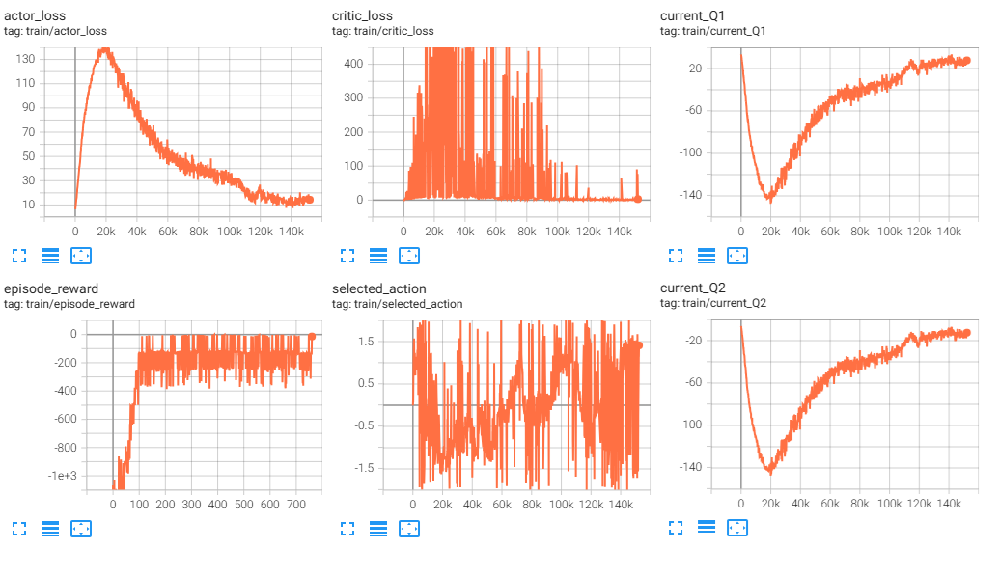

#### 14.3 SAC（Soft Actor-Critic）方法

##### 14.3.1 原理

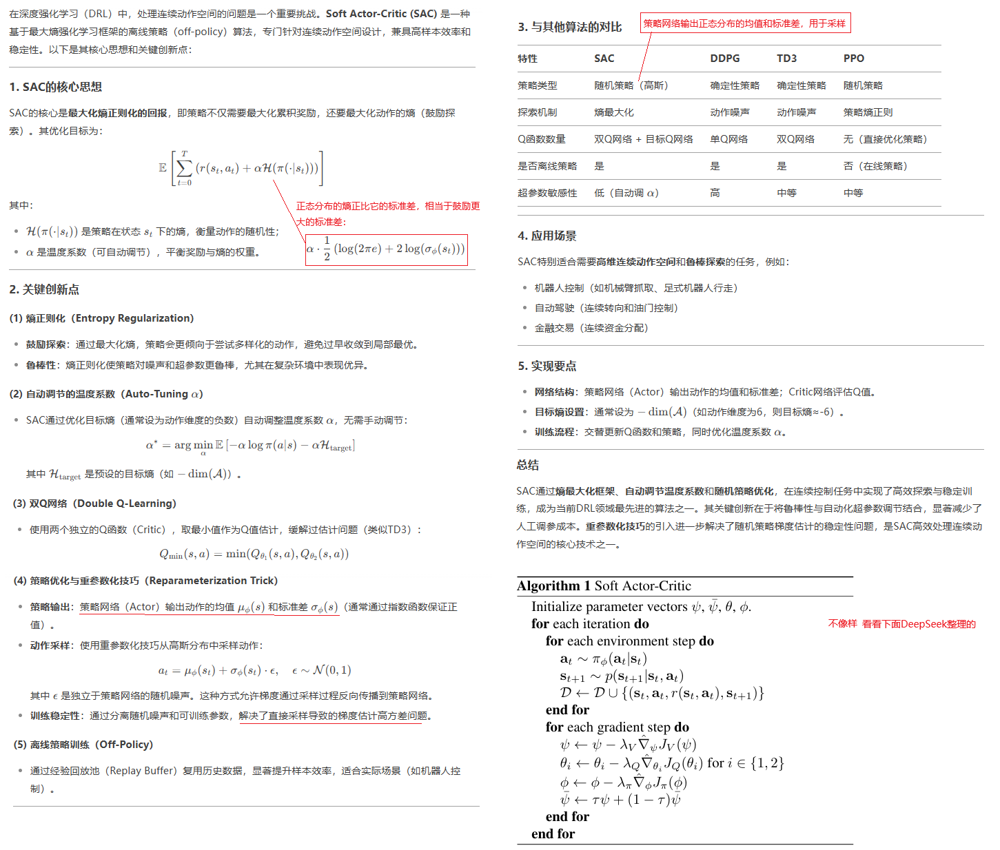

DeepSeek整理的算法伪代码，牛逼哄哄：

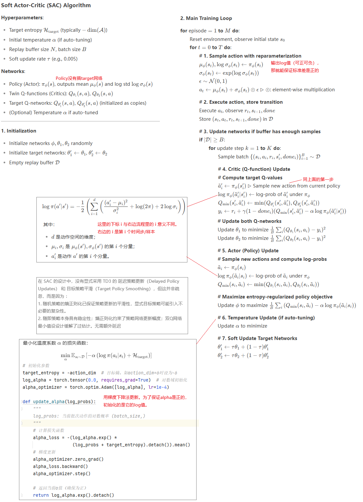

##### 14.3.2 练习

被反复用到的大模型提示语：

```python
'''
我希望你帮我写代码，实现强化学习的SAC算法来玩openai gym中的pendulum，具体要求：
1、基于pytorch框架，使用cuda加速
2、代码集中在一个python文件里方便我拷贝粘贴
3、使用函数、类等方式做好模块化编程
4、丰富的注释，尤其是对张量做相关变换的时候，要把变换前后的shape明确在注释里说明
5、为了方便长时间的训练，要有checkpoint的定时保存，且当一个回合的reward满足一定阈值也要及时保存checkpoint，checkpoint文件名包含reward。 重新开始训练的时候可以指定加载某个checkpoint
6、支持evaluation，可以指定加载某个checkpoint后玩几局游戏。 train的时候不要渲染游戏窗口，evaluate的时候要渲染游戏窗口。
7、使用tensorboard上报关键的指标，包括Q值、深度网络的loss值、每个回合的reward值等，在一个folder里
'''
```

代码如下：

```python
import os
import random
import numpy as np
import gym
import torch
import torch.nn as nn
import torch.optim as optim
import torch.nn.functional as F
from torch.utils.tensorboard import SummaryWriter
from collections import deque, namedtuple
from datetime import datetime

# 设备配置
device = torch.device("cuda" if torch.cuda.is_available() else "cpu")

# 经验回放缓冲区
Transition = namedtuple('Transition', ('state', 'action', 'reward', 'next_state', 'done'))


class ReplayBuffer:
    def __init__(self, capacity):
        self.buffer = deque(maxlen=capacity)

    def push(self, *args):
        """保存一个transition到buffer"""
        self.buffer.append(Transition(*args))

    def sample(self, batch_size):
        """随机采样一个batch的transition"""
        transitions = random.sample(self.buffer, batch_size)
        # 将batch的transitions转换为Transition的batch
        batch = Transition(*zip(*transitions))

        # 转换为tensor并指定设备
        # state: (batch_size, state_dim) -> (batch_size, state_dim)
        state = torch.FloatTensor(np.array(batch.state)).to(device)
        # action: (batch_size, action_dim) -> (batch_size, action_dim)
        action = torch.FloatTensor(np.array(batch.action)).to(device)
        # reward: (batch_size,) -> (batch_size, 1)
        reward = torch.FloatTensor(np.array(batch.reward)).unsqueeze(1).to(device)
        # next_state: (batch_size, state_dim) -> (batch_size, state_dim)
        next_state = torch.FloatTensor(np.array(batch.next_state)).to(device)
        # done: (batch_size,) -> (batch_size, 1)
        done = torch.FloatTensor(np.array(batch.done)).unsqueeze(1).to(device)

        return state, action, reward, next_state, done

    def __len__(self):
        return len(self.buffer)


# 策略网络 (Actor)
class GaussianPolicy(nn.Module):
    def __init__(self, state_dim, action_dim, hidden_dim=256, max_action=2.0):
        super(GaussianPolicy, self).__init__()
        self.max_action = max_action

        # 共享的特征提取层
        self.fc1 = nn.Linear(state_dim, hidden_dim)
        self.fc2 = nn.Linear(hidden_dim, hidden_dim)

        # 输出均值和log标准差
        self.mean = nn.Linear(hidden_dim, action_dim)
        self.log_std = nn.Linear(hidden_dim, action_dim)

    def forward(self, state):
        """前向传播，返回动作的均值和log标准差"""
        # state: (batch_size, state_dim) -> (batch_size, hidden_dim)
        x = F.relu(self.fc1(state))
        x = F.relu(self.fc2(x))

        # mean: (batch_size, action_dim)
        mean = self.mean(x)
        # log_std: (batch_size, action_dim)
        log_std = self.log_std(x)
        # 限制log_std的范围
        log_std = torch.clamp(log_std, min=-20, max=2)

        return mean, log_std

    def sample(self, state):
        """从策略中采样动作，并计算对数概率"""
        # 获取均值和log标准差
        # mean: (batch_size, action_dim)
        # log_std: (batch_size, action_dim)
        mean, log_std = self.forward(state)
        std = log_std.exp()

        # 重参数化技巧采样动作
        # normal_noise: (batch_size, action_dim)
        normal_noise = torch.randn_like(mean)
        # action: (batch_size, action_dim)
        raw_action = mean + normal_noise * std

        # 计算tanh变换前的对数概率
        log_prob = -0.5 * (normal_noise.pow(2) + 2 * log_std + np.log(2 * np.pi))
        log_prob = log_prob.sum(dim=-1, keepdim=True)

        # 应用tanh变换
        action = torch.tanh(raw_action) * self.max_action

        # 添加tanh的Jacobian修正
        log_prob -= (2 * (np.log(2) - raw_action - F.softplus(-2 * raw_action))).sum(dim=-1, keepdim=True)

        return action, log_prob


# Q网络 (Critic)
class QNetwork(nn.Module):
    def __init__(self, state_dim, action_dim, hidden_dim=256):
        super(QNetwork, self).__init__()

        # Q1网络
        self.fc1 = nn.Linear(state_dim + action_dim, hidden_dim)
        self.fc2 = nn.Linear(hidden_dim, hidden_dim)
        self.fc3 = nn.Linear(hidden_dim, 1)

        # Q2网络
        self.fc4 = nn.Linear(state_dim + action_dim, hidden_dim)
        self.fc5 = nn.Linear(hidden_dim, hidden_dim)
        self.fc6 = nn.Linear(hidden_dim, 1)

    def forward(self, state, action):
        """前向传播，返回两个Q值"""
        # state: (batch_size, state_dim)
        # action: (batch_size, action_dim)
        sa = torch.cat([state, action], dim=-1)

        # Q1网络
        q1 = F.relu(self.fc1(sa))
        q1 = F.relu(self.fc2(q1))
        q1 = self.fc3(q1)

        # Q2网络
        q2 = F.relu(self.fc4(sa))
        q2 = F.relu(self.fc5(q2))
        q2 = self.fc6(q2)

        return q1, q2


# SAC算法主体
class SAC:
    def __init__(self, state_dim, action_dim, max_action):
        # 超参数
        self.gamma = 0.99
        self.tau = 0.005
        self.alpha = 0.2
        self.lr = 3e-4
        self.batch_size = 512
        self.buffer_size = 100000
        self.target_entropy = -action_dim
        self.automatic_entropy_tuning = True
        self.step_cnt = 0
        log_dir = f"runs/"
        self.writer = SummaryWriter(log_dir)

        # 网络初始化
        self.actor = GaussianPolicy(state_dim, action_dim, max_action=max_action).to(device)
        self.critic = QNetwork(state_dim, action_dim).to(device)
        self.critic_target = QNetwork(state_dim, action_dim).to(device)
        self.critic_target.load_state_dict(self.critic.state_dict())

        # 优化器
        self.actor_optimizer = optim.Adam(self.actor.parameters(), lr=self.lr)
        self.critic_optimizer = optim.Adam(self.critic.parameters(), lr=self.lr)

        # 自动调节温度系数alpha
        if self.automatic_entropy_tuning:
            self.log_alpha = torch.zeros(1, requires_grad=True, device=device)
            self.alpha_optimizer = optim.Adam([self.log_alpha], lr=self.lr)

        # 经验回放缓冲区
        self.replay_buffer = ReplayBuffer(self.buffer_size)

    def select_action(self, state, evaluate=False):
        """选择动作"""
        state = torch.FloatTensor(state).unsqueeze(0).to(device)
        if evaluate:
            # 评估时不添加噪声
            with torch.no_grad():
                mean, _ = self.actor(state)
                # 评估时希望表现稳定，因此直接使用均值（概率密度最大的点）.  tanh后把值映射到[-1,1]， 乘以max_action就 映射到环境动作空间
                action = torch.tanh(mean) * self.actor.max_action
        else:
            # 训练时采样动作
            action, _ = self.actor.sample(state)

        return action.detach().cpu().numpy()[0]

    def update_parameters(self):
        """更新网络参数"""
        if len(self.replay_buffer) < self.batch_size:
            return None,None,None
        self.step_cnt += 1

        # 从缓冲区采样一个batch
        state, action, reward, next_state, done = self.replay_buffer.sample(self.batch_size)

        with torch.no_grad():
            # 采样下一个动作并计算其对数概率
            next_action, next_log_prob = self.actor.sample(next_state)

            # 计算目标Q值
            q1_next, q2_next = self.critic_target(next_state, next_action)
            min_q_next = torch.min(q1_next, q2_next) - self.alpha * next_log_prob
            target_q = reward + (1 - done) * self.gamma * min_q_next

        # 更新Critic网络
        current_q1, current_q2 = self.critic(state, action)
        critic_loss = F.mse_loss(current_q1, target_q) + F.mse_loss(current_q2, target_q)

        self.critic_optimizer.zero_grad()
        critic_loss.backward()
        self.critic_optimizer.step()

        # 更新Actor网络
        new_action, log_prob = self.actor.sample(state)
        q1, q2 = self.critic(state, new_action)
        min_q = torch.min(q1, q2)
        # 最大化熵和最大化min_q，因为是梯度下降，要实现梯度上升，所以min_q前面有符号， 熵是 -log_prob，负负得正
        actor_loss = (self.alpha * log_prob - min_q).mean()

        self.actor_optimizer.zero_grad()
        actor_loss.backward()
        self.actor_optimizer.step()

        # 自动调节alpha
        if self.automatic_entropy_tuning:
            alpha_loss = -(self.log_alpha * (log_prob + self.target_entropy).detach()).mean()

            self.alpha_optimizer.zero_grad()
            alpha_loss.backward()
            self.alpha_optimizer.step()

            self.alpha = self.log_alpha.exp()

        # 软更新目标网络
        for param, target_param in zip(self.critic.parameters(), self.critic_target.parameters()):
            target_param.data.copy_(self.tau * param.data + (1 - self.tau) * target_param.data)


        self.writer.add_scalar('Loss/critic_loss', critic_loss.item(), self.step_cnt)
        self.writer.add_scalar('Loss/actor_loss',  actor_loss.item(), self.step_cnt)
        self.writer.add_scalar('Alpha/alpha', self.alpha.item(), self.step_cnt)

        return critic_loss.item(), actor_loss.item(), self.alpha.item()

    def save_checkpoint(self, filename, episode_reward=None):
        """保存模型检查点"""
        checkpoint = {
            'actor_state_dict': self.actor.state_dict(),
            'critic_state_dict': self.critic.state_dict(),
            'critic_target_state_dict': self.critic_target.state_dict(),
            'actor_optimizer_state_dict': self.actor_optimizer.state_dict(),
            'critic_optimizer_state_dict': self.critic_optimizer.state_dict(),
            'alpha': self.alpha,
            'log_alpha': self.log_alpha if self.automatic_entropy_tuning else None,
            'alpha_optimizer_state_dict': self.alpha_optimizer.state_dict() if self.automatic_entropy_tuning else None,
            'episode_reward': episode_reward
        }
        torch.save(checkpoint, filename)

    def load_checkpoint(self, filename):
        """加载模型检查点"""
        checkpoint = torch.load(filename)
        self.actor.load_state_dict(checkpoint['actor_state_dict'])
        self.critic.load_state_dict(checkpoint['critic_state_dict'])
        self.critic_target.load_state_dict(checkpoint['critic_target_state_dict'])
        self.actor_optimizer.load_state_dict(checkpoint['actor_optimizer_state_dict'])
        self.critic_optimizer.load_state_dict(checkpoint['critic_optimizer_state_dict'])

        if self.automatic_entropy_tuning and checkpoint['log_alpha'] is not None:
            self.log_alpha = checkpoint['log_alpha']
            self.alpha = checkpoint['alpha']
            self.alpha_optimizer.load_state_dict(checkpoint['alpha_optimizer_state_dict'])

        return checkpoint.get('episode_reward', None)


# 训练函数
def train(env, agent, max_episodes=2000, save_interval=10):

    best_reward = -float('inf')

    for episode in range(1, max_episodes + 1):
        state = env.reset()[0]
        episode_reward = 0

        for i in range(200):  #一个回合最多与环境交互200次。由于钟摆游戏不会返回done=True，要限制最大步数
            # 选择动作
            action = agent.select_action(state)

            # 执行动作
            next_state, reward, done, _,_ = env.step(action)

            # 存储transition
            agent.replay_buffer.push(state, action, reward, next_state, done)

            # 更新状态
            state = next_state
            episode_reward += reward

            # 更新网络参数
            critic_loss, actor_loss, alpha = agent.update_parameters()
            if done:
                break

        # 记录到TensorBoard
        agent.writer.add_scalar('Reward/episode_reward', episode_reward, episode)


        # 打印进度
        print(f"Episode: {episode}, Reward: {episode_reward:.2f}, Alpha: {alpha if alpha is not None else 9.9:.3f}")

        # 定期保存检查点
        if episode % save_interval == 0:
            checkpoint_name = f"checkpoints/sac_pendulum_episode_{episode}_reward_{episode_reward:.2f}.pth"
            agent.save_checkpoint(checkpoint_name, episode_reward)

        # 如果达到奖励阈值，保存最佳模型
        if episode_reward > best_reward:
            best_reward = episode_reward
            checkpoint_name = f"checkpoints/sac_pendulum_best_reward_{episode_reward:.2f}.pth"
            agent.save_checkpoint(checkpoint_name, episode_reward)


# 评估函数
def evaluate(env, agent, checkpoint_path, num_episodes=10):
    # 加载检查点
    agent.load_checkpoint(checkpoint_path)

    for episode in range(1, num_episodes + 1):
        state = env.reset()[0]
        episode_reward = 0
        done = False

        for i in range(200):
            # 渲染环境
            env.render()

            # 选择动作
            action = agent.select_action(state, evaluate=True)

            # 执行动作
            next_state, reward, done, _, _ = env.step(action)

            # 更新状态
            state = next_state
            episode_reward += reward
            if done:
                break

        print(f"Evaluation Episode: {episode}, Reward: {episode_reward:.2f}")


# 主函数
def main(arg):
    # 创建环境
    env = gym.make('Pendulum-v1')
    state_dim = env.observation_space.shape[0]
    action_dim = env.action_space.shape[0]
    max_action = float(env.action_space.high[0])

    # 创建SAC代理
    agent = SAC(state_dim, action_dim, max_action)

    # 创建检查点目录
    os.makedirs("checkpoints", exist_ok=True)


    if arg == 'train':
        train(env, agent)
    else:
        env = gym.make('Pendulum-v1', render_mode="human")
        evaluate(env, agent, "checkpoints/sac_pendulum_episode_260_reward_-1.32.pth")


if __name__ == '__main__':
    main("train")
```

收敛非常快，在第20个episode的时候，就出现了最佳reward：

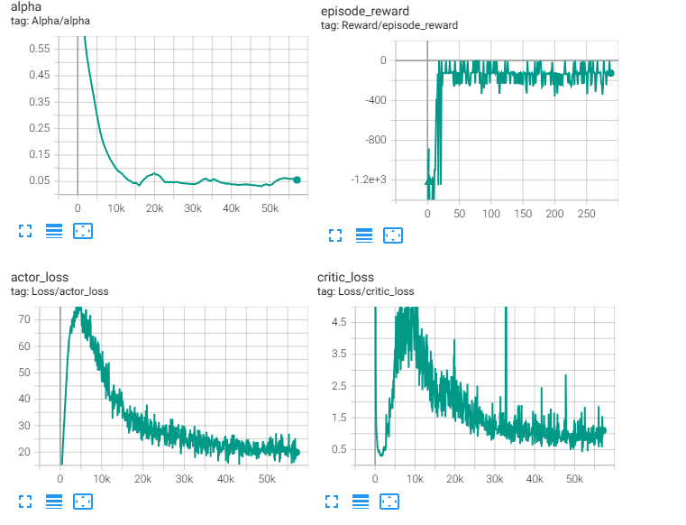

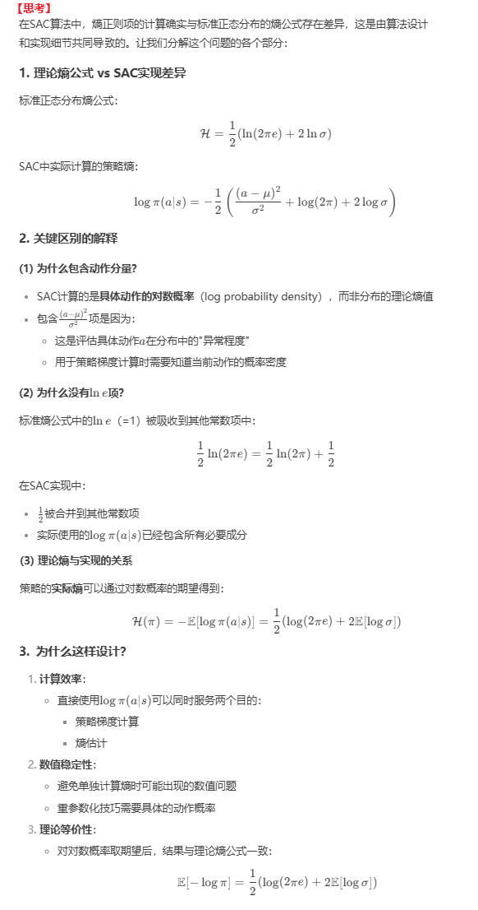

#### 14.4 三个方法如何选择

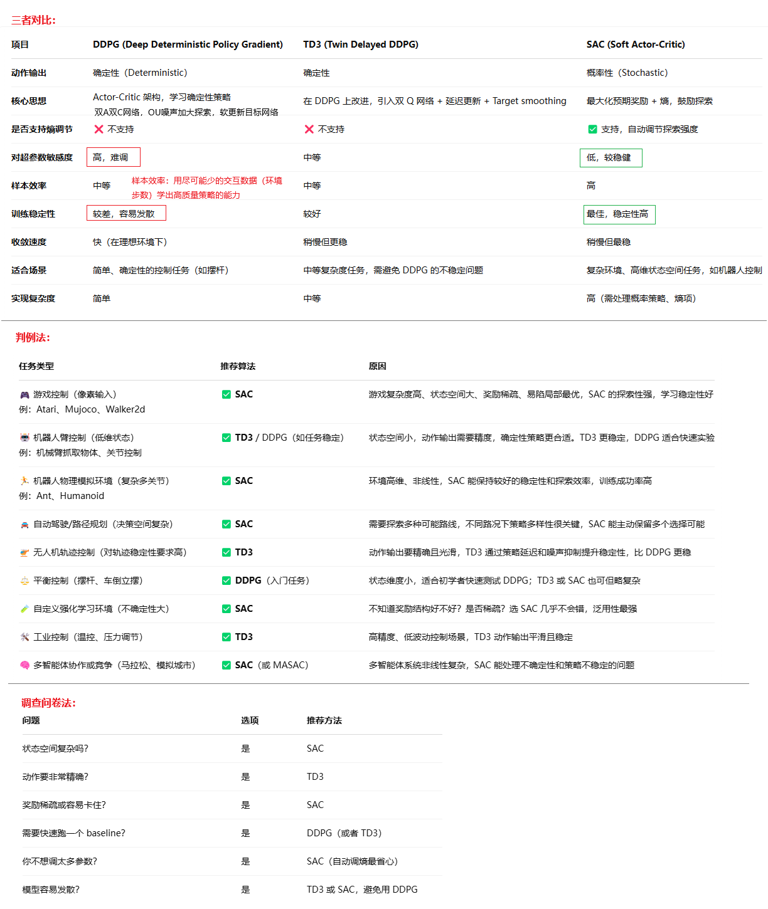

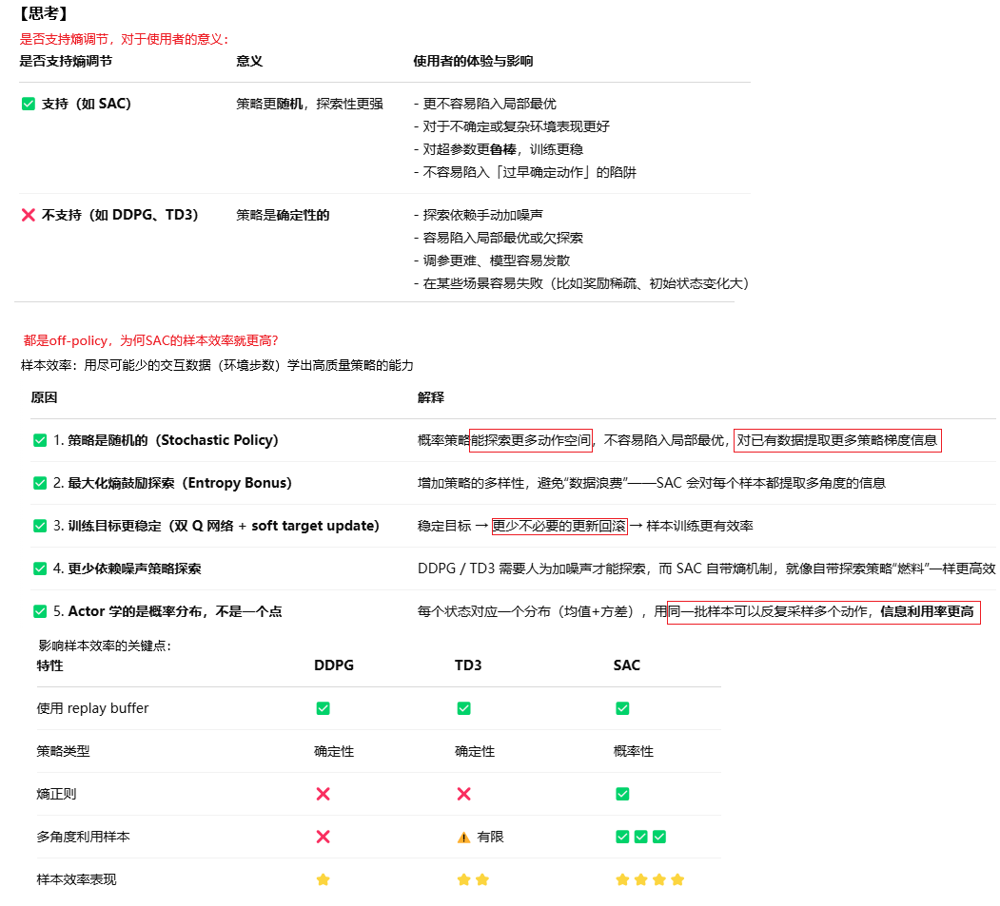

#### 14.5 问题和应对手段的总结

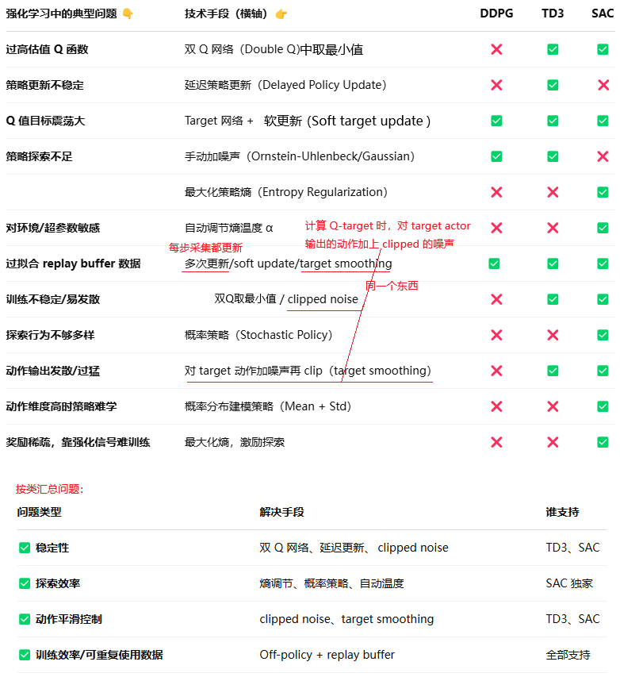

### 15. 原始视觉像素输入

#### 15.1 练习：gym里的carlpole

**思考：**

Q：输入raw pixels方式下，step() 与环境交互一次后，环境返回一帧画面，会不会有的游戏一帧画面不足以描述它的两次step() 交互之间的状态，例如step()交互后，游戏里的主角跳起来，这时候返回一帧画面描述主角跳起来，但随后发生了一次爆炸，这个是第二帧才能看得见的。那agent就观测不完整了，没有获得爆炸这个信息，这种情况该怎么做？ 环境需要返回多帧视频作为next state？

A：理想的环境应原生提供多帧或事件标记，必须要求环境提供事件标记或原始物理状态，这是最可靠的方案。如果环境拒绝提供这些信息，则必须接受RL agent在某些场景下的性能上限——这是环境设计缺陷导致的根本限制。

Q：我认为CartPole游戏，step()与环境交互后，随后调用env.render()获得一帧数据的三个通道，也不足以充分描述step()里的action发生后的游戏的状态，pole是运动中倒下，需要多帧来体现小车移动速度、Pole的转速等。这也是为什么低维的结构化输入下，是有四个特征，其中两个特征是速度。

A：您完全正确！对于CartPole这类连续动力学系统，单帧静态图像确实丢失了关键的运动状态信息（如杆子的角速度、小车的加速度等）。

下面摘录自官方文档：

gym.Env.render(*self*) → RenderFrame | List[RenderFrame] | None

Compute the render frames as specified by render_mode attribute during initialization of the environment.The set of supported modes varies per environment. (And some third-party environments may not support rendering at all.) By convention, if render_mode is:

- None (default): no render is computed.
- human: render return None. The environment is continuously rendered in the current display or terminal. Usually for human consumption.
- rgb_array: return a single frame representing the current state of the environment. A frame is a numpy.ndarray with shape (x, y, 3) representing RGB values for an x-by-y pixel image.
- rgb_array_list: return a list of frames representing the states of the environment since the last reset. Each frame is a numpy.ndarray with shape (x, y, 3), as with rgb_array.
- ansi: Return a strings (str) or StringIO.StringIO containing a terminal-style text representation for each time step. The text can include newlines and ANSI escape sequences (e.g. for colors).

##### 15.1.1 使用Actor-Critic方法

AI提示词：

```python
'''
openai gym提供的可用于强化学习的游戏，支持给RL提供感官像素级的高维输入。
请以CartPole游戏为例，用Actor-Critic方法训练一个agent，可以很好的玩CartPole游戏，要求：
1、使用类和函数做好模块化编程，并加上丰富的注释
2、使用tensorboard上报关键指标，而不是用plt画图
3、为了适应长时间的训练，请定期保存checkpoint，开始训练的时候也支持加载指定的checkpoint
4、实现evaluate函数，支持加载指定的checkpoint进行showcase。
5、训练的时候不要渲染出游戏窗口，evaluate的时候需要渲染出游戏窗口
6、基于pytorch，用CUDA加速
7、代码写再一个python文件里方便我拷贝粘贴
8、使用TD而不是蒙特卡洛方法更新网络
9、用raw pixel作为A-C网络的输入，堆叠历史上最近的4个帧构成4个通道形成输入
10、参考DDPG算法：target网络+off-policy（replay buffer）+ 软更新
'''
```


暂时还不能很好的收敛，reward_scale如果大于等于0.1，就会发现probability饱和为1或者0，如果设置为0.01，episode len又不增长。

AI说如果模型输出的softmax概率的置信度太高，会影响agent性能。
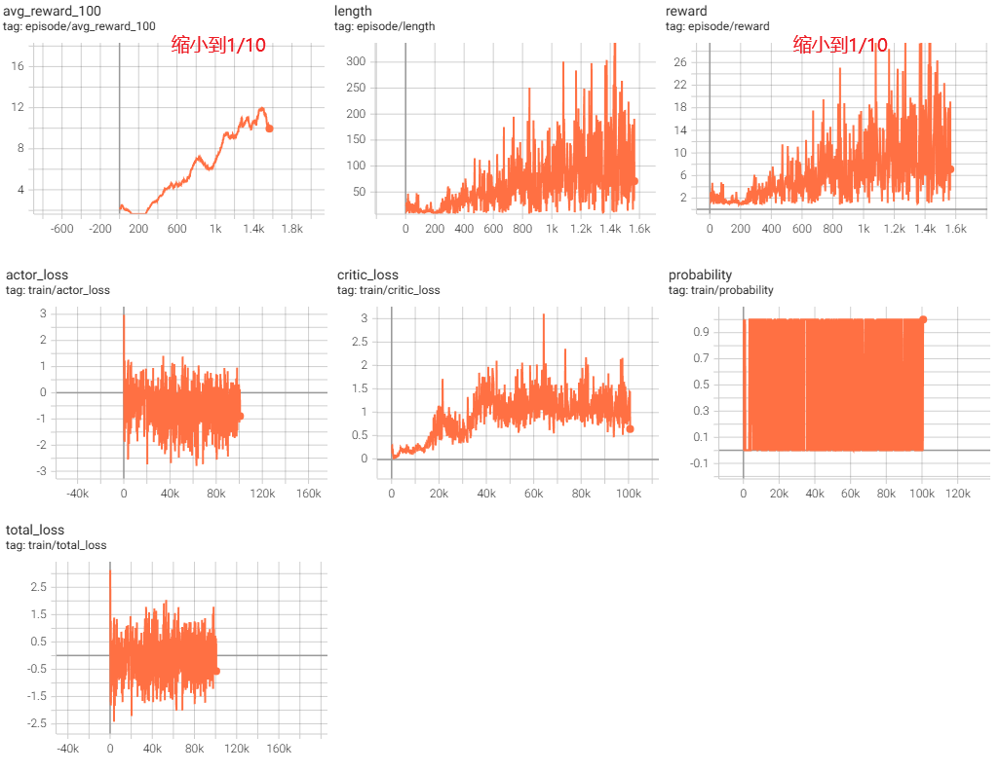

代码如下：

```python
import os
import random
import numpy as np
import gym
from gym import wrappers
import torch
import torch.nn as nn
import torch.optim as optim
import torch.nn.functional as F
from torch.distributions import Categorical
from torch.utils.tensorboard import SummaryWriter
from datetime import datetime
from collections import deque
import cv2

# 设置随机种子保证可重复性
SEED = 42
torch.manual_seed(SEED)
np.random.seed(SEED)
random.seed(SEED)


class FrameStacker:
    """处理帧堆叠和预处理的工具类"""

    def __init__(self, stack_size=4, frame_size=84):
        """
        参数:
            stack_size: 堆叠的帧数
            frame_size: 调整后的帧尺寸
        """
        self.stack_size = stack_size
        self.frame_size = frame_size
        self.frames = deque(maxlen=stack_size)

    def process_frame(self, frame):
        """预处理单帧图像"""
        # 转为灰度图
        gray = cv2.cvtColor(frame, cv2.COLOR_RGB2GRAY)
        # 调整尺寸
        resized = cv2.resize(gray, (self.frame_size, self.frame_size))
        # 归一化
        return resized / 255.0

    def stack_frames(self, frame, is_new_episode=False):
        """堆叠帧"""
        processed = self.process_frame(frame)

        if is_new_episode:
            # 新回合用相同帧初始化
            self.frames = deque([processed] * self.stack_size, maxlen=self.stack_size)
        else:
            self.frames.append(processed)

        # 返回形状 (stack_size, H, W)
        return np.stack(self.frames, axis=0)

    def get_state(self, frame, is_new_episode=False):
        """获取当前状态张量"""
        stacked = self.stack_frames(frame, is_new_episode)
        # 转为PyTorch张量并添加批次维度 (1, stack_size, H, W)
        return torch.FloatTensor(stacked).unsqueeze(0)


class ActorCriticNetwork(nn.Module):
    """Actor-Critic网络结构"""

    def __init__(self, input_channels, action_dim):
        super().__init__()

        # 共享特征提取器
        self.feature_extractor = nn.Sequential(
            nn.Conv2d(input_channels, 32, kernel_size=8, stride=4),
            nn.ReLU(),
            nn.Conv2d(32, 64, kernel_size=4, stride=2),
            nn.ReLU(),
            nn.Conv2d(64, 64, kernel_size=3, stride=1),
            nn.ReLU(),
            nn.Flatten()
        )

        # 测试特征维度
        with torch.no_grad():
            dummy = torch.zeros(1, input_channels, 84, 84)
            self.feature_dim = self.feature_extractor(dummy).shape[1]

        # Actor网络
        self.actor = nn.Sequential(
            nn.Linear(self.feature_dim, 256),
            nn.ReLU(),
            nn.Linear(256, action_dim))

        # Critic网络
        self.critic = nn.Sequential(
            nn.Linear(self.feature_dim, 256),
            nn.ReLU(),
            nn.Linear(256, 1))

        # 初始化权重
        self._initialize_weights()

    def _initialize_weights(self):
        for module in self.modules():
            if isinstance(module, nn.Conv2d) or isinstance(module, nn.Linear):
                nn.init.orthogonal_(module.weight, gain=nn.init.calculate_gain('relu'))
                nn.init.zeros_(module.bias)

    def forward(self, x):
        """前向传播"""
        features = self.feature_extractor(x)
        logits = self.actor(features)  # 动作logits
        value = self.critic(features)  # 状态价值
        return F.softmax(logits, dim=-1), value


class ReplayBuffer:
    """经验回放缓冲区"""

    def __init__(self, capacity):
        self.capacity = capacity
        self.buffer = []
        self.position = 0

    def push(self, transition):
        """存储转移样本"""
        if len(self.buffer) < self.capacity:
            self.buffer.append(None)
        self.buffer[self.position] = transition
        self.position = (self.position + 1) % self.capacity

    def sample(self, batch_size):
        """随机采样"""
        return random.sample(self.buffer, batch_size)

    def __len__(self):
        return len(self.buffer)


class ActorCriticAgent:
    """基于像素输入的Actor-Critic智能体"""

    def __init__(self, env, device='cuda', gamma=0.99, lr=3e-4,
                 buffer_size=10000, batch_size=128, tau=0.005,
                 checkpoint_dir='checkpoints', tb_log_dir='runs'):

        self.env = env
        self.device = torch.device(device if torch.cuda.is_available() else 'cpu')
        self.gamma = gamma
        self.reward_scale = 0.1
        self.tau = tau  # 目标网络软更新系数
        self.batch_size = batch_size

        # 初始化网络
        self.input_channels = 4  # 堆叠4帧
        self.action_dim = env.action_space.n
        self.online_net = ActorCriticNetwork(self.input_channels, self.action_dim).to(self.device)
        self.target_net = ActorCriticNetwork(self.input_channels, self.action_dim).to(self.device)
        self.target_net.load_state_dict(self.online_net.state_dict())

        # 优化器
        self.optimizer = optim.Adam(self.online_net.parameters(), lr=lr)

        # 经验回放
        self.replay_buffer = ReplayBuffer(buffer_size)

        # 帧堆叠处理器
        self.frame_stacker = FrameStacker(stack_size=self.input_channels)

        # 检查点和日志
        self.checkpoint_dir = checkpoint_dir
        os.makedirs(checkpoint_dir, exist_ok=True)

        timestamp = datetime.now().strftime("%Y%m%d_%H%M%S")
        self.writer = SummaryWriter(f"{tb_log_dir}/cartpole_pixel_ac_{timestamp}")

        # 训练统计
        self.episode_rewards = []
        self.episode_lengths = []
        self.total_steps = 0
        self.best_mean_reward = -float('inf')

    def select_action(self, state, epsilon=0.1):
        """选择动作 (epsilon-greedy)"""
        if random.random() < epsilon:
            return random.randint(0, self.action_dim - 1)

        with torch.no_grad():
            probs, _ = self.online_net(state.to(self.device))
            dist = Categorical(probs)
            return dist.sample().item()

    def update(self):
        """使用TD方法更新网络"""
        if len(self.replay_buffer) < self.batch_size:
            return None, None, None

        # 从回放缓冲区采样
        transitions = self.replay_buffer.sample(self.batch_size)
        batch = list(zip(*transitions))

        states = torch.cat(batch[0]).to(self.device)
        actions = torch.LongTensor(batch[1]).to(self.device).unsqueeze(1)
        rewards = torch.FloatTensor(batch[2]).to(self.device).unsqueeze(1)
        next_states = torch.cat(batch[3]).to(self.device)
        dones = torch.FloatTensor(batch[4]).to(self.device).unsqueeze(1)

        # 计算目标价值
        with torch.no_grad():
            _, next_values = self.target_net(next_states)
            targets = rewards + (1 - dones) * self.gamma * next_values

        # 计算当前价值
        probs, values = self.online_net(states)
        dist = Categorical(probs)
        log_probs = dist.log_prob(actions.squeeze())
        self.writer.add_scalar(f"train/probability", probs[0][0].item(), self.total_steps)

        # 计算损失
        advantages = targets - values.detach()
        actor_loss = -(log_probs * advantages.squeeze()).mean()
        critic_loss = F.mse_loss(values, targets)

        # 熵正则化
        entropy = dist.entropy().mean()

        # 总损失
        total_loss = actor_loss + 0.5 * critic_loss - 0.1 * entropy

        # 梯度下降
        self.optimizer.zero_grad()
        total_loss.backward()

        # 检查梯度是否存在
        for name, param in self.online_net.named_parameters():
            if param.grad is None:
                self.writer.add_scalar(f"grad_none/{name}", 0, self.total_steps)
            else:
                self.writer.add_scalar(f"grad_std/{name}", param.grad.std().item(), self.total_steps)
                self.writer.add_scalar(f"grad_mean/{name}", param.grad.mean().item(), self.total_steps)
        torch.nn.utils.clip_grad_norm_(self.online_net.parameters(), 0.5)

        self.optimizer.step()

        # 软更新目标网络
        self.soft_update()

        return actor_loss.item(), critic_loss.item(), total_loss.item()

    def soft_update(self):
        """软更新目标网络"""
        for target_param, online_param in zip(self.target_net.parameters(), self.online_net.parameters()):
            target_param.data.copy_(self.tau * online_param.data + (1.0 - self.tau) * target_param.data)

    def train(self, max_episodes=10000, max_steps=500,
              save_interval=100, checkpoint_path=None):
        """训练主循环"""

        # 加载检查点
        if checkpoint_path:
            self.load_checkpoint(checkpoint_path)
            print(f"Loaded checkpoint from {checkpoint_path}")

        epsilon = 1.0
        for episode in range(1, max_episodes + 1):
            # 重置环境
            self.env.reset()
            frame = self.env.render()
            state = self.frame_stacker.get_state(frame, is_new_episode=True)

            episode_reward = 0
            episode_length = 0

            for step in range(max_steps):
                self.total_steps += 1

                # 选择动作
                action = self.select_action(state, epsilon)

                # 执行动作
                _, reward, done, _ = self.env.step(action)[:4]
                reward = reward * self.reward_scale # reward scale
                next_frame = self.env.render()
                episode_reward += reward
                episode_length += 1

                # 获取下一状态
                next_state = self.frame_stacker.get_state(next_frame)

                # 存储转移
                self.replay_buffer.push((
                    state,
                    action,
                    reward,
                    next_state,
                    done
                ))

                # 更新网络
                actor_loss, critic_loss, total_loss = self.update()

                # 记录指标
                if actor_loss is not None:
                    self.writer.add_scalar('train/actor_loss', actor_loss, self.total_steps)
                    self.writer.add_scalar('train/critic_loss', critic_loss, self.total_steps)
                    self.writer.add_scalar('train/total_loss', total_loss, self.total_steps)

                state = next_state

                if done:
                    break

            epsilon = max(0.1, epsilon * 0.995)

            # 记录回合统计
            self.episode_rewards.append(episode_reward)
            self.episode_lengths.append(episode_length)
            self.writer.add_scalar('episode/reward', episode_reward, episode)
            self.writer.add_scalar('episode/length', episode_length, episode)
            self.writer.add_scalar('episode/avg_reward_100',
                                   np.mean(self.episode_rewards[-100:]), episode)

            # 打印进度
            if episode % 10 == 0:
                avg_reward = np.mean(self.episode_rewards[-10:])
                print(f"Episode {episode}, Reward: {episode_reward:.4f}, "
                      f"Avg Reward (last 10): {avg_reward:.4f}, "
                      f"Length: {episode_length} "
                      f"Epsilon: {epsilon:.2f} ")

            # 保存检查点
            if episode % save_interval == 0:
                self.save_checkpoint(episode, episode_reward)

                # 保存最佳模型
                mean_reward = np.mean(self.episode_rewards[-save_interval:])
                if mean_reward > self.best_mean_reward:
                    self.best_mean_reward = mean_reward
                    self.save_checkpoint(episode, episode_reward, is_best=True)


    def evaluate(self, env_show, checkpoint_path=None, num_episodes=5, render=True):
        """评估模型性能"""
        if checkpoint_path:
            self.load_checkpoint(checkpoint_path)
            print(f"Loaded checkpoint from {checkpoint_path}")


        total_rewards = []

        for episode in range(1, num_episodes + 1):
            self.env.reset()
            env_show.reset()
            frame = self.env.render()
            state = self.frame_stacker.get_state(frame, is_new_episode=True)

            episode_reward = 0
            done = False

            while not done:


                with torch.no_grad():
                    probs, _ = self.online_net(state.to(self.device))
                    action = torch.argmax(probs).item()

                _, reward, done, _ = self.env.step(action)[:4]
                env_show.step(action)
                reward = reward * self.reward_scale  # reward scale
                frame = self.env.render()
                state = self.frame_stacker.get_state(frame)
                episode_reward += reward

            total_rewards.append(episode_reward)
            print(f"Evaluation Episode {episode}, Reward: {episode_reward}")

        avg_reward = np.mean(total_rewards)
        print(f"Average evaluation reward over {num_episodes} episodes: {avg_reward}")


        return avg_reward

    def save_checkpoint(self, episode, reward, is_best=False, is_final=False):
        """保存模型检查点"""
        checkpoint = {
            'episode': episode,
            'online_net_state_dict': self.online_net.state_dict(),
            'target_net_state_dict': self.target_net.state_dict(),
            'optimizer_state_dict': self.optimizer.state_dict(),
            'episode_rewards': self.episode_rewards,
            'episode_lengths': self.episode_lengths,
            'total_steps': self.total_steps,
            'best_mean_reward': self.best_mean_reward,
            'frame_stacker_state': {
                'frames': list(self.frame_stacker.frames)
            }
        }

        if is_best:
            path = os.path.join(self.checkpoint_dir, f'best_model_{int(reward)}.pth')
        elif is_final:
            path = os.path.join(self.checkpoint_dir, 'final_model.pth')
        else:
            path = os.path.join(self.checkpoint_dir, f'checkpoint_ep{episode}_{int(reward)}.pth')

        torch.save(checkpoint, path)
        print(f"Saved checkpoint to {path}")

    def load_checkpoint(self, checkpoint_path):
        """加载模型检查点"""
        if not os.path.exists(checkpoint_path):
            raise FileNotFoundError(f"Checkpoint file {checkpoint_path} not found")

        checkpoint = torch.load(checkpoint_path, weights_only=False)
        self.online_net.load_state_dict(checkpoint['online_net_state_dict'])
        self.target_net.load_state_dict(checkpoint['target_net_state_dict'])
        self.optimizer.load_state_dict(checkpoint['optimizer_state_dict'])
        self.episode_rewards = checkpoint.get('episode_rewards', [])
        self.episode_lengths = checkpoint.get('episode_lengths', [])
        self.total_steps = checkpoint.get('total_steps', 0)
        self.best_mean_reward = checkpoint.get('best_mean_reward', -float('inf'))

        # 恢复帧堆叠状态
        if 'frame_stacker_state' in checkpoint:
            self.frame_stacker.frames = deque(
                checkpoint['frame_stacker_state']['frames'],
                maxlen=self.frame_stacker.stack_size
            )

        print(f"Loaded checkpoint from episode {checkpoint['episode']}")


def main(mode='train', checkpoint=None):
    """主函数"""
    if mode == 'train':
        # 训练模式 (不渲染)
        env = gym.make('CartPole-v1', render_mode='rgb_array')
        agent = ActorCriticAgent(env)
        agent.train(checkpoint_path=checkpoint)
    elif mode == 'eval':
        # 评估模式 (渲染)
        env_show = gym.make('CartPole-v1', render_mode='human')
        env_pixel = gym.make('CartPole-v1', render_mode='rgb_array')
        agent = ActorCriticAgent(env_pixel)
        agent.evaluate(env_show, checkpoint_path=checkpoint)
    else:
        raise ValueError("Invalid mode. Use 'train' or 'eval'")


if __name__ == '__main__':
    import argparse

    #main(mode="train", checkpoint='checkpoints/checkpoint_ep1000.pth')
    main(mode="train")
    #main(mode='eval', checkpoint='checkpoints/best_model_12.pth')
```

##### 15.1.2 使用DQN方法

一句话：学习到了一定的策略，比随机策略有明显提升，但相比低维结构化的状态输入的收敛后的DQN，差距太大

如下图红色线条所示：1.5千个回合后，每个回合的total_reward均值在100左右，但是波动很大，低的50以下，高的有270多的。

使用最高total_reward的checkpoint进行evaluate，10个回合下来平均分在72分。

相比较：**均匀随机策略的表现，平均total_reward在20左右，最高的能到80左右。**


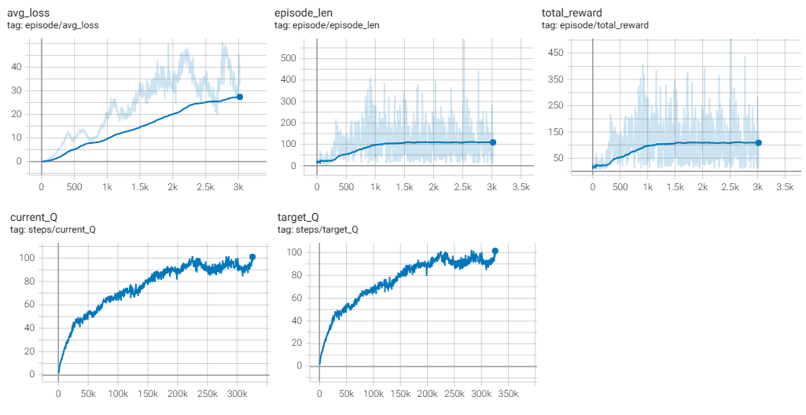

代码：

```python
import os
import random
import numpy as np
from collections import deque, namedtuple
from typing import List, Tuple, Optional
import sys

import gym
import torch
import torch.nn as nn
import torch.optim as optim
import torch.nn.functional as F
from torch.utils.tensorboard import SummaryWriter
from PIL import Image
import matplotlib.pyplot as plt
import cv2
from datetime import datetime
import signal

# 设备配置 (优先使用CUDA)
device = torch.device("cuda" if torch.cuda.is_available() else "cpu")

class FrameStack:
    """处理帧堆叠的类，将最近的4帧堆叠在一起作为状态"""

    def __init__(self, env, stack_size=4):
        self.env = env
        self.stack_size = stack_size
        self.frames = deque(maxlen=stack_size)

    def reset(self):
        """重置环境并初始化帧堆叠"""
        self.env.reset()
        obs = self.env.render()
        # 预处理图像：转换为灰度图并下采样
        processed_obs = self._preprocess(obs)
        for _ in range(self.stack_size):
            self.frames.append(processed_obs)
        return self._get_stacked_frames()

    def step(self, action):
        """执行动作并返回堆叠后的帧"""
        _, reward, done, info,_ = self.env.step(action)
        obs = self.env.render()
        processed_obs = self._preprocess(obs)
        self.frames.append(processed_obs)
        return self._get_stacked_frames(), reward, done, info

   
    def _preprocess(self, frame):
        gray = cv2.cvtColor(frame, cv2.COLOR_RGB2GRAY)
        resized = cv2.resize(gray, (84, 84))
        return resized / 255.0

    def _get_stacked_frames(self):
        """获取堆叠后的帧"""
        return np.stack(self.frames, axis=0)  # 形状为(4, 84, 84)

    def save_stacked_frames(self, output_dir: str = "frame_visualizations"):
        """
        将当前4帧和它们的叠加效果保存为一张大图片
        图片布局：
        [帧1] [帧2] [帧3] [帧4] [叠加效果]
        """
        if len(self.frames) < self.stack_size:
            raise ValueError(f"需要{self.stack_size}帧，但只有{len(self.frames)}帧可用")

        # 创建输出目录
        os.makedirs(output_dir, exist_ok=True)

        # 生成带时间戳的文件名
        timestamp = datetime.now().strftime("%Y%m%d_%H%M%S")
        filename = f"stacked_frames_{timestamp}.png"
        filepath = os.path.join(output_dir, filename)

        # 创建画布 (1行5列)
        fig, axes = plt.subplots(1, 5, figsize=(20, 4))
        fig.suptitle(f"Frame Stack Visualization - {timestamp}")

        # 绘制单个帧
        for i in range(4):
            axes[i].imshow(self.frames[i], cmap='gray')
            axes[i].set_title(f"Frame {i + 1}")
            axes[i].axis('off')

        # 计算并绘制叠加效果 (取平均值)
        stacked = np.mean(self.frames, axis=0)
        axes[4].imshow(stacked, cmap='gray')
        axes[4].set_title("Stacked (mean)")
        axes[4].axis('off')

        # 调整布局并保存
        plt.tight_layout()
        plt.savefig(filepath, bbox_inches='tight', dpi=150)
        plt.close()

        print(f"已保存帧可视化到: {filepath}")
        return filepath

# 定义经验回放中的transition
Transition = namedtuple('Transition', ('state', 'action', 'next_state', 'reward', 'done'))

class ReplayBuffer:
    """支持角度信息的普通经验回放"""

    def __init__(self, capacity: int):
        self.capacity = capacity
        self.buffer = deque(maxlen=capacity)

    def push(self, state,  action, next_state,  reward, done):
        """存储transition（现在包含角度信息）"""
        self.buffer.append(Transition(
            state,  action, next_state,  reward, done
        ))

    def sample(self, batch_size: int) -> List[Transition]:
        """随机采样一批transition"""
        return random.sample(self.buffer, min(batch_size, len(self.buffer)))

    def __len__(self) -> int:
        return len(self.buffer)

    def clear(self):
        """清空缓冲区"""
        self.buffer.clear()

class CNN_DQN(nn.Module):
    """处理像素输入的深度Q网络"""

    def __init__(self, stack_size: int, action_dim: int):
        super(CNN_DQN, self).__init__()
        self.conv1 = nn.Conv2d(stack_size, 32, kernel_size=8, stride=4)
        self.conv2 = nn.Conv2d(32, 64, kernel_size=4, stride=2)
        self.conv3 = nn.Conv2d(64, 64, kernel_size=3, stride=1)
        self.fc1 = nn.Linear(64 * 7 * 7, 512)
        self.fc2 = nn.Linear(512, action_dim)

        # 初始化权重
        for m in self.modules():
            if isinstance(m, nn.Conv2d) or isinstance(m, nn.Linear):
                nn.init.xavier_uniform_(m.weight)
                if m.bias is not None:
                    m.bias.data.zero_()

    def forward(self, x: torch.Tensor) -> torch.Tensor:
        """前向传播"""
        x = F.relu(self.conv1(x))
        x = F.relu(self.conv2(x))
        x = F.relu(self.conv3(x))
        x = x.view(x.size(0), -1)  # 展平
        x = F.relu(self.fc1(x))
        return self.fc2(x)


class DQNAgent:
    """DQN智能体，处理像素输入"""

    def __init__(self, env: gym.Env, stack_size: int = 4, buffer_capacity: int = 20000,
                 batch_size: int = 128, gamma: float = 0.99, lr: float = 1e-4,
                 tau: float = 0.005, initial_epsilon: float = 1.0,
                 final_epsilon: float = 0.05, epsilon_decay: float = 0.99):

        self.env = env
        self.stack_size = stack_size
        self.action_dim = env.action_space.n
        self.batch_size = batch_size
        self.gamma = gamma
        self.tau = tau
        self.epsilon = initial_epsilon
        self.final_epsilon = final_epsilon
        self.epsilon_decay = epsilon_decay

        # 初始化网络
        self.policy_net = CNN_DQN(stack_size, self.action_dim).to(device)
        self.target_net = CNN_DQN(stack_size, self.action_dim).to(device)
        self.target_net.load_state_dict(self.policy_net.state_dict())
        self.target_net.eval()  # 目标网络不训练

        # 优化器
        self.optimizer = optim.Adam(self.policy_net.parameters(), lr=lr)

        # 经验回放
        self.memory = ReplayBuffer(buffer_capacity) # 10万个step就是11个GB

        # TensorBoard
        self.writer = SummaryWriter(log_dir="runs")
        self.steps_done = 0

    def select_action(self, state: np.ndarray, evaluate: bool = False) -> int:
        """根据ε-greedy策略选择动作"""
        if not evaluate and random.random() < self.epsilon:
            return random.randint(0, self.action_dim - 1)

        # 转换为torch张量并添加batch维度
        state_tensor = torch.FloatTensor(state).unsqueeze(0).to(device)

        with torch.no_grad():
            q_values = self.policy_net(state_tensor)

        return q_values.argmax().item()

    def update_model(self) -> float:
        """更新策略网络"""
        if len(self.memory) < self.batch_size:
            return 0.0  # 如果经验不足，不更新

        # 从回放缓冲区采样
        transitions = self.memory.sample(self.batch_size)
        batch = Transition(*zip(*transitions))

        # 转换为张量
        state_batch = torch.FloatTensor(np.array(batch.state)).to(device)
        action_batch = torch.LongTensor(batch.action).unsqueeze(1).to(device)
        reward_batch = torch.FloatTensor(batch.reward).to(device)
        next_state_batch = torch.FloatTensor(np.array(batch.next_state)).to(device)
        done_batch = torch.FloatTensor(batch.done).to(device)

        # 计算当前Q值
        current_q = self.policy_net(state_batch).gather(1, action_batch)
        self.writer.add_scalar(f"steps/current_Q", current_q.mean().item(), self.steps_done)
        # 计算目标Q值
        with torch.no_grad():
            next_q = self.target_net(next_state_batch).max(1)[0].detach()
            target_q = reward_batch + (1 - done_batch) * self.gamma * next_q
        self.writer.add_scalar(f"steps/target_Q", target_q.mean().item(), self.steps_done)
       
        loss =  F.mse_loss(current_q.squeeze(), target_q)

        # 反向传播
        self.optimizer.zero_grad()
        loss.backward()
        torch.nn.utils.clip_grad_norm_(self.policy_net.parameters(), 10.0)  # 新增梯度裁剪
        # 检查梯度是否存在
        for name, param in self.policy_net.named_parameters():
            if param.grad is None:
                self.writer.add_scalar(f"grad/{name}", 0, self.steps_done)
            else:
                self.writer.add_scalar(f"grad/{name}", param.grad.mean().item(), self.steps_done)
        self.optimizer.step()

        # 更新目标网络 (软更新)
        for target_param, policy_param in zip(self.target_net.parameters(),
                                              self.policy_net.parameters()):
            target_param.data.copy_(
                self.tau * policy_param.data + (1 - self.tau) * target_param.data
            )

        return loss.item()

    def decay_epsilon(self):
        """衰减探索率"""
        self.epsilon = max(self.final_epsilon,
                           self.epsilon * self.epsilon_decay)

    def save_checkpoint(self, episode: int, total_reward,checkpoint_dir: str = "checkpoints"):
        """保存模型检查点"""
        if not os.path.exists(checkpoint_dir):
            os.makedirs(checkpoint_dir)

        checkpoint_path = os.path.join(checkpoint_dir, f"dqn_episode_{episode}_{total_reward}.pth")
        torch.save({
            'episode': episode,
            'policy_state_dict': self.policy_net.state_dict(),
            'target_state_dict': self.target_net.state_dict(),
            'optimizer_state_dict': self.optimizer.state_dict(),
            'epsilon': self.epsilon,
            'steps_done': self.steps_done
        }, checkpoint_path)

        print(f"Checkpoint saved to {checkpoint_path}")

    def load_checkpoint(self, checkpoint_path: str):
        """加载模型检查点"""
        if not os.path.exists(checkpoint_path):
            raise FileNotFoundError(f"Checkpoint file {checkpoint_path} not found")

        checkpoint = torch.load(checkpoint_path)
        self.policy_net.load_state_dict(checkpoint['policy_state_dict'])
        self.target_net.load_state_dict(checkpoint['target_state_dict'])
        self.optimizer.load_state_dict(checkpoint['optimizer_state_dict'])
        self.epsilon = checkpoint['epsilon']
        self.steps_done = checkpoint['steps_done']

        print(f"Checkpoint loaded from {checkpoint_path}, "
              f"resuming from episode {checkpoint['episode']}")

        return checkpoint['episode']

    def setup_signal_handlers(self):
        """设置信号处理函数"""
        signal.signal(signal.SIGINT, self.handle_interrupt)  # Ctrl+C
        signal.signal(signal.SIGTERM, self.handle_interrupt)  # kill命令

    def handle_interrupt(self, signum, frame):
        """中断处理函数"""
        print(f"\n捕获到中断信号 {signum}, 正在保存数据...")
        torch.save(self.memory, "./raw_dqn_memory.pth")
        sys.exit(0)

    def train(self, num_episodes: int, checkpoint_interval: int = 500,
              checkpoint_dir: str = "checkpoints", resume_checkpoint: Optional[str] = None):
        """训练循环"""
        start_episode = 0

        # 如果提供了检查点，从中恢复
        if resume_checkpoint is not None:
            start_episode = self.load_checkpoint(resume_checkpoint) + 1

        if os.path.exists("./raw_dqn_memory.pth"):
            self.memory = torch.load("./raw_dqn_memory.pth")
            print("load memory from disk!")

        # 使用FrameStack包装环境
        frameStack = FrameStack(self.env, self.stack_size)
        best_reward = -1

        for episode in range(start_episode, num_episodes):
            state = frameStack.reset()
            total_reward = 0
            episode_loss = 0
            done = False
            episode_len = 0
            while not done:
                # 选择并执行动作
                action = self.select_action(state)
                next_state, reward, done, _ = frameStack.step(action)

                # 存储transition
                self.memory.push(state, action, next_state, reward, done)

                # 更新模型
                loss = self.update_model()
                episode_loss += loss if loss else 0
                episode_len += 1


                state = next_state
                total_reward += reward
                self.steps_done += 1
                if self.steps_done % 997 == 0:
                    frameStack.save_stacked_frames()

            # 衰减探索率
            self.decay_epsilon()
            if best_reward < 0 or best_reward < total_reward:
                best_reward = total_reward
                self.save_checkpoint(episode, total_reward, checkpoint_dir)
                print(f"save best reward checkpoint{best_reward}")

            # 记录到TensorBoard
            self.writer.add_scalar('episode/total_reward', total_reward, episode)
            self.writer.add_scalar('episode/avg_loss', episode_loss/episode_len, episode)
            self.writer.add_scalar('episode/episode_len', episode_len, episode)


            # 打印训练信息
            print(f"Episode {episode + 1}/{num_episodes}, "
                  f"Reward: {total_reward:.1f}, "
                  f"Loss: {episode_loss:.4f}, "
                  f"Epsilon: {self.epsilon:.4f}, "
                  f"Steps: {self.steps_done}")

            # 定期保存检查点
            if (episode + 1) % checkpoint_interval == 0:
                self.save_checkpoint(episode, total_reward, checkpoint_dir)


        self.writer.close()

    def evaluate(self, num_episodes: int = 10, checkpoint_path: Optional[str] = None):
        """评估模型性能"""
        if checkpoint_path is not None:
            self.load_checkpoint(checkpoint_path)

        # 使用FrameStack包装环境，并启用渲染
        frameStack = FrameStack(gym.make('CartPole-v1', render_mode='rgb_array'), self.stack_size)
        show = gym.make('CartPole-v1', render_mode='human')

        total_rewards = []

        for episode in range(num_episodes):
            state = frameStack.reset()
            show.reset()
            total_reward = 0
            done = False

            while not done:
                # 选择动作 (评估时不使用探索)
                action = self.select_action(state, evaluate=True)
                show.step(action)
                state, reward, done, _ = frameStack.step(action)
                total_reward += reward

            total_rewards.append(total_reward)
            print(f"Evaluation Episode {episode + 1}, Reward: {total_reward:.1f}")

        avg_reward = np.mean(total_rewards)
        print(f"Average reward over {num_episodes} episodes: {avg_reward:.1f}")
        return avg_reward

if __name__ == "__main__":


    # 创建环境 (训练时不渲染)
    env = gym.make('CartPole-v1', render_mode="rgb_array")

    # 初始化智能体
    agent = DQNAgent(env)
    agent.setup_signal_handlers()

    agent.train(10000, 20,     "./checkpoints", "./checkpoints/dqn_episode_6139.pth")
    #agent.evaluate(10,"./checkpoints/dqn_episode_7439_239.0.pth")

```

下一步的改进尝试：

1. cv传统方法提取杆子的角度，作为标注，一起训练网络中的子CNN网络能够自动提取角度，在内部的feature_map层拼接起来，用作后面的actor头的输入。
2. 用倾斜的角度修正reward（reward shaping）
3. 堆叠的4个帧，相互之间是时序关系，可以考虑用注意力机制。

###### 改进一：提取竖杆倾斜的角度信息用于训练DQN网络识别角度

结论：效果不好，虽然回合reward上升，但方差大。

而且evaluating发现虽然reward比较大，但实际上模型很取巧刷分，狂转圆圈。

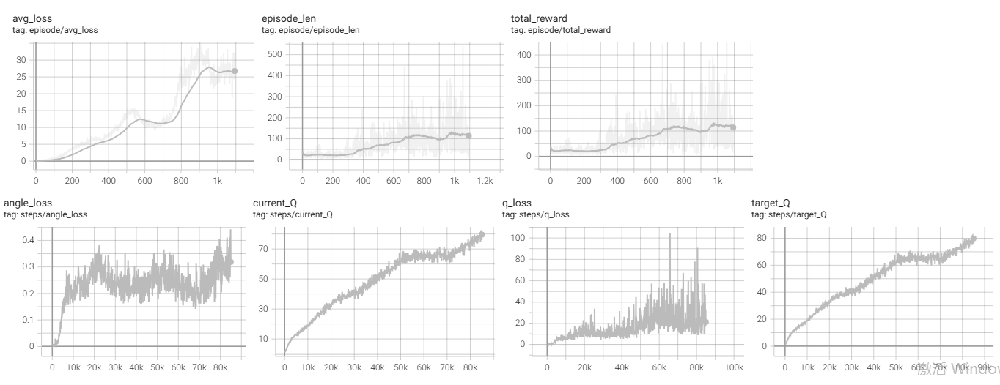

```python
import os
import random
import numpy as np
from collections import deque, namedtuple
from typing import List, Tuple, Optional
import sys

import gym
import torch
import torch.nn as nn
import torch.optim as optim
import torch.nn.functional as F
from torch.utils.tensorboard import SummaryWriter
from PIL import Image
import matplotlib.pyplot as plt
import cv2
from datetime import datetime
import signal

# 设备配置 (优先使用CUDA)
device = torch.device("cuda" if torch.cuda.is_available() else "cpu")


class FrameStack:
    """处理帧堆叠的类，将最近的4帧和对应角度堆叠作为状态"""

    def __init__(self, env, stack_size=4):
        self.env = env
        self.stack_size = stack_size
        self.frames = deque(maxlen=stack_size)
        self.angles = deque(maxlen=stack_size)  # 新增：存储角度值的队列

    def _extract_angle(self, frame):
        """
        修正版角度提取方法：
        - 完全竖直时角度为0
        - 向右倾斜为正角度（0 < θ < π/2）
        - 向左倾斜为负角度（-π/2 < θ < 0）
        """
        # 1. 颜色分割（使用您提供的HSV范围）
        hsv = cv2.cvtColor(frame, cv2.COLOR_RGB2HSV)
        lower_red = np.array([10, 120, 190])
        upper_red = np.array([20, 140, 210])
        mask = cv2.inRange(hsv, lower_red, upper_red)

        # 2. 形态学处理
        kernel = np.ones((3, 3), np.uint8)
        mask = cv2.morphologyEx(mask, cv2.MORPH_OPEN, kernel)

        # 3. 获取杆子像素点
        points = np.column_stack(np.where(mask > 0))
        if len(points) < 10:
            return 0.0

        # 4. 最小二乘直线拟合
        [vx, vy, x, y] = cv2.fitLine(points, cv2.DIST_L2, 0, 0.01, 0.01)

        # 5. 计算角度（关键修正部分）
        angle_rad = np.arctan2(vy, vx)  # 直接使用atan2

        # 将角度转换到[-π/2, π/2]范围：
        if angle_rad > np.pi / 2:
            angle_rad -= np.pi
        elif angle_rad < -np.pi / 2:
            angle_rad += np.pi

        # 确保向右为正，向左为负
        angle_rad = -angle_rad

        return float(angle_rad)

    def reset(self):
        """重置环境并初始化帧和角度堆叠"""
        obs, _ = self.env.reset()
        rendered_frame = self.env.render()

        # 初始处理
        processed_frame = self._preprocess(rendered_frame)
        angle = self._extract_angle(rendered_frame)

        # 填充堆栈
        for _ in range(self.stack_size):
            self.frames.append(processed_frame)
            self.angles.append(angle)

        # 返回堆叠的帧和角度
        return {
            'frames': self._get_stacked_frames(),
            'angles': np.array(self.angles)
        }

    def step(self, action):
        """执行动作并返回堆叠后的帧和角度"""
        obs, reward, done, truncated, info = self.env.step(action)
        rendered_frame = self.env.render()

        # 处理新帧
        processed_frame = self._preprocess(rendered_frame)
        angle = self._extract_angle(rendered_frame)

        # 更新堆栈
        self.frames.append(processed_frame)
        self.angles.append(angle)

        # 返回结果
        return {
            'frames': self._get_stacked_frames(),
            'angles': np.array(self.angles)
        }, reward, done, info

    def _preprocess(self, frame):
        """预处理图像：转换为灰度图并下采样"""
        gray = cv2.cvtColor(frame, cv2.COLOR_RGB2GRAY)
        resized = cv2.resize(gray, (84, 84))
        return resized / 255.0

    def _get_stacked_frames(self):
        """获取堆叠后的帧"""
        return np.stack(self.frames, axis=0)  # 形状为(4, 84, 84)

    def save_stacked_frames(self, output_dir: str = "frame_visualizations"):
        """
        将当前4帧和它们的叠加效果保存为一张大图片，每帧标注角度值
        图片布局：
        [帧1 (角度)] [帧2 (角度)] [帧3 (角度)] [帧4 (角度)] [叠加效果]
        """
        if len(self.frames) < self.stack_size:
            raise ValueError(f"需要{self.stack_size}帧，但只有{len(self.frames)}帧可用")

        # 创建输出目录
        os.makedirs(output_dir, exist_ok=True)
        timestamp = datetime.now().strftime("%Y%m%d_%H%M%S")
        filename = f"stacked_frames_{timestamp}.png"
        filepath = os.path.join(output_dir, filename)

        # 创建画布 (1行5列，更紧凑的布局)
        fig, axes = plt.subplots(1, 5, figsize=(25, 5))
        fig.suptitle(f"CartPole Frame Stack - {timestamp}", fontsize=14)

        # 绘制单个帧（带角度标注）
        for i in range(4):
            axes[i].imshow(self.frames[i], cmap='gray')

            # 在图片顶部中央添加角度值（白色文字黑色描边）
            angle_text = f"θ = {self.angles[i]:.2f} rad"
            axes[i].text(0.5, 0.95, angle_text,
                         ha='center', va='top',
                         transform=axes[i].transAxes,
                         color='white', fontsize=12,
                         bbox=dict(facecolor='black', alpha=0.5, pad=2))

            axes[i].set_title(f"Frame {i + 1}", pad=10)
            axes[i].axis('off')

        # 计算并绘制叠加效果 (取平均值)
        stacked = np.mean(self.frames, axis=0)
        axes[4].imshow(stacked, cmap='gray')

        # 在叠加图上显示平均角度
        avg_angle = np.mean(self.angles)
        axes[4].text(0.5, 0.95, f"Avg θ = {avg_angle:.2f} rad",
                     ha='center', va='top',
                     transform=axes[4].transAxes,
                     color='white', fontsize=12,
                     bbox=dict(facecolor='black', alpha=0.5, pad=2))

        axes[4].set_title("Stacked Frames", pad=10)
        axes[4].axis('off')

        # 调整布局并保存
        plt.tight_layout(pad=2.0)
        plt.savefig(filepath, bbox_inches='tight', dpi=120)
        plt.close()

        print(f"已保存可视化到: {filepath}")
        return filepath


# 修改Transition结构以包含角度信息
Transition = namedtuple('Transition',
                        ('state', 'angle', 'action', 'next_state', 'next_angle', 'reward', 'done'))


class ReplayBuffer:
    """支持角度信息的普通经验回放"""

    def __init__(self, capacity: int):
        self.capacity = capacity
        self.buffer = deque(maxlen=capacity)

    def push(self, state, angle, action, next_state, next_angle, reward, done):
        """存储transition（现在包含角度信息）"""
        self.buffer.append(Transition(
            state, angle, action, next_state, next_angle, reward, done
        ))

    def sample(self, batch_size: int) -> List[Transition]:
        """随机采样一批transition"""
        return random.sample(self.buffer, min(batch_size, len(self.buffer)))

    def __len__(self) -> int:
        return len(self.buffer)

    def clear(self):
        """清空缓冲区"""
        self.buffer.clear()


class CNN_DQN(nn.Module):
    """支持角度特征融合的深度Q网络"""

    def __init__(self, stack_size: int, action_dim: int):
        super(CNN_DQN, self).__init__()
        # 共享的特征提取层
        self.conv1 = nn.Conv2d(stack_size, 32, kernel_size=8, stride=4)
        self.conv2 = nn.Conv2d(32, 64, kernel_size=4, stride=2)
        self.conv3 = nn.Conv2d(64, 64, kernel_size=3, stride=1)

        # 公共特征层
        self.shared_fc = nn.Linear(64 * 7 * 7, 512)

        # 角度回归头（输出4个角度）
        self.angle_head = nn.Sequential(
            nn.Linear(512, 256),
            nn.ReLU(),
            nn.Linear(256, 4)  # 输出4个堆叠帧的角度预测
        )

        # 动作头（输入：512维CNN特征 + 4维角度特征）
        self.action_head = nn.Sequential(
            nn.Linear(512 + 4, 256),  # 注意输入维度变化
            nn.ReLU(),
            nn.Linear(256, action_dim)
        )

        self._init_weights()

    def _init_weights(self):
        for m in self.modules():
            if isinstance(m, nn.Conv2d) or isinstance(m, nn.Linear):
                nn.init.xavier_uniform_(m.weight)
                if m.bias is not None:
                    m.bias.data.zero_()

    def forward(self, x: torch.Tensor) -> tuple:
        """
        前向传播
        返回:
        - actions: 动作logits [batch, action_dim]
        - pred_angles: 预测角度 [batch, 4]
        """
        # 共享特征提取
        x = F.relu(self.conv1(x))
        x = F.relu(self.conv2(x))
        x = F.relu(self.conv3(x))
        x = x.view(x.size(0), -1)  # [batch, 64*7*7]
        features = F.relu(self.shared_fc(x))  # [batch, 512]

        # 角度预测
        pred_angles = self.angle_head(features)  # [batch, 4]

        # 动作预测（融合CNN特征和角度特征）
        fused_features = torch.cat([features, pred_angles], dim=1)  # [batch, 512+4]
        actions = self.action_head(fused_features)

        return actions, pred_angles


class DQNAgent:
    """DQN智能体，处理像素输入"""

    def __init__(self, env: gym.Env, stack_size: int = 4, buffer_capacity: int = 20000,
                 batch_size: int = 128, gamma: float = 0.99, lr: float = 1e-4,
                 tau: float = 0.005, initial_epsilon: float = 1.0,
                 final_epsilon: float = 0.05, epsilon_decay: float = 0.99):

        self.env = env
        self.stack_size = stack_size
        self.action_dim = env.action_space.n
        self.batch_size = batch_size
        self.gamma = gamma
        self.tau = tau
        self.epsilon = initial_epsilon
        self.final_epsilon = final_epsilon
        self.epsilon_decay = epsilon_decay
        self.loss_ratio = 0.3

        # 初始化网络
        self.policy_net = CNN_DQN(stack_size, self.action_dim).to(device)
        self.target_net = CNN_DQN(stack_size, self.action_dim).to(device)
        self.target_net.load_state_dict(self.policy_net.state_dict())
        self.target_net.eval()  # 目标网络不训练

        # 优化器
        self.optimizer = optim.Adam(self.policy_net.parameters(), lr=lr)

        # 经验回放
        self.memory = ReplayBuffer(buffer_capacity) # 10万个step就是11个GB

        # TensorBoard
        dt = datetime.now().strftime("%Y%m%d_%H%M%S")
        self.writer = SummaryWriter(log_dir=f"runs/raw_dqn_{dt}")
        self.steps_done = 0

    def select_action(self, pic_and_angel: dict, evaluate: bool = False) -> int:
        """根据ε-greedy策略选择动作"""
        if not evaluate and random.random() < self.epsilon:
            return random.randint(0, self.action_dim - 1)

        state = pic_and_angel['frames'] #type:np.ndarray
        #angle = pic_and_angel['angles'] #type:np.ndarray
        # 转换为torch张量并添加batch维度
        state_tensor = torch.FloatTensor(state).unsqueeze(0).to(device)

        with torch.no_grad():
            q_values,_ = self.policy_net(state_tensor)

        return q_values.argmax().item()

    def update_model(self) -> float:
        """更新策略网络"""
        if len(self.memory) < self.batch_size:
            return 0.0  # 如果经验不足，不更新

        # 从回放缓冲区采样
        transitions = self.memory.sample(self.batch_size)
        batch = Transition(*zip(*transitions))

        # 转换为张量
        state_batch = torch.FloatTensor(np.array(batch.state)).to(device)
        angle_batch = torch.FloatTensor(np.array(batch.angle)).to(device)
        action_batch = torch.LongTensor(batch.action).unsqueeze(1).to(device)
        reward_batch = torch.FloatTensor(batch.reward).to(device)
        next_state_batch = torch.FloatTensor(np.array(batch.next_state)).to(device)
        next_angle_batch = torch.FloatTensor(np.array(batch.next_angle)).to(device)
        done_batch = torch.FloatTensor(batch.done).to(device)

        # 计算当前Q值
        current_q, angle = self.policy_net(state_batch)
        current_q = current_q.gather(1, action_batch)

        # 计算目标Q值
        with torch.no_grad():
            next_q, _ = self.target_net(next_state_batch)
            next_q = next_q.max(1)[0].detach()
            target_q = reward_batch + (1 - done_batch) * self.gamma * next_q


        q_loss =  F.mse_loss(current_q.squeeze(), target_q).mean()
        angle_loss = F.mse_loss(angle, angle_batch).mean()
        loss = q_loss + self.loss_ratio * angle_loss

        self.writer.add_scalar(f"steps/current_Q", current_q.mean().item(), self.steps_done)
        self.writer.add_scalar(f"steps/target_Q", target_q.mean().item(), self.steps_done)
        self.writer.add_scalar('steps/q_loss', q_loss.item(), self.steps_done)
        self.writer.add_scalar('steps/angle_loss', angle_loss.item(), self.steps_done)

        # 反向传播
        self.optimizer.zero_grad()
        loss.backward()
        torch.nn.utils.clip_grad_norm_(self.policy_net.parameters(), 10.0)  # 新增梯度裁剪
        # 检查梯度是否存在
        for name, param in self.policy_net.named_parameters():
            if param.grad is None:
                self.writer.add_scalar(f"grad/{name}", 0, self.steps_done)
            else:
                self.writer.add_scalar(f"grad/{name}", param.grad.mean().item(), self.steps_done)
        self.optimizer.step()

        # 更新目标网络 (软更新)
        for target_param, policy_param in zip(self.target_net.parameters(),
                                              self.policy_net.parameters()):
            target_param.data.copy_(
                self.tau * policy_param.data + (1 - self.tau) * target_param.data
            )

        return loss.item()

    def decay_epsilon(self):
        """衰减探索率"""
        self.epsilon = max(self.final_epsilon,
                           self.epsilon * self.epsilon_decay)

    def save_checkpoint(self, episode: int, total_reward,checkpoint_dir: str = "checkpoints"):
        """保存模型检查点"""
        if not os.path.exists(checkpoint_dir):
            os.makedirs(checkpoint_dir)

        checkpoint_path = os.path.join(checkpoint_dir, f"dqn_episode_{episode}_{total_reward}.pth")
        torch.save({
            'episode': episode,
            'policy_state_dict': self.policy_net.state_dict(),
            'target_state_dict': self.target_net.state_dict(),
            'optimizer_state_dict': self.optimizer.state_dict(),
            'epsilon': self.epsilon,
            'steps_done': self.steps_done
        }, checkpoint_path)

        print(f"Checkpoint saved to {checkpoint_path}")

    def load_checkpoint(self, checkpoint_path: str):
        """加载模型检查点"""
        if not os.path.exists(checkpoint_path):
            raise FileNotFoundError(f"Checkpoint file {checkpoint_path} not found")

        checkpoint = torch.load(checkpoint_path)
        self.policy_net.load_state_dict(checkpoint['policy_state_dict'])
        self.target_net.load_state_dict(checkpoint['target_state_dict'])
        self.optimizer.load_state_dict(checkpoint['optimizer_state_dict'])
        self.epsilon = checkpoint['epsilon']
        self.steps_done = checkpoint['steps_done']

        print(f"Checkpoint loaded from {checkpoint_path}, "
              f"resuming from episode {checkpoint['episode']}")

        return checkpoint['episode']

    def setup_signal_handlers(self):
        """设置信号处理函数"""
        signal.signal(signal.SIGINT, self.handle_interrupt)  # Ctrl+C
        signal.signal(signal.SIGTERM, self.handle_interrupt)  # kill命令

    def handle_interrupt(self, signum, frame):
        """中断处理函数"""
        print(f"\n捕获到中断信号 {signum}, 正在保存数据...")
        #torch.save(self.memory, "./raw_dqn_memory.pth")
        sys.exit(0)

    def train(self, num_episodes: int, checkpoint_interval: int = 500,
              checkpoint_dir: str = "checkpoints", resume_checkpoint: Optional[str] = None):
        """训练循环"""
        start_episode = 0

        # 如果提供了检查点，从中恢复
        if resume_checkpoint is not None:
            start_episode = self.load_checkpoint(resume_checkpoint) + 1

        '''if os.path.exists("./raw_dqn_memory.pth"):
            self.memory = torch.load("./raw_dqn_memory.pth", weights_only=False)
            print("load memory from disk!")'''

        # 使用FrameStack包装环境
        frameStack = FrameStack(self.env, self.stack_size)
        best_reward = -1

        for episode in range(start_episode, num_episodes):
            state = frameStack.reset()
            total_reward = 0
            episode_loss = 0
            done = False
            episode_len = 0
            while not done:
                # 选择并执行动作
                action = self.select_action(state)
                next_state, reward, done, _ = frameStack.step(action)

                # 存储transition
                self.memory.push(state['frames'], state['angles'], action, next_state['frames'], next_state['angles'], reward, done)

                # 更新模型
                loss = self.update_model()
                episode_loss += loss if loss else 0
                episode_len += 1


                state = next_state
                total_reward += reward
                self.steps_done += 1
                if self.steps_done % 997 == 0:
                    frameStack.save_stacked_frames()

            # 衰减探索率
            self.decay_epsilon()
            if best_reward < 0 or best_reward < total_reward:
                best_reward = total_reward
                self.save_checkpoint(episode, total_reward, checkpoint_dir)
                print(f"save best reward checkpoint{best_reward}")

            # 记录到TensorBoard
            self.writer.add_scalar('episode/total_reward', total_reward, episode)
            self.writer.add_scalar('episode/avg_loss', episode_loss/episode_len, episode)
            self.writer.add_scalar('episode/episode_len', episode_len, episode)


            # 打印训练信息
            print(f"Episode {episode + 1}/{num_episodes}, "
                  f"Reward: {total_reward:.1f}, "
                  f"Loss: {episode_loss:.4f}, "
                  f"Epsilon: {self.epsilon:.4f}, "
                  f"Steps: {self.steps_done}")

            # 定期保存检查点
            if (episode + 1) % checkpoint_interval == 0:
                self.save_checkpoint(episode, total_reward, checkpoint_dir)


        self.writer.close()

    def evaluate(self, num_episodes: int = 10, checkpoint_path: Optional[str] = None):
        """评估模型性能"""
        if checkpoint_path is not None:
            self.load_checkpoint(checkpoint_path)

        # 使用FrameStack包装环境，并启用渲染
        frameStack = FrameStack(gym.make('CartPole-v1', render_mode='rgb_array'), self.stack_size)
        show = gym.make('CartPole-v1', render_mode='human')

        total_rewards = []

        for episode in range(num_episodes):
            state = frameStack.reset()
            show.reset()
            total_reward = 0
            done = False

            while not done:
                # 选择动作 (评估时不使用探索)
                action = self.select_action(state, evaluate=True)
                show.step(action)
                state, reward, done, _ = frameStack.step(action)
                total_reward += reward

            total_rewards.append(total_reward)
            print(f"Evaluation Episode {episode + 1}, Reward: {total_reward:.1f}")

        avg_reward = np.mean(total_rewards)
        print(f"Average reward over {num_episodes} episodes: {avg_reward:.1f}")
        return avg_reward


if __name__ == "__main__":


    # 创建环境 (训练时不渲染)
    env = gym.make('CartPole-v1', render_mode="rgb_array")

    # 初始化智能体
    agent = DQNAgent(env)
    agent.setup_signal_handlers()

    agent.train(10000, 20,     "./checkpoints")
    #avg_reward = agent.evaluate(10,"./checkpoints/dqn_episode_9367_378.0.pth")


```

###### 改进二：提取角度信息只用于对reward整形，保持DQN网络简单

我怀疑角度信息自动提取，让DQN结构变复杂了，反而还没有一开始的效果好，所以不改变DQN的架构，只用cv方法提取角度信息，用于矫正reward

可以看到total_reward(一个回合的reward和)整体上涨，最大值一直爬升，最高出现过500+。

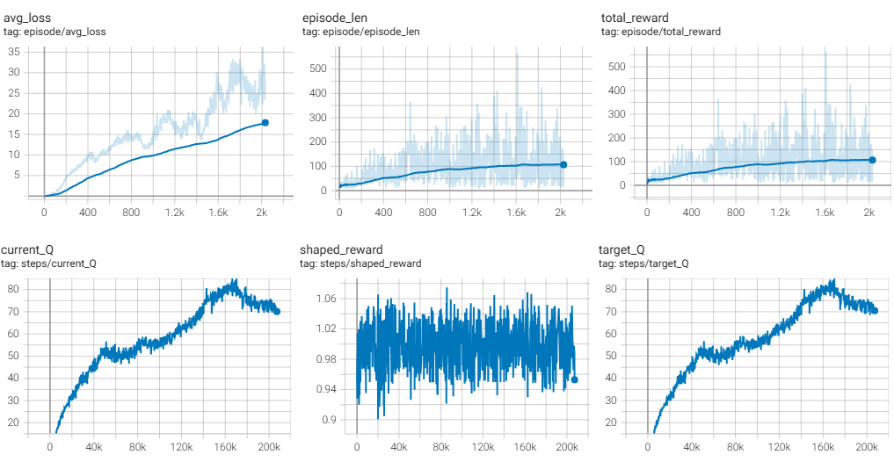

```python
import os
import random
import numpy as np
from collections import deque, namedtuple
from typing import List, Tuple, Optional
import sys

import gym
import torch
import torch.nn as nn
import torch.optim as optim
import torch.nn.functional as F
from torch.utils.tensorboard import SummaryWriter
from PIL import Image
import matplotlib.pyplot as plt
import cv2
from datetime import datetime
import signal

# 设备配置 (优先使用CUDA)
device = torch.device("cuda" if torch.cuda.is_available() else "cpu")

class FrameStack:
    """处理帧堆叠的类，将最近的4帧和对应角度堆叠作为状态"""

    def __init__(self, env, stack_size=4):
        self.env = env
        self.stack_size = stack_size
        self.frames = deque(maxlen=stack_size)
        self.angles = deque(maxlen=stack_size)  # 新增：存储角度值的队列

    def _extract_angle(self, frame):
        """
        修正版角度提取方法：
        - 完全竖直时角度为0
        - 向右倾斜为正角度（0 < θ < π/2）
        - 向左倾斜为负角度（-π/2 < θ < 0）
        """
        # 1. 颜色分割（使用您提供的HSV范围）
        hsv = cv2.cvtColor(frame, cv2.COLOR_RGB2HSV)
        lower_red = np.array([10, 120, 190])
        upper_red = np.array([20, 140, 210])
        mask = cv2.inRange(hsv, lower_red, upper_red)

        # 2. 形态学处理
        kernel = np.ones((3, 3), np.uint8)
        mask = cv2.morphologyEx(mask, cv2.MORPH_OPEN, kernel)

        # 3. 获取杆子像素点
        points = np.column_stack(np.where(mask > 0))
        if len(points) < 10:
            return 0.0

        # 4. 最小二乘直线拟合
        [vx, vy, x, y] = cv2.fitLine(points, cv2.DIST_L2, 0, 0.01, 0.01)

        # 5. 计算角度（关键修正部分）
        angle_rad = np.arctan2(vy, vx)  # 直接使用atan2

        # 将角度转换到[-π/2, π/2]范围：
        if angle_rad > np.pi / 2:
            angle_rad -= np.pi
        elif angle_rad < -np.pi / 2:
            angle_rad += np.pi

        # 确保向右为正，向左为负
        angle_rad = -angle_rad

        return float(angle_rad)

    def reset(self):
        """重置环境并初始化帧和角度堆叠"""
        obs, _ = self.env.reset()
        rendered_frame = self.env.render()

        # 初始处理
        processed_frame = self._preprocess(rendered_frame)
        angle = self._extract_angle(rendered_frame)

        # 填充堆栈
        for _ in range(self.stack_size):
            self.frames.append(processed_frame)
            self.angles.append(angle)

        # 返回堆叠的帧和角度
        return {
            'frames': self._get_stacked_frames(),
            'angles': np.array(self.angles)
        }

    def step(self, action):
        """执行动作并返回堆叠后的帧和角度"""
        obs, reward, done, truncated, info = self.env.step(action)
        rendered_frame = self.env.render()

        # 处理新帧
        processed_frame = self._preprocess(rendered_frame)
        angle = self._extract_angle(rendered_frame)

        # 更新堆栈
        self.frames.append(processed_frame)
        self.angles.append(angle)

        # 返回结果
        return {
            'frames': self._get_stacked_frames(),
            'angles': np.array(self.angles)
        }, reward, done, info

    def _preprocess(self, frame):
        """预处理图像：转换为灰度图并下采样"""
        gray = cv2.cvtColor(frame, cv2.COLOR_RGB2GRAY)
        resized = cv2.resize(gray, (84, 84))
        return resized / 255.0

    def _get_stacked_frames(self):
        """获取堆叠后的帧"""
        return np.stack(self.frames, axis=0)  # 形状为(4, 84, 84)

    def save_stacked_frames(self, output_dir: str = "frame_visualizations"):
        """
        将当前4帧和它们的叠加效果保存为一张大图片，每帧标注角度值
        图片布局：
        [帧1 (角度)] [帧2 (角度)] [帧3 (角度)] [帧4 (角度)] [叠加效果]
        """
        if len(self.frames) < self.stack_size:
            raise ValueError(f"需要{self.stack_size}帧，但只有{len(self.frames)}帧可用")

        # 创建输出目录
        os.makedirs(output_dir, exist_ok=True)
        timestamp = datetime.now().strftime("%Y%m%d_%H%M%S")
        filename = f"stacked_frames_{timestamp}.png"
        filepath = os.path.join(output_dir, filename)

        # 创建画布 (1行5列，更紧凑的布局)
        fig, axes = plt.subplots(1, 5, figsize=(25, 5))
        fig.suptitle(f"CartPole Frame Stack - {timestamp}", fontsize=14)

        # 绘制单个帧（带角度标注）
        for i in range(4):
            axes[i].imshow(self.frames[i], cmap='gray')

            # 在图片顶部中央添加角度值（白色文字黑色描边）
            angle_text = f"θ = {self.angles[i]:.2f} rad"
            axes[i].text(0.5, 0.95, angle_text,
                         ha='center', va='top',
                         transform=axes[i].transAxes,
                         color='white', fontsize=12,
                         bbox=dict(facecolor='black', alpha=0.5, pad=2))

            axes[i].set_title(f"Frame {i + 1}", pad=10)
            axes[i].axis('off')

        # 计算并绘制叠加效果 (取平均值)
        stacked = np.mean(self.frames, axis=0)
        axes[4].imshow(stacked, cmap='gray')

        # 在叠加图上显示平均角度
        avg_angle = np.mean(self.angles)
        axes[4].text(0.5, 0.95, f"Avg θ = {avg_angle:.2f} rad",
                     ha='center', va='top',
                     transform=axes[4].transAxes,
                     color='white', fontsize=12,
                     bbox=dict(facecolor='black', alpha=0.5, pad=2))

        axes[4].set_title("Stacked Frames", pad=10)
        axes[4].axis('off')

        # 调整布局并保存
        plt.tight_layout(pad=2.0)
        plt.savefig(filepath, bbox_inches='tight', dpi=120)
        plt.close()

        print(f"已保存可视化到: {filepath}")
        return filepath

# 定义经验回放中的transition
Transition = namedtuple('Transition', ('state', 'action', 'next_state', 'reward', 'done'))

class ReplayBuffer:
    """支持角度信息的普通经验回放"""

    def __init__(self, capacity: int):
        self.capacity = capacity
        self.buffer = deque(maxlen=capacity)

    def push(self, state,  action, next_state,  reward, done):
        """存储transition（现在包含角度信息）"""
        self.buffer.append(Transition(
            state,  action, next_state,  reward, done
        ))

    def sample(self, batch_size: int) -> List[Transition]:
        """随机采样一批transition"""
        return random.sample(self.buffer, min(batch_size, len(self.buffer)))

    def __len__(self) -> int:
        return len(self.buffer)

    def clear(self):
        """清空缓冲区"""
        self.buffer.clear()


class CNN_DQN(nn.Module):
    """处理像素输入的深度Q网络"""

    def __init__(self, stack_size: int, action_dim: int):
        super(CNN_DQN, self).__init__()
        self.conv1 = nn.Conv2d(stack_size, 32, kernel_size=8, stride=4)
        self.conv2 = nn.Conv2d(32, 64, kernel_size=4, stride=2)
        self.conv3 = nn.Conv2d(64, 64, kernel_size=3, stride=1)
        self.fc1 = nn.Linear(64 * 7 * 7, 512)
        self.fc2 = nn.Linear(512, action_dim)

        # 初始化权重
        for m in self.modules():
            if isinstance(m, nn.Conv2d) or isinstance(m, nn.Linear):
                nn.init.xavier_uniform_(m.weight)
                if m.bias is not None:
                    m.bias.data.zero_()

    def forward(self, x: torch.Tensor) -> torch.Tensor:
        """前向传播"""
        x = F.relu(self.conv1(x))
        x = F.relu(self.conv2(x))
        x = F.relu(self.conv3(x))
        x = x.view(x.size(0), -1)  # 展平
        x = F.relu(self.fc1(x))
        return self.fc2(x)


class DQNAgent:
    """DQN智能体，处理像素输入"""

    def __init__(self, env: gym.Env, stack_size: int = 4, buffer_capacity: int = 20000,
                 batch_size: int = 128, gamma: float = 0.99, lr: float = 1e-4,
                 tau: float = 0.005, initial_epsilon: float = 1.0,
                 final_epsilon: float = 0.05, epsilon_decay: float = 0.99):

        self.env = env
        self.stack_size = stack_size
        self.action_dim = env.action_space.n
        self.batch_size = batch_size
        self.gamma = gamma
        self.tau = tau
        self.epsilon = initial_epsilon
        self.final_epsilon = final_epsilon
        self.epsilon_decay = epsilon_decay

        # 初始化网络
        self.policy_net = CNN_DQN(stack_size, self.action_dim).to(device)
        self.target_net = CNN_DQN(stack_size, self.action_dim).to(device)
        self.target_net.load_state_dict(self.policy_net.state_dict())
        self.target_net.eval()  # 目标网络不训练

        # 优化器
        self.optimizer = optim.Adam(self.policy_net.parameters(), lr=lr)

        # 经验回放
        self.memory = ReplayBuffer(buffer_capacity) # 10万个step就是11个GB

        # TensorBoard
        dt = datetime.now().strftime("%Y%m%d_%H%M%S")
        self.writer = SummaryWriter(log_dir=f"runs/raw_dqn_{dt}")
        self.steps_done = 0

    def select_action(self, state: np.ndarray, evaluate: bool = False) -> int:
        """根据ε-greedy策略选择动作"""
        if not evaluate and random.random() < self.epsilon:
            return random.randint(0, self.action_dim - 1)

        # 转换为torch张量并添加batch维度
        state_tensor = torch.FloatTensor(state).unsqueeze(0).to(device)

        with torch.no_grad():
            q_values = self.policy_net(state_tensor)

        return q_values.argmax().item()

    def update_model(self) -> float:
        """更新策略网络"""
        if len(self.memory) < self.batch_size:
            return 0.0  # 如果经验不足，不更新

        # 从回放缓冲区采样
        transitions = self.memory.sample(self.batch_size)
        batch = Transition(*zip(*transitions))

        # 转换为张量
        state_batch = torch.FloatTensor(np.array(batch.state)).to(device)
        action_batch = torch.LongTensor(batch.action).unsqueeze(1).to(device)
        reward_batch = torch.FloatTensor(batch.reward).to(device)
        next_state_batch = torch.FloatTensor(np.array(batch.next_state)).to(device)
        done_batch = torch.FloatTensor(batch.done).to(device)

        # 计算当前Q值
        current_q = self.policy_net(state_batch).gather(1, action_batch)
        self.writer.add_scalar(f"steps/current_Q", current_q.mean().item(), self.steps_done)
        # 计算目标Q值
        with torch.no_grad():
            next_q = self.target_net(next_state_batch).max(1)[0].detach()
            target_q = reward_batch + (1 - done_batch) * self.gamma * next_q
        self.writer.add_scalar(f"steps/target_Q", target_q.mean().item(), self.steps_done)

        loss = F.mse_loss(current_q.squeeze(), target_q)

        # 反向传播
        self.optimizer.zero_grad()
        loss.backward()
        torch.nn.utils.clip_grad_norm_(self.policy_net.parameters(), 10.0)  # 新增梯度裁剪
        # 检查梯度是否存在
        for name, param in self.policy_net.named_parameters():
            if param.grad is None:
                self.writer.add_scalar(f"grad/{name}", 0, self.steps_done)
            else:
                self.writer.add_scalar(f"grad/{name}", param.grad.mean().item(), self.steps_done)
        self.optimizer.step()

        # 更新目标网络 (软更新)
        for target_param, policy_param in zip(self.target_net.parameters(),
                                              self.policy_net.parameters()):
            target_param.data.copy_(
                self.tau * policy_param.data + (1 - self.tau) * target_param.data
            )

        return loss.item()

    def decay_epsilon(self):
        """衰减探索率"""
        self.epsilon = max(self.final_epsilon,
                           self.epsilon * self.epsilon_decay)

    def save_checkpoint(self, episode: int, total_reward,checkpoint_dir: str = "checkpoints"):
        """保存模型检查点"""
        if not os.path.exists(checkpoint_dir):
            os.makedirs(checkpoint_dir)

        checkpoint_path = os.path.join(checkpoint_dir, f"dqn_episode_{episode}_{total_reward}.pth")
        torch.save({
            'episode': episode,
            'policy_state_dict': self.policy_net.state_dict(),
            'target_state_dict': self.target_net.state_dict(),
            'optimizer_state_dict': self.optimizer.state_dict(),
            'epsilon': self.epsilon,
            'steps_done': self.steps_done
        }, checkpoint_path)

        print(f"Checkpoint saved to {checkpoint_path}")

    def load_checkpoint(self, checkpoint_path: str):
        """加载模型检查点"""
        if not os.path.exists(checkpoint_path):
            raise FileNotFoundError(f"Checkpoint file {checkpoint_path} not found")

        checkpoint = torch.load(checkpoint_path)
        self.policy_net.load_state_dict(checkpoint['policy_state_dict'])
        self.target_net.load_state_dict(checkpoint['target_state_dict'])
        self.optimizer.load_state_dict(checkpoint['optimizer_state_dict'])
        self.epsilon = checkpoint['epsilon']
        self.steps_done = checkpoint['steps_done']

        print(f"Checkpoint loaded from {checkpoint_path}, "
              f"resuming from episode {checkpoint['episode']}")

        return checkpoint['episode']

    def setup_signal_handlers(self):
        """设置信号处理函数"""
        signal.signal(signal.SIGINT, self.handle_interrupt)  # Ctrl+C
        signal.signal(signal.SIGTERM, self.handle_interrupt)  # kill命令

    def handle_interrupt(self, signum, frame):
        """中断处理函数"""
        print(f"\n捕获到中断信号 {signum}, 正在保存数据...")
        #torch.save(self.memory, "./raw_dqn_memory.pth")
        sys.exit(0)
    def shape_reward(self, raw_reward, prev_angle, curr_angle):
        """
        基于角度信息的奖励修正函数
        参数:
            raw_reward: 环境原始奖励
            prev_angle: 上一帧角度（弧度）
            curr_angle: 当前帧角度（弧度）

        返回:
            shaped_reward: 修正后的奖励
        """

        shaped_reward = raw_reward

        # 仅当杆子未倒下时进行奖励修正
        if raw_reward > 0:
            # 1. 角度差奖励（鼓励减小角度）
            angle_diff = abs(curr_angle) - abs(prev_angle)
            angle_reward = -angle_diff * 2.0  # 系数0.5可配置

            # 2. 中心位置惩罚（鼓励靠近竖直位置）
            center_penalty = 0 # abs(curr_angle) * 1.0  # 系数0.1可配置

            # 综合奖励
            shaped_reward += angle_reward - center_penalty

        # 失败惩罚增强
        else:
            failure_penalty = abs(curr_angle) * 0.3  # 系数0.3可配置
            shaped_reward -= failure_penalty
        # 奖励裁剪（防止极端值）
        shaped_reward = np.clip(shaped_reward, 0, 2)

        return shaped_reward

    def train(self, num_episodes: int, checkpoint_interval: int = 500,
              checkpoint_dir: str = "checkpoints", resume_checkpoint: Optional[str] = None):
        """训练循环"""
        start_episode = 0

        # 如果提供了检查点，从中恢复
        if resume_checkpoint is not None:
            start_episode = self.load_checkpoint(resume_checkpoint) + 1


        # 使用FrameStack包装环境
        frameStack = FrameStack(self.env, self.stack_size)
        best_reward = -1

        for episode in range(start_episode, num_episodes):
            state = frameStack.reset()
            total_reward = 0
            episode_loss = 0
            done = False
            episode_len = 0
            while not done:
                # 选择并执行动作
                action = self.select_action(state['frames'])
                next_state, reward, done, _ = frameStack.step(action)
                # 修正reward
                prev_angle = next_state['angles'][-2]
                curr_angle = next_state['angles'][-1]
                shaped_reward = self.shape_reward(reward, prev_angle, curr_angle)
                self.writer.add_scalar('steps/shaped_reward', shaped_reward, self.steps_done)

                # 存储transition
                self.memory.push(state['frames'], action, next_state['frames'], shaped_reward, done)

                # 更新模型
                loss = self.update_model()
                episode_loss += loss if loss else 0
                episode_len += 1


                state = next_state
                total_reward += reward
                self.steps_done += 1
                if self.steps_done % 997 == 0:
                    frameStack.save_stacked_frames()

            # 衰减探索率
            self.decay_epsilon()
            if best_reward < 0 or best_reward < total_reward:
                best_reward = total_reward
                self.save_checkpoint(episode, total_reward, checkpoint_dir)
                print(f"save best reward checkpoint{best_reward}")

            # 记录到TensorBoard
            self.writer.add_scalar('episode/total_reward', total_reward, episode)
            self.writer.add_scalar('episode/avg_loss', episode_loss/episode_len, episode)
            self.writer.add_scalar('episode/episode_len', episode_len, episode)


            # 打印训练信息
            print(f"Episode {episode + 1}/{num_episodes}, "
                  f"Reward: {total_reward:.1f}, "
                  f"Loss: {episode_loss:.4f}, "
                  f"Epsilon: {self.epsilon:.4f}, "
                  f"Steps: {self.steps_done}")

            # 定期保存检查点
            if (episode + 1) % checkpoint_interval == 0:
                self.save_checkpoint(episode, total_reward, checkpoint_dir)


        self.writer.close()

    def evaluate(self, num_episodes: int = 10, checkpoint_path: Optional[str] = None):
        """评估模型性能"""
        if checkpoint_path is not None:
            self.load_checkpoint(checkpoint_path)

        # 使用FrameStack包装环境，并启用渲染
        frameStack = FrameStack(gym.make('CartPole-v1', render_mode='rgb_array'), self.stack_size)
        show = gym.make('CartPole-v1', render_mode='human')

        total_rewards = []

        for episode in range(num_episodes):
            state = frameStack.reset()
            show.reset()
            total_reward = 0
            done = False

            while not done:
                # 选择动作 (评估时不使用探索)
                action = self.select_action(state['frames'], evaluate=True)
                show.step(action)
                state, reward, done, _ = frameStack.step(action)
                total_reward += reward

            total_rewards.append(total_reward)
            print(f"Evaluation Episode {episode + 1}, Reward: {total_reward:.1f}")

        avg_reward = np.mean(total_rewards)
        print(f"Average reward over {num_episodes} episodes: {avg_reward:.1f}")
        return avg_reward

if __name__ == "__main__":


    # 创建环境 (训练时不渲染)
    env = gym.make('CartPole-v1', render_mode="rgb_array")

    # 初始化智能体
    agent = DQNAgent(env)
    agent.setup_signal_handlers()

    agent.train(10000, 20,     "./checkpoints")
    #agent.evaluate(10,"./checkpoints/dqn_episode_7439_239.0.pth")

```

###### 改进三：使用注意力机制处理堆叠的帧

效果相比前面方案还差一点。evaluating的平均回合奖励和（total_reward）为69.

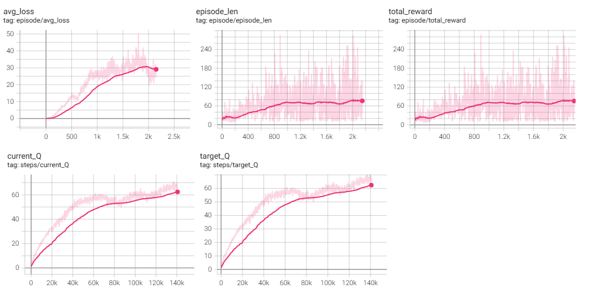

代码如下：

```python
import os
import random
import numpy as np
from collections import deque, namedtuple
from typing import List, Tuple, Optional
import sys
import math
import gym
import torch
import torch.nn as nn
import torch.optim as optim
import torch.nn.functional as F
from torch.utils.tensorboard import SummaryWriter
from PIL import Image
import matplotlib.pyplot as plt
import cv2
from datetime import datetime
import signal

# 设备配置 (优先使用CUDA)
device = torch.device("cuda" if torch.cuda.is_available() else "cpu")


class FrameStack:
    """处理帧堆叠的类，将最近的4帧堆叠在一起作为状态"""

    def __init__(self, env, stack_size=4):
        self.env = env
        self.stack_size = stack_size
        self.frames = deque(maxlen=stack_size)

    def reset(self):
        """重置环境并初始化帧堆叠"""
        self.env.reset()
        obs = self.env.render()
        # 预处理图像：转换为灰度图并下采样
        processed_obs = self._preprocess(obs)
        for _ in range(self.stack_size):
            self.frames.append(processed_obs)
        return self._get_stacked_frames()

    def step(self, action):
        """执行动作并返回堆叠后的帧"""
        _, reward, done, info, _ = self.env.step(action)
        obs = self.env.render()
        processed_obs = self._preprocess(obs)
        self.frames.append(processed_obs)
        return self._get_stacked_frames(), reward, done, info

        # 修改预处理，突出杆的角度变化

    def _preprocess(self, frame):
        gray = cv2.cvtColor(frame, cv2.COLOR_RGB2GRAY)

        resized = cv2.resize(gray, (84, 84))
        return resized / 255.0

    def _get_stacked_frames(self):
        """获取堆叠后的帧"""
        return np.stack(self.frames, axis=0)  # 形状为(4, 84, 84)

    def save_stacked_frames(self, output_dir: str = "frame_visualizations"):
        """
        将当前4帧和它们的叠加效果保存为一张大图片
        图片布局：
        [帧1] [帧2] [帧3] [帧4] [叠加效果]
        """
        if len(self.frames) < self.stack_size:
            raise ValueError(f"需要{self.stack_size}帧，但只有{len(self.frames)}帧可用")

        # 创建输出目录
        os.makedirs(output_dir, exist_ok=True)

        # 生成带时间戳的文件名
        timestamp = datetime.now().strftime("%Y%m%d_%H%M%S")
        filename = f"stacked_frames_{timestamp}.png"
        filepath = os.path.join(output_dir, filename)

        # 创建画布 (1行5列)
        fig, axes = plt.subplots(1, 5, figsize=(20, 4))
        fig.suptitle(f"Frame Stack Visualization - {timestamp}")

        # 绘制单个帧
        for i in range(4):
            axes[i].imshow(self.frames[i], cmap='gray')
            axes[i].set_title(f"Frame {i + 1}")
            axes[i].axis('off')

        # 计算并绘制叠加效果 (取平均值)
        stacked = np.mean(self.frames, axis=0)
        axes[4].imshow(stacked, cmap='gray')
        axes[4].set_title("Stacked (mean)")
        axes[4].axis('off')

        # 调整布局并保存
        plt.tight_layout()
        plt.savefig(filepath, bbox_inches='tight', dpi=150)
        plt.close()

        print(f"已保存帧可视化到: {filepath}")
        return filepath


# 定义经验回放中的transition
Transition = namedtuple('Transition', ('state', 'action', 'next_state', 'reward', 'done'))


class ReplayBuffer:
    """支持角度信息的普通经验回放"""

    def __init__(self, capacity: int):
        self.capacity = capacity
        self.buffer = deque(maxlen=capacity)

    def push(self, state, action, next_state, reward, done):
        """存储transition（现在包含角度信息）"""
        self.buffer.append(Transition(
            state, action, next_state, reward, done
        ))

    def sample(self, batch_size: int) -> List[Transition]:
        """随机采样一批transition"""
        return random.sample(self.buffer, min(batch_size, len(self.buffer)))

    def __len__(self) -> int:
        return len(self.buffer)

    def clear(self):
        """清空缓冲区"""
        self.buffer.clear()


class CNN_DQN(nn.Module):
    def __init__(self, n_frames=4, n_actions=2, h=84, w=84, n_heads=8, embed_dim=512):
        super(CNN_DQN, self).__init__()

        # 单帧的CNN特征提取器 (输入1通道)
        self.cnn = nn.Sequential(
            nn.Conv2d(1, 32, kernel_size=8, stride=4),
            nn.ReLU(),
            nn.Conv2d(32, 64, kernel_size=4, stride=2),
            nn.ReLU(),
            nn.Conv2d(64, 64, kernel_size=3, stride=1),
            nn.ReLU(),
            nn.Flatten(),  # 输出形状: (batch, cnn_out_dim)
        )

        # 计算单帧CNN输出的维度
        with torch.no_grad():
            dummy_input = torch.zeros(1, 1, h, w)
            self.cnn_out_dim = self.cnn(dummy_input).shape[1]

        # 将单帧特征映射到embedding空间
        self.frame_embed = nn.Linear(self.cnn_out_dim, embed_dim)

        # 固定正弦位置编码 (不学习)
        self.register_buffer(
            'pos_embed',
            self._init_sinusoidal_pos_embed(n_frames, embed_dim)
        )

        # 多头注意力层
        self.self_attn = nn.MultiheadAttention(embed_dim, n_heads, batch_first=True)

        # 输出层
        self.fc = nn.Sequential(
            nn.Linear(embed_dim, 256),
            nn.ReLU(),
            nn.Linear(256, n_actions),
        )

    def _init_sinusoidal_pos_embed(self, n_frames, embed_dim):
        """生成不可训练的正弦位置编码"""
        position = torch.arange(n_frames).unsqueeze(1)
        div_term = torch.exp(torch.arange(0, embed_dim, 2) * (-math.log(10000.0) / embed_dim))
        pos_embed = torch.zeros(1, n_frames, embed_dim)
        pos_embed[0, :, 0::2] = torch.sin(position * div_term)
        pos_embed[0, :, 1::2] = torch.cos(position * div_term)
        return pos_embed  # 形状: (1, n_frames, embed_dim)

    def forward(self, x):
        # 输入形状: (batch_size, n_frames, h, w) -> 如 (32, 4, 84, 84)
        batch_size, n_frames, h, w = x.shape

        # 独立处理每一帧
        x = x.view(batch_size * n_frames, 1, h, w)  # 合并batch和帧维度: (batch*n_frames, 1, h, w)
        cnn_features = self.cnn(x)  # (batch*n_frames, cnn_out_dim)
        frame_embeddings = self.frame_embed(cnn_features)  # (batch*n_frames, embed_dim)

        # 恢复帧维度
        frame_embeddings = frame_embeddings.view(batch_size, n_frames, -1)  # (batch, n_frames, embed_dim)

        # 添加固定位置编码 (不参与梯度计算)
        frame_embeddings = frame_embeddings + self.pos_embed

        # 自注意力计算 (batch, n_frames, embed_dim)
        attn_output, _ = self.self_attn(frame_embeddings, frame_embeddings, frame_embeddings)

        # 取最后一帧的输出 (或做平均池化)
        last_frame = attn_output[:, -1, :]  # (batch, embed_dim)

        # 输出动作logits
        logits = self.fc(last_frame)  # (batch, n_actions)

        # 若需要概率则用softmax (DQN通常直接输出Q值)


        return logits


class DQNAgent:
    """DQN智能体，处理像素输入"""

    def __init__(self, env: gym.Env, stack_size: int = 4, buffer_capacity: int = 20000,
                 batch_size: int = 128, gamma: float = 0.99, lr: float = 1e-4,
                 tau: float = 0.005, initial_epsilon: float = 1.0,
                 final_epsilon: float = 0.05, epsilon_decay: float = 0.99):

        self.env = env
        self.stack_size = stack_size
        self.action_dim = env.action_space.n
        self.batch_size = batch_size
        self.gamma = gamma
        self.tau = tau
        self.epsilon = initial_epsilon
        self.final_epsilon = final_epsilon
        self.epsilon_decay = epsilon_decay

        # 初始化网络
        self.policy_net = CNN_DQN(stack_size, self.action_dim).to(device)
        self.target_net = CNN_DQN(stack_size, self.action_dim).to(device)
        self.target_net.load_state_dict(self.policy_net.state_dict())
        self.target_net.eval()  # 目标网络不训练

        # 优化器
        self.optimizer = optim.Adam(self.policy_net.parameters(), lr=lr)

        # 经验回放
        self.memory = ReplayBuffer(buffer_capacity)  # 10万个step就是11个GB

        # TensorBoard
        dt = datetime.now().strftime("%Y%m%d_%H%M%S")
        self.writer = SummaryWriter(log_dir=f"runs/raw_dqn_{dt}")
        self.steps_done = 0

    def select_action(self, state: np.ndarray, evaluate: bool = False) -> int:
        """根据ε-greedy策略选择动作"""
        if not evaluate and random.random() < self.epsilon:
            return random.randint(0, self.action_dim - 1)

        # 转换为torch张量并添加batch维度
        state_tensor = torch.FloatTensor(state).unsqueeze(0).to(device)

        with torch.no_grad():
            q_values = self.policy_net(state_tensor)

        return q_values.argmax().item()

    def update_model(self) -> float:
        """更新策略网络"""
        if len(self.memory) < self.batch_size:
            return 0.0  # 如果经验不足，不更新

        # 从回放缓冲区采样
        transitions = self.memory.sample(self.batch_size)
        batch = Transition(*zip(*transitions))

        # 转换为张量
        state_batch = torch.FloatTensor(np.array(batch.state)).to(device)
        action_batch = torch.LongTensor(batch.action).unsqueeze(1).to(device)
        reward_batch = torch.FloatTensor(batch.reward).to(device)
        next_state_batch = torch.FloatTensor(np.array(batch.next_state)).to(device)
        done_batch = torch.FloatTensor(batch.done).to(device)

        # 计算当前Q值
        current_q = self.policy_net(state_batch).gather(1, action_batch)
        self.writer.add_scalar(f"steps/current_Q", current_q.mean().item(), self.steps_done)
        # 计算目标Q值
        with torch.no_grad():
            next_q = self.target_net(next_state_batch).max(1)[0].detach()
            target_q = reward_batch + (1 - done_batch) * self.gamma * next_q
        self.writer.add_scalar(f"steps/target_Q", target_q.mean().item(), self.steps_done)

        loss = F.mse_loss(current_q.squeeze(), target_q)

        # 反向传播
        self.optimizer.zero_grad()
        loss.backward()
        torch.nn.utils.clip_grad_norm_(self.policy_net.parameters(), 10.0)  # 新增梯度裁剪
        # 检查梯度是否存在
        for name, param in self.policy_net.named_parameters():
            if param.grad is None:
                self.writer.add_scalar(f"grad/{name}", 0, self.steps_done)
            else:
                self.writer.add_scalar(f"grad/{name}", param.grad.mean().item(), self.steps_done)
        self.optimizer.step()

        # 更新目标网络 (软更新)
        for target_param, policy_param in zip(self.target_net.parameters(),
                                              self.policy_net.parameters()):
            target_param.data.copy_(
                self.tau * policy_param.data + (1 - self.tau) * target_param.data
            )

        return loss.item()

    def decay_epsilon(self):
        """衰减探索率"""
        self.epsilon = max(self.final_epsilon,
                           self.epsilon * self.epsilon_decay)

    def save_checkpoint(self, episode: int, total_reward, checkpoint_dir: str = "checkpoints"):
        """保存模型检查点"""
        if not os.path.exists(checkpoint_dir):
            os.makedirs(checkpoint_dir)

        checkpoint_path = os.path.join(checkpoint_dir, f"dqn_episode_{episode}_{total_reward}.pth")
        torch.save({
            'episode': episode,
            'policy_state_dict': self.policy_net.state_dict(),
            'target_state_dict': self.target_net.state_dict(),
            'optimizer_state_dict': self.optimizer.state_dict(),
            'epsilon': self.epsilon,
            'steps_done': self.steps_done
        }, checkpoint_path)

        print(f"Checkpoint saved to {checkpoint_path}")

    def load_checkpoint(self, checkpoint_path: str):
        """加载模型检查点"""
        if not os.path.exists(checkpoint_path):
            raise FileNotFoundError(f"Checkpoint file {checkpoint_path} not found")

        checkpoint = torch.load(checkpoint_path)
        self.policy_net.load_state_dict(checkpoint['policy_state_dict'])
        self.target_net.load_state_dict(checkpoint['target_state_dict'])
        self.optimizer.load_state_dict(checkpoint['optimizer_state_dict'])
        self.epsilon = checkpoint['epsilon']
        self.steps_done = checkpoint['steps_done']

        print(f"Checkpoint loaded from {checkpoint_path}, "
              f"resuming from episode {checkpoint['episode']}")

        return checkpoint['episode']

    def setup_signal_handlers(self):
        """设置信号处理函数"""
        signal.signal(signal.SIGINT, self.handle_interrupt)  # Ctrl+C
        signal.signal(signal.SIGTERM, self.handle_interrupt)  # kill命令

    def handle_interrupt(self, signum, frame):
        """中断处理函数"""
        #print(f"\n捕获到中断信号 {signum}, 正在保存数据...")
        #torch.save(self.memory, "./raw_dqn_memory.pth")
        sys.exit(0)

    def train(self, num_episodes: int, checkpoint_interval: int = 500,
              checkpoint_dir: str = "checkpoints", resume_checkpoint: Optional[str] = None):
        """训练循环"""
        start_episode = 0

        # 如果提供了检查点，从中恢复
        if resume_checkpoint is not None:
            start_episode = self.load_checkpoint(resume_checkpoint) + 1


        # 使用FrameStack包装环境
        frameStack = FrameStack(self.env, self.stack_size)
        best_reward = -1

        for episode in range(start_episode, num_episodes):
            state = frameStack.reset()
            total_reward = 0
            episode_loss = 0
            done = False
            episode_len = 0
            while not done:
                # 选择并执行动作
                action = self.select_action(state)
                next_state, reward, done, _ = frameStack.step(action)

                # 存储transition
                self.memory.push(state, action, next_state, reward, done)

                # 更新模型
                loss = self.update_model()
                episode_loss += loss if loss else 0
                episode_len += 1

                state = next_state
                total_reward += reward
                self.steps_done += 1
                if self.steps_done % 997 == 0:
                    frameStack.save_stacked_frames()

            # 衰减探索率
            self.decay_epsilon()
            if best_reward < 0 or best_reward < total_reward:
                best_reward = total_reward
                self.save_checkpoint(episode, total_reward, checkpoint_dir)
                print(f"save best reward checkpoint{best_reward}")

            # 记录到TensorBoard
            self.writer.add_scalar('episode/total_reward', total_reward, episode)
            self.writer.add_scalar('episode/avg_loss', episode_loss / episode_len, episode)
            self.writer.add_scalar('episode/episode_len', episode_len, episode)

            # 打印训练信息
            print(f"Episode {episode + 1}/{num_episodes}, "
                  f"Reward: {total_reward:.1f}, "
                  f"Loss: {episode_loss:.4f}, "
                  f"Epsilon: {self.epsilon:.4f}, "
                  f"Steps: {self.steps_done}")

            # 定期保存检查点
            if (episode + 1) % checkpoint_interval == 0:
                self.save_checkpoint(episode, total_reward, checkpoint_dir)

        self.writer.close()

    def evaluate(self, num_episodes: int = 10, checkpoint_path: Optional[str] = None):
        """评估模型性能"""
        if checkpoint_path is not None:
            self.load_checkpoint(checkpoint_path)

        # 使用FrameStack包装环境，并启用渲染
        frameStack = FrameStack(gym.make('CartPole-v1', render_mode='rgb_array'), self.stack_size)
        show = gym.make('CartPole-v1', render_mode='human')

        total_rewards = []

        for episode in range(num_episodes):
            state = frameStack.reset()
            show.reset()
            total_reward = 0
            done = False

            while not done:
                # 选择动作 (评估时不使用探索)
                action = self.select_action(state, evaluate=True)
                show.step(action)
                state, reward, done, _ = frameStack.step(action)
                total_reward += reward

            total_rewards.append(total_reward)
            print(f"Evaluation Episode {episode + 1}, Reward: {total_reward:.1f}")

        avg_reward = np.mean(total_rewards)
        print(f"Average reward over {num_episodes} episodes: {avg_reward:.1f}")
        return avg_reward


if __name__ == "__main__":
    # 创建环境 (训练时不渲染)
    env = gym.make('CartPole-v1', render_mode="rgb_array")

    # 初始化智能体
    agent = DQNAgent(env)
    agent.setup_signal_handlers()

    agent.train(10000, 20, "./checkpoints", resume_checkpoint=None)
    # agent.evaluate(10,"./checkpoints/dqn_episode_7439_239.0.pth")

```

#### 15.2 学习CleanRL项目

长时间的训练了一下cleanRL项目里的dqn-atari的BreakoutNoFrameskip游戏，监控如下，有一些收获：

1. **cleanRL 训练过程中的episode length / episode reward也是方差很大的，而且loss也没有收敛的，说明我上面的方差大和loss没有变小应该不是大问题**
2. cleanRL 对图像的输入有一些处理技巧，包括
   1. reward clip为 1，-1， 0
   2. 跳帧+重复一个动作多次，这样减少计算量、捕获闪烁的精灵、得到时间更长的观察
   3. off-policy模式下也不是每次交互后都update model，而是间隔多次交互后才update model
3. 接触了一个新的包管理工具poetry


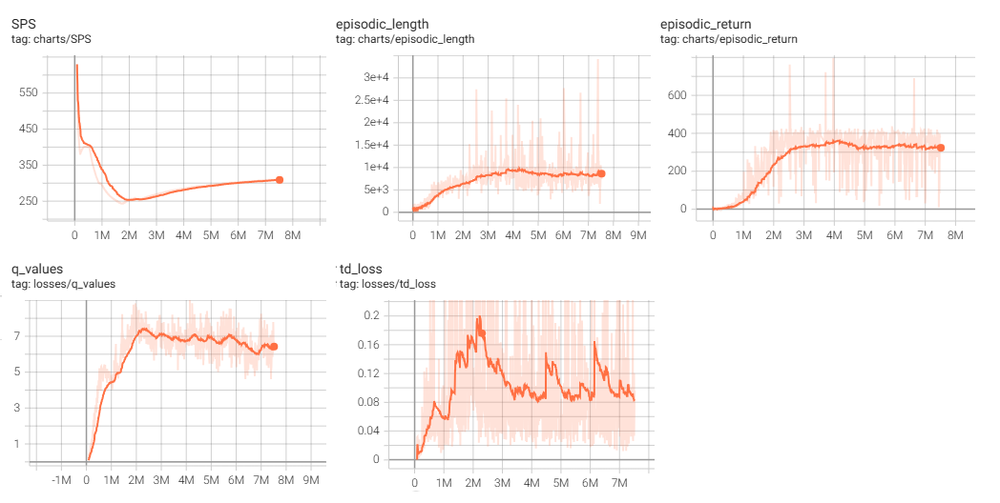


### 16. 学习资料

不闭门造车，多看看别人在做什么，会少走一些弯路

```shell
# 一个还不错的网站，上面有经典论文对应的代码，例如SAC：
https://paperswithcode.com/paper/soft-actor-critic-off-policy-maximum-entropy

# CleanRL是一个可读性较强的RL实验代码库
https://github.com/vwxyzjn/cleanrl
https://docs.cleanrl.dev/rl-algorithms/dqn/
https://github.com/pytorch-labs/LeanRL

# corl是类似cleanRL的offline的RL代码，注意区分off-policy。offline是指不与环境交互，只使用别人的经验交互数据
https://corl-team.github.io/CORL/get-started/install/
https://github.com/corl-team/CORL

# 一个RL相关的库，还没有来得及仔细看
https://stable-baselines3.readthedocs.io/en/master

# 好文
https://arxiv.org/abs/2304.01315
https://araffin.github.io/post/rliable/
https://openlab-flowers.inria.fr/t/how-many-random-seeds-should-i-use-statistical-power-analysis-in-deep-reinforcement-learning-experiments/457
```


