### 1 基础概念

### 2 状态价值和贝尔曼方程

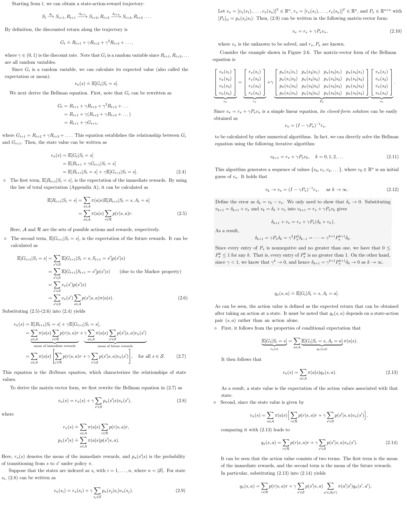

### 3 最优状态值与贝尔曼最优方程

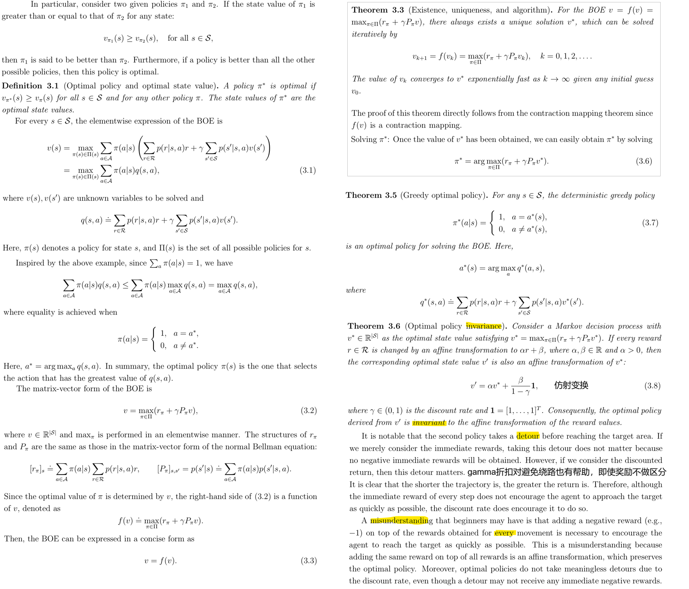

### 4 价值迭代与策略迭代

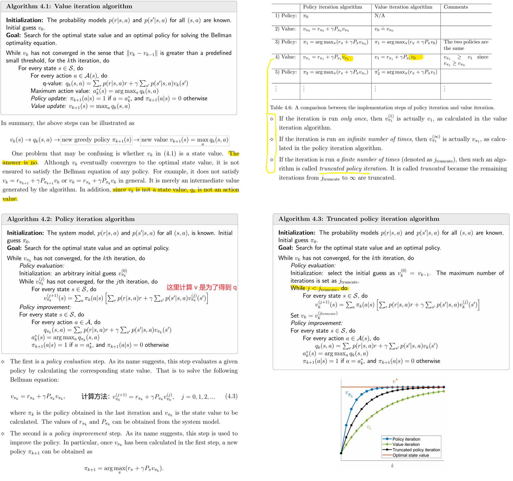

### 5 蒙特卡罗方法

注意，这章的算法还是表格方法，还没有到函数近似。

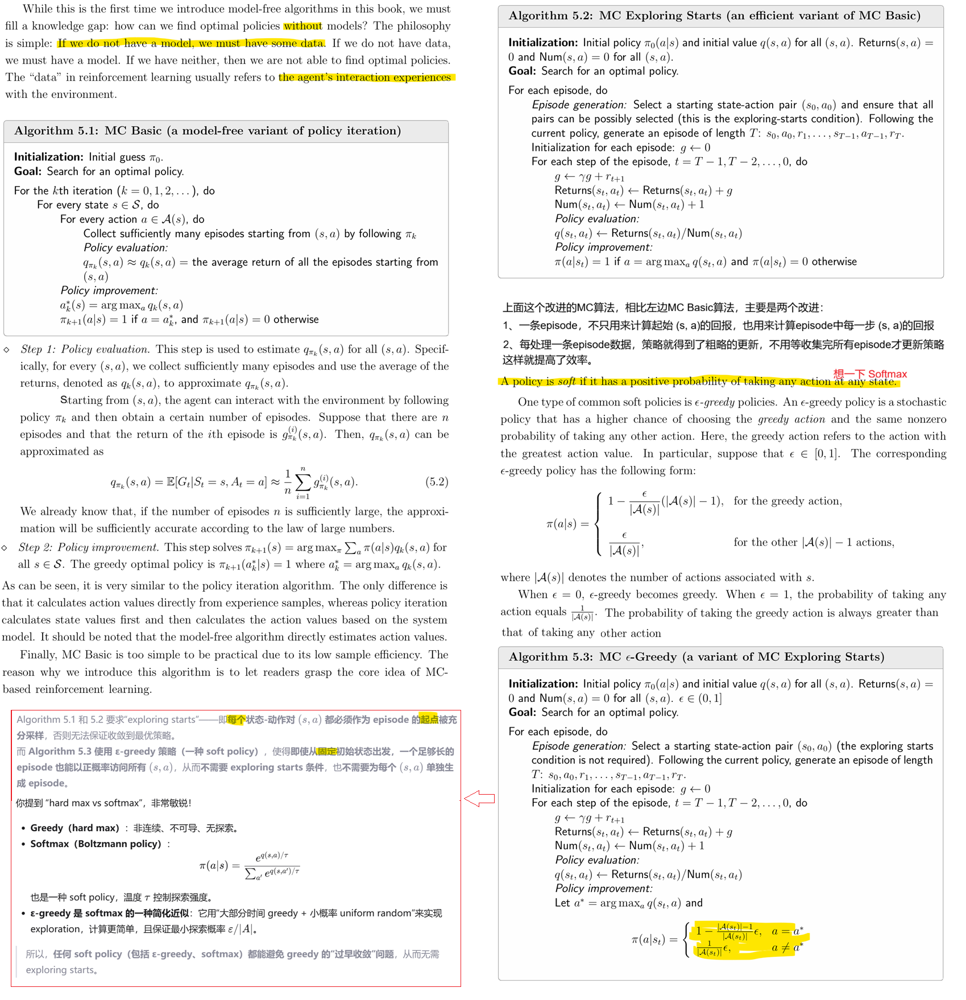

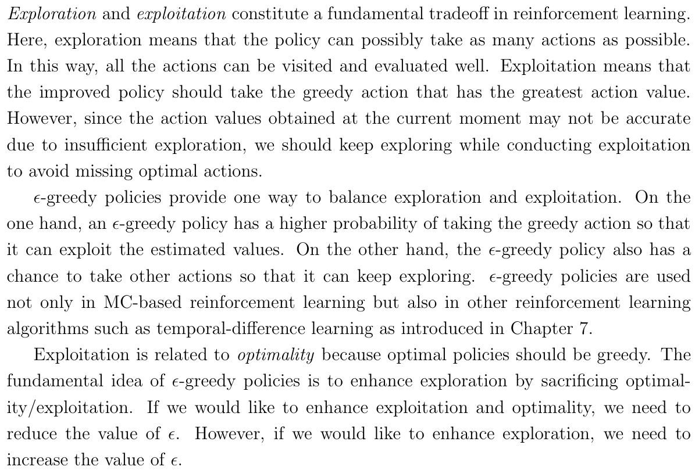

### 6 随机逼近(Stochastic Approximation)

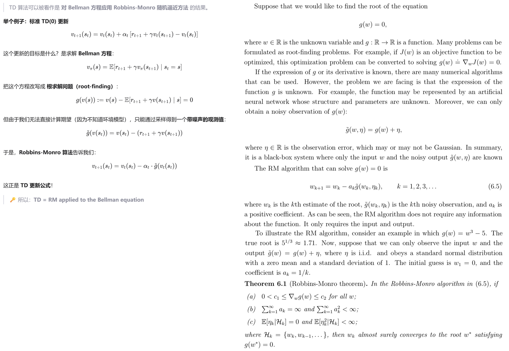

### 7 时序差分方法

注意，这章的算法还是表格方法，还没有到函数近似。

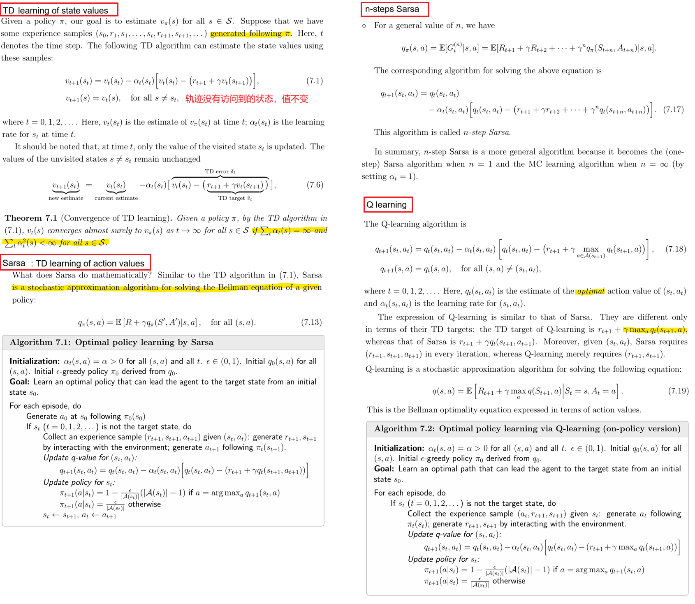

off-policy vs on-policy

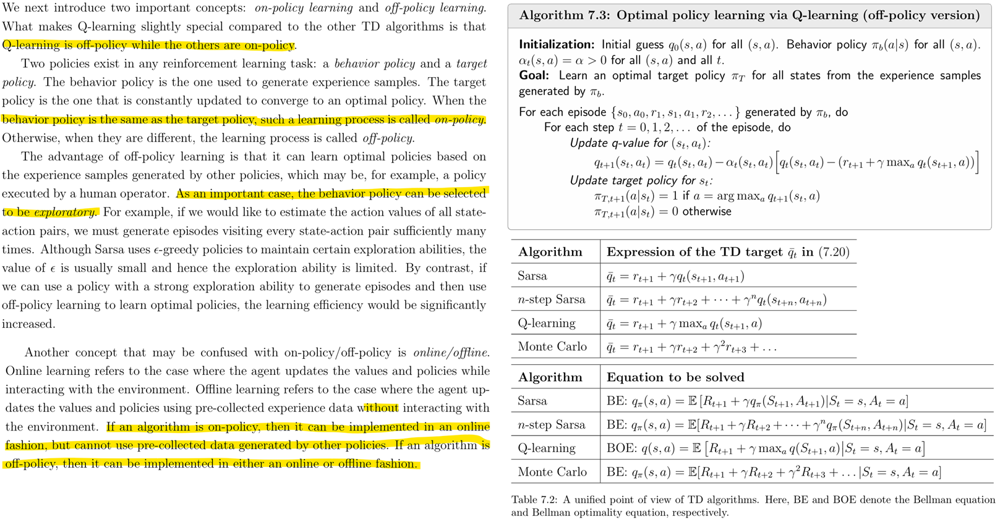

### 8 价值函数方法

从这一章开始，进入Deep RL方法的介绍。

第8章介绍了如何将时序差分（TD）方法与函数逼近（function approximation）相结合，以处理大规模甚至连续的状态空间。在前几章中，价值函数（状态值 v(s) 或动作值 q(s,a)）是以表格形式存储的，即每个状态或状态-动作对都有一个独立的条目。这种方法在状态空间较小时可行，但在状态空间很大或连续时不可扩展。为了解决这个问题，第8章引入了价值函数近似（value function approximation）的思想：不再用表格存储每个状态的值，而是用一个参数化的函数（例如线性模型或神经网络）来表示价值函数。这个函数的输入是状态（或状态-动作对），输出是对该状态（或状态-动作对）价值的估计。函数的参数（如权重向量 w）需要通过学习来调整。

**关键在于如何定义学习的目标。由于真实的价值函数 vπ(s) 或 qπ(s,a) 是未知的，无法直接作为监督信号**。因此，TD方法利用Bellman方程的思想，构造一个“目标值”（target value），也称为TD target。例如，在学习状态值时，TD target 是 r + γ * v̂(s', w)，其中 v̂(s', w) 是函数对下一个状态 s' 的估计值。这个目标值可以看作是对当前状态真实价值的一个带噪声的样本估计。

**于是，学习过程就变成了一个监督学习问题：对于每个时间步的样本 (s, a, r, s')，我们希望函数 v̂(s, w) 的输出尽可能接近TD target。**为此，可以定义一个损失函数，通常是两者之间误差的平方（即TD error的平方）。然后，使用梯度下降（或其随机版本SGD）来更新函数的参数 w，以最小化这个损失。

具体来说：

- 对于状态值函数，算法是TD(0) with function approximation。
- 对于动作值函数，可以得到Sarsa和Q-learning的函数逼近版本。
- 当使用深度神经网络作为函数逼近器时，就得到了著名的Deep Q-Network (DQN) 算法。

DQN引入了两个关键技术来稳定训练：

1. 经验回放（experience replay）：将交互数据存入一个回放缓冲区，然后从中随机采样小批量数据进行训练。这打破了数据之间的时序相关性，使训练更稳定，并提高了数据效率。
2. 目标网络（target network）：使用一个单独的、缓慢更新的网络来计算TD target中的 v̂(s', w_target)。这解决了在监督学习中“标签”也在不断变化的问题，从而稳定了学习过程。

总之，第8章的思路是：将强化学习中的价值估计问题，通过TD target构造出监督信号，从而转化为一个可使用标准优化方法（如SGD）求解的函数拟合问题。这为将强化学习与深度学习结合奠定了基础。

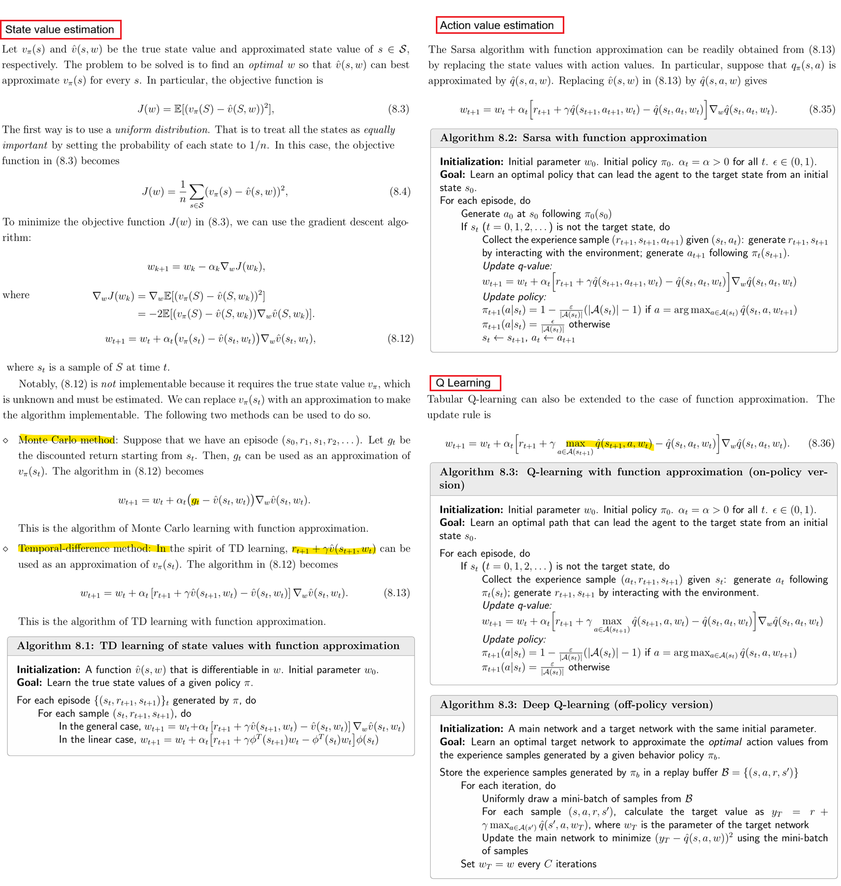

第8章介绍的价值函数方法（value function methods）虽然在形式上看起来像监督学习——即用神经网络拟合一个目标值（TD target），但它与传统监督深度学习有本质区别。以下是主要区别：

1. 目标值（label）不是外部给定的固定真值，而是由当前网络自身生成的估计值（bootstrapped target）。
   - 在监督学习中，标签 y 是静态、真实、与模型无关的（如图像分类中的“猫”或“狗”）。
   - 在DRL中，TD target（如 r + γ max_a Q(s', a; θ⁻)）依赖于当前或目标网络的参数，是一个动态变化的、有偏的、带噪声的估计。
2. 数据不是独立同分布（i.i.d.），而是高度相关的序列。
   - 监督学习通常假设训练样本是i.i.d.的，可以打乱顺序训练。
   - DRL的数据来自智能体与环境的交互轨迹，相邻样本之间存在强时序依赖，若直接用于训练会导致不稳定。
3. 数据分布本身依赖于当前策略，而策略又由网络参数决定，形成非平稳（non-stationary）的学习目标。
   - 监督学习中数据分布是固定的。
   - DRL中，随着策略改进，访问的状态-动作对发生变化，导致“输入分布”和“目标分布”同时漂移。
4. 损失函数不是最终优化目标，而只是实现策略优化的中间手段。
   - 监督学习中，最小化损失函数（如交叉熵）就是最终目标。
   - DRL中，最小化TD误差只是手段，真正的目标是找到最优策略以最大化长期回报；Q函数本身没有内在意义，只是策略的工具。
5. 为应对上述问题，DRL引入了监督学习中不需要的特殊机制：
   - 经验回放（experience replay）：打破样本相关性，近似i.i.d.采样。
   - 目标网络（target network）：冻结TD target的生成，避免“移动目标”问题。
   - 这些机制在监督学习中通常不存在。

总结：
第8章的方法虽然借用监督学习的优化框架（如SGD、神经网络），但其学习问题是自举式（bootstrapping）、非平稳、序列相关的，因此不能直接套用监督学习的理论和实践。它本质上仍是求解Bellman方程的随机逼近过程，而非拟合外部标签的函数逼近问题。

### 9 策略梯度方法

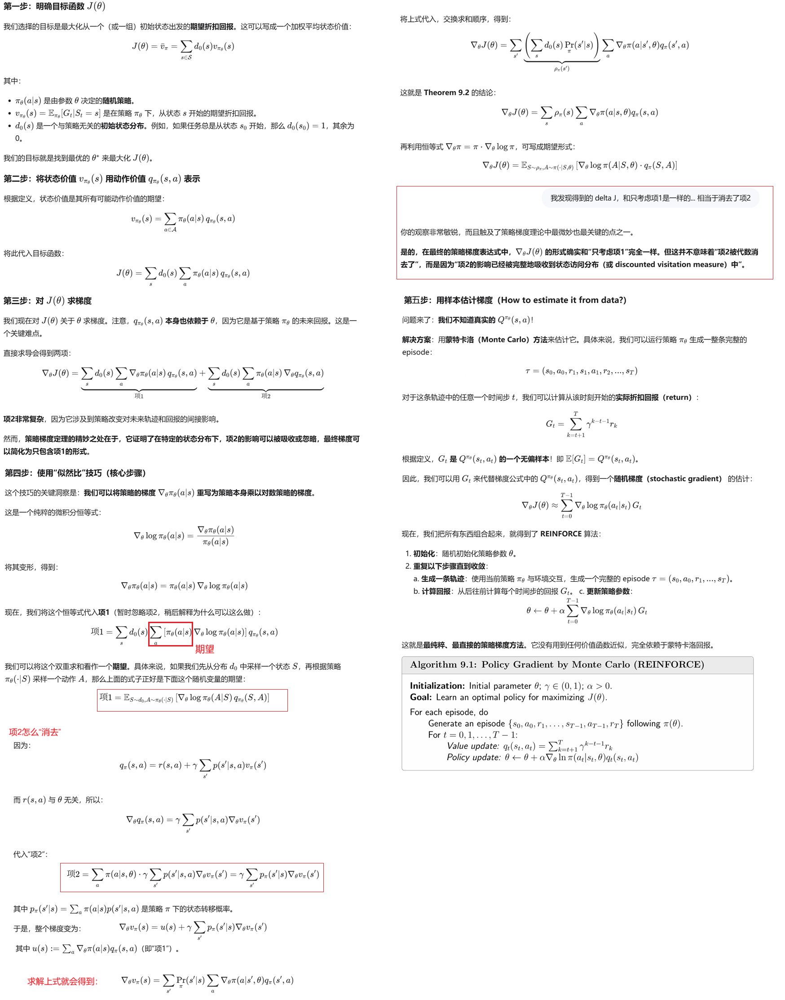

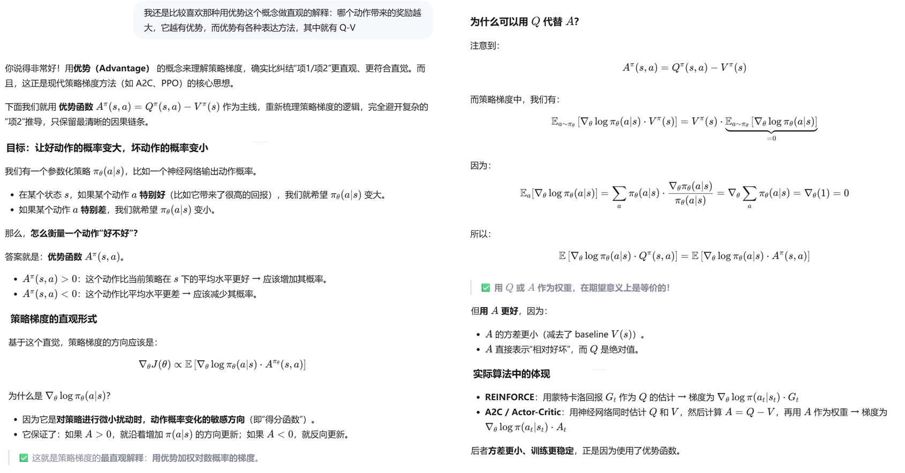

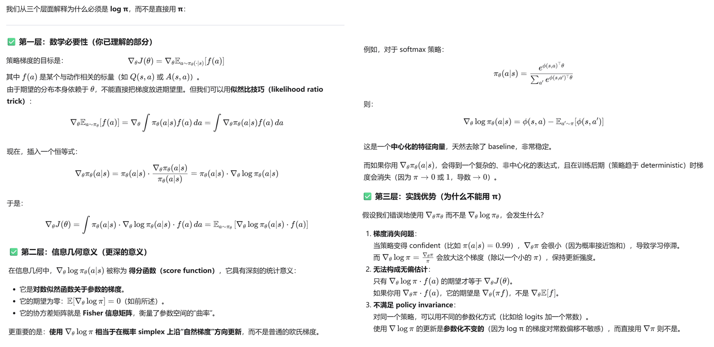

### 10 演员-评论家方法

#### A-C方法

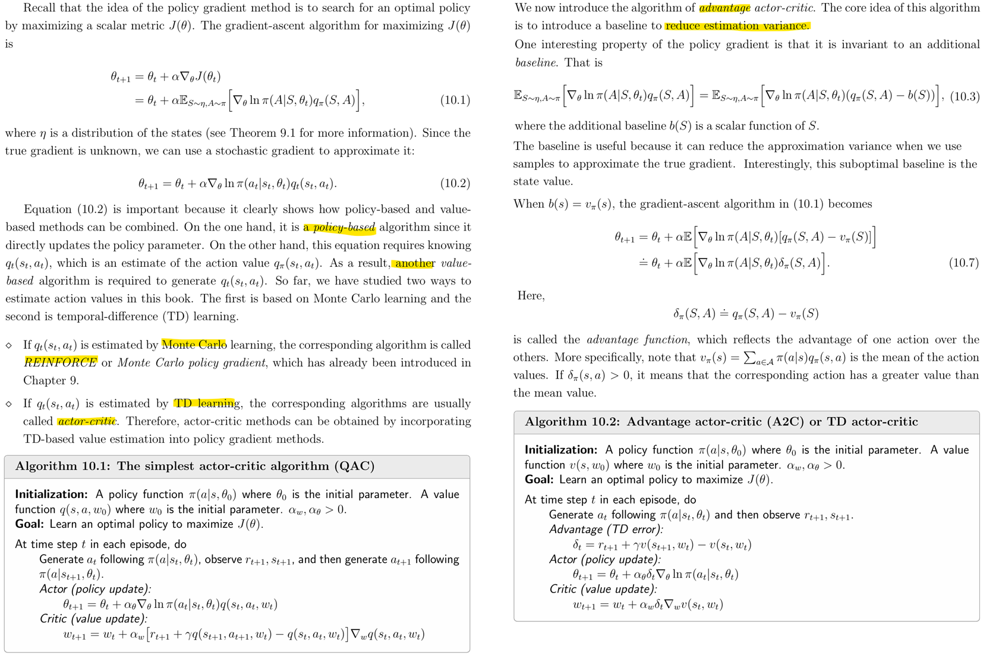

#### 重要性采样和确定性策略：

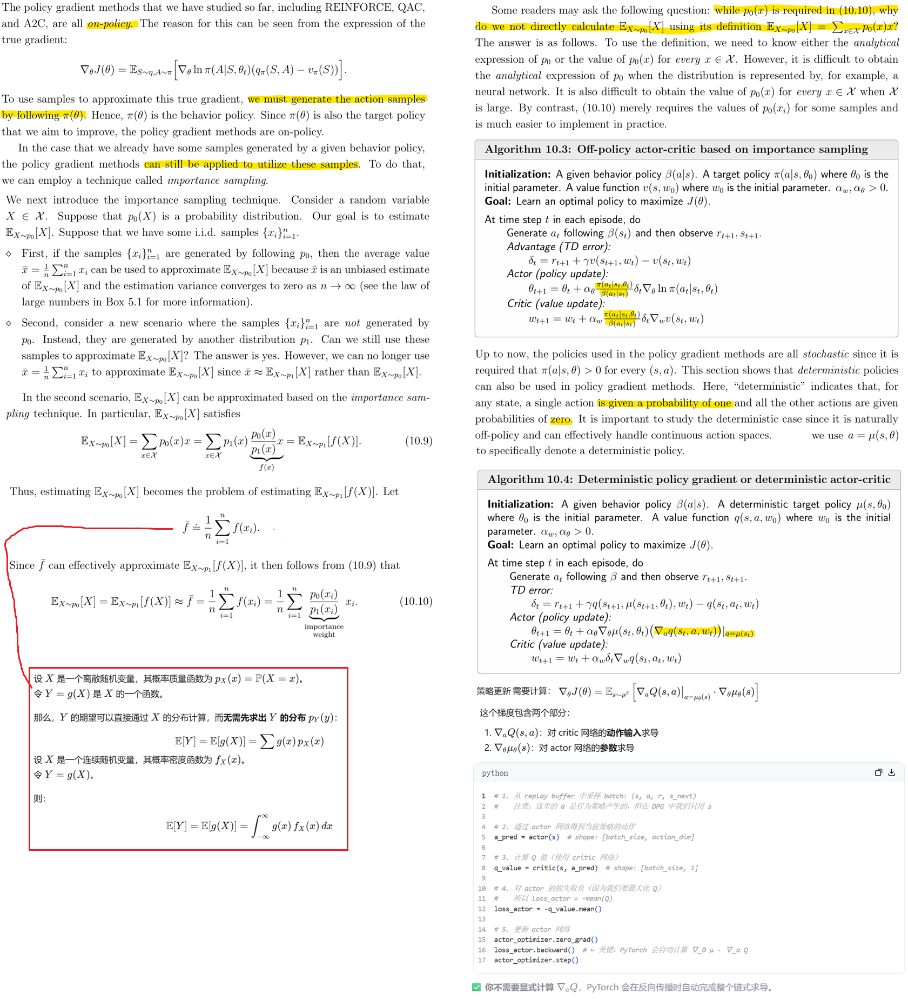

#### 三类方法的目标函数

总结一下三类方法的目标函数：

1. 基于价值的方法（如 DQN）：
   目标函数是最小化 TD error，即让 Q 网络的输出 Q(s,a) 接近 TD target（r + γ·max_a' Q(s',a')）。本质是拟合最优动作价值函数 Q*。
2. 基于策略的方法（如 REINFORCE）：
   目标函数是最大化期望回报 J(θ) = E[∑γ^t r_t]。通过梯度上升直接优化策略参数 θ，梯度由 logπ 与回报 G 的乘积构成。
3. 演员-评论家方法（Actor-Critic）：
   - Critic 的目标：最小化 TD error，学习当前策略的价值函数 Vπ 或 Qπ。
   - Actor 的目标：最大化期望回报，其梯度用优势函数 A = Q − V（或 G − V、GAE 等）加权 logπ 的梯度。

#### 几个特殊的Actor-Critic算法

**对于DDPG、SAC、TD3这三个算法，严格意义上会认为不是Actor-Critic算法：**

因为 Sutton 对 Actor-Critic 有严格定义：

- 必须基于**策略梯度定理**，形式为 E[∇logπ · A]；
- Critic 应估计**on-policy 的优势函数 A 或状态值 V**。

而 DDPG/TD3：

- Actor 更新基于 **Deterministic Policy Gradient**（∇a Q · ∇θ μ），不是策略梯度定理；
- Critic 学的是 **Q 函数**，且训练方式完全沿用 DQN（经验回放 + 目标网络），是 off-policy 的；
- 本质是 **DQN 在连续动作空间的扩展**，用 Actor 网络替代 argmax 操作。

因此，Sutton 认为它们属于 **value-based 方法的延伸**，而非传统 Actor-Critic。

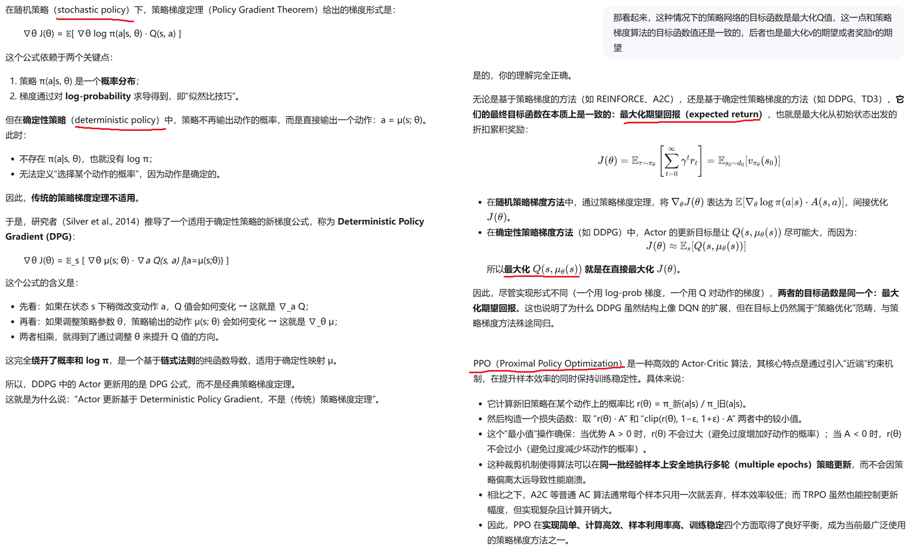