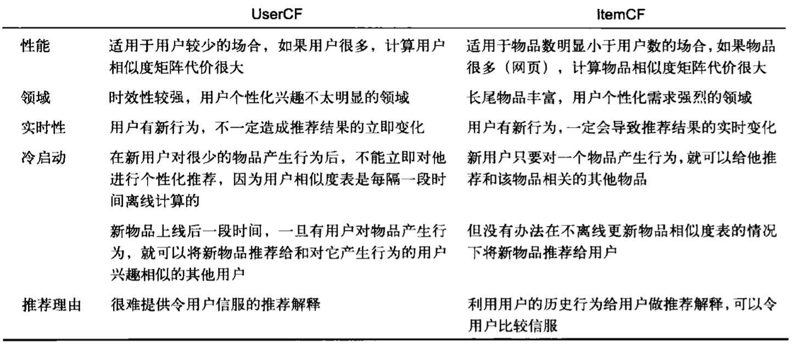
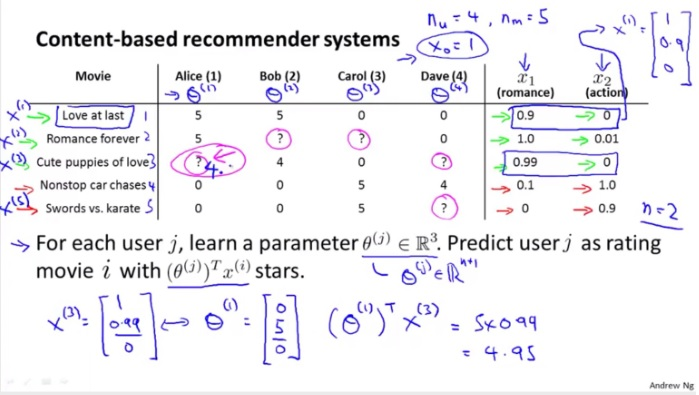
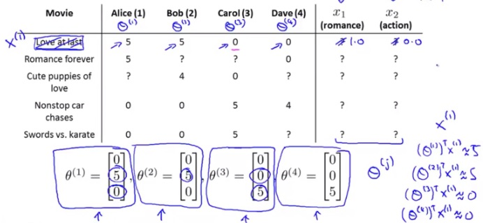
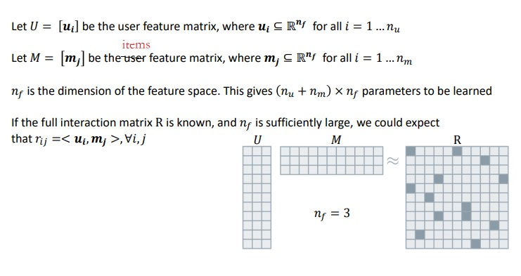
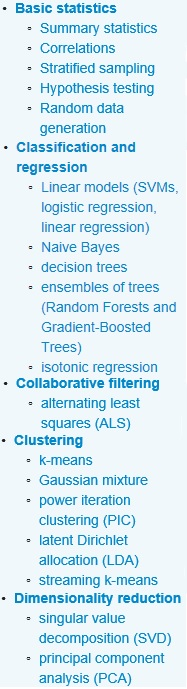
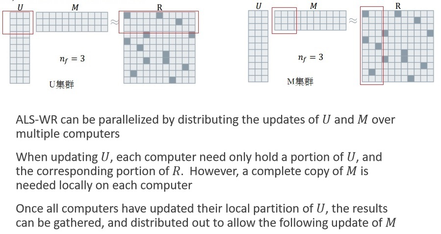

# 推荐系统读书笔记

推荐系统里的两个参与者：

1. 项，也叫物品，也叫内容，也叫item
2. 用户

评测/关注的指标有：

1. 预测准确度和召回率
2. 用户满意度
3. 对长尾物品的覆盖度
4. 用户感受到的多样性、新颖性、惊喜度等
5. 实时性
6. 健壮性

# 1、利用用户行为数据推荐

## 1.1、协同过滤算法

两类协同过滤算法推荐系统：

1. 基于内容（也叫物品、项、item）的推荐系统：
2. 基于协同过滤的推荐系统

基于内容的推荐系统，根据用户过去喜欢的物品（内容），为用户推荐和他过去喜欢的物品相似的物品。而关键就在于物品相似性的度量；主要有三步：

1. 为每个物品提取特征
2. 利用该用户历史上喜欢或者不喜欢的物品，提取该用户的特征
3. 通过计算物品和用户的特征的距离，推荐相关度大的物品

基于协同过滤的推荐系统又分：

1. 基于用户的协同过滤：与A用户相似的用户的喜欢的内容，推荐给用户A
2. 基于内容的协同过滤：与A用户喜欢历史喜欢的内容相似的内容，推荐给用户A

内容的特征提取方法：

1. 文档的特征发现，例如TF.IDF，第四章的文档相似性，基于词汇来定义，而推荐系统关注的文档特征，是一些重要词汇的是否出现，而进一步的距离的度量、相似文档的发现，minhash LSH都在推荐系统里可用
2. 内容的标签
3. 内容的结构化资料

基于内容的推荐系统，还有一个思路是机器学习的方式，将特定的数据（例如一组历史上用户喜欢或者不喜欢的内容的特征作为输入特征，用户喜欢或者不喜欢作为分类标签）当做是训练集，然后为每个用户训练一个分类器，来预测该用户对一个内容的评分/喜好

协同过滤，关键步骤是计算相似性，可以用第四章介绍的距离度量的方式计算相似的用户/内容，也可以使用聚类的机器学习算法，聚类出相似的簇。

[试验代码](code/data_mining/UserCollaborativeFiltering.py)

基于用户和基于物品的协同过滤算法的对比：




## 1.2、潜在因子算法

另外一种重要的推荐算法是潜在因子算法（latent factor model），但我看很多文档里把这个也归为协同过滤算法的一种实现。

以下面四个用户对五个电影的打分为例。目标是预测一些用户对某部电影可能的评价，据此来决定要不要给该用户推荐。例如预测Alice对第三部电影的评价。



算法是：

1. 对每部电影，建立一些特征，类似线性回归例子中的每个房子有建筑面积、卧室个数等特征。上面例子的电影有两个特征：x1-浪漫类系数，x2-动作类系数
2. 每个用户是一个线性回归模型（也可以是其他机器学习模型），根据该用户对某些电影已有的评价信息，可以学习到该用户的线性回归参数θ。例如上面例子中，可以训练获得Alice用户的θ=[0, 5, 0]
3. 利用上一步学习获得的θ， 可以预测该用户对其他电影的评价，例如Alice对第三部电影的评价是4.95分

也可能的场景是，知道一些用户的模型参数θ，但是某些电影的特征数据缺失，例如下图：



类似的，可以依据已有的用户模型参数θ，训练获得电影的特征数据。然后利用学习到的数据，对缺失的评价进行预测。

在一个推荐系统里，往往两个方向的学习都有：只有部分用户模型参数θ，只有部分电影的特征数据x；利用已知的电影特征数据x，可以学习到缺失的用户模型参数θ；利用已知的用户模型参数θ，可以学习到缺失的电影的特征数据x。最终实现预测某用户对某电影是否感兴趣。

x1,x2这些特征因子、用户模型参数θ、物品的特征数据都可以由用户的评价矩阵生成，通过UV分解和梯度下降学习得到，即 U.M = R：



[试验代码在这里](code/data_mining/LFM.py)

本质上，这个过程是对用户和物品进行embedding的过程，用户的特征向量就是该用户的embedding向量，物品的特征向量就是该物品的embedding向量。

embedding后，类似nlp中的词向量，要找出物品或者用户的相似物品/用户就比较简单了，背后的语义关系非常有价值。

## 1.3、基于图的算法

将用户行为信息整理成二分图这样的数据结构：

1. 节点包括用户和物品
2. 如果用户历史上有访问某物品，就存在该用户到该物品的一条边

基于图的算法，从某个用户节点出发，在图上面游走，访问到的物品节点就是可能推荐给该用户的物品。游走中访问到的物品与该用户的相关度主要取决于：

1. 该用户到达物品的路径数目
2. 该用户到达物品的路径的长度
3. 该用户到达物品所经过节点的出度，出度越大相关度越低（大家都买了《新华字典》，只有少数程序员买了《深度学习》）

到具体实现，经典的实现算法有基于随机游走的PersonalRank算法（类似PageRank）：

1. 要给用户u推荐物品，从u对应的节点出发在二分图上随机游走。
2. 游走到任何节点，按照一定的概率p决定是：
   1. 继续游走
   2. 停止本次游走，重新从u开始游走
3. 如果决定继续游走，那么就从当前节点指向的节点中均匀随机的选择一个节点作为下一个经过的节点
4. 这样，经过很多次随机游走后，每个物品节点被访问到的概率收敛到一个数

[示例代码在这里]((code/data_mining/GraphRank.py))

# 2、如何做分布式计算

在生产中应用比较广泛的是spark+mllib框架。mllib不只是用于推荐，还包括其他适合分布在成百上千节点上的海量数据进行学习训练的机器学习算法，例如线性回归、逻辑斯蒂回归等等，下图是mllib文档（2019年7月版本）中列举的基于RDD（弹性分布式数据集）接口的算法，新版本的spark的接口将基于DataFrame：



详细可见：

```
http://spark.apache.org/docs/latest/ml-guide.html
```

mllib文档中提到的ALS协同过滤算法，就是潜在因子模型。

## 2.1 潜在因子模型

mllib文档中没有详细说是如何对潜在因子模型算法进行分布式计算的。我查到netflix公司的工程师是这样实现分布式并行计算的：

分两部分，训练U的集群和训练M的集群，以训练U的集群为例：

1. 每个计算节点负责一部分U的计算，即部分用户的完整的特征矩阵。该节点需要有U的这部分行和对应的R的这部分行以及全部的M数据的本地化
2. 进行一次迭代后，可以更新U，并且汇总后把U同步给训练M的集群，同时收到训练M集群的更新后的完整的M。

类似的M集群也是这样，差别就是按照M列进行切分。



试验代码如下，数据集与迭代次数都不能太大，要不会报错

```python
import csv
import random
import pickle
import numpy
from pyspark import SparkConf, SparkContext
from pyspark.mllib.regression import LabeledPoint
from pyspark.mllib.feature import HashingTF
from pyspark.mllib.classification import LogisticRegressionWithSGD
from pyspark.mllib.recommendation import ALS, MatrixFactorizationModel, Rating

# 限于内存大小，通过限制最大的用户Id和电影Id，取部分数据
maxUserID = 20000
maxMovieID = 3000
factorNum = 16 #隐藏因子的个数，太大似乎也不一定有益
iteratorNum = 10 # 不能太大，否则内存出错。如果需要比较大的迭代，那么需要checkpoint：streamingContext.checkpoint

conf = SparkConf().setMaster("local").setAppName("My App")
sc = SparkContext(conf = conf)

movies = set()
users = set()
# 从开源的电影评价数据集中构建评价矩阵用于训练和测试
def load_data():
    num = 0
    with open("E:\\DeepLearning\\data\\movie_rate-20m\\ml-20m\\ratings.csv", "r") as f:
        rate = csv.DictReader(f)
        train_data = list()
        test_data = list()
        for rec in rate: # {'rating': '3.5', 'timestamp': '1112486027', 'userId': '1', 'movieId': '2'}
            num += 1
            if num % 100000 == 0:
                print("processed %d record"%(num))
            if num > 10000: #不能太大，和内存资源相关
                break
            r = float(rec['rating'])
            u = int(rec['userId'])
            m = int(rec['movieId'])
            if u >= maxUserID or m >= maxMovieID:
                continue
            if random.randint(0, 10) > 7 : #部分用于测试集
                test_data.append(Rating(u,m,r))
            else:
                train_data.append(Rating(u,m,r))
                movies.add(m)
                users.add(u)
        return sc.parallelize(train_data), sc.parallelize(test_data)

train_data, test_data = load_data()
model = ALS.train(train_data, factorNum, iteratorNum)
for r in test_data.collect():
    if not users.__contains__(r[0]) or not movies.__contains__(r[1]):
        continue
    predictions = model.predict(r[0], r[1])
    label = r[2]
    print(predictions, " vs ", label)
# Save and load model
model.save(sc, "target/tmp/myCollaborativeFilter")
sameModel = MatrixFactorizationModel.load(sc, "target/tmp/myCollaborativeFilter")
```

部分输出如下，不怎么准确：

```
0.771085417075176  vs  3.5
3.3965990559161816  vs  3.5
3.2707121317872065  vs  3.5
3.7237724167938167  vs  3.5
4.105702704383339  vs  4.0
3.7812037313607836  vs  4.0
1.9864432721858638  vs  3.5
3.4522931342423435  vs  3.5
1.7203749160608859  vs  3.5
2.507687882183002  vs  3.5
3.210045312178231  vs  4.0
2.698714735775131  vs  4.0
```

下面两种算法的分布式实现，没有找到比较权威的资料，根据我自己的经验我觉得可以这样来做：

## 2.2 CF算法

如果不要求所有访问的数据本地化，那么协同过滤算法分布式处理还比较容易，以userCF为例：

1. 用户ID为key的访问过哪些物品的信息，用分布式Key-Value存储即可

2. 物品ID为key的被哪些用户访问过的信息，用分布式Key-Value存储即可

3. 相似用户关系，使用用户ID为Key，相似用户列表信息为value，用分布式Key-Value存储即可。

4. 分布式计算：

   1. 构建相似用户关系的过程，按物品ID sharding，每个计算节点处理各自负责的物品ID被哪些用户访问过的信息，更新相似用户关系数据的计数
   2. 推荐：按用户ID sharding，每个计算节点处理各自负责的用户ID的推荐

## 2.3 基于图的随机游走算法

如果不要求所有访问的数据本地化，那么可以这样：

1. 二分图的数据存储在定点为key、边列表为value的分布式key-value存储系统中
2. 每个计算节点负责一部分用户的随机游走。这个对二分图的数据存储的读压力会比较大

