原书标题是 the scientist and engineers guide to digital signal processing

是一本开源的书，官网上可以下载到：http://dspguide.com/

# 第一章：数字信号处理的广泛用途 #

我们研究的信号，通常是一个时间序列的变量，可以使离散的，也可以是连续的。信号也可以是时间以外的自变量的因变量。

一个信号经过一个系统，输出为另外一个信号。

# 第二章：统计、概率和噪声 #

生成正态分布的随机数的两个方法：

方法一：基于中心极限定理累加

1. 生成12个[0,1]之间均匀分布的随机浮点数，将他们累加得到v
2. v减去6，使得随机数均值为0，此时标准差为1
3. v乘以目标正态分布的标准差
4. v加上目标正态分布的均值

方法二：基于公式

1. 生成2个[0,1]之间均匀分布的随机浮点数R和Q
2. 计算v=（-2log(R))^(0.5)  * cos(2Pi*Q)

# 第三章：ADC和DAC #

主要是讲量化和采样。

重点是奈奎斯特采样定理，见另外一篇专门的文章：

[奈奎斯特采样定理的理解.md](奈奎斯特采样定理的理解.md)

# 第四章：DSP软件 #

主要是讲浮点数的舍入误差问题。

由于计算机是使用有限的状态位（例如float用32bit）来表示状态数为无限个的一定范围的实数，所以运算过程中会经常出现把一个实数值舍入到某个状态，从而引入了舍入误差。

具体的一些性质可以参考：

[IEEE754标准](https://en.wikipedia.org/wiki/IEEE_754)

[单精度浮点数](https://en.wikipedia.org/wiki/Single-precision_floating-point_format)

[双精度浮点数](https://en.wikipedia.org/wiki/Double-precision_floating-point_format)

[试验代码](https://github.com/bisonliao/daydayup/blob/master/acm/float.c)

# 第五章：线性系统 #

线性系统的几个特征：

1. 同质性（我感觉叫可乘性比较好）：输入X，输出Y，如果输入aX，a是常数，则输出aY
2. 可加性：输入X1，输出Y1，输入X2，输出Y2，如果输入X1+X2，则输出Y1+Y2
3. 时移不变性：（通常是基于时间的）输入信号平移一个常量，输出信号也对应的会平移一个常量
4. 静态保持性：输入是一个常量信号，输出也是一个常量信号
5. 正弦保持新：输入是正弦波，输出也是同频率的正弦波，只是相位和幅度可能改变

DSP的基本思路：将复杂信号分解为多个简单信号，这些分量通过线性系统变化后的输出信号，叠加起来等于复杂输入信号的输出

1. 输入信号X分解为一组分量x1,x2,...
2. 这些分量通过线性系统，输出为一组y1,y2,...
3. 将y1，y2,...这些输出分量叠加得到Y，Y就是X通过线性系统的输出

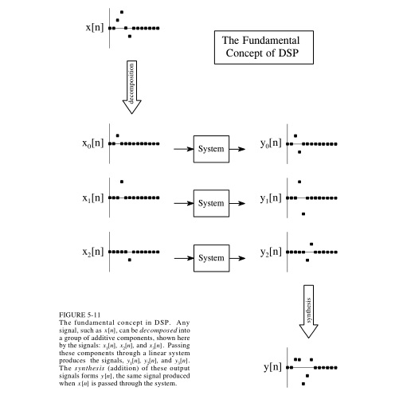

将一个信号分解的方法：

1. 脉冲分解：把长度为n的时间序列的信号看做n个对应时间点上的脉冲信号的叠加
2. 傅里叶分解：把信号看做是非常多频率的正弦波信号的叠加。任意N个点的离散信号，可以分解为N+2个信号， 其中一半是正弦，另外一半是余弦。
3. 步进分解
4. 奇偶分解
5. 交错分解

前面两种分解是特别重要的。

# 第六章：卷积 #

第六章暂时只讨论离散信号。

几个概念：

1. 单位脉冲：也叫delta函数，时间点第一个位置的信号值为1，其他都为0
2. 脉冲反应：单位脉冲经过一个线性系统后的输出
3. 任一脉冲信号可以看做是单位脉冲经过时移和缩放后得到的脉冲信号，所以其经过一个线性系统后的输出信号，可以由该系统的脉冲反应做对应的时移和缩放得到。
4. 同理，任一信号经过一个线性系统后的输出信号：  a）输入信号X分解为多个脉冲信号P1,P2,P3...，根据系统的脉冲反应，做相应的时移和缩放，得到输入信号的分量的对应输出信号O1,O2,O3....。   b）将O1，O2，O3...叠加，就得到X信号经过系统后的输出信号Y
5. 上面的这个过程就是卷积，该系统的脉冲反应也叫做卷积核，或者叫做核。

下图是一个例子：

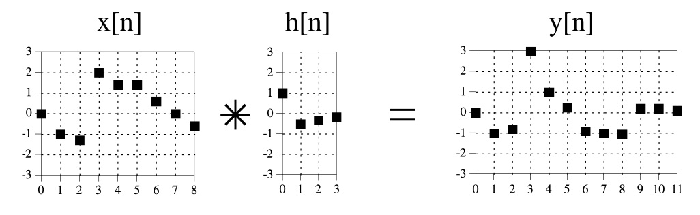

使用mathematica软件验算一下：

	input = {0, -1, -1.2, 2, 1.4, 1.4, 0.6, 0, -0.6, 0, 0, 0};
	kernel = {1, -0.5, -0.3, -0.1};
	output = ListConvolve[kernel, input, 1];
	ListPlot[output]

输出的output同y[n]：

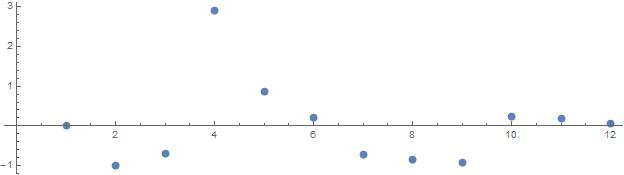

需要稍微注意一下：mathematica的ListConvolve函数，计算方式会与教材不一致，边界的处理上有些不同。  所以要第三个参数指定为1，且input后面补一些0。

卷积可以从输入侧和输出侧两个视角做物理上的理解。

## 输入侧视角来理解卷积 ##

输入侧视角，把卷积理解为 卷积核（系统的脉冲反应）的多次时移和缩放后的信号的叠加。

例如有输入信号X[n]，由9个离散的值组成：X(0),X(1),X(2)...X(8)，每个值都作用于卷积核，得到一个输出信号y，总共得到有9个输出信号，叠加起来得到输入信号。

假设X[4]等于1.4，X(4)=1.4*Delta[n-4]，即X[4]是单位脉冲时移4并缩放1.4倍。X[4]经过系统后产生一个输出信号y(4)，y(4)就是卷积核时移4并缩放1.4倍。同理有y(0),y(1)...y(8)，他们叠加起来就是X和系统的脉冲反应卷积的结果。

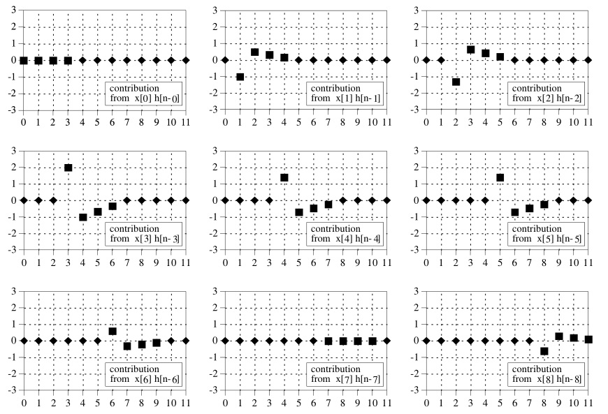

卷积操作在数学上是满足交换律的。

## 输出侧视角来理解卷积 ##

还是上面的例子，有输入信号X[n]，由9个离散的值组成， 卷积核宽度为4，即有4个离散值组成，输出将会有12个值（9+4-1）。从输入侧的视角来看，卷积核会不断时移，也就是像个窗口一样在输出信号的时间轴上一步一步向右移动。

对于具体的一个输出信号的取值，例如y(6)，它是有哪些值叠加产生的呢？ 当卷积核经过y(6)所在位置的时候，都会贡献分量给它，当卷积核窗口没有和y(6)位置重合的时候，输出分量取值都是0.

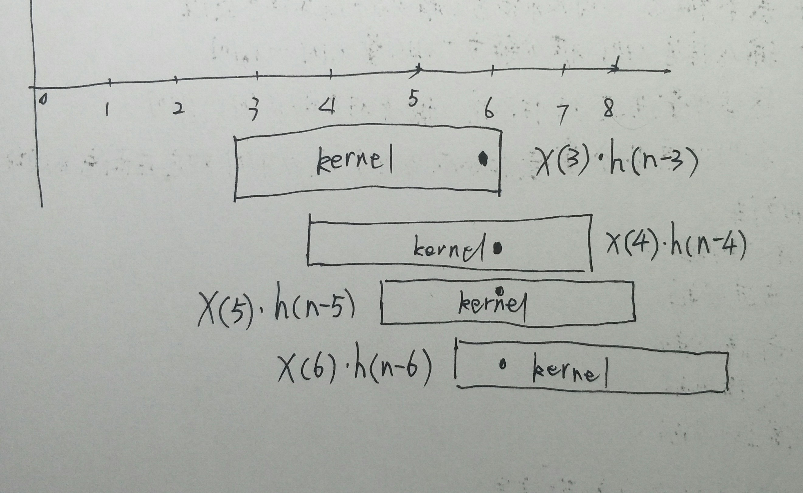

所以，输出信号的某个时间点取值y(i)，是翻转后的卷积核与X(i-M+1),...,X(i)这些值相乘再累加的结果。卷积核不断的右移，不断的产生出y(i)。M是卷积核大小。

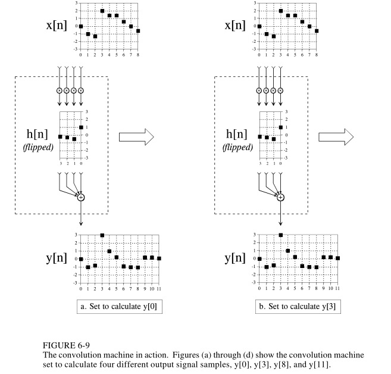

有公式：

	y(i) = SUM( h(j) * X(i-j)， j from 0 to M-1）

# 第七章：卷积的一些性质 #

一个线性系统的特性，可以认为完全由它的脉冲响应（卷积核）决定和表现，这是数字信号处理的基础。数字滤波器就是不同的卷积核，不同的卷积核，对输入信号的处理有不同的性质表现。

卷积核是一个单位脉冲信号：该滤波器表现为将输入信号原样输出，x(n) * h(n) = x(n)

卷积核是一个缩放过的单位脉冲信号：信号放大器、信号衰减器，x(n) * k h(n) = k x(n)

卷积核是一个时移的单位脉冲信号：信号延时器

一阶差分器和积分器：

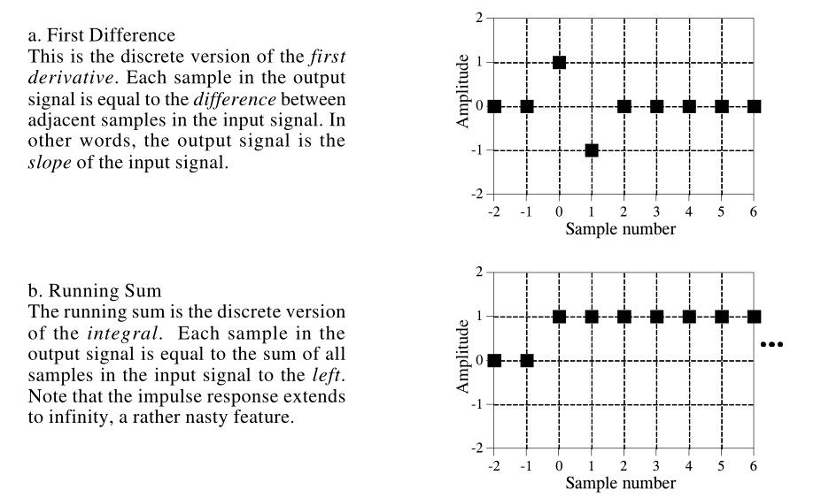

它们是互为逆操作：

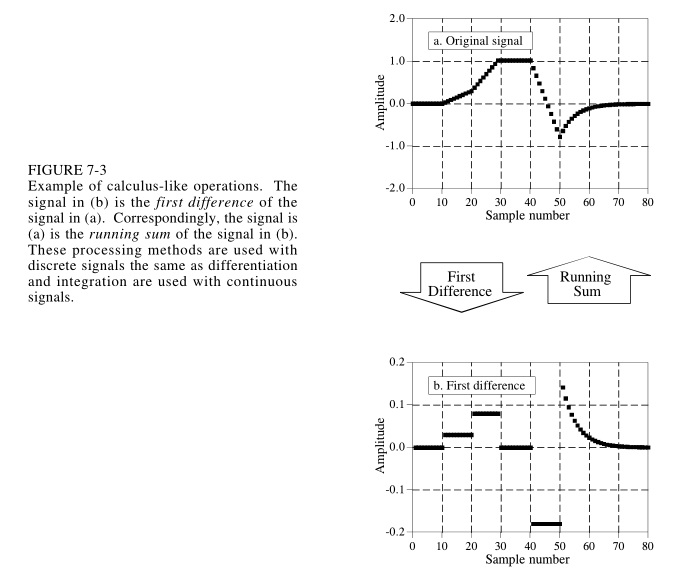

低通滤波器：卷积核通常由一组连续的整数点组成，卷积操作是对输入信号附近的值做加权平均，从而平滑掉高频分量。

高通滤波器：卷积核通常由一个单位脉冲信号减去一个低通滤波器得到。可以理解为从原信号中减去低频部分，就剩下高频部分了。

因果系统：输入信号的某个时间点的值，值影响该时间点及其以后的输出信号的值，即卷积核的负时间点坐标上的值都为0（数学上完全可以存在负时间点坐标上的值不为0的卷积核）。

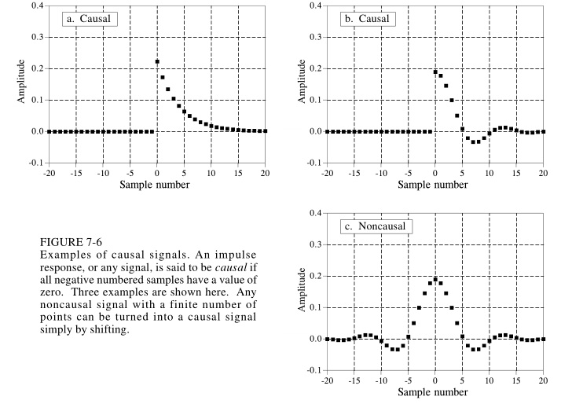

零相位：如果一个信号的一系列值在横坐标0左右对称，则称为零相位的

线性相位：如果一个信号的一系列值在横坐标某个点左右对称，则称为线性相位

这两个概念比较费解，不直观。

卷积在数学上的一些属性：

1. 满足交换律
2. 满足结合律
3. 满足分配率
4. 输入输出的传递性：在输入上施加操作后经过一个系统，该操作也会在输出信号上体现出来。例如对一个输入信号施加时移、缩放、积分、求导，经过一个系统后的输出信号，也等于在原输出信号上施加时移、缩放、积分、求导的结果。  时移、缩放好理解，是线性系统的定义决定的。积分和求导也可以，比较新奇。
5. 中心极限定理效应：一个“脉冲形状”的输入信号，反复与自己卷积，最后的结果是一个“正态分布形状”的信号

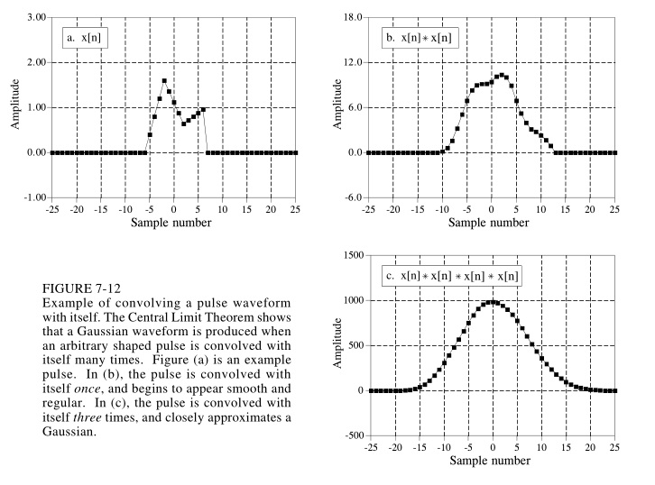

中心极限定理效应比较有意思，用mathematica软件可以试验一下。注意：为了让卷积核这个窗口在信号左右两边都滑动到位，试验的时候需要给输入信号两边都加一些0.0的个数等于卷积核长度减去1.

	K = {1, 2, 2, 1};
	input = {0, 0, 0, 1, 2, 2, 1, 0, 0, 0};
	input = ListConvolve[K, input]

上述代码输出为

	{1, 4, 8, 10, 8, 4, 1}

可以看到比input一开始更接近正态分布形状。

继续：

	input = {0, 0, 0, 1, 4, 8, 10, 8, 4, 1, 0, 0, 0};
	input = ListConvolve[K, input]

输出为：

	{1, 6, 18, 35, 48, 48, 35, 18, 6, 1}

如此反复多次，可以得到input的形状如下：

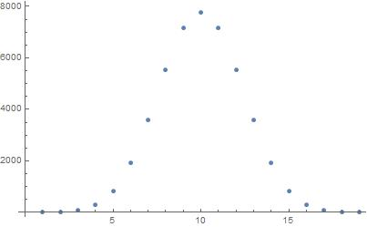

实际上输入信号一开始的形状也可以随意一点，例如

	K={1,4,6,8};
	input={0, 0, 0, 1, 4, 6, 8, 0, 0, 0};
	input=ListConvolve[K,input]

经过几次卷积后，形状也逼近正态分布：

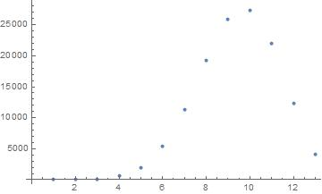

# 第八章：离散傅里叶变换（DFT） #

一个信号，分解为一组分量叠加的形式，可以有无数种方法，例如前面提到的脉冲分解、步进分解等。而傅里叶变换，把信号分解为一组不同频率的正弦波叠加的形式。是因为正弦波经过一个线性系统后，还是同频率的正弦波，只有相位和幅度发生变化。而其他形状的分量则没有这么利于分析的性质。

严格来说，对于连续的信号，在不可导点，傅里叶变化不能精确与原信号相等，但可以尽量逼近。而对于一个个离散的信号值，则没有这样的问题。

傅里叶变换簇有四种情形：

1. 对周期的连续信号进行分解，称为傅里叶级数（FS）。
2. 非周期的连续信号进行分解，称为傅里叶变换（FT）。例如高斯函数、指数函数等
3. 对周期的离散信号进行分解，称为离散傅里叶变化（DFT）。通常我们拿到一组有限个数的离散值做DFT，似乎不是周期的，实际上在变换的时候，约定俗成将这组离散值向时间轴两侧做周期性重复扩展。本章讨论的就是这种情形。
4. 对非周期的离散信号进行分解，称为离散时间傅里叶变换（DTFT）。

这四种情形的变换，处理的信号都是在时间轴的负无穷到正无穷范围内的。怎么理解，例如对于情形3，前面已经说了，要“想象”为周期性的重复扩展；对于情形4和情形2，没有明确定义的时间轴上的值，要“想象”为0。

mathematica软件也有一组函数对应上述四种情形：

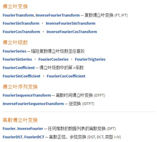

本章集中阐述DFT，但似乎讲述的是另外一个版本的DFT：

DFT可以认为是这样一个系统：

1. 输入N个离散点（常见为实数形式，实际上可以是复数）组成的信号x(n)，n取值为0到N-1.
2. 输出为有 N/2 + 1 个复数点的**X**(k)，k取值为0到N/2.
3. **X**(k)被称为x(n)频域信号，x(n)被称为时域信号

输入输出的关系是：

这些复数**X**(k)的实部是对应Cos分量的幅度，其虚部是对应Sin分量的幅度。这些分量叠加起来，即可合成x(n)。公式里的X上面加了一横，与X有直接关系。具体关系公式不抄录了。

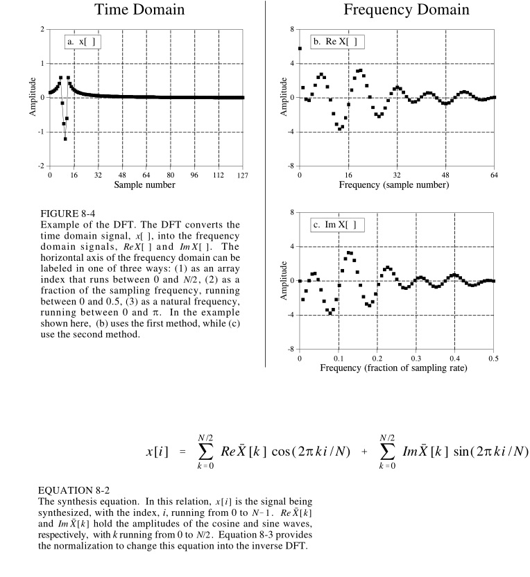

下面是mathematica代码实现的上述版本的DFT：

	input = {1, 2, 3, 4, 5, 6, 7, 8};
	NUM=8;
	ReX[k_] = Sum[ Extract[input, i + 1]*Cos[2 Pi/NUM * k * i], {i, 0, NUM-1}];
	ImX[k_] = -Sum[    Extract[input, i + 1]*Sin[2 Pi/NUM * k * i], {i, 0, NUM-1}];
	ReXX[k_] = If[k == 0||k==NUM/2, ReX[k]/NUM, ReX[k]/NUM * 2];
	ImXX[k_] = -ImX[k]/NUM *2;
	INPUT[i_] =  Sum[ReXX[k] *Cos[2 Pi/NUM*k*i], {k, 0, NUM/2}] +   Sum[ImXX[k]*Sin[2 Pi/NUM * i * k], {k, 0, NUM/2}];
	Table[INPUT[i], {i, 0, 7}]//N

可以看到，最后输出的INPUT值和input值是一致的。

实际上，有另外一个版本的DFT，即使用mathematica软件里的Fourier[]函数。奇怪的是，对于N个点的离散信号，这个版本的DFT认为有N个频率分量，虽然一些频率之间的系数是共轭的复数，幅度相等。

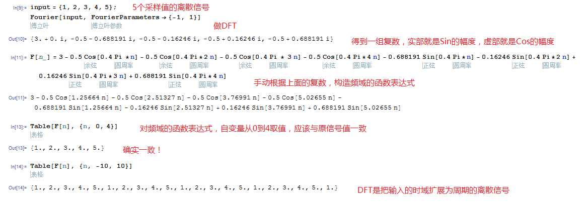

我还没有搞清楚这两个是什么关系。

**我感觉这些分量有两个“频率”，一个是数学上的正弦波的周期和频率，一个是DFT中通常说的频率： **

假设输入的离散信号的采样点个数 NUM = 1000， DFT的第k个分量的 k = 100, 对应的正弦波分量有 Cos[ 2Pi / 1000 * 100 * i]和Sin[2Pi / 1000 * 100 * i]， 当i从0到10范围内，出现一个完整的周期，从数学上看这个波的频率是1/10，但DFT中通常不这么说，而是看这个波在0~NUM个点范围内出现了几个完整周期，0~10一个完整周期，10~20又一个完整周期... 那么0~NUM（NUM这里等于1000） 范围内就会出现100个完整周期，通常说这个分量的频率是100. 

**规律就是k等于多少，这个分量的频率就是多少。 进一步的，有N个点，DFT结果的分量频率范围是从1到N/2（第二个版本是N）**。

那取点数NUM的多少会不会影响各分量的频率？ 答案是会影响DFT所说的频率，但数学上的频率还是一样的。例如下面对同一个周期离散信号采样不同的个数的对比：

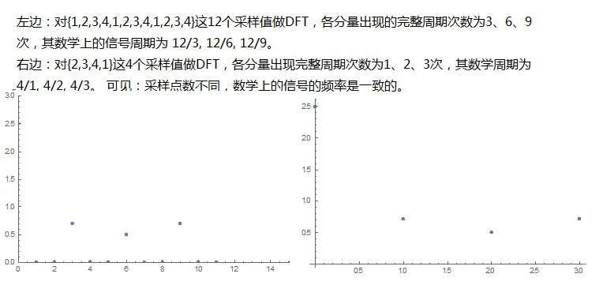

