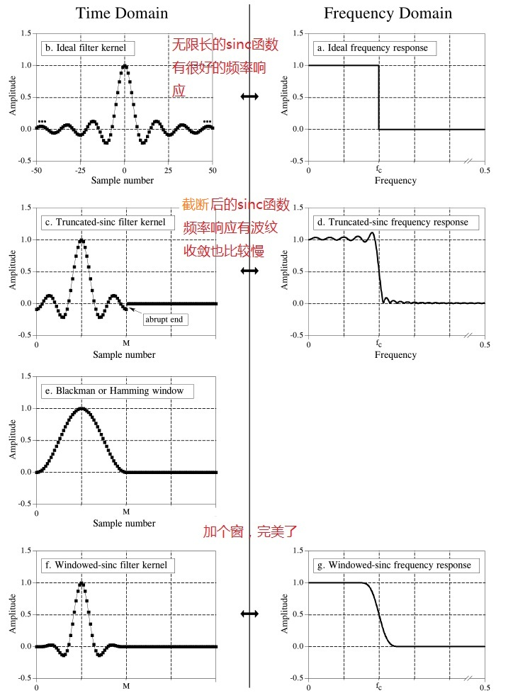
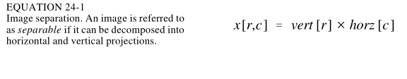
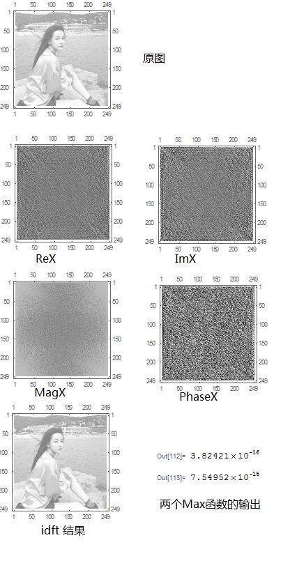
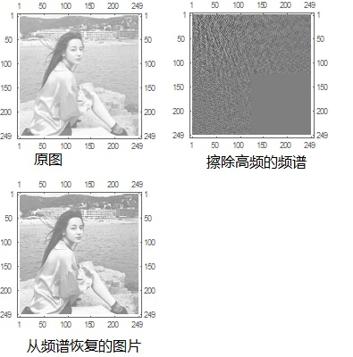

原书标题是 the scientist and engineers guide to digital signal processing

是一本开源的书，官网上可以下载到：http://dspguide.com/

# 第一章：数字信号处理的广泛用途 #

我们研究的信号，通常是一个时间序列的变量，可以使离散的，也可以是连续的。信号也可以是时间以外的自变量的因变量。

一个信号经过一个系统，输出为另外一个信号。

# 第二章：统计、概率和噪声 #

生成正态分布的随机数的两个方法：

方法一：基于中心极限定理累加

1. 生成12个[0,1]之间均匀分布的随机浮点数，将他们累加得到v
2. v减去6，使得随机数均值为0，此时标准差为1
3. v乘以目标正态分布的标准差
4. v加上目标正态分布的均值

方法二：基于公式

1. 生成2个[0,1]之间均匀分布的随机浮点数R和Q
2. 计算v=（-2log(R))^(0.5)  * cos(2Pi*Q)

# 第三章：ADC和DAC #

主要是讲量化和采样。

重点是奈奎斯特采样定理，见另外一篇专门的文章：

[奈奎斯特采样定理的理解.md](奈奎斯特采样定理的理解.md)

# 第四章：DSP软件 #

主要是讲浮点数的舍入误差问题。

由于计算机是使用有限的状态位（例如float用32bit）来表示状态数为无限个的一定范围的实数，所以运算过程中会经常出现把一个实数值舍入到某个状态，从而引入了舍入误差。

具体的一些性质可以参考：

[IEEE754标准](https://en.wikipedia.org/wiki/IEEE_754)

[单精度浮点数](https://en.wikipedia.org/wiki/Single-precision_floating-point_format)

[双精度浮点数](https://en.wikipedia.org/wiki/Double-precision_floating-point_format)

[试验代码](https://github.com/bisonliao/daydayup/blob/master/acm/float.c)

# 第五章：线性系统 #

线性系统的几个特征：

1. 同质性（我感觉叫可乘性比较好）：输入X，输出Y，如果输入aX，a是常数，则输出aY
2. 可加性：输入X1，输出Y1，输入X2，输出Y2，如果输入X1+X2，则输出Y1+Y2
3. 时移不变性：（通常是基于时间的）输入信号平移一个常量，输出信号也对应的会平移一个常量
4. 静态保持性：输入是一个常量信号，输出也是一个常量信号
5. 正弦保持新：输入是正弦波，输出也是同频率的正弦波，只是相位和幅度可能改变

DSP的基本思路：将复杂信号分解为多个简单信号，这些分量通过线性系统变化后的输出信号，叠加起来等于复杂输入信号的输出

1. 输入信号X分解为一组分量x1,x2,...
2. 这些分量通过线性系统，输出为一组y1,y2,...
3. 将y1，y2,...这些输出分量叠加得到Y，Y就是X通过线性系统的输出

将一个信号分解的方法：

1. 脉冲分解：把长度为n的时间序列的信号看做n个对应时间点上的脉冲信号的叠加
2. 傅里叶分解：把信号看做是非常多频率的正弦波信号的叠加。任意N个点的离散信号，可以分解为N+2个信号， 其中一半是正弦，另外一半是余弦。
3. 步进分解
4. 奇偶分解
5. 交错分解

前面两种分解是特别重要的。

# 第六章：卷积 #

第六章暂时只讨论离散信号。

几个概念：

1. 单位脉冲：也叫delta函数，时间点第一个位置的信号值为1，其他都为0
2. 脉冲响应：单位脉冲经过一个线性系统后的输出
3. 任一脉冲信号可以看做是单位脉冲经过时移和缩放后得到的脉冲信号，所以其经过一个线性系统后的输出信号，可以由该系统的脉冲响应做对应的时移和缩放得到。
4. 同理，任一信号经过一个线性系统后的输出信号：  a）输入信号X分解为多个脉冲信号P1,P2,P3...，根据系统的脉冲响应，做相应的时移和缩放，得到输入信号的分量的对应输出信号O1,O2,O3....。   b）将O1，O2，O3...叠加，就得到X信号经过系统后的输出信号Y
5. 上面的这个过程就是卷积，该系统的脉冲响应也叫做卷积核，或者叫做核。

下图是一个例子：

使用mathematica软件验算一下：

	ClearAll["Global`*"];
	input = {0, -1, -1.2, 2, 1.4, 1.4, 0.6, 0, -0.6, 0, 0, 0};
	kernel = {1, -0.5, -0.3, -0.1};
	output = ListConvolve[kernel, input, 1];
	ListPlot[output]

输出的output同y[n]：

需要稍微注意一下：mathematica的ListConvolve函数，计算方式会与教材不一致，边界的处理上有些不同。  所以要第三个参数指定为1，且input后面补一些0。

卷积可以从输入侧和输出侧两个视角做物理上的理解。

## 输入侧视角来理解卷积 ##

输入侧视角，把卷积理解为 卷积核（系统的脉冲响应）的多次时移和缩放后的信号的叠加。

例如有输入信号X[n]，由9个离散的值组成：X(0),X(1),X(2)...X(8)，每个值都作用于卷积核，得到一个输出信号y，总共得到有9个输出信号，叠加起来得到输入信号。

假设X[4]等于1.4，X(4)=1.4*Delta[n-4]，即X[4]是单位脉冲时移4并缩放1.4倍。X[4]经过系统后产生一个输出信号y(4)，y(4)就是卷积核时移4并缩放1.4倍。同理有y(0),y(1)...y(8)，他们叠加起来就是X和系统的脉冲响应卷积的结果。

卷积操作在数学上是满足交换律的。

## 输出侧视角来理解卷积 ##

还是上面的例子，有输入信号X[n]，由9个离散的值组成， 卷积核宽度为4，即有4个离散值组成，输出将会有12个值（9+4-1）。从输入侧的视角来看，卷积核会不断时移，也就是像个窗口一样在输出信号的时间轴上一步一步向右移动。

对于具体的一个输出信号的取值，例如y(6)，它是有哪些值叠加产生的呢？ 当卷积核经过y(6)所在位置的时候，都会贡献分量给它，当卷积核窗口没有和y(6)位置重合的时候，输出分量取值都是0.

所以，输出信号的某个时间点取值y(i)，是翻转后的卷积核与X(i-M+1),...,X(i)这些值相乘再累加的结果。卷积核不断的右移，不断的产生出y(i)。M是卷积核大小。

有公式：

	y(i) = SUM( h(j) * X(i-j)， j from 0 to M-1）

# 第七章：卷积的一些性质 #

一个线性系统的特性，可以认为完全由它的脉冲响应（卷积核）决定和表现，这是数字信号处理的基础。数字滤波器就是不同的卷积核，不同的卷积核，对输入信号的处理有不同的性质表现。

卷积核是一个单位脉冲信号：该滤波器表现为将输入信号原样输出，x(n) * h(n) = x(n)

卷积核是一个缩放过的单位脉冲信号：信号放大器、信号衰减器，x(n) * k h(n) = k x(n)

卷积核是一个时移的单位脉冲信号：信号延时器

一阶差分器和积分器：

它们是互为逆操作：

低通滤波器：卷积核通常由一组连续的整数点组成，卷积操作是对输入信号附近的值做加权平均，从而平滑掉高频分量。

高通滤波器：卷积核通常由一个单位脉冲信号减去一个低通滤波器得到。可以理解为从原信号中减去低频部分，就剩下高频部分了。

因果系统：输入信号的某个时间点的值，值影响该时间点及其以后的输出信号的值，即卷积核的负时间点坐标上的值都为0（数学上完全可以存在负时间点坐标上的值不为0的卷积核）。

零相位：如果一个信号的一系列值在横坐标0左右对称，则称为零相位的

线性相位：如果一个信号的一系列值在横坐标某个点左右对称，则称为线性相位

这两个概念在这章比较费解，不直观，后面DFT学了之后就直观了。

卷积在数学上的一些属性：

1. 满足交换律
2. 满足结合律
3. 满足分配率
4. 输入输出的传递性：在输入上施加操作后经过一个系统，该操作也会在输出信号上体现出来。例如对一个输入信号施加时移、缩放、积分、求导，经过一个系统后的输出信号，也等于在原输出信号上施加时移、缩放、积分、求导的结果。  时移、缩放好理解，是线性系统的定义决定的。积分和求导也可以，比较新奇。
5. 中心极限定理效应：一个“脉冲形状”的输入信号，反复与自己卷积，最后的结果是一个“正态分布形状”的信号

中心极限定理效应比较有意思，用mathematica软件可以试验一下。注意：为了让卷积核这个窗口在信号左右两边都滑动到位，试验的时候需要给输入信号两边都加一些0.0的个数等于卷积核长度减去1.

	ClearAll["Global`*"];
	K = {1, 2, 2, 1};
	input = {0, 0, 0, 1, 2, 2, 1, 0, 0, 0};
	input = ListConvolve[K, input]

上述代码输出为

	{1, 4, 8, 10, 8, 4, 1}

可以看到比input一开始更接近正态分布形状。

继续：

	input = {0, 0, 0, 1, 4, 8, 10, 8, 4, 1, 0, 0, 0};
	input = ListConvolve[K, input]

输出为：

	{1, 6, 18, 35, 48, 48, 35, 18, 6, 1}

如此反复多次，可以得到input的形状如下：

实际上输入信号一开始的形状也可以随意一点，例如

	ClearAll["Global`*"];
	K={1,4,6,8};
	input={0, 0, 0, 1, 4, 6, 8, 0, 0, 0};
	input=ListConvolve[K,input]

经过几次卷积后，形状也逼近正态分布：

# 第八章：离散傅里叶变换（DFT） #

一个信号，分解为一组分量叠加的形式，可以有无数种方法，例如前面提到的脉冲分解、步进分解等。而傅里叶变换，把信号分解为一组不同频率的正弦波叠加的形式。是因为正弦波经过一个线性系统后，还是同频率的正弦波，只有相位和幅度发生变化。而其他形状的分量则没有这么利于分析的性质。

严格来说，对于连续的信号，在不可导点，傅里叶变化不能精确与原信号相等，但可以尽量逼近。而对于一个个离散的信号值，则没有这样的问题。

傅里叶变换簇有四种情形：

1. 对周期的连续信号进行分解，称为傅里叶级数（FS）。
2. 非周期的连续信号进行分解，称为傅里叶变换（FT）。例如高斯函数、指数函数等
3. 对周期的离散信号进行分解，称为离散傅里叶变化（DFT）。通常我们拿到一组有限个数的离散值做DFT，似乎不是周期的，实际上在变换的时候，约定俗成将这组离散值向时间轴两侧做周期性重复扩展。本章讨论的就是这种情形。
4. 对非周期的离散信号进行分解，称为离散时间傅里叶变换（DTFT）。

这四种情形的变换，处理的信号都是在时间轴的负无穷到正无穷范围内的。怎么理解，例如对于情形3，前面已经说了，要“想象”为周期性的重复扩展；对于情形4和情形2，没有明确定义的时间轴上的值，要“想象”为0。

mathematica软件也有一组函数对应上述四种情形：

本章集中阐述DFT是实数DFT，预算结果与mathematica的Fourier函数的结果不一样，Fourier函数是复数DFT，这两者的差异和关系将在第十二章讲。

用Fourier函数计算DSP的复数DFT时，要特别注意将FourierParameters这个参数设置为{1,-1}：

实数DFT可以认为是这样一个系统：

1. 输入N个离散点组成的信号x[n]，n取值为0到N-1.
2. 输出为有 N/2 + 1 个实部和虚部变量ReX[k]和ImX[k]，k取值为0到N/2.
3. ReX[k]/ImX[k]被称为x[n]的频域信号，x[n]被称为时域信号

输入输出的关系是：

实部是对应Cos分量的幅度，虚部是对应Sin分量的幅度。这些分量叠加起来，即可合成x[n]。公式里的X上面加了一横，与X有直接关系。具体关系公式不抄录了。

下面是mathematica代码实现的上述版本的DFT：

	ClearAll["Global`*"];
	input = {1, 2, 3, 4, 5, 6, 7, 8};
	NUM=Length[input];
	ReX[k_] = Sum[ Extract[input, i + 1]*Cos[2 Pi/NUM * k * i], {i, 0, NUM-1}];
	ImX[k_] = -Sum[    Extract[input, i + 1]*Sin[2 Pi/NUM * k * i], {i, 0, NUM-1}];
	ReXX[k_] = If[k == 0||k==NUM/2, ReX[k]/NUM, ReX[k]/NUM * 2];
	ImXX[k_] = -ImX[k]/NUM *2;
	INPUT[i_] =  Sum[ReXX[k] *Cos[2 Pi/NUM*k*i], {k, 0, NUM/2}] +   Sum[ImXX[k]*Sin[2 Pi/NUM * i * k], {k, 0, NUM/2}];
	Table[INPUT[i], {i, 0, NUM/2}]//N

可以看到，最后输出的INPUT值和input值是一致的。

需要注意的是，实数FT可以这样理解，但后面第三十章提到的复数FT，分量就不是Cos和Sin，而是一个复数，每个分量都是cos+j*sin的形式。

c代码实现版本：

[code/dsp/dft.c](code/dsp/dft.c "dft.c")

我感觉这些分量有两个“频率”，一个是数学上的正弦波的周期和频率，一个是DFT中通常说的频率： 

假设输入的离散信号的采样点个数 NUM = 1000， DFT的第k个分量的 k = 100, 对应的正弦波分量有 Cos[ 2Pi / 1000 * 100 * i]和Sin[2Pi / 1000 * 100 * i]， 当i从0到10范围内，出现一个完整的周期，如果采样点间隔时间是1s，则从数学上看这个波的频率是1/10，但DFT中通常不这么说，而是看这个波在0到NUM个点范围内出现了几个完整周期，0到10一个完整周期，10到20又一个完整周期... 那么0到NUM（NUM这里等于1000） 范围内就会出现100个完整周期，通常说这个分量的频率是100. 

**规律就是k等于多少，这个分量的频率就是多少。 进一步的，有N个点，DFT结果的分量频率范围是从1到N/2（第二个版本是N）**。

那取点数NUM的多少会不会影响各分量的频率？ 答案是会影响DFT所说的频率，但数学上的频率还是一样的。例如下面对同一个周期离散信号采样不同的个数的对比：

**实验一：验证一下一个正弦波的采样点的频谱图是不是刚好一个脉冲？**

实验如下：

	ClearAll["Global`*"];
	input = Table[ Sin[x], {x, 0, 4Pi, 0.6}];
	NUM = Length[input];
	ReX[k_] = Sum[Extract[input, i + 1]*Cos[2Pi/NUM*k*i], {i, 0, NUM - 1}];
	ImX[k_] = -Sum[Extract[input, i + 1]*Sin[2Pi/NUM*k*i], {i, 0, NUM - 1}];
	ReXX[k_] = If[k == 0 || k == NUM/2, ReX[k]/NUM, ReX[k]/NUM*2];
	ImXX[k_] = -ImX[k]/NUM*2;
	INPUT[i_] = Sum[ReXX[k]*Cos[2Pi/NUM*k*i], {k, 0, NUM/2}] +   Sum[ImXX[k]*Sin[2Pi/NUM*i*k], {k, 0, NUM/2}];
	ListPlot[   Table[  Sqrt[ReXX[k] * ReXX[k] + ImXX[k]*ImXX[k]], {k, 0, NUM/2 - 1}]，PlotRange -> All]

输出如下：

提醒：由于各值之间相差悬殊，上面代码ListPlot函数的PlotRange参数尤其重要，否则显示很奇怪会误导。另外ListPlot打的第一个点x轴是1不是0，和程序中的下标k不一致，k是从0开始。

进一步算一下频率是否对。假设上面的Sin信号的频率是2Hz，那么1秒内有2个周期。采样点是对4Pi也就是1s时长的信号采样21次，即采样频率是21Hz。频谱显示在k=2，也就是2/21 * 21 = 2Hz，所以符合预期。 

**实验二：两个同频率的Sin函数，他们差异只是时移，叠加产生的输入信号，DFT后的频谱是怎样的？**

**实验三：两个频率相差很细微的Sin函数，假设频率分别是41和43，一开始相位是一致的，随着时间推移，相位差异越来越大，叠加出来的信号频率应该下降了。 采样和DFT需要注意什么**

## 极坐标表达形式 ##

前面所用的ReX[k]和ImX[k]的方式，被称为直角坐标表达方式，同一频率的实部和虚部分别是Cos和Sin正弦波的幅度，叠加起来表现是一个正弦波。根据   ACos(x) + BSin(x) = M Cos(x+θ) 可得到叠加后的正弦波幅度和相位偏移,这种表达方式称为极坐标表达形式：

	MagX[k] = (ReX[k] ^ 2 + ImX[k] ^ 2) ^ 0.5
	PhaseX[k] = θ = arctan(ImX[k]/ReX[k])

反向的转化公式：

	ReX[k] = MagX[k] * Cos( PhaseX[k] )
	ImX[k] = MagX[k] * Sin( PhaseX[k] )

# 第九章：DFT的应用 #

最主要的应用当然是分析信号的频谱。

**线性系统的频率响应（frequence response）**

任何输入信号都可以表示为一组正弦波的叠加，经过一个线性系统后，这些正弦波频率不变，只是幅度和相位发生变化，然后叠加得到输出信号。线性系统对经过它的正弦波的改变性质，称为该系统的频率响应。

线性系统的频率响应，也就是它的脉冲响应的DFT结果。

这么来理解，想象一下：

1. 一个脉冲信号，经过一个线性系统，输出是该系统的脉冲响应。这是时间域的卷积。 
2. 频域的一个脉冲信号，其时间域对应的是一个正弦波。正弦波经过线性系统，频率不变，相位和幅度发生变化，这里的变化属性，就应该和脉冲响应的频域有关，也就是脉冲响应的DFT结果。

为了提高线性系统频率响应的结果分辨率，可以将脉冲响应左右增加足够多的0，当左右时间轴全都是0的时候，周期信号变成了非周期信号，DFT演化成了DTFT，傅里叶变换的结果也从离散频谱变成了连续的频谱。

前面的试验可以发现，对一个连续信号更密集的采样，即增大DFT处理的输入样本的个数N，也能让频谱有更高的分辨率。但这里不要妄想对脉冲响应做更密集的采样，因为脉冲响应就是一个离散信号，没法更密集的“采样”。

一个输入信号x(n)，经过一个线性系统，其脉冲响应是h(n)，输出信号是两者的卷积：y(n) = x(n)*h(n)

对应的，我们可以吧输入信号和脉冲响应都做DFT，得到X(n)和H(n)，两者相乘后做IDFT，可得到y(n)。

这么乘：

我的验证结果似乎不符合预期，不知道问题出在哪里（在第十八章有ok的试验，这个失败的试验也保留着，可能是右边0的问题）：

直接卷积的结果：

	ClearAll["Global`*"];
	input={1,-1,1,-1};
	input2={0,0,0,1,-1,1,-1,0,0,0};
	resp={1,2,3,4};
	ListConvolve[resp,input2]

输入信号DFT：

	input={1,-1,1,-1};
	NUM=Length[input];
	ReX[k_]=Sum[Extract[input,i+1]*Cos[2 Pi/NUM*k*i],{i,0,NUM-1}];
	ImX[k_]=-Sum[Extract[input,i+1]*Sin[2 Pi/NUM*k*i],{i,0,NUM-1}];
	RX=Table[ReX[k], {k,0,NUM/2}];
	IX=Table[ImX[k], {k, 0, NUM/2}];

卷积核做DFT：

	input={1,2,3,4};
	NUM=Length[input];
	ReX[k_]=Sum[Extract[input,i+1]*Cos[2 Pi/NUM*k*i],{i,0,NUM-1}];
	ImX[k_]=-Sum[Extract[input,i+1]*Sin[2 Pi/NUM*k*i],{i,0,NUM-1}];
	RH=Table[ReX[k],{k,0,NUM/2}];
	IH=Table[ImX[k],{k,0,NUM/2}];

两者相乘：

	RY = RX * RH - IX * IH;
	IY = IX * RH + RX * IH;

	（*
	RY=Table[Extract[ RX,k+1]*Extract[RH, k+1]-Extract[IX,k+1]*Extract[IH,1+k], {k, 0, NUM/2}];
	IY=Table[Extract[ IX,k+1]*Extract[RH, k+1]+Extract[RX,k+1]*Extract[IH,1+k], {k, 0, NUM/2}];
	*）

逆变换：

	NUM=4;
	ReXX[k_]=If[k==0||k==NUM/2,Extract[RY,1+k]/NUM,Extract[RY,1+k]/NUM*2];
	ImXX[k_]=-Extract[IY,1+k]/NUM*2;
	INPUT[i_]=Sum[ReXX[k]*Cos[2 Pi/NUM*k*i],{k,0,NUM/2}]+Sum[ImXX[k]*Sin[2 Pi/NUM*i*k],{k,0,NUM/2}];
	Table[INPUT[i],{i,0,NUM-1}]//N

# 第十章：傅里叶变换的属性 #

## 傅里叶变换的线性性质 ##

1. 可乘：if x[] <-> X[], then kx[] <-> kX[]，即幅度伸缩k倍，而相位角不变
2. 可(叠)加：if x1[n] + x2[n] = x3[n]， then ReX1[f] + ReX2[f] = ReX3[f] 且 ImX1[f] + ImX2[f] = ImX3[f]

## 相位角的特性 ##

时间域的信号时移对相位角的影响：

	if x[n] <-> MagX[f] & PhaseX[f]， 
	then x[n+s] <-> MagX[f] & PhaseX[f] + 2Pi*s*f, 其中f采用0到0.5这种小数比值表示法

可以通过mathematica简单验证一下：

	ClearAll["Global`*"];
	input={1,2,3,4,5,6,7,8,0,0,0,0};
	NUM=Length[input];
	ReX[k_]=Sum[Extract[input,i+1]*Cos[2 Pi/NUM*k*i],{i,0,NUM-1}];
	ImX[k_]=-Sum[Extract[input,i+1]*Sin[2 Pi/NUM*k*i],{i,0,NUM-1}];
	MagX[k_]=(ReX[k]*ReX[k]+ImX[k]*ImX[k])^0.5;
	PhaseX[k_]=ArcTan[ReX[k],ImX[k]];
	P1 = Table[PhaseX[k],{k,0,NUM/2}];

	input={0,1,2,3,4,5,6,7,8,0,0,0};
	NUM=Length[input];
	ReX[k_]=Sum[Extract[input,i+1]*Cos[2 Pi/NUM*k*i],{i,0,NUM-1}];
	ImX[k_]=-Sum[Extract[input,i+1]*Sin[2 Pi/NUM*k*i],{i,0,NUM-1}];
	MagX[k_]=(ReX[k]*ReX[k]+ImX[k]*ImX[k])^0.5;
	PhaseX[k_]=ArcTan[ReX[k],ImX[k]];
	P2=Table[PhaseX[k],{k,0,NUM/2}];

	（*P1 = P1 + {0,0,0,0, 2Pi, 0,0};*）
	
	(P1-P2)/(2Pi) * NUM//N

输出中有一个数字不符合预期：-8。这是因为相位角有个2Pi的周期差导致的。即P1[4]绝对值比较大，相当于 2Pi * k + θ，就只保留了θ，所以代码里手工修正了一下， 见倒数第二行的注释。

	{0., 1., 2., 3., -8., 5., 6.}

如果输入信号在横坐标0的位置左右对称，DFT后相位是0，这个就是**零相位信号**，这类信号的特征是：虚部都为0。

mathematica验证如下，注意ReX ImX计算公式里的i的区间值不是0到NUM-1， 而是从-OFFSET开始了：

	ClearAll["Global`*"];
	input={1,2,3,4,5,6,5,4,3,2,1};
	NUM=Length[input];
	OFFSET=5;
	ReX[k_]=Sum[Extract[input,i+OFFSET+1]*Cos[2 Pi/NUM*k*i],{i,-OFFSET,NUM-OFFSET-1}];
	ImX[k_]=-Sum[Extract[input,i+OFFSET+1]*Sin[2 Pi/NUM*k*i],{i,-OFFSET,NUM-OFFSET-1}];
	MagX[k_]=(ReX[k]*ReX[k]+ImX[k]*ImX[k])^0.5;
	PhaseX[k_] = ArcTan[ ReX[k], ImX[k]];
	Table[ PhaseX[k], {k, 0, NUM/2}]//N
	

上面代码中的信号0采样点的值由6改为1就不对了，这时候实部有正有负，虚部为0， 所以相位角有0有Pi。但书里面没有提这种情况，作者直接用ArchTan[ImX[k]/ReX[k]]求相位角，可以看到：当虚部为0的时候，实部有正有负、相位角有0有Pi的这个情况被这个公式掩盖了。这个也会进一步影响到后面的线性相位，导致不是一条直线。

如果输入信号是左右对称的，但是不是以横坐标0为对称中心点， 这种情况下具有线性相位，这类信号称为**线性相位信号**。

我理解这种情况下，输入信号可以当做由零相位信号进行时移后得来的，那自然是在0相位的基础上+2Pi*f*t， 这是一个f的线性函数，所以线性相位信号DFT后的相位是一条直线。

特别需要注意的是，用mathematica代码验证线性相位，可能看到相位不是一条直线，这是因为相位角有个2Pi的周期差导致的。即本来是一条直线，但到了后面因为绝对值比较大，相当于 2Pi * k + θ，就只保留了θ，导致图形上不是一条直线，所以代码里手工修正了一下。越到图形的右边，可能还需要减去4Pi甚至6Pi呢。

	ClearAll["Global`*"];
	input={1,2,3,4,5,6,5,4,3,2,1};
	NUM=Length[input];
	OFFSET=3;
	ReX[k_]=Sum[Extract[input,i+OFFSET+1]*Cos[2 Pi/NUM*k*i],{i,-OFFSET,NUM-OFFSET-1}];
	ImX[k_]=-Sum[Extract[input,i+OFFSET+1]*Sin[2 Pi/NUM*k*i],{i,-OFFSET,NUM-OFFSET-1}];
	MagX[k_]=(ReX[k]*ReX[k]+ImX[k]*ImX[k])^0.5;
	PhaseX[k_]=ArcTan[ReX[k],ImX[k]];
	P=Table[PhaseX[k],{k,0,NUM/2}]//N
	P=P-{0,0,0,2Pi,2Pi,2Pi};(* modify the chart by hand*)
	ListLinePlot[P, PlotRange->All]

## 紧缩和膨胀 ##

DFT前后，一个域的信号越紧缩，对应另外一个域的信号就越膨胀。即： 
	
	if x(t) <-> X(f)， 
	then x(kt) <-> 1/k X(f/k)

## 调幅 ##

傅里叶变换很重要的一个特征是，在一个域的卷积，对应在另外一个域的乘法。前面提到时间域的卷积，对应频域的乘法，反之也是这样。

时间域的乘法，对应在频域的卷积，有个很重要的应用就是调幅，例如收音机信号的AM调制。如下图所示：

写一段mathematica代码演示一下：

	ClearAll["Global`*"];
	sampleX=Range[0, 10, 0.01]; (*1000 samples*)
	input=Table[ (Sin[20t]+1.5)/(t+1), {t, sampleX}]; (*audio signals*)
	input1 = input;
	ListLinePlot[input1]
	NUM=Length[input];
	OFFSET=0;
	ReX[k_]=Sum[Extract[input,i+OFFSET+1]*Cos[2 Pi/NUM*k*i],{i,-OFFSET,NUM-OFFSET-1}];
	ImX[k_]=-Sum[Extract[input,i+OFFSET+1]*Sin[2 Pi/NUM*k*i],{i,-OFFSET,NUM-OFFSET-1}];
	MagX1[k_]=(ReX[k]*ReX[k]+ImX[k]*ImX[k])^0.5;
	PhaseX1[k_]=ArcTan[ReX[k],ImX[k]];
	M1 = Table[MagX1[k], {k, 0, NUM/2}];
	
	
	input=Table[ Sin[100t], {t, sampleX}]; (*carrier*)
	input2 = input;
	ListLinePlot[input2]
	NUM=Length[input];
	OFFSET=5;
	ReX[k_]=Sum[Extract[input,i+OFFSET+1]*Cos[2 Pi/NUM*k*i],{i,-OFFSET,NUM-OFFSET-1}];
	ImX[k_]=-Sum[Extract[input,i+OFFSET+1]*Sin[2 Pi/NUM*k*i],{i,-OFFSET,NUM-OFFSET-1}];
	MagX2[k_]=(ReX[k]*ReX[k]+ImX[k]*ImX[k])^0.5;
	PhaseX2[k_]=ArcTan[ReX[k],ImX[k]];
	M2 = Table[MagX2[k], {k, 0, NUM/2}];
	
	input = input1 * input2; (*modulate*)
	ListLinePlot[input]
	NUM=Length[input];
	OFFSET=5;
	ReX[k_]=Sum[Extract[input,i+OFFSET+1]*Cos[2 Pi/NUM*k*i],{i,-OFFSET,NUM-OFFSET-1}];
	ImX[k_]=-Sum[Extract[input,i+OFFSET+1]*Sin[2 Pi/NUM*k*i],{i,-OFFSET,NUM-OFFSET-1}];
	MagX3[k_]=(ReX[k]*ReX[k]+ImX[k]*ImX[k])^0.5;
	PhaseX3[k_]=ArcTan[ReX[k],ImX[k]];
	M3 = Table[MagX3[k], {k, 0, NUM/2}];
	
	ListLinePlot[ M1, PlotRange->All]
	ListLinePlot[ M2, PlotRange->All]
	ListLinePlot[ M3, PlotRange->All]

这章还讲了DTFT公式、帕萨瓦尔能量公式。

# 第十一章：傅里叶变换对子 #

傅里叶变换前后，信号的波形彼此对应，例如 sin信号经DFT后是一个脉冲，这样的一对波形叫做傅里叶变换对子。而且两者交换后也成立。

但因为DFT后有实部、虚部、幅度、相位四个变量的波形，在研究傅里叶变换对子的时候，通常要明确指出是哪个变量。

常见的傅里叶变换对子有：

1. 时间域脉冲对应常数波形的频域幅度（正弦波形的实部和虚部， 相位是一条直线）
2. 时间域的方波脉冲对应sinc波形的频域幅度（相位是一条直线）
3. 时间域的三角波脉冲对应sinc平方的频域幅度
4. 时间域的高斯函数和高斯冲击都对应高斯函数的频域幅度
5. 一个sample构成的信号的DFT就是它本身。

本章还讲了吉布斯效应、谐波、线性调频。 

# 第十二章：快速傅里叶变换 #

FFT是DFT的计算复杂度改善版本，是基于复数DFT的。

我们可以借助复数DFT来计算实数DFT，从而利用FFT快速计算的能力：

1. 将实数的时间信号填写到复数DFT的时间域信号的实部， 虚部都填0
2. 计算复数DFT
3. 取计算结果的实部和虚部的前[0,N/2]部分的值，即为实数DFT的结果

反向DFT也可以如此：

1. 将实数DFT频域的实部和虚部分别填写到复数DFT频域的实部和虚部的[0, N/2]部分
2. 余下的(N/2, N)部分，是将[1, N/2]部分翻转后(虚部还要乘以-1)平移再填入，而且这部分长度和N的奇偶性有关，具体细节找个例子研究一下，或者看一下第十八章的笔记中的代码。
3. 计算复数的IDFT
4. 取计算结果的实部即为实数IDFT的结果，这时计算结果的虚部应该为0.

FFT的主要思想，就是把长度为N的复数DFT（其复杂度为O(N^2)），拆分为两个长度为N/2的复数DFT，则其复杂度降低为 N+（N/2)^2， 进一步的拆分更多更短的DFT（最后是拆分为N个长度为1的DFT），计算复杂度可以降低到 O(nlogn)。

# 第十三章：连续信号处理 #

据作者的观点，连续信号的处理，是与DSP并行的一个领域。且几乎所有技术与思想都很相似：卷积、线性系统、傅里叶变换、分解与叠加。

## Delta 函数 ##

对应离散信号里的单位脉冲信号，连续信号处理领域有个Delta函数，它的定义是：

1. 这个信号在t=0处非零且无限窄，在t的其他位置为0
2. 这个信号的面积为1

同样的，一个线性系统的特性完全由它对Delta函数的响应决定，也就是脉冲响应。

## 连续信号的卷积 ##

连续信号的卷积的物理意义就是：将输入信号拆解为无数多个被缩放和时移的Delta函数。每个缩放、时移后的Delta函数经过线性系统，产生无数多个被缩放和时移的脉冲响应。这些脉冲响应叠加起来，就是卷积的结果，即输入信号经过系统后的输出。

一个mathematica演示的例子：

	ClearAll["Global`*"];
	x[t_]=If[t>=0&&t<=1,1,0];
	h[t_]=If[t<=0,0,E^(-t)];
	Plot[{x[t], h[t]}, {t, -3, 3}]
	y[t_]:=Integrate[x[s]*h[t-s],{s,-10000,10000}];
	(*Infinity cause crash,so change it to 1000000*)
	Plot[y[t],{t,-10,10},PlotRange->All]

## 连续信号的傅里叶变换和傅里叶级数 ##

连续非周期实数函数的傅里叶变换，类似DFT，有：

搞一段代码试一试：

	ClearAll["Global`*"];
	x[t_]=If[t<=0,0,E^(-t)];
	ReX[w_] = Integrate[ x[t]*Cos[w*t], {t, -Infinity, Infinity}];
	ImX[w_] = -Integrate[ x[t]*Sin[w*t],{t, -Infinity, Infinity}];
	
	
	xx[t_] = 1/Pi * Integrate[ ReX[w]*Cos[w*t]-ImX[w]*Sin[w*t], {w, 0, Infinity}];
	Plot[{xx[t], x[t]}, {t, -2, 3}]

结果没有问题，xx和x的曲线吻合，就是运行时间比较长。

连续周期信号展开为傅里叶级数：

# 第十四章：滤波器简介 #

这章简单介绍滤波器，后面连续7、8章都是讲滤波器，好恐怖。

滤波器通常的作用有：平滑信号、去除DC分量、去噪、分离信号中的某些频率分量等等。有模拟滤波器和数字滤波器。这里集中讲数字滤波器。

滤波器的实现，最直观的方法就是卷积，即将输入信号与一个线性系统的脉冲响应做卷积，通过设计卷积核来达到滤波器的设计与实现。

除此之外，还有一个钟设计方法是递归，大概就是把输出信号作为输入信号再次经过滤波器。这种滤波器的脉冲响应的特征是无线长度的正弦波，其幅度向右侧不断的做指数衰减。例如一个移动平均过滤器，用卷积的思想设计是：

	y[50] = (x[47] + x[48] + x[49] + x[50] + x[51] + x[52] + x[53]) / 7
	y[51] = (x[48] + x[49] + x[50] + x[51] + x[52] + x[53] + x[54]) / 7

那么用递归的思想设计是：

	y[51] = y[50] + (x[54] - x[47]) / 7

通常这样设计的滤波器运算更快。

每个线性滤波器都有脉冲响应、频率响应（前面章节提到过）、步长响应。每一个都完全体现了线性滤波器的特征。且三者有对应关系：脉冲响应的DFT就是频率响应，脉冲响应的离散积分就是步长响应，它体现的是一个单位阶跃信号经过系统后的输出。在滤波器这里有个新的名字：叫做过滤器核。

单位阶跃信号刚好也是单位脉冲信号的离散积分，这体现了线性系统卷积运算的特性：对输入信号积分和微分，经过卷积，输出结果为原输出信号的积分和微分。

顺便提到了分贝，这个最傻逼的度量方式：

1. 分贝通常用来度量两个物理量的比值，dB=20\*Log(v1/v2)， 底数是10。 
2. 但有的地方又定义为 dB=10\*Log(v1/v2)。 20的定义更常见。
3. 有时候分贝又用来度量单个物理量的幅度或者能量，例如声音，转化为分贝后在坐标轴上可以看得更清楚。
4. 反正就是这么记忆：60dB表示1000倍，40dB表示100倍，20dB表示10倍，0dB表示1倍，-20dB表示0.1倍，-40dB表示0.01倍...

## 四种常见的滤波器 ##

四种常见的滤波器：低通滤波器、高通滤波器、带通滤波器、带阻滤波器。

前面提到过：脉冲响应可以通过在时间轴两边补0的方式，已达到更多任意采样数的目的。采样数越多，其频率响应就越高分辨率，从而获得更精致的滤波器。而脉冲响应两侧补0不会影响卷积的正确性。

高通滤波器、带通滤波器、带阻滤波器，都可以基于低通滤波器来构造。

高通滤波器可以使用一个全通滤波器（脉冲反馈为一个单位脉冲）减去一个低通滤波器。其实前面章节也提到过这种方法。

带通滤波器可以通过并联低通滤波器和高通滤波器实现，两者的通过的频谱范围有叠加，：

带阻滤波器类似的，只是低通滤波器和高通滤波器通过的频谱范围没有叠加，中间的gap就是被阻碍的带宽：

这里只提到了滤波器的幅度的关系，那相位的要求是怎样的呢？

构造过程中，用来做加减、卷积的已知子滤波器，他们的相位必须一致，否则不能直接加减和卷积。所以要求这些子滤波器的脉冲响应都是零相位或者线性相位的信号，即都对齐某个时间点左右对称。

## 滤波器的分类 ##

# 第十五章：移动平均过滤器 #

移动平均过滤器，主要用来去除随机噪声。它在频域的表现不好，不能很好的分离一定带宽的频率。

移动平均过滤器的近亲或者变种有：高斯过滤器、布莱克曼过滤器、多重移动平均过滤器。他们在频域有相对较好的表现，但是以更高的计算复杂度为代价的。

通常，一个过滤器在时间域有很好的表现，那么它在频域的表现就比较差。

举个去除随机噪声的例子：

	ClearAll["Global`*"];
	filter={1/11,1/11,1/11,1/11,1/11,1/11,1/11,1/11,1/11,1/11,1/11,0,0,0,0,0,0,0,0,0,0,0,0,0,0,0,0,0,0,0,0,0};
	
	input1=Table[Sin[t]+RandomReal[{-0.1,0.1}],{t,0,4Pi,Pi/50}];
	
	(*两次通过移动平均过滤器，只通过一次也可以较好的过滤噪声*)
	input=ListConvolve[filter,input1,1];
	input=ListConvolve[filter,input,1];
	
	(*对比卷积前后的信号*)
	ListLinePlot[{input1,input},PlotRange->All]

	(*检查过滤器的频率响应，DFT*)
	input=filter;
	NUM=Length[input];
	OFFSET=0;
	Print[NUM];
	ReX[k_]=+Sum[Extract[input,i+1+OFFSET]*Cos[2 Pi/NUM*k*i],{i,-OFFSET,NUM-1-OFFSET}];
	ImX[k_]=-Sum[Extract[input,i+1+OFFSET]*Sin[2 Pi/NUM*k*i],{i,-OFFSET,NUM-1-OFFSET}];
	MagX[k_]=(ReX[k]*ReX[k]+ImX[k]*ImX[k])^0.5;
	PhaseX[k_]=ArcTan[ReX[k],ImX[k]];
	Table[MagX[k], {k, 0, NUM/2}]//N
	ListLinePlot[ Table[MagX[k], {k, 0, 10}], PlotRange->All]

输出结果如下，可以看出它可以较好的过滤随机噪声，但不是一个漂亮的低通滤波器：

# 第十六章：加窗的sinc过滤器 #

加窗的sinc过滤器，是一个在频域表现很好的低通滤波器。它通过在时间轴上无限长的sinc函数乘以一个汉明窗或者布莱克曼窗，转化为时间轴上有限长的滤波器，以方便编程实现和卷积的运算。加窗还有利于消除滤波器频率响应里的异常波纹。

脉冲响应公式如下，可以看到右边方括号就是那个布莱克曼窗户：

写点代码试验一下低通效果：

	ClearAll["Global`*"];
	(*构造filter*)
	K=0.5;
	fc=0.02;
	M=200;
	wsf[i_]=If[i==M/2,2Pi*fc*K,K*Sin[2Pi*fc*(i-M/2)]/(i-M/2)(0.42-0.5Cos[2Pi*i/M]+0.08Cos[4Pi*i/M])];
	filter=Table[wsf[i],{i,0,M}];

	(*构造输入信号*)
	input1=Table[Sin[t]+Sin[3t]+RandomReal[{-0.1,0.1}],{t,0,4Pi,Pi/50}];
	input=ListConvolve[filter,input1,1];
	(*对比卷积前后的信号*)
	ListLinePlot[{input1,input},PlotRange->All]
	
	(*检查一下filter的频率响应*)
	input=Join[filter];
	NUM=Length[input];
	OFFSET=0;
	Print[NUM];
	ReX[k_]=+Sum[Extract[input,i+1+OFFSET]*Cos[2 Pi/NUM*k*i],{i,-OFFSET,NUM-1-OFFSET}];
	ImX[k_]=-Sum[Extract[input,i+1+OFFSET]*Sin[2 Pi/NUM*k*i],{i,-OFFSET,NUM-1-OFFSET}];
	MagX[k_]=(ReX[k]*ReX[k]+ImX[k]*ImX[k])^0.5;
	PhaseX[k_]=ArcTan[ReX[k],ImX[k]];
	Table[MagX[k],{k,0,NUM/2}]//N
	ListLinePlot[Table[MagX[k],{k,0,NUM/2}],PlotRange->All]
	ListLinePlot[Table[ 20Log10[MagX[k]],{k,0,NUM/2}],PlotRange->All]

上面的代码，假设采样频率是200hz，采样200个点，即1s钟的输入信号时长，输入信号由三部分组成：频率为2hz、6hz的谐波加上一些随机白噪声。 

滤波器的fc=0.02，预期0.02*200hz=4hz以上的高频都应该被过滤掉，而4hz一下的低频应该很好的保留。

运行效果如下：

# 第十七章：自定义的过滤器 #

如何制作一个任意频率响应的过滤器呢？  思路比较简单：

1. 用离散实数数组表示出想要的频率响应，可以使极坐标形式，也可以是
2. 函数形式，通常用前者，一般相位曲线为0即可。
2. 做一个DFT逆变换，即获得了该过滤器在时间域的采样点值
3. 通过移位、截断、加窗等方式休整休整就ok了

在信号处理的时候，不可避免的引入了一些不想要的卷积操作，反卷积就是通过卷积，对不想要的卷积进行抵消和补偿，以还原出原始的输入信号。

类似设计一个自定义的过滤器，根据不要想的卷积的频率响应（可通过输入一个单位脉冲信号探测得到），指定反卷积的频率响应，然后IDFT即可。例如在某个频率点上卷积的幅度值是0.5，相位角是30度，那么反卷积的频率响应在这个频率点的幅度是2， 相位角是-30度。

一个不可避免引入的卷积的例子，通过反卷积可以还原出输入信号：

# 第十八章：FFT卷积 #

本章介绍两个DSP常见的技巧：

1. 交叠-加 方法：计算一个很长的时间域输入信号的卷积，可以通过把输入信号分解为很多个有交叠的小段依次进行卷积，然后把卷积结果相加即可得到想要的卷积结果。
2. FFT卷积：加速计算时间域的卷积，可以先FFT转化到频域，然后计算频域的乘法，再IFFT回来得到卷积结果。

交叠-加计算方法的典型应用场景是：实时的电话信号，不能引入太多时延，所以每收到一段信号，就要计算卷积（滤波）。

具体算法如下：一图胜千言：

FFT卷积为什么比普通卷积运算效率更高？ 

假设输入信号是N个采样，卷积核也是M个采样点，那么：

普通卷积的运算复杂度是N*M次乘加操作；

如果采取FFT卷积，先把N个采样通过交叠-加差分为N/M个M长的子信号，前面提到过，对一段M长度信号做FFT，复杂度是Mlog(2,M)，频域的乘法相比FFT复杂度可以忽略（是4M），再IFFT也是Mlog(2,M)，所以FFT卷积的复杂度是 Nlog(2,M)，小于N*M。

具体算法如下：一图胜千言：

写点代码跑一跑，验证一下：

	ClearAll["Global`*"];
	(*输入信号和卷积核*)
	seg = {1, -1, 1, -1, 0, 0, 0, 0};
	kernel = {1, 2, 3, 4, 0, 0, 0, 0};
	Print["直接卷积的结果:"];
	Print[N[ListConvolve[kernel, seg, 1]]];
	
	(*计算输入信号的DFT*)
	input = seg;
	NUM = Length[input];
	ReX[k_] = 
	  Sum[Extract[input, i + 1]*Cos[2 Pi/NUM*k*i], {i, 0, NUM - 1}];
	ImX[k_] = -Sum[
	    Extract[input, i + 1]*Sin[2 Pi/NUM*k*i], {i, 0, NUM - 1}];
	RX = Table[ReX[k], {k, 0, NUM/2}];
	IX = Table[ImX[k], {k, 0, NUM/2}];
	
	(*计算卷积核的DFT*)
	input = kernel;
	NUM = Length[input];
	ReX[k_] = 
	  Sum[Extract[input, i + 1]*Cos[2 Pi/NUM*k*i], {i, 0, NUM - 1}];
	ImX[k_] = -Sum[
	    Extract[input, i + 1]*Sin[2 Pi/NUM*k*i], {i, 0, NUM - 1}];
	RH = Table[ReX[k], {k, 0, NUM/2}];
	IH = Table[ImX[k], {k, 0, NUM/2}];
	(*频域内相乘*)
	RY = RX*RH - IX*IH;
	IY = IX*RH + RX*IH;
	
	(*IDFT*)
	NUM = 8;
	ReXX[k_] := 
	  If[k == 0 || k == NUM/2, Extract[RY, 1 + k]/NUM, 
	   Extract[RY, 1 + k]/NUM*2];
	ImXX[k_] := -Extract[IY, 1 + k]/NUM*2;
	
	INPUT[i_] = 
	  Sum[ReXX[k]*Cos[2 Pi/NUM*k*i], {k, 0, NUM/2}] + 
	   Sum[ImXX[k]*Sin[2 Pi/NUM*i*k], {k, 0, NUM/2}];
	Table[INPUT[i], {i, 0, NUM - 1}] // N

输出是一致的：

	{1.,1.,2.,2.,-3.,1.,-4.,0.}
	{1., 1., 2., 2., -3., 1., -4., -2.22045*10^-16}

用mathematica自带的复数DFT函数来计算，代码更简洁一点，也是ok的：

	ClearAll["Global`*"];
	(*输入信号和卷积核*)
	seg={1,-1,1,-1,0,0,0,0};
	kernel={1,2,3,4,0,0,0,0};
	Print["直接卷积的结果:"];
	Print[N[ListConvolve[kernel,seg,1]]];
	
	(*计算输入信号的DFT*)
	input=seg;
	NUM=Length[input];
	result=Fourier[input, FourierParameters->{1, -1}];
	
	
	RX=Part[Re[result], 1;;NUM/2+1];
	IX=Part[Im[result], 1;;NUM/2+1];
	
	(*计算卷积核的DFT*)
	input=kernel;
	NUM=Length[input];
	result=Fourier[input, FourierParameters->{1, -1}];
	RH=Part[Re[result], 1;;NUM/2+1];
	IH=Part[Im[result], 1;;NUM/2+1];
	(*频域内相乘*)
	RY=RX*RH-IX*IH;
	IY=IX*RH+RX*IH;

	index=If[Mod[NUM,2] == 1, NUM/2+1, NUM/2];
	RYY = Reverse[Part[RY,2;;index]];
	IYY = Reverse[Part[IY,2;;index]]*(-1);
	RY = Join[RY,RYY];
	IY = Join[IY , IYY];
	
	(*IDFT*)
	NUM=8;
	InverseFourier[RY+IY*Table[I, {z, 0, NUM-1}], FourierParameters->{1, -1}]//N

从上面的代码可以看出来，卷积核H[t]在频域的四个变量是怎么作用于输入信号的（我自己的理解总结）：

1. MagH[f]，是对输入信号指定频率分量的缩放，即乘以MagH
2. PhaseH[f]，是对输入信号制定频率分量的相位的平移，即加上PhaseH
3. ReH[f]和ImH[f]，不直观，参与了一种交叉的乘法。

下面的代码做一下验证： 

一个MagH为1、PhaseH为Pi/4的频率响应（刚好用到第十七章的知识，自定义过滤器）， 用IDFT求得时间域的卷积核，这个卷积核在时间域居然是复数...

	ClearAll["Global`*"];
	NUM = 32;
	angel=Table[Pi/4, {z, NUM-1}];
	Print[angel];
	mag=1;
	
	RH=Table[mag*Cos[angel[[z+1]] ], {z, 0, NUM/2}];
	IH=Table[mag*Sin[angel[[z+1]] ], {z, 0, NUM/2}];
	index=If[Mod[NUM,2]==1,NUM/2+1,NUM/2];
	RHH=Reverse[Part[RH,2;;index]];
	IHH=Reverse[Part[IH,2;;index]]*(-1);
	
	RH=Join[RH,RHH];
	IH=Join[IH,IHH];
	
	filter = InverseFourier[RH+IH*Table[I,{z,0,NUM-1}],FourierParameters->{1,-1}];
	ListLinePlot[{Re[filter], Im[filter]}, PlotRange->All]

一个输入信号input，经过改filter卷积得到output:

	input=Table[z, {z,0,NUM-1}];
	output=ListConvolve[filter, input, 1];

检验输入和输入信号的相位角的差异：

	seq=input;
	fs=Fourier[seq, FourierParameters->{1, -1}];
	a1=Table[  ArcTan[Re[fs[[k]] ], Im[fs[[k]]]], {k, 1,NUM}];

	seq=output;
	fs=Fourier[seq,FourierParameters->{1,-1}];
	a2=Table[ArcTan[Re[fs[[k]]],Im[fs[[k]]]],{k,1,NUM}];

	(a1[[1;;NUM/2]]-a2[[1;;NUM/2]])/Pi

输出为：

	{-0.25,-0.25,-0.25,-0.25,-0.25,-0.25,-0.25,-0.25,-0.25,1.75,1.75,1.75,1.75,1.75,1.75,1.75}

符合预期，平移了Pi/4。

# 第十九章：递归过滤器 #

前面也提到过，递归过滤器适合特别长甚至无限长的脉冲响应，相比直接做卷积运算，递归过滤器计算更加高效。递归过滤器也叫无限脉冲响应（IIR），反之对应的有限长度的脉冲响应，成为FIR。

到目前为止：过滤器、脉冲响应、步长响应、频率响应、卷积核、过滤器核、线性系统、频率响应，这些名词都是指同一个东西，可以互换着用。都是指一个线性系统。

递归过滤器可以抽象为这样一个表达式：

未来两三章就是集中讲各种递归过滤器。

数学上，通过z变换，可以实现脉冲响应和上面这些a，b系数之间的转化，但z变化非常复杂，暂且不表。

下图展示的是两个递归过滤器，分别是低通滤波器和高通滤波器。

通过输入一个单位脉冲研究他们的频率响应发现，上面两个递归过滤器在时间域表现很好，在频域却表现很差，不能用于分离制定的频率和带宽。

用递归过滤器实现带通滤波器和带阻滤波器：

从相位的角度来划分，有三类过滤器：

1. 零相位过滤器，表现为在时间点0位置左右对称。缺点是因为有负数下标的采样点，计算卷积比较麻烦，计算y[n]需要与x[n+1],x[n+2]等点乘加。
2. 线性相位过滤器，表现为在某个时间点位置左右对称。
3. 非线性相位过滤器。递归过滤器通常是非线性相位过滤器。

一个简单的方法可以吧递归过滤器转化为零相位过滤器：

1. 把输入信号按照交叠-加的方式分组
2. 把分组后的输入信号通过该递归过滤器f，再把输出信号倒序后通过第二个该递归过滤器f。
3. 可以把这两层过滤器看做一个过滤器f2, 其频率响应的幅度是过滤器f的二次方，相位抵消为零相位

这里冒出了一个新的概念，pulse response，区别于脉冲响应impulse response，不知道怎么翻译。
pulse response是一个线性系统的特征，依次输入一个正的阶跃信号和一个负的阶跃信号（感觉就是方波脉冲啊），获得的输出的时间域表现。如果线性系统是零相位或者线性相位，那么pulse response就左右对称。非线性相位的pulse response不左右对称。

试验如下：

	ClearAll["Global`*"];
	input={0,0,0,0,0,0,1,1,1,1,1,1,1,1,1,1,1,1,1,1,1,1,1,1,1,1,0,0,0,0,0,0,0,0,0};
	ListLinePlot[input]
	NUM=Length[input];
	rf[k_] = If[k ==0, 0, rf[k-1]*0.7 + 0.3*input[[k]]];
	output=Table[rf[k], {k, 0, NUM-1}];
	Print[output];
	ListLinePlot[output]
	input=Reverse[output];
	NUM=Length[input];
	rf[k_]=If[k==0,0,rf[k-1]*0.7+0.3*input[[k]]];
	output=Table[rf[k],{k,0,NUM-1}];
	Print[output];
	ListLinePlot[output]

结果如下：

# 第二十章：切比雪夫滤波器 #

切比雪夫滤波器，通常用来分离频率（就是常说的低通高通带通滤波这些），效果没有加窗的sinc滤波器那么好，但强在运算效率高，因为它是递归滤波器，比加窗的sinc滤波器要快一个数量级。

切比雪夫滤波器的设计策略是：允许频率响应上有一些小波动（ripple），但获得一个很快的下降（roll-off）。他们是此消彼长的，当ripple为0%的时候，roll-off最慢，这时候也叫作巴特沃斯滤波器。

切比雪夫滤波器的参数有一个表格可以查，以根据是高通还是低通、切断频率fc是多少、允许的roll-off比例等来选择不同的参数构造滤波器。这里不誊抄这个表格了。

# 第二十一章：滤波器对比 #

前面介绍的几个滤波器在效果和性能上的对比。没有怎么仔细看。

# 第二十二章：音频处理 #

我以为要讲音频压缩了，结果不是，整本书都不讲音频压缩。有点失望。

在讲音频、声音前，先确定一下响度的度量，分贝SPL，又是这个傻逼的模糊定义。

	y = 10 log10( x / (10^-16) )

其中x是每平方厘米的声波功率，y是计算得到的分贝SPL数。故此有下面的表格：

人耳听力的特点：

1. 能听到的声音的频率范围：20Hz-20kHz，对1kHz-4kHz的尤其敏感，例如3kHz下0dB的响度可以被听到，到在100Hz下腰40dB才能被听到。
2. 能听到的最大响度和最小响度的比值：100万倍
3. 能察觉到的最小响度变化1dB，也就是12%的变化(妈的，这里的dB是20log10(v1/v2) )，所以响度越小，人耳越灵敏，越能察觉到小的变化
4. 对声音各频率分量的相位几乎无感知，相位不同但频率幅度相同的声音频谱，听起来是一样的。人在教堂里走动，不同的物体反射声音导致相位变化，但我们并不会觉察到。

这章还讲了很多声音和听力有关的有趣的知识，不一一誊录了。

声音的三个指标：

1. 响度：声波能量的密度
2. 音高：决定于组成该声波的一组谐波的基础频率（其他谐波的频率都是基础频率的倍频）的大小。通常说的高8度，男低音，就是说这个音高
3. 音色：决定于组成该声波的一组谐波的相对幅度

音频的保真度和用来编码音频的数据率是正相关的，对于音乐CD，频谱宽度20kHz，需要44kHz的采样率，每个样本用16bit保存，对于语音为主的电话传输，频谱宽度3.3kHz，采样率8kHz，每个样本位深12bit或者8bit：

## 展缩(companding) ##

在编码音频的时候，如果均衡量化，那么需要12bit的位深。但人耳的听力的敏感度并非线性的。

前面提到过：如果声音响度很小，那么人耳能区分的两个响度差值也可以很小，相反，如果响度很大，那么两个响度差值要很大才能被察觉。

据此，我们可以采取不均衡的量化，将位深减少到8bit，对小的信号，采取更密集的量化，对大的信号，采取更长的量化步长。这叫做展缩。

展缩的方法有很多，比较有名的是μ律或者叫A律：

PCM之于音频，相当于位图之于图片和视频。下面代码基于PCM做一下验证：乐器声比语音频谱范围更广，针对乐器声的采样率比语音要求要高

	ClearAll["Global`*"];

	(*下面文件是一段20秒的音频，采样频率48K，前面10秒是器乐，后面10s是语音*)
	pcm=Import["d:\\music_voice.mp3"];

	(*获取左右声道的pcm列表、采样率*)
	ch1=pcm[[1]][[1]][[1]]; 
	ch2 = pcm[[1]][[1]][[2]];
	sr = pcm[[1]][[2]];
	
	Sound[SampledSoundList[{ch1,ch2},sr] ]
	Sound[SampledSoundList[{Downsample[ch1, 20], Downsample[ch2, 20]},sr/20]]
	input=ch1[[1;;sr]];
	ft=Fourier[input, FourierParameters->{1, -1}];
	ListPlot[Abs[ft[[1;;sr/2]] ],PlotRange->All]
	ListLogPlot[Abs[ft[[1;;sr/2]] ],PlotRange->All]

	input=ch1[[sr*11;;sr*12]];
	ft=Fourier[input, FourierParameters->{1, -1}];
	ListPlot[Abs[ft[[1;;sr/2]] ],PlotRange->All]
	ListLogPlot[Abs[ft[[1;;sr/2]] ],PlotRange->All]

可以发现，对pcm数据做1/20的下采样后，后面的语音还听得清，前面的器乐完全不是那么回事了。
从ListPlot打印的频谱来看，器乐的频谱确实比语音宽很多：

安卓下也可以用AudioRecord和AudioTrack组件录制和播放PCM数据，方便对音频做研究。具体的可以见daydayup项目里的代码

# 第二十三章：图像的格式和显示 #

这章于我而言没有太多新的知识。

# 第二十四章：图像的线性处理 #

这一章挺重要的，也有点考验理解力。因为是将一维的卷积和DFT扩展到了二维。

## 二维卷积 ##

二维的delta函数，也就是二维的单位脉冲：

就是一张图像，除了row=0,col=0的位置的值是1外，其他都是0. 并且在二维情况下，采样点下标可以为正负，这样这个值1就会出现在图片的正中间。

在二维情况下，线性系统的脉冲响应，也叫点扩散函数，即PSF。

卷积的时候，类似一维，也需要把卷积核做左右翻转、上下翻转，然后在输入图像上做窗口移动、计算乘和。只是很多时候卷积核是中心对称的，所以没有强调翻转。

举几个卷积核的例子，有平滑滤波器，也有边缘强化滤波器：

二维图像卷积的主要问题是计算量巨大，对一张512X512的图像做64X64的卷积，需要十亿次乘加操作。

优化的方案主要有：

1. 用尺寸小的卷积核
2. 用可拆分的卷积核，把卷积操作拆分为一维的卷积，通常可以降低两个数量级的计算量
3. FFT卷积，把卷积的乘加，转化为FFT计算和乘
4. 使用GPU等硬件加速

类似一维卷积，二维卷积的理解有输入侧视角和输出侧视角：

## 可拆分的卷积 ##

一个PSF是可拆分的，就是指它满足下面的等式，拆分为两个一维的卷积核：

使用一个可拆分的PSF对一张图像做卷积，可以拆分为两步：

1. 先使用卷积核的水平投射horz[]对图像的每一行做一维卷积运算，保存为一张中间图像
2. 使用卷积核的竖直投射vert[]对中间图像的每一列做一维卷积运算，保存为最终的输出结果

计算复杂度的比较：

假设对一张NXN大小的图像做卷积，卷积核大小为MXM，那么直接计算二维卷积的运算量是 N^2 X M^2次
乘加，而可拆分卷积的运算量是 2 X （MN X N），即 M X N^2级别的，对于尺寸较大的卷积核，运算量下降两个数量级是可以做到的。

更进一步的，很多一维的卷积，可以采用递归过滤器来计算，计算量可以得到进一步的下降。

书中也列举了一些可拆分的PSF，这里就不誊抄了。

## 图像的傅里叶变换 ##

作者说：图像的傅里叶分析，远没有一维的那么有价值，也不要指望在频域来设计滤波器，所以图像的很多滤波器都不怎么叫高频/低频滤波器，而是称为边缘强化滤波器、平滑滤波器什么的。

图像的二维傅里叶变换的主要价值，是用来做FFT卷积/加速卷积操作，另外压缩图片/视频也用到了频域信息。

图像的二维傅里叶变换是这样的：

1. 引入两个数据结构：实部矩阵和虚部矩阵，尺寸同被FT的图像
2. 对图像的每一行做复数的傅里叶变换，得到同样尺寸的一行实部和虚部，将他们分别保存在实部矩阵和虚部矩阵对应的行里，这样就会产生中间数据，保存在两个矩阵里
3. 取出实部矩阵的第0列作为实部，取出虚部矩阵的第0列作为虚部，合在一起作为复数输入，计算复数的傅里叶变换，其结果的实部保存在实部矩阵的第0列、虚部保存在虚部矩阵的第0列
4. 重复第1到N-1列，最后获得了二维傅里叶变换的结果：实部矩阵和虚部矩阵，对应一维DFT的ReX和ImX，只是向量变成了矩阵

上述运算也可以先纵后横。同样的，也可以进一步计算出二维的幅度矩阵和相位矩阵，这样计算后，低频分布在矩阵的四个角落，高频分布在矩阵的中间。

书上有个例子：

如此得到的频域是周期的，可以想象ReX、ImX、MagX、PhaseX四个矩阵是铺满重复瓷砖的墙上的一块瓷砖，把截图框在墙上平移N/2，即可把低频放在矩阵的中心，而高频放在矩阵的四周。所以有上图中的d），且中心点是直流分量。

ReX和ImX矩阵，可以被过中心点的横轴和竖轴划分为四个象限，左上和右下象限是对称的，左下和右上的象限是对称的，即：

## 傅里叶卷积 ##

书中用一个在美钞上匹配华盛顿脸部的例子来说明卷积和傅里叶卷积：

先对卷积核做处理，卷积核不是中心对称的，所以按照卷积的定义，要做上下和左右翻转，为了卷积效果更好，还做了边缘强化（这一步不是必须的）：

然后就是补0扩展图像和卷积核大小到2的幂，然后计算傅里叶卷积：

最后卷积结果的图像中，最亮的那个点就是最完美的匹配位置。

当然该图像匹配算法，在实际应用中有很大的局限，例如脸部旋转、侧脸角度都可能导致匹配失败。

最后有个图说明卷积（整数乘加）、卷积（浮点数乘加）和傅里叶卷积的三者计算量对比：

可以看到，随着卷积核尺寸变大，傅里叶卷积的优势快速变强。

用mathematica可以很方便操作图像，在mathematica的帮助里搜索
	
	ImageFilteringAndNeighborhoodProcessing 

可以找到很多相关的函数和主题，下面是一段示例代码：

	ClearAll["Global`*"];
	mouth = Import["d:\\mouth.jpg"];
	
	mouth = ColorConvert[mouth, "Grayscale"];
	face = Import["d:\\reba.jpg"];
	face = ColorConvert[face, "Grayscale"];
	Show[face, ImageSize -> Small]
	
	(*do NOT flip the kernel if you use ImageCorrelate[] *)
	(*
	mouth=ImageReflect[mouth,Left->Right];
	mouth=ImageReflect[mouth,Top->Bottom];
	*)

	Show[mouth]
	
	
	pic = ImageCorrelate[face, mouth, CosineDistance ];
	
	(*find the max value position*)
	picd = ImageData[pic];
	d = Dimensions[picd];
	Print[d];
	rows = First[d];
	cols = Last[d];
	max = -10000;
	ii = 0;
	jj = 0;
	
	Do[
	  Do[
	   	{max = If[picd[[i, j]] > max, jj = j; ii = i; picd[[i, j]] , max];},
	   	{j, 1, cols}
		],
	  {i, 1, rows}
	];
	
	Print[ii];
	Print[jj];
	
	picd = ConstantArray[-255, d];
	picd[[ii;;ii+10, jj;;jj+10]] = 255;
	Show[MatrixPlot[picd, ColorFunction -> GrayLevel], ColorFunction -> GrayLevel]

输出的是正确的位置:

用卷积应该也能得到类似的效果：

	ClearAll["Global`*"];
	mouth = Import["d:\\mouth.jpg"];
	
	mouth = ColorConvert[mouth, "Grayscale"];
	face = Import["d:\\reba.jpg"];
	face = ColorConvert[face, "Grayscale"];
	Show[face, ImageSize -> Small]
	
	(*do NOT flip the kernel if you use ImageCorrelate[]*)
	mouth = ImageReflect[mouth, Left -> Right];
	mouth = ImageReflect[mouth, Top -> Bottom];
	mouth = ImageConvolve[mouth, {{-1, 0, 1}, {-2, 0, 2}, {-1, 0, 1}}];
	
	Show[mouth]
	
	
	pic = ImageConvolve[face, mouth];
	
	(*find the max value position*)
	picd = ImageData[pic];
	d = Dimensions[picd];
	Print[d];
	rows = First[d];
	cols = Last[d];
	max = -10000;
	ii = 0;
	jj = 0;
	
	Do[
	  Do[
	   max = If[picd[[i, j]] > max, jj = j; ii = i; picd[[i, j]], max],
	   {j, 1, cols}
	   ],
	  {i, 1, rows}
	  ];
	
	Print[ii];
	Print[jj];
	
	picd = ConstantArray[-255, d];
	picd[[ii ;; ii + 10, jj ;; jj + 10]] = 255;
	Show[MatrixPlot[picd, ColorFunction -> GrayLevel], 
	 ColorFunction -> GrayLevel]

输出结果如下，位置明显不太对：

下面这段代码完全按照前面二维傅里叶变换的定义实现的傅里叶变换和逆变换：

	ClearAll["Global`*"];

	img=Import["d:\\reba.jpg"];
	img=ColorConvert[img,"Grayscale"];
	imgd=ImageData[img];
	
	d=Dimensions[imgd];
	Show[MatrixPlot[imgd,ColorFunction->GrayLevel], ColorFunction->GrayLevel, ImageSize->Small]
	
	ReX=ConstantArray[0,d];
	ImX=ConstantArray[0,d];
	MagX=ConstantArray[0,d];
	PhaseX=ConstantArray[0,d];
	
	rows=First[d];
	cols=Last[d];
	Do[
		{
		fft=Fourier[imgd[[i]]+I*ImX[[i]],FourierParameters->{1,-1}];
		ReX[[i]]=Re[fft];
		ImX[[i]]=Im[fft];
		},
		{i,1,rows}
	];
	
	Do[
		{
		fft=Fourier[ReX[[;;,i]]+I*ImX[[;;,i]],FourierParameters->{1,-1}];
		ReX[[;;,i]]=Re[fft];
		ImX[[;;,i]]=Im[fft];
		},
		{i,1,cols}
	];
	
	Do[
		Do[
			{
			MagX[[i,j]]=Sqrt[ReX[[i,j]]*ReX[[i,j]]+ImX[[i,j]]*ImX[[i,j]]];
			PhaseX[[i,j]]=ArcTan[ReX[[i,j]],ImX[[i,j]]];
			},
			{j,1,cols}
		],
		{i,1,rows}
	];
	
	
	Show[MatrixPlot[ReX,ColorFunction->GrayLevel],ColorFunction->GrayLevel]
	Show[MatrixPlot[ImX,ColorFunction->GrayLevel],ColorFunction->GrayLevel]
	Show[MatrixPlot[MagX,ColorFunction->GrayLevel],ColorFunction->GrayLevel]
	Show[MatrixPlot[PhaseX,ColorFunction->GrayLevel],ColorFunction->GrayLevel]

	(*idft*)
	Do[
	  fft = InverseFourier[ReX[[;; , i]] + I*ImX[[;; , i]], 
	    FourierParameters -> {1, -1}];
	  ReX[[;; , i]] = Re[fft];
	  ImX[[;; , i]] = Im[fft],
	  {i, 1, cols}
	  ];
	Do[
	  fft = InverseFourier[ReX[[i]] + I*ImX[[i]], 
	    FourierParameters -> {1, -1}];
	  ReX[[i]] = Re[fft];
	  ImX[[i]] = Im[fft],
	  {i, 1, rows}
	  ];
	Show[MatrixPlot[ReX, ColorFunction -> GrayLevel]]

	Max[ImX]      (*check if elements in ImX are all zero *)
	Max[ReX - imgd] (*check if ReX imgd are same*)

输入结果如下图所示，符合预期：

如果输入图片的长宽不相等，即不是正方形图片，频谱的规律性似乎就没有这么强。

# 第二十五章：图像的特殊处理技术 #

这章读着没有太多收获，讲了分辨率、SNR、图形的形态学、计算机断层扫描啥的。

# 第二十六章：神经网络 #

讲神经网络的书挺多的，这章没有特别深刻的地方。关于ROC的理解等摘抄一下：

在机器学习分类算法中，经常会出现一个参数（特征）的某些取值对应的分类模棱两可的情况，即分类的PDF曲线有重合，这时候参数的阈值会影响假阳性率（false-positive）和召回率(true-positive)的平衡，绘制出来的曲线就是受试者工作特性：ROC（Receiver Operating Characteristic）

ROC曲线越往左上角靠拢，算法的分类/目标检测的性能越好。

更多参数（特征）的意义：可能一个参数会不能把分类完全分开，多引入一个参数就可以了，这个可以进一步扩展到三维或者更高维的空间：

神经网络里，几乎每层都有sigmoid函数，把该层的输出值映射到0或1。如果没有sigmoid函数，层与层是可以合并的，例如：

递归滤波器的设计，也可以采取类似神经网络的训练过程：用一组通用的系数作为起始迭代，然后反复迭代，以是的参数满足设计目标的性能，这种方法可以避免面对复杂的z变换。

# 第二十七章：数据压缩 #

没有太多新奇的内容，就是介绍了哈夫曼编码、行程编码、JPEG压缩、MPEG压缩等。

其中有一段关于DCT与傅里叶变换的关系描述：

DCT变换是DFT的近亲，只使用了cos分量。 

1. 假设有下标编号为0到N-1的N个实数，  将0到N-2这N-1个实数逆序、追加到之前的数列右侧，就得到了2N-1个数，且以第N-1个数为中心左右对称，即零相位信号，不只是线性相位信号。
2. 对这2N-1个数做实数DFT变换，得到下标编号为0到（2N-1)/2=N-1的N个ReX和ImX（和原数列个数一样），由于原数列是零相位信号，所以ImX都为0，只保留N个ReX即可。

下面一段代码演示DCT变换后，去除高频分量，对时间域/空域的数据影响不大的这个有损压缩：

	ClearAll["Global`*"];
	input={1,2,3,4,5,6,7,8,9};
	inputlen=Length[input];
	input=Join[input,Reverse[input[[1;;inputlen-1]]]];
	Print["input:",input];
	
	NUM=Length[input];
	OFFSET=inputlen-1;(*零相位信号*)
	ReX[k_]=Sum[Extract[input,i+1+OFFSET]*Cos[2 Pi/NUM*k*i],{i,0-OFFSET,NUM-1-OFFSET}];
	ImX[k_]=-Sum[Extract[input,i+1+OFFSET]*Sin[2 Pi/NUM*k*i],{i,0-OFFSET,NUM-1-OFFSET}];
	rex = Table[ReX[k],{k,0,NUM/2}];
	imx = Table[ImX[k],{k,0,NUM/2}];
	Print["ReX:",N[rex]];
	Print["ImX:", N[imx]];
	(* remove hi freq*)
	Do[
	 rex[[i+1]] = 0,
	{i ,IntegerPart[NUM/2], IntegerPart[NUM/4], -1}
	];
	Print["New ReX:",N[rex]];
	
	(* idct *)
	ReXX[k_]:=If[k==0||k==NUM/2,rex[[k+1]]/NUM,rex[[k+1]]/NUM*2];
	ImXX[k_]:=-imx[[k+1]]/NUM*2;
	decode[i_]:=Sum[ReXX[k]*Cos[2 Pi/NUM*k*i],{k,0,NUM/2}]+Sum[ImXX[k]*Sin[2 Pi/NUM*i*k],{k,0,NUM/2}];
	
	result = Table[decode[i],{i,0-OFFSET,NUM-OFFSET-1}];
	Print["result:", N[result] ];
	result = Round[result];
	Print["round result:", result];

上面输出的结果是：

但是Fourier[]和FourierDCT[]这两个mathematica自带的函数输出与上面我手写代码输出不一样：

	(*
	Fourier[]这个函数没法让输入信号的时间下标为负数，不能实现零相位信号，所以在这里不行
	但手写实现复数DFT的公式，让中心点下标为0，允许下标为负，是可以的。
	*)
	fft=Fourier[input, FourierParameters->{1, -1}]; 
	Print[Re[fft]];
	Print[Im[fft]];

	(*系统自带函数与上面的输出也不一致*)
	fft = FourierDCT[input[[1;;inputlen]],2]; 
	Print[Re[fft]];
	Print[Im[fft]];

下面是读图像进行压缩，去除高频分量，图像质量下降不大。 因为代码比较复杂，先定义两个过程，实现一维的dct和idct：

	dct[in_]:=Module[
	{input=in,inputlen,NUM,OFFSET,ImX,ReX,rex,imx},
		inputlen=Length[input];
		input=Join[input,Reverse[input[[1;;inputlen-1]]]];
		NUM=Length[input];
		OFFSET=inputlen-1;
		
		ReX[k_]=Sum[Extract[input,i+1+OFFSET]*Cos[2 Pi/NUM*k*i],{i,0-OFFSET,NUM-1-OFFSET}];
	
		ImX[k_]=-Sum[Extract[input,i+1+OFFSET]*Sin[2 Pi/NUM*k*i],{i,0-OFFSET,NUM-1-OFFSET}];
		
	 
		Table[ReX[k]+ImX[k]*I,{k,0,NUM/2}]
	
	];

	idct[in_]:=Module[
		{input=in,ImXX, ReXX, decode, NUM,OFSET},
		NUM = Length[input]*2-1;
		OFFSET = Length[input]-1;
		
		ReXX[k_]:=If[k==0||k==NUM/2,Re[ input[[k+1]] ]/NUM,Re[ input[[k+1]] ]/NUM*2];
		ImXX[k_]:=-Im[ input[[k+1]]]/NUM*2;
		decode[i_]:=Sum[ReXX[k]*Cos[2 Pi/NUM*k*i],{k,0,NUM/2}]+Sum[ImXX[k]*Sin[2 Pi/NUM*i*k],{k,0,NUM/2}];
		
		Table[decode[i],{i,0-OFFSET,0}]
	];

然后调用这两个函数对图片做处理：

	img=Import["d:\\reba.jpg"];
	img=ColorConvert[img,"Grayscale"];
	imgd=ImageData[img];
	
	d=Dimensions[imgd];
	Print[d];
	Show[MatrixPlot[imgd,ColorFunction->GrayLevel],ColorFunction->GrayLevel,ImageSize->Small]
	
	ReX=ConstantArray[0,d];
	
	rows=First[d];
	cols=Last[d];
	Do[
		r=dct[imgd[[i]]];
		If[ Mod[i, 10]==0, Print[i], null];
		ReX[[i]]=Re[r],
		{i,1,rows}
	];
	Print["row dct completed!"];
	
	Do[
		r=dct[ReX[[;;,i]] ];
		If[ Mod[i, 10]==0, Print[i], null];
		ReX[[;;,i]]=Re[r],
		{i,1,cols}
	];
	Print["colume dct completed!"];
	Print[{cols, rows}];
	Do[
		Do[
			ReX[[i,j]] = 0,
			{j,Round[cols/2],cols}
		];
		Print[i],
		{i,Round[rows/2],rows}
	];
	Print["remove hi freq completed!"];
	Show[MatrixPlot[ReX,ColorFunction->GrayLevel],ColorFunction->GrayLevel,ImageSize->Small]
	
	Do[
		r=idct[ReX[[;;,i]] ];
		If[ Mod[i, 10]==0, Print[i], null];
		ReX[[;;,i]]=Re[r],
		{i,1,cols}
	];
	
	Print["column idct completed!"];
	Do[
		r=idct[ReX[[i,;;]] ];
		If[ Mod[i, 10]==0, Print[i], null];
		ReX[[i,;;]]=Re[r],
		{i,1,rows}
	];
	Print["row idct completed!"];

	Show[MatrixPlot[ReX,ColorFunction->GrayLevel],ColorFunction->GrayLevel,ImageSize->Small]	

这段代码会运行时间很长，每隔一段时间会输出i的值，表示有进展。

用Compile[]可以预编译dct/idct两个函数以加快运行速度，效率提升十倍以上：

	ClearAll["Global`*"];
	dct = Compile[{{in,_Real, 1}},
		Module[{input=in,inputlen,NUM,OFFSET,ImX,ReX,rex,imx},
			input = in;
			inputlen=Length[input];
			input=Join[input,Reverse[input[[1;;inputlen-1]]]];
			NUM=Length[input];
			OFFSET=inputlen-1;
			
			ReX =Table[Sum[input[[i+1+OFFSET]]*Cos[2 Pi/NUM*k*i],{i,0-OFFSET,NUM-1-OFFSET}], {k, 0,NUM/2}];
			
			ReX
		
		]
	];
	idct=Compile[{{in,_Real, 1}},
		Module[{input=in,ImXX,ReXX,decode,NUM,OFSET},
			input = in;
			
			NUM=Length[input]*2-1;
			OFFSET=Length[input]-1;
			ReXX = input/NUM*2;
			
			ReXX[[1]] = ReXX[[1]] / 2;
			ReXX[[Floor[NUM/2]+1]] = ReXX[[Floor[NUM/2]+1]] /2;
					
			Table[Sum[ReXX[[k+1]]*Cos[2 Pi/NUM*k*i],{k,0,NUM/2}], {i,-OFFSET,0}]
		]
	];

# 第二十八章：数字信号处理器 #

# 第二十九章：数字信号处理器使用入门 #

# 第三十章：复数基础知识 #

复数是DSP从业者的灵魂，但是却不怎么直观，难以熟练掌握。 ：）

欧拉公式及其数学上的证明：

复数可以表示为直角坐标或者极坐标，下面是一些常用的极坐标表示方法下的运算公式：

**容易混淆，特别明确：**

我们看到实数DFT的输出表示为复数或者是带虚数单位的自然指数，并不是说实数DFT在物理意义上是将信号分解为复数，而是分解为正弦分量和余弦分量，为了方便记录，输出结果借用复数，把同频率的余弦分量的幅度用复数的实部表示、正弦分量的幅度取反用复数的虚部表示，这里也没有欧拉公式什么事情。cos和sin分量直接被扔掉了，即只关心分量的幅度。

如下图所示，注意不要把信号分量的cos/sin与欧拉公式里的cos sin搞混了，他们是完全不同的东西：

# 第三十一章：复数DFT #

没有特别深刻的理解本章，把基本公式誊抄一下。

傅里叶变换都有分析等式和合成等式，也就是正向变换和逆向变换。

正向变换，计算出各个基准函数的系数，是求各个分量的幅度的过程，即分析信号的频谱；

逆向变换，用正向变换求得的系数，乘以相应的基准函数，合成时间域信号。

## 实数DFT ##

实数DFT的基准函数是余弦和正弦函数：即cos(2Pi*k*i/N)和sin(2Pi*k*i/N)，其中i是时间域的下标，k是频域的下标。

实数DFT的分析等式，相比复数DFT不那么优雅，需要特殊处理0和N/2这两个ReX：

实数DFT的合成等式：

## 复数DFT ##

复数DFT的基准函数不是正弦/余弦函数，也就是说复数DFT不是把信号分解成正弦和余弦分量。复数DFT的基函数如下，其中n是时间域的下标，k是频域的下标

	cos(2Pi*kn/N ) + j sin(2Pi*kn/N)

复数DFT的分析等式：

复数DFT的合成等式：

傅里叶变换的四种形式都有复数版本和实数版本，每个版本都有分析等式和合成等式，也就是正向和逆向变换。下面这个表格特好：

可以验证：表格左侧的公式，如果时间域信号的虚部都为0，也就是实数信号，那么变换结果与右侧的公式计算结果是一致的。

如果一个信号在一个域是连续的，那变换后对应的信号就是非周期的；如果一个信号在一个域是离散的，那变换后对应的信号是周期的。

反之亦然：如果一个信号在一个域是周期的，那变换后的信号是离散的；如果一个信号在一个域是非周期的，那变换后的信号是连续的。

实数FT，基准函数是cos和sin，也就是实数信号可以被分解为cos和sin信号。复数ft基准函数是cos + j * sin形式。

# 第三十三章：拉普拉斯变换 #

没有理解拉普拉斯变换的物理意义和实用价值是什么。书中有举例子用拉普拉斯变换分析电路和设计模拟电路滤波器。

拉普拉斯变换将时间域信号（周期或者非周期、实数或者复数）变换到复数域信号。

从上图可以看出：令s变量的实部为0，laplace变换就是傅里叶变换：

mathematica的演示一代码：

	ClearAll["Global`*"];
	f[t_] := If[t > 0 && t < Pi, Sin[t], 0];
	L[s_] = LaplaceTransform[f[t], t, s];
	F[w_] = FourierTransform[f[t], t, w, FourierParameters -> {1, -1}];
	Plot[Re[F[w]], {w, -3, 3}, PlotRange -> All]
	Plot[Im[F[w]], {w, -3, 3}, PlotRange -> All]
	Replace[L[s], s -> a + b*I, -1]
	Y[a_, b_] = Replace[L[s], s -> a + b*I, -1];
	Plot[Re[Y[0, b]], {b, -3, 3}, PlotRange -> All]
	Plot[Im[Y[0, b]], {b, -3, 3}, PlotRange -> All]
	Plot3D[Re[Y[a, b]], {a, -0.3, 0}, {b, -3, 3}]
	Plot3D[Im[Y[a, b]], {a, -0.3, 0}, {b, -3, 3}]

输出如下：

实验发现：如果t<0的部分时间域信号不为0，那么拉氏变换和傅里叶变换的上述关系不完全成立。

第三十三、三十四章

最后两章讲z变换和本福德定律。没怎么看懂。

