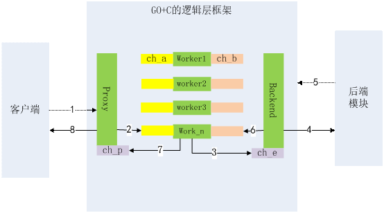

# 用C编写业务代码的GO框架设想和验证 #

C/C++有着庞大的开发群体，但是语言本身没有内置协程和RPC，虽然有一些框架自己实现了。而Go语言内置协程和RPC以及GC，又是google发明的，所以有没有可能将Go语言的内置协程和C语言的庞大业务开发群体结合起来。

## 【架构】 ##

我是想实现这么一个框架：利用GO的协程来实现线性编码异步执行，同时支持用C来写业务代码，毕竟让业务开发员新学一个开发语言，而且新社区的库可能还不怎么丰富，这个成本很高。

这个框架的架构是这样的：

1、              有三类执行流： proxy执行流，负责与客户端打交道；worker执行流（协程），负责执行本地的业务逻辑代码；backend 执行流（协程），负责与后端/外联的模块打交道。

2、              Proxy执行流负责用UDP socket接受客户端的请求，收到请求后，随便挑一个worker来出来这个请求。Proxy与worker之间使用channel通信，每个worker负责一个channel（下图中的ch_a）。

3、              Worker 执行流（协程）调用C语言函数do_business()进行业务逻辑处理，处理完后，将应答通过全局一个channel（图中的ch_p）返回给proxy，由proxy统一应答客户端

4、              业务逻辑处理过程中，如果需要使用网络外联后端模块，C函数里调用MSG_BUS_SendRequest发出请求包，然后调用MSG_BUS_RecvResponse收后端模块的应答。

5、              MSG_BUS_SendRequest是调用GO语言函数， 通过channel（下图中的 ch_e）给backend这个协程发出请求。Backend协程负责管理异步socket，向后端模块发出请求。

6、              MSG_BUS_RecvResponse是调用GO语言函数，阻塞在一个channel（下图中的ch_b）的读操作上。Backend协程收到后端模块的socket应答包，会写这个channel。

 

## 【示例代码】 ##

见附件的[test.go](code/c_in_GO/test.go)和[business.c](code/c_in_GO/business.c)

## 【性能】 ##

框架空跑情况下（即业务逻辑基本上是空的）， 用channel超时的方式模拟每个业务请求处理时延100ms， 3万个worker 协程。普通PC台式电脑

框架单进程占用cpu 10%左右， 占用内存700M， 每秒最高处理3万个客户端请求

多起几组进程可平行扩展，大概单机性能在20万/s左右。

## 结语： ##
这个其实只是重新造了个轮子（还是个未完工的简陋轮子）。spp等框架已经具备线性编码异步执行这样的特性了，c语言里也有state thread等很多用于实现协程特性的库。 做这个事情只是论证一下多一种选择，也了解一下go语言，算是跟一下潮流。