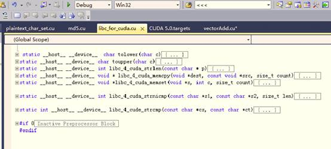
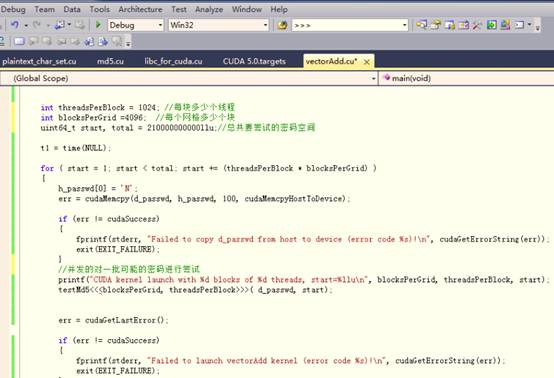
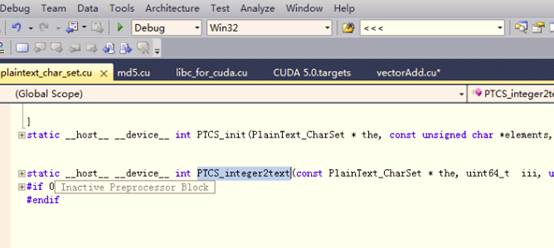
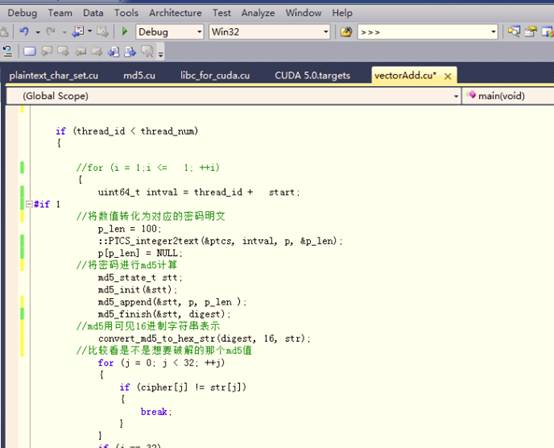
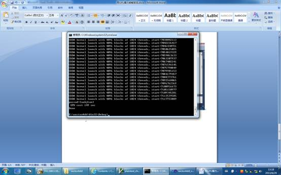

# 用GPU暴力破解密码 #

(2013年)

与CPU相比，GPU拥有大量的计算逻辑单元（一个普通的NVIDIA芯片就有768个核），适合并发的计算，例如暴力破解密码或者暴力破解密钥、构建彩虹表、分析DNA等等。

而CUDA开发框架的出现，使得GPU编程门槛相比OPENGL、DIRECTX来说要低好多。本文演示简单的对一个8位弱密码进行破解。

## 1.场景： ##

1、  已知一个密码的一次md5摘要为f07cafd04629d9b922e87f66cecd3f85

2、   且知道该密码是全小写字母组成，最长8位

3、  一个装有Geforce GTX650ti芯片GPU的电脑。你的电脑上的显卡是否支持CUDA，可以参考https://developer.nvidia.com/cuda-gpus。反正我的办公PC不支持，特意去配了个支持CUDA的显卡的主机，小贵。

4、  考虑到8位小写字母密码，也就2100亿的量，准备用GPU暴力破解

 

## 2.准备工作 ##

**2.1.安装CUDA和Visual Studio 2010**

**2.2.了解一下CUDA&GPU开发的一些概念和限制**

不展开，详细见 [CUDA初体验](cuda初体验.md)

**2.3. CUDA编程与普通C的不同之处**

 
1、  在GPU上运行的函数，体内不能定义static变量

2、  在GPU运行的代码，不能用函数指针。

3、  在GPU上运行的函数，无法进行“external call”，例如A.cu（相当于普通编程下的A.cpp）里定义函数funcA，B.cu无法#include “A.h”并调用funcA， 只能是直接在B.cu里直接#include “A.cu”，也就是把函数定义直接在B.cu里展开一份。当然更别提调用A.o里的funcA了

4、  可用的库非常少,CUDA提供了一些傅立叶变换库、数学计算库、thrust库（类似stl）等有限的几个库，memcpy、strlen等常见函数都得自己写。我是直接从libc里拷贝代码到自定义文件libc_4_cuda.cu里。用到这些函数的cu文件都在开头#include一下libc_4_cuda.cu。这个限制有点大。希望NVIDIA能提供更丰富的库。

5、  在GPU上运行的函数，不是像误解的那样只支持简单的浮点加减，可以有循环、分支等各种语句，也可以声明整数、字符串、结构体等等数据类型。这一方面的限制其实很少。

## 3.编码 ##

1、  从CUDA安装目录下找个例子，拿出来改。这样更快，因为好多设置我还没有弄明白，没法从0开始。例子很多，我用最简单的一个vectorAdd

2、  因为CUDA的库非常有限，自己造轮子，实现一组常用的函数

3、从网上下载个md5函数的源文件 :)，改名为md5.cu，用到的函数都加上__host__  __device__修饰符

4、为了方便遍历所有密码可能的值，编写一个类PlainText_char_set，该类实现了密码明文和数值之间的一一对应，例如由ABC三个字符组成的最长2字节的密码，那么密码明文依次对应一个数值：

A  -  1

B  -  2

C  -  3

AA -  4

AB -  5

AC -  6

BA -  7

BB -  8

BC -  9

CA -  10

CB -  11

CC -  12

 plainText_char_set类的一个函数就是实现数值到明文的转化

5、  暴力破解需要尝试21千亿个可能密码，并行启动100万个线程，每个线程每次对一个可能的密码进行尝试，直到找到对应的密码，或者遍历完所有的可能值。

a)         每次并行启动100万个线程，如此反复

b)         每个线程干很简单的事情：对一个可能值进行尝试

## 4.编译、运行 ##

用了不到三分钟，找到了明文密码为wabjtam，每秒钟完成4700万次尝试。当然这里不是指不到3分钟完成了21千亿次尝试，实际上只完成了71亿次。我运气比较好嘛，很早就碰到了满足条件的密码

## 5.与传统cpu破解的效率比对 ##

经过简单测试对比，发现是传统cpu方式的47倍
