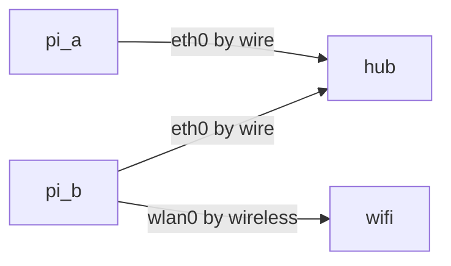

简单记录一下：

### 1 架构如下：

1. 两个树莓派通过100Mbps的Hub连接，子网为192.168.0.0/24；
2. 树莓派B另外连接wifi可以上网；树莓派a的网关设置为树莓派b



### 2 树莓派A的配置

#### 2.1 修改pi_a的用户密码、IP、路由信息：

由于ifconfig或者ip address命令修改的ip等信息，重启后会丢失，所以树莓派下直接修改文件比较好：

```bash
sudo passwd
sudo vim /etc/dhcpcd.conf #修改文件内容如下

interface eth0
static ip_address=192.168.0.8/24
static routers=192.168.0.7  # address of pi b
static domain_name_servers=114.114.114.114
```

如果ssh服务没有启动，要启动ssh

修改后，重启树莓派a。 可以查看IP和路由是否正确：

```bash
pi@raspberrypi:~ $ ip address
2: eth0: <BROADCAST,MULTICAST,UP,LOWER_UP> mtu 1500 qdisc mq state UP group default qlen 1000
    link/ether e4:5f:01:b2:7f:81 brd ff:ff:ff:ff:ff:ff
    inet 192.168.0.8/24 brd 192.168.0.255 scope global noprefixroute eth0
       valid_lft forever preferred_lft forever

pi@raspberrypi:~ $ ip route
default via 192.168.0.7 dev eth0 src 192.168.0.8 metric 202
192.168.0.0/24 dev eth0 proto dhcp scope link src 192.168.0.8 metric 202
```


### 3 树莓派B的配置

#### 3.1 连接wifi热点：

```bash
sudo vi /etc/wpa_supplicant/wpa_supplicant.conf #下面是wifi配置信息

ctrl_interface=DIR=/var/run/wpa_supplicant GROUP=netdev
update_config=1
country=CN

network={
        ssid="这里写热点名字"
        psk="这里写密码"
        key_mgmt=WPA-PSKbash
}
```

重启一下wifi设备：

```bash
ifconfig wlan0 down
ifconfig wlan0 up
```


#### 3.2 修改pi_b的用户密码、IP、路由信息

```bash
sudo passwd
sudo vim /etc/dhcpcd.conf #修改文件内容如下

interface eth0
static ip_address=192.168.0.7/24

interface wlan0
static ip_address=192.168.63.207/22
static routers=192.168.63.254
```

#### 3.3 修改pi_b为转发模式

```bash
sudo vi /etc/sysctl.conf #修改下面一行：
net.ipv4.ip_forward = 1
```

修改iptables 并保存和重启后恢复

```bash
sudo iptables -t nat -A POSTROUTING -o wlan0 -j MASQUERADE
sudo iptables -A FORWARD -i eth0 -o wlan0 -m state --state RELATED,ESTABLISHED -j ACCEPT
sudo iptables -A FORWARD -i wlan0 -o eth0 -j ACCEPT

sudo iptables-save > /etc/iptables.rules
sudo vi /etc/network/if-pre-up.d/iptables #创建并编辑这个文件内容如下两行：
#!/usr/bin/bash
sudo iptables-restore /etc/iptables.rules

sudo chmod a+x /etc/network/if-pre-up.d/iptables #让这个文件可执行
```

做完以上设置后，两个树莓派都可以远程ssh上去，并且都可以上外网，并且彼此是联通的了。

### 4 知识点汇总

主要就是这些命令/工具和相关的知识：

```bash
ip address
ip route
ifconfig 
route
iptables / iptables-save / iptables-restore
#下面这个文章不错
https://www.tecmint.com/setup-linux-as-router/
```

